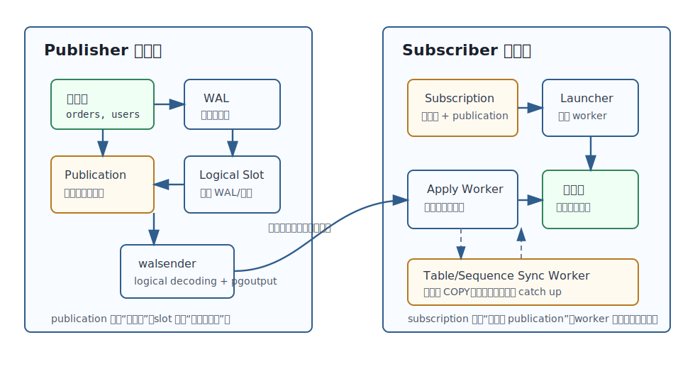
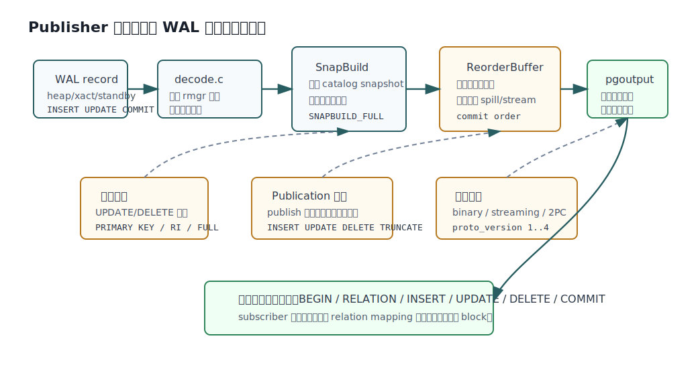
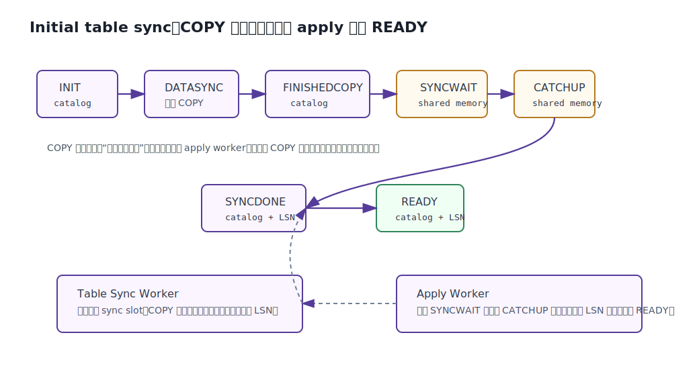
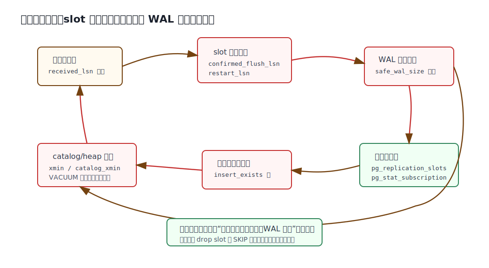

## 数据库筑基课 - PG 逻辑复制

### 作者
digoal

### 日期
2026-06-08

### 标签
PostgreSQL , 应用开发者 , 数据库筑基课 , 逻辑复制 , WAL , 复制槽 , 高可用 , 数据同步    

----

## 背景
  


这一节属于“维护机制 + 场景实践”的交叉主题。很多业务一开始把 PostgreSQL 逻辑复制理解成“另一种主从复制”，结果上线后才发现：表结构没有复制、序列可能漂移、`UPDATE`/`DELETE` 要依赖 replica identity、订阅端本地写入会产生冲突、复制槽可能保留大量 WAL。逻辑复制能解决“按表、按行、按列、跨版本、跨平台同步数据变更”的问题，但它不是物理流复制的替代品，也不是自动化 schema migration 工具。

本文以本地 PostgreSQL 源码仓库 `postgres` 为主，代码版本为 commit `01a80f0`。DeepWiki 的 `postgres/postgres` 回答用于辅助定位架构模块；关键结论回到官方文档和源码验证。主要参考：

- 官方文档：`doc/src/sgml/logical-replication.sgml`、`doc/src/sgml/logicaldecoding.sgml`、`doc/src/sgml/ref/create_publication.sgml`、`doc/src/sgml/ref/create_subscription.sgml`、`doc/src/sgml/config.sgml`。
- 源码：`src/backend/replication/logical/`、`src/backend/replication/pgoutput/pgoutput.c`、`src/backend/commands/publicationcmds.c`、`src/backend/commands/subscriptioncmds.c`。
- 测试：`src/test/subscription/`、`src/test/recovery/t/051_effective_wal_level.pl`。
- 项目 codebase 说明：`postgres/CLAUDE.md`。

如果要把逻辑复制放回数据库筑基课的大纲，它训练的是三类基础能力：理解 WAL 到逻辑变更的转换，理解复制槽与 MVCC/VACUUM/WAL 保留的边界，理解跨库同步系统里“数据一致性、延迟、冲突、运维成本”的取舍。

## 一、它解决什么问题？

物理流复制复制的是块和 WAL 字节流。它适合做同版本或兼容版本的 standby、故障恢复和读扩展，但粒度粗，通常是整个实例或整个数据库集群层面的恢复路径。业务里经常需要另一类能力：

- 只同步一部分表到下游服务，例如报表库、搜索构建库、风控库。
- 把一个库的不同业务域分发到多个订阅端。
- 把多个库的数据汇聚到一个分析库。
- 在 PostgreSQL 大版本升级时，用订阅端接收旧集群增量，缩短停机窗口。
- 在不同平台之间复制，例如 Linux 到 Windows。
- 给不同团队暴露不同数据子集，而不是暴露整个物理副本。

这些场景的共同点是：复制对象不是 block，而是“某些表、某些行、某些列上的事务性数据变化”。PostgreSQL 逻辑复制用 publish/subscribe 模型解决这个问题：publisher 定义 publication，subscriber 定义 subscription，订阅端拉取 publication 中的变更并按事务顺序应用。

代价也随之出现。逻辑复制必须把物理 WAL 解码成有业务含义的行变化，这需要输出插件、catalog snapshot、reorder buffer、复制槽和 apply worker 协同工作。它复制的是数据变化，不是完整数据库状态机：DDL、权限模型、外部对象、大对象、部分序列语义、订阅端触发器行为、冲突处理都要单独设计。



图 1 说明：publication 定义“发什么”，subscription 定义“拉什么”。逻辑复制槽记录下游消费进度并保留必要 WAL，walsender 在发布端做逻辑解码和 `pgoutput` 编码，订阅端 launcher 启动 apply、table sync、sequence sync 或 parallel apply worker。

## 二、它是什么？

PostgreSQL 逻辑复制是基于逻辑解码的事务复制机制。官方文档把它定义为：基于复制身份，复制数据对象及其变化。这里有几个关键词。

**Publication**：发布端的变更集合。它可以包含表、schema 中的表、所有表、序列，也可以配置发布哪些动作：`INSERT`、`UPDATE`、`DELETE`、`TRUNCATE`。`pg_publication` catalog 中能看到 `pubinsert`、`pubupdate`、`pubdelete`、`pubtruncate`、`puballtables`、`puballsequences`、`pubviaroot`、`pubgencols` 等字段。

**Subscription**：订阅端的连接与订阅定义。`pg_subscription` 记录连接串、slot 名、publication 列表、是否启用 binary、streaming、two-phase、failover、retain_dead_tuples、run_as_owner 等选项。launcher 进程读取 shared catalog 中的 subscription，决定启动哪些 worker。

**Logical decoding**：从 WAL 中抽取 SQL 产生的数据变化，用输出插件转成消费端能理解的格式。内置逻辑复制使用标准输出插件 `pgoutput`。

**Replication slot**：复制槽保存消费进度，防止尚未被消费者确认的 WAL 被回收。逻辑槽还会保护 catalog xmin，避免逻辑解码需要的 catalog 版本被 VACUUM 清理。

**Replica identity**：订阅端应用 `UPDATE` 和 `DELETE` 时需要定位目标行。默认是主键，也可以指定满足条件的唯一索引；没有合适 key 时可以用 `REPLICA IDENTITY FULL`，但查找代价和类型限制会变重。

一句话概括：逻辑复制把 publisher 的 WAL 变成“按事务排序的行级逻辑消息”，再在 subscriber 上用普通 DML 语义应用这些消息。

## 三、核心原理

### 1. 从 WAL 到逻辑消息：decode、snapshot、reorder、pgoutput

逻辑复制不是在业务执行 SQL 时旁路写一份变更日志。它的源头仍然是 WAL。

`src/backend/replication/logical/decode.c` 负责读取 WAL record 并根据 rmgr 类型分发。heap 记录会被识别为 insert、update、delete、truncate 等逻辑变化；xact 记录负责 commit、abort、prepare、commit prepared；standby running xacts 记录帮助构建一致性点。代码注释写得很清楚：`decode.c` 本身不应该理解太多记录语义，它把低层 WAL 记录转成 reorder buffer 和 snapbuild 能处理的形式。

`src/backend/replication/logical/snapbuild.c` 构建 catalog snapshot。逻辑解码不只是读用户表行，它还要在某个历史 LSN 上知道“这个表当时有哪些列、类型、replica identity、publication 规则”。没有合适的 snapshot，就不能安全解码。

`src/backend/replication/logical/reorderbuffer.c` 负责按事务重组变更。WAL 是按记录顺序写入的，不等于每个事务已经完整、连续、可输出。reorder buffer 会把子事务、toast、savepoint、commit order 组合起来。源码注释还说明，大事务可能超过内存限制，因此支持把 decoded changes spill 到磁盘；在支持 streaming 的场景下，也可以流式发送大事务片段。

`src/backend/replication/pgoutput/pgoutput.c` 是内置逻辑复制的标准输出插件。它注册了 begin、change、truncate、commit、message、origin filter、stream、two-phase 等 callback，把 reorder buffer 提供的变化转成逻辑复制协议消息。它还负责 publication 过滤、列列表、行过滤、分区 publish-via-root、generated column、origin 过滤、binary/streaming/two_phase 协议选项。



图 2 说明：WAL record 先被逻辑解码框架识别，再由 snapshot builder 提供 catalog 视图，reorder buffer 按事务重组，`pgoutput` 根据 publication 规则过滤并编码。subscriber 收到的是逻辑复制协议消息，不是 heap page 或 block delta。

### 2. Publication 不是表清单，而是变更选择器

publication 可以控制三个层面。

第一是对象范围：显式表、schema 下表、所有表、所有序列。`CREATE PUBLICATION` 文档说明，publication 与 schema 不同，不影响表访问方式；每张表可加入多个 publication。

第二是动作范围：默认发布 `INSERT`、`UPDATE`、`DELETE`、`TRUNCATE`，也可以只发布其中一部分。注意这只影响增量 DML，不等于影响初始数据复制。官方示例里，`publish = 'truncate'` 的 publication 仍会在 subscription 初始化时复制已有表数据。

第三是数据范围：行过滤和列列表。行过滤在发布前执行，表达式为 false 或 NULL 时不发布该行；`UPDATE` 会同时判断 old row 和 new row，必要时把 update 转换成 insert 或 delete，以保证订阅端数据符合过滤规则。列列表只发布指定列，但如果 publication 发布 `UPDATE` 或 `DELETE`，列列表必须包含 replica identity 所需列。

源码证据在 `pgoutput.c`：`RelationSyncEntry` 缓存 publication action、row filter expression state、列 bitmap、generated column 设置、publish-as relation 等。`pgoutput_row_filter()` 根据动作和 old/new tuple 决定是否发布以及是否转换动作，`logicalrep_write_insert/update/delete/truncate` 最终写出协议消息。

### 3. Subscription 是 worker 编排器，不只是连接串

`CREATE SUBSCRIPTION` 常被误解为“建一条复制连接”。实际它还会：

- 在发布端创建或绑定逻辑复制槽。
- 在订阅端记录 subscription catalog。
- 启动 apply worker。
- 对已有表启动 table sync worker 做初始复制。
- 根据配置决定是否 binary、streaming、parallel streaming、two-phase、failover、retain_dead_tuples。

`src/backend/replication/logical/worker.c` 顶部注释说明 apply worker 由 launcher 为每个启用的 subscription 启动，使用 walsender 协议与 publisher 通信。普通事务按消息处理并应用到本地表；大事务在 `streaming = on` 时会先写入临时文件，等 commit 后再应用；`streaming = parallel` 时可以交给 parallel apply worker。

`pg_subscription.h` 里的字段也能看出它不是简单连接串：`substream`、`subtwophasestate`、`subdisableonerr`、`subrunasowner`、`subfailover`、`subretaindeadtuples`、`submaxretention`、`suborigin` 都是运行时语义的一部分。

### 4. 初始同步：COPY 完只是第一步，还要追平主 apply

逻辑复制启动时，如果表已经有数据，订阅端默认要先复制初始数据。这个过程由 table sync worker 完成，而不是主 apply worker 一张表一张表串行搬。

`src/backend/replication/logical/tablesync.c` 注释给出了完整状态机：

`INIT -> DATASYNC -> FINISHEDCOPY -> SYNCWAIT -> CATCHUP -> SYNCDONE -> READY`

其中 `INIT`、`DATASYNC`、`FINISHEDCOPY`、`SYNCDONE`、`READY` 会记录在 `pg_subscription_rel`；`SYNCWAIT` 和 `CATCHUP` 只用于共享内存协调。table sync worker 先创建自己的同步 slot 并 COPY 初始快照，然后进入等待；apply worker 发现它等待后给出 catchup 位置；sync worker 读取并应用 COPY 期间发生的变化，追到指定 LSN 后标记 `SYNCDONE`；apply worker 自己也到达该 LSN 后，才把该表标记为 `READY` 并交回正常 apply。



图 3 说明：初始同步不是“把表 COPY 一遍”那么简单。COPY 时 publisher 仍可能继续写入，所以 table sync worker 需要一个同步点和临时复制槽，把 COPY 期间产生的变化追上；主 apply worker 到达同一位置后，表才进入 `READY`。

### 5. 复制槽：进度保险和资源压力是一体两面

逻辑复制槽的基本作用是保存消费进度，避免发布端把订阅端还没收到的 WAL 删除。`pg_replication_slots` 中最该关注的是：

- `restart_lsn`：该 slot 可能还需要的最早 WAL。
- `confirmed_flush_lsn`：逻辑 slot 消费者确认收到的位置。
- `wal_status`、`safe_wal_size`：slot 对 WAL 可用性的影响。
- `xmin`、`catalog_xmin`：slot 对 heap/catalog 清理的影响。
- `invalidation_reason`：slot 是否因为 `wal_removed`、`rows_removed`、`wal_level_insufficient`、`idle_timeout` 等原因失效。
- `failover`、`synced`：failover slot 同步相关状态。

这也是逻辑复制最容易踩的坑：slot 保护了你不丢 WAL，但下游长期断开或卡住时，它也会让 WAL 不断保留，甚至让 catalog tuple 无法清理。

PostgreSQL 当前源码还有一个值得注意的新语义：显式 `wal_level` 可以设置为 `replica` 或 `logical` 来支持复制 slot；`effective_wal_level` 会在 `wal_level = replica` 且存在逻辑 slot 时显示为 `logical`。`src/backend/replication/logical/logicalctl.c` 的注释说明，逻辑解码在两种条件下变为 active：`wal_level = logical`，或者 `wal_level = replica` 且至少有一个逻辑 slot。官方 quick setup 仍推荐直接设置 `wal_level = logical`，这在生产配置上更清晰。



图 4 说明：订阅端延迟会让 slot 进度不前，进而保留 WAL 和 catalog 版本；冲突或权限错误会让 apply worker 停止，延迟继续扩大。监控时要把 `pg_stat_subscription`、`pg_stat_subscription_stats`、`pg_replication_slots`、日志中的冲突 LSN 放在一起看。

## 四、横向对比

| 维度 | 逻辑复制 | 物理流复制 | 触发器/应用双写 | CDC 外部工具 |
|---|---|---|---|---|
| 复制粒度 | publication 中的表、列、行、动作 | WAL/block 级，通常是整个集群 | 应用定义，通常按业务事件 | 工具定义，可表级或库级 |
| 跨大版本 | 支持典型跨版本同步场景 | 受版本兼容限制 | 取决于应用协议 | 取决于工具 |
| DDL 复制 | 不复制，需要手工同步 | 物理状态一起复制 | 应用自己处理 | 工具能力差异大 |
| 事务顺序 | 单个 subscription 内保证 publication 的事务顺序 | 物理 WAL 顺序 | 容易被应用重试/并发打乱 | 取决于实现 |
| 延迟来源 | 解码、网络、apply、冲突、锁 | WAL 传输和 replay | 应用路径和队列 | 解码、任务调度、下游写入 |
| 下游可写 | 可以，但会有冲突风险 | standby 通常只读 | 可以，冲突由业务处理 | 取决于目标系统 |
| 运维风险 | slot 保留 WAL/catalog、schema drift、冲突 | standby 延迟、同步提交、recovery 冲突 | 双写不一致、补偿复杂 | 工具链复杂、格式兼容 |
| 适合场景 | 数据分发、跨版本升级、部分表同步、读模型构建 | HA、灾备、只读副本 | 强业务事件、非数据库中心同步 | 异构系统、Kafka/湖仓链路 |
| 不适合场景 | 完整灾备替代、自动 DDL、无主键大表频繁更新 | 部分表分发、跨平台数据子集 | 强一致数据库复制 | 不允许外部基础设施 |

这张表背后的核心原因是复制层次不同。物理复制保证的是存储层状态一致，逻辑复制保证的是选定对象的事务变更一致。触发器/应用双写和外部 CDC 更灵活，但一致性、重试、幂等、回放边界往往要由业务或工具额外承担。

## 五、效果如何？

逻辑复制的收益主要有四个。

第一是粒度控制。publication 可以按表、schema、列、行过滤和 DML 动作控制下游看到什么。对“多个业务方共享一份数据库，但每个下游只需要一部分数据”的场景，这是物理复制无法提供的能力。

第二是事务一致性。官方文档说明，subscriber 按 publisher 的顺序应用数据，单个 subscription 内 publication 的事务一致性有保证。这个边界很重要：如果同一组表被多个 subscription 重叠订阅，或者 subscriber 本地也写同一批表，冲突和顺序就要自己设计。

第三是跨版本/跨平台能力。逻辑消息不依赖物理 block 地址，因此可用于不同 PostgreSQL 大版本之间的数据迁移和平台迁移。实际升级方案仍需要处理 schema、扩展版本、序列、复制槽、切流窗口。

第四是可扩展的解码基础设施。`pgoutput` 是内置逻辑复制用的输出插件，但 `logicaldecoding.sgml` 也说明可以编写自定义 output plugin，以不同格式消费变更。

代价同样明确。

- 写入端需要保留更多 WAL 信息，`wal_level`、slot、logical decoding 都会带来额外开销。
- 大事务会给 reorder buffer、磁盘 spill、streaming 和 apply 带来压力，`logical_decoding_work_mem` 与 subscription 的 `streaming` 设置需要结合 workload 调整。
- `UPDATE`/`DELETE` 依赖 replica identity。没有主键或合适唯一索引时，`REPLICA IDENTITY FULL` 可能让订阅端查找成本变高。
- schema 不自动同步。列增加、类型变化、分区变化、约束变化需要按正确顺序发布，否则 apply 会报错。
- 冲突会停止复制或记录日志。`insert_exists`、`update_exists`、`multiple_unique_conflicts` 等约束冲突会导致 worker 报错，必须人工修复或跳过事务。

## 六、实操 DEMO

下面给出一个最小可验证实验。本文没有在本机启动 PostgreSQL 集群执行这些 SQL，因此不提供伪造输出；SQL 语法来自官方 quick setup、subscription regression test 和本地源码文档。

### 1. 发布端配置

生产建议显式设置：

```conf
wal_level = logical
max_replication_slots = 10
max_wal_senders = 10
```

当前源码也支持在 `wal_level = replica` 且存在逻辑 slot 时让 `effective_wal_level` 变为 `logical`。但对工程协作而言，显式 `wal_level = logical` 更容易被 DBA、巡检脚本和容量规划理解。

`pg_hba.conf` 要允许订阅端连接：

```conf
host    all    repl_user    10.0.0.0/8    scram-sha-256
```

发布端建表、授权、发布：

```sql
CREATE ROLE repl_user WITH LOGIN REPLICATION PASSWORD 'replace_with_secret';

CREATE TABLE public.orders (
    tenant_id bigint NOT NULL,
    order_id bigint NOT NULL,
    user_id bigint NOT NULL,
    status text NOT NULL,
    amount numeric(12,2) NOT NULL,
    updated_at timestamptz NOT NULL DEFAULT now(),
    PRIMARY KEY (tenant_id, order_id)
);

GRANT CONNECT ON DATABASE appdb TO repl_user;
GRANT USAGE ON SCHEMA public TO repl_user;
GRANT SELECT ON public.orders TO repl_user;

CREATE PUBLICATION pub_orders
FOR TABLE public.orders (tenant_id, order_id, user_id, status, amount, updated_at)
WHERE (tenant_id = 1001)
WITH (publish = 'insert, update, delete');
```

验证 publication：

```sql
SELECT pubname, pubinsert, pubupdate, pubdelete, pubtruncate
FROM pg_publication
WHERE pubname = 'pub_orders';

SELECT schemaname, tablename
FROM pg_publication_tables
WHERE pubname = 'pub_orders';
```

### 2. 订阅端准备 schema

逻辑复制不复制 schema，所以订阅端必须先建好兼容表。列顺序可以不同，但列名要能匹配，类型要能转换。

```sql
CREATE TABLE public.orders (
    tenant_id bigint NOT NULL,
    order_id bigint NOT NULL,
    user_id bigint NOT NULL,
    status text NOT NULL,
    amount numeric(12,2) NOT NULL,
    updated_at timestamptz NOT NULL,
    loaded_at timestamptz NOT NULL DEFAULT now(),
    PRIMARY KEY (tenant_id, order_id)
);
```

创建 subscription：

```sql
CREATE SUBSCRIPTION sub_orders
CONNECTION 'host=publisher.example.com port=5432 dbname=appdb user=repl_user password=replace_with_secret application_name=sub_orders'
PUBLICATION pub_orders
WITH (
    copy_data = true,
    create_slot = true,
    enabled = true,
    streaming = on
);
```

### 3. 观察同步状态

订阅端：

```sql
SELECT subname, worker_type, relid::regclass, received_lsn, latest_end_lsn
FROM pg_stat_subscription
WHERE subname = 'sub_orders';

SELECT srrelid::regclass, srsubstate, srsublsn
FROM pg_subscription_rel
WHERE srsubid = (
    SELECT oid
    FROM pg_subscription
    WHERE subname = 'sub_orders'
);
```

发布端：

```sql
SELECT slot_name, plugin, slot_type, database, active,
       restart_lsn, confirmed_flush_lsn, wal_status, safe_wal_size,
       xmin, catalog_xmin, invalidation_reason
FROM pg_replication_slots
WHERE slot_name = 'sub_orders';
```

如果要估算 slot 保留的 WAL 距离：

```sql
SELECT slot_name,
       pg_size_pretty(pg_wal_lsn_diff(pg_current_wal_lsn(), restart_lsn)) AS retained_from_restart,
       pg_size_pretty(pg_wal_lsn_diff(pg_current_wal_lsn(), confirmed_flush_lsn)) AS unconfirmed_distance
FROM pg_replication_slots
WHERE slot_type = 'logical';
```

### 4. 验证 replica identity 风险

没有主键的表只发布 insert 通常没问题，但发布 update/delete 会出问题。建议测试：

```sql
CREATE TABLE public.no_key_demo (id bigint, payload text);
CREATE PUBLICATION pub_no_key FOR TABLE public.no_key_demo
WITH (publish = 'insert, update, delete');

INSERT INTO public.no_key_demo VALUES (1, 'a');

-- 这类 UPDATE/DELETE 对逻辑复制不安全。正确做法是补主键或 replica identity。
ALTER TABLE public.no_key_demo ADD PRIMARY KEY (id);
```

如果无法补主键，只能权衡：

```sql
ALTER TABLE public.no_key_demo REPLICA IDENTITY FULL;
```

这会让整行参与定位。对宽表、无合适索引、高频更新表，要谨慎压测。

## 七、最佳实践

### 面向数据库架构师

把逻辑复制当成“数据产品接口”，不要当成低成本镜像。先定义下游的所有权：下游是否只读？是否允许本地写？冲突时谁赢？是否允许跳过事务？如果下游可写，必须明确 conflict policy 和人工修复流程。

publication 粒度尽量按业务边界拆，而不是一个大 publication 覆盖所有表。跨表事务一致性强相关的表放在同一个 subscription；无关下游不要重叠订阅同一批表。

跨版本升级时，先把 schema、扩展、权限、序列、触发器、RLS、复制槽和切流脚本写成 runbook。逻辑复制只能降低数据追平窗口，不能替你解决所有版本差异。

### 面向 DBA

优先保证每个发布表有主键或合适 replica identity。`REPLICA IDENTITY FULL` 是兜底，不是默认方案。

监控必须覆盖发布端和订阅端。发布端看 `pg_replication_slots`、`pg_stat_replication`、WAL 目录增长、`catalog_xmin`；订阅端看 `pg_stat_subscription`、`pg_stat_subscription_stats`、`pg_subscription_rel`、错误日志。

设置 WAL 护栏。结合业务 RPO 和磁盘容量配置 `max_slot_wal_keep_size`、`idle_replication_slot_timeout`、告警阈值和处理流程。slot 卡住时不要第一反应 drop slot；先判断是否能恢复、是否需要重建 subscription、是否接受丢失未消费变更。

schema 变更按“订阅端先兼容，发布端后切换”的原则做。添加可空列或有默认值列通常先在订阅端加；删除列、改类型、改 replica identity 要单独演练。

### 面向业务开发者

不要在 subscriber 上随意写复制表。逻辑复制 apply 是普通 DML 语义，本地唯一约束、触发器、RLS、权限都可能让复制停下来。

理解初始复制和增量复制的差异。publication 的 `publish` 只限制增量 DML，不限制初始表 COPY；行过滤和列列表在不同版本和多 publication 组合下也有细节。上线前必须用真实样本验证。

大批量更新、长事务、一次性迁移 SQL 会直接影响逻辑解码和 apply 延迟。批处理要控制事务大小，避免让 reorder buffer、临时文件和订阅端锁等待成为瓶颈。

## 八、适合与不适合场景

适合：

- 把核心 OLTP 的部分表同步到报表、搜索、推荐、风控等读模型库。
- 需要按租户、状态、业务域过滤数据的分发场景。
- PostgreSQL 大版本升级或平台迁移，需要减少停机窗口。
- 多源合并到分析库，但能接受 schema 与冲突由工程流程管理。
- 构建审计、缓存刷新、异步处理等基于数据变更的链路。

不适合：

- 用它替代物理灾备。完整实例恢复、时间线、文件级一致性仍应靠物理备份、归档和流复制。
- 希望自动复制 DDL、扩展对象、权限、RLS 策略、外部表、大对象。
- 下游也频繁写同一组表，而且没有清晰冲突策略。
- 无主键宽表高频更新，且不能接受 `REPLICA IDENTITY FULL` 成本。
- 对延迟极端敏感，但不能控制大事务、锁等待、网络、下游写入性能。

## 九、常见坑

**坑 1：忘记 schema 不复制。**  
DDL 不会自动传到 subscriber。先在订阅端准备表结构，再创建或刷新 subscription。上线后 schema migration 要有双端顺序。

**坑 2：把 publish 当成初始复制过滤。**  
`publish = 'insert'` 之类只影响增量 DML，初始 COPY 仍会复制已有数据。行过滤和列列表才是数据范围工具，但也要验证多 publication 组合。

**坑 3：没有 replica identity 却发布 update/delete。**  
发布端执行相关 DML 可能报错，或者订阅端定位成本极高。设计表时把“会被逻辑复制更新/删除”作为主键设计输入。

**坑 4：slot 长期 inactive 导致 WAL 爆。**  
subscription 停了，slot 可能继续保留 WAL。用 `pg_replication_slots` 监控 `restart_lsn`、`wal_status`、`safe_wal_size`、`inactive_since`。

**坑 5：在 subscriber 上写复制表。**  
唯一约束冲突会让 worker 停止，update/delete missing 会记录冲突并跳过。除非明确做多主或冲突解决，否则复制表应由 subscriber 只读使用。

**坑 6：忽略序列。**  
当前文档说明增量 sequence changes 不像表 DML 那样持续复制。需要发布序列并用 `ALTER SUBSCRIPTION ... REFRESH SEQUENCES` 或切流前手工校准。

**坑 7：TRUNCATE 与外键集合不一致。**  
逻辑复制支持 TRUNCATE，但如果发布端和订阅端参与外键关系的表集合不一致，订阅端 apply 可能失败。

**坑 8：大事务拖垮延迟。**  
大事务必须先解码、重组、可能 spill 或 streaming，再由订阅端应用。批处理要拆事务，或者结合 `logical_decoding_work_mem` 与 `streaming` 调参。

## 十、扩展问题

1. 如果一个业务表没有主键，但只做 append-only，同步到下游后需要去重，publication 应该只发布 insert，还是补业务唯一键？
2. 跨版本升级时，哪些 schema 变更必须先在新集群执行，哪些必须等切流后执行？
3. 如果 subscriber 本地有触发器，哪些应该保持默认不触发，哪些需要 `ENABLE REPLICA TRIGGER`？
4. 多个 subscription 订阅同一 publisher 时，如何按事务一致性要求划分 publication？
5. slot 失效后，是重建 subscription、手工补数据，还是用备份恢复订阅端？决策依据是什么？

## 十一、扩展阅读

- PostgreSQL 官方文档：`doc/src/sgml/logical-replication.sgml`，逻辑复制概念、publication、subscription、conflict、restriction、architecture、monitoring、quick setup。
- PostgreSQL 官方文档：`doc/src/sgml/logicaldecoding.sgml`，逻辑解码、replication slot、`pgoutput`、output plugin callback。
- PostgreSQL 官方文档：`doc/src/sgml/ref/create_publication.sgml`、`doc/src/sgml/ref/create_subscription.sgml`。
- PostgreSQL 官方文档：`doc/src/sgml/config.sgml`，`wal_level`、`effective_wal_level`、`logical_decoding_work_mem`、`max_replication_slots`、`max_wal_senders`、subscriber worker 参数。
- PostgreSQL 源码：`src/backend/replication/logical/decode.c`、`snapbuild.c`、`reorderbuffer.c`、`worker.c`、`tablesync.c`、`slotsync.c`。
- PostgreSQL 源码：`src/backend/replication/pgoutput/pgoutput.c`、`src/backend/replication/logical/proto.c`、`src/include/replication/logicalproto.h`。
- PostgreSQL catalog：`src/include/catalog/pg_publication.h`、`pg_subscription.h`、`pg_subscription_rel.h`。
- PostgreSQL 测试：`src/test/subscription/t/001_rep_changes.pl`、`src/test/subscription/t/011_generated.pl`、`src/test/recovery/t/051_effective_wal_level.pl`。
- DeepWiki：`postgres/postgres` 的 “Logical Replication System” 相关页面，用作架构索引；本文核心结论已回到本地源码和官方文档校验。
  
## 附录 
1、克隆代码  
```  
git clone --depth 1 https://github.com/postgres/postgres
```  
  
2、启用 codex, 使用 [数据库筑基课 skill](../skills/README.md).  
```
文章标题: 
  数据库筑基课 - PG 逻辑复制
项目源码(本地目录): 
  postgres
项目 codebase 文件名: 
  postgres/CLAUDE.md 
开源项目相关的 deepwiki repoName: 
  postgres/postgres
```
  
  
  
#### [PostgreSQL 解决方案集合](../201706/20170601_02.md "40cff096e9ed7122c512b35d8561d9c8")
  
  
#### [德哥 / digoal's Github - 公益是一辈子的事.](https://github.com/digoal/blog/blob/master/README.md "22709685feb7cab07d30f30387f0a9ae")
  
  
#### [About 德哥](https://github.com/digoal/blog/blob/master/me/readme.md "a37735981e7704886ffd590565582dd0")
  
  

  
