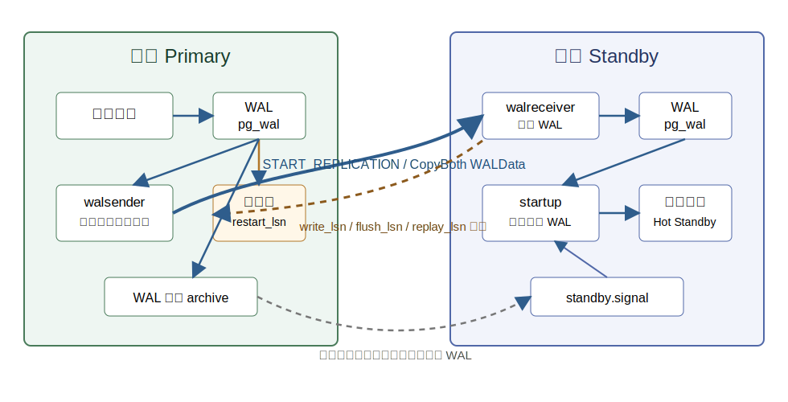
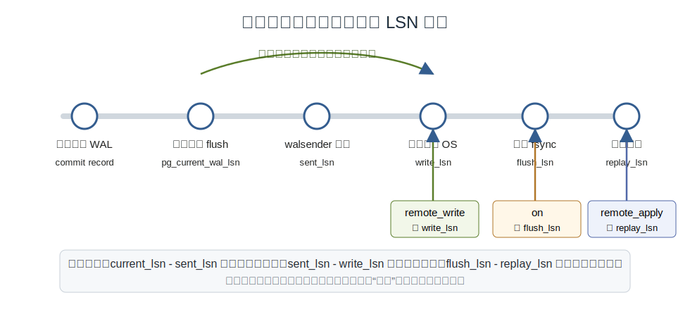
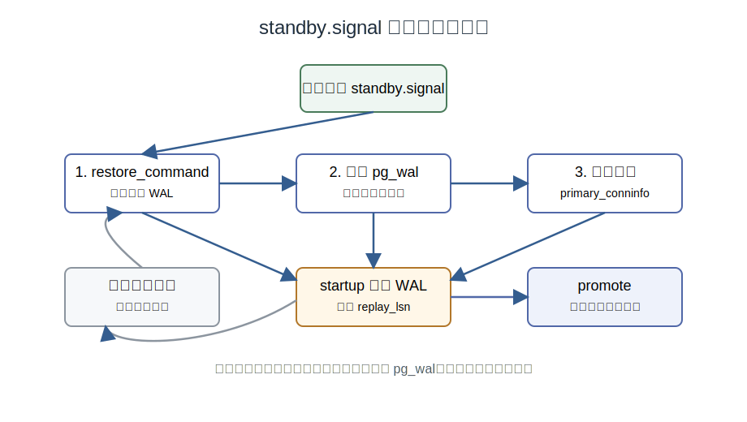
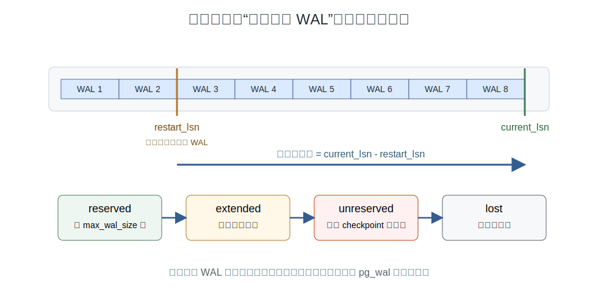
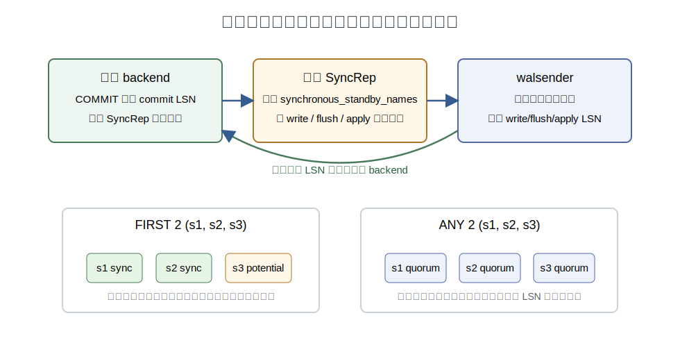

## 数据库筑基课 - PG 物理复制

### 作者
digoal

### 日期
2026-06-08

### 标签
PostgreSQL , 应用开发者 , 数据库筑基课 , 物理复制 , 流复制 , 高可用 , WAL , 复制槽    

----

## 背景
  


这一节属于“高可用 + 恢复机制 + 场景实践”的基础能力。很多人第一次搭 PostgreSQL 主备时，会把物理复制理解成“把主库的数据文件实时复制到备库”。这个说法只对了一半。真正的核心不是复制数据页，而是复制 WAL：主库把变更先写成 WAL，备库持续接收这些 WAL，再用恢复进程按顺序重放，最后得到一个和主库二进制兼容、事务一致的整库副本。

业务上它解决三个很硬的问题：

- 主库宕机后，能否在较小数据损失窗口内切到备库。
- 读请求能否从主库分流到只读备库。
- 备份、灾备、跨机房容灾能否建立在连续 WAL 流上，而不是只靠低频全量备份。

本文主要参考本地 PostgreSQL 源码和文档：

- 官方文档：`postgres/doc/src/sgml/high-availability.sgml`、`config.sgml`、`monitoring.sgml`、`protocol.sgml`、`system-views.sgml`、`func/func-admin.sgml`。
- 核心源码：`postgres/src/backend/replication/walsender.c`、`walreceiver.c`、`slot.c`、`slotfuncs.c`、`syncrep.c`、`repl_gram.y`。
- 测试用例：`postgres/src/test/recovery/t/001_stream_rep.pl`、`007_sync_rep.pl`、`019_replslot_limit.pl`、`047_checkpoint_physical_slot.pl`。
- DeepWiki：`postgres/postgres` 的 Replication and High Availability 页面用于辅助梳理架构；关键结论均回到本地源码和官方文档核对。

## 一、它解决什么问题？

物理复制解决的是“数据库状态如何持续、顺序、可恢复地复制到另一台机器”的问题。

如果只做周期性全量备份，RPO 取决于备份间隔，故障时会丢掉最后一次备份之后的所有事务。如果只做文件级复制，又很容易遇到一致性问题：数据库文件不是静态文件，后台写入、检查点、hint bit、FSM/VM、事务状态文件都在变化。PostgreSQL 的答案是 WAL 优先：只要备库从一个合法 base backup 起步，并按顺序重放之后的 WAL，就能恢复到某个一致 LSN。

这把问题从“复制一堆随时变化的数据文件”转化成了“保住一条连续 WAL 流”。转化以后，好处很明显：

- 主库提交路径已经以 WAL 为恢复事实来源，复制 WAL 与崩溃恢复模型一致。
- WAL 是顺序追加日志，比随机复制数据页更适合传输、归档和追赶。
- 备库重放 WAL 后可以打开 Hot Standby，只读查询与恢复重放并存。
- 同步复制可以把提交确认点从“主库本地落盘”扩展到“备库写入、刷盘或重放”。

代价也必须提前说清楚：

- 物理复制是整库、同版本/同数据目录格式复制，不是表级选择性同步。
- 备库处于恢复状态，通常只能只读，不能同时承担独立写入。
- 复制延迟、网络带宽、备库 IO 和重放速度都会影响 RPO、读新鲜度和同步提交延迟。
- 复制槽能防止 WAL 过早删除，但也可能让主库 `pg_wal` 被落后备库拖爆。
- 故障切换不是物理复制本身自动完成的事情，仍需要外部 HA 管理、监控、仲裁和客户端重连策略。

## 二、它是什么？

PG 物理复制可以定义为：一个 standby 从 primary 的 base backup 起步，进入 recovery/standby 模式，持续从归档、本地 `pg_wal` 或上游 `walsender` 获取 WAL，并由 `startup` 进程重放 WAL，从而维护一个与上游物理一致的数据库集群副本。

几个关键词必须分清：

| 术语 | 含义 | 对工程实践的影响 |
|---|---|---|
| primary | 产生写事务和 WAL 的上游节点 | 需要配置 `wal_level`、`max_wal_senders`、认证和可选归档/复制槽 |
| standby | 处于恢复模式的下游节点 | 通过 `standby.signal`、`primary_conninfo`、`primary_slot_name` 等接收 WAL |
| WAL | Write-Ahead Log，恢复和复制的事实来源 | 复制是否可追上，取决于所需 WAL 是否还在归档、`pg_wal` 或槽保护范围内 |
| LSN | WAL 位置 | 监控复制延迟和同步提交等待都围绕 sent/write/flush/replay LSN |
| timeline | 提升或恢复目标切换后的 WAL 历史分支 | failover 后必须处理 timeline history，避免接错历史 |
| walsender | primary 上每条复制连接对应的发送进程 | `pg_stat_replication` 每行对应一个 WAL sender |
| walreceiver | standby 上连接上游并接收 WAL 的进程 | `pg_stat_wal_receiver` 展示接收状态 |
| startup | standby 上执行 WAL recovery/replay 的进程 | 决定数据何时对只读查询可见 |
| replication slot | 上游保存复制进度的持久状态 | 防止 WAL/xmin 提前清理，同时引入空间保留风险 |
| synchronous replication | 让提交等待指定 standby 反馈 | 提升确认级别，但增加提交延迟和阻塞风险 |

物理复制不是逻辑复制。逻辑复制按表、发布订阅和逻辑变更流工作，可以异构结构和选择性同步；物理复制按 WAL 物理记录恢复，目标是整库副本、故障恢复和读扩展。两者都可能用复制协议和复制槽，但语义边界完全不同。

## 三、核心原理

### 1. 从 base backup 到 standby mode

搭物理复制时，standby 不能凭空开始。它必须先有一个可恢复的 base backup，然后在数据目录放置 `standby.signal`。官方文档说明：服务器启动时如果数据目录存在 `standby.signal`，就进入 standby mode；在这个模式下，服务器持续应用从主库收到的 WAL。

备库找 WAL 的顺序不是只看网络。文档里的恢复循环是：

1. 先用 `restore_command` 从归档取 WAL。
2. 归档没有时，尝试本地 `pg_wal`。
3. 如果配置了流复制，再通过 `primary_conninfo` 连接上游，从最后一个有效 WAL 位置开始 streaming。
4. 如果流复制失败或断开，再回到归档和本地 `pg_wal` 重试。
5. 直到服务器停止或被 promote。

这解释了为什么生产环境常把“归档 + 流复制 + 复制槽”组合使用：流复制降低延迟，归档提供长时间追赶后路，复制槽保护活跃或短暂离线 standby 所需的 WAL。



图 1 说明：业务事务在主库生成 WAL，`walsender` 通过复制协议把 WAL 发给备库 `walreceiver`；备库先写入本地 `pg_wal`，再由 `startup` 进程重放。复制槽和归档不直接“复制数据”，它们保护的是追赶所需的 WAL 连续性。

### 2. walsender：复制连接上的特殊 backend

`walsender.c` 的文件头把职责说得很清楚：`walsender` 在 primary 上负责把 XLOG/WAL 发给一个接收者；一个复制连接对应一个 `walsender`；它不处理普通 SQL，而是理解一小组 replication-mode commands。`START_REPLICATION` 之后，`walsender` 进入 Copy 协议模式，持续从磁盘读取 WAL 并发送给 standby。

协议入口在 `repl_gram.y` 和 `protocol.sgml` 中能对应起来，物理复制常见命令包括：

- `IDENTIFY_SYSTEM`：确认 system identifier、当前 timeline 等。
- `CREATE_REPLICATION_SLOT ... PHYSICAL`：创建物理复制槽。
- `READ_REPLICATION_SLOT`：读取槽状态。
- `START_REPLICATION [SLOT slot] [PHYSICAL] lsn [TIMELINE tli]`：从指定 LSN 和 timeline 开始发 WAL。
- `TIMELINE_HISTORY`：获取 timeline 切换历史。
- `BASE_BACKUP`：通过复制连接拉取基础备份。

`StartReplication()` 中有几个关键动作：

- 如果指定了 slot，先 acquire slot，并禁止用 logical slot 做 physical replication。
- 选择发送 timeline：如果当前 server 自己也在恢复中，说明它可能是级联复制的中间 standby。
- 校验请求的起点不能超过本机已 flush 的 WAL。
- 把 `WalSnd` 状态先置为 `catchup`，进入 CopyBothResponse，再调用 `WalSndLoop(XLogSendPhysical)`。
- 当已经追平且没有待发数据时，把状态从 `catchup` 切为 `streaming`。这个状态对同步复制和监控都重要。

### 3. walreceiver：接收、写入、刷盘、反馈

`walreceiver.c` 的文件头同样给出主线：当 startup 进程认为该开始 streaming 时，会让 postmaster 启动 `walreceiver`；`walreceiver` 连接 primary 的 `walsender`，持续接收 XLOG 记录并写入磁盘；收到并 flush 后更新共享内存里的 `WalRcv->flushedUpto`，让 startup 知道可以重放到哪里。

`WalReceiverMain()` 的路径可以拆成几步：

1. 从共享内存取 `conninfo`、`slotname`、`receiveStart` 和 `receiveStartTLI`。源码注释强调，`walreceiver` 不能直接加载建立连接所需的 GUC，而是依赖 startup 传下来的参数。
2. 动态加载 `libpqwalreceiver`，避免服务器主体直接链接 libpq。
3. 连接上游后执行 `IDENTIFY_SYSTEM`，校验 primary 和 standby 的 system identifier 是否一致。
4. 检查 timeline，必要时拉取缺失的 timeline history 文件。
5. 如果请求临时槽，则创建临时物理复制槽。
6. 调用 `walrcv_startstreaming()`，开始接收物理 WAL。

收到消息后，`XLogWalRcvProcessMsg()` 区分两类消息：

- `PqReplMsg_WALData`：解析 `dataStart`、`walEnd`、`sendTime`，然后调用 `XLogWalRcvWrite()` 写 WAL。
- `PqReplMsg_Keepalive`：更新上游 WAL end 信息；如果 primary 要求回复，立即发送状态反馈。

`XLogWalRcvWrite()` 负责按 WAL segment 写入本地文件，更新 `LogstreamResult.Write` 和共享内存 `writtenUpto`；`XLogWalRcvFlush()` 负责 fsync，更新 `flushedUpto`，唤醒 recovery，并在允许级联复制时唤醒本机 `walsender`。这就是级联复制能工作的关键：一个 standby 在接收并 flush 上游 WAL 后，也可以把 WAL 发给下游。



图 2 说明：物理复制不是一个单点状态，而是一串 LSN。`sent_lsn` 看主库发到哪里，`write_lsn` 看备库写到哪里，`flush_lsn` 看备库 fsync 到哪里，`replay_lsn` 看备库应用到哪里。`synchronous_commit=remote_write/on/remote_apply` 等待的就是这条管线上的不同点。

### 4. standby recovery loop：网络不是唯一后路

物理复制最容易被忽略的一点是：standby 的恢复循环优先从归档和本地 `pg_wal` 找 WAL，网络 streaming 只是其中一个来源。官方文档明确说，断开后 standby 会回到归档、本地 `pg_wal`、流复制的循环中，直到停止或提升。

这个设计把 HA 的可靠性拆成了多层：

- 归档是长追赶后路。只要归档完整，standby 即使离线很久，也可以慢慢追。
- 本地 `pg_wal` 是重启后的快速恢复来源。之前已接收但未重放的 WAL 不需要重新拉。
- streaming 是低延迟来源。它不等 WAL segment 填满，而是在 WAL 生成时持续发送。
- promote 是退出恢复的边界。提升前会尽量应用已有归档和本地 WAL，但提升动作本身不会继续连接原 primary。



图 3 说明：`standby.signal` 让数据库进入恢复循环。只要下一段 WAL 找不到，就回到循环重试；只要被 promote，就退出 standby mode 成为可写主库。timeline 管理就是为了让提升后的新历史可被其他节点正确追随。

### 5. 复制槽：可靠追赶和空间风险是一件事

复制槽的本质是“上游记住某个消费者还需要哪些东西”。`slot.c` 的文件头说明：复制槽用于保存 replication stream 的状态，主要目的是防止 WAL 或旧 tuple version 被过早移除；槽必须持久、crash-safe，并且要能在 standby 上分配以支持级联场景。每个槽在 `$PGDATA/pg_replslot` 下有自己的目录和状态文件，运行时也会缓存在共享内存中。

物理槽最常看的字段在 `pg_replication_slots`：

- `slot_type = physical`：物理槽。
- `active` / `active_pid`：是否正被连接使用。
- `restart_lsn`：这个槽的消费者可能还需要的最旧 WAL 位置。
- `xmin` / `catalog_xmin`：槽需要保留的事务可见性边界。
- `wal_status`：`reserved`、`extended`、`unreserved`、`lost`。
- `safe_wal_size`：在 `max_slot_wal_keep_size` 限制下，还能写多少 WAL 才进入危险区。
- `inactive_since`：槽从何时开始 inactive，和 `idle_replication_slot_timeout` 相关。

`pg_create_physical_replication_slot()` 会创建物理槽；如果要求 `immediately_reserve`，会调用 `ReplicationSlotReserveWal()` 立即保留 WAL 并保存槽状态。`pg_replication_slot_advance()` 可以推进物理槽的 `restart_lsn`，但源码限制它不能超过本机已 flush 或已 replay 的位置，也不能向后退。

最重要的运维边界在 `max_slot_wal_keep_size`。官方文档说明：默认 `-1` 时，复制槽可以无限保留 WAL；如果设置了非负值，当槽的 `restart_lsn` 落后当前 LSN 超过这个大小，使用该槽的 standby 可能因为所需 WAL 被移除而无法继续复制。`019_replslot_limit.pl` 专门测试了这个过程：槽先从 `reserved` 到 `extended`，再到 `unreserved`，最终在 checkpoint 后进入 `lost`，standby 日志会出现 slot 因 `wal_removed` 失效的错误。



图 4 说明：复制槽让 `restart_lsn` 成为“不能删”的下界。好处是 standby 短暂离线后仍能追；坏处是如果 standby 长期不回来，主库会为了它保留越来越多 WAL。`max_slot_wal_keep_size` 是把无限空间风险变成明确失效边界的工具。

### 6. 同步复制：主库等待反馈，不是备库知道事务重要性

默认 streaming replication 是异步的。主库提交后不等备库，因此故障时可能丢失尚未传到备库的 WAL。同步复制把提交确认延后到指定 standby 的反馈点。

`syncrep.c` 的文件头说明了设计关键：同步复制的等待和释放逻辑都在 primary 上；standby 不知道 primary 上每个事务的耐久性要求，也不需要接收每事务状态。standby 只持续报告 write/flush/apply 位置；primary 根据 `synchronous_standby_names`、`synchronous_commit` 和这些反馈决定是否释放正在等待的 backend。

`synchronous_standby_names` 有两种现代语义：

- `FIRST n (s1, s2, s3)`：优先级模式。列表靠前的 standby 优先成为 sync；前面的断开，后面的 potential 顶上。
- `ANY n (s1, s2, s3)`：法定人数模式。列表里的 standby 都是 quorum candidate，只要任意 n 个达到目标即可释放提交。

`synchronous_commit` 决定等到哪里：

- `remote_write`：standby 已收到并写入操作系统，但未必 fsync。
- `on`：standby 已写入并 flush 到持久存储。
- `remote_apply`：standby 已 replay，事务对只读查询可见。
- `local` 或 `off`：不等待同步复制反馈，适合低价值或可补偿写入。



图 5 说明：同步复制的风险不是“慢一点”这么简单。如果 `synchronous_standby_names` 要求的 standby 数量无法满足，相关提交可能一直等待。生产上要么保留足够候选 standby，要么在故障时及时下调同步要求并 reload。

## 四、横向对比

| 维度 | 物理流复制 | 文件级 WAL log shipping | 逻辑复制 | 存储层复制 |
|---|---|---|---|---|
| 主要目标 | 低延迟整库副本、HA、读扩展 | 稳定归档恢复、低复杂度灾备 | 表级/库级逻辑同步、升级迁移、异构结构 | 块设备或文件系统级容灾 |
| 复制单位 | WAL 记录，物理重放 | WAL segment 文件 | 逻辑变更、发布订阅 | 块或文件 |
| 延迟 | 通常较低，WAL 生成后即可发送 | 取决于 segment 填满或 archive_timeout | 取决于解码、apply 和表冲突 | 取决于存储系统 |
| 粒度 | 整个数据库集群 | 整个数据库集群 | 表、publication、subscription | 整个卷或文件系统 |
| 版本/结构要求 | 要求物理兼容，通常同主版本 | 要求物理兼容 | 可跨版本、结构可不同但有限制 | 数据库感知弱，依赖一致性快照 |
| 备库可写 | 不可写，Hot Standby 只读 | 不可写，恢复态只读 | subscriber 可有本地写入但要处理冲突 | 取决于存储和数据库启动方式 |
| 故障切换 | 需要 promote 和外部编排 | 需要 promote 和外部编排 | 不适合作为完整 HA failover 替代 | 需要存储层和数据库恢复配合 |
| 主要风险 | WAL 丢失、slot 爆盘、同步提交阻塞、timeline 管理 | 延迟大、归档缺口、恢复慢 | DDL/序列/冲突/复制延迟 | 写顺序、脑裂、一致性边界 |

物理流复制和 log shipping 不是互斥关系。更稳的做法通常是同时启用：streaming 负责低延迟，archive 负责长时间缺口恢复。复制槽也不是 archive 的替代品，它保护的是上游不要删除槽需要的 WAL；如果上游磁盘坏了，槽本身不能当归档。

## 五、效果如何？

不要用一句“复制延迟小于 1 秒”来评估物理复制。官方文档确实说，在 standby 能跟上负载的前提下，streaming 延迟通常远小于文件级 log shipping；但具体效果取决于 WAL 生成速率、网络、主库发送、备库写入、fsync、replay 和查询冲突。

更可靠的评估方式是按 LSN 分段：

```sql
-- 在 primary 上观察直接连接的 standby
SELECT
    application_name,
    state,
    sync_state,
    sent_lsn,
    write_lsn,
    flush_lsn,
    replay_lsn,
    pg_size_pretty(pg_wal_lsn_diff(pg_current_wal_lsn(), sent_lsn)) AS unsent_bytes,
    pg_size_pretty(pg_wal_lsn_diff(sent_lsn, write_lsn)) AS network_or_receive_gap,
    pg_size_pretty(pg_wal_lsn_diff(flush_lsn, replay_lsn)) AS replay_gap,
    write_lag,
    flush_lag,
    replay_lag,
    reply_time
FROM pg_stat_replication;
```

```sql
-- 在 standby 上观察 walreceiver
SELECT
    status,
    receive_start_lsn,
    written_lsn,
    flushed_lsn,
    latest_end_lsn,
    slot_name,
    sender_host,
    sender_port
FROM pg_stat_wal_receiver;

SELECT
    pg_is_in_recovery(),
    pg_last_wal_receive_lsn(),
    pg_last_wal_replay_lsn(),
    pg_last_xact_replay_timestamp();
```

这些指标的解释：

- `pg_current_wal_lsn() - sent_lsn` 大：主库 WAL 生成快于发送，可能是 sender、网络或下游背压。
- `sent_lsn - write_lsn` 大：网络传输或 walreceiver 写入慢。
- `write_lsn - flush_lsn` 大：备库 WAL fsync 慢。
- `flush_lsn - replay_lsn` 大：备库 recovery replay 慢，或只读查询与 recovery 冲突。
- `write_lag`、`flush_lag`、`replay_lag` 衡量最近 WAL 到达对应阶段的耗时，不是“还要多久追平”的预测。
- `pg_replication_slots.safe_wal_size` 接近 0 或负数：槽已经进入危险区，下一次 checkpoint 后可能不可恢复。

收益和代价可以这样看：

| 目标 | 收益 | 代价 |
|---|---|---|
| 异步 HA | 主库故障后可提升备库，RPO 取决于复制延迟 | 可能丢失尚未到达备库的事务 |
| 同步 HA | 客户端收到提交成功前，指定 standby 已达到 write/flush/apply | 提交延迟至少包含网络往返和备库处理时间 |
| 读扩展 | Hot Standby 可承担读查询 | 读到的数据可能滞后；长查询可能与 recovery 冲突 |
| 灾备追赶 | 归档和复制槽可提高追赶成功率 | 归档要管生命周期，复制槽要管空间风险 |
| 级联复制 | 减少 primary 复制连接和跨地域带宽 | 中间 standby 故障会影响下游，延迟累加 |

## 六、实操 DEMO

下面示例是可执行模板，但本文没有在本机启动 PostgreSQL 集群执行，因此不提供伪造输出。读者应在自己的 PostgreSQL 版本上执行并记录真实结果。

### DEMO 1：创建物理槽并绑定 standby

在 primary 上创建复制用户、槽和基础配置：

```sql
CREATE ROLE repl WITH LOGIN REPLICATION PASSWORD 'change_me';

SELECT *
FROM pg_create_physical_replication_slot(
    slot_name := 'standby_a',
    immediately_reserve := true
);
```

`postgresql.conf` 中至少关注：

```conf
wal_level = replica
max_wal_senders = 10
max_replication_slots = 10
wal_keep_size = '1GB'
max_slot_wal_keep_size = '20GB'
```

`pg_hba.conf` 中允许 standby 连接 replication pseudo-database：

```conf
host replication repl 10.0.0.0/24 scram-sha-256
```

在 standby 上从 base backup 起步，并写入恢复配置：

```bash
pg_basebackup -h primary-host -U repl -D /data/pg-standby \
  -Fp -Xs -P -R -S standby_a
```

`-R` 会写入 `standby.signal` 和连接信息。也可以手工设置：

```conf
primary_conninfo = 'host=primary-host port=5432 user=repl password=change_me application_name=standby_a'
primary_slot_name = 'standby_a'
restore_command = 'cp /archive/%f %p'
```

验证点：

```sql
-- primary
SELECT application_name, state, sync_state, sent_lsn, write_lsn, flush_lsn, replay_lsn
FROM pg_stat_replication;

SELECT slot_name, slot_type, active, restart_lsn, wal_status, safe_wal_size
FROM pg_replication_slots
WHERE slot_name = 'standby_a';

-- standby
SELECT pg_is_in_recovery();

SELECT status, written_lsn, flushed_lsn, latest_end_lsn, slot_name
FROM pg_stat_wal_receiver;
```

### DEMO 2：用源码测试理解边界

PostgreSQL 源码自带 recovery 测试已经覆盖了很多真实边界：

- `001_stream_rep.pl`：创建 primary、streaming standby、cascading standby，验证表和序列内容能复制，验证 standby 只读。
- `007_sync_rep.pl`：验证 `synchronous_standby_names` 不同写法下 `sync_state` 的转换，包括 `FIRST`、`ANY`、`*` 和 potential standby。
- `019_replslot_limit.pl`：验证 `max_slot_wal_keep_size` 如何影响 `wal_status`，以及槽进入 `lost` 后 standby 无法继续使用。
- `047_checkpoint_physical_slot.pl`：验证 checkpoint 过程中推进物理槽时，slot 的 `restart_lsn` 仍能指向存在的 WAL segment。

如果已经完成 PostgreSQL 构建，可按项目构建系统运行 recovery 测试。本文未在本机执行这些测试；建议只在临时目录或 CI 中运行，避免污染生产实例。

## 七、最佳实践

面向数据库架构师：

- 先定义 RPO/RTO，再选异步、同步、quorum 同步或跨机房级联。不要为了“看起来安全”默认全业务同步提交。
- 对核心写入可用 `synchronous_commit=on` 或 `remote_apply`，对可补偿写入用 `local/off` 降低延迟。
- 跨机房同步要把网络往返时间当成提交路径成本，不要只看吞吐。
- 物理复制不是自动故障切换。需要明确 promote、timeline、VIP/连接串、脑裂防护和旧主重建流程。
- 归档、复制槽、备份保留策略要一起设计。只启用槽但没有归档，不是完整灾备。

面向 DBA：

- 每个 standby 设置唯一 `application_name`，否则同步复制候选选择和监控会混乱。
- 每个使用 `primary_slot_name` 的 standby 要在 primary 上有明确 owner、用途、容量上限和清理流程。
- 开启复制槽时必须监控 `pg_wal` 空间、`pg_replication_slots.wal_status`、`safe_wal_size`、`inactive_since`。
- 给 `max_slot_wal_keep_size` 设置非无限值，避免单个失联 standby 拖垮主库磁盘。
- 对长时间离线 standby，优先评估重建，而不是无限保留 WAL。
- 同时保留 WAL archive，给 standby 长时间追赶和 PITR 留后路。
- `hot_standby_feedback` 能减少只读查询冲突，但会把 vacuum 清理压力转移到 primary，必须监控膨胀。
- failover 后要处理旧主重加入：通常需要 `pg_rewind` 或重做 base backup，不要让旧主直接写回集群。

面向业务开发者：

- standby 是只读节点。不要把“读写分离”理解成 standby 可以处理部分写入。
- 异步 standby 上读到旧数据是正常现象。读后写一致性要用业务路由、LSN 等待、同步提交或读主库解决。
- 如果业务要求“提交后立刻能在只读节点读到”，需要考虑 `synchronous_commit=remote_apply`，但这会把备库 replay 延迟放进提交路径。
- 连接串可以用 `target_session_attrs` 辅助选择 primary/standby，但它不是 HA 仲裁系统。
- 大查询、长事务和报表查询可能与 standby recovery 冲突；这不是普通锁等待，而是恢复必须继续前进的系统边界。

## 八、适合与不适合场景

适合：

- 同城或低延迟机房内主备 HA。
- 只读查询分流，例如报表、离线分析、搜索索引构建的读源。
- 备份卸载，例如从 standby 做 base backup，降低 primary 压力。
- 级联复制，把中心主库的 WAL 先发给区域 standby，再由区域 standby 分发给本地只读节点。
- 需要快速恢复到一致整库副本的场景。

不适合：

- 只想复制少数表或做跨库异构同步。应看逻辑复制、ETL 或 CDC。
- 需要多个节点同时写同一份数据。物理复制不是多主方案。
- 主备跨大版本长期混跑。官方文档建议 primary 和 standby 尽量保持同一 release level，尤其不能把物理复制当成跨大版本升级通道。
- 网络带宽长期低于 WAL 生成速率的场景。复制延迟会持续扩大，最终变成 WAL 保留和重建问题。
- 不能接受 standby 读延迟或读冲突的强一致读场景，除非愿意为同步提交和读路由付出代价。

## 九、常见坑

1. 只配置 streaming，不配置 archive，也不用 slot。standby 一旦落后到所需 WAL 被回收，就只能重做 base backup。

2. 用了 slot，但没有容量上限。standby 离线后，primary 为它保留 WAL，最后可能填满 `pg_wal`。

3. 以为 `wal_keep_size` 是精确保留量。官方文档强调它只是 `pg_wal` 为 standby 目的保留的最小大小，系统可能因归档或 checkpoint 保留更多，也可能在 standby 落后超过它后断开连接。

4. 同步复制候选数量不足。`synchronous_standby_names` 要等的 standby 不满足时，提交可能一直卡住。故障时要有下调同步要求的操作预案。

5. 忘记 `application_name`。同步复制用 standby 的 `application_name` 匹配名字，默认可能是 `cluster_name` 或 `walreceiver`。多个 standby 同名会让优先级和监控变得不可控。

6. 把 `remote_write` 当成持久落盘。它只等 standby 写入操作系统，不等 fsync；操作系统崩溃仍可能丢。

7. 把 `remote_apply` 当成免费强一致读。它能让提交等到 replay，但代价是每个相关提交都把备库重放延迟纳入响应时间。

8. failover 后忽略 timeline。新主库会走新 timeline；下游要能获取 timeline history，旧主也不能未经处理直接回加入。

9. 长只读查询拖住 standby。恢复冲突、查询取消、vacuum bloat 都可能出现，尤其在打开 `hot_standby_feedback` 后要看 primary 表膨胀。

10. 认为物理复制能替代备份。复制会忠实复制误删、坏数据和部分逻辑错误；备份和 PITR 仍然需要。

## 十、扩展问题

1. 如果业务有 90% 普通写入和 10% 关键资金写入，是否应该全局开启同步复制，还是按事务设置 `synchronous_commit`？

2. 一个跨地域集群应该让远端 standby 直接连 primary，还是通过本地 standby 做级联？这会如何影响带宽、延迟和故障域？

3. `pg_stat_replication` 的 `replay_lag` 显示 NULL，代表完全没延迟、没有新 WAL，还是监控模型需要区分空值？

4. 复制槽进入 `unreserved` 但尚未 `lost` 时，DBA 应该优先让 standby 追赶、扩大上限、还是直接重建？

5. 如果业务要求“写入后下一次读必须从任意只读节点看到”，除了 `remote_apply`，还能用哪些 LSN 等待或读路由策略？

## 十一、扩展阅读

- PostgreSQL 官方文档：`postgres/doc/src/sgml/high-availability.sgml`，重点看 Standby Server Operation、Streaming Replication、Replication Slots、Synchronous Replication。
- PostgreSQL 配置文档：`postgres/doc/src/sgml/config.sgml`，重点看 `wal_keep_size`、`max_slot_wal_keep_size`、`primary_conninfo`、`primary_slot_name`、`synchronous_standby_names`。
- PostgreSQL 监控文档：`postgres/doc/src/sgml/monitoring.sgml`，重点看 `pg_stat_replication`、`pg_stat_wal_receiver`。
- PostgreSQL 系统视图文档：`postgres/doc/src/sgml/system-views.sgml`，重点看 `pg_replication_slots`。
- PostgreSQL 复制协议文档：`postgres/doc/src/sgml/protocol.sgml`，重点看 `IDENTIFY_SYSTEM`、`START_REPLICATION`、`CREATE_REPLICATION_SLOT`、`BASE_BACKUP`。
- WAL sender 源码：`postgres/src/backend/replication/walsender.c`。
- WAL receiver 源码：`postgres/src/backend/replication/walreceiver.c`。
- 复制槽源码：`postgres/src/backend/replication/slot.c`、`postgres/src/backend/replication/slotfuncs.c`。
- 同步复制源码：`postgres/src/backend/replication/syncrep.c`。
- recovery 测试：`postgres/src/test/recovery/t/001_stream_rep.pl`、`007_sync_rep.pl`、`019_replslot_limit.pl`、`047_checkpoint_physical_slot.pl`。
- DeepWiki 辅助阅读：`postgres/postgres` Replication and High Availability，查询入口：<https://deepwiki.com/search/for-postgresql-physical-stream_966e41b7-6dbb-4fcd-80dd-12c621db8546>。
  
## 附录 
1、克隆代码  
```  
git clone --depth 1 https://github.com/postgres/postgres
```  
  
2、启用 codex, 使用 [数据库筑基课 skill](../skills/README.md).  
```
文章标题: 
  数据库筑基课 - PG 物理复制
项目源码(本地目录): 
  postgres
项目 codebase 文件名: 
  postgres/CLAUDE.md 
开源项目相关的 deepwiki repoName: 
  postgres/postgres
```
  
  
  
#### [PostgreSQL 解决方案集合](../201706/20170601_02.md "40cff096e9ed7122c512b35d8561d9c8")
  
  
#### [德哥 / digoal's Github - 公益是一辈子的事.](https://github.com/digoal/blog/blob/master/README.md "22709685feb7cab07d30f30387f0a9ae")
  
  
#### [About 德哥](https://github.com/digoal/blog/blob/master/me/readme.md "a37735981e7704886ffd590565582dd0")
  
  

  
