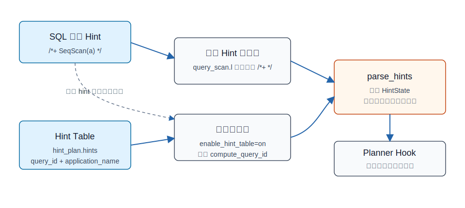
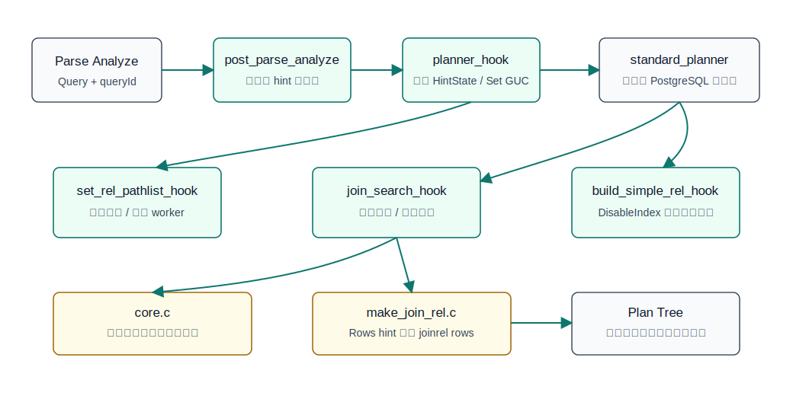
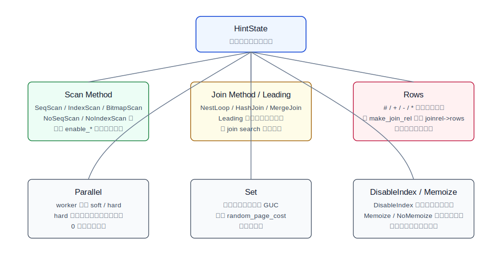
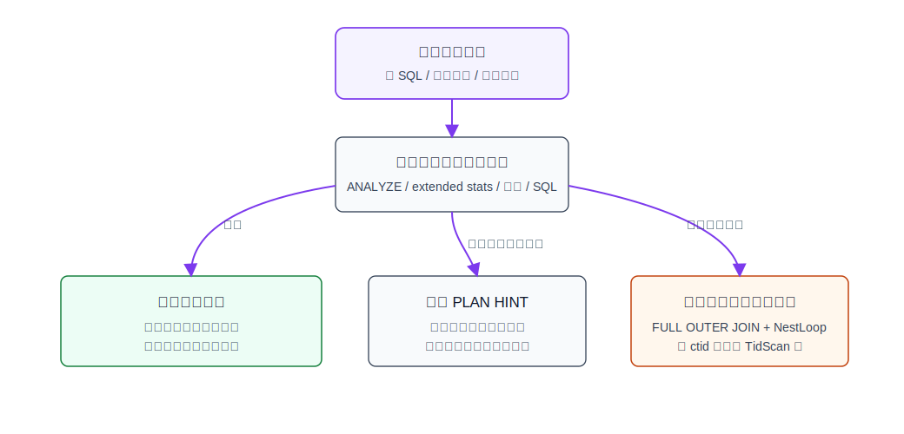
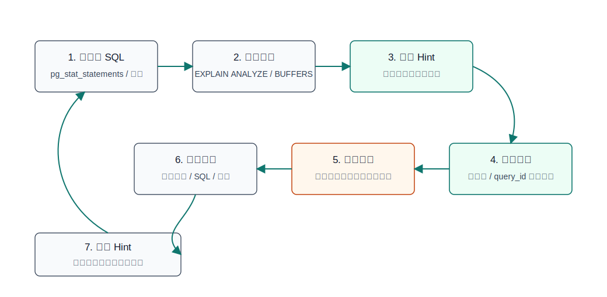

## 数据库筑基课 - PLAN HINT

### 作者
digoal

### 日期
2026-06-08

### 标签
PostgreSQL , 应用开发者 , 数据库筑基课 , 优化器 , 执行计划 , PLAN HINT , pg_hint_plan    

----

## 背景
  


本文属于“执行计划与优化器干预”基础能力。当前项目的 `markdown` 目录未发现明确的“数据库筑基课大纲”文件，因此本文按本地 `pg_hint_plan` 项目资料展开：以 PostgreSQL 的计划提示扩展 `pg_hint_plan` 为例，解释 PLAN HINT 到底解决什么问题、如何进入优化器、能改变什么、不能改变什么，以及生产环境应该怎样使用。

业务系统里的 SQL 慢，常见根因不是“优化器笨”，而是优化器看到的信息不完整：统计信息过期、多列相关性没有表达、参数化 SQL 复用旧计划、数据倾斜、索引选择空间太大或太小、连接顺序搜索被限制、成本参数与真实硬件不匹配。PostgreSQL 是成本优化器，会枚举可行路径并选择估算成本最低的计划；如果估算前提错了，最低成本计划就可能不是实际最快计划。

PLAN HINT 的价值，是在“优化器判断和工程现实出现偏差”时，给 DBA 和开发者一个可控的干预通道。它不是银弹，更不是替代统计信息、索引设计、SQL 改写和参数治理的长期方案。

`pg_hint_plan` 1.9 的本地项目说明显示，它面向 PostgreSQL 19；本机 `pg_config` 指向 PostgreSQL 18.3，因此本文的 DEMO 给出可执行 SQL 和验证方法，但没有在当前机器执行结果。

## 一、它解决什么问题？

PLAN HINT 解决的是“希望优化器在本次规划中优先或排除某些计划选择”的问题。典型场景包括：

- 生产故障止血：某条 SQL 因数据分布变化突然从索引扫描变为全表扫描，或连接顺序突变导致延迟放大。
- 根因诊断：想验证“如果强制 Hash Join 是否更快”“如果禁用某个索引是否更稳定”“如果修正 join rows 估计是否能选出正确计划”。
- 无法改 SQL：应用包、ORM、第三方系统或历史代码暂时不能改 SQL，只能在数据库侧介入。
- 灰度验证：在小流量或指定 `application_name` 上验证计划方向，再决定是否做长期治理。

它牺牲的是优化器的自适应空间。Hint 把一个本该由成本模型动态选择的问题，部分转成“人工约束”。数据量、版本、索引、参数、SQL 形态变化后，原来正确的 hint 可能变成错误的 hint。因此 PLAN HINT 更适合做诊断、过渡和精确止血，不适合成为永久依赖。

## 二、它是什么？

PLAN HINT 是写给优化器看的“计划约束”。在 `pg_hint_plan` 中，hint 可以来自两条路径：

1. SQL 首个特殊块注释，例如 `/*+ SeqScan(a) HashJoin(a b) */`。
2. 扩展表 `hint_plan.hints`，用 `query_id` 和 `application_name` 匹配 SQL。



图 1 说明：`pg_hint_plan` 优先从 hint table 取 hint；如果表功能没有启用或没有匹配项，再从 SQL 注释中提取。注释形式只读取第一个 `/*+ ... */` hint 块，扫描器需要避开字符串、普通注释和 dollar-quoted 文本，避免把 SQL 文本里的伪 hint 当成真实 hint。

在源码层面，`pg_hint_plan.c` 定义了统一的 `Hint` 基类和多个具体 hint 结构，例如 `ScanMethodHint`、`JoinMethodHint`、`LeadingHint`、`SetHint`、`RowsHint`、`ParallelHint`、`DisableIndexHint`。解析后的对象进入 `HintState`，再由 planner 阶段的 hook 消费。

一个最小例子：

```sql
LOAD 'pg_hint_plan';

/*+
  IndexScan(o orders_pkey)
  HashJoin(o c)
*/
EXPLAIN
SELECT *
FROM orders o
JOIN customers c ON c.id = o.customer_id
WHERE o.id = 1001;
```

这段 SQL 的意思不是“执行器强制执行某个已经生成的计划”，而是“在优化器生成和比较候选路径时，限制或偏置某些候选路径”。如果 hint 指向物理上不可执行的计划，PostgreSQL 仍会选择可执行计划。

## 三、核心原理

`pg_hint_plan` 的核心做法是：在 PostgreSQL 规划流程里插入 hook，把 hint 转换成优化器可感知的路径枚举约束、连接搜索约束、行数估算修正、并行参数或临时 GUC。

### 3.1 Hook 入口

本地 `pg_hint_plan/CLAUDE.md` 和 `pg_hint_plan.c` 显示，`_PG_init()` 注册了这些关键 hook：

- `post_parse_analyze_hook`：在解析分析之后尝试取 hint 字符串，尤其是 hint table 需要已经生成的 query id。
- `planner_hook`：主入口，创建 `HintState`，应用 `Set(...)` hint，调用标准 planner，并在结束后回滚临时 GUC。
- `join_search_hook`：控制连接顺序和连接算法。
- `set_rel_pathlist_hook`：控制单表扫描路径和并行扫描路径。
- `build_simple_rel_hook`：用于 `DisableIndex(...)`，从候选索引列表中移除指定索引。
- `fmgr_hook`、`needs_fmgr_hook`、`ExecutorEnd_hook`：处理 PL/pgSQL、嵌套调用和 hint 状态清理。



图 2 说明：`pg_hint_plan` 没有改执行器，而是在计划生成阶段动手。扫描 hint 主要影响 base relation pathlist；连接 hint 影响 join search；`Rows` hint 在复制出来的 `make_join_rel.c` 中修正 join relation 的行数估算；`DisableIndex` 在 simple rel 构建时移除候选索引。

### 3.2 Hint 解析和归档

`parse_hints()` 逐个读取 hint keyword，通过 `parsers` 数组找到对应创建函数，例如：

- `SeqScan`、`IndexScan`、`BitmapScan` 对应 `ScanMethodHintCreate`。
- `NestLoop`、`HashJoin`、`MergeJoin` 对应 `JoinMethodHintCreate`。
- `Leading` 对应 `LeadingHintCreate`。
- `Rows` 对应 `RowsHintCreate`。
- `Parallel` 对应 `ParallelHintCreate`。
- `DisableIndex` 对应 `DisableIndexHintCreate`。

`create_hintstate()` 会把所有 hint 按类型计数、排序并归档。源码里还处理了冲突：同一对象、同一 hint 类型出现多次时，较早的 hint 会被标记为 duplicated，规划时以最后一个有效 hint 为准。

### 3.3 扫描路径 Hint

扫描 hint 的底层机制，是临时调整 PostgreSQL 规划器的 `enable_seqscan`、`enable_indexscan`、`enable_bitmapscan`、`enable_tidscan`、`enable_indexonlyscan` 等开关，然后重新生成 relation 的 pathlist。

源码中的 `setup_scan_method_enforcement()` 会根据 `ScanMethodHint.enforce_mask` 设置这些 GUC。`pg_hint_plan_set_rel_pathlist()` 在找到匹配 relation 的 hint 后，会清空已经生成的路径，再调用复制自 PostgreSQL 的 `set_plain_rel_pathlist()` 重新枚举路径。

这解释了一个重要边界：`SeqScan(t)`、`IndexScan(t)` 不是在执行器里“硬切换算子”，而是通过改变优化器候选空间，让优化器在剩余可行路径里选最低成本路径。

### 3.4 连接顺序和连接算法 Hint

连接 hint 分两类：

- Join method：`NestLoop(a b)`、`HashJoin(a b)`、`MergeJoin(a b)`、`NoHashJoin(a b)` 等。
- Join order：`Leading(a b c)` 或嵌套形式 `Leading((a b) c)`。

`transform_join_hints()` 会把 relation 名称转换成 `Relids` 位图。这样 join search 阶段可以用集合匹配判断当前 join relation 是否命中 hint。`make_join_rel_wrapper()` 和 `add_paths_to_joinrel_wrapper()` 在生成 join path 前后临时设置 `enable_nestloop`、`enable_mergejoin`、`enable_hashjoin`，从而影响候选连接算法。

`Leading` 更像是给 join search 加“组合约束”。如果指定了方向，源码会在 inner/outer relation 匹配不一致时临时禁用所有 join 方法，从而排除不符合方向的路径。

### 3.5 Rows Hint

`Rows(a b #10)`、`Rows(a b *0.1)` 不是直接改表统计信息，而是在 join relation 已经形成后修正 `joinrel->rows`。本地 `make_join_rel.c` 的 `adjust_rows()` 支持四种方式：

| 写法 | 含义 |
|---|---|
| `#<n>` | 把 join 结果估算行数设置为绝对值 |
| `+<n>` | 在原估算上增加 n |
| `-<n>` | 在原估算上减少 n |
| `*<n>` | 按倍数修正原估算 |

这类 hint 的本质是“成本模型输入修正”。它常用于验证：如果真实 join 基数接近某个值，优化器是否会选出更合理的 join 顺序和 join 方法。

### 3.6 Parallel、Set、DisableIndex

`Parallel(table n soft|hard)` 会影响并行规划。`soft` 主要调整 `max_parallel_workers_per_gather`，仍让优化器按成本判断；`hard` 还会降低 `parallel_tuple_cost`、`parallel_setup_cost`，并把并行扫描大小门槛设为 0，尽量让并行路径胜出。`Parallel(table 0 hard)` 可用于抑制并行。

`Set(name value)` 在规划期间临时设置 GUC，例如 `Set(random_page_cost 2.0)`。`pg_hint_plan_planner()` 在新 GUC nest level 下应用这些设置，规划结束后回滚。

`DisableIndex(table index...)` 是比普通 `NoIndexScan` 更精确的工具。`build_simple_rel_hook` 会遍历 `rel->indexlist`，把匹配的 `IndexOptInfo` 从候选索引列表中删除。因此即使同时写了 `IndexScan(t idx)`，被 `DisableIndex(t idx)` 禁用的索引也不会参与规划。



图 3 说明：不同 hint 类型作用在不同规划层次。扫描 hint 影响 base relation path 枚举；连接 hint 影响 join path 搜索；`Rows` 修正 join 基数；`Set` 和 `Parallel` 通过规划期参数改变成本比较；`DisableIndex` 直接从候选索引集合下手。

## 四、横向对比

| 维度 | `pg_hint_plan` PLAN HINT | 统计信息/扩展统计信息 | 索引与 SQL 改写 |
|---|---|---|---|
| 主要目标 | 人工约束某次规划的候选路径 | 让优化器看到更真实的数据分布 | 改变可用访问路径或逻辑表达 |
| 生效速度 | 快，适合止血和验证 | 需要采样、分析和观察 | 可能需要 DDL、发布、回滚窗口 |
| 长期稳定性 | 依赖 SQL 形态、版本、对象名和数据分布 | 稳定性较好，但仍需维护 | 通常更适合作为长期方案 |
| 风险 | 可能锁死过时计划 | 统计不足或采样偏差 | 索引膨胀、写放大、SQL 复杂化 |
| 适合对象 | DBA、内核/性能工程师、紧急问题处理 | DBA、数据库架构师 | 架构师、DBA、应用开发者 |
| 验证方式 | 对比 hint 前后 `EXPLAIN` 和真实延迟 | 对比估算行数和实际行数 | 对比计划、IO、锁等待和写入成本 |
| 不适合场景 | 想永久绕过根因治理 | SQL 逻辑本身低效 | 临时故障且无法快速发布 |

表中的关键点是：PLAN HINT 是“控制计划”，统计信息是“修正优化器输入”，索引和 SQL 是“改变问题本身”。生产系统优先级通常应该是：先用 hint 验证假设和止血，再回到统计信息、索引、SQL、参数和数据模型做长期修复。

## 五、效果如何？

PLAN HINT 的效果不是固定性能数字，而是改变优化器搜索空间后带来的计划差异。可观察收益包括：

- 扫描方式改变：`Seq Scan`、`Index Scan`、`Bitmap Heap Scan`、`Index Only Scan` 之间切换。
- 连接算法改变：`Nested Loop`、`Hash Join`、`Merge Join` 之间切换。
- 连接顺序改变：大表是否过早参与 join，选择性强的表是否先过滤。
- 并行度改变：`Gather`、`Parallel Seq Scan`、worker 数变化。
- 行数估算影响：`Rows` hint 修正后，后续 join 成本可能变化。
- 候选索引变化：`DisableIndex` 可以排除误导优化器的索引。

代价也必须明确：

- Hint 可能掩盖统计信息、SQL 写法或 schema 设计问题。
- Hint 与对象名、别名、query id、PostgreSQL 主版本、扩展版本相关，迁移时容易失效。
- Hint 可能在数据分布变化后把计划固定在错误方向。
- Hint table 依赖 `compute_query_id`，而 PostgreSQL query id 忽略注释，不同 hint 但相同 SQL 正文可能得到相同 query id。
- 对 PL/pgSQL、视图、继承、VALUES、子查询、FDW 等场景有额外限制。



图 4 说明：遇到计划异常时，不应直接把 hint 当最终答案。能通过根因治理解决的问题，优先让优化器自然选对计划；只有在诊断、止血、灰度验证或无法改 SQL 时，PLAN HINT 才是合适工具。

## 六、实操 DEMO

以下示例面向 PostgreSQL 19 + `pg_hint_plan` 1.9。本机 `pg_config` 为 PostgreSQL 18.3，未执行这些 SQL；示例用于展示可验证路径，不包含伪造输出。

### 6.1 准备数据

```sql
CREATE TABLE demo_customer (
  id bigint PRIMARY KEY,
  region text NOT NULL
);

CREATE TABLE demo_orders (
  id bigint PRIMARY KEY,
  customer_id bigint NOT NULL,
  status text NOT NULL,
  amount numeric NOT NULL,
  created_at timestamptz NOT NULL
);

INSERT INTO demo_customer
SELECT g, CASE WHEN g <= 100 THEN 'hot' ELSE 'normal' END
FROM generate_series(1, 100000) AS g;

INSERT INTO demo_orders
SELECT g,
       CASE WHEN g <= 900000 THEN (g % 100) + 1 ELSE (g % 100000) + 1 END,
       CASE WHEN g % 20 = 0 THEN 'paid' ELSE 'new' END,
       (g % 1000)::numeric,
       now() - (g || ' seconds')::interval
FROM generate_series(1, 1000000) AS g;

CREATE INDEX demo_orders_customer_idx ON demo_orders(customer_id);
CREATE INDEX demo_orders_status_idx ON demo_orders(status);
ANALYZE demo_customer;
ANALYZE demo_orders;
```

### 6.2 加载扩展并观察原始计划

```sql
LOAD 'pg_hint_plan';

EXPLAIN (ANALYZE, BUFFERS, VERBOSE)
SELECT o.id, o.amount
FROM demo_orders o
JOIN demo_customer c ON c.id = o.customer_id
WHERE c.region = 'hot'
  AND o.status = 'paid';
```

验证重点：

- 估算行数和实际行数是否偏差很大。
- join 顺序是否先处理选择性更强的一侧。
- 是否出现不合理的 `Nested Loop`、`Hash Join` 或扫描方式。
- `BUFFERS` 是否显示大量无效读取。

### 6.3 验证扫描方式假设

```sql
/*+ IndexScan(o demo_orders_status_idx) */
EXPLAIN (ANALYZE, BUFFERS, VERBOSE)
SELECT o.id, o.amount
FROM demo_orders o
JOIN demo_customer c ON c.id = o.customer_id
WHERE c.region = 'hot'
  AND o.status = 'paid';
```

如果 hint 后计划更快，结论也不是“应该永久写 `IndexScan`”。正确下一步是确认为什么优化器原来没有选它：统计信息、成本参数、索引相关性、选择性估算或缓存状态哪个不对。

### 6.4 验证连接算法和连接顺序

```sql
/*+
  Leading(c o)
  HashJoin(c o)
*/
EXPLAIN (ANALYZE, BUFFERS, VERBOSE)
SELECT o.id, o.amount
FROM demo_orders o
JOIN demo_customer c ON c.id = o.customer_id
WHERE c.region = 'hot'
  AND o.status = 'paid';
```

验证重点：

- `Leading(c o)` 是否让 `demo_customer` 先参与过滤。
- `HashJoin(c o)` 是否替换了原 join 方法。
- 实际耗时改善是来自 join 顺序、join 方法，还是扫描路径同时变化。

### 6.5 验证 Rows 修正

```sql
/*+
  Rows(c o *0.1)
*/
EXPLAIN (ANALYZE, BUFFERS, VERBOSE)
SELECT o.id, o.amount
FROM demo_orders o
JOIN demo_customer c ON c.id = o.customer_id
WHERE c.region = 'hot'
  AND o.status = 'paid';
```

`Rows` hint 适合回答一个诊断问题：如果 join 结果基数不是优化器估算值，而是缩小或放大某个倍数，计划是否会改变？如果会，就说明长期修复方向应优先放在行数估算：扩展统计信息、表达式统计、分区统计、改写谓词或提高统计目标。

### 6.6 使用 hint table

Hint table 适合无法改 SQL 文本的场景。

```sql
CREATE EXTENSION IF NOT EXISTS pg_hint_plan;
SET compute_query_id = on;
SET pg_hint_plan.enable_hint_table = on;

EXPLAIN (VERBOSE, COSTS false)
SELECT o.id, o.amount
FROM demo_orders o
JOIN demo_customer c ON c.id = o.customer_id
WHERE c.region = 'hot'
  AND o.status = 'paid';
```

从 `EXPLAIN (VERBOSE)` 取得 `Query Identifier` 后写入：

```sql
INSERT INTO hint_plan.hints(query_id, application_name, hints)
VALUES (
  <上一步看到的 query_id>,
  'canary-app',
  'Leading(c o) HashJoin(c o)'
);
```

生产使用时建议设置非空 `application_name`，先让小流量命中。不要一开始用空字符串影响所有会话。

## 七、最佳实践

### 数据库架构师

- 把 PLAN HINT 定义为“计划治理工具”，不是业务 SQL 的常规组成部分。
- 为每个 hint 记录假设：慢在哪里、期望改变哪个算子、为什么不是先改索引或 SQL。
- 设计退出条件：统计信息修复、索引调整、SQL 改写、版本升级后必须重新验证并回收 hint。
- 对关键 SQL 建立计划基线观测：计划节点、估算行数、实际行数、buffer、延迟分位数。

### DBA

- 先用 `EXPLAIN (ANALYZE, BUFFERS)` 找计划问题，不要只看总耗时。
- hint 一次只改一个变量：先扫描方式，再连接算法，再连接顺序，再 Rows 修正，避免多 hint 混在一起无法归因。
- 对 hint table 使用 `application_name` 灰度，不要用空 application name 直接全局生效。
- 记录扩展版本、PostgreSQL 主版本、SQL 文本、query id、对象别名、索引名和回滚 SQL。
- 开启 `pg_hint_plan.debug_print` 只用于诊断窗口，避免长期增加日志噪声。

### 业务开发者

- SQL 里出现 hint 前，先确认是否可以通过更清晰的谓词、正确 join 条件、合理分页、避免隐式类型转换来解决。
- 多表 SQL 必须稳定使用别名。`pg_hint_plan` 识别对象时优先依赖别名，别名变化会导致 hint 失效。
- 不要把 hint 当 ORM 模板的一部分批量生成。批量 hint 很容易把局部问题扩大成系统性风险。
- 如果 hint 证明某个索引或 join 顺序更好，把结论反馈给 DBA 和架构师，推动长期修复。



图 5 说明：PLAN HINT 的正确生命周期是“定位、验证、灰度、监控、根因修复、回收”。最危险的做法是故障期间加了 hint，故障后没有记录原因，也没有回收计划。

## 八、适合与不适合场景

适合场景：

- 单条或少量 SQL 的计划突变，需要快速止血。
- 需要验证某个计划假设，例如扫描方式、连接顺序、并行度、行数估算。
- 应用侧短期无法改 SQL，但数据库侧可以按 query id 或 application name 精确介入。
- 需要规避某个误导优化器的索引，可用 `DisableIndex` 做局部验证。
- 版本升级前后做计划差异评估，确认某些 SQL 对特定路径是否敏感。

不适合场景：

- 大量 SQL 都依赖 hint 才能正常运行。这通常说明统计、索引、参数或数据模型治理失败。
- 数据分布频繁变化，固定计划很快过期。
- SQL 本身逻辑低效，例如缺 join 条件、函数包裹索引列、隐式类型转换、返回过多列。
- 需要强制物理上不可执行的计划，例如没有 `ctid` 条件却要求 `TidScan`。
- ECPG 等会剥离注释的场景，除非改用 hint table。
- 超过 `from_collapse_limit` 导致 planner 本身不再考虑某些 join order 的场景，`pg_hint_plan` 也无法让优化器考虑它根本没有搜索的顺序。

## 九、常见坑

1. 把表名写成 schema-qualified 名称。

   扫描 hint 主要匹配 relation 名称或别名，不是按 `schema.table` 这种形式匹配。多 schema 同名表时应使用 SQL 别名，例如 `s1.t1 a`、`s2.t1 b`，再写 `SeqScan(a)`。

2. 忽略大小写规则。

   `pg_hint_plan` 对 bare object name 的比较是大小写敏感的，这和 PostgreSQL 默认把未引用标识符折叠为小写的体验不同。对象名复杂时使用稳定别名。

3. 多个同类 hint 冲突。

   对同一对象写多个同类型 hint，前面的可能被标记为 duplicated，最后一个有效 hint 才生效。不要依赖“写很多 hint 总有一个会中”的做法。

4. 把不可执行计划当成 bug。

   `FULL OUTER JOIN` 强制 nested loop、没有可用谓词却强制某索引、没有 `ctid` 条件却强制 TID scan，优化器会回到可执行计划。这是边界，不是 hint 失灵。

5. Hint table query id 误伤。

   PostgreSQL 生成 query id 时忽略注释。相同 SQL 正文但不同 hint 的语句可能有同一个 query id。使用 hint table 时要结合 `application_name` 缩小范围。

6. PL/pgSQL 位置写错。

   文档说明 PL/pgSQL 中 hint 注释需要放在查询第一个词之后，因为前置注释不一定作为该查询文本发送。

7. 忽略 GEQO 和 join 搜索限制。

   本地源码显示，如果启用 GEQO 且 relation 数达到阈值，join method 和 join order hint 不可控，只有扫描方法和 `Set` hint 仍可能产生影响。

8. 永久保留止血 hint。

   Hint 如果没有 owner、工单、回滚条件和复盘，很容易在下一次数据分布变化或版本升级时制造新的慢 SQL。

## 十、扩展问题

1. 如果一个 hint 能显著改善计划，你如何判断根因是统计信息、成本参数、索引设计，还是 SQL 写法？
2. `Rows(a b *0.1)` 改善计划时，应该优先考虑 PostgreSQL 的哪类统计能力或 SQL 改写？
3. 为什么 `DisableIndex(t idx)` 和 `NoIndexScan(t)` 的风险完全不同？
4. 在多租户 SaaS 系统中，hint table 用空 `application_name` 会带来什么误伤风险？
5. 版本升级时，为什么 PLAN HINT 需要重新验收，而不是简单迁移？
6. 如果一条 SQL 在小表上适合 nested loop，在大表上适合 hash join，固定 hint 是否合理？
7. 什么时候应该接受优化器的计划，而不是为了追求某个看起来“更高级”的算子去强制 hint？

## 十一、扩展阅读

- 本地项目说明：[pg_hint_plan/README.md](../pg_hint_plan/README.md)
- 本地架构说明：[pg_hint_plan/CLAUDE.md](../pg_hint_plan/CLAUDE.md)
- Hint 列表：[pg_hint_plan/docs/hint_list.md](../pg_hint_plan/docs/hint_list.md)
- Hint 细节：[pg_hint_plan/docs/hint_details.md](../pg_hint_plan/docs/hint_details.md)
- Hint table：[pg_hint_plan/docs/hint_table.md](../pg_hint_plan/docs/hint_table.md)
- 功能限制：[pg_hint_plan/docs/functional_limitations.md](../pg_hint_plan/docs/functional_limitations.md)
- 安装要求：[pg_hint_plan/docs/installation.md](../pg_hint_plan/docs/installation.md)、[pg_hint_plan/docs/requirements.md](../pg_hint_plan/docs/requirements.md)
- 核心源码：[pg_hint_plan/pg_hint_plan.c](../pg_hint_plan/pg_hint_plan.c)
- 复制的优化器函数：[pg_hint_plan/core.c](../pg_hint_plan/core.c)
- Rows hint 修改点：[pg_hint_plan/make_join_rel.c](../pg_hint_plan/make_join_rel.c)
- 查询扫描器接口：[pg_hint_plan/query_scan.h](../pg_hint_plan/query_scan.h)、[pg_hint_plan/query_scan_int.h](../pg_hint_plan/query_scan_int.h)
- 回归测试样例：[pg_hint_plan/sql/pg_hint_plan.sql](../pg_hint_plan/sql/pg_hint_plan.sql)、[pg_hint_plan/sql/ut-S.sql](../pg_hint_plan/sql/ut-S.sql)、[pg_hint_plan/sql/ut-W.sql](../pg_hint_plan/sql/ut-W.sql)、[pg_hint_plan/sql/ut-T.sql](../pg_hint_plan/sql/ut-T.sql)
- PostgreSQL 官方文档：[`EXPLAIN`](https://www.postgresql.org/docs/current/sql-explain.html)、[Using EXPLAIN](https://www.postgresql.org/docs/current/using-explain.html)、[Query Planning GUC](https://www.postgresql.org/docs/current/runtime-config-query.html)、[Parallel Plans](https://www.postgresql.org/docs/current/parallel-plans.html)
- DeepWiki：`ossc-db/pg_hint_plan`。本文用它辅助理解架构，但关键结论已按本地源码和文档核对；其中一次 DeepWiki 回答遗漏了 `DisableIndex`，本文以本地 `docs/hint_list.md` 与 `pg_hint_plan.c` 为准。
  
## 附录 
1、克隆代码  
```  
git clone --depth 1 https://github.com/ossc-db/pg_hint_plan
```  
  
2、启用 codex, 使用 [数据库筑基课 skill](../skills/README.md).  
```
文章标题: 
  数据库筑基课 - PLAN HINT
项目源码(本地目录): 
  pg_hint_plan
项目 codebase 文件名: 
  pg_hint_plan/CLAUDE.md 
开源项目相关的 deepwiki repoName: 
  ossc-db/pg_hint_plan
```
    
#### [PostgreSQL 解决方案集合](../201706/20170601_02.md "40cff096e9ed7122c512b35d8561d9c8")
  
  
#### [德哥 / digoal's Github - 公益是一辈子的事.](https://github.com/digoal/blog/blob/master/README.md "22709685feb7cab07d30f30387f0a9ae")
  
  
#### [About 德哥](https://github.com/digoal/blog/blob/master/me/readme.md "a37735981e7704886ffd590565582dd0")
  
  

  
