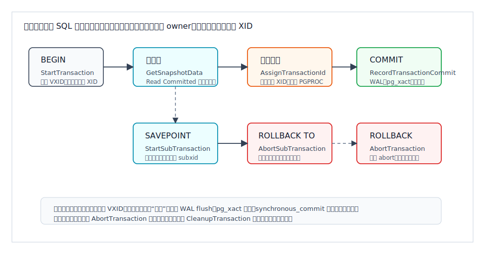
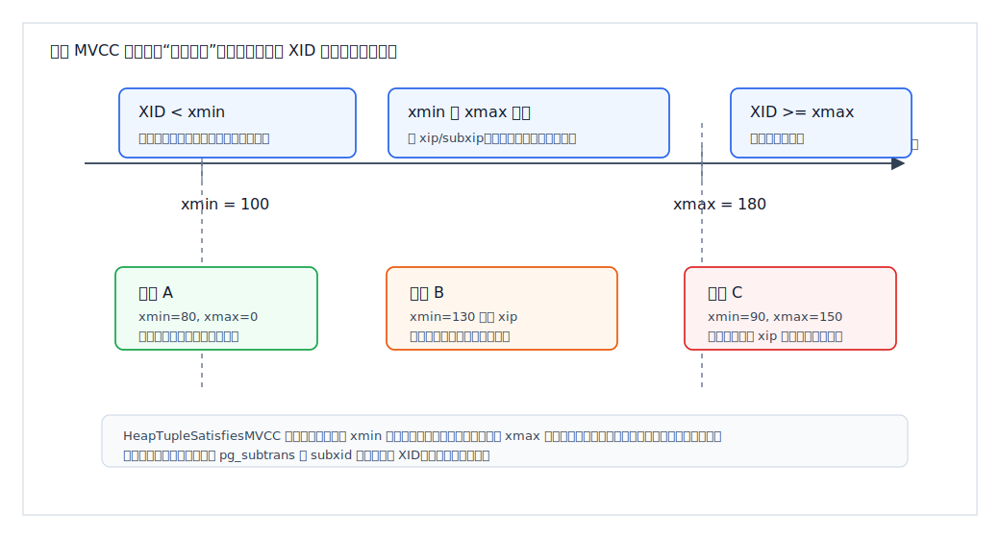
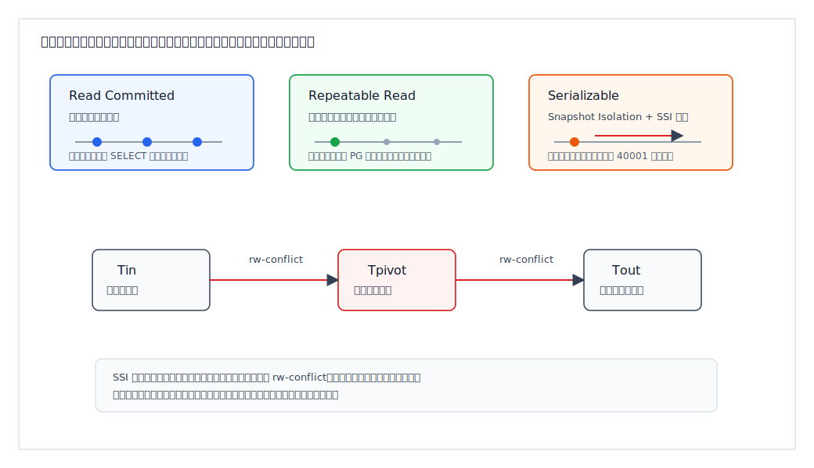
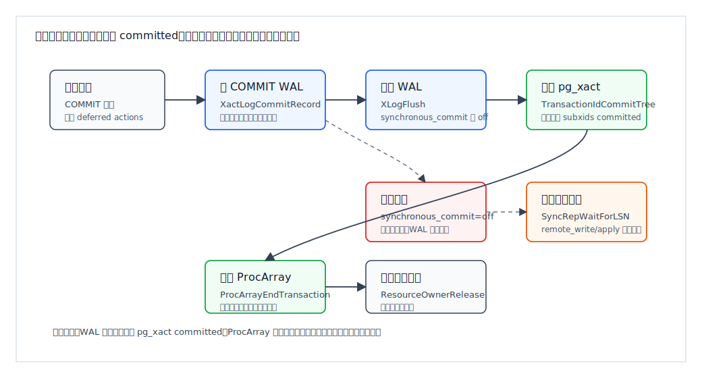
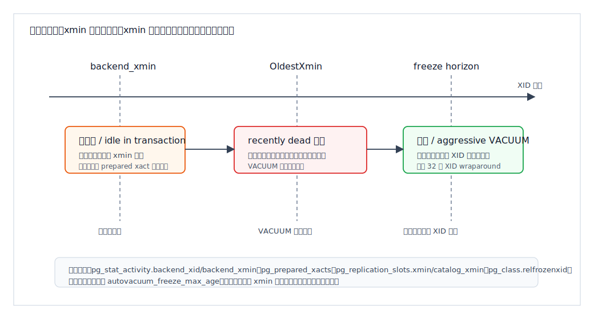

## 数据库筑基课 - 事务

### 作者
digoal

### 日期
2026-06-08

### 标签
PostgreSQL , 应用开发者 , 数据库筑基课 , 事务 , MVCC , WAL , Serializable , VACUUM    

----

## 背景


这篇属于数据库筑基课里的“场景实践 + 内核机制”主题。事务不是一句 `BEGIN; COMMIT;`，而是业务正确性、并发吞吐、故障恢复、复制延迟、膨胀控制和运维边界共同组成的系统。

本地 `markdown/` 目录没有发现独立的“数据库筑基课大纲”文件，所以本文不强行引用不存在的大纲；后续如果项目补充大纲，可以在这里补上课程目录链接。

先从一个常见事故说起：

一个转账服务把“扣款、加款、写流水”拆成多个 SQL。开发者以为只要最后 `COMMIT`，中间所有读写就天然正确。上线后出现三类问题：

- 高并发下库存、余额、额度偶发不一致。
- 长报表查询拖住 `VACUUM`，表和索引膨胀，写入延迟上升。
- 为了追求吞吐把 `synchronous_commit` 关掉，崩溃后少量“已返回成功”的交易消失。

这些问题都不是 SQL 语法问题，而是没有理解事务的四个底层问题：

- 一个语句看到的是哪个数据库版本？
- 一个行版本什么时候对谁可见？
- 一个提交什么时候算“真的持久”？
- 一个长事务为什么会影响整个实例的清理边界？

本文以 PostgreSQL 本地源码 `postgres` 为主线。重要结论优先引用官方文档和源码：`doc/src/sgml/mvcc.sgml`、`doc/src/sgml/xact.sgml`、`doc/src/sgml/wal.sgml`、`src/backend/access/transam/xact.c`、`src/backend/storage/ipc/procarray.c`、`src/backend/utils/time/snapmgr.c`、`src/backend/access/heap/heapam_visibility.c`、`src/backend/access/transam/clog.c`、`src/backend/access/transam/subtrans.c`、`src/backend/storage/lmgr/README-SSI`。DeepWiki repoName 使用 `postgres/postgres`，本次查询到的事务架构摘要与本地源码主线一致；本文把 DeepWiki 作为架构索引，关键事实仍回到官方文档和源码核验。

## 一、它解决什么问题？

事务解决的不是“把多条 SQL 打包”这么简单，而是把业务动作映射成数据库内部可验证的状态转移。

以扣库存为例：

```sql
BEGIN;
SELECT stock FROM sku WHERE id = 42;
UPDATE sku SET stock = stock - 1 WHERE id = 42 AND stock > 0;
INSERT INTO order_log(order_id, sku_id, action) VALUES (1001, 42, 'buy');
COMMIT;
```

这段 SQL 背后至少有五个工程问题：

1. 如果两个用户同时买同一个 SKU，读到的库存是否互相污染？
2. 如果中途报错，已经写入的订单日志是否要撤销？
3. 如果数据库进程在 `COMMIT` 后崩溃，订单是否还在？
4. 如果报表事务跑 30 分钟，`UPDATE` 产生的旧版本能不能被清理？
5. 如果业务规则依赖“先读聚合再写入”，`Repeatable Read` 是否足够？

PostgreSQL 的答案是：

- 用 MVCC 让读和写通常不互相阻塞。
- 用事务 ID、快照、行版本头决定可见性。
- 用 WAL 和 `pg_xact` 记录提交状态，保证崩溃恢复。
- 用锁、行锁、谓词锁和 SSI 处理不能只靠快照解决的冲突。
- 用 VACUUM 和冻结处理旧版本、XID wraparound 和空间回收。

代价也很明确：MVCC 会制造旧行版本；事务越长，旧版本保留越久；隔离级别越强，冲突检测、重试和内存成本越高；提交越强调持久性和同步复制，延迟越高。

## 二、它是什么？

事务是数据库中一组操作的原子执行单位。用户层通常用 `BEGIN`、`COMMIT`、`ROLLBACK`、`SAVEPOINT` 表达；内核层则维护事务状态、资源、锁、快照、XID、子事务、WAL 和提交状态。

PostgreSQL 文档 `doc/src/sgml/xact.sgml` 给出几个关键事实：

- 显式事务由 `BEGIN` 或 `START TRANSACTION` 开始，由 `COMMIT` 或 `ROLLBACK` 结束。
- 显式事务外的 SQL 自动使用单语句事务。
- 每个事务都有 `VirtualTransactionId`，由后端进程编号和本地递增编号组成。
- 非虚拟 `TransactionId`，也就是 XID，是全局递增分配的，但只有事务首次写数据库时才分配。
- XID 是 32 位，会发生 wraparound；`xid8` 用 64 位表示，包含 epoch。
- 顶层事务提交后，会在 `pg_xact` 中标记 committed。
- 子事务使用 `pg_subtrans` 记录 subxid 到父 xid 的映射。

从开发者角度看，事务有 ACID 四个属性：

| 属性 | 通俗含义 | PostgreSQL 中的关键机制 |
|---|---|---|
| 原子性 Atomicity | 要么都成功，要么都撤销 | 事务状态、WAL、abort 清理、子事务栈 |
| 一致性 Consistency | 保持业务约束和数据库约束 | 约束、触发器、隔离级别、显式锁或 Serializable |
| 隔离性 Isolation | 并发执行时互不产生非法观察 | MVCC 快照、行锁、表锁、谓词锁、SSI |
| 持久性 Durability | 提交成功后故障可恢复 | WAL、XLogFlush、pg_xact、checkpoint、复制确认 |

要注意：一致性不是数据库自动理解你的业务规则。唯一键、外键、CHECK 这类声明式约束数据库可以保证；“两个账户总余额不变”“医生排班至少留一人值班”这类跨行、跨表、聚合规则，需要正确选择隔离级别、锁或约束模型。

## 三、核心原理

### 3.1 事务生命周期：用户命令与内核状态不是一回事

PostgreSQL 源码 `src/backend/access/transam/README` 把事务系统分成三层：

- 底层事务和子事务。
- 主循环在每条查询前后调用的控制代码，例如 `StartTransactionCommand`、`CommitTransactionCommand`、`AbortCurrentTransaction`。
- 用户可见的 `BEGIN`、`COMMIT`、`ROLLBACK`、`SAVEPOINT` 等命令。

`src/backend/access/transam/xact.c` 中的 `StartTransaction()` 会初始化事务状态、资源 owner、GUC 嵌套层级、命令计数器、虚拟事务 ID 和时间戳。关键点是：启动事务时分配的是 VXID，不一定分配真正的 XID。`AssignTransactionId()` 的注释写得很直接：事务和子事务只有在需要时才分配永久 `FullTransactionId`；如果子事务需要 XID，父事务会先获得 XID，从而保证子事务 XID 晚于父事务。



图 1 说明：用户看见的是事务块，内核看见的是状态机。只读事务可能只有 VXID；首次写入才触发全局 XID 分配；提交时要经历预提交动作、WAL/`pg_xact`、ProcArray 退出和资源释放；回滚路径会先释放共享资源，避免继续阻塞其他后端。

这个延迟分配 XID 的设计很重要。大量只读短事务不消耗 XID，可以降低 XID 增长速度，也减少 `pg_xact` 维护压力。反过来，调用 `pg_current_xact_id()` 会强制分配 XID；如果只是观测，应优先用 `pg_current_xact_id_if_assigned()`。

### 3.2 MVCC：快照记录“谁还在跑”，不是复制一份数据

PostgreSQL 的并发控制基础是 MVCC。官方文档 `doc/src/sgml/mvcc.sgml` 的核心表述是：每个 SQL 语句看到某个时间点的数据快照，避免看到并发事务造成的不一致中间状态；读锁不与写锁冲突，读不阻塞写，写也不阻塞读。

内核快照结构见 `src/include/utils/snapshot.h`。一个普通 MVCC snapshot 的关键字段是：

- `xmin`：所有小于 `xmin` 的 XID 对这个快照来说不在运行中。
- `xmax`：所有大于等于 `xmax` 的 XID 对这个快照来说不可见。
- `xip[]`：`xmin <= xid < xmax` 范围内，快照时仍在运行的顶层 XID。
- `subxip[]`：快照时仍在运行的子事务 XID。
- `suboverflowed`：子事务数组是否溢出。
- `curcid`：当前事务内命令可见性边界。

`src/backend/storage/ipc/procarray.c` 的 `GetSnapshotData()` 会扫描 ProcArray，收集活跃事务 XID，并计算 `xmin/xmax`。`src/backend/utils/time/snapmgr.c` 的 `GetTransactionSnapshot()` 决定不同隔离级别下是每条语句取新快照，还是复用事务第一个快照。



图 2 说明：快照的主要作用是判断某个行版本的 `xmin/xmax` 是否对当前读者可见。`XID < xmin` 通常可以快速排除；`XID >= xmax` 对快照不可见；中间区间需要查 `xip/subxip`。如果子事务过多导致 `suboverflowed`，需要通过 `pg_subtrans` 追溯顶层 XID，检查成本会上升。

### 3.3 行版本可见性：一行不是一个版本

在 PostgreSQL heap 表里，更新不是原地覆盖旧行，而是产生新行版本。行版本头里有 `xmin` 和 `xmax`：

- `xmin` 表示创建这个行版本的事务。
- `xmax` 表示删除或更新这个行版本的事务；如果无效，说明尚未被删除或更新。
- hint bits 可以缓存 XID 提交/回滚状态，减少反复查 `pg_xact`。

`src/backend/access/heap/heapam_visibility.c` 的 `HeapTupleSatisfiesMVCC()` 是可见性判断的关键函数。它先判断插入者 `xmin` 是否提交且对快照可见，再判断删除者/更新者 `xmax` 是否有效、是否只是锁行、是否提交、是否对快照可见。

简化成规则：

| 条件 | 当前快照是否能看到该行版本 |
|---|---|
| `xmin` 未提交或在快照中仍运行 | 不可见 |
| `xmin` 已提交且不在快照运行集合中，`xmax` 无效 | 可见 |
| `xmin` 可见，`xmax` 是锁行而非删除/更新 | 可见 |
| `xmin` 可见，`xmax` 已提交且对快照可见 | 不可见 |
| `xmin` 可见，`xmax` 在快照时仍运行 | 可见，因为删除/更新对该快照尚未发生 |

这解释了为什么 `UPDATE` 会产生膨胀：旧版本不能在更新提交后马上删除，因为某些旧快照可能还需要看到它。

### 3.4 隔离级别：快照边界决定你会看到什么

PostgreSQL 文档 `doc/src/sgml/mvcc.sgml` 说明：SQL 标准有四个隔离级别，但 PostgreSQL 内部实现三个不同级别；`READ UNCOMMITTED` 按 `READ COMMITTED` 行为处理。

| 隔离级别 | 快照边界 | 能防什么 | 仍需注意什么 |
|---|---|---|---|
| Read Committed | 每条语句开始时取快照 | 不读未提交数据 | 同一事务两次查询可看到不同结果；复杂条件更新可能观察到不一致视图 |
| Repeatable Read | 事务第一条非控制语句取快照 | 防不可重复读；PostgreSQL 中也不出现幻读 | 仍可能发生 serialization anomaly；写冲突可能报 `could not serialize access due to concurrent update` |
| Serializable | 事务快照 + SSI 检测 | 成功提交的并发事务等价于某个串行顺序 | 可能返回 SQLSTATE `40001`，应用必须完整重试事务 |

`src/backend/utils/time/snapmgr.c` 里 `IsolationUsesXactSnapshot()` 分支体现了这点：使用事务级快照的隔离级别会保存第一份 snapshot；Read Committed 则在后续语句重新调用 `GetSnapshotData()`。



图 3 说明：Read Committed 的新鲜感来自每条语句重新取快照；Repeatable Read 的稳定性来自事务级快照；Serializable 在 Snapshot Isolation 之上增加 SSI，监控并发事务之间的 rw-conflict。如果出现 `Tin -> Tpivot -> Tout` 这样的两个相邻读写冲突危险结构，PostgreSQL 会在必要时回滚事务，避免产生无串行顺序可解释的结果。

### 3.5 Serializable：不是加大锁，而是检测危险结构

`src/backend/storage/lmgr/README-SSI` 解释了 PostgreSQL Serializable 的实现：它不是传统 Strict Two-Phase Locking。SSI 基于 Snapshot Isolation，额外监控并发事务之间的 rw-conflict。读不阻塞写，写不阻塞读；一旦冲突图出现可能导致异常的危险结构，就回滚某个事务。

工程含义：

- Serializable 不等于没有代价。它需要谓词锁、冲突跟踪和可能的事务重试。
- Serializable 也不是所有场景都更慢。如果为了防业务异常你本来要显式表锁或大量 `SELECT FOR UPDATE`，Serializable 可能减少阻塞。
- 应用必须按 SQLSTATE `40001` 做完整事务重试，不能只重试最后一条 SQL。
- `SERIALIZABLE READ ONLY DEFERRABLE` 适合长报表：它可能在开始时等待一个安全快照，随后避免普通 Serializable 的冲突开销和取消风险。

### 3.6 提交路径：WAL 先行，pg_xact 随后，最后释放可见状态

提交成功的关键不是“把一个变量设成 committed”，而是让崩溃恢复能证明它已经提交。

`src/backend/access/transam/xact.c` 的 `CommitTransaction()` 调用 `RecordTransactionCommit()`，后者会：

1. 收集待删除文件、子事务、缓存失效消息等提交记录信息。
2. 如果事务有 XID，进入 commit critical section，写入 `XactLogCommitRecord()`。
3. 根据 `synchronous_commit`、是否写 WAL、是否有强制同步条件，决定立即 `XLogFlush()` 还是走异步提交。
4. WAL 已满足要求后，用 `TransactionIdCommitTree()` 或 `TransactionIdAsyncCommitTree()` 更新 `pg_xact` 中主事务和子事务的提交状态。
5. 对需要同步复制的事务调用 `SyncRepWaitForLSN()`。
6. `CommitTransaction()` 随后调用 `ProcArrayEndTransaction()`，让其他后端不再把它看作运行中事务，再释放锁和资源。



图 4 说明：WAL commit record 是恢复依据，`pg_xact` 是事务状态查询依据。PostgreSQL 必须避免 checkpoint 看到“WAL 已有提交记录但 `pg_xact` 没持久”的危险窗口，所以提交临界区会延迟 checkpoint。`synchronous_commit=off` 允许先向客户端返回成功、稍后刷 WAL；这不会破坏数据库一致性，但崩溃时可能丢失少量已经返回成功的事务。

`doc/src/sgml/config.sgml` 对 `synchronous_commit` 的说明很关键：非 `off` 模式本地都会等待 WAL 本地刷盘；`off` 模式可能在数据库崩溃后丢失最近返回成功的事务，但数据库状态等价于这些事务干净回滚。

### 3.7 pg_xact 与 pg_subtrans：提交状态和子事务树

`src/backend/access/transam/clog.c` 管理 `pg_xact`，文件里仍使用历史名 CLOG。关键实现细节：

- 每个事务状态占 2 bit。
- 一个字节记录 4 个事务。
- 一个 `BLCKSZ` 页面可记录 `BLCKSZ * 4` 个事务状态。
- `TransactionIdSetTreeStatus()` 会把顶层事务和子事务树状态一起设置。

`src/backend/access/transam/subtrans.c` 管理 `pg_subtrans`，用于记录 subxid 的直接父 XID。它不是长期历史表，只需要保留当前打开事务所需的信息。子事务过多时，PGPROC 里最多缓存 `PGPROC_MAX_CACHED_SUBXIDS` 个 subxid；源码 `src/include/storage/proc.h` 当前值是 64，溢出后可见性检查会更多依赖 `pg_subtrans`。

实践含义：不要在一个大事务里创建成千上万个 savepoint，也要警惕 PL/pgSQL `EXCEPTION` 在循环里隐式制造大量子事务。它们不是免费控制流。

### 3.8 VACUUM 边界：事务越长，垃圾越久

`HeapTupleSatisfiesVacuum()` 的目标不是判断“我这个快照能否看到行”，而是判断“任何仍可能存在的事务是否还能看到这个行版本”。它会用 `OldestXmin` 作为边界。删除者已经提交的行版本，如果删除 XID 仍不早于 `OldestXmin`，就属于 `HEAPTUPLE_RECENTLY_DEAD`，暂时不能移除。

`doc/src/sgml/maintenance.sgml` 的 wraparound 章节说明：PostgreSQL XID 是 32 位，超过 40 亿事务会环绕。为了避免旧版本突然看起来像“未来版本”，每个表必须周期性 vacuum，并把足够老的行版本标记为 frozen。`relfrozenxid`、`datfrozenxid`、`vacuum_freeze_min_age`、`vacuum_freeze_table_age`、`autovacuum_freeze_max_age` 都围绕这个边界工作。



图 5 说明：`idle in transaction`、老 prepared transaction、复制槽的 `xmin/catalog_xmin`、长时间运行的报表，都会固定清理边界。旧行版本无法清理，表和索引膨胀；冻结无法推进，最后可能触发 anti-wraparound autovacuum，甚至拒绝分配新 XID。

## 四、横向对比

### 4.1 PostgreSQL 三个实质隔离级别

| 维度 | Read Committed | Repeatable Read | Serializable |
|---|---|---|---|
| 主要目标 | 低成本、语句级一致读 | 事务内稳定视图 | 成功提交结果可串行化 |
| 快照创建 | 每条语句 | 第一条非事务控制语句 | 第一条非事务控制语句 + SSI |
| 读写阻塞 | 普通读写不互阻 | 普通读写不互阻 | 普通读写不互阻，但有谓词锁记录 |
| 写冲突行为 | 等待后重查新版本和 WHERE 条件 | 等待后可能报 serialization error | rw-conflict 危险结构可能报 40001 |
| 业务规则适配 | 适合单行、简单更新 | 适合稳定读和一致报表 | 适合跨行/跨表规则，前提是能重试 |
| 成本 | 最低 | 快照保留更久 | 冲突跟踪、谓词锁、重试成本 |
| 常见坑 | 两次读结果不同；复杂更新观察不一致 | 写偏斜；误以为等同真正串行 | 不处理 40001；长事务导致冲突和内存压力 |

解释：Read Committed 的优势是快，但它只保证单语句快照。Repeatable Read 给事务一个稳定世界，但稳定不等于可串行化。Serializable 才把“没有串行顺序可解释”的并发结果挡下来，代价是应用必须接受回滚重试。

### 4.2 MVCC 与传统两阶段锁

| 维度 | PostgreSQL MVCC + SSI | 传统 Strict 2PL 思路 |
|---|---|---|
| 主要目标 | 高并发读写，必要时检测异常 | 通过阻塞冲突访问保证串行化 |
| 读取代价 | 读快照、查可见性、可能查 `pg_xact` | 读加锁，可能阻塞写 |
| 写入代价 | 生成新版本、写 WAL、后续 VACUUM | 原地或锁保护更新，旧版本压力较小 |
| 空间成本 | 旧版本、索引膨胀、冻结管理 | 锁等待和死锁成本更突出 |
| 事务/MVCC | 读不阻塞写，写不阻塞普通读 | 冲突读写互相阻塞 |
| 适合场景 | OLTP 混合读写、报表和交易并存 | 强冲突且事务短、愿意用等待换重试 |
| 不适合场景 | 超长事务、不清理复制槽、无重试的 Serializable | 高并发长读、多读少写系统 |

这张表不是说 MVCC 永远优于锁。MVCC 把很多等待成本转成版本维护成本；如果应用长期持有快照，后续所有写入都在为它保留旧世界。

## 五、效果如何？

事务机制的收益：

- 普通查询与普通写入互不阻塞，读多写多系统仍能保持较好并发。
- 行版本让读者看到一致快照，而不是半更新状态。
- WAL 让提交可以崩溃恢复，避免每次修改都同步随机写数据页。
- `SAVEPOINT` 和子事务让错误处理更精细。
- Serializable 让复杂业务规则可以通过“失败重试”获得串行化效果。

对应代价：

- 每次更新/删除都会制造旧版本，需要 VACUUM 清理。
- 每个写事务消耗 XID，XID 需要冻结和 wraparound 管理。
- hint bits、`pg_xact`、`pg_subtrans`、ProcArray 都会成为高并发路径上的元数据访问点。
- 长事务、prepared transaction、逻辑复制槽会固定 xmin，影响清理边界。
- Serializable 的谓词锁可能升级，增加 serialization failure 概率。
- `synchronous_commit`、同步复制和 `remote_apply` 会直接影响提交延迟。

不要在没有实验的情况下承诺性能数字。本文只给机制和验证路径，不虚构吞吐、延迟或膨胀比例。

## 六、实操 DEMO

下面是最小验证脚本。本文没有在本地启动 PostgreSQL 实例执行这些 SQL，因此不提供执行输出；读者可在任意 PostgreSQL 测试库中开两个 `psql` 会话验证。

### 6.1 Read Committed 每条语句取新快照

会话 A：

```sql
DROP TABLE IF EXISTS tx_demo;
CREATE TABLE tx_demo(id int primary key, v int);
INSERT INTO tx_demo VALUES (1, 10);

BEGIN;
SET TRANSACTION ISOLATION LEVEL READ COMMITTED;
SELECT * FROM tx_demo WHERE id = 1;
-- 等会话 B 提交后再执行
SELECT * FROM tx_demo WHERE id = 1;
COMMIT;
```

会话 B：

```sql
BEGIN;
UPDATE tx_demo SET v = 20 WHERE id = 1;
COMMIT;
```

预期验证点：会话 A 的第二次 `SELECT` 可以看到会话 B 已提交的新值，因为 Read Committed 每条语句取新快照。

### 6.2 Repeatable Read 固定事务快照

会话 A：

```sql
BEGIN ISOLATION LEVEL REPEATABLE READ;
SELECT * FROM tx_demo WHERE id = 1;
-- 等会话 B 提交后再执行
SELECT * FROM tx_demo WHERE id = 1;
COMMIT;
```

会话 B：

```sql
BEGIN;
UPDATE tx_demo SET v = 30 WHERE id = 1;
COMMIT;
```

预期验证点：会话 A 两次读取保持同一个事务快照，不会看到会话 B 在它事务开始后提交的修改。

### 6.3 Serializable 写偏斜需要完整重试

会话准备：

```sql
DROP TABLE IF EXISTS duty;
CREATE TABLE duty(doctor text primary key, on_call boolean not null);
INSERT INTO duty VALUES ('a', true), ('b', true);
```

会话 A：

```sql
BEGIN ISOLATION LEVEL SERIALIZABLE;
SELECT count(*) FROM duty WHERE on_call;
UPDATE duty SET on_call = false WHERE doctor = 'a';
COMMIT;
```

会话 B 同时执行：

```sql
BEGIN ISOLATION LEVEL SERIALIZABLE;
SELECT count(*) FROM duty WHERE on_call;
UPDATE duty SET on_call = false WHERE doctor = 'b';
COMMIT;
```

预期验证点：在 Serializable 下，其中一个事务可能以 SQLSTATE `40001` 失败。正确做法是完整重试失败事务，而不是只重试 `COMMIT` 或最后一条 `UPDATE`。

### 6.4 观察事务、快照和冻结年龄

```sql
SELECT pg_current_xact_id_if_assigned();
SELECT pg_current_snapshot();
SELECT pg_snapshot_xmin(pg_current_snapshot());
SELECT pg_snapshot_xmax(pg_current_snapshot());

SELECT pid, state, backend_xid, backend_xmin, xact_start, query
FROM pg_stat_activity
WHERE backend_xid IS NOT NULL OR backend_xmin IS NOT NULL
ORDER BY xact_start NULLS LAST;

SELECT datname, age(datfrozenxid) AS xid_age
FROM pg_database
ORDER BY xid_age DESC;

SELECT c.oid::regclass AS table_name,
       greatest(age(c.relfrozenxid), age(t.relfrozenxid)) AS xid_age
FROM pg_class c
LEFT JOIN pg_class t ON c.reltoastrelid = t.oid
WHERE c.relkind IN ('r', 'm')
ORDER BY xid_age DESC
LIMIT 20;
```

验证点：不要用 `pg_current_xact_id()` 做无害观测，因为它会分配 XID；用 `pg_current_xact_id_if_assigned()` 可以避免不必要消耗。

### 6.5 检查 Serializable 谓词锁

```sql
BEGIN ISOLATION LEVEL SERIALIZABLE;
SELECT * FROM tx_demo WHERE v >= 10;

SELECT locktype, mode, relation::regclass, page, tuple, virtualtransaction
FROM pg_locks
WHERE mode = 'SIReadLock';

ROLLBACK;
```

验证点：Serializable 查询可能在 `pg_locks` 中留下 `SIReadLock`，用于检测读写依赖。具体粒度受执行计划影响，可能是 tuple/page/relation 级。

## 七、最佳实践

### 面向数据库架构师

1. 把业务不变量尽量转成数据库约束。唯一性、外键、CHECK、排他约束能声明就不要靠应用读后判断。
2. 对跨行、跨表、聚合型业务规则，明确选择策略：Serializable + 40001 重试、显式锁、物化约束表、幂等补偿，不能默认 Read Committed 足够。
3. 设计连接池时限制活跃事务数。Serializable 和高并发写入都怕大量长时间活跃事务。
4. 对报表、备份、一致性导出使用 `REPEATABLE READ` 或 `SERIALIZABLE READ ONLY DEFERRABLE`，不要让报表会话长时间 `idle in transaction`。
5. 对逻辑复制槽、CDC、长事务设置监控和保留策略，因为它们会固定 `xmin/catalog_xmin`，影响 VACUUM 和 catalog 清理。

### 面向 DBA

1. 把 `idle in transaction` 当故障信号，不当普通连接状态。配置 `idle_in_transaction_session_timeout`。
2. 持续看 `pg_stat_activity.backend_xmin`、`backend_xid`、`pg_prepared_xacts`、`pg_replication_slots.xmin/catalog_xmin`。
3. 监控 `age(datfrozenxid)`、`age(relfrozenxid)`、`age(relminmxid)`，不要等 anti-wraparound autovacuum 才处理。
4. 对大表评估 `autovacuum_vacuum_scale_factor`、`autovacuum_vacuum_threshold`、freeze 参数和业务低峰窗口。
5. 如果关 `synchronous_commit`，要让业务明确接受“返回成功但崩溃后少量丢失”的语义。不要把它当无风险性能开关。
6. 大事务批处理要分段提交。每批都要能幂等重试，避免一次事务持有过多锁、旧版本和 WAL。

### 面向业务开发者

1. 事务尽量短。事务中不要等待用户输入、远程 HTTP、人工审批或长时间计算。
2. 捕获 SQLSTATE `40001` 和死锁相关错误时，重试整个事务函数，而不是重试单条 SQL。
3. 避免“先查再插”的竞态。能用唯一约束 + `INSERT ... ON CONFLICT` 就不要手写检查。
4. 对队列消费使用 `FOR UPDATE SKIP LOCKED` 等明确锁语义，而不是靠快照猜测谁拿到了任务。
5. 循环里的 PL/pgSQL `EXCEPTION` 会制造子事务。高频循环不要把异常处理当普通分支。
6. 避免用 `SELECT max(id)+1` 生成业务键。序列不会因回滚倒退，这是正常设计；如果必须连续编号，要单独设计编号事务和补偿策略。

## 八、适合与不适合场景

### 适合

- OLTP 交易系统：短事务、高并发、读写混合，MVCC 能减少普通读写阻塞。
- 有明确业务不变量的系统：配合约束、Serializable 或显式锁实现正确性。
- 需要一致性报表：Repeatable Read 或导出 snapshot 能提供稳定视图。
- 主备复制和崩溃恢复要求高的系统：WAL commit record 和 `synchronous_commit` 提供可调持久性边界。
- 需要部分回滚的复杂业务流程：`SAVEPOINT` 可处理局部失败。

### 不适合或要谨慎

- 超长交互式事务：会固定快照，阻碍清理，增加膨胀。
- 无法接受重试的 Serializable 工作负载：如果应用不能完整重试，就不要把 Serializable 当保险箱。
- 大量子事务的异常驱动流程：`pg_subtrans` 和 subxid overflow 会增加开销。
- 高写入大表但 autovacuum 受限：MVCC 旧版本会累积成空间和 IO 压力。
- 把序列当事务性连续编号的场景：序列变更通常不会随事务回滚。
- 把 `synchronous_commit=off` 用在不可丢失交易：这违反它的持久性语义。

## 九、常见坑

1. **以为 Read Committed 的一个事务有固定视图。**  
   实际上它是每条语句新快照。需要固定视图时用 Repeatable Read 或 Serializable。

2. **以为 Repeatable Read 就是真正串行。**  
   PostgreSQL 的 Repeatable Read 是 Snapshot Isolation，仍可能出现 serialization anomaly。跨行约束要用 Serializable、显式锁或约束模型。

3. **收到 40001 只重试最后一条 SQL。**  
   错。必须从 `BEGIN` 之前重新执行整个事务逻辑，因为读到的前置条件可能已经变了。

4. **长事务挂在连接池里。**  
   `idle in transaction` 会保留快照和锁，拖住 VACUUM。应用层应确保事务作用域和连接借还严格绑定。

5. **prepared transaction 长期不结束。**  
   2PC 的 prepared 状态应该很短。老 prepared transaction 会持有 XID 和资源，影响 wraparound 与清理。

6. **逻辑复制槽无人消费。**  
   复制槽可能固定 `catalog_xmin`，导致系统目录无法清理。CDC 停止不等于没有成本。

7. **滥用 SAVEPOINT 或 PL/pgSQL EXCEPTION。**  
   子事务超过 PGPROC 缓存后，可见性检查会更慢。异常处理不是普通循环控制结构。

8. **把 `VACUUM FREEZE` 当万能按钮。**  
   冻结只是 XID 生命周期管理的一部分。真正的问题可能是长事务、复制槽、autovacuum 成本限制或表膨胀。

9. **关闭同步提交却宣传“提交不丢”。**  
   `synchronous_commit=off` 的语义是可丢最近成功返回的事务，但数据库保持一致。它适合可重放、可补偿、低价值事件，不适合核心账务。

10. **忘记序列非事务性。**  
    `nextval()` 消耗的值通常不会因事务回滚归还。连续编号需求要独立建模。

## 十、扩展问题

1. 为什么 PostgreSQL 选择“读不阻塞写、写不阻塞读”的 MVCC，而不是把所有 Serializable 都实现成严格两阶段锁？
2. 如果一个业务规则是“每个班次至少一名医生值班”，你会用唯一约束、显式锁、Serializable，还是重构表模型？
3. 对一个 10TB 高频更新表，怎样从 `relfrozenxid`、膨胀、autovacuum 日志和复制槽判断事务问题？
4. 为什么 `synchronous_commit=off` 不会导致数据库结构损坏，却会导致“已成功返回”的事务丢失？
5. 在一个应用框架中，事务重试应该包在哪里：DAO、service、消息消费者，还是全链路幂等层？
6. 子事务为什么要保证子 XID 晚于父 XID？如果不保证，可见性判断会遇到什么麻烦？
7. 为什么 Serializable 的谓词锁和普通锁都出现在 `pg_locks`，但 SIReadLock 不阻塞写？

## 十一、扩展阅读

官方文档：

- [PostgreSQL Concurrency Control](../postgres/doc/src/sgml/mvcc.sgml)
- [PostgreSQL Transaction Processing](../postgres/doc/src/sgml/xact.sgml)
- [Reliability and the Write-Ahead Log](../postgres/doc/src/sgml/wal.sgml)
- [SET TRANSACTION](../postgres/doc/src/sgml/ref/set_transaction.sgml)
- [SAVEPOINT](../postgres/doc/src/sgml/ref/savepoint.sgml)
- [Routine Vacuuming: Preventing Transaction ID Wraparound Failures](../postgres/doc/src/sgml/maintenance.sgml)
- [synchronous_commit 参数](../postgres/doc/src/sgml/config.sgml)

源码与内部说明：

- [事务系统 README](../postgres/src/backend/access/transam/README)
- [xact.c](../postgres/src/backend/access/transam/xact.c)
- [ProcArray 与快照](../postgres/src/backend/storage/ipc/procarray.c)
- [Snapshot manager](../postgres/src/backend/utils/time/snapmgr.c)
- [Snapshot 结构定义](../postgres/src/include/utils/snapshot.h)
- [Heap tuple visibility](../postgres/src/backend/access/heap/heapam_visibility.c)
- [pg_xact / CLOG](../postgres/src/backend/access/transam/clog.c)
- [pg_subtrans](../postgres/src/backend/access/transam/subtrans.c)
- [SSI 与 Predicate Locking README](../postgres/src/backend/storage/lmgr/README-SSI)
- [Predicate locking implementation](../postgres/src/backend/storage/lmgr/predicate.c)

论文：

- Michael J. Cahill, Uwe Röhm, Alan D. Fekete, 2008, *Serializable isolation for snapshot databases*, SIGMOD.
- Michael James Cahill, 2009, *Serializable Isolation for Snapshot Databases*, University of Sydney.
- Hal Berenson et al., 1995, *A Critique of ANSI SQL Isolation Levels*.

DeepWiki：

- [DeepWiki: postgres/postgres](https://deepwiki.com/postgres/postgres)。本次查询目录包含 `Process and Transaction Management`、`Write-Ahead Logging (WAL)`、`VACUUM and Database Maintenance` 等页面；`ask postgres/postgres` 返回的事务架构、MVCC snapshot、WAL commit path、SSI/predicate locking 摘要，已用上面的本地源码和官方文档交叉核验。
  
## 附录 
1、克隆代码  
```  
git clone --depth 1 https://github.com/postgres/postgres
```  
  
2、启用 codex, 使用 [数据库筑基课 skill](../skills/README.md).  
```
文章标题: 
  数据库筑基课 - 事务
项目源码(本地目录): 
  postgres
项目 codebase 文件名: 
  postgres/CLAUDE.md 
开源项目相关的 deepwiki repoName: 
  postgres/postgres
```
    
#### [PostgreSQL 解决方案集合](../201706/20170601_02.md "40cff096e9ed7122c512b35d8561d9c8")
  
  
#### [德哥 / digoal's Github - 公益是一辈子的事.](https://github.com/digoal/blog/blob/master/README.md "22709685feb7cab07d30f30387f0a9ae")
  
  
#### [About 德哥](https://github.com/digoal/blog/blob/master/me/readme.md "a37735981e7704886ffd590565582dd0")
  
  

  
