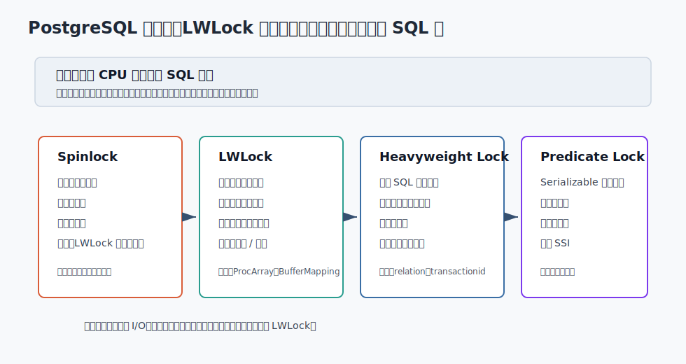
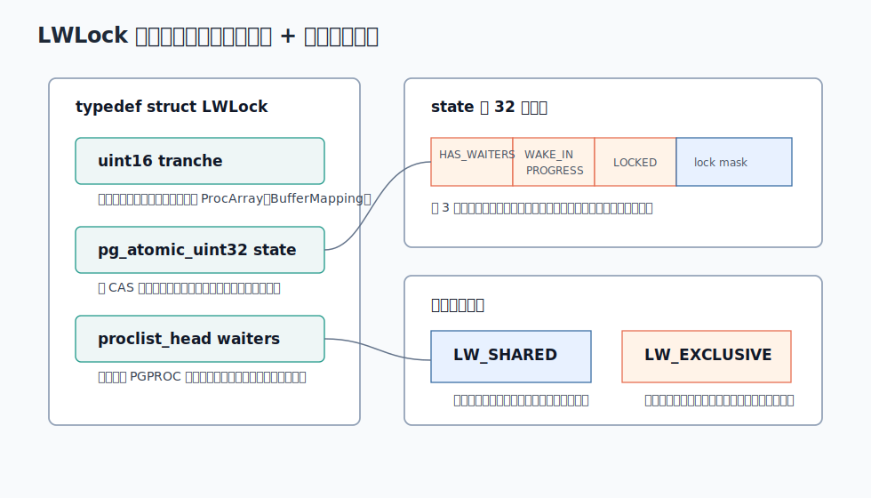
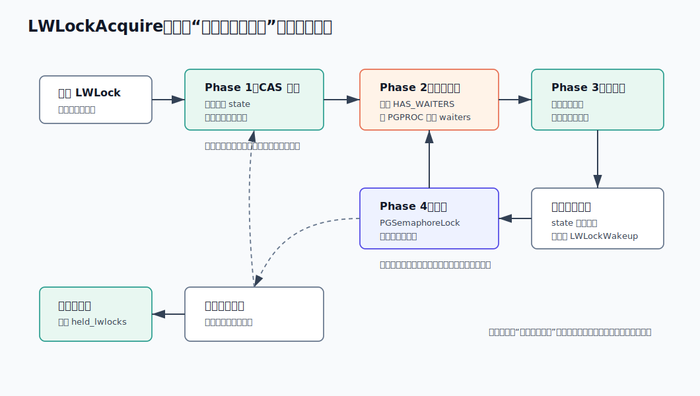
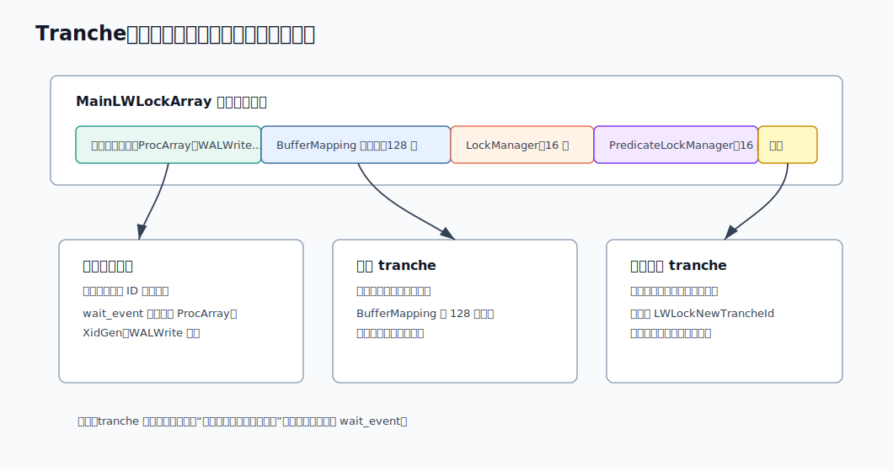
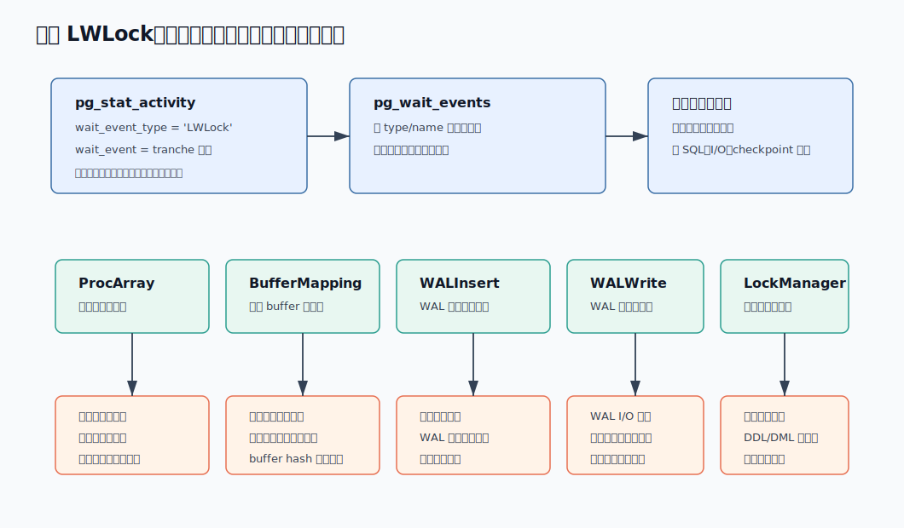

## 数据库筑基课 - 轻量锁

### 作者
digoal

### 日期
2026-06-08

### 标签
PostgreSQL , 应用开发者 , 数据库筑基课 , 并发控制 , LWLock , 轻量锁 , 共享内存 , 性能诊断    

----

## 背景


这篇属于数据库筑基课里的“内核并发控制 + 性能诊断”主题。当前项目的 `markdown/` 目录没有发现独立的“数据库筑基课大纲”文件，所以本文不强行引用不存在的大纲；后续如果项目补充课程目录，可以在这里补上链接。

先从一个真实运维场景切入：

业务高峰期，应用说数据库“锁住了”。DBA 打开 `pg_stat_activity`，看到一批会话的 `wait_event_type = 'LWLock'`，`wait_event` 可能是 `ProcArray`、`BufferMapping`、`WALInsert`、`WALWrite` 或 `LockManager`。如果把它们都当成 `LOCK TABLE`、行锁、死锁去处理，很容易走偏：杀错会话、盲目加索引、只盯 `pg_locks`，却没有看共享缓冲区、事务快照、WAL 写入和内核共享结构竞争。

轻量锁的难点在于：它叫“锁”，但它不是应用开发者平时理解的表锁、行锁、 advisory lock。它主要保护 PostgreSQL 后端进程之间共享的内存数据结构。用户 SQL 可能触发它，但用户不能用 SQL 直接申请某个核心 LWLock，也不能用普通 SQL 锁等待规则完整解释它。

本文以本地 PostgreSQL 源码目录 `postgres` 为主线。主要证据来自：

- 项目说明：`postgres/CLAUDE.md`
- 锁管理概览：`postgres/src/backend/storage/lmgr/README`
- 轻量锁实现：`postgres/src/backend/storage/lmgr/lwlock.c`
- 轻量锁接口与布局：`postgres/src/include/storage/lwlock.h`
- 预定义锁与 tranche：`postgres/src/include/storage/lwlocklist.h`
- 等待事件文档：`postgres/doc/src/sgml/monitoring.sgml`
- 等待事件名称：`postgres/src/backend/utils/activity/wait_event_names.txt`
- 扩展使用 LWLock 的文档：`postgres/doc/src/sgml/xfunc.sgml`
- 典型调用路径：`postgres/src/backend/storage/buffer/bufmgr.c`、`postgres/src/include/storage/buf_internals.h`、`postgres/src/backend/storage/ipc/procarray.c`、`postgres/src/backend/access/transam/xlog.c`
- DeepWiki：`postgres/postgres` 的 Architecture Overview、Core Systems、Process and Transaction Management 相关页面，以及关于 LWLock 实现和 LWLock/heavyweight lock manager 关系的问答。

说明：用户最初给出的 DeepWiki repoName `postgres-db/postgres` 查询返回 `Repository not found`；随后更正为 `postgres/postgres` 后，DeepWiki 可用。本文用 DeepWiki 做架构辅助理解，关键结论仍以本地官方文档和源码核验为准。

## 一、它解决什么问题？

PostgreSQL 是多进程架构。每个客户端连接通常对应一个后端进程，多个后端会同时访问同一批共享内存结构，例如：

- 共享缓冲区里的页面映射表。
- 当前活跃事务数组 `ProcArray`。
- WAL buffer、WAL 写入状态和 WAL 插入锁。
- heavyweight lock manager 的共享哈希表。
- SLRU、通知队列、复制槽、统计信息、并行执行共享状态。

这些结构有三个共同特点：

1. 访问非常频繁。
2. 临界区通常很短。
3. 需要跨后端进程互斥，而不是只在一个线程里互斥。

如果只用 spinlock，等待者会忙等，临界区稍微长一点就浪费 CPU。`src/backend/storage/lmgr/README` 明确说 spinlock 只适合非常短的锁，超过几十条指令或跨内核调用就不该用。

如果都用 heavyweight lock manager，语义太重：它要支持多种锁模式、冲突矩阵、死锁检测、事务结束释放、SQL 可见对象等。用它保护每一次 buffer hash 查找、快照数组扫描或 WAL buffer 状态更新，成本太高。

LWLock 解决的就是中间层问题：比 spinlock 更适合稍长一点的共享内存临界区；比 heavyweight lock 更轻，适合高频内部路径；等待时可以睡眠，不持续烧 CPU。

它牺牲的东西也很明确：

- 没有死锁检测。
- 没有普通锁那样的用户级等待语义。
- 不适合可能长时间等待的业务级互斥。
- 获取和等待 LWLock 时会推迟 query cancel / die interrupt，因此不应把它用在不可控长等待路径上。

所以轻量锁不是“更好的表锁”，而是 PostgreSQL 内核为了保护共享内存结构做的工程折中。

## 二、它是什么？

一句话定义：LWLock 是 PostgreSQL 后端进程之间使用的轻量级读写锁，主要用于保护共享内存数据结构，支持 `LW_SHARED` 和 `LW_EXCLUSIVE` 两种正常获取模式。

先把它放进 PostgreSQL 的锁体系里看。



图 1 说明：PostgreSQL 至少有四类常见进程间锁语义。Spinlock 是最底层的短临界区工具；LWLock 保护共享内存结构；heavyweight lock 保护 SQL 可见对象和某些内部操作；predicate lock 服务 Serializable 隔离级别的冲突检测。LWLock 位于内部共享内存并发控制层，不是用户业务锁。

源码里的 `LWLock` 结构很小，定义在 `src/include/storage/lwlock.h`：

- `tranche`：锁用途分类，用来生成等待事件名。
- `state`：32 位原子状态，记录共享持有者数量、排他持有者和内部标志。
- `waiters`：等待该锁的 `PGPROC` 链表。

此外，`LWLockPadded` 会把锁实例填充到 cache line 大小。源码注释给出的原因是减少 cache contention，尤其是主 LWLock 数组里部分锁非常热。

LWLock 的两个常用模式：

| 模式 | 含义 | 典型用途 |
|---|---|---|
| `LW_SHARED` | 多个读者可同时持有，只和排他持有冲突 | 查 buffer mapping、取快照、读取共享状态 |
| `LW_EXCLUSIVE` | 独占持有，和共享/排他都冲突 | 修改共享哈希、事务退出更新 ProcArray、替换 WAL buffer 映射 |

还有一个内部等待模式 `LW_WAIT_UNTIL_FREE`，不是给 `LWLockAcquire()` 调用者直接用的。它用于“只等锁释放或变量变化，不一定要真正获得锁”的场景，例如 WAL 插入进度等待。

## 三、核心原理

### 3.1 状态字：用 CAS 表达共享计数和排他哨兵

`src/backend/storage/lmgr/lwlock.c` 的实现重点，是尽量避免每次获取锁都先拿一个 spinlock。旧实现曾用 spinlock 保护内部状态，但共享模式频繁获取时开销太高。当前实现用一个原子 `state` 承载锁状态，通过 compare-and-exchange 尝试修改。



图 2 说明：`state` 的高位是内部标志，例如是否有等待者、是否正在唤醒、等待队列是否被短暂锁住；低位是锁占用状态。共享模式通过计数表达持有者数量；排他模式通过一个不会和共享计数冲突的哨兵值表达独占占用。

关键设计点：

- 共享获取时，只要没有排他持有者，就增加共享计数。
- 排他获取时，只有锁完全空闲才能写入排他哨兵值。
- 等待队列本身也需要保护，LWLock 内部用很短的状态位锁住 wait list。
- 无竞争路径只需要少量原子操作，这是 LWLock 适合高频路径的原因。

注意：LWLock 不是递归锁。源码用 backend-local 的 `held_lwlocks` 数组记录当前进程持有的 LWLock，主要用于释放和错误恢复；这不意味着业务可以随意重复获取同一把锁。

### 3.2 获取流程：先原子尝试，入队后再尝试

LWLock 的等待流程不是“失败就睡”。如果失败后直接入队并睡眠，会有一个竞态：在你判断失败和完成入队之间，持锁者可能已经释放锁；如果没人再唤醒你，就会睡丢。

PostgreSQL 用两阶段检查规避这个问题。



图 3 说明：`LWLockAcquire()` 先用 `LWLockAttemptLock()` 做一次原子尝试；失败后通过 `LWLockQueueSelf()` 入队；入队后再尝试一次。如果第二次成功，就调用 `LWLockDequeueSelf()` 撤销等待队列记录；如果仍失败，才通过 `PGSemaphoreLock()` 睡眠。释放者通过 `LWLockWakeup()` 唤醒有机会获取锁的等待者，但唤醒不等于直接授予锁，等待者醒来后还要重新竞争。

这个设计带来几个工程后果：

- 无竞争时非常快。
- 有竞争时等待者睡眠，不持续占用 CPU。
- 唤醒和授予分离，减少“每次释放都强制上下文切换”的成本。
- 因为没有死锁检测，调用者必须遵守固定锁顺序，避免 A 等 B、B 等 A。

### 3.3 Tranche：让一组锁有可观测的名字

`tranche` 可以理解为“这把 LWLock 属于哪类用途”。它不是锁模式，而是命名和分组机制。`GetLWLockIdentifier()` 最终根据 wait event class 和 event id，把 `tranche` 映射成 `pg_stat_activity.wait_event` 里的名字。

`src/include/storage/lwlocklist.h` 保存了两类内置名称：

- 预定义单个 LWLock，例如 `ProcArray`、`XidGen`、`WALWrite`、`ControlFile`。
- 内置 tranche，例如 `BufferMapping`、`LockManager`、`PredicateLockManager`、`WALInsert`、`XactSLRU`。

`src/include/storage/lwlock.h` 还定义了几个关键分区数量：

- `NUM_BUFFER_PARTITIONS = 128`
- `NUM_LOCK_PARTITIONS = 16`
- `NUM_PREDICATELOCK_PARTITIONS = 16`



图 4 说明：PostgreSQL 启动时会在共享内存里初始化 `MainLWLockArray`。数组前半部分是预定义单个锁；后面是按用途分组的分区锁，例如 128 个 `BufferMapping` 锁和 16 个 `LockManager` 锁；扩展也可以申请命名 tranche。等待事件显示的是用途名，通常不是具体第几个分区。

扩展也能使用 LWLock。官方扩展文档 `doc/src/sgml/xfunc.sgml` 给出两条路径：

- 启动阶段通过 `RequestNamedLWLockTranche()` 申请一组命名 LWLock，再用 `GetNamedLWLockTranche()` 取数组。
- 运行时通过 `LWLockNewTrancheId()` 获取 tranche id，再用 `LWLockInitialize()` 初始化锁。

工程边界是：扩展作者可以用 LWLock 保护自己的共享内存结构，但必须保证临界区短、锁顺序清晰、不会在持锁期间做不可控长等待。

### 3.4 典型路径一：BufferMapping

共享缓冲区需要维护“某个磁盘块当前在哪个 buffer slot 里”的映射。`src/include/storage/buf_internals.h` 说明 shared buffer mapping table 被分区以降低竞争：先对 `BufferTag` 计算 hash，再通过 `BufMappingPartitionLock()` 找到分区 LWLock。

`src/backend/storage/buffer/bufmgr.c` 中典型路径是：

- 查找块是否已经在 buffer pool：拿 `BufferMapping` 分区锁的 `LW_SHARED`。
- 没找到并需要插入映射：释放共享锁，拿 victim buffer，然后拿同一个分区锁的 `LW_EXCLUSIVE` 插入。
- 替换或删除旧映射：拿对应分区锁的 `LW_EXCLUSIVE`。

这解释了为什么 `LWLock:BufferMapping` 不等于“某张表被锁”。它通常指向共享缓冲区映射表竞争。可能的上层原因包括随机访问太分散、工作集超过缓存、热点块高频替换、并发读写集中打到某些 buffer hash 分区等。具体根因还要结合 SQL、buffer cache 命中率、I/O、checkpoint、表膨胀和访问模式判断。

### 3.5 典型路径二：ProcArray

`ProcArray` 保存活跃事务和后端进程相关状态，是 MVCC 快照正确性的关键结构。

`src/backend/access/transam/README` 解释了一个重要规则：快照获取和事务退出需要严格协调，不能让一个事务在别人取快照的中途从 running set 里消失。实现方式是：

- `GetSnapshotData()` 获取 `ProcArrayLock` 的 `LW_SHARED`，多个后端可以并行取快照。
- 事务结束清理自身 XID 时，`ProcArrayEndTransaction` 相关路径需要 `ProcArrayLock` 的 `LW_EXCLUSIVE`。
- 只读且没有分配 XID 的事务结束时通常不需要同样的 ProcArray 退出动作，因为它不影响别人快照里的事务可见性。

`src/backend/storage/ipc/procarray.c` 中 `GetSnapshotData()` 的注释还说明，快照包含 `xmin`、`xmax` 和运行中 XID 列表；在持有 `ProcArrayLock` 时扫描 dense arrays，计算当前快照需要看到的 running set。

所以 `LWLock:ProcArray` 常见于高并发快照获取、事务集中提交、连接数过高、事务生命周期过密、长事务影响全局可见性边界等场景。它不一定说明某个 SQL 拿了表锁，更可能是在 MVCC 元数据路径上发生竞争。

### 3.6 典型路径三：WALInsert 和 WALWrite

WAL 路径里有多类 LWLock：

- `WALInsert`：保护 WAL 记录插入到内存 buffer 的过程。
- `WALWrite`：保护 WAL buffer 写盘或刷盘路径。
- `WALBufMapping`：替换 WAL buffer 页面映射时使用。

`src/backend/access/transam/xlog.c` 定义 `NUM_XLOGINSERT_LOCKS = 8`。源码注释给出的权衡是：更多插入锁允许更多 WAL 插入并发，但 WAL flush 需要遍历这些锁，会增加 CPU 开销。

WAL 插入分两步：先预留 WAL 空间，再把记录复制到对应 WAL buffer。第二步通常可以多个进程并行。每个插入者会拿一个 WAL insertion lock，锁上还带 `insertingAt` 进度变量；其他进程可通过 `LWLockWaitForVar()` 等待插入推进或锁释放。

所以 `LWLock:WALInsert` 更偏 WAL 内存插入竞争；`LWLock:WALWrite` 更偏 WAL 写出/刷盘路径。看到 WAL 相关 LWLock 等待时，不应只看 SQL，还要看事务提交频率、WAL 生成速率、同步提交、存储延迟、checkpoint、复制确认和大批量写入模式。

### 3.7 观测路径：wait_event 是入口，不是结论

PostgreSQL 官方监控文档 `doc/src/sgml/monitoring.sgml` 把等待事件分成多个类型。`LWLock` 类型表示后端正在等待轻量锁，`wait_event` 会显示轻量锁用途名。`pg_wait_events` 还能给出事件描述。



图 5 说明：排查 LWLock 等待时，先从 `pg_stat_activity` 看 `wait_event_type` 和 `wait_event`，再用 `pg_wait_events` 确认事件含义，然后回到对应共享资源路径。`ProcArray`、`BufferMapping`、`WALInsert`、`WALWrite`、`LockManager` 指向不同子系统，不能用同一套“锁等待”套路处理。

源码里还有两类更底层观测方式：

- `trace_lwlocks`：只有编译时定义 `LOCK_DEBUG` 才可用，生产通常不可用。
- DTrace/systemtap probes：监控文档列出 `lwlock-acquire`、`lwlock-release`、`lwlock-wait-start`、`lwlock-wait-done` 等探针。

对普通 DBA 来说，优先用 `pg_stat_activity`、`pg_wait_events`、日志、系统 I/O 指标和业务压测时间线，不要一开始就跳到内核探针。

## 四、横向对比

| 维度 | LWLock | Spinlock | Heavyweight Lock | Predicate Lock |
|---|---|---|---|---|
| 主要目标 | 保护共享内存数据结构 | 保护极短内部状态 | 保护 SQL 可见对象和锁管理器对象 | Serializable 隔离级别冲突检测 |
| 典型对象 | ProcArray、BufferMapping、WALWrite、LockManager 分区 | LWLock 内部状态、短字段更新 | relation、transactionid、tuple、object | relation/page/tuple 读依赖 |
| 等待方式 | 等待时睡眠，释放时唤醒 | 忙等 | 锁管理器等待队列 | 记录依赖，必要时触发序列化失败 |
| 锁模式 | 共享、排他 | 通常是互斥 | 多种表驱动模式 | 不是普通读写锁模式 |
| 死锁检测 | 无 | 无 | 有 | SSI 冲突检测，不等同死锁检测 |
| 自动释放 | ERROR 恢复时释放已持有 LWLock | 无完整高级机制 | 事务结束释放事务锁 | 事务结束清理相关状态 |
| 用户可见性 | 通过 wait_event 间接可见 | 基本不可见 | `pg_locks`、等待事件可见 | 可通过 Serializable 行为和部分视图间接观察 |
| 适合场景 | 高频、短临界区、共享内存 | 极短 CPU 临界区 | 用户 SQL 对象锁、DDL/DML 协调 | 防止 Serializable 下读写异常 |
| 不适合场景 | 用户业务锁、长等待、复杂死锁关系 | 任何可能睡眠或 I/O 的路径 | 高频内部微临界区 | 替代普通锁或业务互斥 |

这张表的关键不是“谁更高级”，而是“保护对象不同”。业务 SQL 看到 `wait_event_type = 'Lock'`，优先查 `pg_locks` 和对象锁冲突；看到 `wait_event_type = 'LWLock'`，优先回到共享内存子系统和 wait_event 名称。

## 五、效果如何？

LWLock 的收益：

- 无竞争路径轻：`lwlock.c` 用原子 CAS 直接尝试获取，避免每次都先拿 spinlock。
- 支持读多写少：共享模式允许多个读者同时持有，只被排他持有者阻塞。
- 等待不烧 CPU：竞争失败后进入等待队列并通过信号量睡眠。
- 可观测：等待事件能暴露 tranche 名称，例如 `ProcArray`、`BufferMapping`、`WALInsert`。
- 可恢复：`LWLockReleaseAll()` 能在 ERROR 恢复路径释放当前后端持有的 LWLock，降低错误路径遗留内部锁的风险。
- 可分区：BufferMapping、LockManager、PredicateLockManager 等通过多个 LWLock 分区降低单点竞争。

它的代价：

- 没有死锁检测。代码必须靠固定锁顺序和短临界区保证安全。
- 没有普通锁超时语义。不要指望 `lock_timeout` 像处理表锁那样处理 LWLock。
- 等待和持有期间会推迟 query cancel / die interrupt。`lmgr/README` 明确提醒，不适合等待时间可能超过几秒的场景。
- 分组 wait_event 不一定定位到具体实例。例如 `BufferMapping` 只告诉你在 buffer mapping tranche 上等，不告诉你具体哪个 hash 分区、哪个 relation block。
- 高频共享结构仍可能产生 cache line 抖动。`proc.h` 里 dense array 的设计说明，PostgreSQL 为减少 ProcArray 扫描和 cacheline ping-pong 做了专门布局，但热点无法完全消失。

所以 LWLock 的目标不是消除竞争，而是在内核高频路径上把“正确性、等待成本、观测能力、实现复杂度”压到一个可接受区间。

## 六、实操 DEMO

本节 SQL 是可复制执行的观测方法。当前会话没有启动本地 PostgreSQL 实例，也没有指定数据库连接参数，因此没有执行这些 SQL，不提供未验证输出。

### 6.1 查看当前 LWLock 等待

```sql
SELECT
  pid,
  usename,
  application_name,
  state,
  wait_event_type,
  wait_event,
  now() - query_start AS query_age,
  left(query, 120) AS query_sample
FROM pg_stat_activity
WHERE wait_event_type = 'LWLock'
ORDER BY query_start NULLS LAST;
```

这条查询回答的是：“现在谁正在等 LWLock，等的是哪类共享资源”。它只看瞬时状态，低频采样可能错过短等待。

### 6.2 查事件含义

```sql
SELECT
  type,
  name,
  description
FROM pg_wait_events
WHERE type = 'LWLock'
  AND name IN ('ProcArray', 'BufferMapping', 'WALInsert', 'WALWrite', 'LockManager')
ORDER BY name;
```

这条查询把事件名翻译成资源含义。`pg_wait_events` 的数据来自 PostgreSQL 等待事件定义，适合做诊断面板的字典表。

### 6.3 采样聚合

```sql
SELECT
  wait_event,
  count(*) AS waiting_backends,
  min(now() - query_start) AS shortest_query_age,
  max(now() - query_start) AS longest_query_age
FROM pg_stat_activity
WHERE wait_event_type = 'LWLock'
GROUP BY wait_event
ORDER BY waiting_backends DESC, wait_event;
```

如果高峰期 `ProcArray` 一直排第一，优先看连接数、事务持续时间、短事务提交密度、长事务和快照使用。如果 `BufferMapping` 一直排第一，优先看工作集、shared buffers 命中、随机 I/O、热点表/索引访问和 buffer 替换压力。如果 `WALWrite` 排第一，优先看 WAL 设备延迟、同步提交、checkpoint 和复制。

### 6.4 不要用 `LOCK TABLE` 复现 LWLock

下面这种 SQL 产生的是 heavyweight lock 等待，不是 LWLock 等待：

```sql
BEGIN;
LOCK TABLE t IN ACCESS EXCLUSIVE MODE;
```

其他会话被阻塞时，通常会看到 `wait_event_type = 'Lock'`，而不是 `LWLock`。这正是本文反复强调的边界：表锁、行锁和轻量锁不是同一层东西。

### 6.5 压测时的观测方式

可以在压测窗口持续采样，而不是只看一次：

```sql
CREATE TEMP TABLE lwlock_sample AS
SELECT now() AS sample_time, wait_event, count(*) AS n
FROM pg_stat_activity
WHERE wait_event_type = 'LWLock'
GROUP BY wait_event;
```

实际生产中更建议由外部监控系统每 1 秒或更短周期采样，把 `wait_event_type`、`wait_event`、active SQL、TPS、WAL 写入量、I/O 延迟、checkpoint、连接数放在同一张时间线上看。LWLock 等待本身只是症状，根因通常在 workload 和共享资源路径上。

## 七、最佳实践

### 7.1 给数据库架构师

把 LWLock 当成“共享内存热点信号”，不要当成“业务锁冲突信号”。

设计高并发系统时，优先减少共享热点：

- 避免所有事务频繁更新同一行、同一索引页或同一小表热点。
- 对计数器、库存、余额等热点对象，考虑分片计数、批量合并、队列化写入或更明确的业务串行化边界。
- 控制连接数，不要用几千个活跃后端把 ProcArray 和调度系统打爆。
- 小事务过多时，评估批量提交、连接池、事务合并和异步化。
- WAL 压力大时，把事务大小、提交频率、`synchronous_commit`、复制策略和存储延迟一起评估。

架构上不要把“看到 LWLock 等待”直接解释成“数据库参数不够大”。很多时候调大单个参数只是在移动热点。

### 7.2 给 DBA

诊断顺序建议：

1. 先区分 `wait_event_type`：`Lock`、`LWLock`、`IO`、`Buffer`、`IPC` 是不同路径。
2. 对 `LWLock`，按 `wait_event` 分类，不要混在一起看总量。
3. 用 `pg_wait_events` 查事件描述，确认保护对象。
4. 回到具体子系统看证据：ProcArray 看事务与连接；BufferMapping 看 buffer 与 I/O；WAL 看提交与存储；LockManager 再看 `pg_locks`。
5. 用时间序列确认“持续热点”还是“瞬时尖峰”。

几个常见映射：

| wait_event | 优先检查 | 常见治理方向 |
|---|---|---|
| `ProcArray` | 活跃连接数、事务持续时间、快照获取频率、长事务 | 连接池限流、缩短事务、减少空闲事务、降低短事务风暴 |
| `BufferMapping` | shared buffer 命中、随机 I/O、热点 relation、工作集大小 | 优化访问路径、减少随机访问、拆热点、改善缓存与 I/O |
| `WALInsert` | WAL 生成速率、小事务密度、写入并发 | 批量提交、减少无效写、降低索引维护成本 |
| `WALWrite` | WAL 设备延迟、fsync、同步提交、checkpoint | 存储优化、提交策略调整、checkpoint 参数治理 |
| `LockManager` | `pg_locks`、DDL/DML 混跑、对象锁数量 | 避免高峰 DDL、拆事务、减少锁表扫描与对象锁冲突 |

### 7.3 给业务开发者

业务开发者不需要手写 LWLock，但要避免制造 LWLock 热点：

- 事务尽量短，不要在事务里等待用户输入、外部 HTTP、慢 RPC。
- 不要让连接池无限扩张。数据库并发不是越多越好。
- 批量写入时关注提交频率。每行一事务会放大 WAL、ProcArray 和锁管理压力。
- 避免高峰期 DDL。DDL 等待通常是 heavyweight lock，但它会连带影响内部锁表和系统目录路径。
- 看到 `LWLock` 不要只问“谁锁了我的表”，先把 `wait_event` 发给 DBA，一起判断子系统。

## 八、适合与不适合场景

### 适合

LWLock 适合这些场景：

- PostgreSQL 内核保护共享内存结构。
- 扩展保护自己的共享内存状态。
- 临界区短、访问频繁、需要共享/排他模式。
- 等待可控，调用路径能保证不会形成死锁。
- 需要通过 wait_event 暴露内部等待类别。

例如扩展维护一个共享统计哈希表：读统计时拿 `LW_SHARED`，更新统计时拿 `LW_EXCLUSIVE`，临界区只做内存读写，不执行 SQL、不做网络 I/O、不等待外部服务。这类场景适合 LWLock。

### 不适合

LWLock 不适合这些场景：

- 用户业务互斥，例如“一个订单只能一个 worker 处理”。
- 长时间持锁等待外部系统、磁盘慢 I/O、网络调用。
- 需要死锁检测、超时、事务结束自动释放用户锁的场景。
- 想表达表、行、schema、对象级 SQL 语义。
- 扩展代码在持 LWLock 时调用可能 ERROR、可能递归进入复杂数据库逻辑的路径。

业务层需要互斥时，优先考虑行锁、唯一约束、advisory lock、队列、状态机、Serializable 或外部协调系统，而不是试图接触 LWLock。

## 九、常见坑

### 9.1 把 LWLock 当成表锁

`wait_event_type = 'LWLock'` 不等于某张表被锁。表锁等待通常是 `wait_event_type = 'Lock'`，并能在 `pg_locks` 里看到对象和模式。LWLock 只告诉你后端正在等内部共享资源。

### 9.2 只看 `pg_locks`

`pg_locks` 对 heavyweight lock 很有用，但对 `BufferMapping`、`ProcArray`、`WALInsert` 这类 LWLock 热点不够。看到 LWLock 时还要看 `pg_stat_activity`、`pg_wait_events`、I/O、事务、WAL 和 SQL 访问模式。

### 9.3 以为 `lock_timeout` 能解决 LWLock

`lock_timeout` 面向 SQL 锁等待，不是 LWLock 的通用解法。`lmgr/README` 还提醒，等待 spinlock 或 LWLock 时不会像普通锁等待那样接受 query cancel / die interrupt。因此根治 LWLock 热点要减少共享资源竞争，而不是指望锁超时。

### 9.4 看到 `BufferMapping` 就调大 shared_buffers

`BufferMapping` 指向 buffer mapping hash 竞争。调大 `shared_buffers` 有时能减少替换，有时也会改变缓存行为和 checkpoint 压力。必须结合命中率、工作集、I/O、访问路径、热点页、表膨胀和 checkpoint 一起看。

### 9.5 看到 `ProcArray` 就只怪长事务

长事务会影响 ProcArray 和 vacuum 边界，但 `ProcArray` 等待也可能来自高连接数、短事务风暴、集中提交、频繁取快照。诊断时要同时看 `state = 'idle in transaction'`、活跃连接数、TPS、事务年龄和应用连接池。

### 9.6 扩展持 LWLock 做复杂逻辑

扩展作者最容易犯的错，是把 LWLock 当普通互斥锁使用，在持锁期间做内存分配、SQL 调用、I/O、日志大量输出或等待其他复杂锁。正确做法是：持锁只读写必要共享字段，复制出本地数据后尽快释放，再做慢操作。

### 9.7 忽略锁顺序

LWLock 没有死锁检测。只要两条路径以不同顺序拿两把 LWLock，就可能无限等待。内核代码通常用固定顺序、分区编号顺序、先释放再获取等方式规避。扩展也必须把锁顺序写成明确约束。

## 十、扩展问题

1. 如果把某个全局计数器从一把 LWLock 改成 128 个分片计数，读写路径的正确性和统计延迟会怎样变化？
2. 为什么 `ProcArrayLock` 允许多个快照并行获取，但事务退出需要排他锁？这和 MVCC 可见性有什么关系？
3. `BufferMapping` 的分区数固定为 128。分区更多一定更好吗？会增加哪些 CPU、内存和遍历成本？
4. WAL 插入锁为什么是多个，而 WAL 写盘锁仍然需要序列化？这反映了“内存并发”和“持久化顺序”的什么差异？
5. 如果你写 PostgreSQL 扩展，什么时候应该用 LWLock，什么时候应该用 atomics、condition variable、latch、heavyweight lock 或 advisory lock？

## 十一、扩展阅读

本地源码和文档：

- `postgres/CLAUDE.md`：当前 PostgreSQL 项目的构建、测试和源码结构说明。
- `postgres/src/backend/storage/lmgr/README`：PostgreSQL 四类进程间锁概览，包含 spinlock、LWLock、heavyweight lock、SIReadLock 的边界。
- `postgres/src/backend/storage/lmgr/lwlock.c`：LWLock 核心实现，包括状态位、CAS 获取、等待队列、唤醒、`LWLockWaitForVar()` 和错误恢复释放。
- `postgres/src/include/storage/lwlock.h`：LWLock 数据结构、模式、分区数量、主数组偏移和扩展 API 声明。
- `postgres/src/include/storage/lwlocklist.h`：预定义 LWLock 和内置 tranche 名称。
- `postgres/src/backend/utils/activity/wait_event_names.txt`：LWLock wait event 名称与描述。
- `postgres/doc/src/sgml/monitoring.sgml`：`pg_stat_activity`、`pg_wait_events`、等待事件类型和 LWLock tracing probes。
- `postgres/doc/src/sgml/config.sgml`：`trace_lwlocks`，仅 `LOCK_DEBUG` 编译时可用。
- `postgres/doc/src/sgml/xfunc.sgml`：扩展如何申请和初始化 LWLock。
- `postgres/src/include/storage/buf_internals.h`：BufferMapping 分区锁逻辑。
- `postgres/src/backend/storage/buffer/bufmgr.c`：buffer lookup、insert、replace 时的 BufferMapping LWLock 使用。
- `postgres/src/backend/storage/ipc/procarray.c`：`GetSnapshotData()` 和 ProcArrayLock 使用。
- `postgres/src/backend/access/transam/README`：事务、快照和 ProcArrayLock 正确性约束。
- `postgres/src/backend/access/transam/xlog.c`：WALInsert、WALWrite、WALBufMapping 等 LWLock 使用。

DeepWiki：

- `postgres/postgres` DeepWiki 目录页：`https://deepwiki.com/postgres/postgres`
- DeepWiki LWLock 实现问答：`https://deepwiki.com/search/where-are-postgresql-lwlock-li_ee80a4bf-3e63-4c62-9db5-be0e21a0a8dd`
- DeepWiki LWLock 与 heavyweight lock manager 关系问答：`https://deepwiki.com/search/what-is-the-relationship-betwe_5accc25d-eff7-4f1d-a812-18d4d73fabf5`
- 说明：DeepWiki 返回的核心结论与本地源码一致，包括 `src/backend/storage/lmgr/lwlock.c`、`src/include/storage/lwlock.h`、两阶段获取流程、tranche、共享/排他模式，以及 heavyweight lock manager 依赖 LWLock 保护其共享哈希表。本文仍以本地源码和官方文档作为最终依据。
  
## 附录 
1、克隆代码  
```  
git clone --depth 1 https://github.com/postgres/postgres
```  
  
2、启用 codex, 使用 [数据库筑基课 skill](../skills/README.md).  
```
文章标题: 
  数据库筑基课 - 轻量锁
项目源码(本地目录): 
  postgres
项目 codebase 文件名: 
  postgres/CLAUDE.md 
开源项目相关的 deepwiki repoName: 
  postgres/postgres
```
    
#### [PostgreSQL 解决方案集合](../201706/20170601_02.md "40cff096e9ed7122c512b35d8561d9c8")
  
  
#### [德哥 / digoal's Github - 公益是一辈子的事.](https://github.com/digoal/blog/blob/master/README.md "22709685feb7cab07d30f30387f0a9ae")
  
  
#### [About 德哥](https://github.com/digoal/blog/blob/master/me/readme.md "a37735981e7704886ffd590565582dd0")
  
  

  
