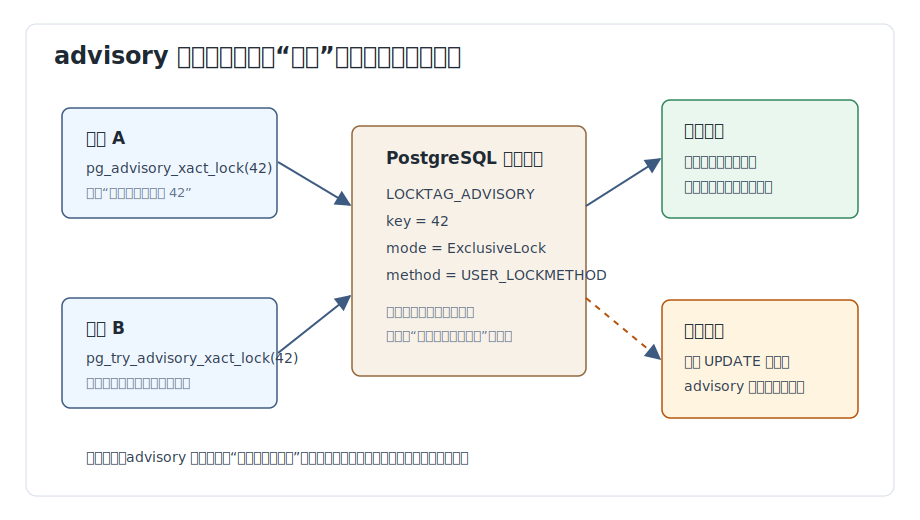
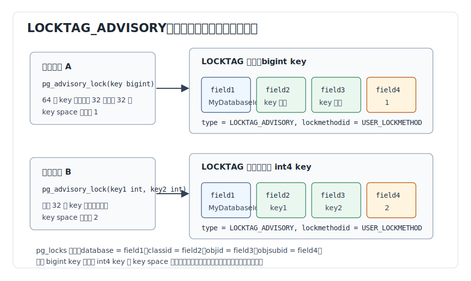
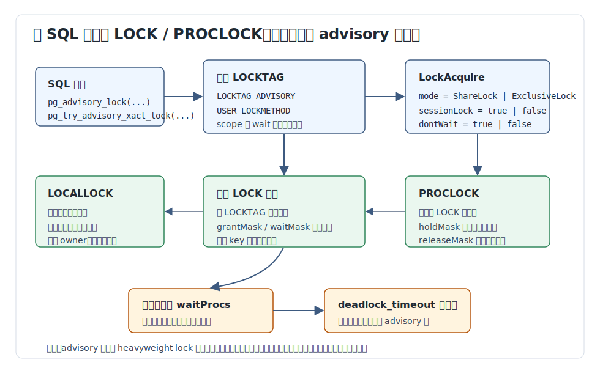
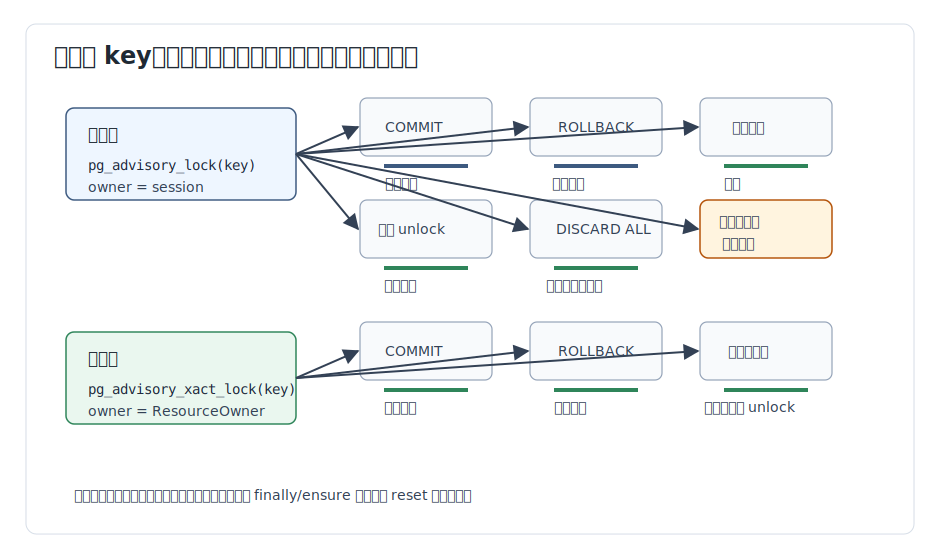
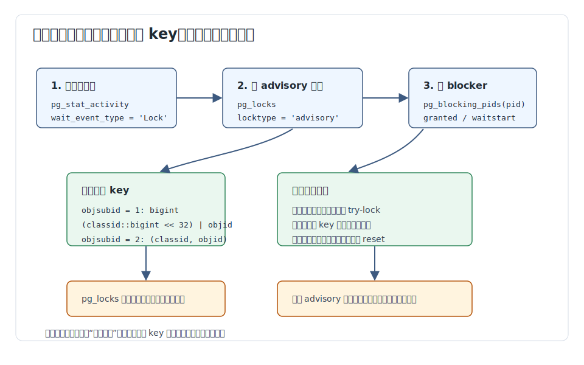

## 数据库筑基课 - advisory 锁

### 作者
digoal

### 日期
2026-06-08

### 标签
PostgreSQL , 应用开发者 , 数据库筑基课 , advisory lock , 并发控制 , 锁管理器 , 事务    

----

## 背景


这篇属于数据库筑基课里的“场景实践 + 并发控制内核机制”主题。

本地 `markdown/` 目录没有发现独立的“数据库筑基课大纲”文件，所以本文不强行引用不存在的大纲；后续如果项目补充大纲，可以在这里补上课程目录链接。

先从一个真实工程问题说起：

一个系统有后台任务表 `jobs`。多个 worker 同时拉取任务，业务希望同一个租户在同一时间只跑一个“对账任务”。用行锁可以锁住某一行，但“租户 42 的对账任务”并不总是已经有一行稳定存在；用一张 `tenant_locks` 表做标记也能实现，但会带来写热点、死锁、异常退出后清理、表膨胀和运维脚本误删等问题。

这时 PostgreSQL 的 advisory 锁就很合适：应用把“租户 42 的对账任务”映射成一个数字 key，例如 `hashtext('reconcile:tenant:42')` 或两个整数 `(namespace, tenant_id)`，然后在执行关键逻辑前拿锁。数据库负责互斥、等待、死锁检测、事务结束或会话结束清理；业务负责定义 key 的含义并保证所有相关代码都遵守同一个协议。

本文以本地 PostgreSQL 源码目录 `postgres` 为主线。重要结论来自：

- 官方文档 `doc/src/sgml/mvcc.sgml` 的 advisory locks 章节。
- 官方文档 `doc/src/sgml/func/func-admin.sgml` 的 advisory lock 函数表。
- 官方文档 `doc/src/sgml/system-views.sgml` 的 `pg_locks` 展示规则。
- 源码 `src/backend/utils/adt/lockfuncs.c` 的 SQL 函数实现。
- 源码 `src/include/storage/locktag.h` 的 `LOCKTAG_ADVISORY` 编码。
- 源码与说明 `src/backend/storage/lmgr/README`、`src/backend/storage/lmgr/lock.c`、`src/backend/storage/lmgr/proc.c` 的锁管理器机制。
- 高可用文档 `doc/src/sgml/high-availability.sgml` 关于 standby 上 advisory 锁不写 WAL、不传播的说明。
- DeepWiki `postgres/postgres` 定向问答，用作辅助架构索引；其返回的实现入口与本地源码核对一致，包括 `lockfuncs.c`、`lock.c`、`locktag.h` 和 `pg_locks`。

用户补充修正 DeepWiki repoName 为 `postgres/postgres`。本文仍以本地源码和官方文档为主证据，DeepWiki 只作为定位架构入口和交叉检查的辅助参考。

## 一、它解决什么问题？

advisory 锁解决的是“数据库对象之外的应用自定义资源互斥”问题。

普通锁一般绑定数据库内部对象：

- 表锁绑定 relation。
- 行锁绑定 tuple。
- 事务锁绑定 transaction id 或 virtual transaction id。
- 对象锁绑定 class OID、object OID。

但业务里经常要锁的对象不是数据库已经内置建模的对象：

- 同一个用户只允许一个导出任务。
- 同一个租户的账务结算不能并行跑。
- 同一个外部文件只能被一个 worker 导入。
- 某个全局迁移任务只能有一个进程执行。
- 多张表共同组成的业务资源需要被当作一个整体串行化。

没有 advisory 锁时，常见做法是建一张“锁表”：

```sql
CREATE TABLE app_locks (
  lock_name text PRIMARY KEY,
  holder text,
  locked_at timestamptz NOT NULL DEFAULT now()
);
```

然后用 `INSERT`、`UPDATE`、`DELETE` 表示抢锁和释放。这种方式有几个代价：

1. 锁本身变成了业务数据，要处理异常退出后的垃圾记录。
2. 高频锁会制造表和索引膨胀，需要 autovacuum 清理。
3. 锁表也会参与普通事务、复制、备份、权限、审计，运维复杂度上升。
4. 如果业务逻辑绕过锁表直接更新真实资源，数据库无法自动发现协议被破坏。

PostgreSQL 文档在 `doc/src/sgml/mvcc.sgml` 里明确说，advisory locks 是应用定义含义的锁，系统不会强制业务必须使用它们；它们适合 MVCC 模型难以自然表达的锁策略。文档也指出，用表里的 flag 能实现类似目的，但 advisory 锁更快、避免表膨胀，并且会在会话结束时由服务器自动清理。

代价也同样明确：advisory 锁不是约束，不是行锁，不是触发器，不是分布式锁。它只对同一个数据库实例内、同一个数据库 OID 下、同一个数字 key 上的 advisory 锁请求产生冲突。只要有一段代码不拿锁就直接改数据，advisory 锁不会替你拦住它。



图 1 说明：PostgreSQL 锁管理器看到的是 `LOCKTAG_ADVISORY + key + lock mode`，不是“订单”“租户”“文件”这些业务概念。应用所有入口必须统一遵守“先拿锁，再处理资源”的协议，否则 advisory 锁只是一个旁路标记。

## 二、它是什么？

advisory 锁是 PostgreSQL 普通 heavyweight lock 管理器中的一类“用户锁”。它的 lock tag 类型是 `LOCKTAG_ADVISORY`，lock method 是 `USER_LOCKMETHOD`，锁模式只暴露给 SQL 用户两类：

- shared：共享锁，同一个 key 上多个 shared 锁可以共存。
- exclusive：排他锁，同一个 key 上 exclusive 与 shared、exclusive 都冲突。

SQL 层提供四个维度的组合：

| 维度 | 选择 | 代表函数 |
|---|---|---|
| key 形态 | 一个 `bigint` | `pg_advisory_lock(42::bigint)` |
| key 形态 | 两个 `int` | `pg_advisory_lock(10, 42)` |
| 生命周期 | 会话级 | `pg_advisory_lock(...)` |
| 生命周期 | 事务级 | `pg_advisory_xact_lock(...)` |
| 锁模式 | 排他 | `pg_advisory_lock(...)` |
| 锁模式 | 共享 | `pg_advisory_lock_shared(...)` |
| 等待行为 | 阻塞等待 | `pg_advisory_lock(...)` |
| 等待行为 | 立即返回 | `pg_try_advisory_lock(...)` |

`doc/src/sgml/func/func-admin.sgml` 还强调一个关键点：单个 64 位 key 和两个 32 位 key 是两套不重叠的 key space。也就是说，`pg_advisory_lock(1::bigint)` 与 `pg_advisory_lock(0, 1)` 不是同一个锁。

从源码看，`src/backend/utils/adt/lockfuncs.c` 的注释直接写明了 advisory lock 如何使用 `LOCKTAG` 的四个字段：

- `field1`：`MyDatabaseId`，保证 advisory 锁是数据库本地的。
- `field2`：两个 int4 key 中的第一个，或 int8 key 的高 32 位。
- `field3`：两个 int4 key 中的第二个，或 int8 key 的低 32 位。
- `field4`：`1` 表示使用 int8 key，`2` 表示使用两个 int4 key。

`src/include/storage/locktag.h` 定义 `USER_LOCKMETHOD = 2`，并通过 `SET_LOCKTAG_ADVISORY` 把 `locktag_type` 设为 `LOCKTAG_ADVISORY`，把 `locktag_lockmethodid` 设为 `USER_LOCKMETHOD`。



图 2 说明：advisory 锁不是“字符串锁”。SQL 层只接受数字 key，应用需要自己设计命名空间和映射规则。`pg_locks` 里看到的 `database`、`classid`、`objid`、`objsubid`，本质就是 `LOCKTAG` 字段的展示。

## 三、核心原理

### 3.1 SQL 函数只是薄封装

`src/backend/utils/adt/lockfuncs.c` 里每个 advisory lock 函数都很短。以 `pg_advisory_lock(bigint)` 为例，逻辑是：

1. 读取 `int64 key`。
2. 用 `SET_LOCKTAG_INT64(tag, key)` 构造 `LOCKTAG_ADVISORY`。
3. 调用 `LockAcquire(&tag, ExclusiveLock, true, false)`。

这四个参数解释了 advisory 锁的绝大部分行为：

```c
LockAcquire(locktag, lockmode, sessionLock, dontWait)
```

| 参数 | 在 advisory 锁里的含义 |
|---|---|
| `locktag` | 由数据库 OID、key 字段、key space 标记组成的 `LOCKTAG_ADVISORY` |
| `lockmode` | `ExclusiveLock` 或 `ShareLock` |
| `sessionLock` | `true` 表示会话级，`false` 表示事务级 |
| `dontWait` | `true` 表示 try-lock 立即返回，`false` 表示等待 |

例如：

- `pg_advisory_lock_int8` 调用 `LockAcquire(..., ExclusiveLock, true, false)`。
- `pg_advisory_xact_lock_int8` 调用 `LockAcquire(..., ExclusiveLock, false, false)`。
- `pg_try_advisory_lock_shared_int4` 调用 `LockAcquire(..., ShareLock, true, true)`。

这说明 advisory 锁没有一套独立的等待队列、死锁检测或共享内存结构。它复用 PostgreSQL 普通锁管理器。



图 3 说明：advisory lock 函数构造 `LOCKTAG` 后进入 `LockAcquire`。之后就是常规 heavyweight lock 路径：后端本地 `LOCALLOCK` 记录重复获取计数，共享内存里的 `LOCK` 表示被锁对象，`PROCLOCK` 表示某个后端对某个锁对象的持有或等待关系。

### 3.2 LOCK、PROCLOCK、LOCALLOCK 分别解决什么问题？

`src/backend/storage/lmgr/README` 把普通锁管理器的数据结构讲得很清楚：

- `LOCK`：共享内存中每个可锁对象一条记录，由 `LOCKTAG` 唯一标识。
- `PROCLOCK`：某个后端进程与某个 `LOCK` 之间的关系，记录这个进程持有哪些模式、是否等待。
- `LOCALLOCK`：每个后端本地的锁计数。共享锁表只需要知道“这个后端持有这个锁模式”，但同一个后端内部可能重复获取同一把锁，所以重复计数放在本地。

这个设计解释了两个经常让开发者困惑的现象。

第一，同一个会话重复获取同一把 advisory 锁会成功，而且不会被其他会话排队影响。`doc/src/sgml/mvcc.sgml` 明确说，如果一个会话已经持有某个 advisory lock，它后续对同一标识的请求总是成功，不管其他会话是否正在等待。源码层面，`LockAcquire` 看到 `locallock->nLocks > 0` 会增加本地计数并返回 already held，而不是重新参与共享等待。

第二，会话级锁需要释放同样次数。`doc/src/sgml/func/func-admin.sgml` 明确说，多个 session-level lock requests 会 stack；同一个 resource identifier 锁三次，就需要三次 unlock 才能提前释放。这个行为来自 `LOCALLOCK` 的 `nLocks` 与 owner 计数。

### 3.3 冲突规则：shared 与 exclusive 只是普通锁模式

advisory 锁 SQL 层只暴露 shared/exclusive 两类语义，但源码里使用的是普通锁模式：

- shared advisory lock 使用 `ShareLock`。
- exclusive advisory lock 使用 `ExclusiveLock`。

`src/backend/storage/lmgr/lock.c` 的 `LockConflicts[]` 表定义了普通锁模式冲突关系。在这张表里：

- `ShareLock` 与 `ShareLock` 不冲突。
- `ExclusiveLock` 与 `ShareLock` 冲突。
- `ExclusiveLock` 与 `ExclusiveLock` 冲突。

这正好形成 advisory 锁暴露给用户的共享/排他模型。

要注意，advisory 锁虽然复用普通锁模式，但它使用 `USER_LOCKMETHOD`，普通表锁、行锁、对象锁使用 `DEFAULT_LOCKMETHOD`。`src/backend/storage/lmgr/README` 的 User Locks 小节明确说，user locks 和 normal locks 是完全正交的，不互相干扰。

所以：

```sql
SELECT pg_advisory_lock(42);
UPDATE orders SET status = 'done' WHERE id = 42;
```

上面第一句不会阻止另一个不拿 advisory 锁的会话执行同一个 `UPDATE`。只有另一个会话也请求同一个 advisory key，才会冲突。

### 3.4 生命周期：事务级优先，会话级要非常克制

PostgreSQL advisory 锁有两种生命周期。

事务级 advisory 锁：

- 通过 `pg_advisory_xact_lock(...)` 或 `pg_try_advisory_xact_lock(...)` 获取。
- 到当前事务结束时自动释放。
- 没有显式 unlock 函数。
- 更适合短临界区、请求内互斥、任务抢占。

会话级 advisory 锁：

- 通过 `pg_advisory_lock(...)` 或 `pg_try_advisory_lock(...)` 获取。
- `COMMIT` 或 `ROLLBACK` 后仍然持有。
- 需要 `pg_advisory_unlock(...)`、`pg_advisory_unlock_shared(...)` 或 `pg_advisory_unlock_all()` 显式释放。
- 会话结束时服务器自动清理。
- `DISCARD ALL` 也会释放，源码 `src/backend/commands/discard.c` 调用 `LockReleaseAll(USER_LOCKMETHOD, true)`。

`src/backend/storage/lmgr/proc.c` 的 `ProcReleaseLocks()` 注释写得很清楚：事务提交或回滚时，transaction-level advisory locks 会释放；session-level holds 保留，不管提交还是回滚。



图 4 说明：绝大多数业务临界区应该优先用事务级 advisory 锁。会话级锁适合跨事务、长时间、人工控制的“租约式”协议，但它和连接池复用天然有风险：连接归还到池里并不等于 PostgreSQL session 结束，残留锁可能影响下一个借用该连接的请求。

### 3.5 死锁检测：会检测，但不等于可以乱序拿锁

advisory 锁进入普通锁管理器，所以等待和死锁也进入普通死锁检测路径。

`src/backend/storage/lmgr/README` 说明 PostgreSQL 使用 optimistic waiting：拿不到锁时先睡眠，不立即做昂贵的死锁检查；超过 `deadlock_timeout` 后再运行死锁检测。`doc/src/sgml/config.sgml` 说明 `deadlock_timeout` 默认是 1 秒，过小会增加无谓检查，过大会让真实死锁报告变慢。

这意味着 advisory 锁不是“不会死锁”。下面这种模式就可能死锁：

```sql
-- 会话 1
BEGIN;
SELECT pg_advisory_xact_lock(1);
SELECT pg_advisory_xact_lock(2);
COMMIT;

-- 会话 2
BEGIN;
SELECT pg_advisory_xact_lock(2);
SELECT pg_advisory_xact_lock(1);
COMMIT;
```

正确做法是所有代码路径按同一个顺序拿多个 key，例如先按 key 升序排序，或者使用更粗粒度的单个组合 key。

### 3.6 内存上限：锁不是免费对象

官方文档 `doc/src/sgml/mvcc.sgml` 明确说，advisory locks 和 regular locks 存在同一个共享内存池中，大小由 `max_locks_per_transaction` 和 `max_connections` 等配置决定；如果耗尽，服务器将无法授予任何锁。

源码 `src/backend/storage/lmgr/lock.c` 在锁表满时会报 `out of shared memory`，并提示可能需要增加 `max_locks_per_transaction`。这不是 advisory 锁独有的问题，但 advisory 锁很容易被应用误用成“给每一行、每个用户、每个对象都打一把锁”，从而制造大量锁对象。

经验上，不要把 advisory 锁设计成长期持有的大规模细粒度状态表。它适合控制并发入口，不适合承载业务状态本身。

## 四、横向对比

| 维度 | advisory 锁 | 行锁 / `SELECT ... FOR UPDATE` | 唯一约束 / 排他约束 | 锁表 / 状态表 | 外部分布式锁 |
|---|---|---|---|---|---|
| 主要目标 | 应用自定义资源互斥 | 已存在行的并发修改 | 数据库内不变量约束 | 用数据行表达锁状态 | 跨进程或跨系统协调 |
| 锁对象 | 数字 key | tuple | index / constraint | 表中的行 | 外部系统 key |
| 数据库是否强制业务规则 | 否，应用自觉 | 对行修改强制 | 是 | 取决于实现 | 取决于外部系统 |
| 生命周期 | 事务级或会话级 | 通常事务级 | 数据生命周期 | 数据生命周期 | 租约、TTL 或会话 |
| 异常清理 | 事务级自动；会话结束自动 | 事务结束自动 | 不需要清理锁 | 需要设计清理 | 依赖外部系统 |
| 表膨胀 | 不产生业务表行版本 | 不额外膨胀锁表 | 正常索引维护成本 | 可能膨胀 | 不影响数据库表 |
| 死锁检测 | PostgreSQL 普通死锁检测 | PostgreSQL 普通死锁检测 | 冲突和等待由索引/锁处理 | 取决于 SQL 写法 | 依赖外部系统 |
| 跨数据库 / 跨节点 | 不适合 | 不适合 | 单库内 | 可通过复制看到状态 | 适合但要处理租约正确性 |
| 适合场景 | 单库内短临界区、任务抢占、业务 key 互斥 | 修改已存在行 | 强一致数据约束 | 需要审计和可查询状态 | 多实例、多语言、多数据库协调 |
| 不适合场景 | 需要数据库强制约束或跨节点传播 | 资源不是行 | 只是临时互斥 | 高频短锁 | 只在 PostgreSQL 单库内互斥 |

表里的核心差异是“谁负责正确性”。唯一约束和行锁是数据库强制；advisory 锁是应用协议。协议的好处是灵活，坏处也是灵活：数据库无法知道你的 key 设计是否覆盖了所有入口。

## 五、效果如何？

advisory 锁的收益主要来自三点。

第一，它避免把临时互斥写成业务数据。相比锁表，advisory 锁不需要插入、更新、删除锁记录，也不会为锁记录制造 MVCC dead tuples。

第二，它复用 PostgreSQL 成熟的 heavyweight lock 能力。等待队列、死锁检测、`pg_locks` 观测、`pg_blocking_pids()` 都可以工作。

第三，它能表达“非行资源”。比如“每天 00:00 的全局汇总任务”“租户 42 的外部 API 同步”“文件 `/path/a.csv` 的导入权”，这些资源不一定天然对应某一行。

代价也要写清楚：

- 每个不同 key 可能占用共享锁表资源，数量过大可能耗尽共享内存。
- 会话级锁不随事务回滚释放，连接池场景特别容易泄漏。
- 它不写 WAL，也不传播到 standby；不能用来做主备一致的互斥。
- 它不强制普通 DML 遵守；绕过协议的代码仍然可以改数据。
- 阻塞版本函数可能让业务线程长期挂起；高并发服务通常更适合 try-lock + 明确退避策略。

这里不提供性能数字，因为本文没有在当前机器执行基准测试。源码和官方文档足以证明机制路径，但具体延迟和吞吐取决于连接数、锁冲突率、key 分布、事务时长、CPU、共享内存争用和应用重试策略。

## 六、实操 DEMO

以下 SQL 是最小可验证实验。当前任务没有启动本地 PostgreSQL 实例，所以没有执行结果；这些示例按 PostgreSQL 官方函数签名书写，可在 psql 中分两个会话执行。

### 6.1 事务级互斥

会话 1：

```sql
BEGIN;
SELECT pg_advisory_xact_lock(42);

-- 模拟关键区：处理 tenant_id = 42 的任务
SELECT pg_sleep(10);

COMMIT;
```

会话 2：

```sql
BEGIN;
SELECT pg_try_advisory_xact_lock(42) AS got_lock;

-- got_lock = false 时，不进入关键区，直接跳过或稍后重试
ROLLBACK;
```

这个例子适合 worker 抢任务。事务结束后锁自动释放，代码不需要写 unlock。

### 6.2 会话级锁的重复获取与释放

同一个会话：

```sql
SELECT pg_advisory_lock(100);
SELECT pg_advisory_lock(100);

-- 只释放一层，锁仍然被当前会话持有
SELECT pg_advisory_unlock(100);

-- 第二次释放后才真正释放
SELECT pg_advisory_unlock(100);
```

这对应 `LOCALLOCK` 的本地计数。生产代码如果在多个函数层级里重复加锁，要确保释放路径和获取次数匹配。

### 6.3 观察 pg_locks

先在一个会话拿锁：

```sql
SELECT pg_advisory_lock(42::bigint);
```

另一个会话查询：

```sql
SELECT
  pid,
  locktype,
  mode,
  granted,
  database,
  classid,
  objid,
  objsubid,
  (classid::bigint << 32) | objid::bigint AS reconstructed_bigint_key
FROM pg_locks
WHERE locktype = 'advisory';
```

`doc/src/sgml/system-views.sgml` 说明：`bigint` key 会显示为高 32 位在 `classid`、低 32 位在 `objid`、`objsubid = 1`。两个 `int` key 则显示为 `classid = key1`、`objid = key2`、`objsubid = 2`。

### 6.4 避免 LIMIT 表达式求值陷阱

官方文档特别提醒，不要假设 `LIMIT` 一定先于锁函数求值。

危险写法：

```sql
SELECT pg_advisory_lock(id)
FROM foo
WHERE id > 12345
LIMIT 100;
```

安全写法：

```sql
SELECT pg_advisory_lock(q.id)
FROM (
  SELECT id
  FROM foo
  WHERE id > 12345
  ORDER BY id
  LIMIT 100
) AS q;
```

危险点在于，第二类写法会先明确物化或形成子查询边界，让“最多 100 个 id”这个集合先确定，再对集合内 id 调用锁函数。否则优化器和执行器的表达式求值顺序可能导致拿到超出预期的锁，尤其是会话级锁会形成难排查的残留。

### 6.5 推荐的 worker 抢锁模板

```sql
BEGIN;

WITH candidate AS (
  SELECT id, tenant_id
  FROM jobs
  WHERE status = 'ready'
  ORDER BY priority DESC, id
  LIMIT 1
)
SELECT pg_try_advisory_xact_lock(10, tenant_id) AS got_lock
FROM candidate;

-- 应用读取 got_lock：
-- true  -> 在同一事务中标记任务 running，然后提交
-- false -> 回滚或提交空事务，稍后重试

COMMIT;
```

这里用 `(10, tenant_id)` 而不是单个 hash key，是为了显式保留命名空间：`10` 代表“租户任务锁”，`tenant_id` 代表具体租户。不同业务锁使用不同 namespace，避免 key 误撞。

## 七、最佳实践

### 数据库架构师

优先把强一致业务规则建模为约束，而不是 advisory 锁。比如唯一性、排他时间段、外键引用，这些应该交给 unique index、exclusion constraint、foreign key 或合适的隔离级别。advisory 锁适合“临时互斥”和“应用自定义资源”，不适合做数据库不可变规则的唯一防线。

设计 key 时要有命名空间。两个 `int` key 往往比一个 hash 后的 `bigint` 更易运维：第一个 key 表示资源类型，第二个 key 表示资源 id。例如 `(1, tenant_id)`、`(2, account_id)`、`(3, batch_id)`。如果必须用 `bigint`，要把 hash 碰撞概率、符号位、跨语言一致性写进协议。

明确锁粒度。锁太粗会牺牲并发，锁太细会增加锁表对象数量和死锁组合。建议从“业务不变量最小闭包”出发：如果不变量是“同一租户同一时刻一个结算”，就锁租户；不要锁每条流水，也不要锁整个系统。

### DBA

把 advisory 锁纳入锁等待排障，而不是只看 relation lock。

常用查询：

```sql
SELECT
  a.pid,
  a.usename,
  a.application_name,
  a.state,
  a.wait_event_type,
  a.wait_event,
  l.mode,
  l.granted,
  l.database,
  l.classid,
  l.objid,
  l.objsubid,
  pg_blocking_pids(a.pid) AS blockers,
  a.query
FROM pg_stat_activity AS a
JOIN pg_locks AS l ON l.pid = a.pid
WHERE l.locktype = 'advisory'
ORDER BY l.granted, a.pid;
```

看到长期持有的会话级锁时，先查连接池、异常路径、应用取消请求、后台任务退出逻辑。不要第一反应就调大 `max_locks_per_transaction`。调大只能缓解容量，不会修复锁泄漏和 key 设计错误。

也要谨慎高频轮询 `pg_locks`。`doc/src/sgml/system-views.sgml` 说明，`pg_locks` 会从普通锁管理器和谓词锁管理器采集数据，采集锁管理器信息可能对性能有影响。排障时查询没问题，秒级全量监控要控制范围和频率。



图 5 说明：排查 advisory 锁不要停在 `locktype='advisory'`。关键是把 `classid`、`objid`、`objsubid` 还原回业务 key，再结合 `pg_blocking_pids()`、`application_name`、SQL 和调用链判断是正常等待、死锁风险还是会话级泄漏。

### 业务开发者

短事务内优先使用事务级函数：

```sql
SELECT pg_try_advisory_xact_lock(namespace_id, resource_id);
```

除非确实需要跨多个事务持有，否则不要默认用 `pg_advisory_lock()`。在 Web 服务和连接池里，会话级锁的生命周期往往比一次请求长，异常路径没释放就会污染后续请求。

阻塞函数和 try 函数要按业务语义选择：

- 用户请求路径：优先 try-lock，失败后返回“处理中”、排队或重试，避免线程无限等待。
- 后台串行任务：可以阻塞等待，但要设置应用层超时和可观测日志。
- 多 key 操作：统一排序后再拿锁；拿不到时释放已持有资源并重试，避免死锁。

把 key 协议写成一个共享函数，不要散落在业务代码里：

```sql
-- 示例：在数据库里集中定义业务 key，不强制要求这样做
CREATE OR REPLACE FUNCTION app_lock_key_tenant_reconcile(p_tenant_id int)
RETURNS TABLE(key1 int, key2 int)
LANGUAGE sql
IMMUTABLE
AS $$
  SELECT 10, p_tenant_id;
$$;
```

应用层也可以集中封装：

```text
lock_key("tenant_reconcile", tenant_id) -> (10, tenant_id)
```

核心是所有服务、脚本、任务都使用同一套映射。

## 八、适合与不适合场景

适合：

- 单个 PostgreSQL 数据库内的任务去重、leader election、后台 job 抢占。
- 对不存在稳定数据行的资源做临时互斥。
- 临界区短、锁数量可控、失败后可重试的业务流程。
- 想避免锁表膨胀和异常退出清理成本的应用协议。
- 需要和 PostgreSQL 事务生命周期绑定的互斥。

不适合：

- 跨多个 PostgreSQL 实例、跨主备、跨数据中心的全局互斥。
- 需要数据库强制保证的数据不变量，例如唯一性、库存非负、时间段不重叠。
- 长时间人工编辑锁，尤其是连接池复用下的会话级锁。
- 每一行、每一个细粒度对象都长期持有一把锁的设计。
- 应用有多个入口且无法保证所有入口都遵守拿锁协议。

高可用场景要特别注意：`doc/src/sgml/high-availability.sgml` 明确说 advisory locks never WAL logged。主库上的 advisory 锁不会在备库上自动产生相同锁，备库上的 advisory 锁也不会与 WAL replay 冲突。advisory 锁只和取得它的服务器有关。

## 九、常见坑

### 1. 把 advisory 锁当成数据库约束

错误理解：

```text
我拿了 pg_advisory_lock(tenant_id)，所以别人不能改这个租户的数据。
```

真实情况：别人只要不拿同一个 advisory key，就可以照常执行 DML。advisory 锁只约束遵守协议的代码。

### 2. 会话级锁遇到连接池

连接池里的“连接关闭”经常只是归还给池，不是 PostgreSQL session 结束。会话级 advisory 锁会继续留在后端连接上。后续另一个请求拿到同一连接，可能继承一个完全不知道的锁状态。

规避方式：

- 请求内临界区优先用事务级锁。
- 必须用会话级时，在 finally/ensure 中释放。
- 连接归还池前执行 `DISCARD ALL` 或至少 `SELECT pg_advisory_unlock_all()`，但要评估连接池 reset 成本和副作用。

### 3. 阻塞等待拖垮 worker

`pg_advisory_lock()` 会等待直到拿到锁或事务被取消。在线请求里滥用阻塞锁，可能把应用线程池占满。

规避方式：

- 在线路径使用 `pg_try_advisory_xact_lock()`。
- 失败时返回明确状态或入队。
- 后台任务设置 statement timeout、lock timeout 或应用层取消机制。

### 4. 多 key 乱序导致死锁

只要多个事务以不同顺序拿多个 key，就可能死锁。PostgreSQL 会检测，但检测发生在等待超过 `deadlock_timeout` 后；被 abort 的事务还需要应用重试。

规避方式：

- 所有 key 先排序。
- 或设计组合 key，减少多锁事务。
- 捕获 `deadlock_detected` 后幂等重试。

### 5. 在带 LIMIT 的查询里直接调用锁函数

官方文档给出的危险例子是：

```sql
SELECT pg_advisory_lock(id)
FROM foo
WHERE id > 12345
LIMIT 100;
```

风险是锁函数可能在 `LIMIT` 前对更多行求值，导致拿到超出预期的会话级锁。应该先用子查询确定候选集合，再调用锁函数。

### 6. key 设计没有命名空间

如果所有业务都直接用 `tenant_id`、`user_id`、`job_id` 作为 key，不同资源类型可能互相误阻塞。两个 int key 的第一位很适合做 namespace。

### 7. 锁数量无限增长

advisory 锁对象存在共享锁表里，不是免费 map。大量不同 key 同时持有，会和普通锁争共享内存。不要用 advisory 锁替代缓存、状态表或队列系统。

### 8. 忽略并行安全标记

`src/include/catalog/pg_proc.dat` 中 advisory lock 函数 `proparallel => 'r'`，属于 parallel restricted。不要假设它可以安全地下推到并行 worker 中执行。实践上，尽量在进入并行查询之前或之外完成锁控制，不要把拿锁函数混入复杂并行扫描表达式。

## 十、扩展问题

1. 如果一个业务规则必须保证“同一用户每天只能创建一个有效订单”，应该用 advisory 锁、唯一索引，还是两者都用？为什么？
2. 如果应用有 Java、Python、Go 三套服务共同访问同一个库，advisory lock key 协议应该放在哪里维护？
3. 什么时候应该用两个 int key，而不是把字符串 hash 成 bigint？
4. 为什么主库拿 advisory 锁不会阻塞备库上的查询？这对读写分离架构意味着什么？
5. 如果任务执行超过 30 分钟，应该继续用 PostgreSQL 会话级 advisory 锁，还是设计带心跳和超时的任务租约表？
6. 如果一个事务需要锁住多个租户，如何设计拿锁顺序和失败重试？

## 十一、扩展阅读

本节列出本文实际使用的主要来源，均来自本地 `postgres` 源码目录。

- `doc/src/sgml/mvcc.sgml`：`Advisory Locks` 章节，解释应用定义语义、会话级和事务级差异、共享内存上限、`LIMIT` 求值风险。
- `doc/src/sgml/func/func-admin.sgml`：`Advisory Lock Functions` 表，列出函数族、key space、shared/exclusive、try-lock、unlock 行为。
- `doc/src/sgml/system-views.sgml`：`pg_locks` 对 advisory key 的展示规则，以及 `pg_locks` 快照一致性和性能注意事项。
- `doc/src/sgml/high-availability.sgml`：说明 advisory locks 不写 WAL，不在主备之间传播。
- `doc/src/sgml/config.sgml`：`deadlock_timeout` 和 `max_locks_per_transaction` 相关说明。
- `src/backend/utils/adt/lockfuncs.c`：advisory lock SQL 函数实现，`SET_LOCKTAG_INT64`、`SET_LOCKTAG_INT32`、`LockAcquire`、`LockRelease`、`LockReleaseSession`。
- `src/include/storage/locktag.h`：`USER_LOCKMETHOD`、`LOCKTAG_ADVISORY`、`SET_LOCKTAG_ADVISORY`。
- `src/backend/storage/lmgr/README`：普通锁管理器、`LOCK`、`PROCLOCK`、`LOCALLOCK`、死锁检测和 User Locks 说明。
- `src/backend/storage/lmgr/lock.c`：冲突矩阵、`LockAcquire`、`LockReleaseAll`、共享内存不足错误路径。
- `src/backend/storage/lmgr/proc.c`：`ProcReleaseLocks()` 对 transaction-level advisory locks 和 session-level holds 的释放语义。
- `src/backend/commands/discard.c`：`DISCARD ALL` 释放 user lock method 下的锁。
- DeepWiki `postgres/postgres`：用于辅助确认 advisory lock 的源码入口、锁管理器路径和 `pg_locks` 可观测性；关键结论已回到本地源码和官方文档核对。

本文 SQL 示例没有在当前机器执行；它们是按 PostgreSQL 官方函数签名和源码行为编写的可执行示例。当前没有未解决的不确定性；DeepWiki repoName 已更正为 `postgres/postgres`，并已作为辅助参考补入。

## 附录 
1、克隆代码  
```  
git clone --depth 1 https://github.com/postgres/postgres
```  
  
2、启用 codex, 使用 [数据库筑基课 skill](../skills/README.md).  
```
文章标题: 
  数据库筑基课 - advisory 锁
项目源码(本地目录): 
  postgres
项目 codebase 文件名: 
  postgres/CLAUDE.md 
开源项目相关的 deepwiki repoName: 
  postgres/postgres
```
    
#### [PostgreSQL 解决方案集合](../201706/20170601_02.md "40cff096e9ed7122c512b35d8561d9c8")
  
  
#### [德哥 / digoal's Github - 公益是一辈子的事.](https://github.com/digoal/blog/blob/master/README.md "22709685feb7cab07d30f30387f0a9ae")
  
  
#### [About 德哥](https://github.com/digoal/blog/blob/master/me/readme.md "a37735981e7704886ffd590565582dd0")
  
  

  
