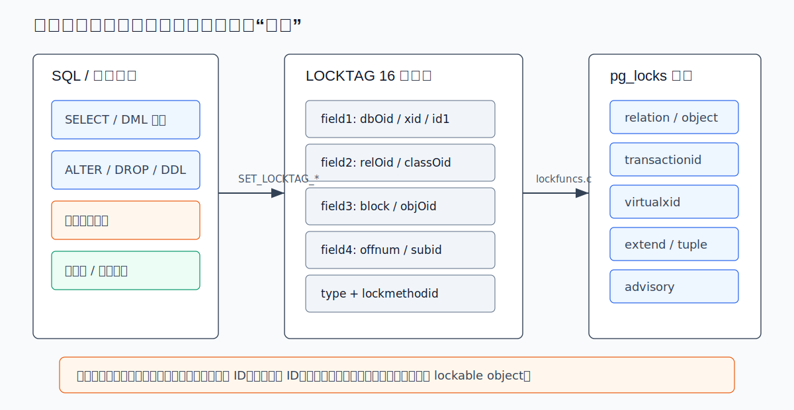
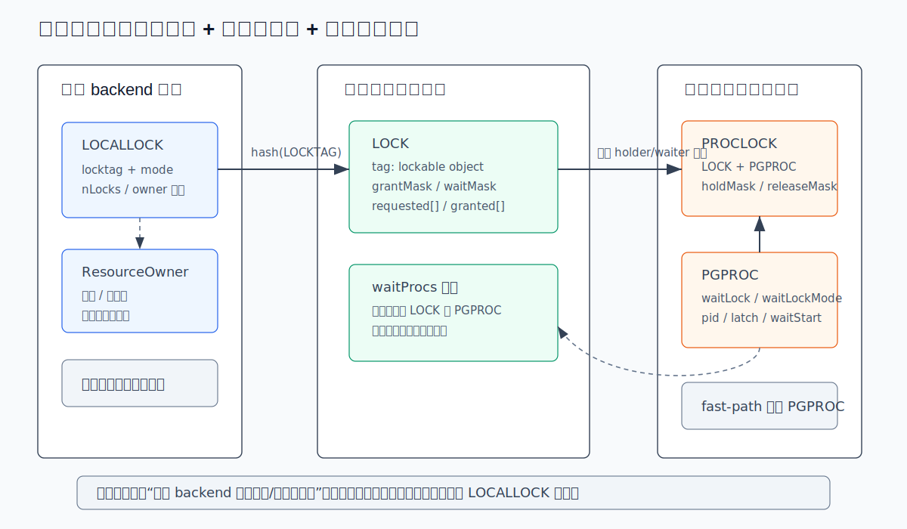
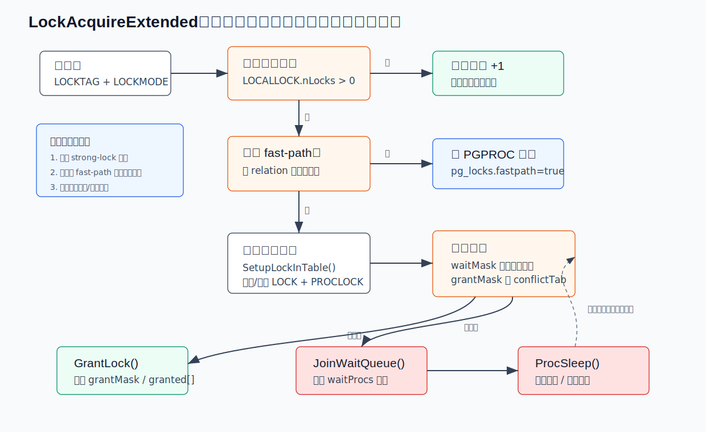
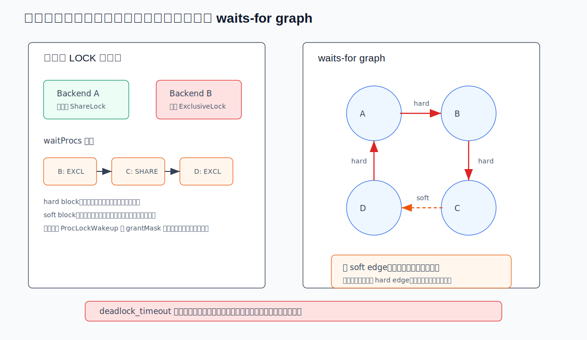
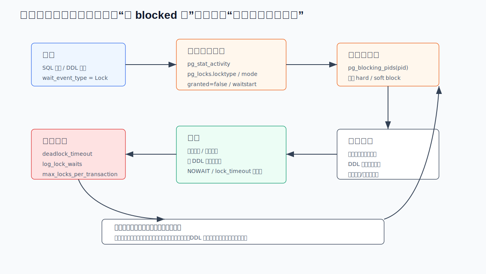

## 数据库筑基课 - 重量锁

### 作者
digoal

### 日期
2026-06-08

### 标签
PostgreSQL , 应用开发者 , 数据库筑基课 , 并发控制 , 锁管理 , 重量锁    

----

## 背景


本文属于“并发控制与锁管理”基础能力。当前项目的 `markdown` 目录未发现明确的“数据库筑基课大纲”文件，因此本文按本地 PostgreSQL 源码、官方文档和项目 codebase 文件展开：解释 PostgreSQL 重量锁到底锁什么、如何判断冲突、为什么会等待、死锁怎么检测、DBA 应该怎样排查。

业务系统里最常见的锁事故不是“数据库突然坏了”，而是几个很普通的动作叠在一起：

- 一个长事务开着不提交，持有表锁或事务 ID 锁。
- 一个 DDL 需要 `AccessExclusiveLock`，被前面的读写事务挡住。
- 新请求又排在 DDL 后面，因为它们与等待中的强锁冲突，结果读写 SQL 也开始堆积。
- 运维只看到 `wait_event_type = 'Lock'`，但不知道锁对象、锁模式、阻塞链和真正根因。

重量锁的价值，是把“多个后端能不能同时操作同一个 SQL 可见对象或内部等待对象”这件事变成统一的、可观测的、可死锁检测的机制。它的代价也很明确：进入共享锁表、维护等待队列、检测死锁都比轻量级互斥原语更重，所以 PostgreSQL 只在需要事务语义、用户可见对象保护、长时间等待或死锁检测时使用它。

## 一、它解决什么问题？

重量锁解决的是跨后端、跨事务的互斥与等待问题。它回答四个问题：

1. 锁谁：表、页、元组、事务 ID、虚拟事务 ID、数据库对象、咨询锁、关系扩展权等。
2. 用什么模式锁：`AccessShareLock`、`RowExclusiveLock`、`AccessExclusiveLock` 等。
3. 是否冲突：请求模式与已授予模式、等待队列中更早的请求是否冲突。
4. 冲突后怎么办：等待、`NOWAIT` 失败、超时取消、死锁检测并中止一个事务。

没有重量锁，`ALTER TABLE` 和 `SELECT`、`DROP TABLE` 和 DML、`CREATE INDEX CONCURRENTLY` 和活跃事务、行更新等待另一个事务结束等场景就缺少统一的协调入口。只靠 MVCC 也不够，因为 MVCC 主要解决“读到哪个版本”，而不是“结构能不能被同时改”“事务结束前别人能不能继续”。

重量锁牺牲的是路径成本。它要访问共享内存锁表，必要时要把进程挂到等待队列，还要支持事务结束自动释放和死锁检测。因此 PostgreSQL 同时保留了 spinlock、LWLock、重量锁、谓词锁等多种机制，不会把所有并发控制都塞进重量锁。

## 二、它是什么？

PostgreSQL 源码里的重量锁通常叫 regular lock、heavyweight lock、lock manager lock，核心实现位于 `src/backend/storage/lmgr/`。本地 `README` 明确区分了四类进程间锁：spinlock、LWLock、regular/heavyweight lock、SIReadLock predicate lock；其中 regular locks 支持多种锁模式、表驱动冲突语义、完整死锁检测和事务结束自动释放。

一个简洁定义：

> 重量锁是 PostgreSQL regular lock manager 对 SQL 可见对象和部分内部等待对象提供的共享内存锁机制。它用 `LOCKTAG` 标识对象，用 `LOCKMODE` 表示模式，用冲突矩阵判断兼容性，用等待队列和死锁检测处理冲突。

它不是“表锁”的同义词。表锁是最常见的重量锁对象之一，但不是全部。`pg_locks.locktype` 可以看到 `relation`、`extend`、`page`、`tuple`、`transactionid`、`virtualxid`、`object`、`advisory` 等类型。行级锁也容易误解：PostgreSQL 官方文档说明，行级锁信息通常存储在磁盘元组中，不直接以普通内存锁行的形式出现在 `pg_locks`；如果进程等待某个行锁，通常会表现为等待当前持有者的 `transactionid`。



图 1 说明：重量锁先把不同对象统一编码成 `LOCKTAG`。关系锁用数据库 OID 和 relation OID；事务等待用 transaction ID 或 virtual transaction ID；对象锁用 class OID、object OID、subid；咨询锁用用户给定 key。这样共享锁表只需要围绕 `LOCKTAG + LOCKMODE` 做冲突判断。

## 三、核心原理

### 3.1 锁模式与冲突矩阵

PostgreSQL 标准重量锁模式定义在 `src/include/storage/lockdefs.h`：

| 锁模式 | 典型来源 | 核心语义 |
|---|---|---|
| `AccessShareLock` | 普通 `SELECT` | 只与 `AccessExclusiveLock` 冲突 |
| `RowShareLock` | `SELECT ... FOR UPDATE/SHARE` | 与 `ExclusiveLock`、`AccessExclusiveLock` 冲突 |
| `RowExclusiveLock` | `INSERT`、`UPDATE`、`DELETE`、`MERGE` | 与 `ShareLock` 及更强写/DDL 类锁冲突 |
| `ShareUpdateExclusiveLock` | `VACUUM`、`ANALYZE`、`CREATE INDEX CONCURRENTLY` | 防并发 schema 变更和部分维护操作 |
| `ShareLock` | 非并发 `CREATE INDEX` | 防并发数据修改 |
| `ShareRowExclusiveLock` | `CREATE TRIGGER`、部分 `ALTER TABLE` | 自冲突，防并发数据修改 |
| `ExclusiveLock` | `REFRESH MATERIALIZED VIEW CONCURRENTLY` | 只允许普通读并发 |
| `AccessExclusiveLock` | `DROP`、`TRUNCATE`、`VACUUM FULL`、许多 DDL | 与所有模式冲突 |

源码里的冲突规则不是 if/else，而是 `lock.c` 中的 `LockConflicts[]` 位图表。`LockMethodData.conflictTab` 说明第 i 种模式与哪些模式冲突；`LockCheckConflicts()` 用 `conflictTab[requested_mode] & lock->grantMask` 快速判断是否存在全局冲突。

这也是为什么“锁强度数字越大就总是更强”只能当粗略理解。源码有些地方用“数值更高”判断 stronger lock，但注释也承认这在语义上并不完美。真正语义以冲突矩阵为准。

### 3.2 三层状态：LOCALLOCK、LOCK、PROCLOCK

重量锁不是只有一张“大表”。它分成本地和共享两层：

- `LOCALLOCK`：每个 backend 私有，记录自己对某个 `LOCKTAG + LOCKMODE` 获取了多少次、属于哪个 `ResourceOwner`。同一事务里重复获取同一锁，通常只增加本地计数，不必反复改共享表。
- `LOCK`：共享内存中“每个可锁对象一条”的状态，包含 `grantMask`、`waitMask`、`requested[]`、`granted[]`、`procLocks`、`waitProcs`。
- `PROCLOCK`：共享内存中“某个 backend 对某个 LOCK 的持有/等待状态”，包含 `holdMask`、`releaseMask`，并同时挂到 LOCK 和 PGPROC 的链表上。



图 2 说明：`LOCK` 负责对象级总体计数和等待队列；`PROCLOCK` 负责每个后端在该对象上的状态；`LOCALLOCK` 负责单后端内部重复获取、事务 owner 和错误清理。这个分层是性能和正确性的折中：共享表只保存跨后端必须共享的信息，本地计数避免无意义的共享内存写入。

### 3.3 获取锁路径

主入口是 `LockAcquire()`，实际工作在 `LockAcquireExtended()`。核心流程可以简化成：

1. 规范检查：确认 lock method 和 lock mode 合法。
2. 找或建 `LOCALLOCK`。
3. 如果当前 backend 已持有同一模式，直接 `GrantLockLocal()` 增加本地计数。
4. 如果符合 fast-path 条件，尝试写入 PGPROC 的 fast-path 槽。
5. 如果不能走 fast-path，进入共享锁表分区，找或建 `LOCK` 和 `PROCLOCK`。
6. 先看等待队列中的 `waitMask`，再看已授予锁的 `grantMask`。
7. 无冲突则 `GrantLock()`；有冲突则 `JoinWaitQueue()`，再 `ProcSleep()`。



图 3 说明：重量锁不是每次都走最重路径。已持有的锁只加本地计数；常见弱 relation 锁可以走 fast-path；只有不适合 fast-path 或可能冲突时才进入主共享锁表。强 relation 锁会先阻止新的 fast-path，并把相关 fast-path 锁迁移进主表，保证冲突判断和死锁检测看到完整状态。

### 3.4 fast-path 为什么存在？

普通 `SELECT`、`INSERT`、`UPDATE`、`DELETE` 都会对涉及的表取弱 relation 锁。高并发系统里，如果每次短 SQL 都抢同一个锁表分区的 LWLock，锁管理本身会成为瓶颈。

PostgreSQL 9.2 起引入 fast-path：每个 backend 可以在自己的 PGPROC 里记录有限数量的弱 relation 锁。根据本地源码 `README`，fast-path 适合默认 lock method、非共享 relation、弱锁模式 `AccessShareLock`、`RowShareLock`、`RowExclusiveLock`，且系统能快速确认不存在可能冲突的强锁。

关键机制是 `FastPathStrongRelationLocks` 计数。强锁请求会增加对应分区的 strong-lock 计数，再扫描各 backend 的 fast-path 槽，把匹配弱锁迁移到主共享锁表。这样平时读写少付成本，强 DDL 来时仍能获得正确冲突判断。

本地源码还显示 `max_locks_per_transaction` 会影响每个 backend fast-path lock groups 的数量；当前本地文档默认值为 128，`postinit.c` 注释说明默认 128 对应 8 个 groups。旧版本经验里常见默认值 64，不能直接套到当前源码。

### 3.5 等待队列与唤醒

当请求与已授予锁或队列中更早的冲突请求不兼容时，backend 会进入 `LOCK.waitProcs`。这里有两个细节：

- 进程不一定永远插到队尾。如果当前进程已经持有某些锁，而队列中前面的等待者请求会被它挡住，`JoinWaitQueue()` 可以把它插到第一个相关等待者之前，甚至发现可以立即授予。
- 释放锁时，`ProcLockWakeup()` 扫描等待队列。一个等待者能被唤醒，需要它不与已授予锁冲突，也不与队列中前面尚不能唤醒的等待者冲突。

这解释了很多生产现象：你看到一个普通 `SELECT` 被挡住，并不一定是它直接与当前持锁者冲突，也可能是它排在一个等待 `AccessExclusiveLock` 的 DDL 后面，被等待队列顺序“软阻塞”了。

### 3.6 死锁检测

PostgreSQL 对重量锁采用乐观等待：如果拿不到锁，先睡眠；等 `deadlock_timeout` 到了还没拿到，才运行相对昂贵的死锁检测。官方配置文档也说明，死锁检测不在每次等待时运行，因为生产中死锁通常不是常态。

死锁检测的核心在 `deadlock.c` 和 `src/backend/storage/lmgr/README`：

- 把等待关系看成 waits-for graph。
- 如果 A 等 B，图里有 A -> B 的边。
- 已持有冲突锁形成 hard edge。
- 队列前方等待者因为顺序挡住后方等待者形成 soft edge。
- 如果从当前等待进程出发能回到自己，就存在涉及自己的死锁。
- 如果死锁只涉及 soft edge，系统会尝试通过等待队列重排解除。
- 如果无法重排或全是硬死锁，则报告死锁并中止一个事务。



图 4 说明：重量锁死锁不只是“两个事务互相持有对方要的锁”。等待队列顺序也会产生 soft block。PostgreSQL 的死锁检测会尝试通过重排队列避免不必要的事务中止；只有没有可行重排时，才把它当硬死锁处理。

## 四、横向对比

| 维度 | 重量锁 regular/heavyweight lock | LWLock | Spinlock | 谓词锁 SIReadLock | 行级锁 |
|---|---|---|---|---|---|
| 主要目标 | 保护 SQL 可见对象和部分内部等待对象 | 保护共享内存数据结构 | 极短临界区互斥 | Serializable 隔离级别下记录读写依赖 | 防并发修改同一行 |
| 等待时间 | 可较长 | 应较短 | 极短，忙等 | 通常不阻塞普通操作 | 可等待事务结束 |
| 死锁检测 | 支持完整死锁检测 | 不提供常规死锁检测 | 不提供 | 不按普通阻塞锁处理 | 行等待可通过事务 ID 等重量锁参与死锁检测 |
| 自动释放 | 事务/会话语义，事务结束释放普通锁 | error cleanup 释放 | 无这类事务语义 | 由 SSI 机制管理 | 事务结束释放 |
| 可观测性 | `pg_locks`、`pg_stat_activity`、`pg_blocking_pids()` | 等待事件可见，但不是 `pg_locks` 主体 | 基本不可作为用户级对象观察 | `pg_locks` 可显示 predicate lock 视图数据 | 元组锁本体通常不直接出现在 `pg_locks` |
| 典型对象 | relation、transactionid、object、advisory | buffer、锁表分区、共享结构 | 原子状态字段 | relation/page/tuple 谓词目标 | heap tuple |
| 适合场景 | DDL/DML 协调、事务等待、咨询锁 | 内核共享状态快速互斥 | 几十条指令内的状态保护 | Serializable 冲突检测 | 并发更新同一行 |
| 不适合场景 | 保护每次短内核状态访问 | 用户 SQL 级长等待 | 任何可能长等待的逻辑 | 替代表锁/行锁 | 保护表结构变更 |

表中的重点是：重量锁的“重”不是坏，而是它承担了事务语义、等待队列、死锁检测和观测能力。用 LWLock 或 spinlock 做用户级长等待是危险的；用重量锁保护每个极短内核临界区又太贵。

## 五、效果如何？

重量锁带来的收益：

- 正确性：DDL、DML、事务等待、咨询锁有统一冲突规则。
- 可恢复性：普通事务锁可在事务结束、错误回滚、子事务 abort 时释放。
- 可诊断性：`pg_locks`、`pg_stat_activity`、`pg_blocking_pids()` 能定位锁对象和阻塞链。
- 死锁处理：等待超过 `deadlock_timeout` 后可以检测并打破死锁。
- 性能优化空间：弱 relation 锁通过 fast-path 避免高频访问主锁表。

对应代价：

- 主锁表需要共享内存。当前本地文档说明 `max_locks_per_transaction` 默认 128，并按每个 server process 或 prepared transaction 估算共享锁表容量。它限制的是平均“对象锁”数量，不是行锁数量。
- 等待队列会制造级联阻塞。一个等待 `AccessExclusiveLock` 的 DDL，可能让后来普通读请求排队。
- 死锁检测不是即时的。它受 `deadlock_timeout` 控制，默认 1 秒；调低有助于排查，但会增加无谓检测成本。
- `pg_locks` 是观测视图，不是完全冻结的全局真相。官方文档说明 fast-path 锁逐 backend 收集，期间锁状态可能变化。

## 六、实操 DEMO

以下 SQL 是最小可验证实验，用于在 PostgreSQL 环境里复现阻塞、观察 `pg_locks` 和制造死锁。本次未连接 PostgreSQL 实例执行示例，不包含伪造输出。

### 6.1 准备表

```sql
DROP TABLE IF EXISTS lock_demo;

CREATE TABLE lock_demo (
  id integer PRIMARY KEY,
  payload text NOT NULL
);

INSERT INTO lock_demo
SELECT g, 'payload-' || g
FROM generate_series(1, 10) AS g;
```

### 6.2 观察 DDL 阻塞读写

会话 A：

```sql
BEGIN;
SELECT * FROM lock_demo WHERE id = 1;
-- 保持事务不提交，使 AccessShareLock 继续持有。
```

会话 B：

```sql
BEGIN;
ALTER TABLE lock_demo ADD COLUMN note text;
-- 需要 AccessExclusiveLock，会被会话 A 的 AccessShareLock 阻塞。
```

会话 C：

```sql
SELECT pid,
       wait_event_type,
       wait_event,
       state,
       query
FROM pg_stat_activity
WHERE datname = current_database()
ORDER BY pid;
```

会话 C 继续看锁对象和阻塞者：

```sql
SELECT a.pid,
       a.wait_event_type,
       a.wait_event,
       l.locktype,
       l.relation::regclass AS relation_name,
       l.mode,
       l.granted,
       l.fastpath,
       l.waitstart,
       pg_blocking_pids(a.pid) AS blocking_pids,
       a.query
FROM pg_stat_activity AS a
LEFT JOIN pg_locks AS l
  ON l.pid = a.pid
WHERE a.datname = current_database()
  AND (a.wait_event_type = 'Lock' OR l.relation = 'lock_demo'::regclass)
ORDER BY a.pid, l.granted, l.mode;
```

验证重点不是背输出，而是看三件事：

- 会话 A 对 `lock_demo` 持有 `AccessShareLock`，`granted = true`。
- 会话 B 等待 `AccessExclusiveLock`，`granted = false`。
- 如果有后续普通 SQL 被排到 B 后面，`pg_blocking_pids()` 比手写 `pg_locks` 自连接更可靠，因为它知道 hard block 和 wait queue soft block。

### 6.3 复现死锁

会话 A：

```sql
BEGIN;
UPDATE lock_demo SET payload = payload || '-a' WHERE id = 1;
```

会话 B：

```sql
BEGIN;
UPDATE lock_demo SET payload = payload || '-b' WHERE id = 2;
```

会话 A：

```sql
UPDATE lock_demo SET payload = payload || '-a2' WHERE id = 2;
```

会话 B：

```sql
UPDATE lock_demo SET payload = payload || '-b2' WHERE id = 1;
```

这时两个事务各自持有一行，又等待对方事务结束。官方文档也用类似转账例子解释：即使没有显式 `LOCK TABLE`，行级锁也可能导致死锁。PostgreSQL 会自动检测死锁并中止其中一个事务。中止哪一个事务不应被业务逻辑依赖。

### 6.4 建议的排查 SQL

生产环境里，可以先用轻量查询看当前锁等待：

```sql
SELECT now() AS sample_time,
       a.pid,
       a.usename,
       a.application_name,
       a.client_addr,
       a.state,
       a.xact_start,
       a.query_start,
       a.wait_event_type,
       a.wait_event,
       pg_blocking_pids(a.pid) AS blocking_pids,
       a.query
FROM pg_stat_activity AS a
WHERE a.wait_event_type = 'Lock'
ORDER BY a.query_start;
```

再展开阻塞者：

```sql
WITH waiting AS (
  SELECT pid, unnest(pg_blocking_pids(pid)) AS blocker_pid
  FROM pg_stat_activity
  WHERE wait_event_type = 'Lock'
)
SELECT w.pid AS waiting_pid,
       wa.query AS waiting_query,
       w.blocker_pid,
       ba.state AS blocker_state,
       ba.xact_start AS blocker_xact_start,
       ba.query AS blocker_query
FROM waiting AS w
JOIN pg_stat_activity AS wa ON wa.pid = w.pid
JOIN pg_stat_activity AS ba ON ba.pid = w.blocker_pid
ORDER BY wa.query_start;
```

这两段 SQL 的目标是先判断：阻塞者是不是长事务、`idle in transaction`、批量作业、DDL、autovacuum、prepared transaction，还是应用层连接池泄漏。

## 七、最佳实践

### 架构师

- 把“事务边界”当架构设计的一部分。不要让业务事务跨用户交互、网络调用、长时间计算。
- 对高频 DDL、在线迁移、分区维护建立窗口和灰度策略。需要 `AccessExclusiveLock` 的操作要提前评估阻塞半径。
- 避免单事务触碰海量分区或对象。当前本地文档说明 `max_locks_per_transaction` 是按每进程/每 prepared transaction 的对象锁容量估算，单个事务可以超过平均值，但总量必须装进共享锁表。
- 对高并发 OLTP，把“先锁大对象再处理小对象”的流程改成“先定位小对象、短事务完成、必要时重试”。

### DBA

- 打开或按需调试 `log_lock_waits`。本地文档显示它在等待超过 `deadlock_timeout` 后记录锁等待日志，适合定位锁等待是否拖慢系统。
- 排查时优先使用 `pg_blocking_pids()`，不要轻易手写 `pg_locks` 自连接。官方文档也说明手写阻塞关系很难正确处理冲突矩阵和等待队列顺序。
- `lock_timeout` 适合放在会话、角色、作业级别，不建议全局粗暴设置。官方文档也提醒在 `postgresql.conf` 全局设置会影响所有会话。
- 对 DDL 作业使用 `LOCK ... NOWAIT` 或较短 `lock_timeout` 做预检，失败就退出或重排窗口，而不是让 `AccessExclusiveLock` 排进队列制造级联阻塞。
- 遇到 `out of shared memory` 且 hint 指向 `max_locks_per_transaction`，先确认是否单事务访问了过多表、分区、索引或 prepared transaction，而不是盲目只加参数。

### 业务开发者

- 事务内按固定顺序访问多行、多表、多账户。官方文档给出的死锁防御原则也是让应用以一致顺序获取多个对象的锁。
- 批处理要分批提交。长事务既会持锁，也会影响 VACUUM、复制延迟和故障恢复窗口。
- 明确区分 `statement_timeout` 和 `lock_timeout`：前者限制整个语句，后者只限制等待锁的时间。
- 对可重试业务，把 `deadlock_detected`、`lock_not_available`、`lock_timeout` 归入重试策略，但重试必须有幂等或去重设计。
- 不要把 `SELECT ... FOR UPDATE` 当普通查询。它会获取行锁并持有到事务结束，可能让后续事务等待。



图 5 说明：线上锁等待要先定位等待对象和阻塞链，再处理根因。`pg_terminate_backend()` 只能作为止血工具，不能替代事务边界、DDL 窗口、批量作业和超时策略治理。

## 八、适合与不适合场景

适合重量锁的场景：

- 表结构、索引、约束、触发器等 SQL 可见对象需要互斥保护。
- 一个事务需要等待另一个事务结束，例如行更新冲突、`CREATE INDEX CONCURRENTLY` 等。
- 用户希望通过 advisory lock 实现跨会话业务互斥。
- 锁等待可能较长，需要可取消、可超时、可死锁检测、可观测。
- 需要事务结束自动释放锁。

不适合重量锁的场景：

- 保护共享内存里几十条指令的状态修改，应使用 spinlock 或 LWLock 等内部机制。
- 高频、极短、不会被用户观察到的内部临界区。
- 希望替代 MVCC 做读写版本控制。普通读写并发主要靠 MVCC；重量锁只保护对象级兼容性和必要等待。
- 希望用表级强锁解决应用并发设计问题。强锁能止血，但会降低并发并扩大故障半径。

## 九、常见坑

1. 把 `ROW EXCLUSIVE` 误解成行锁  
   官方文档明确说这些表级锁模式即使名字里有 row，也是 table-level lock。`RowExclusiveLock` 是 DML 对目标表取的表级锁，不是某一行的锁。

2. 忽略等待中的强锁会挡住后续请求  
   一个 DDL 等待 `AccessExclusiveLock` 时，后来普通读请求可能因为等待队列顺序被挡住。看到 `SELECT` 卡住，不代表它直接和最早持锁者冲突。

3. 长事务空闲  
   `idle in transaction` 仍可能持有锁。应用觉得“没在跑 SQL”，数据库看到的是“事务还没结束”。

4. 只查 `pg_locks` 不查 SQL 和事务开始时间  
   锁对象只能说明等待在哪里，`pg_stat_activity.xact_start`、`query_start`、`state`、`query` 才能说明为什么持有这么久。

5. 死锁后只重试，不修顺序  
   重试能恢复单次请求，但如果访问顺序不一致，死锁会周期性出现。

6. 全局设置过短 `lock_timeout`  
   这会让正常维护、偶发等待、系统作业都失败。更稳妥的做法是对具体 DDL/批处理/在线迁移会话设置。

7. 以为 `max_locks_per_transaction` 限制行锁数量  
   官方文档明确说它不是可锁行数限制。它影响共享对象锁表容量，例如表、分区、索引等对象锁。

8. 忽略 prepared transaction  
   两阶段提交的 prepared transaction 可以继续持锁，而且 `pg_locks.pid` 可能为空，需要关联 `pg_prepared_xacts`。

## 十、扩展问题

1. 为什么普通 `SELECT` 需要 `AccessShareLock`，明明 MVCC 已经允许读写并发？
2. 为什么只有 `AccessExclusiveLock` 会阻塞普通 `SELECT`，但普通 `SELECT` 又可能排在等待中的 DDL 后面？
3. fast-path 锁为什么需要强锁计数，而不是直接让所有弱锁永远留在 backend 本地？
4. `pg_blocking_pids()` 为什么比 `pg_locks` 自连接更适合生产排查？
5. 如果一个系统经常出现 `idle in transaction` 持锁，问题更可能在数据库参数、SQL 写法，还是应用事务模型？

## 十一、扩展阅读

- PostgreSQL 源码：[`src/backend/storage/lmgr/README`](../postgres/src/backend/storage/lmgr/README)，重量锁、fast-path、等待队列和死锁检测说明。
- PostgreSQL 源码：[`src/backend/storage/lmgr/lock.c`](../postgres/src/backend/storage/lmgr/lock.c)，`LockConflicts[]`、`LockAcquireExtended()`、`LockCheckConflicts()`、`GrantLock()`、fast-path 迁移逻辑。
- PostgreSQL 源码：[`src/backend/storage/lmgr/proc.c`](../postgres/src/backend/storage/lmgr/proc.c)，`JoinWaitQueue()`、`ProcSleep()`、等待、日志和超时处理。
- PostgreSQL 源码：[`src/backend/storage/lmgr/deadlock.c`](../postgres/src/backend/storage/lmgr/deadlock.c)，waits-for graph、soft edge、hard deadlock、队列重排。
- PostgreSQL 源码：[`src/include/storage/lockdefs.h`](../postgres/src/include/storage/lockdefs.h)、[`src/include/storage/lock.h`](../postgres/src/include/storage/lock.h)、[`src/include/storage/locktag.h`](../postgres/src/include/storage/locktag.h)，锁模式、共享结构和 LOCKTAG 定义。
- PostgreSQL 源码：[`src/backend/utils/adt/lockfuncs.c`](../postgres/src/backend/utils/adt/lockfuncs.c)，`pg_locks` 输出、`pg_blocking_pids()` 对 hard/soft block 的处理。
- PostgreSQL 官方文档源码：[`doc/src/sgml/mvcc.sgml`](../postgres/doc/src/sgml/mvcc.sgml)，表级锁模式、冲突矩阵、死锁说明。
- PostgreSQL 官方文档源码：[`doc/src/sgml/system-views.sgml`](../postgres/doc/src/sgml/system-views.sgml)，`pg_locks` 字段、fast-path 观测一致性、`pg_blocking_pids()` 建议。
- PostgreSQL 官方文档源码：[`doc/src/sgml/config.sgml`](../postgres/doc/src/sgml/config.sgml)，`log_lock_waits`、`lock_timeout`、`deadlock_timeout`、`max_locks_per_transaction`。
- PostgreSQL 官方文档源码：[`doc/src/sgml/monitoring.sgml`](../postgres/doc/src/sgml/monitoring.sgml)，`wait_event_type = Lock` 的含义。
- DeepWiki：`postgres/postgres`，本次可获取目录总览，用于确认项目架构入口；未作为重量锁细节依据。

补充说明：更正后的 DeepWiki repoName 为 `postgres/postgres`。本次 `toc` 可以返回目录，但 `ask/wiki` 在当前工具/代理环境下未能稳定返回重量锁正文内容；因此本文没有把 DeepWiki 作为细节依据，核心结论均回到本地源码和 PostgreSQL 官方文档源码。
  
## 附录 
1、克隆代码  
```  
git clone --depth 1 https://github.com/postgres/postgres
```  
  
2、启用 codex, 使用 [数据库筑基课 skill](../skills/README.md).  
```
文章标题: 
  数据库筑基课 - 重量锁
项目源码(本地目录): 
  postgres
项目 codebase 文件名: 
  postgres/CLAUDE.md 
开源项目相关的 deepwiki repoName: 
  postgres/postgres
```
    
#### [PostgreSQL 解决方案集合](../201706/20170601_02.md "40cff096e9ed7122c512b35d8561d9c8")
  
  
#### [德哥 / digoal's Github - 公益是一辈子的事.](https://github.com/digoal/blog/blob/master/README.md "22709685feb7cab07d30f30387f0a9ae")
  
  
#### [About 德哥](https://github.com/digoal/blog/blob/master/me/readme.md "a37735981e7704886ffd590565582dd0")
  
  

  
