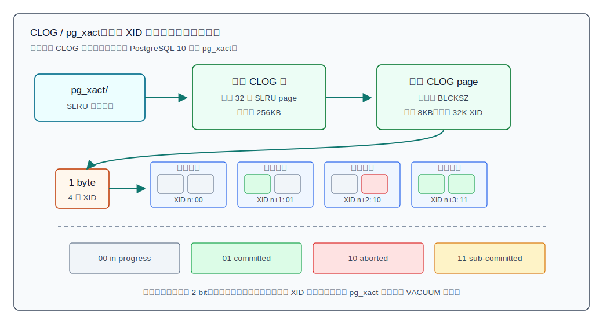
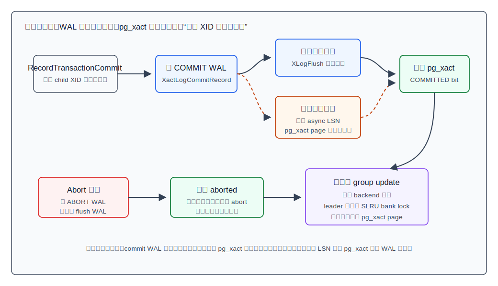
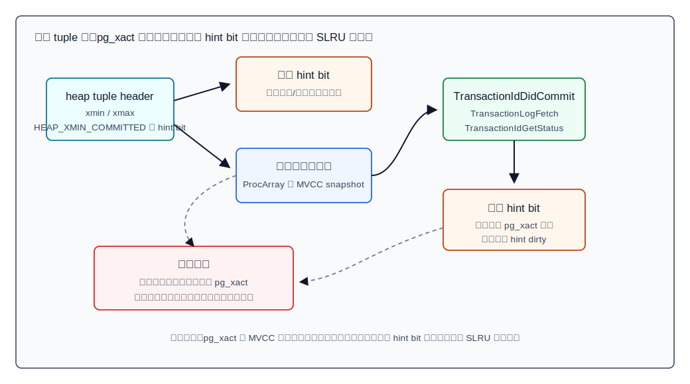
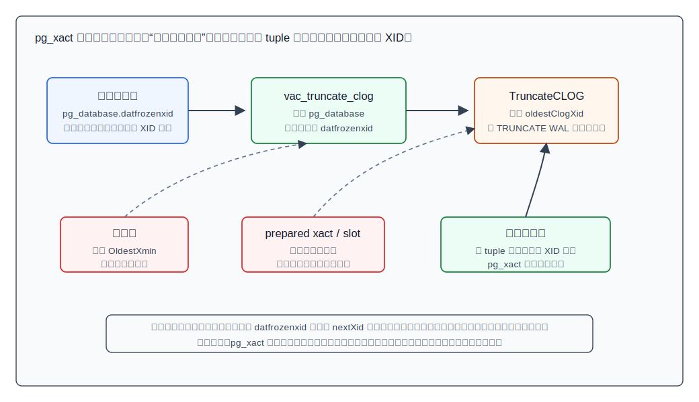

## 数据库筑基课 - clog

### 作者
digoal

### 日期
2026-06-08

### 标签
PostgreSQL , 应用开发者 , 数据库筑基课 , 事务 , MVCC , CLOG , pg_xact , SLRU , VACUUM    

----

## 背景
  


本文属于数据库筑基课里的“维护机制 + 表存储可见性”主题。`clog` 是 PostgreSQL 里非常小但非常关键的一块：它不存业务数据，却决定了一个行版本里的 `xmin`、`xmax` 对应事务到底是提交、回滚、仍在进行，还是一个尚未随父事务最终落定的子事务。

本地 `markdown/` 目录中没有发现独立的“数据库筑基课大纲”文件；已有同系列文章使用“未发现大纲文件则说明”的写法，因此本文沿用这个约定。后续如果项目补充课程目录，可以在这里加上大纲链接。

先从一个 DBA 现场问题切入：

- 表并不大，但 `SELECT`、`VACUUM` 或逻辑复制突然出现大量 SLRU 读写。
- `pg_xact` 目录持续变大，用户担心能不能手工删除旧文件。
- 应用在 `COMMIT` 断线后想确认事务是否真的提交。
- 读 tuple 时 PostgreSQL 明明已经有 WAL，为什么还要查 `pg_xact`？
- 高并发提交时，为什么会出现 `XactSLRU`、`XactBuffer` 或 `XactGroupUpdate` 等等待？

这些问题背后都是同一个机制：PostgreSQL 把每个普通事务 XID 的最终状态压缩成 2 bit，放在一个基于 SLRU 的磁盘目录里。源码模块仍叫 `clog.c`，数据目录现在叫 `pg_xact`。老版本目录名 `pg_clog` 在 PostgreSQL 10 起改名为 `pg_xact`，`pg_upgrade` 源码里仍保留了兼容逻辑。

本文以本地 PostgreSQL 源码 `postgres` 为主，重要结论来自以下主线：

- 官方文档：`doc/src/sgml/storage.sgml`、`xact.sgml`、`maintenance.sgml`、`config.sgml`、`monitoring.sgml`、`wal.sgml`、`func/func-info.sgml`。
- 源码：`src/backend/access/transam/clog.c`、`transam.c`、`xact.c`、`varsup.c`、`src/backend/access/heap/heapam_visibility.c`、`src/backend/commands/vacuum.c`、`src/include/access/clog.h`、`src/include/access/slru.h`。
- 用户更正后的 DeepWiki repoName 是 `postgres/postgres`。本次使用 `npx --yes @seflless/deepwiki toc postgres/postgres --json --quiet` 和 `ask` 查询到相关页面为 `2.1 Process and Transaction Management`、`2.3.4 VACUUM and Database Maintenance`；DeepWiki 对 `pg_xact`、CLOG、SLRU、提交路径、可见性查询和 VACUUM 截断的摘要与本地源码链路一致。本文仍以本地源码和官方文档作为事实依据，DeepWiki 作为架构索引。

## 一、它解决什么问题？

MVCC 的核心动作是：表里的每个行版本记录创建它的事务 `xmin`，以及删除或更新它的事务 `xmax`。读取时，数据库必须回答：

1. `xmin` 对应的事务提交了吗？如果没提交，这个行版本不能对别人可见。
2. `xmax` 对应的事务提交了吗？如果提交了，这个行版本可能已经被删除或更新。
3. 如果事务还在运行中，当前快照是否应该把它视作不可见？
4. 如果事务很老，状态文件是否还存在？如果不存在，为什么仍然可以正确判断？

如果每个 tuple 都完整记录事务最终状态，行头会膨胀，更新状态还要反复改数据页。如果只依赖 WAL，普通可见性判断又会变成高成本的日志搜索。因此 PostgreSQL 把“行版本引用 XID”和“XID 最终状态”拆开：

- heap tuple 只记录 `xmin/xmax` 和少量 hint bit。
- `pg_xact` 统一记录 XID 的最终状态。
- 读取路径先用 hint bit、快照和 ProcArray 快速判断，必要时才查 `pg_xact`。
- VACUUM 冻结旧 tuple 后，旧 XID 状态不再需要，`pg_xact` 可以按段截断。

这个设计牺牲的是：事务状态变成另一个必须维护、刷盘、截断和监控的内部结构。收益是：每个事务只需要 2 bit 状态空间，读写路径可以把常见情况做得非常轻。

## 二、它是什么？

`clog` 是 PostgreSQL transaction commit log 的源码级名称；它的职责是保存事务提交状态。当前数据目录中的名字是 `pg_xact`，官方 `storage.sgml` 把它描述为保存 transaction commit status data 的子目录。

`src/include/access/clog.h` 定义了 4 种状态：

| 状态值 | 宏名 | 含义 |
|---|---|---|
| `0x00` | `TRANSACTION_STATUS_IN_PROGRESS` | 初始状态，也表示还没看到明确提交/中止 |
| `0x01` | `TRANSACTION_STATUS_COMMITTED` | 事务已提交 |
| `0x02` | `TRANSACTION_STATUS_ABORTED` | 事务已中止 |
| `0x03` | `TRANSACTION_STATUS_SUB_COMMITTED` | 子事务已提交，但父事务尚未最终提交或回滚 |

`clog.c` 的文件头把物理表示说得很直接：每个事务 2 bit，一个 byte 容纳 4 个事务状态。源码中：

- `CLOG_BITS_PER_XACT = 2`
- `CLOG_XACTS_PER_BYTE = 4`
- `CLOG_XACTS_PER_PAGE = BLCKSZ * CLOG_XACTS_PER_BYTE`

典型 `BLCKSZ` 是 8KB，所以一个 CLOG page 覆盖 8KB * 4 = 32768 个事务。`pg_config_manual.h` 说明 SLRU 默认每段 32 page，也就是典型 256KB；对 CLOG 来说，一个段覆盖约 100 万个事务。



图 1 说明：`pg_xact` 不是一张表，而是一个按 XID 位置寻址的紧凑状态数组。XID 先映射到 page，再映射到 byte，再映射到 byte 内的两位。这个结构解释了两个现象：一是 `pg_xact` 空间增长很慢，二是当旧段被截断后，再查询过老 XID 的状态就不应该访问文件，而应返回“状态已经不保留”。

`pg_xact` 底层使用 SLRU。`src/include/access/slru.h` 说明 SLRU 是 simple least-recently-used cache，管理若干 page slot、dirty 标记、LRU 计数、bank lock、buffer lock，以及可选的 `group_lsn`。`clog.c` 在 `CLOGShmemRequest()` 里以名字 `transaction` 注册 SLRU，目录为 `pg_xact`，并把 `transaction_buffers` 作为缓存大小来源。

这意味着：DBA 在 `pg_stat_slru` 里看到的 `name='transaction'`，对应的就是 `pg_xact` 这套事务状态缓存。

## 三、核心原理

### 1. XID 分配前先确保 pg_xact 有空间

事务不是一开始就拿非虚拟 XID。文档 `xact.sgml` 说明，XID 通常在事务首次写数据库时分配。源码 `varsup.c` 中 `GetNewTransactionId()` 在分配 XID 时会先调用：

```c
ExtendCLOG(xid);
ExtendCommitTs(xid);
ExtendSUBTRANS(xid);
```

`ExtendCLOG()` 只在新 XID 落到一个 CLOG page 的第一个位置时做事：加 SLRU bank lock、zero 新 page，并写一条 `CLOG_ZEROPAGE` WAL 记录。源码注释强调这必须在 `XidGenLock` 下完成，否则后续事务可能先拿到并提交更大的 XID，结果对应 page 还没有初始化。

这里的工程边界很重要：`pg_xact` page 初始化有 WAL 记录；事务 commit/abort 的状态更新则由 `xact.c` 的事务 WAL 记录负责在 redo 时重放，不需要 `clog.c` 为每个状态 bit 再写一条 WAL。

### 2. 提交路径：先让 WAL 成为可恢复事实，再标记 pg_xact

`xact.c` 的 `RecordTransactionCommit()` 是普通提交主路径。它先写 `XactLogCommitRecord()`，然后根据同步提交策略分两条路：

- 同步提交路径：`XLogFlush(XactLastRecEnd)` 后调用 `TransactionIdCommitTree()`。
- 异步提交路径：`XLogSetAsyncXactLSN(XactLastRecEnd)` 后调用 `TransactionIdAsyncCommitTree()`，并把 commit record LSN 传给 `clog.c`。

`clog.c` 文件头解释了 WAL 规则：同步提交下，commit WAL 已经在更新 CLOG 前刷到磁盘；异步提交下，需要在 CLOG page 的 `group_lsn` 中记录相关 LSN，防止 CLOG page 被写回磁盘时早于对应 WAL 刷盘。

换句话说，`pg_xact` 是提交状态的快速索引，但 WAL 才是崩溃恢复的事实来源。让 `pg_xact` 先于 commit WAL 持久化，会制造“状态显示提交，但恢复时找不到提交记录”的风险。



图 2 说明：同步提交和异步提交都要更新 `pg_xact`，区别在于 WAL 是否已经立即刷盘。异步提交不是不写 WAL，而是允许“返回成功后 WAL 还没持久化”的窗口，因此 `clog.c` 必须记住 page 上状态对应的最大 LSN，避免 CLOG 脏页过早落盘。

### 3. 子事务：用 sub-committed 保持顶层提交原子性

子事务让状态变复杂。文档 `xact.sgml` 说明，`pg_subtrans` 记录 subxid 到父 xid 的映射；当顶层事务提交时，所有已 subcommitted 的子事务也会在 `pg_xact` 里持久记录为 committed。

`TransactionIdSetTreeStatus()` 的注释解释了跨 page 子事务提交的三阶段过程：

1. 对不在顶层 XID 所在 CLOG page 的 subxid，先标记 `SUB_COMMITTED`。
2. 对顶层 XID 及同 page 的 subxid，原子标记为 `COMMITTED`。
3. 回头把前面那些跨 page subxid 标记为 `COMMITTED`。

这样做的目标是：并发检查者不能在顶层事务还没最终提交时，把跨 page 子事务误判成独立提交。`TransactionIdDidCommit()` 如果看到 `SUB_COMMITTED`，会递归查 `pg_subtrans` 找父事务状态；如果太老，无法可靠查父事务，则按父事务崩溃未清理处理。

### 4. 高并发提交：group update 减少 SLRU bank lock 争用

`clog.c` 文件头提到一个性能优化：多个并发提交事务可以排队，由一个进程在一次锁获取中更新多个事务状态。具体在 `TransactionIdSetPageStatus()` 中，满足以下条件时才尝试 group update：

- 所有要更新的 XID 都在同一个 CLOG page。
- 当前事务的 `xid/subxids` 与 `MyProc` 中缓存一致。
- 子事务数量不超过 `THRESHOLD_SUBTRANS_CLOG_OPT`，源码中这个阈值是 5。
- 没能立即拿到对应 SLRU bank lock。

如果当前进程成为 leader，会拿 bank lock，取出等待队列中的成员，批量调用 `TransactionIdSetPageStatusInternal()` 更新它们的 bit，然后释放锁并唤醒等待者。这个优化不改变事务语义，只减少高并发提交时锁来回交接的次数。

运维上，如果大量短事务同时提交，`pg_stat_activity`、等待事件或性能剖析中看到事务 SLRU 相关等待，不一定说明磁盘慢，也可能是同一批事务正在争用 `pg_xact` page 或 SLRU bank lock。

### 5. 读取路径：pg_xact 是兜底，不是每行必查

`heapam_visibility.c` 文件头给了可见性判断的关键顺序：

- 使用非 MVCC snapshot 时，必须先查 `TransactionIdIsInProgress()`，也就是 ProcArray，再查 `TransactionIdDidCommit()`，也就是 `pg_xact`。
- 否则可能遇到一个正在提交的事务：它已经在 `pg_xact` 标记 committed，但还没从 ProcArray 中清掉自己的 XID。
- 如果只查 `pg_xact`，会把 tuple 提前看成已提交，导致和后续快照观察不一致。
- 使用 MVCC snapshot 时，先用 `XidInMVCCSnapshot()` 判断是否在快照运行集合中，逻辑本质一样：不要在确认“不在运行中”前查 `pg_xact`。

典型路径是：

1. 看 tuple header 的 hint bit，例如 `HEAP_XMIN_COMMITTED`、`HEAP_XMIN_INVALID`。
2. 如果 hint bit 足够，直接判断。
3. 如果不够，判断 XID 是否属于当前事务、是否仍在运行中、是否在当前 snapshot 的运行集合中。
4. 仍不能确定时，调用 `TransactionIdDidCommit()`，它经 `TransactionLogFetch()` 查 `TransactionIdGetStatus()`。
5. 如果确认提交或中止，并且安全，则回写 hint bit，降低后续反复查 `pg_xact` 的成本。



图 3 说明：`pg_xact` 是可见性的真相来源之一，但不是每次扫描 tuple 都查。hint bit 是减少 SLRU 访问的关键缓存；ProcArray 或 snapshot 是避免“正在提交事务被提前看成提交”的关键顺序约束。

### 6. 截断路径：VACUUM 冻结后才能删除旧状态

`pg_xact` 不会无限增长。它能被截断，前提是系统确认老 XID 不再被任何未冻结 tuple 引用。

`vacuum.c` 的 `vac_truncate_clog()` 会扫描 `pg_database`，计算集群范围最老的 `datfrozenxid`，然后调用：

```c
TruncateCLOG(frozenXID, oldestxid_datoid);
TruncateCommitTs(frozenXID);
TruncateMultiXact(minMulti, minmulti_datoid);
SetTransactionIdLimit(frozenXID, oldestxid_datoid);
```

`clog.c` 的 `TruncateCLOG()` 在删除旧段前会先：

- 计算 cutoff page。
- 确认目录中确实有可删除文件。
- 推进 `oldestClogXid`，让并发任意 XID 状态查询知道不能访问已截断范围。
- 写并 flush `CLOG_TRUNCATE` WAL 记录。
- 调用 `SimpleLruTruncate()` 删除旧段。

`maintenance.sgml` 明确指出，提高 `autovacuum_freeze_max_age` 的代价之一是 `pg_xact` 和 `pg_commit_ts` 会占用更多空间。默认 2 亿事务大约对应 50MB `pg_xact`；最大 20 亿事务大约对应半 GB `pg_xact`。这些数字和“每事务 2 bit”的源码设计相互吻合。



图 4 说明：`pg_xact` 截断不是清理临时文件，而是由冻结边界保护的事务状态生命周期。长事务、prepared transaction、复制槽、停滞的数据库级冻结进度，都可能让 `datfrozenxid` 落后，从而让 `pg_xact` 无法积极收缩。

## 四、横向对比

| 维度 | `pg_xact` / CLOG | WAL commit record | heap tuple hint bit | `pg_subtrans` | commit timestamp |
|---|---|---|---|---|---|
| 主要目标 | 快速回答 XID 是否提交/中止 | 崩溃恢复和复制的事实日志 | 缓存 tuple 相关事务结论 | 子事务到父事务映射 | 查询事务提交时间 |
| 数据粒度 | 每个普通 XID 2 bit | 每个事务结束记录 | 每个 tuple header 的若干 bit | 每个 subxid 的 parent xid | 每个事务时间戳和 origin |
| 持久位置 | `PGDATA/pg_xact` | `PGDATA/pg_wal` | heap 数据页 | `PGDATA/pg_subtrans` | `PGDATA/pg_commit_ts` |
| 读取频率 | 可见性兜底查询，高频但可被 hint bit 减少 | 正常查询不搜索 WAL | heap 扫描中高频读取 | 子事务状态递归时使用 | 用户函数或复制相关场景 |
| 空间成本 | 极低，2 bit/XID | 高于状态表，但必须存在 | 分散在数据页中 | 子事务越多越明显 | 开启后空间明显增加 |
| 崩溃恢复角色 | 由 WAL 重建近期变化 | 主要事实来源 | 可丢失或重设 | WAL/启动过程配合恢复 | 由 commit record 数据恢复 |
| 运维关注 | SLRU 命中率、截断、事务年龄 | WAL 量、刷盘、归档、复制 | hint dirty、数据页写放大 | 大量 SAVEPOINT/异常块 | 是否启用、空间和查询边界 |
| 不能做什么 | 不能替代 WAL；不能手工乱删 | 不适合每次可见性查询 | 不能覆盖所有 tuple 状态 | 不能表示顶层提交状态 | 不能判断所有旧事务状态 |

原因可以概括为一句话：WAL 是恢复账本，`pg_xact` 是状态索引，hint bit 是 tuple 本地缓存，`pg_subtrans` 是子事务父子关系表。把它们混成一个结构，要么空间太大，要么查询太慢，要么恢复语义不清。

## 五、效果如何？

### 收益

1. **空间极省**  
   每个事务 2 bit。默认每个 CLOG 段约 256KB，可覆盖约 100 万个事务。官方维护文档也用这个事实估算 `pg_xact` 空间：默认 2 亿事务约 50MB，20 亿事务约半 GB。

2. **可见性查询快**  
   XID 到 page、byte、bit 的映射是简单算术。再叠加 `TransactionLogFetch()` 的 single-item cache 和 heap hint bit，普通扫描不需要反复做 SLRU I/O。

3. **恢复语义清楚**  
   commit/abort 的事实在 WAL；`pg_xact` page 初始化和截断有专门 WAL 记录；状态 bit 可以在 redo 中重放。

4. **高并发提交可批处理**  
   group update 在争用时把多个 backend 的状态更新合并，降低 SLRU bank lock 交接成本。

### 代价

1. **引入 SLRU 竞争和 I/O**  
   如果 workload 让大量 tuple 需要查旧 XID 状态，或者 hint bit 不足，`transaction` SLRU 的 `blks_read`、`blks_written`、等待事件可能上升。

2. **异步提交需要额外 LSN 防护**  
   `synchronous_commit=off` 并不只是“少刷一次盘”。它要求 `pg_xact` page 写回时遵守 WAL-before-data，避免状态早于 commit WAL 持久化。

3. **长事务会扩大保留边界**  
   冻结推进不了，旧 `pg_xact` 段就不能删。手工删除 `pg_xact` 文件会破坏可见性判断，风险远大于收益。

4. **子事务过多会扩大管理成本**  
   文档提到每个 backend 共享内存中缓存最多 64 个 open subxid；超过后需要更多 `pg_subtrans` 查找。`clog` group update 也只对少量子事务场景尝试优化。

## 六、实操 DEMO

以下 SQL 可在 PostgreSQL 实例中执行；本次写作没有启动本地数据库服务，因此不提供伪造输出。建议在测试库执行，不要在生产直接重置统计或制造大量事务。

### 1. 观察当前事务 XID 和提交状态

```sql
BEGIN;
SELECT pg_current_xact_id() AS xid8;
COMMIT;
```

把返回的 `xid8` 代入：

```sql
SELECT pg_xact_status('<上一步的 xid8>'::xid8);
```

预期逻辑：

- 最近且仍保留状态的已提交事务，返回 `committed`。
- 仍在运行的事务，返回 `in progress`。
- 已中止事务，返回 `aborted`。
- 如果事务太老，`pg_xact` 状态已经被截断，返回 `NULL`。

官方函数文档说明了这个边界：`pg_xact_status(xid8)` 只报告足够近期、系统仍保留提交状态的事务；状态已丢弃时返回 `NULL`。

### 2. 观察 transaction SLRU 统计

```sql
SELECT *
FROM pg_stat_slru
WHERE name = 'transaction';
```

重点看：

- `blks_hit`：事务 SLRU page 命中。
- `blks_read`：从磁盘读 SLRU page。
- `blks_written`：写出 SLRU page。
- `flushes`：脏 SLRU 刷出次数。
- `truncates`：截断次数。

如果大量可见性判断都需要读 `pg_xact`，可能看到 `transaction` SLRU 读上升。若只是短事务高并发提交，则更可能表现为锁等待或写入相关压力。

### 3. 观察 pg_xact 目录文件数量

需要有足够权限：

```sql
SELECT count(*) AS pg_xact_files
FROM pg_ls_dir('pg_xact') AS f;
```

不要根据这个数字手工删除文件。它只用于观察。正确的治理入口是冻结进度、长事务、prepared transaction、复制槽和 autovacuum。

### 4. 观察冻结边界

```sql
SELECT datname,
       age(datfrozenxid) AS xid_age
FROM pg_database
ORDER BY xid_age DESC;
```

如果某个库 `age(datfrozenxid)` 长期偏高，说明它可能限制全局 `pg_xact` 截断边界。继续排查：

```sql
SELECT pid, state, backend_xmin, xact_start, query
FROM pg_stat_activity
WHERE backend_xmin IS NOT NULL
ORDER BY xact_start NULLS LAST;
```

也要检查 prepared transaction 和复制槽：

```sql
SELECT * FROM pg_prepared_xacts;

SELECT slot_name, slot_type, active, xmin, catalog_xmin
FROM pg_replication_slots;
```

## 七、最佳实践

### 面向数据库架构师

1. **把事务年龄作为容量模型的一部分**  
   `pg_xact` 空间很小，但不是零。提高 `autovacuum_freeze_max_age` 会降低强制冻结频率，同时增加 `pg_xact` 和 `pg_commit_ts` 保留空间。若开启 `track_commit_timestamp`，空间和截断边界更敏感。

2. **约束长事务，而不是只调大冻结参数**  
   长报表、长游标、空闲事务、prepared transaction、复制槽都可能拖住冻结边界。参数调大只能换时间，不能消除治理问题。

3. **给提交延迟和丢失窗口分级**  
   `synchronous_commit=off` 可以提升吞吐，但断电或 postmaster crash 时，可能丢失已经返回成功的事务。适合可重放、幂等、低价值写入，不适合金融入账、库存扣减、外部系统不可逆动作。

### 面向 DBA

1. **不要手工删除 `pg_xact` 文件**  
   `TruncateCLOG()` 需要推进 `oldestClogXid`、写并 flush TRUNCATE WAL，再通过 SLRU 删除旧段。手工删除绕开这些保护，可能把正常 tuple 的 XID 状态查询变成文件缺失错误，甚至造成错误可见性判断。

2. **监控 `pg_stat_slru` 的 `transaction` 行**  
   关注 `blks_read`、`blks_written`、`flushes`、`truncates` 的趋势。不要只看单点数值；结合事务吞吐、checkpoint、长事务和 VACUUM 日志判断。

3. **定期看 `age(datfrozenxid)`**  
   如果数据库级年龄接近告警区间，优先找拖住冻结的对象和会话。`config.sgml` 说明即使 autovacuum 被关闭，系统也会启动反 wraparound autovacuum。

4. **遇到 `pg_xact` 缺文件错误先保现场**  
   不要立刻复制别的文件或清空目录。先确认是否误删、磁盘损坏、错误恢复、错误 `pg_resetwal` 操作、或者 backup/restore 不完整。

### 面向业务开发者

1. **缩短事务持有时间**  
   不要在事务里做人机交互、远程 RPC、大文件处理、长时间 sleep。事务越长，越容易拖住可见性和冻结边界。

2. **控制 SAVEPOINT / EXCEPTION 滥用**  
   PL/pgSQL `EXCEPTION` 会引入子事务。少量没问题，大量循环内异常处理会增加 `pg_subtrans` 和事务状态管理成本。

3. **提交断线后用应用幂等兜底**  
   `pg_xact_status()` 可以帮助判断近期 XID 状态，但它不是无限历史审计表。更稳的业务方案是写入幂等键、业务流水号、唯一约束，然后重连后按业务键确认。

## 八、适合与不适合场景

`pg_xact` 是 PostgreSQL 内核机制，不是用户可选功能。这里的“适合/不适合”指应用和运维策略是否尊重它的边界。

| 场景 | 是否匹配 | 原因 |
|---|---|---|
| 大量短事务 OLTP | 适合 | CLOG 空间极省，group update 能缓解提交状态更新争用 |
| 普通 MVCC 查询 | 适合 | hint bit + snapshot + pg_xact 形成低成本判断链 |
| 长报表事务长期不提交 | 不适合 | 拖住冻结和旧版本清理，间接阻碍 `pg_xact` 截断 |
| 用 `synchronous_commit=off` 处理可重试日志 | 可以 | 可接受少量已返回事务在 crash 后丢失 |
| 用 `synchronous_commit=off` 处理不可逆资金动作 | 不适合 | 业务确认与崩溃恢复之间存在窗口 |
| 手工清理 `pg_xact` 释放磁盘 | 不适合 | 绕过 WAL、oldestClogXid 和 SLRU 截断保护 |
| 需要查询很久以前事务状态 | 不适合 | `pg_xact` 不是审计库，旧状态会被冻结和截断 |

## 九、常见坑

1. **把 `pg_xact` 当 WAL**  
   `pg_xact` 保存状态位，WAL 保存恢复记录。二者互相配合，但不能互相替代。

2. **以为 committed bit 出现就对所有快照可见**  
   读取路径必须先确认事务不在运行集合里。提交过程中存在短窗口：`pg_xact` 已更新，但 ProcArray 还没清理。

3. **忽略 hint bit 的写放大**  
   首次读取老 tuple 可能设置 hint bit，造成数据页被标脏。只看 SQL 是 `SELECT`，不代表完全没有页面写入。

4. **把 `pg_xact_status()` 当永久事务审计**  
   它只对近期且状态仍保留的事务有意义。状态被截断后返回 `NULL` 是正常设计，不是一定损坏。

5. **大量子事务导致隐藏开销**  
   循环中的 `SAVEPOINT` 或 PL/pgSQL `EXCEPTION` 可能把事务管理压力从 heap/index 转移到 `pg_subtrans` 和 CLOG 路径。

6. **只看 `pg_xact` 大小，不看冻结边界**  
   `pg_xact` 增长通常是结果，不是根因。根因常在 `age(datfrozenxid)`、长事务、复制槽、prepared transaction 或 autovacuum 被阻塞。

7. **误读 aborted 状态**  
   `TransactionIdDidAbort()` 的注释提醒：崩溃时仍 in-progress 的事务通常在 CLOG 里仍显示 in-progress，但语义上应通过排除法视作未提交。可见性代码通常先查是否运行中，再查是否提交，而不是单纯依赖 DidAbort。

## 十、扩展问题

1. 为什么 PostgreSQL 不把每个 tuple 的 `xmin/xmax` 直接更新成 committed/aborted，而要集中维护 `pg_xact`？
2. 如果 `BLCKSZ` 从 8KB 改成 32KB，单个 CLOG page 覆盖的事务数会如何变化？这对 SLRU 命中和段大小有什么影响？
3. 为什么异步提交需要在 CLOG page 上记录 LSN，而 abort 不需要同等强度的 WAL flush 约束？
4. 子事务跨 CLOG page 提交时，为什么要先 `SUB_COMMITTED` 再 `COMMITTED`？
5. 如果一个系统长期有复制槽保留 `xmin`，`pg_xact`、VACUUM、表膨胀之间会形成怎样的因果链？
6. DuckDB 这类单机分析型系统和 PostgreSQL 这类 MVCC OLTP 系统，在事务状态存储上为什么会走不同路线？

## 十一、扩展阅读

本节列出本次实际使用的资料。路径均以当前项目根目录为基准。

### 官方文档

- `postgres/doc/src/sgml/storage.sgml`：`pg_xact` 是保存事务提交状态数据的目录。
- `postgres/doc/src/sgml/xact.sgml`：XID、`pg_xact`、`pg_subtrans`、子事务语义。
- `postgres/doc/src/sgml/maintenance.sgml`：冻结参数对 `pg_xact` 和 `pg_commit_ts` 空间的影响。
- `postgres/doc/src/sgml/config.sgml`：`transaction_buffers`、`autovacuum_freeze_max_age`。
- `postgres/doc/src/sgml/monitoring.sgml`：`pg_stat_slru` 视图和 SLRU 统计字段。
- `postgres/doc/src/sgml/wal.sgml`：`pg_xact` 等内部结构不直接用 full page writes/checksum，而由 WAL 记录支持恢复。
- `postgres/doc/src/sgml/func/func-info.sgml`：`pg_xact_status(xid8)` 的返回值和近期事务边界。

### 源码

- `postgres/src/include/access/clog.h`：事务状态宏和 CLOG WAL 记录类型。
- `postgres/src/backend/access/transam/clog.c`：CLOG/`pg_xact` 核心实现，包括状态位布局、group update、读写、checkpoint、extend、truncate、redo。
- `postgres/src/backend/access/transam/transam.c`：`TransactionIdDidCommit()`、`TransactionIdCommitTree()`、`TransactionIdAbortTree()` 等高层接口。
- `postgres/src/backend/access/transam/xact.c`：commit/abort 路径如何写 WAL、flush WAL、更新 `pg_xact`。
- `postgres/src/backend/access/transam/varsup.c`：XID 分配前扩展 CLOG，推进 `oldestClogXid`，设置 wraparound 限制。
- `postgres/src/backend/access/heap/heapam_visibility.c`：tuple 可见性判断中 ProcArray、snapshot、`pg_xact` 和 hint bit 的顺序。
- `postgres/src/backend/commands/vacuum.c`：`vac_truncate_clog()` 如何扫描 `pg_database` 并截断 `pg_xact`。
- `postgres/src/include/access/slru.h`：SLRU 共享内存结构、page slot、dirty、bank lock、group LSN。
- `postgres/src/include/pg_config_manual.h`：SLRU 默认每段 32 page，典型 256KB，对 CLOG 约 100 万事务。
- `postgres/src/bin/pg_upgrade/pg_upgrade.c`、`postgres/src/bin/pg_upgrade/exec.c`：`pg_clog` 到 `pg_xact` 的版本兼容说明。

### DeepWiki

- repoName：`postgres/postgres`。
- TOC 查询确认相关页面：[Process and Transaction Management](https://deepwiki.com/postgres/postgres#2.1)、[VACUUM and Database Maintenance](https://deepwiki.com/postgres/postgres#2.3.4)。
- DeepWiki 问答摘要指出：`pg_xact`/CLOG 由 `src/backend/access/transam/clog.c` 实现，用 SLRU 管理；`TransactionIdSetTreeStatus()`、`TransactionGroupUpdateXidStatus()`、`TransactionIdSetStatusBit()` 负责提交状态写入；`TransactionIdGetStatus()` 和 `pg_xact_status()` 负责状态查询；`vac_truncate_clog()` 与 `TruncateCLOG()` 负责 VACUUM 截断。以上结论已用本地源码和官方文档交叉验证。
  
## 附录 
1、克隆代码  
```  
git clone --depth 1 https://github.com/postgres/postgres
```  
  
2、启用 codex, 使用 [数据库筑基课 skill](../skills/README.md).  
```
文章标题: 
  数据库筑基课 - clog
项目源码(本地目录): 
  postgres
项目 codebase 文件名: 
  postgres/CLAUDE.md 
开源项目相关的 deepwiki repoName: 
  postgres/postgres
```
    
#### [PostgreSQL 解决方案集合](../201706/20170601_02.md "40cff096e9ed7122c512b35d8561d9c8")
  
  
#### [德哥 / digoal's Github - 公益是一辈子的事.](https://github.com/digoal/blog/blob/master/README.md "22709685feb7cab07d30f30387f0a9ae")
  
  
#### [About 德哥](https://github.com/digoal/blog/blob/master/me/readme.md "a37735981e7704886ffd590565582dd0")
  
  

  
