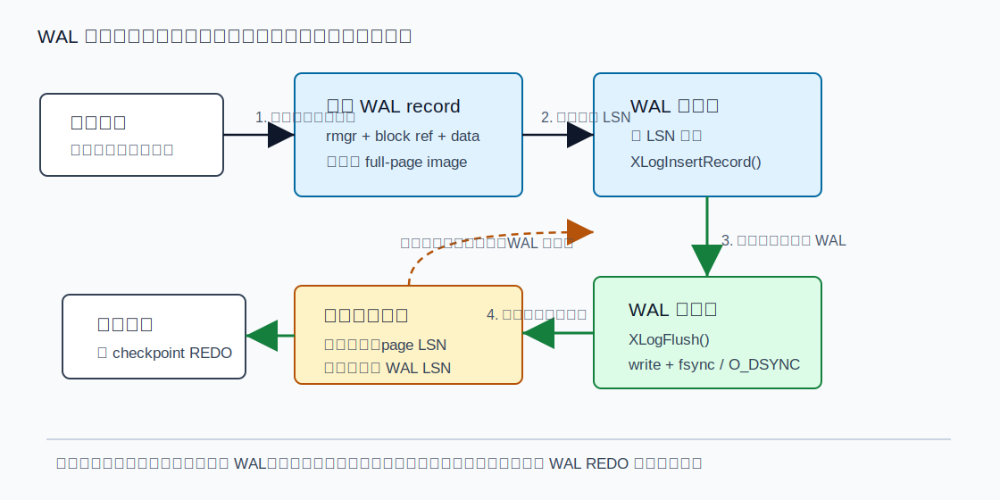
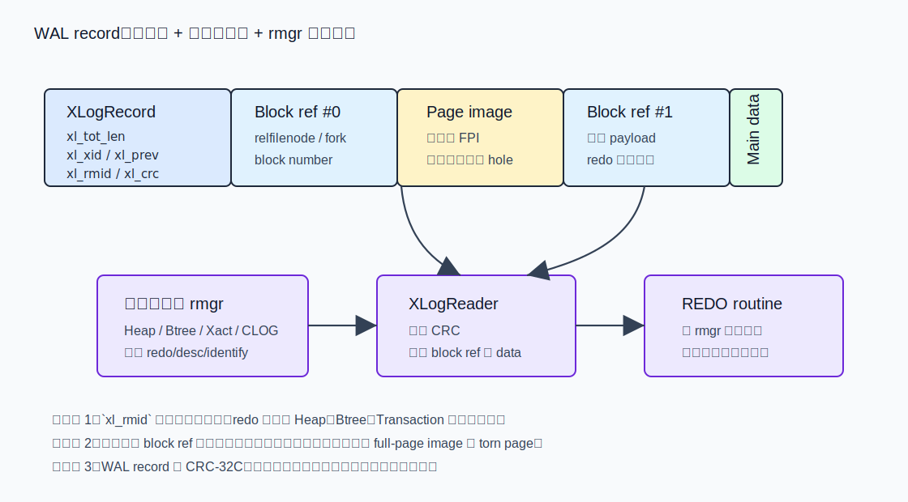
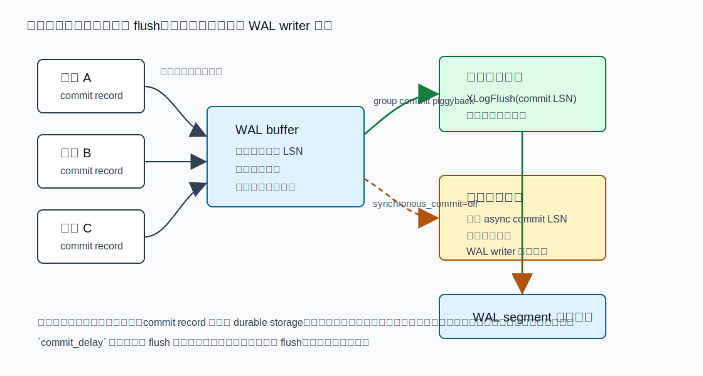
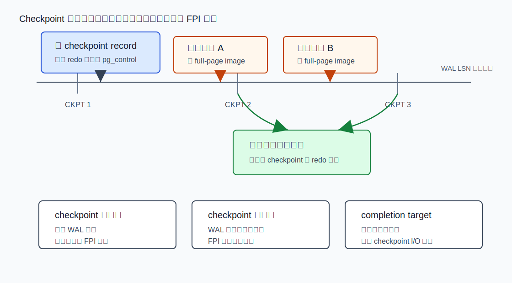
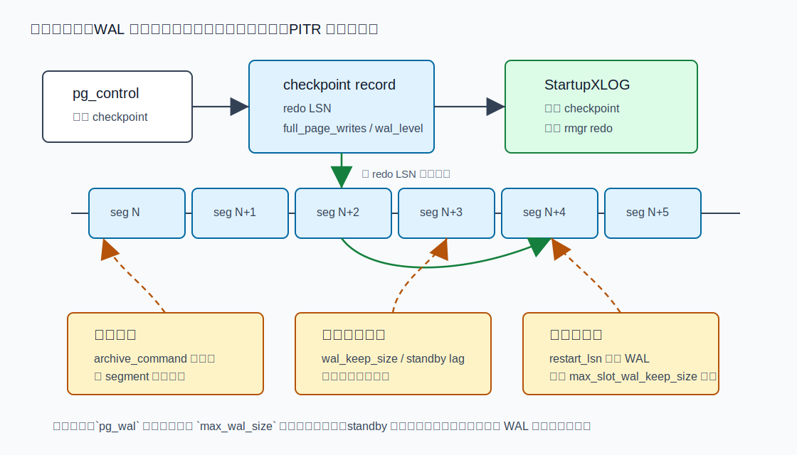

## 数据库筑基课 - WAL

### 作者
digoal

### 日期
2026-06-08

### 标签
PostgreSQL , 应用开发者 , 数据库筑基课 , WAL , REDO , checkpoint , PITR , 复制    

----

## 背景
  


这篇属于数据库筑基课里的“存储可靠性 + 维护机制”主题。WAL 不是一个只给 DBA 清理磁盘用的 `pg_wal` 目录，而是 PostgreSQL 把“高并发写入、事务提交、崩溃恢复、在线备份、PITR、物理复制、逻辑解码”串起来的基础设施。

本地 `markdown/` 目录没有发现独立的“数据库筑基课大纲”文件，所以本文不强行引用不存在的大纲；后续如果项目补充大纲，可以在这里补上课程目录链接。

先看一个真实工程痛点：

业务做秒杀、订单、账务、IoT 写入，表和索引页面分布在磁盘各处。如果每个事务提交时都把所有改过的数据页随机刷盘，提交延迟会被随机 I/O 拖死；如果不刷，又怕宕机后数据页只写了一半、事务状态丢失、索引和表不一致。PostgreSQL 的回答是 WAL：先把“如何重做修改”的日志顺序写入并按需刷盘，再让数据页稍后落盘。崩溃后，从最近 checkpoint 的 redo 位置向前重放 WAL，把数据页修回一致状态。

本文以本地 PostgreSQL 源码 `postgres` 为主线。重要结论优先引用官方文档和源码：`doc/src/sgml/wal.sgml`、`doc/src/sgml/config.sgml`、`doc/src/sgml/func/func-admin.sgml`、`doc/src/sgml/monitoring.sgml`、`doc/src/sgml/pgwalinspect.sgml`、`src/backend/access/transam/xlog.c`、`src/backend/access/transam/xloginsert.c`、`src/backend/access/transam/xlogrecovery.c`、`src/include/access/xlogrecord.h`、`src/backend/access/transam/README`、`src/backend/postmaster/walwriter.c`。用户补充的 DeepWiki repoName 为 `postgres/postgres`；本次通过 DeepWiki CLI 查询到 `2.3.3 Write-Ahead Logging (WAL)` 页面，并用其 WAL 架构摘要辅助定位主题，关键机制仍回到本地源码和官方文档核验。

## 一、它解决什么问题？

WAL 解决的是“把随机、分散、并发的数据修改，转成可顺序持久化、可恢复、可复制的日志流”的问题。

没有 WAL，数据库至少会面对五类硬问题：

1. **提交太慢。** 每次提交都同步刷所有 heap 和 index 脏页，会把顺序写变成大量随机写。
2. **崩溃后不知道哪些修改已经生效。** 数据页可能在内存、操作系统缓存、磁盘控制器缓存之间处于不同阶段。
3. **torn page。** PostgreSQL 常见数据页是 8kB，存储设备可能按更小扇区写入；断电时一个页可能一半新、一半旧。
4. **在线备份不是瞬时快照。** 备份过程持续一段时间，数据文件内部可能互相不一致，需要 WAL 把它修到一致点。
5. **复制和 PITR 需要连续历史。** 只保存数据文件，不保存变化日志，就无法把备用机或恢复目标推进到某个 LSN 或时间点。

WAL 的基本取舍是：

- 用顺序 WAL 写替代每次提交的数据页随机刷盘。
- 用后续 checkpoint 和后台写出摊平数据页 I/O。
- 用更多磁盘空间、更多写放大和恢复重放成本，换取提交延迟、吞吐和可恢复性。
- 用 `wal_level`、`synchronous_commit`、`full_page_writes`、`checkpoint_timeout`、`max_wal_size` 等参数，把“性能、恢复时间、数据丢失窗口、复制能力”变成可调边界。

## 二、它是什么？

WAL，全称 Write-Ahead Logging，核心规则是：**描述数据文件修改的 WAL record 必须先于对应数据页持久化**。PostgreSQL 官方文档 `doc/src/sgml/wal.sgml` 明确说明，数据文件中的表和索引页面只能在描述这些修改的 WAL record 已经刷到持久存储后再写出。这样提交时不必立即刷所有数据页；崩溃后只需要 REDO。

几个术语先定清楚：

| 术语 | 含义 |
|---|---|
| WAL record | 一条描述某类变化的日志记录，由固定头、块引用、主数据、可选 full-page image 组成 |
| LSN | Log Sequence Number，WAL 中单调增长的字节位置，用 `pg_lsn` 表示 |
| WAL segment | `pg_wal` 下的日志段文件，默认通常是 16MB，initdb 时可改变 |
| WAL page | WAL segment 内部的页，默认通常是 8kB，构建时可改变 |
| rmgr | resource manager，解释和重放某类 WAL record 的模块，例如 Heap、Btree、Transaction |
| REDO | 从 checkpoint redo 位置向前重放 WAL，把数据页补到一致状态 |
| checkpoint | 保证某个 redo 点之前的数据页修改已经落盘，并把 checkpoint 信息写入 WAL 和 `pg_control` |
| full-page image | checkpoint 后某页第一次修改时，可把整个页镜像写入 WAL，用于防 torn page |



图 1 说明：业务修改先进入共享缓冲区，WAL record 获得 LSN 并进入 WAL buffer。只有当 WAL 至少刷到该页面的 LSN，脏数据页才允许落盘。提交路径通常等待 WAL，而不是等待所有数据页。

## 三、核心原理

### 3.1 一次页面修改怎样写 WAL？

源码 `src/backend/access/transam/README` 给出普通 WAL-logged 页面修改的顺序，简化后是：

1. 锁住并 pin 住要修改的 buffer。
2. 进入 critical section。
3. 修改共享缓冲区里的页面。
4. `MarkBufferDirty()` 标记脏页。
5. 如果 relation 需要 WAL，调用 `XLogBeginInsert()`、`XLogRegisterBuffer()`、`XLogRegisterData()` 或 `XLogRegisterBufData()` 构造 WAL record。
6. `XLogInsert()` 插入记录，拿到返回的 LSN。
7. `PageSetLSN()` 把页面 LSN 设置为该记录位置。
8. 退出 critical section，释放 buffer。

这里有两个细节特别重要。

第一，WAL record 不是“字符串日志”。`src/include/access/xlogrecord.h` 定义了记录布局：固定 `XLogRecord` 头里有总长度、XID、前一条记录指针、rmgr id、info、CRC；后面可以跟多个 block reference、block data、main data。恢复时 `XLogReader` 校验并拆解记录，再按 `xl_rmid` 找对应 rmgr 的 redo 函数。

第二，页面的 LSN 是写前日志规则的桥。数据页写出前，缓冲区管理和存储同步路径要保证 WAL 已经刷到页面 LSN，否则崩溃后可能无法重做该页面状态。



图 2 说明：`xl_rmid` 决定这条记录由哪个资源管理器解释。Heap、Btree、Transaction、CLOG 等 rmgr 的 redo routine 负责把记录转回页面变化或事务状态变化。full-page image 是 block reference 的可选部分，不是每条记录都有。

### 3.2 XLogInsertRecord：并发追加，不是全局串行大锁

`src/backend/access/transam/xlog.c` 的 `XLogInsertRecord()` 是 WAL 插入核心。它把插入拆成两个阶段：

- 先从全局 WAL 字节流中预留一段空间，得到 `StartPos` 和 `EndPos`。
- 再把记录复制进对应 WAL buffer 页面。

为了支持并发插入，PostgreSQL 使用固定数量的 WAL insertion locks。普通记录通常只拿其中一把；checkpoint、segment switch 等特殊记录需要更强的插入锁控制。源码注释强调：步骤 2 通常可以并行执行，只有初始化 WAL buffer 页面等场景需要额外映射锁。

这解释了为什么高并发小事务不一定被单一 WAL 插入锁完全串行化。真正容易成为瓶颈的，往往是后面的 flush、fsync、WAL writer 跟不上、WAL buffer 太小、存储延迟高或同步复制等待。

### 3.3 Full-page image：解决 torn page，不是业务数据冗余

`full_page_writes=on` 时，checkpoint 后某个数据页第一次被修改，WAL 会记录 full-page image。官方配置文档 `doc/src/sgml/config.sgml` 说明原因：如果系统崩溃时数据页只写了一部分，普通行级变化记录不足以修复这个混合新旧内容的页；full-page image 可以在恢复时直接把页恢复到一致状态。

`src/backend/access/transam/README` 对 `XLogRegisterBuffer()` 的说明进一步强调：必须注册被 WAL-logged action 修改的每个 buffer，以避免 torn-page hazard。`xloginsert.c` 中的 `XLogRecordAssemble()` 会判断是否需要 image，并在标准页布局下去掉中间空洞；如果 `wal_compression` 开启，还会尝试用 pglz、LZ4 或 ZSTD 压缩 full-page image。

代价很直接：

- checkpoint 后的首轮写入会产生更多 WAL。
- checkpoint 越频繁，越容易反复触发首改页 FPI。
- `wal_compression` 可以降 WAL 字节量，但会增加插入时压缩和恢复时解压的 CPU 成本。

### 3.4 提交为什么通常只等 WAL？

事务提交路径在 `src/backend/access/transam/xact.c`。`RecordTransactionCommit()` 会写 transaction commit WAL record，然后根据条件决定是否 `XLogFlush(XactLastRecEnd)`。当 `synchronous_commit` 非 `off` 且事务写了 WAL，提交返回前要等待本地 WAL flush；如果启用同步复制，还可能等待 standby 的 write、flush 或 apply。

`XLogFlush()` 位于 `src/backend/access/transam/xlog.c`。它会：

- 如果目标 LSN 已经 flush，快速返回。
- 等待目标之前的 WAL 插入完成。
- 获取 `WALWriteLock`，尽量把更多已经插入的数据一起写出并 fsync。
- 在 `commit_delay` 条件满足时短暂等待，让更多事务加入同一次 group commit。

`src/backend/postmaster/walwriter.c` 则解释了异步提交边界：WAL writer 让没有在提交时立刻同步到磁盘的 async commit record 在可知时间内到达磁盘，最坏是三倍 `wal_writer_delay` 周期。官方文档也明确：`synchronous_commit=off` 可能丢失最近已经向客户端返回成功的事务，但数据库会恢复到一致状态，相当于这些事务干净回滚；这和 `fsync=off` 可能造成不可恢复损坏不是一回事。



图 3 说明：多个后端的 commit record 可以靠一次 flush 分摊 fsync 成本。同步提交在返回前等待本地 durable；异步提交先返回，由 WAL writer 后续补刷。`commit_delay` 是同步提交前的聚合窗口，不是异步提交。

### 3.5 Checkpoint：恢复窗口和写入放大的交换

checkpoint 的官方定义是：事务序列中的一个点，保证在它之前的 heap 和 index 数据文件修改已经落盘。checkpoint 时，脏数据页会被刷出，特殊 checkpoint record 写入 WAL，`pg_control` 记录 checkpoint 位置和相关信息。

`src/backend/access/transam/xlog.c` 的 `CreateCheckPoint()` 体现了几个关键点：

- 空闲且没有重要 WAL 活动时，可以跳过非强制 checkpoint。
- 在线 checkpoint 会插入 `XLOG_CHECKPOINT_REDO` 记录，它的 LSN 成为新的 redo 指针。
- checkpoint 过程中会把 `fullPageWrites`、`wal_level`、checksum 状态等写入 checkpoint 记录。
- checkpoint 不能简单阻断所有业务写入；在线 checkpoint 在确定 redo 点后释放 WAL insertion locks，业务可继续产生 WAL。

checkpoint 的参数权衡来自 `doc/src/sgml/wal.sgml` 和 `doc/src/sgml/config.sgml`：

- `checkpoint_timeout` 和 `max_wal_size` 更小：恢复要重放的 WAL 更少，但 checkpoint 更频繁、脏页写出更多、FPI 更多。
- `checkpoint_timeout` 和 `max_wal_size` 更大：吞吐更平滑、FPI 压力可能下降，但崩溃恢复时间和 WAL 保留窗口增大。
- `checkpoint_completion_target` 默认 0.9，用于把 checkpoint 写脏页摊开，避免 I/O 突刺；设太低通常会制造更集中的 checkpoint I/O。



图 4 说明：checkpoint 是恢复起点，也是 FPI 周期的重置点。短 checkpoint 周期减少 REDO 工作，却提高 dirty page flush 与首改页 FPI 的频率。大多数生产系统调参不是追求“checkpoint 越多越安全”，而是按恢复时间目标和 I/O 能力设边界。

### 3.6 崩溃恢复：从 pg_control 找 checkpoint，再向前 REDO

启动恢复入口是 `StartupXLOG()`。官方 WAL internals 章节说明：恢复开始时先读 `pg_control`，再读 checkpoint record，然后从 checkpoint 指定的 WAL redo 位置向前扫描并执行 REDO。源码 `src/backend/access/transam/xlogrecovery.c` 中，恢复循环会读取 WAL record，调用 `RmgrStartup()` 后按 `RmgrTable` 分派 redo。

恢复不是“撤销未提交事务”的 ARIES 完整三阶段教科书照搬。PostgreSQL 的 MVCC 与事务状态使它可以主要依赖 REDO 和事务可见性：未提交事务留下的行版本不会对正常快照可见，后续 VACUUM 可以清理。事务 commit record 是否存在并持久，是可见性和恢复的重要依据。

如果启用 `full_page_writes`，checkpoint 后首次修改页的 full-page image 让恢复能处理 torn page。官方文档也指出，如果 `pg_control` 本身损坏，目前并没有实现从最新到最旧反向扫描 WAL 以寻找最新 checkpoint 的机制；`pg_control` 是一个理论弱点，但实践中因其很小且不易受 partial write 影响，通常不是主要问题。

### 3.7 WAL 不只为本机：归档、PITR、物理复制、逻辑解码

WAL segment 存在 `pg_wal` 目录下。默认 segment 大小通常是 16MB，文件名带 timeline 和段号。WAL 的外部用途包括：

- **在线备份和 PITR。** 基础备份不必是瞬时一致快照；恢复时把备份期间和之后的 WAL 重放到目标时间、LSN 或 restore point。
- **归档。** `archive_mode` + `archive_command` 或 `archive_library` 把完成的 WAL segment 送到归档存储。归档命令失败时，旧 segment 会留在 `pg_wal`。
- **物理流复制。** WAL sender 把 WAL 发送给 standby，standby WAL receiver 接收并 replay。
- **逻辑解码。** `wal_level=logical` 写入更多信息，让逻辑解码从 WAL 中提取变更集。
- **WAL summarization。** 新版本中可为增量备份等能力生成 WAL summary；`wal_level=minimal` 下不能生成有效 summary。

`wal_level` 是能力边界：

| `wal_level` | 写入内容 | 适合 | 重要限制 |
|---|---|---|---|
| `minimal` | 只够崩溃恢复和 immediate shutdown 恢复 | 临时装载、可重建环境、无归档复制需求 | 不支持 PITR、连续归档、物理流复制；已有 base backup 对 PITR 不再适用 |
| `replica` | 支持归档、物理复制、standby 只读查询 | 默认生产设置 | WAL 量高于 minimal |
| `logical` | 在 replica 基础上增加逻辑解码信息 | CDC、逻辑复制、审计解码 | UPDATE/DELETE、REPLICA IDENTITY FULL 等场景会增加 WAL 量 |



图 5 说明：`pg_wal` 空间不只由 `max_wal_size` 决定。归档失败、standby 落后、复制槽 `restart_lsn` 不推进、`wal_keep_size`、checkpoint 恢复需要、WAL summarization 都可能让旧 segment 无法回收。

## 四、横向对比

### 4.1 WAL、双写缓冲、影子页、LSM manifest

| 维度 | PostgreSQL WAL | 双写缓冲 | 影子页 / Copy-on-Write | LSM WAL + manifest |
|---|---|---|---|---|
| 主要目标 | 先顺序记录变化，崩溃后 REDO | 防止数据页 torn write | 新版本页写到新位置，再切换元数据 | 保护 memtable 和元数据切换 |
| 写入代价 | 每次 WAL-logged 修改写日志，checkpoint 后首改页可能 FPI | 数据页写两份或经过 doublewrite 区 | 写新页和元数据，空间回收复杂 | 顺序 WAL + 后台 compaction |
| 读取代价 | 正常读数据页，恢复时读 WAL | 正常读数据页 | 需要版本/映射管理 | 读放大依赖层级和 bloom/filter |
| 空间成本 | `pg_wal`、FPI、归档、复制槽保留 | doublewrite 区和额外写放大 | 多版本页和垃圾回收 | WAL、SST、多层重复键 |
| 事务/MVCC | 与 MVCC、`pg_xact`、checkpoint 联动 | 通常作为页安全组件 | 可天然支持快照，但实现复杂 | 事务依赖 memtable/WAL/manifest 协议 |
| 适合场景 | 通用关系数据库、复杂索引和事务 | 需要防 torn page 的页式存储 | 强快照或 COW 文件系统思路 | 高写入、范围扫描、可接受 compaction |
| 不适合场景 | `pg_wal` 空间和 fsync 延迟无人治理 | 写放大敏感场景 | 小随机更新可能放大明显 | 写放大/读放大调参复杂 |

这张表不是为了给技术排座次。PostgreSQL WAL 的特点是和 heap/index 页面、MVCC、事务状态、复制、PITR 深度绑定；它不是单独的文件日志组件。

### 4.2 PostgreSQL 内部几个提交持久性设置

| 设置 | 返回成功前等待什么 | 可能丢失已返回事务吗 | 可能导致数据库损坏吗 | 适合场景 |
|---|---|---|---|---|
| `synchronous_commit=on` | 本地 WAL flush；如有同步复制还按配置等 standby | 正常不应丢本地已返回事务 | 不应 | 默认生产事务 |
| `synchronous_commit=remote_write` | standby 写入 OS 缓存 | standby OS 崩溃仍可能丢 | 不应 | 同步复制但降低远端 fsync 等待 |
| `synchronous_commit=remote_apply` | standby replay 到可见 | 正常不应 | 不应 | 读 standby 需要提交后立即可见 |
| `synchronous_commit=off` | 不等本地 WAL flush | 可能丢最近成功返回事务 | 不应，状态等价干净回滚 | 可重放日志、低价值事件 |
| `fsync=off` | 不强制持久化 | 可能 | 可能不可恢复损坏 | 仅可重建测试或批处理环境 |

关键区别：`synchronous_commit=off` 放弃的是一小段提交持久性；`fsync=off` 放弃的是 PostgreSQL 对不同文件写入顺序和持久化的整体保护。

## 五、效果如何？

WAL 的收益：

- 提交从“刷所有数据页”变成“顺序刷 WAL”，显著降低小事务提交成本。
- 多个并发事务可以 group commit，共享一次 fsync。
- 崩溃恢复从最近 checkpoint 向前 REDO，不需要扫描所有数据文件。
- 在线备份、PITR、物理复制、逻辑解码都有统一日志来源。
- full-page image 处理 torn page 风险。
- `pg_stat_wal`、`pg_stat_io`、`pg_walinspect` 等工具让 WAL 活动可观测。

WAL 的代价：

- 写放大：数据页最终要写，WAL 也要写；checkpoint 后还有 FPI。
- 空间压力：归档失败、standby lag、复制槽、`wal_keep_size` 都会保留 segment。
- fsync 延迟：提交路径可能被存储刷盘、同步复制或 WALWriteLock 等待影响。
- 恢复时间：checkpoint 间隔越长，崩溃后要重放的 WAL 可能越多。
- CPU 成本：WAL CRC、FPI 压缩、恢复解压、逻辑解码都会消耗 CPU。
- 运维复杂度：WAL 参数之间相互影响，不能只看单个 `max_wal_size`。

不要在没有代表性压力测试的情况下承诺性能数字。本文只给机制和验证路径，不虚构吞吐、延迟或 WAL 量比例。

## 六、实操 DEMO

下面给出最小验证脚本。本文没有在本地启动 PostgreSQL 实例执行这些 SQL，因此不提供执行输出；读者可在测试库中执行并观察。

### 6.1 观察插入、写出、刷盘 LSN

```sql
SELECT pg_current_wal_insert_lsn() AS insert_lsn,
       pg_current_wal_lsn()        AS write_lsn,
       pg_current_wal_flush_lsn()  AS flush_lsn;

SELECT pg_walfile_name_offset(pg_current_wal_lsn());
```

验证点：官方函数说明中，insert LSN 是逻辑 WAL 末尾，write LSN 是已经从内部缓冲写出的末尾，flush LSN 是已知到达持久存储的位置。

### 6.2 观察一段 DML 产生多少 WAL

```sql
DROP TABLE IF EXISTS wal_demo;
CREATE TABLE wal_demo(id bigint PRIMARY KEY, payload text);

SELECT pg_current_wal_lsn() AS lsn_before \gset

INSERT INTO wal_demo
SELECT g, repeat(md5(g::text), 4)
FROM generate_series(1, 10000) AS g;

SELECT pg_current_wal_lsn() AS lsn_after \gset

SELECT pg_size_pretty(pg_wal_lsn_diff(:'lsn_after', :'lsn_before')) AS wal_generated;
```

验证点：`pg_wal_lsn_diff()` 返回两个 LSN 之间的字节差。这个值不是只由表数据大小决定，还受索引、FPI、checkpoint、hint、tuple header、WAL record 结构等因素影响。

### 6.3 观察 pg_stat_wal 与 full-page image

```sql
SELECT wal_records, wal_fpi, wal_bytes, wal_fpi_bytes
FROM pg_stat_wal;

CHECKPOINT;

SELECT pg_current_wal_lsn() AS lsn_before \gset

UPDATE wal_demo
SET payload = payload || 'x'
WHERE id BETWEEN 1 AND 1000;

SELECT pg_current_wal_lsn() AS lsn_after \gset

SELECT pg_size_pretty(pg_wal_lsn_diff(:'lsn_after', :'lsn_before')) AS wal_generated;

SELECT wal_records, wal_fpi, wal_bytes, wal_fpi_bytes
FROM pg_stat_wal;
```

验证点：checkpoint 后首次修改页面更容易产生 full-page image。不要把 `wal_fpi` 上升简单归因于“SQL 写得差”，它也可能是 checkpoint 周期和页面首改规律共同造成的。

### 6.4 用 pg_walinspect 看 WAL record

需要安装扩展：

```sql
CREATE EXTENSION IF NOT EXISTS pg_walinspect;

SELECT pg_current_wal_lsn() AS start_lsn \gset

INSERT INTO wal_demo VALUES (-1, 'inspect');

SELECT pg_current_wal_lsn() AS end_lsn \gset

SELECT start_lsn, end_lsn, resource_manager, record_type,
       record_length, fpi_length, description
FROM pg_get_wal_records_info(:'start_lsn', :'end_lsn')
ORDER BY start_lsn;

SELECT start_lsn, resource_manager, record_type,
       reltablespace, reldatabase, relfilenode,
       relforknumber, relblocknumber,
       block_fpi_length
FROM pg_get_wal_block_info(:'start_lsn', :'end_lsn', false)
ORDER BY start_lsn, block_id;
```

验证点：`pg_walinspect` 可以从 SQL 层看到 resource manager、record type、block reference 和 FPI 长度。官方文档提醒，有些函数接收的 LSN 需要是 record 开始位置；如果给的 LSN 不是记录开头，会查找下一条有效记录或报错。

### 6.5 观察 WAL 保留来源

```sql
SELECT slot_name, slot_type, active, restart_lsn,
       pg_size_pretty(pg_wal_lsn_diff(pg_current_wal_lsn(), restart_lsn)) AS retained
FROM pg_replication_slots
WHERE restart_lsn IS NOT NULL
ORDER BY pg_wal_lsn_diff(pg_current_wal_lsn(), restart_lsn) DESC;

SELECT pid, application_name, state,
       sent_lsn, write_lsn, flush_lsn, replay_lsn,
       pg_size_pretty(pg_wal_lsn_diff(pg_current_wal_lsn(), replay_lsn)) AS replay_lag_bytes
FROM pg_stat_replication;

SELECT archived_count, failed_count, last_archived_wal,
       last_failed_wal, last_failed_time
FROM pg_stat_archiver;
```

验证点：`pg_wal` 空间上涨时，不要只调大 `max_wal_size`。先确认是不是归档失败、复制槽滞留、standby replay 落后或 WAL summarization 保留。

## 七、最佳实践

### 面向数据库架构师

1. 给核心交易明确持久性语义。账务、订单状态、库存扣减不要默认允许 `synchronous_commit=off`。
2. 把在线备份、PITR、归档和复制设计成一条连续 WAL 链。基础备份不能脱离所需 WAL 独立存在。
3. 规划 `pg_wal` 容量时按峰值 WAL 速率、归档最坏延迟、standby 最大滞后、复制槽保留、恢复时间目标留余量。
4. 使用逻辑复制或 CDC 时，把 `wal_level=logical` 带来的 WAL 增量、复制槽保留和 catalog 清理边界纳入容量模型。
5. 对大批量装载，优先用可恢复策略：分批提交、临时表、合理 checkpoint 和归档能力；只有在明确无复制/PITR需求且可重建时才考虑 `wal_level=minimal` 相关优化。

### 面向 DBA

1. 监控 `pg_stat_wal.wal_bytes`、`wal_fpi`、`wal_fpi_bytes`，把 WAL 量和 checkpoint 时间点对应起来看。
2. 开启 `log_checkpoints`，观察 checkpoint 是否过于频繁、是否由 `max_wal_size` 触发、sync 阶段是否有长尾。
3. `max_wal_size` 是软边界，不是磁盘保护阀。归档失败、复制槽和 standby lag 都可能突破它。
4. 归档命令必须“成功才返回 0”。用 `/bin/true` 等于主动破坏 PITR WAL 链，除非你明确接受。
5. 慎关 `full_page_writes`。除非存储系统能可靠防 torn page 且业务能接受风险，否则保持默认开启。
6. 高并发提交延迟高时，先区分 `WALWriteLock`、WAL write/fsync 时间、同步复制等待、存储延迟，再决定是否调 `commit_delay`、`wal_buffers` 或存储。
7. 对复制槽设置监控和处置流程。长期 inactive slot 是 `pg_wal` 爆盘的常见来源。
8. 用 `pg_waldump` 或 `pg_walinspect` 做教育和诊断，不要在高峰期对大范围 WAL 做重型解析。

### 面向业务开发者

1. 大批量写入要分批提交。一个超大事务会制造长 WAL 链、长锁持有和恢复压力。
2. 不要在事务里做长时间外部调用。事务越长，提交集中 flush 和恢复影响越难预测。
3. 可丢、可重放的事件日志可以评估 `SET LOCAL synchronous_commit=off`；核心状态变更不要用它偷延迟。
4. 写热点表时关注索引数量。每个索引修改也会产生日志，WAL 量不只来自 heap。
5. 业务发布前用 `pg_wal_lsn_diff()` 估算关键批处理 WAL 量，避免上线后才发现归档和复制跟不上。
6. 如果应用依赖 standby 立刻读到刚提交数据，需要理解 `synchronous_commit=remote_apply` 的延迟代价。

## 八、适合与不适合场景

### 适合

- 高并发 OLTP：小事务多、数据页分散，顺序 WAL 写能显著降低提交随机 I/O。
- 需要崩溃恢复的生产系统：WAL 是恢复到一致状态的核心依据。
- 需要在线备份和 PITR 的系统：基础备份 + WAL 链可以恢复到指定时间或 LSN。
- 主备复制和读扩展：物理 standby 直接接收并重放 WAL。
- CDC 和逻辑复制：`wal_level=logical` 让 WAL 成为逻辑变更来源。
- 教学和诊断：LSN、rmgr、record type 能把数据库修改路径拆开观察。

### 不适合或要谨慎

- 只为了省磁盘而随意删除 `pg_wal` 文件。这样可能直接破坏实例恢复能力。
- 归档、复制槽、standby lag 无监控的生产系统。WAL 迟早会变成容量事故。
- 不可丢核心事务使用 `synchronous_commit=off`。它的语义本来就允许丢最近成功返回的事务。
- 把 `fsync=off` 当性能调优。它适合可重建环境，不适合需要可靠性的生产库。
- 频繁 checkpoint 追求“更安全”。checkpoint 过频会增加 FPI 和 I/O，未必降低整体风险。
- 存储设备不保证 flush 语义。WAL 依赖操作系统和硬件诚实地把 flush 落到非易失介质。

## 九、常见坑

1. **看到 `pg_wal` 大就直接删文件。**  
   错。应先查归档状态、复制槽、standby lag、checkpoint、WAL summarization。手工删除可能让实例无法恢复或 standby 断流。

2. **以为 `max_wal_size` 是硬上限。**  
   它是 checkpoint 相关软限制。归档失败、复制槽保留、`wal_keep_size`、恢复需求都能让 WAL 超过它。

3. **把 `synchronous_commit=off` 和 `fsync=off` 混为一谈。**  
   前者可能丢最近成功返回的事务但保持一致；后者可能导致不可恢复损坏。

4. **checkpoint 设置太小。**  
   频繁 checkpoint 会反复触发 full-page image，导致 WAL 量和 I/O 变大，反而让系统更抖。

5. **忽视 full-page image。**  
   checkpoint 后的写入高峰、`full_page_writes=on`、base backup、hint bits 和 checksums 都可能推高 FPI。

6. **逻辑复制槽长期 inactive。**  
   inactive slot 的 `restart_lsn` 不推进，会持续保留 WAL。对 CDC 系统必须设置告警和清理策略。

7. **归档命令返回值不严格。**  
   `archive_command` 失败必须非 0；假成功会让 PostgreSQL 认为 WAL 已归档，实际恢复时链条断裂。

8. **把 `wal_level=minimal` 用在有 PITR/standby 的系统。**  
   minimal WAL 不包含足够的 PITR 和复制信息。切到 minimal 会让之前的 base backup 对 PITR 不再适用。

9. **只看事务 TPS，不看 WAL MB/s。**  
   两个 TPS 相同的 workload，可能因索引、FPI、tuple 宽度、批量操作产生完全不同的 WAL 压力。

10. **在 standby 上只看 replay lag 时间。**  
    还要看 LSN 字节差。低写入时秒级延迟不一定大；高写入时很短时间就可能积累大量 WAL。

## 十、扩展问题

1. 为什么 PostgreSQL 可以在提交时只等待 WAL，而不是等待所有 heap/index 脏页？
2. checkpoint 越频繁是否一定越安全？它怎样影响 full-page image 和恢复时间？
3. `synchronous_commit=off` 为什么不会导致结构损坏，却会丢“已成功返回”的事务？
4. 如果一个逻辑复制槽停止消费 24 小时，你怎样估算 `pg_wal` 需要多大空间？
5. 为什么 WAL record 要带 `xl_prev` 和 CRC？这些字段分别帮助什么问题？
6. 如果一条 UPDATE 同时修改 heap 页和多个 index 页，WAL record 和 rmgr redo 如何保证恢复后一致？
7. 什么时候应该用 `wal_compression`？CPU 和归档带宽之间怎样做取舍？
8. 如果一个系统要求“主库提交后 standby 查询立刻可见”，为什么 `remote_apply` 比 `on` 延迟更高？

## 十一、扩展阅读

官方文档：

- [Reliability and the Write-Ahead Log](../postgres/doc/src/sgml/wal.sgml)
- [WAL Configuration](../postgres/doc/src/sgml/wal.sgml)
- [Runtime WAL settings](../postgres/doc/src/sgml/config.sgml)
- [WAL 管理函数](../postgres/doc/src/sgml/func/func-admin.sgml)
- [pg_stat_wal](../postgres/doc/src/sgml/monitoring.sgml)
- [pg_walinspect](../postgres/doc/src/sgml/pgwalinspect.sgml)
- [Write Ahead Logging for Extensions](../postgres/doc/src/sgml/wal-for-extensions.sgml)
- [Generic WAL Records](../postgres/doc/src/sgml/generic-wal.sgml)

源码与内部说明：

- [事务系统与 WAL 修改规则 README](../postgres/src/backend/access/transam/README)
- [xlog.c](../postgres/src/backend/access/transam/xlog.c)
- [xloginsert.c](../postgres/src/backend/access/transam/xloginsert.c)
- [xlogrecovery.c](../postgres/src/backend/access/transam/xlogrecovery.c)
- [xlogreader.c](../postgres/src/backend/access/transam/xlogreader.c)
- [WAL record 定义](../postgres/src/include/access/xlogrecord.h)
- [WAL LSN 与 timeline 定义](../postgres/src/include/access/xlogdefs.h)
- [rmgr 表](../postgres/src/backend/access/transam/rmgr.c)
- [rmgrlist.h](../postgres/src/include/access/rmgrlist.h)
- [walwriter.c](../postgres/src/backend/postmaster/walwriter.c)
- [xact.c 提交路径](../postgres/src/backend/access/transam/xact.c)

外部资料：

- C. Mohan et al., 1992, *ARIES: A Transaction Recovery Method Supporting Fine-Granularity Locking and Partial Rollbacks Using Write-Ahead Logging*.
- PostgreSQL Wiki: Custom WAL Resource Managers.

DeepWiki：

- 用户补充 repoName：`postgres/postgres`。
- 本次 `npx --yes @seflless/deepwiki toc postgres/postgres` 查询显示该 wiki 包含 `2.3.3 Write-Ahead Logging (WAL)` 与 `2.4.1 WAL Archiving and Streaming Replication`。
- 本次 `npx --yes @seflless/deepwiki ask postgres/postgres "Summarize PostgreSQL WAL architecture: XLogInsertRecord, XLogFlush, checkpoint, recovery."` 返回的架构摘要覆盖 `XLogInsertRecord`、`XLogFlush`、checkpoint、`StartupXLOG()` 和 WAL replay。本文把 DeepWiki 作为架构索引使用，事实性结论仍以上述官方文档和源码为准。
- DeepWiki 页面入口：[Write-Ahead Logging (WAL)](https://deepwiki.com/postgres/postgres/2.3.3-write-ahead-logging-%28wal%29)。
  
## 附录 
1、克隆代码  
```  
git clone --depth 1 https://github.com/postgres/postgres
```  
  
2、启用 codex, 使用 [数据库筑基课 skill](../skills/README.md).  
```
文章标题: 
  数据库筑基课 - wal
项目源码(本地目录): 
  postgres
项目 codebase 文件名: 
  postgres/CLAUDE.md 
开源项目相关的 deepwiki repoName: 
  postgres/postgres
```
    
#### [PostgreSQL 解决方案集合](../201706/20170601_02.md "40cff096e9ed7122c512b35d8561d9c8")
  
  
#### [德哥 / digoal's Github - 公益是一辈子的事.](https://github.com/digoal/blog/blob/master/README.md "22709685feb7cab07d30f30387f0a9ae")
  
  
#### [About 德哥](https://github.com/digoal/blog/blob/master/me/readme.md "a37735981e7704886ffd590565582dd0")
  
  

  
