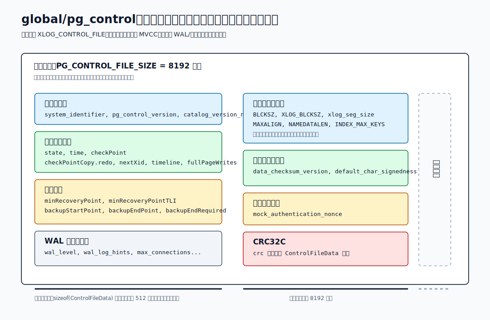
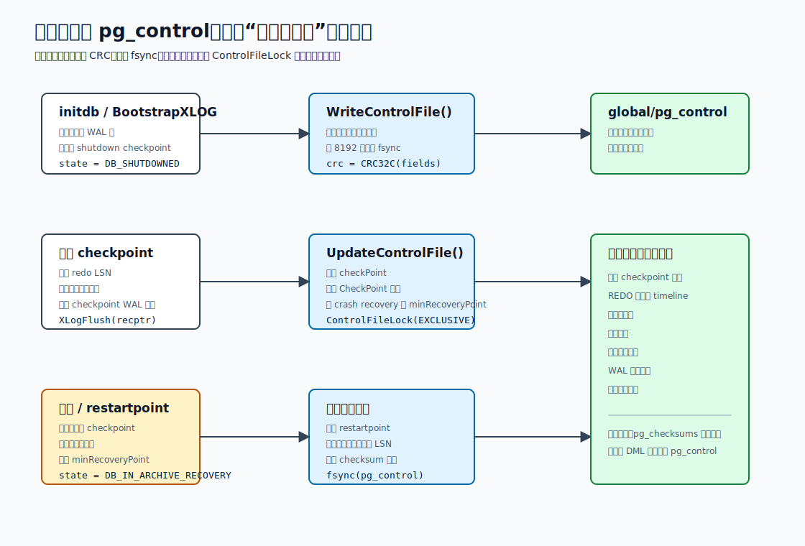
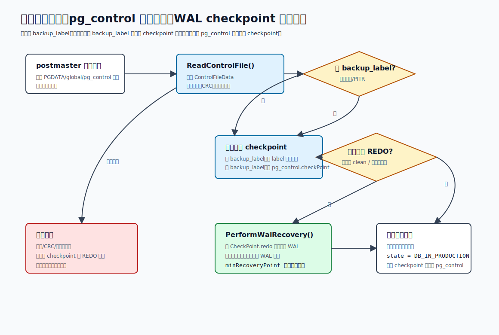
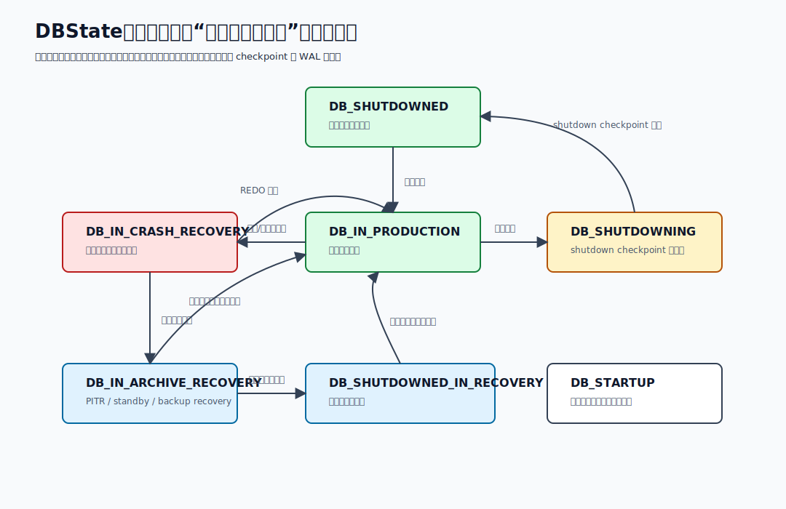
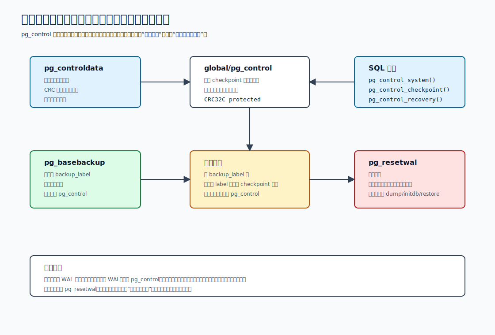

## 数据库筑基课 - control file

### 作者
digoal

### 日期
2026-06-08

### 标签
PostgreSQL , 应用开发者 , 数据库筑基课 , 存储管理 , WAL , 检查点 , 恢复 , control file    

----

## 背景
  


本文属于“存储管理、WAL、检查点与实例恢复”基础能力。当前项目的 `markdown` 目录未发现明确的“数据库筑基课大纲”文件，因此本文按本地 PostgreSQL 源码、官方文档和 DeepWiki `postgres/postgres` 的架构索引展开；关键结论以源码和官方文档为准。

先澄清一个容易混淆的词：本文的 **control file** 指 PostgreSQL 数据目录里的 `global/pg_control`，不是扩展安装用的 `xxx.control` 文件。后者描述 extension 的默认版本、脚本路径和依赖；前者是数据库实例自己的控制文件，保存“下次启动恢复必须知道的最小事实”。

一个真实的工程痛点是：数据库 crash 后为什么知道从哪个 WAL 位置开始 REDO？为什么把一个运行中的 `$PGDATA` 直接 `cp -r` 到另一台机器，有时会恢复失败甚至出现不可信的数据？为什么 `pg_resetwal` 文档反复强调这是最后手段？这些问题的共同入口，都是 `global/pg_control`。

PostgreSQL 官方 WAL 文档说明：checkpoint 完成并且 WAL 刷盘后，checkpoint 的位置会保存在 `pg_control`；恢复开始时，服务器先读 `pg_control`，再读 checkpoint 记录，然后从 checkpoint 记录指向的位置向前 REDO。源码里的路径定义在 [`xlog_internal.h`](../postgres/src/include/access/xlog_internal.h)：`XLOG_CONTROL_FILE` 就是 `global/pg_control`。

## 一、它解决什么问题？

`pg_control` 解决的是“数据库实例下次启动时如何找到可信恢复入口”的问题。没有它，启动流程要从大量 WAL 文件中搜索最新可用 checkpoint，还要判断这些 WAL 是否属于同一个集群、当前二进制是否兼容这个数据目录、上次是干净关闭还是崩溃、备份恢复至少要重放到哪里。理论上可以扫描 WAL 推断一部分信息，但代价高、边界复杂，而且 PostgreSQL 目前并没有实现“倒序扫描 WAL 寻找最新 checkpoint”作为 `pg_control` 损坏时的通用替代方案。

它把问题转化为几个小而关键的事实：

- 这个数据目录属于哪个集群：`system_identifier`。
- 当前 `pg_control` 格式和系统 catalog 版本是否匹配当前服务器：`pg_control_version`、`catalog_version_no`。
- 上次数据库处于什么状态：`DB_SHUTDOWNED`、`DB_IN_PRODUCTION`、`DB_IN_CRASH_RECOVERY`、`DB_IN_ARCHIVE_RECOVERY` 等。
- 最新 checkpoint WAL 记录在哪里：`checkPoint`。
- 最新 checkpoint 记录的内容副本是什么：`checkPointCopy`，包括 `redo` LSN、timeline、`nextXid`、`nextOid`、`oldestXid`、`fullPageWrites` 等。
- 归档恢复或在线备份恢复至少要到哪里才能启动：`minRecoveryPoint`、`backupStartPoint`、`backupEndPoint`、`backupEndRequired`。
- 当前数据目录的关键物理格式是否与服务器二进制兼容：`BLCKSZ`、`XLOG_BLCKSZ`、`xlog_seg_size`、`NAMEDATALEN`、`INDEX_MAX_KEYS` 等。

代价也很明确：这是一个小但关键的单点元数据文件。它不是业务数据主体，但它坏了会让服务器无法判断从哪里安全恢复。PostgreSQL 通过小结构、CRC、固定物理大小、fsync、checkpoint 顺序和备份顺序来降低风险，而不是把它做成普通表。

## 二、它是什么？

`pg_control` 是 PostgreSQL 数据目录下的一个固定位置二进制文件：`$PGDATA/global/pg_control`。源码在 [`pg_control.h`](../postgres/src/include/catalog/pg_control.h) 中定义 `ControlFileData`，并注明它不是 heap relation，只是在 catalog 头文件里定义以便文档化格式。

可以把它理解为实例级“恢复锚点”：

- 它不是 SQL 表，没有 MVCC，没有 WAL 记录自己的每次字节更新。
- 它在共享内存中有一份镜像，源码注释称 `ControlFile` 保存 `pg_control` 内容的 image。
- 后端更新控制文件时应持有 `ControlFileLock`，再通过 `UpdateControlFile()` 重写文件。
- 文件内容最后有 CRC32C，读文件时会重新计算并校验。
- `ControlFileData` 的有效大小要求不超过 512 字节，物理文件大小固定为 8192 字节，多余部分补零。



图 1 说明：`pg_control` 的关键不是“容量”，而是“边界”。有效结构体必须足够小，便于原子扇区写；物理文件固定为 8192 字节，便于跨版本读到更明确的错误；CRC 放在最后，覆盖前面所有字段。

## 三、核心原理

### 3.1 文件格式：小、固定、带 CRC

`ControlFileData` 的字段大体分为六类：

| 字段组 | 代表字段 | 用途 |
|---|---|---|
| 身份与版本 | `system_identifier`、`pg_control_version`、`catalog_version_no` | 防止拿错集群、错版本二进制或错 catalog 格式 |
| 状态与 checkpoint | `state`、`time`、`checkPoint`、`checkPointCopy` | 判断上次状态，找到 checkpoint WAL 记录和 REDO 起点 |
| 恢复护栏 | `minRecoveryPoint`、`backupStartPoint`、`backupEndPoint`、`backupEndRequired` | 防止归档恢复、备份恢复在未一致的位置启动 |
| WAL 与运行参数 | `wal_level`、`wal_log_hints`、`MaxConnections` 等 | WAL replay 和热备相关兼容判断 |
| 物理格式 | `blcksz`、`xlog_blcksz`、`xlog_seg_size`、`nameDataLen`、`indexMaxKeys` | 确认数据目录能被当前二进制解释 |
| 校验与平台信息 | `data_checksum_version`、`default_char_signedness`、`crc` | 数据页校验状态、跨平台语义和控制文件完整性 |

读文件的公共逻辑在 [`controldata_utils.c`](../postgres/src/common/controldata_utils.c)。`get_controlfile()` 读取 `sizeof(ControlFileData)`，计算 CRC，并在前端工具场景下对可能的并发部分写做有限重试。写文件的 `update_controlfile()` 会更新时间戳、重算 CRC、把结构体复制到 8192 字节 buffer，再按需 fsync。

后端启动时的 `ReadControlFile()` 在 [`xlog.c`](../postgres/src/backend/access/transam/xlog.c) 中更严格：先检查 `PG_CONTROL_VERSION`，再检查 CRC，然后检查 catalog 版本、对齐、块大小、WAL 段大小、标识符长度、索引最大列数、TOAST chunk 大小等。如果这些字段不兼容，服务器会在可能修改数据目录之前直接失败。

### 3.2 创建：先有初始 WAL checkpoint，再有 pg_control

初始化集群时，`BootstrapXLOG()` 会创建第一个 WAL 段，并写入初始 shutdown checkpoint 记录。随后 `InitControlFile()` 填充 `system_identifier`、状态、WAL 参数、checksum 状态等字段，`WriteControlFile()` 设置格式兼容字段、计算 CRC、创建并 fsync `global/pg_control`。

这个顺序很重要：`pg_control` 里的 `checkPoint` 必须指向一个已经存在且可校验的 WAL checkpoint 记录。否则下次启动读到了控制文件，也找不到恢复入口。

### 3.3 检查点：先刷可恢复事实，再更新恢复锚点

普通 checkpoint 的核心顺序是：

1. 确定新的 REDO 起点。
2. 刷共享 buffer、事务状态、multixact、subtrans 等磁盘状态。
3. 插入 checkpoint WAL 记录。
4. `XLogFlush(recptr)` 确保 checkpoint WAL 记录持久化。
5. 持有 `ControlFileLock` 更新 `ControlFile->checkPoint` 和 `ControlFile->checkPointCopy`。
6. 调用 `UpdateControlFile()` 重算 CRC 并 fsync。

这解释了为什么 `pg_control` 只保存 checkpoint 位置和 checkpoint 记录副本，而不是保存每个脏页的状态。页面一致性靠 WAL 与 checkpoint 协议保证；`pg_control` 只负责告诉下次启动“从哪个 checkpoint 体系开始恢复”。



图 2 说明：`pg_control` 不跟随每条业务事务更新。它主要在 initdb、checkpoint、shutdown checkpoint、恢复 restartpoint、参数变化、checksum 状态变化等实例级事件中更新。

### 3.4 启动：先读 pg_control，再读 checkpoint，再决定是否 REDO

Postmaster 的 `checkControlFile()` 只确认 `global/pg_control` 存在，并不验证内容。真正的读取和校验发生在 startup 路径：

1. `ReadControlFile()` 读取控制文件并做版本、CRC、物理格式检查。
2. `InitWalRecovery()` 分析控制文件、`backup_label`、`recovery.signal`、`standby.signal` 和恢复参数。
3. 如果有 `backup_label`，恢复从 `backup_label` 指向的 checkpoint 开始，而不是盲信备份中的 `pg_control`。
4. 如果没有 `backup_label`，使用 `ControlFile->checkPoint` 定位最新 checkpoint WAL 记录。
5. 读取 checkpoint 记录，得到 `CheckPoint.redo`。
6. 如果上次干净关闭且没有恢复信号，通常不需要 WAL REDO；否则进入 crash recovery 或 archive recovery。
7. REDO 从 `CheckPoint.redo` 向前扫描 WAL，直到一致点、恢复目标或 WAL 尾部。



图 3 说明：`pg_control` 不是恢复的全部真相。它先提供 checkpoint 位置和恢复状态；真正的数据修复来自 WAL REDO。在线备份恢复时，`backup_label` 的 checkpoint 优先级更高，因为备份里的 `pg_control` 可能比备份起点晚若干个 checkpoint。

### 3.5 状态机：state 是启动判断的第一信号，不是唯一证据

`DBState` 枚举也定义在 [`pg_control.h`](../postgres/src/include/catalog/pg_control.h)。常见状态包括：

- `DB_SHUTDOWNED`：干净关闭。
- `DB_SHUTDOWNED_IN_RECOVERY`：恢复过程中干净关闭。
- `DB_SHUTDOWNING`：shutdown checkpoint 进行中。
- `DB_IN_CRASH_RECOVERY`：崩溃恢复中。
- `DB_IN_ARCHIVE_RECOVERY`：归档恢复、PITR、standby 恢复中。
- `DB_IN_PRODUCTION`：正常服务中。

启动时，如果控制文件显示不是干净关闭，PostgreSQL 会清理临时 WAL 文件、同步数据目录，并进入恢复判断。恢复开始后也会把状态写回 `pg_control`，防止中途再次崩溃时误判。



图 4 说明：`state` 帮助启动流程判断上次停在什么阶段，但 PostgreSQL 还会继续读取 checkpoint 记录、验证 redo LSN、timeline 和恢复参数。不要把 `state` 当作单独可人工修改的开关。

### 3.6 备份与恢复：为什么 pg_control 要最后复制？

`basebackup.c` 中有明确逻辑：主 tar 包先包含 `backup_label`，再发送主体文件，最后发送 `pg_control`。注释写得很直接：`pg_control after everything else`。

原因是在线备份期间，数据文件、WAL、checkpoint 和控制文件处于不断变化的系统中。恢复时如果看到 `backup_label`，PostgreSQL 会从 label 指向的 checkpoint 开始，而不是用 `pg_control` 中可能更晚的 checkpoint。这样可以避免“控制文件太新，但数据文件快照还没包含对应状态”的不一致。

`minRecoveryPoint`、`backupStartPoint`、`backupEndPoint`、`backupEndRequired` 的目的也是给恢复设置护栏：如果已经把某些 WAL 修改刷到了数据页，就不能下次从更早的点打开数据库；如果在线备份还没看到 end-of-backup 记录，也不能提前启动为一致状态。

## 四、横向对比

| 维度 | `global/pg_control` | WAL checkpoint 记录 | `backup_label` / recovery signal | 系统 catalog / 配置文件 |
|---|---|---|---|---|
| 主要目标 | 保存下次启动的恢复锚点和兼容性事实 | 记录 checkpoint 当时的事务、OID、redo 等状态 | 指定备份恢复、PITR、standby 的起点和模式 | 描述数据库对象、权限、参数 |
| 存储位置 | `$PGDATA/global/pg_control` | `pg_wal` 中的 WAL 记录 | `$PGDATA/backup_label`、`recovery.signal`、`standby.signal` 等 | data files、`postgresql.conf` 等 |
| 写入方式 | 后端直接重写小文件并 CRC/fsync | WAL 插入与刷盘协议 | 备份/恢复工具创建或消费 | SQL、配置加载、系统命令 |
| 恢复中的角色 | 先定位 checkpoint 和恢复边界 | 提供 REDO 起点和 checkpoint 详细状态 | 在线备份时覆盖 `pg_control` 的 checkpoint 起点 | 恢复完成后提供业务元数据和运行参数 |
| 损坏后果 | 可能无法启动或无法可信恢复 | WAL replay 中断，可能需要更早恢复目标或备份 | 可能选错恢复路径，严重时导致备份恢复错误 | 对象缺失、参数错误或业务不可用 |
| DBA 操作方式 | 通常只读；不要手工编辑 | 归档、保留、校验、恢复 | 按备份/恢复流程生成和清理 | 正常 SQL/配置管理 |

这张表的关键点是：`pg_control` 不是 WAL 的替代品，也不是配置文件。它像一个指针和校验清单：指向 WAL 中的 checkpoint，并在启动前确认当前程序有资格解释这个数据目录。

## 五、效果如何？

`pg_control` 带来的收益主要体现在恢复确定性，而不是日常查询性能：

- 启动时无需扫描全部 WAL 才知道最新 checkpoint。
- 能在修改数据目录前快速发现版本、块大小、WAL 段大小、catalog 格式不匹配。
- 能区分干净关闭、崩溃恢复、归档恢复、恢复中关闭等状态。
- 能在归档恢复和在线备份恢复中防止低于一致点启动。
- 能通过 `pg_controldata` 和 SQL 函数暴露关键控制状态，便于 DBA 排障。

代价和边界同样要看到：

- 每次 checkpoint 完成后需要更新并 fsync 一个小文件。
- 它是关键单点元数据；损坏后不能简单通过 SQL 修复。
- 它不是完整历史，只保存最新恢复锚点和少量状态。
- 如果存储设备对 fsync 撒谎，WAL 与控制文件协议也可能被破坏。官方 WAL 文档明确提醒，磁盘不能假报写入成功。
- 官方文档提到，理论上可以在 `pg_control` 损坏时倒序扫描 WAL 找 checkpoint，但 PostgreSQL 尚未实现这个机制。

## 六、实操 DEMO

以下示例给出可验证路径。本机没有指定可用的 PostgreSQL 运行实例和 `$PGDATA`，因此本文没有执行这些命令，也不提供伪造输出。

### 6.1 离线或在线查看控制文件

```bash
pg_controldata -D "$PGDATA"
```

重点看这些字段：

```text
Database system identifier
Database cluster state
Latest checkpoint location
Latest checkpoint's REDO location
Latest checkpoint's REDO WAL file
Minimum recovery ending location
Backup start location
Backup end location
End-of-backup record required
wal_level setting
Bytes per WAL segment
Data page checksum version
```

如果 `Database cluster state` 长期显示 `in production`，说明你可能在读一个正在运行的集群；这不一定错误，但做冷备、`pg_resetwal`、文件级复制时必须非常谨慎。

### 6.2 在线用 SQL 函数观察

PostgreSQL 提供了 SQL 入口读取控制文件状态：

```sql
SELECT * FROM pg_control_system();

SELECT
  checkpoint_lsn,
  redo_lsn,
  redo_wal_file,
  timeline_id,
  full_page_writes,
  next_xid,
  oldest_xid,
  checkpoint_time
FROM pg_control_checkpoint();

SELECT * FROM pg_control_recovery();

SELECT * FROM pg_control_init();
```

这些函数的实现位于 [`src/backend/utils/misc/pg_controldata.c`](../postgres/src/backend/utils/misc/pg_controldata.c)。实现会持有 `ControlFileLock` 读文件并校验 CRC；如果 CRC 不匹配，SQL 函数会报错。

### 6.3 观察 checkpoint 前后变化

在测试环境可以这样验证 checkpoint 对 `pg_control` 的影响：

```sql
SELECT checkpoint_lsn, redo_lsn, checkpoint_time
FROM pg_control_checkpoint();

CHECKPOINT;

SELECT checkpoint_lsn, redo_lsn, checkpoint_time
FROM pg_control_checkpoint();
```

预期现象是：执行 `CHECKPOINT` 后，`checkpoint_lsn` 和 `checkpoint_time` 可能推进。不要在高峰期用这个方法做频繁实验，因为手工 checkpoint 会触发真实刷盘工作。

### 6.4 只做 dry-run 的 pg_resetwal 检查

`pg_resetwal` 能清理 WAL 并重设部分 `pg_control` 信息，但官方文档明确说它只应作为最后手段。即使只是检查，也应在确认服务器已经停止后进行：

```bash
pg_resetwal --dry-run -D "$PGDATA"
```

如果真的被迫对损坏 WAL 或损坏 `pg_control` 的目录使用 `pg_resetwal -f`，后续正确姿势不是继续承载生产写入，而是立即启动、导出数据、重新 `initdb`、恢复导入，并检查一致性。

## 七、最佳实践

面向数据库架构师：

- 把 `pg_control` 理解为恢复协议的一部分，而不是单独文件。设计备份、PITR、容灾、跨版本升级时，要同时验证 data files、WAL、`backup_label`、timeline history 和 `pg_control` 的一致性。
- 文件级备份不要用普通 `cp -r` 复制运行中的 `$PGDATA`。使用 `pg_basebackup`、存储快照加 PostgreSQL 备份协议，或明确的冷备流程。
- 跨平台、跨编译参数迁移要检查块大小、WAL 段大小、catalog 版本、`NAMEDATALEN` 等字段。`pg_control` 让这些错误尽早暴露。

面向 DBA：

- 日常排障先用 `pg_controldata -D` 和 `pg_control_*()` 函数观察，不要手工编辑 `global/pg_control`。
- 启动失败时先读日志中的 checkpoint、redo、timeline、CRC、版本错误，再决定是补 WAL、调整恢复目标、恢复备份，还是进入最后手段。
- 对 PITR 和 standby，重点核对 `minRecoveryPoint`、`backupStartPoint`、`backupEndPoint`、timeline history 和归档完整性。
- 不要把 `pg_resetwal` 当作“修复数据库”的工具。它最多让系统绕过一部分 WAL/控制文件损坏并启动取数，不能证明数据一致。

面向业务开发者：

- 业务 SQL、事务、DDL 一般不会直接触碰 `pg_control`。但你的持久性假设依赖 WAL、checkpoint、fsync 和控制文件共同成立。
- 如果应用强依赖“提交后绝不丢”，不要为了性能随意关闭 `fsync` 或在不可靠存储上运行数据库。
- 遇到崩溃恢复耗时，不要简单归因于 `pg_control`。真正耗时通常来自需要 REDO 的 WAL 量、脏页数量、存储吞吐、归档拉取速度和恢复目标。



图 5 说明：围绕 `pg_control` 的运维动作分层很清楚：`pg_controldata` 和 SQL 函数是只读诊断；`pg_basebackup` 按协议处理一致性；`pg_resetwal` 是危险写操作，只能作为最后手段。

## 八、适合与不适合场景

适合关注 `pg_control` 的场景：

- 数据库无法启动，需要判断是版本不匹配、CRC 错误、checkpoint 丢失、WAL 缺失还是恢复目标错误。
- 做文件级备份、PITR、standby、故障切换，需要理解恢复起点和一致点。
- 做主版本升级、跨平台迁移、定制编译参数，需要验证数据目录与二进制兼容性。
- 排查 checksum、WAL segment size、`wal_level`、`max_connections` 等实例级状态。

不适合把 `pg_control` 当解决方案的场景：

- 想修改业务数据或 catalog 元数据。
- 想跳过正常备份恢复流程。
- 想手工改状态让数据库“看起来干净关闭”。
- 想在损坏集群上继续生产写入。
- 想通过复制单个 `pg_control` 文件修复另一个集群。`system_identifier`、WAL、数据页和 checkpoint 必须整体一致。

## 九、常见坑

1. 把 `global/pg_control` 和 extension `.control` 文件混为一谈。两者名字相似，层级完全不同。
2. 热拷贝 `$PGDATA` 时漏掉备份协议。没有 `backup_label`、WAL 连续性和正确恢复目标，复制出来的目录不一定可恢复。
3. 看到 `pg_controldata` 能输出就认为集群健康。它能读出字段，不代表 WAL、数据页、timeline 和备份链完整。
4. `pg_control` CRC 错误后直接 `pg_resetwal -f`。这可能让数据库启动，但不能保证已提交/未提交事务边界正确。
5. 忽略 `system_identifier`。WAL 文件、base backup、replica 必须属于同一个系统标识，否则 replay 不是同一个历史。
6. 用不同编译参数的二进制启动旧数据目录。`BLCKSZ`、`NAMEDATALEN`、`INDEX_MAX_KEYS` 等不一致时，正确行为是失败，而不是绕过检查。
7. 误删 `backup_label`。如果目录真的是从在线备份恢复，删掉它可能让 PostgreSQL 从错误 checkpoint 启动恢复。
8. 把 checkpoint LSN 当成 redo LSN。`checkPoint` 是 checkpoint WAL 记录位置；`checkPointCopy.redo` 才是 REDO 起点。

## 十、扩展问题

1. 如果 `pg_control` 损坏，但 WAL 完整，数据库理论上需要哪些步骤才能自动找回最新 checkpoint？为什么 PostgreSQL 文档说这还没有实现？
2. 在线备份为什么要让 `backup_label` 覆盖 `pg_control` 中的 checkpoint 起点？如果不这样做，会出现什么不一致？
3. `full_page_writes` 为什么被保存进 checkpoint 记录？它和 torn page、checkpoint 后第一次页面修改有什么关系？
4. `minRecoveryPoint` 为什么要随着恢复过程推进？如果允许恢复后从更早 LSN 打开数据库，会破坏什么假设？
5. 如果你要设计一个新的数据库存储引擎，会把恢复锚点放在普通表、WAL、manifest 还是独立 control file？各自代价是什么？

## 十一、扩展阅读

- PostgreSQL 源码：[`src/include/access/xlog_internal.h`](../postgres/src/include/access/xlog_internal.h)，`XLOG_CONTROL_FILE` 路径定义。
- PostgreSQL 源码：[`src/include/catalog/pg_control.h`](../postgres/src/include/catalog/pg_control.h)，`CheckPoint`、`DBState`、`ControlFileData`、文件大小和 CRC 约束。
- PostgreSQL 源码：[`src/common/controldata_utils.c`](../postgres/src/common/controldata_utils.c)，前端/后端共享的控制文件读取、CRC 校验和写回逻辑。
- PostgreSQL 源码：[`src/backend/access/transam/xlog.c`](../postgres/src/backend/access/transam/xlog.c)，`InitControlFile()`、`WriteControlFile()`、`ReadControlFile()`、`UpdateControlFile()`、`CreateCheckPoint()`、`CreateRestartPoint()`。
- PostgreSQL 源码：[`src/backend/access/transam/xlogrecovery.c`](../postgres/src/backend/access/transam/xlogrecovery.c)，`InitWalRecovery()`、`backup_label` 优先级、恢复目标与一致性判断。
- PostgreSQL 源码：[`src/backend/utils/misc/pg_controldata.c`](../postgres/src/backend/utils/misc/pg_controldata.c)，`pg_control_system()`、`pg_control_checkpoint()`、`pg_control_recovery()`、`pg_control_init()`。
- PostgreSQL 工具：[`src/bin/pg_controldata/pg_controldata.c`](../postgres/src/bin/pg_controldata/pg_controldata.c)，控制文件可观测字段。
- PostgreSQL 工具：[`src/bin/pg_resetwal/pg_resetwal.c`](../postgres/src/bin/pg_resetwal/pg_resetwal.c) 与 [`doc/src/sgml/ref/pg_resetwal.sgml`](../postgres/doc/src/sgml/ref/pg_resetwal.sgml)，最后手段的边界。
- PostgreSQL 文档：[`doc/src/sgml/wal.sgml`](../postgres/doc/src/sgml/wal.sgml)，WAL、checkpoint 与 `pg_control` 的恢复关系。
- PostgreSQL 文档：[`doc/src/sgml/ref/pg_controldata.sgml`](../postgres/doc/src/sgml/ref/pg_controldata.sgml)，`pg_controldata` 使用说明。
- PostgreSQL 文档：[`doc/src/sgml/backup.sgml`](../postgres/doc/src/sgml/backup.sgml)，PITR、恢复 restartpoint 与 `pg_control`。
- DeepWiki：`postgres/postgres`，用于交叉理解 WAL、checkpoint、`pg_control` 与恢复流程的架构关系；关键事实已回查上述源码和官方文档。
  
## 附录 
1、克隆代码  
```  
git clone --depth 1 https://github.com/postgres/postgres
```  
  
2、启用 codex, 使用 [数据库筑基课 skill](../skills/README.md).  
```
文章标题: 
  数据库筑基课 - control file
项目源码(本地目录): 
  postgres
项目 codebase 文件名: 
  postgres/CLAUDE.md 
开源项目相关的 deepwiki repoName: 
  postgres/postgres
```
    
#### [PostgreSQL 解决方案集合](../201706/20170601_02.md "40cff096e9ed7122c512b35d8561d9c8")
  
  
#### [德哥 / digoal's Github - 公益是一辈子的事.](https://github.com/digoal/blog/blob/master/README.md "22709685feb7cab07d30f30387f0a9ae")
  
  
#### [About 德哥](https://github.com/digoal/blog/blob/master/me/readme.md "a37735981e7704886ffd590565582dd0")
  
  

  
