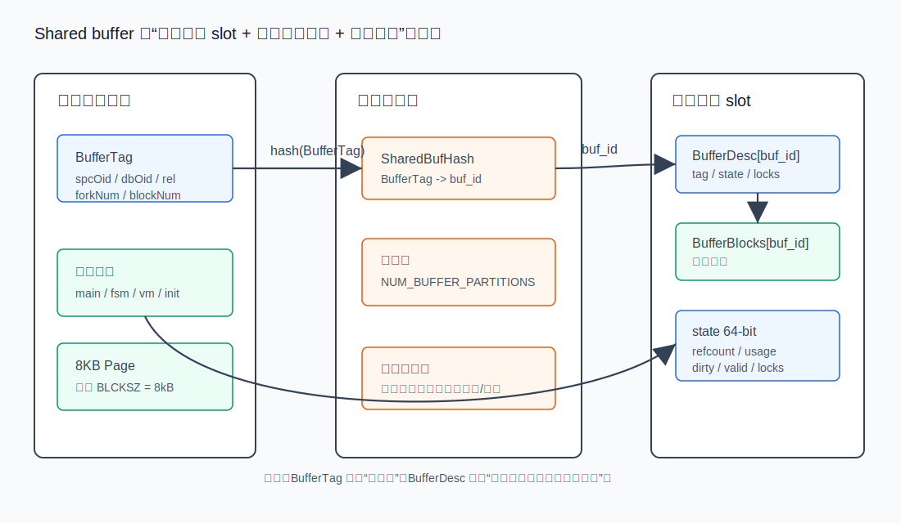
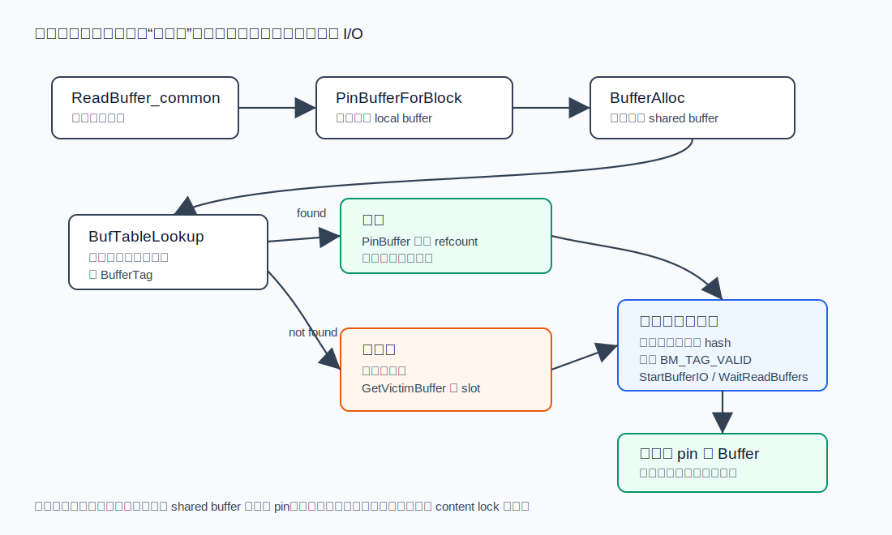
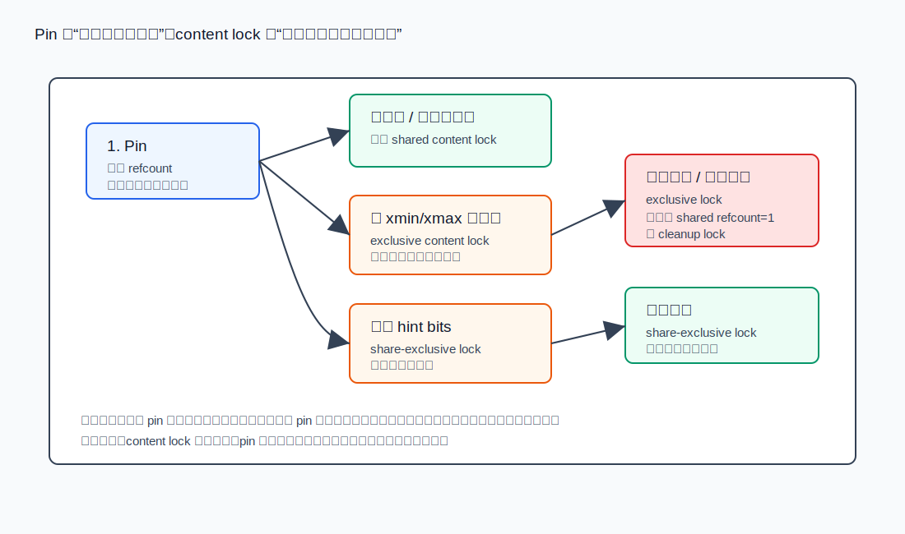
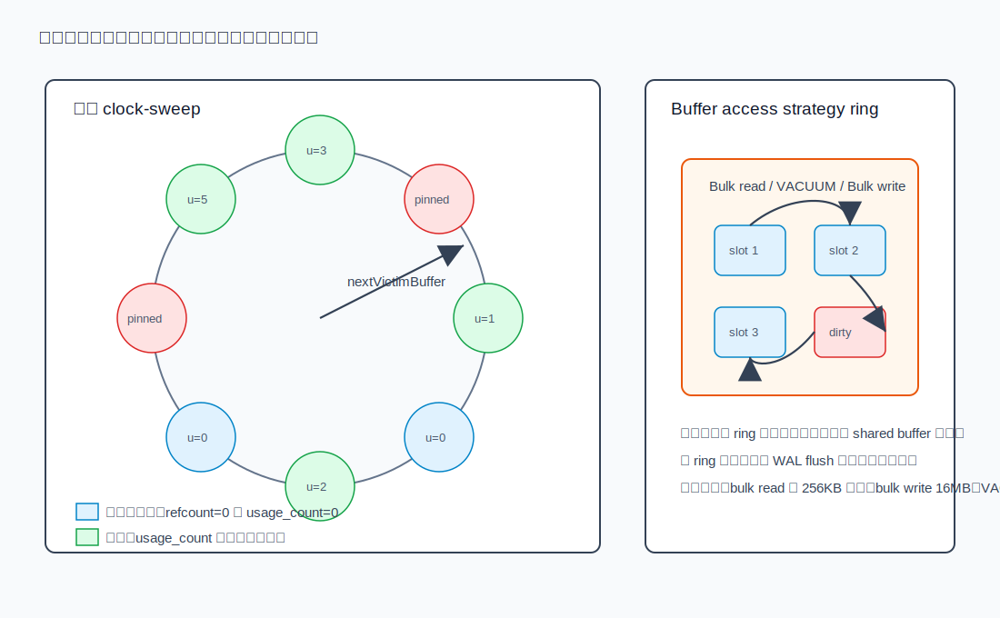
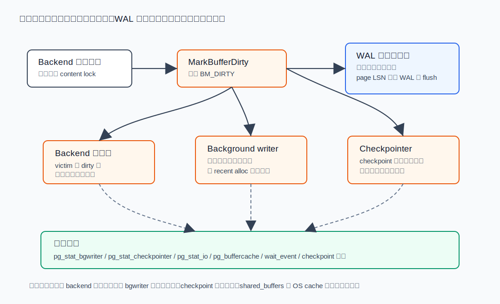

## 数据库筑基课 - shared buffer 管理

### 作者
digoal

### 日期
2026-06-08

### 标签
PostgreSQL , 应用开发者 , 数据库筑基课 , shared_buffers , buffer manager , 存储管理 , 性能诊断    

----

## 背景
  


这篇属于数据库筑基课里的“存储管理 + 维护机制 + 性能诊断”主题。`shared buffer` 不是一个单纯的内存参数，而是 PostgreSQL 把磁盘页面、共享内存、并发访问、WAL 顺序、后台写回和缓存替换连在一起的核心机制。

本地 `markdown/` 目录没有发现独立的“数据库筑基课大纲”文件，所以本文不强行引用不存在的大纲；后续如果项目补充大纲，可以在这里补上课程目录链接。

本文主要基于本地 PostgreSQL 源码和官方文档展开：`src/backend/storage/buffer/README` 说明 shared buffer 的访问规则、内部锁、clock-sweep、buffer ring 和 background writer；`bufmgr.c`、`freelist.c`、`buf_table.c`、`buf_init.c` 和 `buf_internals.h` 对应具体实现。DeepWiki 的 `postgres/postgres` storage management 页面可作为架构索引，但关键结论以源码和官方文档为准。

## 一、它解决什么问题？

数据库访问数据时，真正的问题不是“如何把一个 8KB 页面读进内存”这么简单，而是：

1. 多个 backend 可能同时读同一个页面，不能每个进程都从磁盘读一份。
2. 一个页面被某个 backend 正在扫描时，不能被另一个 backend 换成别的页面。
3. 一个页面被修改后，必须知道它是脏页，并在写回数据文件前保证相应 WAL 已经持久化。
4. 大表顺序扫描、VACUUM、COPY 这类一次性访问不能把 OLTP 热点页全部冲出缓存。
5. checkpoint 和后台写回不能把所有写 I/O 都压到前台查询或某个时刻的尖峰上。

PostgreSQL 的 shared buffer 把这些问题转化为一个受控的共享缓存池：

- 用 `BufferTag` 表示“这个 buffer slot 当前缓存的是哪一个磁盘块”。
- 用 `BufferDesc` 记录 refcount、usage count、dirty、valid、I/O 状态和内容锁状态。
- 用共享 hash 表把 `BufferTag` 映射到 `buf_id`。
- 用 pin 和 content lock 规定页面能不能被替换、能不能读写。
- 用 clock-sweep 和 buffer ring 做替换策略。
- 用 bgwriter、checkpointer、backend 自写共同完成脏页写回。

代价也很明确：shared buffer 越大，共享内存越多，checkpoint 一次可能需要处理的脏页越多；shared buffer 不是越大越好，因为 PostgreSQL 仍依赖操作系统 page cache。官方文档建议专用数据库服务器上可从内存的 25% 起步，并指出超过 40% 通常不一定更好，较大的 `shared_buffers` 往往还需要提高 `max_wal_size` 来摊平大量脏页写回过程，见 `postgres/doc/src/sgml/config.sgml:1785-1819`。

## 二、它是什么？

一句话定义：

> shared buffer 是 PostgreSQL 后端进程共享的一组固定大小 buffer slot，每个 slot 可以缓存一个磁盘 page，并由 buffer manager 负责页面身份映射、并发访问、脏页状态、替换策略和写回协调。

几个核心术语：

| 术语 | 含义 | 源码依据 |
|---|---|---|
| `BufferTag` | 页面身份，包含 tablespace、database、relation、fork、block number | `postgres/src/include/storage/buf_internals.h:150-168` |
| `BufferDesc` | 单个 shared buffer 的元数据，记录 tag、buf_id、state、I/O 等状态 | `postgres/src/include/storage/buf_internals.h:266-326` |
| `BufferBlocks` | 实际页面内容数组，每个 buffer 对应一个 `BLCKSZ` 大小块 | `postgres/src/backend/storage/buffer/buf_init.c:86-90` |
| `SharedBufHash` | `BufferTag -> buffer id` 的共享 hash 表 | `postgres/src/backend/storage/buffer/buf_table.c:27-34` |
| pin / refcount | 持有页面引用，防止 buffer 被替换成别的页面 | `postgres/src/backend/storage/buffer/README:12-26` |
| content lock | 控制页面内容读写的短期锁 | `postgres/src/backend/storage/buffer/README:28-41` |
| `usage_count` | clock-sweep 替换算法里的热度近似 | `postgres/src/backend/storage/buffer/README:175-181` |
| `BM_DIRTY` | 页面内容已改，需要写回 | `postgres/src/include/storage/buf_internals.h:105-123` |



图 1 说明：`BufferTag` 负责页面身份，hash 表负责定位 slot，`BufferDesc` 负责状态，`BufferBlocks` 存放页面内容。应用开发者看到的是 SQL，DBA 看到的是缓存命中率和 I/O，内核里真正承载这些行为的是这组数据结构。

## 三、核心原理

### 3.1 初始化：固定数量的 buffer slot

PostgreSQL 启动时按 `NBuffers` 申请几类共享内存：

- `BufferDescriptors`：每个 shared buffer 一个描述符。
- `BufferBlocks`：实际页面内容，每个 slot 一个 `BLCKSZ` 大小空间。
- `BufferIOCVArray`：每个 buffer 的 I/O 条件变量。
- `CkptBufferIds`：checkpoint 时用于排序待写 buffer id。

这些申请见 `postgres/src/backend/storage/buffer/buf_init.c:74-110`，描述符初始化见 `postgres/src/backend/storage/buffer/buf_init.c:119-140`。

这里的关键点是：shared buffer 数量是启动时确定的。`shared_buffers` 只能在服务器启动时设置，官方文档在 `postgres/doc/src/sgml/config.sgml:1791-1805` 明确说明这一点。

### 3.2 页面读取：先查 hash，miss 再找 victim

普通读取入口最终会进入 `ReadBuffer_common()`。它会判断临时表还是共享表：临时表走 local buffer，共享表走 `BufferAlloc()`，见 `postgres/src/backend/storage/buffer/bufmgr.c:1270-1368`。

共享表读取的核心路径在 `BufferAlloc()`：

1. 根据 relation locator、fork、block number 构造 `BufferTag`。
2. 计算 hash code，找到对应 `BufMappingLock` 分区。
3. 持有共享映射锁查 `SharedBufHash`。
4. 如果命中，pin 对应 buffer，释放映射锁，返回。
5. 如果未命中，释放映射锁，调用 `GetVictimBuffer()` 找可复用 slot。
6. 持有排他映射锁插入新 `BufferTag -> buf_id` 映射。
7. 设置 buffer tag 和 `BM_TAG_VALID`，返回一个已 pin、但内容尚未读入或尚未 valid 的 buffer。

上述流程对应 `postgres/src/backend/storage/buffer/bufmgr.c:2177-2350`。hash 表本身不在 `buf_table.c` 里自己加锁，调用者必须持有对应分区的 `BufMappingLock`，见 `postgres/src/backend/storage/buffer/buf_table.c:1-10` 和 `postgres/src/backend/storage/buffer/buf_table.c:89-154`。



图 2 说明：缓存命中只需要查映射表和 pin；缓存未命中才会进入 victim 选择、hash 改绑和 I/O。注意，命中后返回的 buffer 只是“不会被替换”，调用者要读写页面内容仍需遵守 content lock 规则。

### 3.3 并发规则：pin 和 content lock 是两套东西

`src/backend/storage/buffer/README` 把 shared buffer 访问规则说得非常清楚：

- 必须先 pin buffer，才允许对它做任何事；未 pin 的 buffer 随时可能被回收复用，见 `postgres/src/backend/storage/buffer/README:12-26`。
- buffer content lock 有 shared、share-exclusive、exclusive 三类，锁应短持有，见 `postgres/src/backend/storage/buffer/README:28-41`。
- 扫描页面或检查元组提交状态，需要 pin 加至少 shared lock，见 `postgres/src/backend/storage/buffer/README:45-47`。
- 插入元组或修改 `xmin/xmax`，需要 pin 加 exclusive content lock，见 `postgres/src/backend/storage/buffer/README:58-61`。
- hint bits 这类非关键缓存信息可以用 share-exclusive lock 修改，见 `postgres/src/backend/storage/buffer/README:63-81`。
- 物理删除元组或 compact 页面，需要 exclusive lock，并确认 shared refcount 为 1，也就是没有其他 backend pin 住该页，见 `postgres/src/backend/storage/buffer/README:83-107`。
- 写出 buffer 时需要 share-exclusive lock，避免写出过程中页面被修改导致校验和或 direct I/O 级别的问题，见 `postgres/src/backend/storage/buffer/README:109-111`。



图 3 说明：pin 保护“页面身份不会被换走”，content lock 保护“页面内容如何并发读写”。很多性能和正确性问题都来自把这两者混为一谈：有 pin 不代表可以写页面；没有 pin 的页面指针不能继续使用。

### 3.4 替换策略：clock-sweep 不是严格 LRU

PostgreSQL 默认用 clock-sweep 选择 victim buffer。README 描述的算法是：

1. clock hand 指向下一个候选 buffer。
2. 如果候选 buffer 被 pin，跳过。
3. 如果 `usage_count > 0`，将其减一，跳过。
4. 如果 refcount 为 0 且 usage count 为 0，pin 它并作为 victim 返回。

设计理由是速度和并发。严格 LRU 需要维护全局链表或更重的全局顺序结构，容易形成热点；clock-sweep 用一个小的 `usage_count` 近似热度。`BM_MAX_USAGE_COUNT` 当前定义为 5，源码注释明确说明它是在算法准确性和速度之间的折中：值太大更接近 LRU，但 clock hand 可能要多扫很多圈才能找到可用 buffer，见 `postgres/src/include/storage/buf_internals.h:136-147`。

具体实现位于 `StrategyGetBuffer()`：使用 `ClockSweepTick()` 推进 `nextVictimBuffer`，遇到 pinned buffer 跳过，遇到非零 usage count 就递减，遇到 usage count 为 0 的 unpinned buffer 才 CAS 增加 refcount 并返回，见 `postgres/src/backend/storage/buffer/freelist.c:103-166` 和 `postgres/src/backend/storage/buffer/freelist.c:183-317`。

### 3.5 大扫描：buffer ring 限制缓存污染

如果一个查询只会把大量页面读一遍，例如大表顺序扫描或 VACUUM，使用默认 clock-sweep 会把热缓存冲掉。PostgreSQL 为这类场景提供 `BufferAccessStrategy` ring：

- sequential scan 使用小 ring，README 说明传统值为 256KB，并解释它足够小，可以减轻对 shared buffer 的污染，见 `postgres/src/backend/storage/buffer/README:206-231`。
- VACUUM 也使用 ring，大小受 `vacuum_buffer_usage_limit` 控制，见 `postgres/src/backend/storage/buffer/README:233-238`。
- bulk write 用类似策略，README 说明 COPY IN 和 CTAS 使用 16MB ring，但不超过 `shared_buffers` 的 1/8，见 `postgres/src/backend/storage/buffer/README:240-247`。
- 具体代码在 `GetAccessStrategy()` 与 `GetAccessStrategyWithSize()`，其中 ring buffer 数量还会被 cap 到 `NBuffers / 8`，见 `postgres/src/backend/storage/buffer/freelist.c:420-540`。



图 4 说明：默认策略让热点页通过 `usage_count` 获得多次机会；ring 策略让一次性大扫描尽量在一小圈 buffer 内循环。这样 OLTP 热点页不会轻易被批处理冲掉。

### 3.6 脏页写回：backend、bgwriter、checkpointer 三方协作

页面修改后会通过 `MarkBufferDirty()` 设置脏标记，函数入口见 `postgres/src/backend/storage/buffer/bufmgr.c:3147-3156`，`BM_DIRTY` 标志定义见 `postgres/src/include/storage/buf_internals.h:105-123`。

脏页写回有三条主要路径：

1. **前台 backend 自己写**：当 backend 需要复用一个 dirty victim 时，`GetVictimBuffer()` 会先尝试拿 share-exclusive content lock，必要时 `FlushBuffer()` 写出页面，再继续复用。相关逻辑见 `postgres/src/backend/storage/buffer/bufmgr.c:2547-2639`。
2. **background writer 预写**：bgwriter 的目标是提前写出“可能快被复用”的脏页，把写 I/O 从前台 backend 转移出去。README 对它的策略有专门说明，见 `postgres/src/backend/storage/buffer/README:250-277`。官方参数文档说明 `bgwriter_delay`、`bgwriter_lru_maxpages`、`bgwriter_lru_multiplier` 和 `bgwriter_flush_after` 的行为，见 `postgres/doc/src/sgml/config.sgml:2666-2781`。
3. **checkpointer 写 checkpoint**：checkpoint 时需要把所有脏数据页刷到磁盘并写 checkpoint WAL record，崩溃恢复从最新 checkpoint 的 redo record 开始，见 `postgres/doc/src/sgml/wal.sgml:611-626`。官方文档也说明 checkpoint I/O 会被摊到一个时间窗口内，以减少尖峰，见 `postgres/doc/src/sgml/wal.sgml:628-633` 和 `postgres/doc/src/sgml/wal.sgml:686-717`。

写脏页还要受 WAL 顺序约束：如果页面 LSN 对应的 WAL 还没 flush，数据页不能先落盘。`GetVictimBuffer()` 在 ring 策略下会检查 `XLogNeedsFlush(BufferGetLSN(...))`，必要时拒绝这个 dirty victim 或进行 WAL flush，见 `postgres/src/backend/storage/buffer/bufmgr.c:2613-2631`。



图 5 说明：事务提交通常要求 WAL 达到持久化边界，而数据页可以稍后由 backend、bgwriter 或 checkpointer 写回。排障时不能只看“脏页多不多”，还要看脏页是谁在写、何时写、是否被 checkpoint 或 WAL flush 放大成延迟尖峰。

## 四、横向对比

| 维度 | PostgreSQL shared buffer | 操作系统 page cache | 应用侧缓存 |
|---|---|---|---|
| 主要目标 | 数据库页面共享缓存、并发控制、脏页管理 | 文件系统级缓存块 | 缓存业务对象或查询结果 |
| 页面身份 | `BufferTag` 精确到 relation fork block | 文件 inode 和 offset | 业务 key |
| 并发语义 | pin、content lock、I/O 状态、MVCC 访问规则 | 不理解数据库元组和事务 | 由应用自己定义 |
| 脏页顺序 | 受 WAL 先写规则约束 | 不知道数据库 WAL 依赖 | 通常不参与数据文件恢复 |
| 替换策略 | clock-sweep + usage_count + ring strategy | OS 自身 LRU/变体 | 业务自定义 |
| 观测方式 | `pg_stat_io`、`pg_stat_bgwriter`、`pg_stat_checkpointer`、`pg_buffercache` | OS 工具、文件系统指标 | 应用 metrics |
| 适合解决 | 数据库页面复用、热页保护、写回协调 | 跨进程文件缓存、预读、回写 | 减少 SQL 调用或计算 |
| 不适合解决 | 缓存最终业务结果、跨实例共享缓存 | 判断元组可见性和 WAL 顺序 | 替代数据库一致性机制 |

shared buffer 和 OS page cache 不是二选一。PostgreSQL 官方文档明确说它也依赖操作系统缓存，因此 `shared_buffers` 过大未必更好，见 `postgres/doc/src/sgml/config.sgml:1807-1819`。一个实际可用的理解是：

- shared buffer 负责数据库语义：页面身份、并发访问、脏页、WAL 顺序、checkpoint。
- OS page cache 负责文件系统语义：磁盘块缓存、预读、写回、设备队列。
- 应用缓存负责业务语义：对象、权限、聚合结果、幂等 token、页面片段。

## 五、效果如何？

shared buffer 的收益：

1. **减少物理读**：热点页面被多个 backend 共享，命中后不用重新从磁盘读取。
2. **控制并发正确性**：pin 防止页面被换走，content lock 防止半更新状态被读到。
3. **摊平写 I/O**：bgwriter 和 checkpointer 将写回从前台路径中尽量剥离。
4. **保护热点缓存**：clock-sweep 给热页多次机会，buffer ring 限制大扫描污染。
5. **支持恢复语义**：脏页写回和 WAL flush 顺序协调，保证崩溃恢复可以重放。

它的成本：

1. **双重缓存**：同一数据可能同时在 shared buffer 和 OS page cache 中。
2. **共享结构竞争**：热点 hash 分区、buffer content lock、I/O 等待都可能形成瓶颈。
3. **checkpoint 压力**：shared buffer 越大，单个 checkpoint 周期内可能累积的脏页越多。
4. **不等于无限缓存**：工作集大于 shared buffer 时，替换策略只能降低损害，不能消灭 I/O。
5. **参数联动**：调 `shared_buffers` 常常要同步看 `max_wal_size`、checkpoint、bgwriter、I/O 并发和 OS cache。

不要编造一个“命中率 99% 就一定好”的规则。一个 OLTP 系统即使命中率很高，也可能被 checkpoint 写回、WAL flush、buffer content lock 或热点页面争用拖慢；一个分析型查询命中率低，也可能因为顺序读和 OS page cache 表现稳定而可接受。

## 六、实操 DEMO

以下示例用于验证思路。本文没有在当前机器上启动 PostgreSQL 实例执行这些 SQL，因此不提供伪造输出。读者可以在自己的测试实例中执行。

### 6.1 查看 shared buffer 参数

```sql
SHOW shared_buffers;
SHOW max_wal_size;
SHOW checkpoint_timeout;
SHOW checkpoint_completion_target;
```

验证点：

- `shared_buffers` 是启动参数，修改后需要重启。
- 如果显著增大 `shared_buffers`，同时观察 checkpoint 是否更频繁或更重。

### 6.2 使用 pg_buffercache 观察缓存构成

`pg_buffercache` 官方文档说明该模块可以实时检查 shared buffer cache 状态，见 `postgres/doc/src/sgml/pgbuffercache.sgml:3-13`。

```sql
CREATE EXTENSION IF NOT EXISTS pg_buffercache;

SELECT
  c.relname,
  count(*) AS buffers,
  count(*) FILTER (WHERE b.isdirty) AS dirty_buffers,
  round(100.0 * count(*) / sum(count(*)) OVER (), 2) AS pct
FROM pg_buffercache b
LEFT JOIN pg_class c ON b.relfilenode = pg_relation_filenode(c.oid)
WHERE b.reldatabase IN (0, (SELECT oid FROM pg_database WHERE datname = current_database()))
GROUP BY c.relname
ORDER BY buffers DESC
LIMIT 20;
```

验证点：

- 哪些 relation 占用了最多 shared buffer。
- 脏页是否集中在少数表或索引。
- 大扫描后热点表缓存是否被明显挤出。

### 6.3 观察后台写回和 checkpoint

```sql
SELECT * FROM pg_stat_bgwriter;
SELECT * FROM pg_stat_checkpointer;

SELECT *
FROM pg_stat_io
WHERE backend_type IN ('client backend', 'background writer', 'checkpointer')
ORDER BY backend_type, object, context;
```

验证点：

- 如果前台 backend 写很多 dirty victim，用户查询延迟可能抖动。
- 如果 checkpoint 写入周期过密，考虑 `max_wal_size`、`checkpoint_timeout`、写入峰值和磁盘能力。
- 如果 bgwriter 太保守，前台写会变多；如果太激进，可能产生重复写。

### 6.4 观察等待事件

```sql
SELECT
  wait_event_type,
  wait_event,
  count(*)
FROM pg_stat_activity
WHERE wait_event IS NOT NULL
GROUP BY wait_event_type, wait_event
ORDER BY count(*) DESC;
```

验证点：

- 出现 buffer I/O、buffer pin、LWLock buffer mapping、contention 相关等待时，要回到 workload、访问路径和缓存替换行为分析。
- 不要只用 `shared_buffers` 一个参数解释所有 I/O 等待。

## 七、最佳实践

### 面向数据库架构师

1. 把 shared buffer 当作“数据库页面一致性与性能边界”，不是普通 cache。
2. 设计 workload 时区分热点 OLTP、批量读、批量写、VACUUM 和建索引任务，避免高峰期让大扫描冲击热点缓存。
3. 给批处理设窗口，结合 `pg_stat_io`、checkpoint 日志和业务延迟看 I/O 放大。
4. 对读多写少系统，关注热点表/索引是否稳定驻留；对写多系统，关注 dirty buffer 写回和 checkpoint 周期。

### 面向 DBA

1. `shared_buffers` 从合理值开始，不盲目拉满内存；官方文档给出的 25% 起步和“不太可能超过 40% 更好”的边界值得保留为经验下限，而不是绝对公式。
2. 调大 `shared_buffers` 后同步观察 `max_wal_size`、checkpoint 频率、checkpoint 写时长、后台写和前台写比例。
3. 开启并分析 checkpoint 日志，配合 `pg_stat_bgwriter`、`pg_stat_checkpointer`、`pg_stat_io` 判断写回压力。
4. 用 `pg_buffercache` 做抽样诊断，不把它当长期高频监控；实时扫描 buffer cache 本身也有成本。
5. 对大表顺序扫描、VACUUM、COPY，理解 buffer ring 的保护作用，但不要以为它能消除全部 I/O 或 WAL flush。

### 面向业务开发者

1. 避免在高峰期发起无条件大表扫描；分页、批处理、归档和报表查询要有访问边界。
2. 热点表的索引设计会直接影响 buffer 访问模式：索引过多会放大写入脏页，索引不足会放大读页面数量。
3. 长事务会拖累 VACUUM 清理和页面复用，间接影响 shared buffer 中死元组和脏页行为。
4. 批量写入要用 COPY、分批提交、合适的索引维护策略和维护窗口，不要把大量单行事务推给 buffer manager 和 WAL。

## 八、适合与不适合场景

适合重点优化 shared buffer 的场景：

- OLTP 热点表和热点索引反复访问，物理读或 buffer mapping 争用影响延迟。
- 写多系统出现前台 backend 写 dirty victim，用户查询延迟抖动。
- checkpoint 周期内 dirty page 写回形成 I/O 尖峰。
- VACUUM、COPY、报表大扫描与在线业务共享实例，需要控制缓存污染。
- 扩展或内核开发需要理解页面 pin、content lock 和 buffer 生命周期。

不适合把问题简单归因于 shared buffer 的场景：

- SQL 本身缺索引或执行计划错误，导致读取页面数量巨大。
- 业务层重复查询同一复杂结果，本应使用应用缓存或物化结果。
- 数据集远大于内存，且访问近似随机，单纯加 shared buffer 不能改变物理规律。
- 存储设备写延迟高、WAL flush 慢，瓶颈在持久化路径而不是页面缓存。
- 操作系统 page cache、文件系统、云盘限流或 cgroup 限制才是真正瓶颈。

## 九、常见坑

1. **把 shared buffer 当成越大越好的缓存。** 它会挤压 OS page cache，还可能增加 checkpoint 写回压力。
2. **只看 cache hit ratio。** 命中率高不代表没有锁等待、checkpoint 抖动或 WAL flush 抖动。
3. **忽略大扫描污染。** 大查询虽然有 ring 保护，但并不意味着可以任意在高峰期全表扫。
4. **混淆 pin 和 lock。** pin 只是防替换；读写页面内容需要合适 content lock。
5. **误解 dirty page。** 事务提交通常不等于数据页立刻落盘；WAL 保证可恢复，数据页后续写回。
6. **调大 shared_buffers 却不调 WAL/checkpoint。** 官方文档明确提醒较大 shared buffer 通常需要相应提高 `max_wal_size` 来摊平写回。
7. **用 pg_buffercache 高频采样。** 它适合诊断，不适合无限高频扫全缓存。
8. **把应用缓存和 shared buffer 混为一谈。** shared buffer 缓存的是页面，不是业务对象、接口结果或权限判断。

## 十、扩展问题

1. 为什么 PostgreSQL 选择 clock-sweep 而不是严格 LRU？在 NUMA、大核数和高并发下，两者的锁竞争差异是什么？
2. 如果一个系统前台 backend 写 dirty buffer 很多，是应该先调大 `shared_buffers`，还是先看 bgwriter、checkpoint 和 WAL flush？
3. 为什么大表顺序扫描要使用 buffer ring？如果没有 ring，OLTP 热点缓存会发生什么？
4. shared buffer 和 OS page cache 都缓存数据页，为什么数据库仍然需要自己的 buffer manager？
5. 如果 checkpoint 变少会降低写回频率，为什么又会增加崩溃恢复时间和 WAL 保留压力？
6. 在云盘 IOPS/吞吐受限环境下，shared buffer、WAL、checkpoint、bgwriter 应该怎样一起观测？

## 十一、扩展阅读

- `postgres/src/backend/storage/buffer/README`：shared buffer 访问规则、内部锁、clock-sweep、ring strategy、background writer。
- `postgres/src/backend/storage/buffer/bufmgr.c`：`ReadBuffer_common()`、`BufferAlloc()`、`GetVictimBuffer()`、`MarkBufferDirty()`、`FlushBuffer()` 等核心路径。
- `postgres/src/backend/storage/buffer/freelist.c`：clock-sweep、`BufferAccessStrategy` ring 和 bgwriter 通知。
- `postgres/src/backend/storage/buffer/buf_table.c`：`BufferTag -> buf_id` 共享 hash 表。
- `postgres/src/include/storage/buf_internals.h`：`BufferTag`、`BufferDesc`、buffer state 位布局、`BM_DIRTY`、`BM_VALID`、`BM_IO_IN_PROGRESS` 等定义。
- `postgres/src/backend/storage/buffer/buf_init.c`：shared buffer 共享内存申请和初始化。
- `postgres/doc/src/sgml/config.sgml`：`shared_buffers`、bgwriter、checkpoint 相关参数。
- `postgres/doc/src/sgml/wal.sgml`：checkpoint、WAL、full page write 与恢复边界。
- `postgres/doc/src/sgml/pgbuffercache.sgml`：`pg_buffercache` 诊断模块。
- DeepWiki: `https://deepwiki.com/postgres/postgres/2.3-storage-management`，可作为 PostgreSQL storage management 架构索引；本文未将其作为关键实现细节的唯一依据。
  
## 附录 
1、克隆代码  
```  
git clone --depth 1 https://github.com/postgres/postgres
```  
  
2、启用 codex, 使用 [数据库筑基课 skill](../skills/README.md).  
```
文章标题: 
  数据库筑基课 - shared buffer 管理
项目源码(本地目录): 
  postgres
项目 codebase 文件名: 
  postgres/CLAUDE.md 
开源项目相关的 deepwiki repoName: 
  postgres/postgres
``` 
    
#### [PostgreSQL 解决方案集合](../201706/20170601_02.md "40cff096e9ed7122c512b35d8561d9c8")
  
  
#### [德哥 / digoal's Github - 公益是一辈子的事.](https://github.com/digoal/blog/blob/master/README.md "22709685feb7cab07d30f30387f0a9ae")
  
  
#### [About 德哥](https://github.com/digoal/blog/blob/master/me/readme.md "a37735981e7704886ffd590565582dd0")
  
  

  
