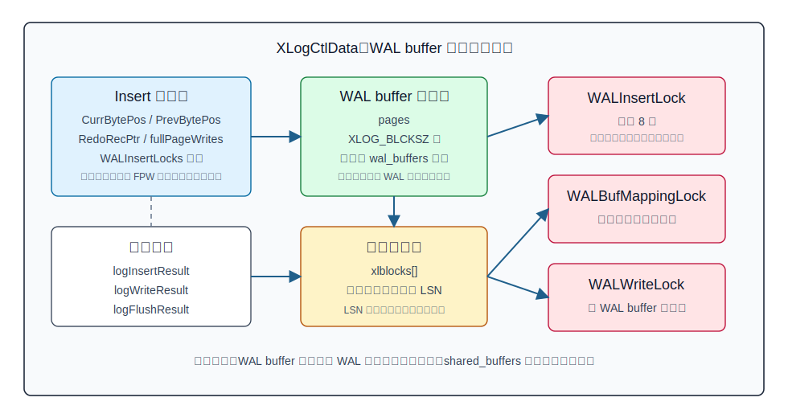
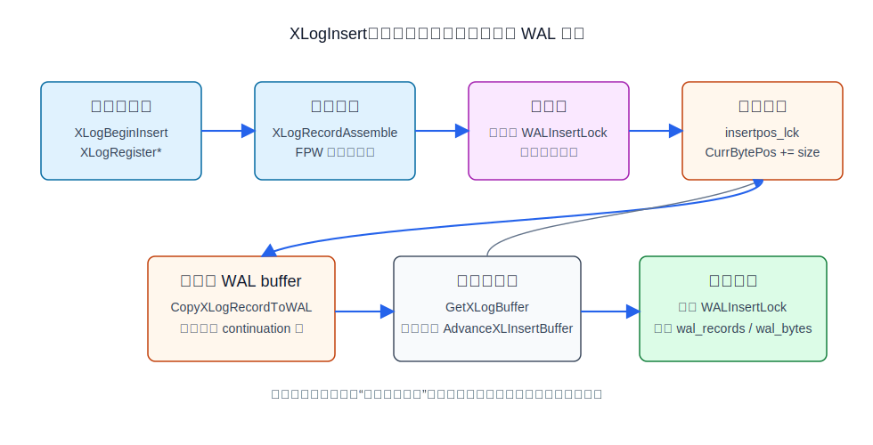
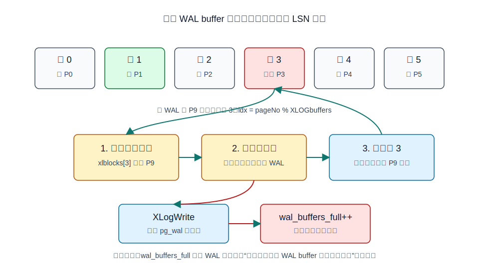
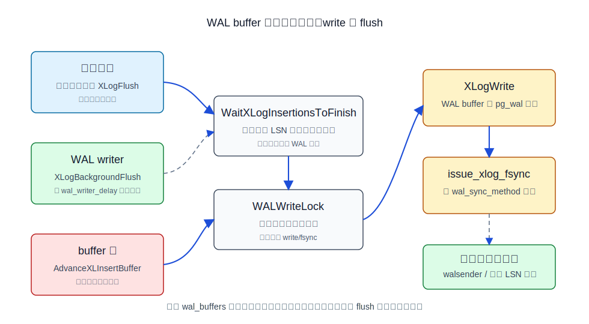
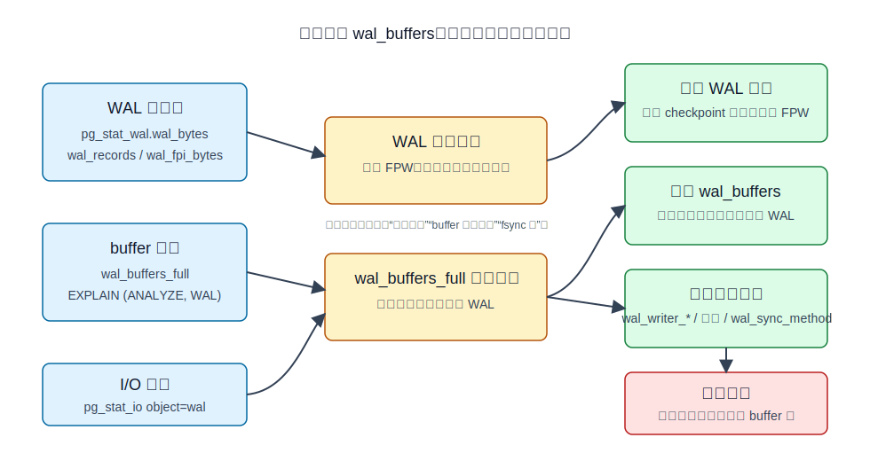

## 数据库筑基课 - wal buffer 管理

### 作者
digoal

### 日期
2026-06-08

### 标签
PostgreSQL , 应用开发者 , 数据库筑基课 , WAL , wal_buffers , 共享内存 , 写入路径 , 可靠性    

----

## 背景
  


本文属于数据库筑基课里的“维护机制 + 写入路径”主题。`wal buffer` 不是一个孤立参数，而是 PostgreSQL 把“业务修改”变成“崩溃后可恢复事实”的关键中转站。

本地 `markdown/` 目录没有发现独立的“数据库筑基课大纲”文件，所以本文不强行引用不存在的大纲；后续如果项目补充大纲，可以在这里补上课程目录链接。

先从一个生产现象切入：

业务做批量导入或热点更新时，TPS 看起来没有完全打满 CPU，磁盘也没有持续满带宽，但某些前台事务的延迟突然抖动。监控里 `pg_stat_wal.wal_buffers_full` 在增长，`EXPLAIN (ANALYZE, WAL)` 或 `pg_stat_statements` 也能看到部分 SQL 的 `wal_buffers_full` 非零。很多人第一反应是“调大 `wal_buffers`”，但这只回答了一小半问题。

更准确的问题应该是：

- WAL 记录是怎样从后端私有内存进入共享 WAL buffer 的？
- `wal_buffers` 控制的是多少共享内存，还是多少 WAL 文件？
- 什么情况下前台插入 WAL 的路径会被迫自己写 WAL？
- 提交刷盘、WAL writer、WAL buffer 满写出三条路径有什么区别？
- `wal_buffers_full` 到底说明什么，不能说明什么？

本文以用户提供的本地 PostgreSQL 源码目录 `postgres` 为事实依据，并使用 DeepWiki repoName `postgres/postgres` 做架构导航。DeepWiki 查询结果用于确认 WAL buffer 的模块边界；重要结论均回到本地源码和官方 SGML 文档验证。

## 一、它解决什么问题？

WAL 的基本规则是“先写日志，再写数据页”。`src/backend/access/transam/xlog.c` 里 `XLogInsertRecord()` 的注释说明，返回的 LSN 可以写到受影响的数据页上；数据页写出前，WAL 必须至少刷到这个 LSN，这就是 write-ahead 规则。

如果每一次行修改都直接写 WAL 文件并立刻刷盘，系统会被小随机 I/O 和高频 fsync 拖垮。PostgreSQL 因此把 WAL 写入拆成几个阶段：

1. 在后端私有内存中组装 WAL record。
2. 在共享 WAL buffer 中预留连续 LSN 空间。
3. 把 WAL record 复制到共享 WAL buffer。
4. 后续由提交、WAL writer、buffer 满或 segment 切换等路径写到 `pg_wal` 文件。
5. 在需要持久性保证时，再把 WAL 文件刷到稳定存储。

`wal buffer` 解决的是第 2 到第 4 步之间的缓冲和并发协调问题。它让多个后端可以并发构造和复制 WAL 记录，把昂贵的文件写出和 fsync 尽量从每条低层修改的关键路径中移走。

它牺牲的是共享内存和管理复杂度。WAL buffer 太小，高 WAL 速率下可能被快速写满，前台插入者不得不自己写出旧 WAL 页；WAL buffer 太大，也不会消除提交时的持久化要求，因为同步提交仍然要确保 commit record 刷到磁盘。

## 二、它是什么？

`wal_buffers` 是 PostgreSQL 分配给“尚未写入磁盘的 WAL 数据”的共享内存大小。官方文档 `doc/src/sgml/config.sgml` 对它的定义有几个关键点：

- 默认值 `-1` 表示自动选择。
- 自动值约等于 `shared_buffers` 的 `1/32`，也就是约 3%。
- 自动值不低于 `64kB`，不高于一个 WAL segment，典型是 `16MB`。
- 如果手工设置小于 `32kB` 的正值，会按 `32kB` 处理。
- 不带单位时，单位是 WAL block，也就是 `XLOG_BLCKSZ`，典型为 `8kB`。
- 只能在服务器启动时设置。

源码里，`src/backend/access/transam/xlog.c` 的全局变量 `XLOGbuffers` 保存最终块数。`XLOGChooseNumBuffers()` 用 `NBuffers / 32` 做自动值，上限为 `wal_segment_size / XLOG_BLCKSZ`，下限为 8 个 WAL block。`check_wal_buffers()` 负责 GUC 检查和最小值钳制。`XLOGShmemRequest()` 按 `XLOGbuffers` 计算共享内存大小，`XLOGShmemInit()` 初始化 WAL buffer 的页数组、页身份数组和 WAL insertion locks。

要把它和几个相邻概念分开：

| 概念 | 缓冲对象 | 位置 | 主要作用 |
|---|---|---|---|
| `shared_buffers` | 表和索引的数据页 | PostgreSQL 共享内存 | 缓存数据访问，承载脏页 |
| `wal_buffers` | WAL 页 | PostgreSQL 共享内存 | 缓冲尚未写出的 WAL 数据 |
| OS page cache | 文件页 | 操作系统内存 | 缓存文件系统读写 |
| `pg_wal` 文件 | WAL segment | 数据目录下的文件 | 崩溃恢复、复制、归档的持久日志 |

所以，`wal_buffers` 不是 `pg_wal` 目录大小，也不是 checkpoint 后保留多少 WAL segment；它只是共享内存里一段用于 WAL 写入路径的环形页缓存。

## 三、核心原理

### 3.1 共享内存布局：控制区、页数组和三类锁

`src/backend/access/transam/xlog.c` 中的 `XLogCtlData` 是 WAL 管理的共享控制区。和 WAL buffer 管理最相关的字段包括：

- `Insert.CurrBytePos`、`Insert.PrevBytePos`：当前已预留 WAL 的尾部和上一条记录起点，以“可用字节位置”表示。
- `Insert.RedoRecPtr`、`Insert.fullPageWrites`、`Insert.runningBackups`：决定是否需要 full-page image 的共享状态。
- `Insert.WALInsertLocks`：固定数量的 WAL insertion lock，当前源码中 `NUM_XLOGINSERT_LOCKS` 为 8。
- `pages`：真正存放 WAL 页内容的共享内存数组，每页大小为 `XLOG_BLCKSZ`。
- `xlblocks[]`：每个 buffer 槽当前装载的 WAL 页身份，保存该页结束位置。
- `InitializedUpTo`：已初始化到哪个 WAL 位置。
- `logInsertResult`、`logWriteResult`、`logFlushResult`：分别表示已插入 buffer、已写到文件、已刷盘的 WAL 位置。



图 1 说明：WAL buffer 是 `XLogCtlData` 管理的一组共享内存页。插入路径主要碰 `Insert` 子结构和 WAL insertion locks；页复用需要 `WALBufMappingLock`；写出和刷盘需要 `WALWriteLock`。这套设计的目标是缩短全局串行段，让多个后端尽量并行复制 WAL 记录。

三类锁的边界要记牢：

| 锁 | 保护什么 | 典型持有者 | 为什么需要 |
|---|---|---|---|
| `WALInsertLock` | 正在插入的 WAL record 进度，兼顾保护 `RedoRecPtr/fullPageWrites` | 生成 WAL 的后端 | 允许多个插入者并行，又让写出者知道哪些 LSN 之前已经完成 |
| `WALBufMappingLock` | WAL buffer 槽位和 WAL 页身份的映射 | 初始化或复用 WAL 页的后端/WAL writer | 防止一个槽位同时被当成两个 WAL 页 |
| `WALWriteLock` | WAL buffer 写到 WAL 文件、刷盘进度 | 提交者、WAL writer、buffer 满写出者 | 避免多个进程重复写同一段 WAL 或互相打乱写出结果 |

### 3.2 插入路径：先预留位置，再并行复制

一般资源管理器不会直接调用 `XLogInsertRecord()`。它们在 `src/backend/access/transam/xloginsert.c` 里按以下流程构造记录：

```text
XLogBeginInsert()
  -> XLogRegisterBuffer() / XLogRegisterData() / XLogRegisterBufData()
  -> XLogInsert()
  -> XLogRecordAssemble()
  -> XLogInsertRecord()
```

`XLogInsertRecord()` 的源码注释把共享 WAL buffer 插入拆成两步：

1. 预留所需 WAL 空间。当前预留尾部保存在 `Insert->CurrBytePos`，由 `insertpos_lck` 这个自旋锁保护。
2. 把记录复制到预留的 WAL 空间。多个后端可以并发做这一步；如果目标 WAL 页还没初始化，才需要拿 `WALBufMappingLock`。

这个设计很关键。真正全局串行的部分不是整条 WAL 记录的构造和复制，而是 `ReserveXLogInsertLocation()` 中短暂更新 `CurrBytePos/PrevBytePos` 的区域。它把 `CurrBytePos` 设计成不含 WAL page header 的“可用字节位置”，这样预留 `X` 字节几乎就是一次 `CurrBytePos += X`。物理 LSN 转换可以放在锁外完成。



图 2 说明：后端先在私有内存里组装 WAL record，再拿一把 `WALInsertLock`，短暂进入 `insertpos_lck` 预留 LSN，随后把记录复制到 WAL buffer。跨 WAL 页时，`CopyXLogRecordToWAL()` 会在下一页设置 continuation 信息。插入完成后释放 insertion lock，并更新 WAL 统计。

这里还有一个和 full-page writes 有关的重试机制。`xloginsert.c` 先根据本地看到的 `RedoRecPtr/doPageWrites` 组装 WAL record；`xlog.c` 在拿到 insertion lock 后会重新检查共享 `RedoRecPtr/fullPageWrites/runningBackups`。如果 checkpoint 刚推进导致某些页现在必须写 full-page image，而刚才组装时没包含，`XLogInsertRecord()` 会返回 `InvalidXLogRecPtr`，让上层重新组装记录。

### 3.3 WAL 页：固定大小、页头和跨页记录

WAL 文件不是一条条记录直接顺序拼接成裸字节流，而是按 `XLOG_BLCKSZ` 切成页。`src/include/access/xlog_internal.h` 定义了 WAL page header：

- `xlp_magic`：WAL 页版本/正确性检查。
- `xlp_info`：页标志，例如 `XLP_LONG_HEADER`、`XLP_FIRST_IS_CONTRECORD`。
- `xlp_tli`：时间线 ID。
- `xlp_pageaddr`：该 WAL 页的起始地址。
- `xlp_rem_len`：当前页第一段是上一页记录延续时，剩余记录长度。

每个 WAL segment 第一页使用 long page header，包含 `system_identifier`、segment size、`XLOG_BLCKSZ` 等额外校验信息。`AdvanceXLInsertBuffer()` 初始化新 WAL 页时会填这些字段；`CopyXLogRecordToWAL()` 复制记录时，如果记录跨页，会设置下一页的 `xlp_rem_len` 和 `XLP_FIRST_IS_CONTRECORD`。

这解释了为什么源码中有“可用字节位置”和物理 LSN 的相互转换：记录预留时需要忽略 page header，实际写入时又必须把页头空出来。

### 3.4 环形映射：LSN 决定槽位，旧页未写出就不能复用

WAL buffer 是有限数量的共享内存页。PostgreSQL 不是任意找空槽，而是用 LSN 计算固定槽位：

```c
#define XLogRecPtrToBufIdx(recptr) \
  (((recptr) / XLOG_BLCKSZ) % (XLogCtl->XLogCacheBlck + 1))
```

这意味着某个 WAL 页天然应该进入某个 buffer 槽。槽位当前装载的是哪个 WAL 页，由 `xlblocks[idx]` 记录。`GetXLogBuffer()` 根据目标 LSN 找槽位；如果槽位不是目标页，就调用 `AdvanceXLInsertBuffer()` 初始化或复用。

复用有一个硬条件：旧 WAL 页如果还没有写到 WAL 文件，不能直接覆盖。`AdvanceXLInsertBuffer()` 会检查 `LogwrtResult.Write < OldPageRqstPtr`。如果旧页未写出：

1. 更新共享写请求。
2. 释放 `WALBufMappingLock`，避免死锁。
3. 调用 `WaitXLogInsertionsToFinish(OldPageRqstPtr)`，确保旧页相关插入完成。
4. 拿 `WALWriteLock`。
5. 调用 `XLogWrite()` 写出旧页。
6. 增加 `pgWalUsage.wal_buffers_full`。
7. 重新拿 `WALBufMappingLock`，再初始化新页。



图 3 说明：WAL buffer 槽位通过 WAL 页号取模复用。新页需要使用某个槽位时，如果旧页尚未写出，前台插入者会被迫先写 WAL 文件，然后才能复用槽位。`wal_buffers_full` 记录的就是这种“因为 WAL buffers 满而触发写出”的次数。

这个指标的含义要精确：它不是 WAL 生成字节数，也不是 fsync 次数，而是前台 WAL 插入路径被 buffer 周转拖住的信号。它增长快，通常说明 WAL 生成速率高、写出跟不上、`wal_buffers` 太小，或 checkpoint 后 full-page image 峰值让短时间 WAL 量放大。

### 3.5 写出与刷盘：write 不是 flush

WAL buffer 进入 `pg_wal` 文件有两个层次：

- write：`XLogWrite()` 把 WAL buffer 写到 WAL segment 文件；在 `fdatasync/fsync/fsync_writethrough` 等方法下，这一步通常只是进入内核缓存。
- flush/fsync：`issue_xlog_fsync()` 要求内核把 WAL 文件同步到稳定存储；在 `open_sync/open_datasync` 方法下，write 本身带同步语义，fsync 函数可能不做额外工作。

官方文档 `doc/src/sgml/wal.sgml` 明确说，`XLogWrite()` 通常由三类路径调用：

- `XLogInsertRecord()`：当 WAL buffers 没有空间容纳新记录时。
- `XLogFlush()`：提交或其他需要保证 WAL 持久化的位置。
- WAL writer：后台周期性写出和刷出 WAL。

`XLogFlush(record)` 是同步提交路径的核心。它会先看目标 LSN 是否已经刷盘；如果没有，就在写出前调用 `WaitXLogInsertionsToFinish()`，确保目标范围内所有并发插入已经复制到 WAL buffer。然后尝试拿 `WALWriteLock`。如果锁被别人持有，它会等待锁释放并重新检查，也许别人已经帮它刷到目标 LSN。这就是组提交能发生的基础。

`commit_delay` 的作用点也在这里。`XLogFlush()` 拿到 `WALWriteLock` 后，在满足 `enableFsync` 和 `commit_siblings` 条件时，可以短暂睡眠，让其他后端把 commit record 也放进 WAL buffer，随后一起 fsync。代价是增加当前事务提交延迟。



图 4 说明：同步提交、WAL writer、buffer 满写出都会通向 `XLogWrite()`，但目标不同。同步提交关心 commit LSN 是否刷盘；WAL writer 尽量让后台承担写出和异步提交持久化；buffer 满写出是前台插入路径的被动补救。调大 `wal_buffers` 主要减少第三条路径，不会取消第一条路径。

### 3.6 WAL writer：降低前台写出概率，不是可靠性的唯一来源

`src/backend/postmaster/walwriter.c` 的文件头说明，WAL writer 的目标是让普通后端尽量不用写出和 fsync WAL 页，并保证异步提交事务在可知时间内落盘。它不是必不可少的唯一写出者；普通后端仍然可以在 WAL writer 跟不上时自己写 WAL。

`XLogBackgroundFlush()` 的逻辑是：

- 读取共享 `LogwrtRqst`。
- 通常退到完整 WAL 页边界写出。
- 如果没有完整页要写，再考虑异步提交 LSN。
- 按 `wal_writer_delay` 和 `wal_writer_flush_after` 决定是否 flush。
- 写完后，调用 `AdvanceXLInsertBuffer(..., opportunistic=true)`，尽量预初始化已经不再需要的 WAL buffer 页，降低前台插入时初始化页的概率。

所以，WAL writer 对 WAL buffer 管理有两个帮助：

1. 提前写出 WAL 页，减少旧页阻塞槽位复用。
2. 机会性初始化未来 WAL 页，降低插入关键路径上的页初始化工作。

但它不能替代同步提交。`synchronous_commit=on` 的事务仍需要自己的 commit record 满足本地刷盘要求；WAL writer 只是在很多情况下已经提前做了一部分工作。

### 3.7 初始化与自动调参：为什么默认通常够用

`XLOGShmemRequest()` 在共享内存阶段如果发现 `XLOGbuffers == -1`，会调用 `XLOGChooseNumBuffers()`，把 `wal_buffers` 设置为自动值。源码注释给出设计理由：推荐值约为 `shared_buffers` 的 3%，上限一个 WAL segment，因为只要 segment 切换仍强制 fsync，就很少有理由认为超过一个 segment 会继续有明显帮助；下限 8 个 WAL block，是历史默认值。

文档也提醒：WAL buffers 会在每次事务提交时被写出到磁盘，所以极大值不太可能带来显著收益；但在很多客户端同时提交、WAL 量很高的繁忙服务器上，至少几 MB 的 WAL buffers 可以改善写入性能。默认自动调参在多数场景下合理。

这个结论的工程含义是：`wal_buffers` 不是越大越好。它主要解决“WAL buffer 周转空间不够导致插入路径被迫写出”的问题。如果真正瓶颈是 fsync 延迟、同步复制确认、WAL 生成量过大、磁盘带宽不足或 checkpoint 频率过高，只调 `wal_buffers` 会误治。

## 四、横向对比

| 维度 | WAL buffer | shared_buffers | OS page cache | WAL segment 文件 |
|---|---|---|---|---|
| 主要目标 | 缓冲尚未写出的 WAL 页 | 缓存表和索引数据页 | 缓存文件系统页 | 持久保存 WAL 字节流 |
| 写入代价 | 共享内存复制、锁协调 | 脏页管理、checkpoint、后台写 | 内核写回 | 文件写、fsync、归档 |
| 读取代价 | 主要用于写路径；walsender 可尝试从 buffer 读 | 查询和修改数据页 | 文件读缓存 | 恢复、复制、归档读取 |
| 空间成本 | `wal_buffers`，postmaster 启动时分配 | `shared_buffers` | 操作系统内存 | `pg_wal` 磁盘空间 |
| 事务/MVCC | 承载 WAL record 和 commit record | 承载 heap/index 页和 tuple | 不理解事务 | 恢复事务结果的依据 |
| 适合优化的问题 | 插入路径因 WAL buffer 满而被迫写出 | 数据页命中率、脏页压力 | 文件系统缓存行为 | WAL 保留、归档、复制、磁盘容量 |
| 不适合解决的问题 | fsync 本身慢、同步复制等待、WAL 量过大 | WAL buffer 满 | PostgreSQL 内部锁争用 | SQL 计划、MVCC 膨胀 |

再把三种 WAL 写出路径放在一起比较：

| 维度 | 同步提交 `XLogFlush` | WAL writer `XLogBackgroundFlush` | buffer 满触发写出 |
|---|---|---|---|
| 触发者 | 前台提交或显式需要 flush 的路径 | 后台 WAL writer 周期 | 前台插入者需要复用未写出的 WAL buffer 槽 |
| 目标 | 保证目标 LSN 持久化 | 后台写出完整页和异步提交 LSN | 腾出 WAL buffer 槽位 |
| 是否可能 fsync | 通常会，取决于目标 LSN 和 `wal_sync_method` | 按 `wal_writer_delay` / `wal_writer_flush_after` | 写出为主，具体由 `XLogWrite` 请求决定 |
| 典型指标 | 提交延迟、`pg_stat_io` WAL fsync time | WAL write/fsync 次数、后台活跃度 | `wal_buffers_full` |
| 调优方向 | 组提交、存储、同步复制、commit 策略 | `wal_writer_delay`、`wal_writer_flush_after` | `wal_buffers`、WAL 生成峰值、写出能力 |

表中的关键点是：`wal_buffers_full` 增长可以支持“WAL buffer 周转空间或写出速度不足”的诊断，但不能单独证明“提交慢就是 `wal_buffers` 小”。提交慢还可能来自 fsync、同步复制、锁等待、CPU、WAL 生成量或存储抖动。

## 五、效果如何？

WAL buffer 管理带来的收益：

- 把 WAL record 构造放在后端私有内存，减少共享状态时间。
- 只用短自旋锁预留 WAL 位置，记录复制可并行。
- 用固定数量 WAL insertion locks 跟踪进行中插入，让写出者只等待必要 LSN 范围。
- 用 `xlblocks[]` 和取模映射把 WAL 页定位变成简单计算。
- 允许 WAL writer 和组提交把多个后端的 WAL 写出合并。
- 给 DBA 提供 `wal_buffers_full` 等指标判断前台插入是否被 buffer 周转拖住。

对应代价：

- `wal_buffers` 占用共享内存，且修改需要重启。
- 并发路径复杂，需要维护 `WALInsertLock`、`WALBufMappingLock`、`WALWriteLock` 的严格顺序，源码里多处显式避免死锁。
- WAL record 很大或 full-page image 峰值很高时，WAL buffer 会更快周转。
- 即使 WAL buffer 足够大，同步提交仍需要写出和刷盘 commit record。
- 调参只解决 buffer 周转问题，不能替代降低 WAL 生成量或优化存储延迟。

不要在没有代表性压测的情况下承诺“调大到多少就提升多少 TPS”。本文只给机制、指标和验证路径，不虚构性能数字。



图 5 说明：排查 WAL 问题时，先分清 WAL 生成量、buffer 周转和 fsync/I/O 三类瓶颈。`wal_buffers_full` 是 buffer 周转信号；`wal_bytes/wal_fpi_bytes` 是生成量信号；`pg_stat_io` 的 WAL write/fsync 时间才更接近 I/O 延迟。

## 六、实操 DEMO

以下 SQL 面向 PostgreSQL 当前源码对应版本。本文没有在本地启动 PostgreSQL 实例执行这些 SQL，因此不提供执行输出；示例用于展示可验证路径，不包含伪造结果。

### 6.1 查看当前 WAL buffer 配置

```sql
SHOW shared_buffers;
SHOW wal_buffers;
SHOW wal_segment_size;
SHOW wal_writer_delay;
SHOW wal_writer_flush_after;
SHOW synchronous_commit;
SHOW full_page_writes;
SHOW wal_compression;
```

验证重点：

- `wal_buffers = -1` 是否已经在启动时被替换成实际值。
- `wal_buffers` 是否明显小于业务高峰 WAL 生成速率需要的缓冲空间。
- `wal_segment_size` 是否是典型 16MB；自动 `wal_buffers` 上限通常是一段 WAL。

### 6.2 观察全局 WAL 指标

```sql
SELECT
  wal_records,
  wal_fpi,
  wal_bytes,
  wal_fpi_bytes,
  wal_buffers_full,
  stats_reset
FROM pg_stat_wal;
```

如果要做短窗口实验，可以先重置 WAL 统计：

```sql
SELECT pg_stat_reset_shared('wal');
```

然后跑业务负载或压测，再重复查询 `pg_stat_wal`。重点看：

- `wal_bytes` 增长速度：说明 WAL 总生成量。
- `wal_fpi` / `wal_fpi_bytes`：说明 full-page image 是否在 checkpoint 后放大 WAL。
- `wal_buffers_full`：说明前台插入路径是否因为 WAL buffer 满而写出。

### 6.3 观察单条语句 WAL 行为

```sql
DROP TABLE IF EXISTS walbuf_demo;
CREATE TABLE walbuf_demo (
  id bigint GENERATED ALWAYS AS IDENTITY PRIMARY KEY,
  payload text NOT NULL,
  created_at timestamptz NOT NULL DEFAULT now()
);

EXPLAIN (ANALYZE, WAL, BUFFERS)
INSERT INTO walbuf_demo(payload)
SELECT repeat(md5(g::text), 8)
FROM generate_series(1, 100000) AS g;
```

验证重点：

- `WAL` 输出中的 records、bytes、fpi、buffers full 是否出现。
- 如果 `wal_buffers_full` 非零，说明这条语句执行期间有 WAL buffer 满写出。
- 不要只看 `wal_buffers_full`；同时看 `BUFFERS`、执行时间和全局 `pg_stat_io`。

### 6.4 观察 WAL I/O 时间

如果启用了 WAL I/O timing：

```sql
SHOW track_wal_io_timing;

SELECT
  backend_type,
  object,
  context,
  writes,
  write_time,
  fsyncs,
  fsync_time
FROM pg_stat_io
WHERE object = 'wal'
ORDER BY backend_type, context;
```

验证重点：

- 如果 `wal_buffers_full` 增长快，但 WAL write/fsync 时间也很高，可能是存储或刷盘能力跟不上。
- 如果 WAL 生成量极高，先看 full-page image、索引数量、批量写入方式和 checkpoint 间隔，而不是直接放大 `wal_buffers`。

### 6.5 低风险调参实验路径

推荐用测试库或灰度实例做 A/B，不要在生产上盲调：

```sql
-- 记录基线
SELECT now(), * FROM pg_stat_wal;

-- 跑代表性写入负载，例如 pgbench、自定义批量 INSERT/UPDATE 或真实回放
-- 不在本文伪造压测输出。

-- 记录结果
SELECT now(), * FROM pg_stat_wal;
```

如果确认 `wal_buffers_full` 在高峰期持续快速增长，同时 WAL writer 和存储没有明显独立瓶颈，可以尝试在 `postgresql.conf` 中调大：

```conf
wal_buffers = 16MB
```

然后重启实例，再按同样负载比较：

- `wal_buffers_full` 是否下降。
- p95/p99 提交延迟是否下降。
- WAL write/fsync 时间是否变化。
- TPS 是否改善。
- 是否只是把瓶颈从 buffer 周转转移到 fsync、复制或 checkpoint。

## 七、最佳实践

### 面向数据库架构师

把 `wal_buffers` 放进写入链路整体设计，而不是孤立参数。高 WAL 量系统需要同时考虑：

- 事务大小：超大事务会制造长时间 WAL 峰值，也会拖慢恢复。
- 索引数量：每个索引维护都会生成 WAL。
- `full_page_writes` 和 checkpoint：checkpoint 后首次修改页面会产生 full-page image；checkpoint 太频繁会放大峰值。
- `wal_compression`：可减少 full-page image 体积，但会增加压缩和恢复 CPU。
- 同步复制策略：`synchronous_commit` 和同步备库确认比 `wal_buffers` 更直接影响提交延迟。

架构设计时不要为了减少 WAL 牺牲可靠性。`full_page_writes=off` 和 `fsync=off` 都属于高风险设置，除非是可丢弃测试环境。

### 面向 DBA

监控至少覆盖这几类：

- `pg_stat_wal.wal_bytes`、`wal_fpi_bytes`、`wal_buffers_full`。
- `pg_stat_io` 中 `object='wal'` 的 write/fsync 次数和时间。
- `pg_stat_statements` 或 `EXPLAIN (ANALYZE, WAL)` 中单 SQL 的 WAL 生成量。
- checkpoint 日志、`pg_stat_bgwriter` 或新版本对应 checkpoint 指标。
- 复制延迟、归档延迟、`pg_wal` 目录增长。

调参顺序建议：

1. 先确认 WAL 生成量是不是异常大。
2. 再确认 `wal_buffers_full` 是否持续增长，而不是偶发。
3. 再看 WAL write/fsync 时间和存储延迟。
4. 最后决定是否调大 `wal_buffers`、调整 `wal_writer_*`、优化 checkpoint 或降低 WAL 生成。

### 面向业务开发者

减少无意义 WAL 比盲目要求 DBA 调参更有效：

- 批量写入时控制事务大小，避免一个事务撑出巨大 WAL 峰值。
- 不要给高频写表堆过多低价值索引。
- 使用 `UNLOGGED` 表只适合可重建、可丢失的中间数据；它不是通用加速器。
- 对临时批处理，评估 `COPY`、分区切换、批量提交和索引后建。
- 不要把每行一个事务当成默认写法；提交频率会直接影响 WAL flush 压力。

## 八、适合与不适合场景

适合重点关注 `wal_buffers` 的场景：

- 写入密集型 OLTP，高峰期 `wal_buffers_full` 持续增长。
- checkpoint 后短时间 full-page image 明显放大 WAL，前台延迟抖动。
- 多客户端并发提交，WAL writer 跟不上 WAL 页周转。
- 大量中小事务并发写入，观察到插入路径被 WAL buffer 满拖住。

不适合把 `wal_buffers` 当主解法的场景：

- 提交延迟主要来自同步复制等待。
- `pg_stat_io` 显示 fsync 时间极高，存储是主要瓶颈。
- WAL 量来自过多索引、过频 checkpoint、批量写入设计不合理。
- `pg_wal` 磁盘空间因复制槽或归档阻塞而增长。
- 查询慢、锁等待、MVCC 膨胀或 autovacuum 问题被误判为 WAL buffer 问题。

## 九、常见坑

1. 把 `wal_buffers_full` 当作 WAL 字节数。

   它记录的是“WAL buffers 变满导致 WAL 数据被写到磁盘”的次数。WAL 生成量要看 `wal_bytes`，full-page image 要看 `wal_fpi` 和 `wal_fpi_bytes`。

2. 以为调大 `wal_buffers` 可以减少提交 fsync。

   同步提交的 commit record 仍需要满足持久化要求。`wal_buffers` 只是共享内存缓冲，不是稳定存储。

3. 只调 `wal_buffers`，不看 checkpoint。

   `full_page_writes=on` 时，checkpoint 后每个数据页首次修改会写 full-page image。checkpoint 太频繁可能让 WAL 峰值反复出现。

4. 忽略 `wal_writer_delay` 和 `wal_writer_flush_after`。

   WAL writer 可以降低前台写出概率，但它的周期和 flush 阈值会影响后台写出节奏。调它也要结合异步提交、安全性和 I/O。

5. 忽略源码中的锁顺序。

   `WaitXLogInsertionsToFinish()` 的注释明确要求在拿 `WALWriteLock` 前调用，避免插入者和写出者死锁。理解这个顺序能帮助排查等待事件和源码问题。

6. 在没有代表性负载时用单条 SQL 下结论。

   WAL buffer 是并发写入路径问题。单会话小测试通常看不出真实压力；需要多客户端、真实事务大小和 checkpoint 周期。

## 十、扩展问题

1. 如果 `wal_buffers_full` 很低，但提交 p99 很高，你会先检查哪些指标？
2. 为什么 `wal_buffers` 自动上限通常是一段 WAL，而不是无限接近 `shared_buffers`？
3. full-page image 为什么容易在 checkpoint 后造成 WAL 峰值？
4. `synchronous_commit=off` 为什么不会破坏数据库一致性，但可能丢失已返回成功的事务？
5. `WALInsertLock` 为什么不是一把全局大锁？固定 8 把的设计解决了什么，又带来什么扫描成本？
6. 如果逻辑复制槽导致 `pg_wal` 不断增长，调大 `wal_buffers` 有没有意义？

## 十一、扩展阅读

官方文档和源码：

- `postgres/doc/src/sgml/config.sgml`：`wal_buffers`、`wal_writer_delay`、`wal_writer_flush_after`、`full_page_writes`、`wal_compression`、`synchronous_commit` 参数说明。
- `postgres/doc/src/sgml/wal.sgml`：WAL 配置、`XLogInsertRecord`、`XLogFlush`、`XLogWrite`、`issue_xlog_fsync` 和 group commit 说明。
- `postgres/doc/src/sgml/monitoring.sgml`：`pg_stat_wal.wal_buffers_full`、`pg_stat_io` 等监控字段。
- `postgres/doc/src/sgml/ref/explain.sgml`：`EXPLAIN (ANALYZE, WAL)` 输出说明。
- `postgres/src/backend/access/transam/xlog.c`：`XLogCtlData`、`XLogInsertRecord()`、`ReserveXLogInsertLocation()`、`CopyXLogRecordToWAL()`、`GetXLogBuffer()`、`AdvanceXLInsertBuffer()`、`XLogWrite()`、`XLogFlush()`、`XLogBackgroundFlush()`、`XLOGShmemRequest()`、`XLOGShmemInit()`、`check_wal_buffers()`。
- `postgres/src/backend/access/transam/xloginsert.c`：`XLogBeginInsert()`、`XLogRegister*()`、`XLogRecordAssemble()`、`XLogInsert()`。
- `postgres/src/backend/postmaster/walwriter.c`：WAL writer 主循环和后台写出职责。
- `postgres/src/include/access/xlog_internal.h`：WAL page header、segment size、LSN 与 segment 相关宏。
- `postgres/src/include/executor/instrument.h`：`WalUsage` 中 `wal_records`、`wal_fpi`、`wal_bytes`、`wal_fpi_bytes`、`wal_buffers_full`。
- `postgres/src/backend/utils/activity/pgstat_wal.c`：WAL 统计如何累计到共享统计。
- `postgres/CLAUDE.md`：本地 PostgreSQL 项目的构建方式和源码目录说明。

DeepWiki：

- `postgres/postgres` 的 DeepWiki 查询结果用于确认导航方向：WAL buffer 位于共享内存，核心结构是 `XLogCtlData`，相关文件为 `xlog.c` 和 `xloginsert.c`，重要锁包括 `WALInsertLock`、`WALBufMappingLock`、`WALWriteLock`。这些点已用本地源码复核。

  
## 附录 
1、克隆代码  
```  
git clone --depth 1 https://github.com/postgres/postgres
```  
  
2、启用 codex, 使用 [数据库筑基课 skill](../skills/README.md).  
```
文章标题: 
  数据库筑基课 - wal buffer 管理
项目源码(本地目录): 
  postgres
项目 codebase 文件名: 
  postgres/CLAUDE.md 
开源项目相关的 deepwiki repoName: 
  postgres/postgres
```
    
#### [PostgreSQL 解决方案集合](../201706/20170601_02.md "40cff096e9ed7122c512b35d8561d9c8")
  
  
#### [德哥 / digoal's Github - 公益是一辈子的事.](https://github.com/digoal/blog/blob/master/README.md "22709685feb7cab07d30f30387f0a9ae")
  
  
#### [About 德哥](https://github.com/digoal/blog/blob/master/me/readme.md "a37735981e7704886ffd590565582dd0")
  
  

  
