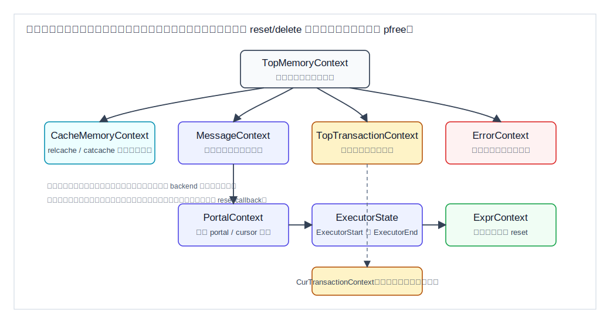
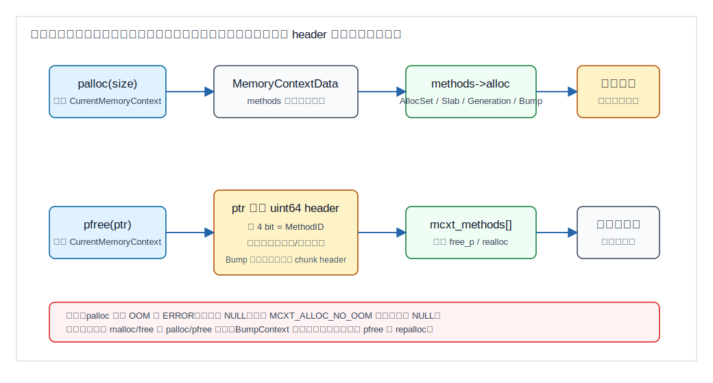
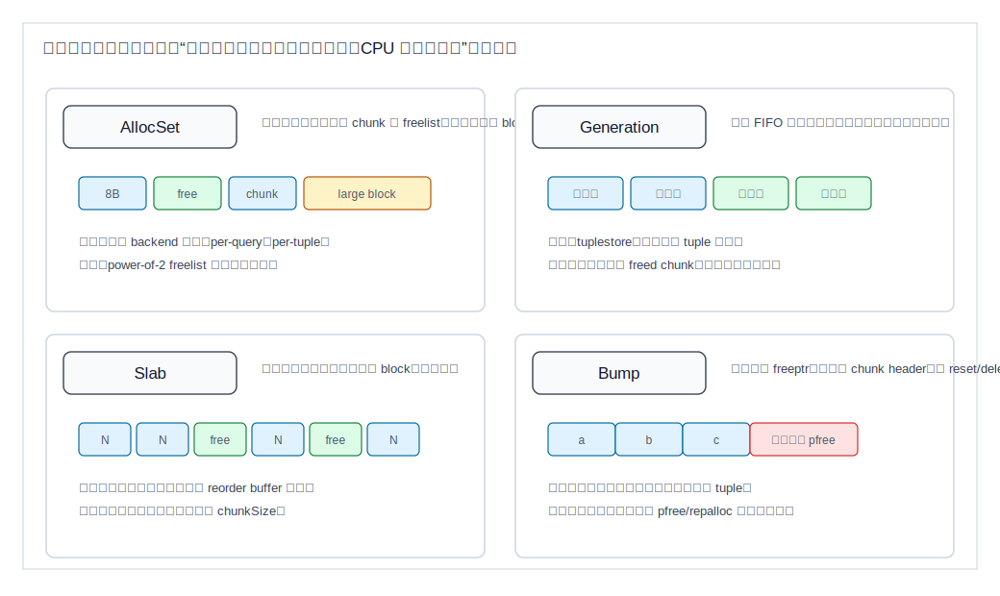
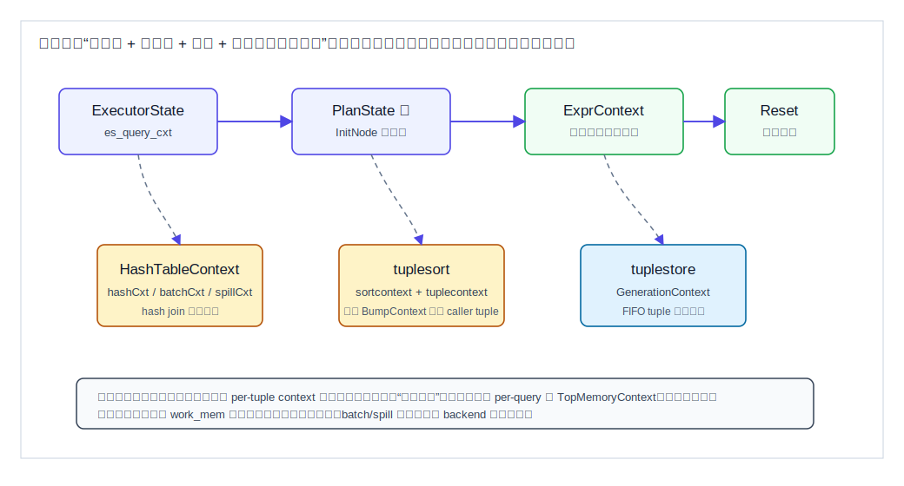
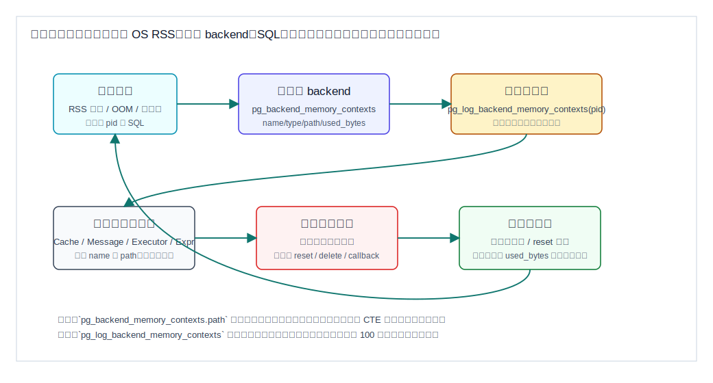

## 数据库筑基课 - 内存上下文管理

### 作者
digoal

### 日期
2026-06-08

### 标签
PostgreSQL , 应用开发者 , 数据库筑基课 , 内存管理 , MemoryContext , palloc , 执行器 , 可观测性    

----

## 背景
  


这篇属于数据库筑基课里的“内核机制 + 执行器基础能力”主题。数据库不是普通服务进程：它要长期运行、反复执行查询、在错误路径上可靠回收资源，还要让扩展、执行器、缓存、事务和后台进程共享一套内存纪律。

本地 `markdown/` 目录没有发现独立的“数据库筑基课大纲”文件，所以本文不强行引用不存在的大纲；后续如果项目补充大纲，可以在这里补上课程目录链接。

先从一个真实工程问题切入：

一个 PostgreSQL 扩展在函数里每处理一行都构造一个临时字符串。开发者用 `palloc()`，但没有注意当前 `CurrentMemoryContext` 指向的是函数缓存上下文或查询级上下文。小测试没问题；上线后一个长查询处理几千万行，backend RSS 持续上升，最后 OOM。修复不是简单加 `pfree()`，而是把临时对象放进 per-tuple context，或者为循环创建一个临时 `MemoryContext` 并周期性 `MemoryContextReset()`。

这类问题背后有四个基础问题：

- `palloc()` 到底把内存放到哪里？
- 为什么 `pfree()` 不依赖当前上下文？
- 为什么查询结束、事务结束、错误恢复能自动释放大量内存？
- 为什么 `work_mem` 没超，backend 仍然可能占很多内存？

本文以本地 PostgreSQL 源码 `postgres` 为主线。重要结论优先引用 `src/backend/utils/mmgr/README`、`src/include/utils/palloc.h`、`src/include/utils/memutils.h`、`src/include/nodes/memnodes.h`、`src/backend/utils/mmgr/mcxt.c`、`aset.c`、`generation.c`、`slab.c`、`bump.c`、`src/backend/executor/README`、`src/backend/executor/execUtils.c`、`doc/src/sgml/system-views.sgml` 和 `doc/src/sgml/func/func-admin.sgml`。DeepWiki repoName `postgres/postgres` 本次可查询，用于交叉校验 MemoryContext、执行器 per-query/per-tuple context 和观测入口的架构摘要；关键机制仍回源到本地源码确认。

## 一、它解决什么问题？

PostgreSQL 的内存上下文解决的是“生命周期管理”问题，不是单纯替代 `malloc/free`。

普通 C 程序常见做法是：

```c
ptr = malloc(size);
...
free(ptr);
```

这要求每条成功路径、失败路径、提前返回路径都精确释放对象。数据库内核很难这么写，因为：

1. 查询执行期间会产生大量短生命周期对象，例如表达式求值、投影、临时 tuple、排序输入 tuple。
2. 错误通过 `ereport(ERROR)` 长跳转退出，不一定按普通函数返回路径走。
3. 一个 backend 会执行很多 SQL，如果短生命周期对象泄漏到进程级内存，就会长期堆积。
4. 扩展函数、操作符函数、索引 AM 支持函数会被执行器反复调用，生命周期边界不清会把“一次小泄漏”放大成“每行泄漏”。
5. 缓存、prepared statement、portal、事务、子事务、executor、per-tuple 对象的生存期不同，不能都用同一个堆。

PostgreSQL 的答案是 MemoryContext：

- 把对象放进代表生命周期的上下文。
- 用上下文树表达父子生命周期。
- 到边界时 reset/delete 整个上下文或子树。
- 只有需要提前释放或复用时才逐个 `pfree()`。
- 用统一 API 暴露统计、日志和调试能力。

牺牲也很明确：

- 代码必须知道“当前对象应该活多久”，否则泄漏会变成生命周期错误。
- `palloc()` 默认 OOM 时抛 `ERROR`，不是返回 `NULL`。
- 有些上下文为了减少碎片或 CPU 成本，不支持普通 `pfree()` 或不复用单个 freed chunk。
- 内存统计主要按 block 统计，不能把它误读成每个 SQL 的精确对象图。

## 二、它是什么？

MemoryContext 是 PostgreSQL 后端里的抽象内存分配上下文。源码 `src/include/nodes/memnodes.h` 里，`MemoryContextData` 包含这些关键字段：

- `type`：上下文具体类型，例如 `AllocSetContext`、`SlabContext`、`GenerationContext`、`BumpContext`。
- `isReset`：自上次 reset 后是否没有分配。
- `mem_allocated`：该上下文从底层分配器拿到的 block 总量。
- `methods`：指向 `MemoryContextMethods`，也就是 C 里的虚函数表。
- `parent/firstchild/prevchild/nextchild`：上下文树。
- `name/ident`：用于统计和排障的名称与标识。
- `reset_cbs`：reset/delete 前调用的回调链。

用户层常用 API 来自 `src/include/utils/palloc.h` 和 `src/include/utils/memutils.h`：

- `palloc()` / `palloc0()`：在 `CurrentMemoryContext` 中分配。
- `MemoryContextAlloc()`：在指定上下文中分配。
- `pfree()` / `repalloc()`：释放或调整已有 chunk，不依赖 `CurrentMemoryContext`。
- `MemoryContextSwitchTo()`：切换当前上下文，并返回旧上下文。
- `MemoryContextReset()`：释放当前上下文中的分配，并删除子上下文。
- `MemoryContextResetOnly()`：只重置当前上下文，不处理子上下文。
- `MemoryContextDelete()`：删除当前上下文和所有后代。
- `MemoryContextRegisterResetCallback()`：在 reset/delete 前释放非 palloc 资源。

PostgreSQL 常见的全局上下文包括：

| 上下文 | 生命周期 | 典型用途 |
|---|---|---|
| `TopMemoryContext` | backend 进程级 | 根上下文；除非必要，不应把业务临时对象放这里 |
| `ErrorContext` | backend 进程级 | 错误恢复路径保留少量内存 |
| `PostmasterContext` | postmaster 工作期 | fork 后 backend 可在合适时机释放不需要的 postmaster 数据 |
| `CacheMemoryContext` | backend 进程级 | relcache、catcache、typcache 等缓存 |
| `MessageContext` | 前端消息级 | 当前客户端命令消息、简单查询 parse/plan 临时数据 |
| `TopTransactionContext` | 顶层事务级 | 事务结束时释放 |
| `CurTransactionContext` | 当前事务或子事务级 | 子事务中可能指向子上下文 |
| `PortalContext` | 当前 portal 级 | cursor、portal 执行相关对象 |

一句话定义：**MemoryContext 是 PostgreSQL 用来把 C 内存分配绑定到数据库生命周期的 arena tree。**

## 三、核心原理

### 3.1 生命周期树：释放边界比单个指针更重要

`src/backend/utils/mmgr/README` 开宗明义：成功的关键是定义一组有用的上下文和合适的生命周期。它还强调，`CurrentMemoryContext` 应尽量指向短生命周期上下文，只有非常受控的代码才应指向超过事务生命周期的上下文。

`src/backend/utils/mmgr/mcxt.c` 里的几个函数体现了树语义：

- `MemoryContextInit()` 创建 `TopMemoryContext` 和 `ErrorContext`。
- `MemoryContextCreate()` 把新上下文挂到父上下文的 child 链表。
- `MemoryContextReset()` 会先 `MemoryContextDeleteChildren()`，再 reset 当前上下文。
- `MemoryContextResetOnly()` 只 reset 当前上下文，不处理后代。
- `MemoryContextDelete()` 用非递归方式自底向上删除子树，避免错误清理路径上栈过深。
- `MemoryContextSetParent()` 可以把已构造好的上下文重新挂到长寿命父节点下，常用于“先在临时上下文构建，成功后提升生命周期”。



图 1 说明：`TopMemoryContext` 是根，查询、事务、portal、executor、表达式求值各有不同清理边界。把短期对象错放到 `CacheMemoryContext` 或 `TopMemoryContext`，不是“小对象没 free”，而是把对象生命周期提升到了 backend 级。

这里有一个容易踩坑的差异：

| API | 当前上下文内存 | 子上下文 | 当前上下文本身 |
|---|---|---|---|
| `MemoryContextReset(context)` | 释放 | 删除 | 保留 |
| `MemoryContextResetOnly(context)` | 释放 | 不处理 | 保留 |
| `MemoryContextDelete(context)` | 释放 | 删除 | 删除 |
| `MemoryContextDeleteChildren(context)` | 不处理 | 删除 | 保留 |

如果你创建了临时子上下文，又只调用 `MemoryContextResetOnly(parent)`，子上下文还在；如果你希望每轮循环连临时子上下文一起清掉，应使用 `MemoryContextReset(parent)` 或显式 delete 子上下文。

### 3.2 `palloc()` 走当前上下文，`pfree()` 走 chunk header

`src/include/utils/palloc.h` 说明：`CurrentMemoryContext` 是 `palloc()` 的默认分配上下文，应通过 `MemoryContextSwitchTo()` 修改。`palloc()` 本身在 `src/backend/utils/mmgr/mcxt.c` 中直接取 `CurrentMemoryContext`，调用该上下文的 `methods->alloc()`。

释放路径不同。`src/backend/utils/mmgr/README` 明确说明：`pfree()` 和 `repalloc()` 可以作用于任何 chunk，无论它是否属于当前上下文。实现原因在 `mcxt.c` 和 `memutils_memorychunk.h` 附近：当前上下文类型会在用户指针前面的 `uint64` header 中编码 method id；`pfree()` 通过 `GetMemoryChunkMethodID(pointer)` 找到 `mcxt_methods[]` 里的 `free_p`。



图 2 说明：分配是“当前上下文驱动”，释放是“chunk 自描述驱动”。所以 `MemoryContextSwitchTo()` 影响后续 `palloc()`，不影响已有指针的 `pfree()`。这也是为什么把 `malloc` 指针传给 `pfree()`、把 `palloc` 指针传给 `free()` 都是错误的。

几个 API 边界必须记住：

- `palloc()` OOM 默认走 `ERROR`，不会返回 `NULL`；只有 `palloc_extended(..., MCXT_ALLOC_NO_OOM)` 才可能返回 `NULL`。
- `palloc(0)` 是合法操作，返回一个不能访问字节但可 `repalloc()` 或 `pfree()` 的 chunk。
- `pfree(NULL)` 和 `repalloc(NULL, ...)` 不被接受。
- 普通 `palloc()` 受 `MaxAllocSize` 限制，当前源码定义为 `1GB - 1`；更大对象要使用 `MemoryContextAllocHuge()` 或 `repalloc_huge()`，且调用者必须确认不会触发 varlena、int 长度等假设问题。
- critical section 中通常不允许分配内存，因为 OOM 会升级成更严重的失败；`ErrorContext` 是特殊例外。

### 3.3 reset callback：内存上下文也能管理非内存资源

`src/backend/utils/mmgr/README` 说明，PostgreSQL 9.5 起 MemoryContext 可以注册 reset/delete callback。典型用途包括：

- 关闭与 tuplesort 对象相关的临时文件。
- 释放长寿命缓存对象的引用计数。
- 清理非 PostgreSQL 库通过 `malloc` 管理的资源。

`MemoryContextRegisterResetCallback(context, cb)` 的 callback 会在上下文下次 reset 或 delete 前调用，并且按注册逆序执行。源码 `mcxt.c` 里 `MemoryContextCallResetCallbacks()` 会先把 callback 从链表弹出再调用，避免 callback 内部出错后后续 cleanup 重复调用。

这对扩展开发很重要：如果你调用了第三方库并拿到非 palloc 资源，不要指望 MemoryContext 自动知道怎么释放。正确做法是把 callback 结构体通常放在同一个上下文里，并在 callback 中释放第三方资源。

### 3.4 四类上下文实现：同一接口，不同分配策略

`src/include/nodes/memnodes.h` 的 `MemoryContextIsValid()` 当前接受四类真正的上下文实现：`AllocSetContext`、`SlabContext`、`GenerationContext`、`BumpContext`。`src/backend/utils/mmgr/mcxt.c` 的 `mcxt_methods[]` 把每一类映射到自己的 `alloc/free/realloc/reset/delete/stats/check` 方法。



图 3 说明：四类分配器不是谁替代谁，而是面向不同对象分布。默认用 `AllocSet`；固定大小对象考虑 `Slab`；FIFO 或批量同寿命对象考虑 `Generation`；大量短寿命、无需单独释放的小对象考虑 `Bump`。

源码里的关键差异如下：

| 维度 | AllocSet | Generation | Slab | Bump |
|---|---|---|---|---|
| 源码 | `aset.c` | `generation.c` | `slab.c` | `bump.c` |
| 主要目标 | 通用分配 | 同代/FIFO 生命周期 | 大量等大小对象 | 大量短寿命、只整体释放对象 |
| 单个 `pfree()` | 支持 | 支持，但不复用单个空洞 | 支持 | 正常构建不支持 |
| `repalloc()` | 支持 | 支持，常新分配+复制 | 要求大小等于 chunkSize | 正常构建不支持 |
| 碎片策略 | 小 chunk power-of-2 freelist；大 chunk 独立 block | block 内计数，整块空后回收或复用 | 固定大小 chunk，优先填最满 block | 顺序推进 freeptr，无普通 chunk header |
| 典型场景 | per-query、per-tuple、普通对象 | tuplestore、逻辑解码 tuple 队列 | reorder buffer 固定结构 | 排序 tuple、递归 union 中短寿命对象 |
| 主要风险 | 长寿命上下文里 freelist 占用不降 | 非 FIFO 模式下释放效果不佳 | 对象大小不一致就不适合 | 指针传给通用释放路径会报错或不可用 |

`AllocSet` 有一个具体阈值值得记：`src/include/utils/memutils.h` 定义 `ALLOCSET_SEPARATE_THRESHOLD` 为 8192；`aset.c` 注释说明当前请求大小超过最后一个 freelist 的对象会单独向 `malloc()` 申请 block，释放时能还给底层分配器，而不是挂到小块 freelist。

### 3.5 执行器：per-query 与 per-tuple 的分层

`src/backend/executor/README` 的 Memory Management 章节说明：`CreateExecutorState()` 会创建 per-query memory context，执行器本次调用中的对象放在这里或其子上下文中。为了避免查询内部泄漏，大多数运行期处理使用 per-tuple memory context，通常每个 `ExprContext` 都有自己的 per-tuple 上下文，并在每个 tuple 周期 reset。

源码对应关系：

- `src/backend/executor/execUtils.c`：`CreateExecutorState()` 创建 `"ExecutorState"` 上下文，并把 `EState` 分配在其中。
- `CreateExprContextInternal()` 在 `estate->es_query_cxt` 下创建 `ExprContext` 节点，同时创建名为 `"ExprContext"` 的 per-tuple context。
- `src/backend/executor/nodeResult.c` 和 `nodeHashjoin.c` 都能看到 `ResetExprContext(econtext)`，用于清理上一轮表达式求值临时对象。
- `src/backend/executor/nodeHash.c` 为 hash join 创建 `HashTableContext`、`HashBatchContext`、`HashSpillContext`。
- `src/backend/utils/sort/tuplesort.c` 在非 bounded sort 下可用 `BumpContext` 保存 caller tuple，减少小对象开销。
- `src/backend/utils/sort/tuplestore.c` 用 `GenerationContext` 保存 tuple，源码注释直接说明它的 `palloc/pfree` 模式是 FIFO。



图 4 说明：执行器不是一个大堆，而是一组嵌套生命周期。表达式函数里的临时 `palloc()` 如果落在 per-tuple context，通常下一行就被清理；如果落在 per-query context，就到查询结束才释放；如果落到缓存或 Top 上下文，就可能变成 backend 级增长。

这也是为什么很多“内存泄漏”不是 `pfree()` 少写了，而是 `MemoryContextSwitchTo()` 选错了上下文。

### 3.6 可观测性：从上下文树看 backend 内存

PostgreSQL 提供两个重要观测入口：

- `pg_backend_memory_contexts`：显示当前 session 所属 server process 的所有 memory contexts。
- `pg_log_backend_memory_contexts(pid)`：请求指定 backend 或辅助进程把 memory contexts 写入服务器日志。

`doc/src/sgml/system-views.sgml` 说明，`pg_backend_memory_contexts` 每个上下文一行，包含 `name`、`ident`、`type`、`level`、`path`、`total_bytes`、`total_nblocks`、`free_bytes`、`free_chunks`、`used_bytes`。默认只有超级用户或有 `pg_read_all_stats` 权限的角色可读。

`src/backend/utils/adt/mcxtfuncs.c` 的 `pg_get_backend_memory_contexts()` 用非递归方式从 `TopMemoryContext` 广度优先遍历上下文树，为 `path` 生成临时编号。文档特别提醒：context 创建和销毁发生在查询运行期间，因此 `path` 编号在同一查询多次读取时可能不稳定；需要用 CTE 固定一次视图结果。



图 5 说明：排查 backend 内存不能只看 OS RSS。先定位 pid 和 SQL，再看 memory context 树，判断增长发生在 `CacheMemoryContext`、`MessageContext`、`ExecutorState`、`ExprContext`、hash/sort 子上下文还是扩展自定义上下文。最后回到源码确认生命周期边界。

`pg_log_backend_memory_contexts(pid)` 的实现不是直接跨进程读内存，而是给目标进程发信号；目标进程在安全中断点处理 `LogMemoryContextPending`，调用 `MemoryContextStatsDetail(TopMemoryContext, 100, 100, false)` 输出日志。源码也限制深度和每个父节点打印的子节点数，避免超大上下文树把日志打爆。

## 四、横向对比

### 4.1 MemoryContext 与普通 `malloc/free`

| 维度 | PostgreSQL MemoryContext | 普通 `malloc/free` |
|---|---|---|
| 主要目标 | 按数据库生命周期批量释放 | 按单个指针释放 |
| 错误路径 | `ERROR` 长跳转后可按上下文边界清理 | 每条错误路径都要手工释放 |
| 性能 | 小对象可从 block/freelist/bump 分配 | 每个对象更依赖底层 allocator |
| 可观测性 | 能按上下文树统计和日志输出 | 需要外部 profiler 或自建统计 |
| 资源管理 | reset callback 可挂非内存资源 | 需要单独生命周期框架 |
| 主要风险 | 放错上下文会延长生命周期 | 忘记 free、double free、异常路径泄漏 |
| 适合场景 | 数据库内核、扩展、执行器、缓存 | 简单程序、生命周期平坦对象 |

MemoryContext 不是让你永远不写 `pfree()`。它让默认释放策略从“每个对象必须准确释放”变成“对象放对生命周期，边界处批量释放”。单个大对象、复用对象、提前释放资源时仍然要 `pfree()` 或使用专门上下文。

### 4.2 四类 MemoryContext 的公平比较

| 维度 | AllocSet | Generation | Slab | Bump |
|---|---|---|---|---|
| 默认选择 | 是 | 否 | 否 | 否 |
| 对象大小 | 任意 | 任意 | 固定大小 | 任意但不适合普通释放 |
| 释放模式 | 单个释放 + reset | 单个释放计数；整块空后回收 | 单个释放，固定槽复用 | 只整体 reset/delete |
| CPU 成本 | 通用平衡 | FIFO 模式低 | 固定对象低 | 很低 |
| 空间碎片 | 中等 | FIFO 模式低 | 固定对象低 | 低 |
| 可安全暴露给通用代码 | 高 | 高 | 中，大小必须匹配 | 低 |
| 典型源码使用 | executor、cache、临时上下文 | tuplestore、逻辑复制 tuple | reorder buffer | tuplesort、hash aggregate tuple |

原因很简单：通用性和效率冲突。越通用，单对象管理信息越多；越贴近具体模式，越要求调用者遵守模式。`BumpContext` 快，是因为它正常构建下没有普通 chunk header；这也是它不能普通 `pfree()` 的原因。

## 五、效果如何？

内存上下文带来的收益：

- 错误恢复更可靠。即使 `ereport(ERROR)` 跳出深层调用栈，事务、查询、portal 边界仍能回收大量临时内存。
- 查询执行更稳定。per-tuple context 让表达式求值临时对象按行清理，避免长查询逐行堆积。
- 扩展开发更有边界。函数缓存、multi-call SRF、聚合状态、临时对象可以放入不同上下文。
- 排障更直接。`pg_backend_memory_contexts` 可以告诉你增长发生在哪棵上下文子树。
- 分配器可按模式优化。固定大小、FIFO、短寿命小对象都能选择专门实现。

代价和限制：

- 它不等于全局内存上限。一个 backend 可以有多个算子、多个上下文、多个缓存，系统总内存还要乘以并发 backend 数。
- 它不保证 reset 后 OS RSS 立即下降。`AllocSet` 会保留 keeper block，底层 malloc 也可能保留 arena。
- 它不是精确对象级 profiler。统计值主要围绕 block、free chunk 和 used/free bytes。
- 它要求扩展作者理解当前上下文。错误的 `MemoryContextSwitchTo()` 比少写一个 `pfree()` 更隐蔽。
- 它不替代资源 owner。锁、buffer pin、文件、smgr、DSM 等资源有自己的生命周期机制，必要时用 reset callback 做桥接。

## 六、实操 DEMO

下面示例是最小可验证方法。由于本次环境没有连接到正在运行的 PostgreSQL 实例，SQL 没有执行；语句来自 PostgreSQL 官方系统视图和函数接口，可在目标实例上执行验证。

### 6.1 查看当前 session 最大的上下文

```sql
SELECT
    name,
    ident,
    type,
    level,
    total_bytes,
    free_bytes,
    used_bytes
FROM pg_backend_memory_contexts
ORDER BY total_bytes DESC
LIMIT 20;
```

看法：

- `total_bytes` 是上下文向底层分配的总空间。
- `used_bytes = total_bytes - free_bytes`，更接近当前有效占用。
- `free_bytes` 很大不一定是泄漏，可能是上下文保留 block 等待复用。
- `name/ident/path` 比单个数字更重要，因为它告诉你生命周期边界。

### 6.2 统计某棵上下文子树

官方文档提醒 `path` 可能不稳定，因此用 CTE 固定一次读取结果：

```sql
WITH memory_contexts AS (
    SELECT * FROM pg_backend_memory_contexts
)
SELECT
    c2.name AS root_context,
    sum(c1.total_bytes) AS subtree_total_bytes,
    sum(c1.used_bytes) AS subtree_used_bytes
FROM memory_contexts c1
JOIN memory_contexts c2
  ON c1.path[c2.level] = c2.path[c2.level]
WHERE c2.name = 'CacheMemoryContext'
GROUP BY c2.name;
```

这个查询用于回答：“`CacheMemoryContext` 及其后代一共占多少？”如果增长发生在缓存子树，排查方向与发生在 `ExecutorState` 完全不同。

### 6.3 请求另一个 backend 打印内存上下文

```sql
SELECT pid, usename, state, query
FROM pg_stat_activity
WHERE state <> 'idle'
ORDER BY backend_start;
```

拿到目标 `pid` 后：

```sql
SELECT pg_log_backend_memory_contexts(<pid>);
```

注意：

- 默认需要超级用户权限；也可以授权给特定角色。
- 输出写到 PostgreSQL server log，不返回给客户端。
- 目标进程要到安全中断点才处理请求。
- 如果一个父上下文下子上下文太多，日志会打印前 100 个并汇总其余部分。

### 6.4 扩展代码中的安全切换模式

简单模式：

```c
MemoryContext oldcontext;
char *result;

oldcontext = MemoryContextSwitchTo(target_context);
result = palloc(result_size);
MemoryContextSwitchTo(oldcontext);
```

如果切换后中间代码可能 `ERROR`，要保证恢复旧上下文：

```c
MemoryContext oldcontext;

oldcontext = MemoryContextSwitchTo(temp_context);
PG_TRY();
{
    do_work_that_may_error();
}
PG_FINALLY();
{
    MemoryContextSwitchTo(oldcontext);
}
PG_END_TRY();
```

循环临时对象模式：

```c
MemoryContext tmpcontext;
MemoryContext oldcontext;

tmpcontext = AllocSetContextCreate(CurrentMemoryContext,
                                   "my temporary context",
                                   ALLOCSET_DEFAULT_SIZES);

for (int i = 0; i < nitems; i++)
{
    oldcontext = MemoryContextSwitchTo(tmpcontext);
    build_temporary_objects(i);
    MemoryContextSwitchTo(oldcontext);

    MemoryContextReset(tmpcontext);
}

MemoryContextDelete(tmpcontext);
```

这段模式的重点不是“循环里每个对象都 `pfree()`”，而是“每轮把临时对象放进同一个短生命周期上下文，然后整体 reset”。

## 七、最佳实践

### 面向数据库架构师

- 评估内存时，不要只看 `work_mem * 并发数`。还要考虑 executor 上下文、hash/sort/spill 子上下文、缓存上下文、复制/逻辑解码上下文、扩展自定义上下文。
- 对长连接、连接池、PL/pgSQL、C 扩展、逻辑复制 worker，要把 backend 常驻内存作为容量模型的一部分。
- 对插件生态做技术评审时，要求说明对象分别分配到 `fn_mcxt`、per-query、per-tuple、aggregate context 还是自建 context。

### 面向 DBA

- 出现 backend RSS 异常时，先定位 pid、SQL、等待事件，再看 `pg_backend_memory_contexts` 或 `pg_log_backend_memory_contexts()`。
- 不要把 `free_bytes` 直接当泄漏；先判断上下文是否会复用 block，以及 query/transaction 结束后是否回落。
- 重点关注异常增长发生在哪类上下文：`CacheMemoryContext` 代表缓存或扩展长期对象，`ExecutorState` 代表当前查询，`ExprContext` 代表表达式求值，hash/sort 子上下文代表执行算子。
- 对 `idle in transaction`、长 cursor、长事务和长查询保持警惕。它们不仅影响 VACUUM，也会延长相关上下文和资源的生命周期。

### 面向业务开发者

- SQL 层不直接操作 MemoryContext，但你的 SQL 形状会改变执行器内存模式。大排序、大 hash join、大聚合、窗口函数、物化 CTE、cursor 都会创建不同工作上下文。
- 避免在单条 SQL 中构造无法流式处理的巨大中间结果。必要时分批、加索引、改 join 顺序、降低一次执行的中间集规模。
- 写 C 扩展或 UDF 时，明确返回值、缓存、临时对象、聚合状态分别应该活到什么时候。
- Serializable/聚合/窗口/排序不是本文主题，但它们都依赖正确的内存生命周期。性能问题和内存问题经常同时出现。

## 八、适合与不适合场景

MemoryContext 适合：

- 数据库内核这种长生命周期进程。
- 有明确阶段边界的执行流程，例如消息、事务、portal、查询、tuple。
- 大量小对象临时分配。
- 错误路径复杂、不能依赖普通函数逐层返回清理的系统。
- 需要按子系统统计内存的运行时。

不适合或需要谨慎的场景：

- 需要把每个对象独立交给外部库释放的内存。应使用外部库自己的 allocator，或用 reset callback 桥接。
- 需要跨上下文长期保存指针，但对象实际分配在短生命周期上下文。必须复制到长寿命上下文。
- 指针会传给不理解 PostgreSQL `palloc/pfree` 的代码。不要混用 `malloc/free` 和 `palloc/pfree`。
- 对象大小高度不固定却误用 `SlabContext`。
- 指针会被通用代码 `pfree/repalloc`，却误分配在 `BumpContext`。

## 九、常见坑

1. **把 per-tuple 临时对象放进 per-query 或 Top 上下文。**  
   结果是一行一点增长，长查询放大成 OOM。修复是切换到 `ExprContext` 的 per-tuple context，或自建短生命周期 context。

2. **切换 `CurrentMemoryContext` 后忘记恢复。**  
   后续代码的 `palloc()` 会进入错误上下文。复杂路径要用 `PG_TRY/PG_FINALLY` 保证恢复。

3. **误以为 `MemoryContextResetOnly()` 会清理子上下文。**  
   它不会。需要连子树一起清理时用 `MemoryContextReset()` 或显式 `MemoryContextDeleteChildren()`。

4. **把 `palloc()` 的返回值当作可能为 `NULL`。**  
   默认 OOM 是 `ERROR`。只有 `MCXT_ALLOC_NO_OOM` 路径才按 `NULL` 处理。

5. **把 `pfree(NULL)` 当作安全 no-op。**  
   PostgreSQL 不接受 `NULL` 指针传给 `pfree()`。

6. **在长寿命上下文中频繁创建临时对象。**  
   即使 `pfree()`，freelist、block、malloc arena 也可能让 RSS 不明显下降；应把对象放到短上下文整体 reset。

7. **用 `BumpContext` 后把指针暴露给通用释放逻辑。**  
   Bump 正常构建没有普通 chunk header，不能普通 `pfree()`、`repalloc()`、`GetMemoryChunkSpace()`。

8. **把 `pg_backend_memory_contexts` 当作跨时间稳定对象图。**  
   上下文会创建销毁，`path` 是临时编号。比较父子关系时用 CTE 固定一次读取。

9. **只看 OS RSS，不看上下文树。**  
   RSS 高可能是缓存、查询工作内存、malloc arena、扩展长期对象或当前 SQL 临时对象，处理方法不同。

10. **扩展使用第三方库 `malloc` 资源却没有 reset callback。**  
    MemoryContext 不会自动释放外部 allocator 的资源。需要 callback 或显式 cleanup。

## 十、扩展问题

1. 一个 SRF 需要跨多次调用保存状态，应该放在 `multi_call_memory_ctx`、当前 per-tuple context，还是 `TopMemoryContext`？为什么？
2. 为什么 `CurrentMemoryContext` 最好指向短生命周期上下文？哪些代码可以临时指向长寿命上下文？
3. 如果 `pg_backend_memory_contexts` 显示 `CacheMemoryContext` 持续增长，和 `ExecutorState` 持续增长分别意味着什么？
4. `AllocSet` 的 8KB separate threshold 对大字符串反复 `repalloc()` 有什么意义？
5. 为什么 `BumpContext` 更省内存和 CPU，却不能作为默认分配器？
6. 如果一个扩展把缓存对象先构造在临时上下文，成功后 `MemoryContextSetParent()` 到 `CacheMemoryContext`，这比直接在 cache 上下文构造更安全吗？
7. `work_mem` 限制的是哪些算子的工作内存？哪些 backend 内存不直接受它限制？
8. 如何设计一个实验，让同一个 C 函数分别在 per-tuple 和 per-query context 中泄漏，并通过 `pg_backend_memory_contexts` 观察差异？

## 十一、扩展阅读

- PostgreSQL 本地源码：`postgres/src/backend/utils/mmgr/README`，Memory Context System Design Overview。
- PostgreSQL 本地源码：`postgres/src/include/utils/palloc.h`，`palloc()`、`CurrentMemoryContext`、`MemoryContextSwitchTo()`、allocation flags。
- PostgreSQL 本地源码：`postgres/src/include/utils/memutils.h`，标准上下文、分配器创建函数、`MaxAllocSize`、`ALLOCSET_SEPARATE_THRESHOLD`。
- PostgreSQL 本地源码：`postgres/src/include/nodes/memnodes.h`，`MemoryContextData`、`MemoryContextMethods`、`MemoryContextIsValid()`。
- PostgreSQL 本地源码：`postgres/src/backend/utils/mmgr/mcxt.c`，通用上下文管理、`mcxt_methods[]`、`palloc/pfree/repalloc`、统计和日志。
- PostgreSQL 本地源码：`postgres/src/backend/utils/mmgr/aset.c`，默认 `AllocSetContext`。
- PostgreSQL 本地源码：`postgres/src/backend/utils/mmgr/generation.c`，`GenerationContext`。
- PostgreSQL 本地源码：`postgres/src/backend/utils/mmgr/slab.c`，`SlabContext`。
- PostgreSQL 本地源码：`postgres/src/backend/utils/mmgr/bump.c`，`BumpContext`。
- PostgreSQL 本地源码：`postgres/src/backend/executor/README`，执行器内存管理。
- PostgreSQL 本地源码：`postgres/src/backend/executor/execUtils.c`，`ExecutorState` 和 `ExprContext` 创建。
- PostgreSQL 本地文档源码：`postgres/doc/src/sgml/system-views.sgml`，`pg_backend_memory_contexts`。
- PostgreSQL 本地文档源码：`postgres/doc/src/sgml/func/func-admin.sgml`，`pg_log_backend_memory_contexts(pid)`。
- 项目说明：`postgres/CLAUDE.md`，用于了解本地项目结构；其中内存管理概述较简化，本文机制以源码为准。
- DeepWiki：repoName `postgres/postgres`，本次通过 `@seflless/deepwiki` 查询 MemoryContext、`palloc`、四类上下文实现、executor per-query/per-tuple context 和内存上下文观测，用作架构交叉校验；关键事实已回源到本地源码。
  
## 附录 
1、克隆代码  
```  
git clone --depth 1 https://github.com/postgres/postgres
```  
  
2、启用 codex, 使用 [数据库筑基课 skill](../skills/README.md).  
```
文章标题: 
  数据库筑基课 - 内存上下文管理
项目源码(本地目录): 
  postgres
项目 codebase 文件名: 
  postgres/CLAUDE.md 
开源项目相关的 deepwiki repoName: 
  postgres/postgres
```
    
#### [PostgreSQL 解决方案集合](../201706/20170601_02.md "40cff096e9ed7122c512b35d8561d9c8")
  
  
#### [德哥 / digoal's Github - 公益是一辈子的事.](https://github.com/digoal/blog/blob/master/README.md "22709685feb7cab07d30f30387f0a9ae")
  
  
#### [About 德哥](https://github.com/digoal/blog/blob/master/me/readme.md "a37735981e7704886ffd590565582dd0")
  
  

  
