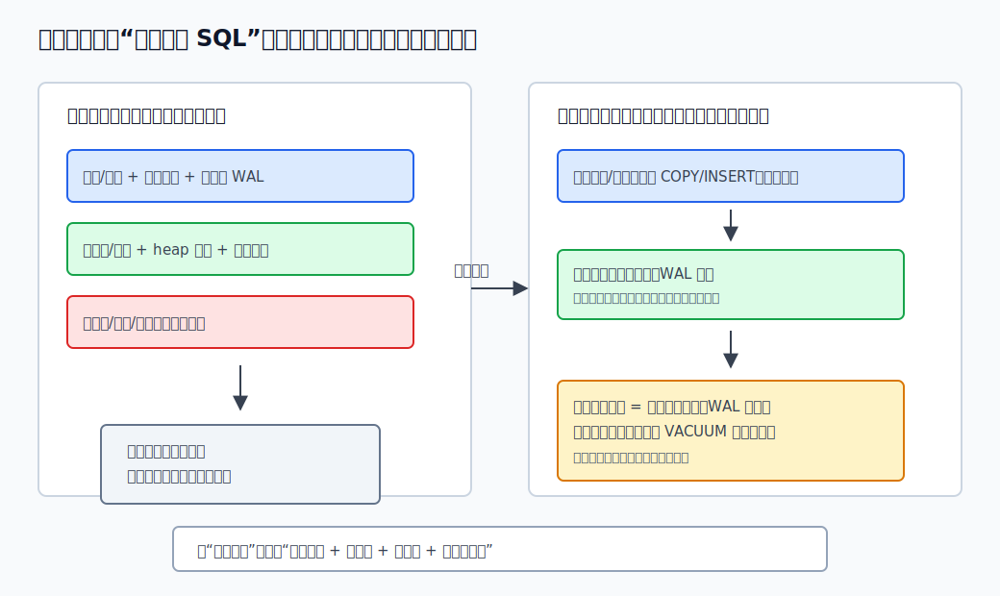
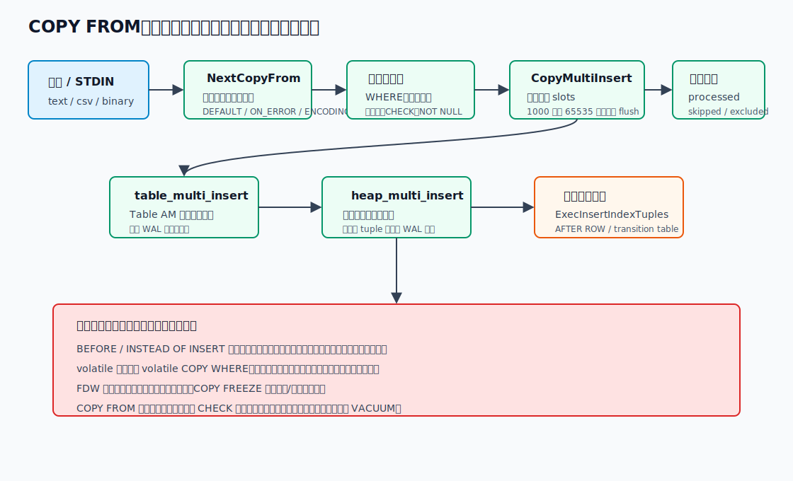
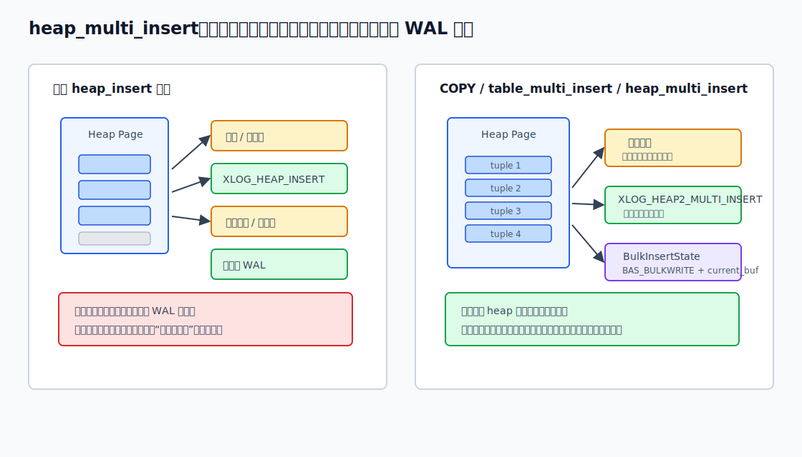
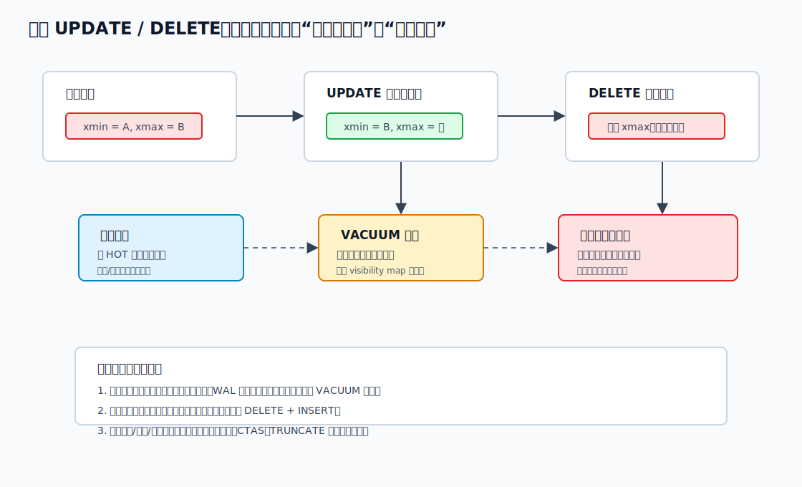
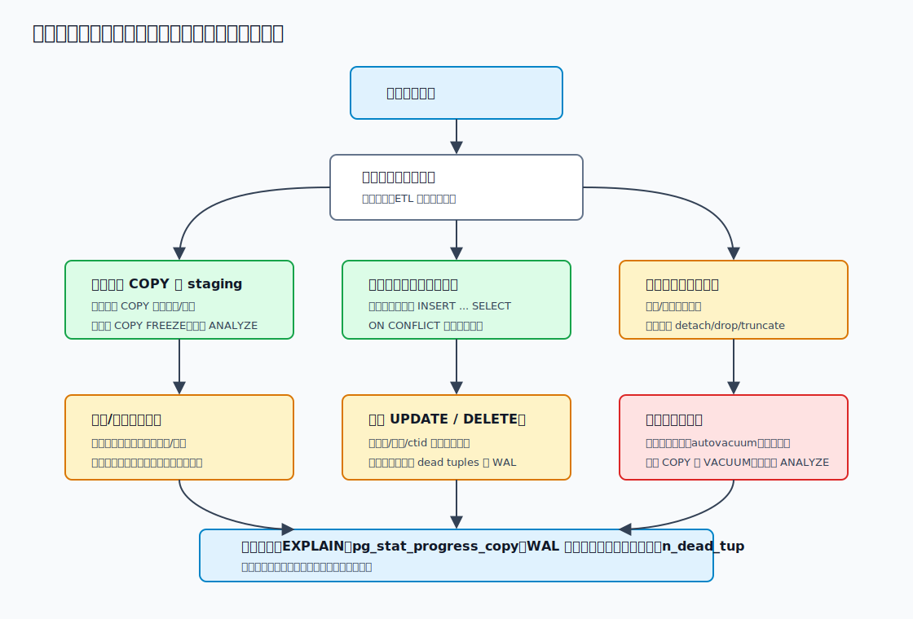

## 数据库筑基课 - 批量处理

### 作者
digoal

### 日期
2026-06-08

### 标签
PostgreSQL , 应用开发者 , 数据库筑基课 , 批量处理 , COPY , MVCC , WAL , VACUUM    

----

## 背景
   


这篇属于数据库筑基课里的“场景实践 + 执行/存储机制”主题。批量处理不是简单地把很多 SQL 包在一个脚本里，而是要在吞吐、锁、WAL、索引维护、触发器、约束、复制延迟、失败回滚和 VACUUM 边界之间做工程取舍。

本地 `markdown/` 目录没有发现独立的“数据库筑基课大纲”文件，所以本文不强行引用不存在的大纲；后续如果项目补充大纲，可以在这里补上课程目录链接。

典型事故是这样的：

一个业务要导入 3 亿条历史订单。开发者先用应用循环逐行 `INSERT`，发现吞吐很差；改成单个超大事务后，导入快了一点，但主库 WAL 暴涨、备库延迟几个小时、外键触发器事件队列占满内存；中途一行脏数据报错，`COPY` 已经写入的不可见行还占着磁盘；后续用一条 `UPDATE` 修正全表状态，又把表和索引打膨胀。

这里的问题不只是“该不该用 `COPY`”。真正的问题是：你要处理的是新增装载、幂等合并、批量修改、批量删除，还是整批替换？不同目标应该选不同的数据库原语。

本文以本地 PostgreSQL 源码 `postgres` 为主线。重要结论优先引用官方文档和源码：`doc/src/sgml/perform.sgml`、`doc/src/sgml/ref/copy.sgml`、`doc/src/sgml/ref/insert.sgml`、`doc/src/sgml/ref/update.sgml`、`doc/src/sgml/ref/delete.sgml`、`doc/src/sgml/ref/truncate.sgml`、`doc/src/sgml/maintenance.sgml`、`src/backend/commands/copyfrom.c`、`src/backend/access/heap/heapam.c`、`src/include/access/tableam.h`、`src/backend/executor/nodeModifyTable.c`、`src/backend/executor/execIndexing.c`。DeepWiki 使用 corrected repoName `postgres/postgres` 查询，返回的 `Query Execution and Table Commands`、`Storage Management`、`Table and Index Management`、`VACUUM and Database Maintenance` 页面与上述源码/文档路径一致，本文用它做架构线索，不用它替代源码核验。

## 一、它解决什么问题？

批量处理解决的是“很多行共同完成一个业务动作”时的成本和边界问题。

逐行处理通常会重复支付这些成本：

- SQL 解析、重写、规划。
- 客户端和服务端网络往返。
- 事务提交、WAL flush、同步复制等待。
- heap 页查找、页锁、缓冲区替换。
- 索引条目插入、唯一约束检查、排他约束检查。
- 行级触发器、外键触发器、生成列、CHECK 约束。
- 错误处理、日志、审计、`RETURNING` 结果集传输。

批量处理的目标，是把固定成本摊薄，并把逐行成本放在合适的数据库内部路径上执行。例如 `COPY FROM` 可以在 `CopyMultiInsertInfo` 中缓冲多行，再调用 `table_multi_insert()`；heap 存储层的 `heap_multi_insert()` 可以在同一页上放入多行，减少页锁和 WAL 记录组织成本。官方文档 `doc/src/sgml/perform.sgml` 的 “Populating a Database” 也明确建议：大量装载时优先用 `COPY`，其次才考虑 prepared `INSERT`，并建议在合适场景下先装载数据、后建索引和外键。

但批量处理不是越大越好。批量越大，单次失败回滚越重，锁持有越久，WAL 峰值越高，复制延迟越可能积累，长事务也越可能拖住 VACUUM 清理边界。



图 1 说明：批量处理主要节省固定成本，例如网络往返、解析规划、提交和 heap 页写入中的一部分开销。索引、唯一检查、触发器、外键、MVCC 旧版本和 WAL 仍然存在。好的批量方案不是“单次越大越快”，而是找到业务可恢复、系统可承受、实例可观测的批量边界。

## 二、它是什么？

在 PostgreSQL 中，“批量处理”至少有四个层次：

| 层次 | 典型写法 | 它真正减少的成本 | 不能自动减少的成本 |
|---|---|---|---|
| 客户端批量 | prepared statement + 多次 bind/execute、pipeline、批量提交 | 网络往返、解析规划、提交次数 | heap、索引、触发器逐行成本 |
| SQL 语句批量 | `INSERT ... VALUES (...), (...)`、`INSERT ... SELECT`、`UPDATE ... FROM`、`DELETE ... USING` | 语句开销、扫描和 join 可由优化器统一规划 | DML 执行仍逐目标行处理 |
| 装载专用路径 | `COPY FROM`、`COPY FREEZE`、`CREATE TABLE AS` | 输入解析、缓冲、多行 heap 插入、部分 WAL/页锁成本 | 索引、触发器、CHECK、外键触发器 |
| 运维批量 | 分区替换、`TRUNCATE`、先装载后建索引/约束、分批提交 | 避免逐行删除/修改，降低写放大 | 锁窗口、约束缺失窗口、复制和恢复策略 |

所以讨论批量处理前，先问四个问题：

1. 是纯新增，还是要和已有数据合并？
2. 是修正少数行、很多行，还是整表/整分区替换？
3. 目标表上有多少索引、唯一约束、外键、触发器、RLS？
4. 允许多大的失败回滚、锁窗口、复制延迟和数据校验窗口？

这四个问题决定你应该用 `COPY`、staging 表、`INSERT ... ON CONFLICT`、分批 `UPDATE/DELETE`、`TRUNCATE`，还是分区级替换。

## 三、核心原理

### 3.1 COPY FROM：专用装载管线

官方文档 `doc/src/sgml/ref/copy.sgml` 定义了 `COPY`：在文件、程序、STDIN/STDOUT 和表之间复制数据。`COPY FROM` 会把输入数据追加到目标表；指定列以外的列使用默认值。文档还说明：`COPY FROM` 会触发目标表上的触发器和 CHECK 约束，但不会调用规则；如果失败，已经物理插入的行会变成不可见状态，但仍占用磁盘，需要 `VACUUM` 回收。

源码路径在 `src/backend/commands/copy.c` 和 `src/backend/commands/copyfrom.c`：

1. `DoCopy()` 解析 `COPY` 选项，`COPY FROM` 进入 `BeginCopyFrom()`。
2. `CopyFrom()` 建立 executor state、`ResultRelInfo`、索引状态、触发器状态、分区路由状态。
3. `NextCopyFrom()` 逐行解析输入，执行类型输入函数、默认值、错误策略和 `COPY WHERE`。
4. 如果可以批量插入，行进入 `CopyMultiInsertInfo` 缓冲。
5. 缓冲达到 `MAX_BUFFERED_TUPLES = 1000` 或 `MAX_BUFFERED_BYTES = 65535` 后 flush。
6. 普通表 flush 时调用 `table_multi_insert()`；外部表如果 FDW 支持批量，则调用 `ExecForeignBatchInsert()`。
7. heap 写入后，`ExecInsertIndexTuples()` 为每个索引写入条目并执行唯一/排他约束相关逻辑，再执行 AFTER ROW 触发器。
8. 结束时 flush 剩余缓冲、执行 AFTER STATEMENT 触发器、清理批量插入状态。



图 2 说明：`COPY FROM` 快，是因为它走了面向装载的管线，并且在条件允许时把多行缓冲后交给 table access method 批量插入。但它不是“不检查”的高速通道：生成列、CHECK、NOT NULL、分区约束、索引、唯一约束和触发器仍可能成为瓶颈。

### 3.2 COPY 何时不能走多行插入？

`copyfrom.c` 中 `CopyFrom()` 对批量插入做了明确限制。以下情况会退回单行插入，或在分区粒度上有条件启用：

- 目标表有 `BEFORE INSERT` 行级触发器或 `INSTEAD OF INSERT` 行级触发器。
- 目标外部表的 FDW 不支持 batch insert，或者 batch size 为 1。
- 分区表上有 statement-level insert transition table，当前实现不支持这种组合下的多插入。
- 表有 volatile 默认表达式。
- `COPY WHERE` 中包含 volatile 函数。
- 分区叶子上有 BEFORE/INSTEAD OF 触发器，或外部表分区不支持批量。

这些限制不是保守到多余，而是为了语义正确。BEFORE 触发器可能查询目标表；volatile 表达式可能依赖数据库当前状态。如果把已经解析的行先存在内存里不落表，触发器和表达式看到的世界就会变。

### 3.3 heap_multi_insert：页锁和 WAL 的摊薄点

`src/include/access/tableam.h` 对 `table_multi_insert()` 的注释很直接：它类似 `table_tuple_insert()`，但一次插入多行，table AM 可以减少 WAL 和页锁开销。

heap AM 的实现见 `src/backend/access/heap/heapam.c`。`heap_multi_insert()` 注释说明：它比循环调用 `heap_insert()` 快，因为当多行可以插入同一个 heap page 时，只需要一个覆盖多行的 WAL 记录，并且只锁/解锁页面一次。

关键机制包括：

- `BulkInsertState` 使用 `BAS_BULKWRITE` buffer access strategy，记录当前插入页和批量扩展状态。
- `heap_multi_insert_pages()` 预估剩余 tuple 需要多少页，帮助 relation extension 更激进地扩展。
- 对每个目标页，先放入第一行，再尽量把后续能放下的行放入同一页。
- 如果需要 WAL，写 `XLOG_HEAP2_MULTI_INSERT` 记录。
- 如果 `COPY FREEZE` 插入新空页，可以设置 all-visible/all-frozen visibility map 位。
- heap 写完后，索引条目仍由 executor 层逐行维护。



图 3 说明：`heap_multi_insert()` 节省的是 heap 页写入路径上的固定成本。它不等于“整批只写一次 WAL”，因为跨页仍会分多条记录，逻辑复制需要 tuple data 时也会影响 WAL 内容；它也不消除每个索引、每个触发器、每条外键检查的成本。

### 3.4 COPY FREEZE：快，但边界很硬

`COPY FREEZE` 是初始装载优化。文档 `ref/copy.sgml` 说明：它请求把行按类似 `VACUUM FREEZE` 后的状态写入，用于初始装载；只有当目标表在当前子事务中创建或截断、没有打开 cursor、当前事务没有更老快照时才会冻结；当前不能用于分区表或外部表。文档还提醒：数据成功装载后，其他会话会立即看到这些数据，这违反普通 MVCC 可见性规则。

源码 `copyfrom.c` 对应检查包括：

- 分区表报错。
- 外部表报错。
- 有先前快照或 portal 报错。
- 表不是当前子事务创建或截断的报错。
- 通过后设置 `TABLE_INSERT_FROZEN`。

实践建议很简单：`COPY FREEZE` 只适合受控的初始装载或重建流程，不适合普通在线导入，更不适合你还没想清楚并发可见性的业务路径。

### 3.5 索引、唯一约束、外键和触发器：批量装载的隐藏大头

`src/backend/executor/execIndexing.c` 说明 `ExecInsertIndexTuples()` 是插入索引 tuple 和执行唯一/排他约束的主入口。普通唯一索引由 index AM 在插入索引条目时原子检查冲突；排他约束需要插入后再扫描检查冲突；deferred 约束会返回需要后续 recheck 的索引列表。

这解释了为什么“先 `COPY` 后建索引”常常更快：逐行装载时每行都要更新每个索引；先把 heap 数据装进去，再 `CREATE INDEX`，索引构建可以按已有数据批量扫描、排序和写入。官方 `perform.sgml` 也建议：新表装载最快的方法通常是建表、`COPY`、再建索引。

外键也是类似逻辑。`perform.sgml` 明确说，外键约束可以批量检查得更高效；如果现有外键存在，每个新行都需要 pending trigger event，因为外键检查由触发器完成。导入几百万行时，事件队列可能撑爆内存，导致严重交换甚至失败。可选方案是临时移除外键后重新添加，或者把装载拆成更小事务。

这里的取舍必须讲清楚：

- 暂时删除普通索引，会让装载更快，但期间查询性能可能下降。
- 暂时删除唯一索引或外键，会丢失期间的错误检查，必须由 staging 校验或后续 `ALTER TABLE ... ADD CONSTRAINT` 承担。
- 提高 `maintenance_work_mem` 主要帮助 `CREATE INDEX` 和 `ALTER TABLE ADD FOREIGN KEY`，对 `COPY` 本身帮助不大。
- 提高 `max_wal_size` 可以减少大装载期间 checkpoint 频率，从而减少脏页反复刷盘。
- 如果关闭 WAL 归档/流复制并把 `wal_level` 设为 `minimal`，可能让特定新建/截断表装载少写 WAL，但需要重启、影响备份恢复和 standby，可导致数据保护窗口变化。

### 3.6 INSERT、VALUES 和 ON CONFLICT：更灵活，但不是 COPY

`doc/src/sgml/dml.sgml` 说明 `INSERT` 可以一次插入多行，也可以插入查询结果；同时提示大量插入时考虑 `COPY`，因为 `COPY` 更高效但不如 `INSERT` 灵活。

常见批量写入形态：

```sql
INSERT INTO target (id, payload)
VALUES (1, 'a'), (2, 'b'), (3, 'c');

INSERT INTO target (id, payload)
SELECT id, payload
FROM staging
WHERE valid;
```

`VALUES` 列表也有边界。`ref/values.sgml` 提醒：非常大的 `VALUES` 列表应该避免，可能遇到内存不足或性能差；`INSERT` 中的 `VALUES` 是特殊情况，可以处理更大的列表，但这不等于应该无限大。

`INSERT ... ON CONFLICT` 适合幂等写入和 upsert。官方 `ref/insert.sgml` 说明：

- `ON CONFLICT DO UPDATE` 保证原子 `INSERT` 或 `UPDATE` 结果。
- 冲突目标通过唯一索引推断或显式约束名选择 arbiter indexes。
- `DO UPDATE` 和 `DO SELECT` 必须指定冲突目标。
- 只有 NOT DEFERRABLE 约束和唯一索引可作为 `DO UPDATE/DO SELECT` arbiter。
- `ON CONFLICT DO UPDATE` 是 deterministic statement；同一个已有行不能被同一条语句影响多次，否则会 cardinality violation。

源码上，`nodeModifyTable.c` 的 `ExecInsert()` 遇到 `ON CONFLICT` 会走 speculative insertion：先做非决定性的冲突预检查，然后以 speculative token 插入 heap，再插入索引条目；如果冲突，取消 speculative tuple 并执行替代动作。`execIndexing.c` 也说明 speculative insertion 是实现 `INSERT ... ON CONFLICT` 的两阶段机制。

工程建议：不要直接把脏 CSV “upsert 到正式表”。更稳的模式是：

1. `COPY` 到 staging 表。
2. 在 staging 表中做类型清洗、去重、唯一性校验。
3. 用 `INSERT ... SELECT ... ON CONFLICT` 合并到正式表。
4. 如果同一个 key 在 staging 中出现多次，先用 `DISTINCT ON`、窗口函数或聚合去重，避免同一语句多次影响同一个目标行。

### 3.7 批量 UPDATE / DELETE：不是“原地改完就结束”

`UPDATE` 和 `DELETE` 的执行入口主要在 `src/backend/executor/nodeModifyTable.c`。`ExecModifyTable()` 从子计划取出一行，按操作类型调用 `ExecInsert()`、`ExecUpdate()` 或 `ExecDelete()`。对于 heap 表，`UPDATE/DELETE` 通过 junk `ctid` 找到目标行。

存储层逻辑在 `heapam.c`：

- `heap_update()` 会读取旧 tuple，判断并发状态，决定锁模式；如果不是更新 key 列，可用较弱的 `LockTupleNoKeyExclusive`，有利于外键并发检查。
- `UPDATE` 通常写入一个新行版本，并把旧版本的 `xmax` 指向更新事务。
- 如果更新不影响 HOT-blocking indexed columns 且新 tuple 能放在同页，可能走 HOT，减少索引更新。
- 如果更新索引列或跨页，相关索引需要维护新条目。
- `heap_delete()` 不是马上释放空间，而是标记 `xmax`；旧版本要等所有可能看到它的事务结束后，由 VACUUM 清理。

官方 `maintenance.sgml` 也明确说明：`UPDATE` 或 `DELETE` 不会立即移除旧版本。MVCC 要求旧版本在仍可能被其他事务看到时不能删除；最终由 VACUUM 回收空间。大量更新或删除后，普通 `VACUUM` 可以让空间重用，但通常不会把空间还给操作系统；如果要真正缩小文件，可能需要 `VACUUM FULL`、`CLUSTER` 或表重写类操作，这些会需要强锁和额外空间。



图 4 说明：批量 `UPDATE/DELETE` 的主要后果是旧版本、索引垃圾、WAL 和 VACUUM 压力。一个大事务减少提交次数，但会延长锁和快照边界；许多小事务降低单次冲击，但提交和调度成本更高。批量大小必须通过观测选择。

### 3.8 TRUNCATE 和分区替换：能不用逐行删，就别逐行删

如果目标是删除整表，`DELETE FROM t` 会逐行标记删除，产生 MVCC 旧版本、WAL、触发器和 VACUUM 工作。`ref/delete.sgml` 提示：删除所有行时，`TRUNCATE` 是更快机制。

但 `TRUNCATE` 的边界也很硬。`ref/truncate.sgml` 说明：

- `TRUNCATE` 获取 `ACCESS EXCLUSIVE` 锁，会阻塞表上的其他并发操作。
- 有外键引用时，除非所有相关表同时 truncate，否则不能使用；`CASCADE` 会自动包含依赖表，风险很高。
- 不触发 `ON DELETE` 触发器，但会触发 `ON TRUNCATE` 触发器。
- `TRUNCATE` 不是 MVCC-safe；并发事务如果使用 truncate 前的快照，表会看起来为空。

如果表按时间、租户、任务批次分区，整批删除通常应该转成分区级动作：detach、drop、truncate 分区，或者装载新分区后切换。这样比逐行 `DELETE` 更像“元数据操作 + 文件级回收”，对 WAL、索引和 VACUUM 友好得多。

### 3.9 事务大小：反对 autocommit 逐行，也反对无限大事务

官方 `perform.sgml` 建议：如果必须使用多个 `INSERT`，关闭 autocommit，在最后一次提交；每行单独提交会让 PostgreSQL 为每行做大量工作。

这条建议经常被误读成“一个批任务就应该一个事务”。真正的判断标准是：

- 批任务失败后，业务能接受重跑多少行？
- 单个事务的 WAL 峰值和复制延迟是否可接受？
- 行锁、表锁、触发器队列和外键检查内存是否可接受？
- 长事务是否会拖住 VACUUM、冻结和表膨胀？
- 备份、归档、监控和告警是否承受得住？

实务上，常见做法是“逻辑上幂等，物理上分批提交”：每批按主键范围、时间范围、分区或 staging batch id 处理，提交后记录进度。失败时从已提交边界继续，而不是回滚几小时工作。



图 5 说明：先判断处理目标，再选数据库原语。纯新增优先 `COPY` 到 staging 或新表；合并用 staging 去重后 `INSERT ... ON CONFLICT`；整批替换优先分区或 `TRUNCATE`；批量修改和删除要按可观测指标分批，避免把 MVCC 清理压力留给后续系统。

## 四、横向对比

| 维度 | `COPY FROM` 到新表/staging | 多行 `INSERT` / prepared INSERT | `INSERT ... SELECT ... ON CONFLICT` | 分批 `UPDATE/DELETE` | `TRUNCATE` / 分区替换 |
|---|---|---|---|---|---|
| 主要目标 | 高吞吐装载 | 少量到中等批量新增，逻辑灵活 | 幂等合并、upsert | 修正或清理已有行 | 整表/整分区清空或重建 |
| 写入代价 | heap 可多行插入；索引和触发器仍逐行 | 通常按 executor 逐行插入 | 需要唯一索引仲裁和冲突处理 | 每目标行产生 MVCC 旧版本 | 元数据/文件级动作更多，逐行成本低 |
| 读取/规划代价 | 不走普通查询规划输入 | VALUES 太大会带来解析/内存压力 | staging 可被优化器规划 | 依赖筛选条件和索引 | 通常不需要扫描待删行 |
| 空间成本 | 失败 COPY 的不可见行需 VACUUM | 插入失败按事务回滚 | 冲突更新可能制造旧版本 | 表和索引膨胀风险高 | 可快速释放或替换物理文件 |
| 事务/MVCC | 单命令；可分文件/分批 | 可按批提交 | 原子 insert/update；需处理重复 key | 长事务拖住 VACUUM | `TRUNCATE` 非 MVCC-safe |
| 索引/约束 | 先装载后建索引/外键常更快 | 每行维护索引 | arbiter unique index 必需 | 更新索引列写放大明显 | 约束和引用关系限制严格 |
| 适合场景 | 历史导入、ETL、临时表、重建表 | API 批量写、较小批次 | 维表同步、事件幂等、去重合并 | 回填字段、状态迁移、过期清理 | 分区轮转、全量重算、清空临时表 |
| 不适合场景 | RLS 目标表、复杂逐行触发逻辑 | 超大 VALUES、逐行提交 | 源数据 key 重复且未去重，高冲突热点 | 要求无膨胀、不能承受复制延迟 | 需要 ON DELETE 触发器、并发读写不能阻塞 |

表里的关键不是“哪个最快”，而是“哪个少做无意义的逐行工作”。如果业务目标是整批替换，逐行 `DELETE` 再 `INSERT` 通常是最差路径；如果业务目标是幂等合并，直接 `COPY` 到正式表也不是正确路径，应该先 staging、校验、去重，再合并。

## 五、效果如何？

批量处理带来的收益主要体现在：

- 减少网络往返和解析规划次数。
- 减少提交次数和 WAL flush 次数。
- `COPY` 条件满足时，用多行插入减少 heap 页锁和 WAL 记录组织开销。
- 新表先装载后建索引，避免每行维护索引。
- 外键后建或分批检查，避免 pending trigger event 队列过大。
- 分区替换或 `TRUNCATE` 避免逐行删除制造大量死元组。

代价也必须一起算：

- 批次过大会增加锁时间、回滚时间、复制延迟和 WAL 峰值。
- 批量 `UPDATE/DELETE` 会制造 MVCC 旧版本，需要 VACUUM 后续处理。
- 删除索引/外键会带来数据校验窗口，必须由 staging 和后续验证补上。
- `COPY FREEZE` 会改变普通 MVCC 可见性预期，只适合受控初始装载。
- `ON CONFLICT DO UPDATE` 在高冲突热点上可能退化成锁竞争和反复重试。
- `RETURNING *` 对大批量 DML 会把结果集传输变成瓶颈。

本文不提供固定性能数字。吞吐、WAL、膨胀和复制延迟都和硬件、表宽、索引数量、触发器逻辑、事务大小、checkpoint、复制配置有关。正确做法是用同一环境的基准测试和观测指标来定批量大小。

## 六、实操 DEMO

下面示例是可运行 SQL 和操作模板，但本文没有在当前机器启动 PostgreSQL 实例执行，因此不提供执行输出。

### 6.1 初始装载：COPY 到 staging，再分析统计信息

适合 CSV 文件已经清洗到基本可解析的场景。`COPY FROM '/path/file.csv'` 的路径在服务器侧；如果文件在客户端机器，使用 `psql` 的 `\copy`。

```sql
DROP TABLE IF EXISTS order_stage;

CREATE TABLE order_stage (
  order_id bigint,
  user_id bigint,
  amount numeric(18,2),
  status text,
  created_at timestamptz
);

-- 服务器侧文件路径，由 PostgreSQL 服务器进程读取。
COPY order_stage (order_id, user_id, amount, status, created_at)
FROM '/data/import/orders.csv'
WITH (FORMAT csv, HEADER true, NULL '', ENCODING 'UTF8');

ANALYZE order_stage;
```

如果用客户端文件：

```sql
\copy order_stage (order_id, user_id, amount, status, created_at) FROM './orders.csv' WITH (FORMAT csv, HEADER true, NULL '', ENCODING 'UTF8')
```

验证点：

```sql
SELECT count(*) FROM order_stage;
SELECT count(*) FROM order_stage WHERE order_id IS NULL OR user_id IS NULL;
SELECT * FROM pg_stat_progress_copy;
```

### 6.2 新表一次性装载：先 COPY，后建索引和外键

```sql
BEGIN;

CREATE TABLE order_fact (
  order_id bigint NOT NULL,
  user_id bigint NOT NULL,
  amount numeric(18,2) NOT NULL,
  status text NOT NULL,
  created_at timestamptz NOT NULL
);

COPY order_fact (order_id, user_id, amount, status, created_at)
FROM '/data/import/orders.csv'
WITH (FORMAT csv, HEADER true);

COMMIT;

CREATE UNIQUE INDEX order_fact_pk_idx ON order_fact(order_id);
ALTER TABLE order_fact ADD CONSTRAINT order_fact_pk PRIMARY KEY USING INDEX order_fact_pk_idx;
CREATE INDEX order_fact_created_at_idx ON order_fact(created_at);

ANALYZE order_fact;
```

如果需要外键，优先在 staging 中先做缺失引用检查，再决定是否后建外键：

```sql
SELECT s.user_id, count(*)
FROM order_stage s
LEFT JOIN users u ON u.user_id = s.user_id
WHERE u.user_id IS NULL
GROUP BY s.user_id
ORDER BY count(*) DESC
LIMIT 20;
```

### 6.3 幂等合并：staging 去重后 ON CONFLICT

```sql
CREATE TABLE order_target (
  order_id bigint PRIMARY KEY,
  user_id bigint NOT NULL,
  amount numeric(18,2) NOT NULL,
  status text NOT NULL,
  created_at timestamptz NOT NULL,
  updated_at timestamptz NOT NULL DEFAULT now()
);

WITH dedup AS (
  SELECT DISTINCT ON (order_id)
         order_id, user_id, amount, status, created_at
  FROM order_stage
  WHERE order_id IS NOT NULL
  ORDER BY order_id, created_at DESC
)
INSERT INTO order_target AS t (order_id, user_id, amount, status, created_at)
SELECT order_id, user_id, amount, status, created_at
FROM dedup
ON CONFLICT (order_id) DO UPDATE
SET user_id = EXCLUDED.user_id,
    amount = EXCLUDED.amount,
    status = EXCLUDED.status,
    created_at = EXCLUDED.created_at,
    updated_at = now()
WHERE (t.user_id, t.amount, t.status, t.created_at)
      IS DISTINCT FROM
      (EXCLUDED.user_id, EXCLUDED.amount, EXCLUDED.status, EXCLUDED.created_at);
```

这里的 `WHERE ... IS DISTINCT FROM` 很重要：值没有变化时不更新，避免制造无意义的旧版本和索引维护。

### 6.4 批量 UPDATE：按主键切小批

PostgreSQL 没有 `UPDATE ... LIMIT`。常见写法是先选一批主键，再 join 回目标表：

```sql
WITH batch AS (
  SELECT order_id
  FROM order_target
  WHERE status = 'new'
  ORDER BY order_id
  LIMIT 10000
  FOR UPDATE SKIP LOCKED
)
UPDATE order_target t
SET status = 'ready',
    updated_at = now()
FROM batch
WHERE t.order_id = batch.order_id;
```

循环执行这个语句，直到更新 0 行。`SKIP LOCKED` 适合多 worker 并发分摊任务，但它会跳过被锁行；如果业务要求严格顺序或必须一次性覆盖所有行，需要改用单 worker 或额外进度表。

### 6.5 批量 DELETE：用当前语句内的 ctid 切批

```sql
WITH batch AS (
  SELECT ctid
  FROM order_target
  WHERE created_at < now() - interval '180 days'
  ORDER BY created_at
  LIMIT 10000
)
DELETE FROM order_target t
USING batch
WHERE t.ctid = batch.ctid;
```

`ctid` 只能作为当前语句内定位工具，不要跨事务保存。长期可恢复任务应该用稳定主键、时间范围或分区边界记录进度。

### 6.6 观测 WAL、膨胀和复制延迟

```sql
-- psql 中记录批处理前 WAL 位置。
SELECT pg_current_wal_lsn() AS lsn_before \gset

-- 执行一批 COPY / INSERT / UPDATE / DELETE 后：
SELECT pg_size_pretty(pg_wal_lsn_diff(pg_current_wal_lsn(), :'lsn_before')) AS wal_generated;

SELECT relname, n_live_tup, n_dead_tup, last_vacuum, last_autovacuum
FROM pg_stat_user_tables
WHERE relname IN ('order_target', 'order_stage');

SELECT pid, application_name, state, wait_event_type, wait_event
FROM pg_stat_activity
WHERE state <> 'idle';

SELECT application_name, state, sent_lsn, replay_lsn,
       pg_size_pretty(pg_wal_lsn_diff(sent_lsn, replay_lsn)) AS replay_lag_bytes
FROM pg_stat_replication;
```

这些查询不是为了得到一个“标准值”，而是帮助你判断当前批量大小是否过大：如果 WAL 差值、`n_dead_tup`、锁等待或备库 lag 每批都持续上升，就应该缩小批次、调整执行窗口，或改用分区/重建方案。

## 七、最佳实践

### 面向数据库架构师

- 把批量处理建模成数据生命周期问题：装载、校验、合并、修正、归档、删除，分别设计 staging、正式表、分区和索引。
- 大批量导入优先走 staging 表。正式表约束复杂时，不要让脏数据直接进入核心交易表。
- 时间序列、账单、日志、事件这类天然按时间清理的数据，优先分区。整批过期用分区 drop/truncate，不要靠全表 `DELETE`。
- 唯一性、外键、CHECK 能声明就声明，但导入窗口内是否后建，需要用校验流程补上数据质量保障。
- 设计幂等键。没有稳定业务键的批量 upsert，失败重跑会很痛苦。

### 面向 DBA

- 大装载前评估索引数量、外键、触发器、RLS、复制、归档、checkpoint 和 autovacuum 参数。
- 新表装载优先 `COPY` 后建索引和外键；现有表要权衡删除索引/约束的校验窗口。
- 临时提高 `maintenance_work_mem` 用于后续 `CREATE INDEX` 和 `ALTER TABLE ADD FOREIGN KEY`，不要期待它显著加速 `COPY` 本身。
- 临时提高 `max_wal_size`，减少大装载期间 checkpoint 频率；同时监控磁盘和归档堆积。
- 大批量 `UPDATE/DELETE` 后观察 `n_dead_tup`、表大小、索引大小和 autovacuum 进度，必要时安排手动 `VACUUM (ANALYZE)`。
- 对逻辑复制或物理备库场景，先估算 WAL 峰值和 replay 能力。批任务不能只看主库完成时间。
- 使用 `lock_timeout`、`statement_timeout`、`application_name` 和批次日志，让批任务可识别、可取消、可续跑。

### 面向业务开发者

- 不要逐行 autocommit。至少用 prepared statement + 批量提交；大量装载优先让 DBA 提供 `COPY` 或 staging 流程。
- 不要构造无限大的 `VALUES`。让每批大小可配置，并把进度落表。
- `ON CONFLICT DO UPDATE` 前先去重源数据；同一条语句不要让一个 key 出现多次。
- `UPDATE` 时加 `WHERE ... IS DISTINCT FROM ...`，避免值没变也更新。
- 大批量 DML 避免 `RETURNING *`，除非确实需要把每行结果拿回客户端。
- 分批任务必须幂等。失败后应该能从上一个已提交批次继续，而不是靠人工猜测。

## 八、适合与不适合场景

适合批量处理的场景：

- 历史数据初始导入、跨系统迁移、离线 ETL。
- 日志、事件、账单、指标这类天然分批生成的数据。
- 维表同步、幂等 upsert、周期性数据修正。
- 大表字段回填、状态迁移、归档清理。
- 分区数据的整批替换、整批删除。

不适合直接用大批量的场景：

- 高冲突热点 key 的 upsert，容易变成行锁争用。
- 目标表有复杂行级触发器或外键链路，且不能拆小事务。
- 需要 RLS 的目标表装载，因为 `COPY FROM` 不支持 row-level security，应该使用等价 `INSERT`。
- 在线业务不能接受长锁、复制延迟或 autovacuum 滞后的核心表。
- 没有幂等键、没有进度记录、失败后不能安全重跑的任务。
- 需要触发 `ON DELETE` 业务逻辑的场景，不应直接改用 `TRUNCATE`。

## 九、常见坑

1. 逐行 autocommit。每行都提交，固定成本最大化。
2. 一个超大事务跑到底。回滚、锁、WAL、复制延迟和 VACUUM 边界都会放大。
3. 直接把 CSV `COPY` 到正式表。脏数据、重复 key 和外键缺失会把失败处理复杂化。
4. 源数据未去重就 `ON CONFLICT DO UPDATE`。同一目标行在一条语句中被影响多次会报错。
5. 值没变也更新。会制造旧版本、索引维护和 WAL。
6. 忘记 `ANALYZE`。装载后统计信息过期，后续查询计划可能很差。
7. 误用 `COPY FREEZE`。它有严格前提，并且会改变普通 MVCC 可见性预期。
8. 忽略 COPY 文件路径语义。`COPY FROM '/path'` 是服务器读文件，`\copy` 才是客户端读文件。
9. COPY 中途失败后不清理。不可见行仍占磁盘，可能需要 `VACUUM`。
10. 为了速度删除唯一索引，却没有替代校验。装载期间可能写入重复数据。
11. 外键触发器事件队列过大。大装载可能消耗大量内存，应后建外键或拆小事务。
12. 用 `ctid` 做跨事务进度。`ctid` 不是稳定业务标识，只适合当前语句内定位。
13. 用 `TRUNCATE` 替代 `DELETE` 却忘记它不触发 `ON DELETE` 触发器，并且会拿 `ACCESS EXCLUSIVE` 锁。
14. 只看主库完成时间，不看备库 replay、归档和 WAL 磁盘。

## 十、扩展问题

1. 你的批任务是“新增装载”“合并”“修改”“删除”还是“替换”？每类为什么应选不同原语？
2. 如果表有 8 个索引，先建索引再 `COPY` 和先 `COPY` 再建索引，代价差异来自哪里？
3. 为什么 `COPY` 能批量 heap 插入，但索引维护仍可能逐行成为瓶颈？
4. 为什么 `UPDATE SET col = col` 这种看似无害的语句会制造 MVCC 旧版本？
5. 什么时候应该用分区 drop/truncate，而不是批量 `DELETE`？
6. 如何设计一个失败可续跑、重复执行不破坏数据的批量 upsert 任务？
7. 如果批处理导致备库延迟 30 分钟，你会调小批次、调大 WAL/IO 能力，还是改执行窗口？
8. `COPY FREEZE` 为什么只能用于很窄的初始装载场景？

## 十一、扩展阅读

- PostgreSQL 官方文档：`postgres/doc/src/sgml/perform.sgml`，尤其是 “Populating a Database”。
- PostgreSQL 官方文档：`postgres/doc/src/sgml/ref/copy.sgml`，`COPY` 语法、`FREEZE`、`ON_ERROR`、路径权限、失败空间回收。
- PostgreSQL 官方文档：`postgres/doc/src/sgml/dml.sgml`，`INSERT/UPDATE/DELETE` 基础语义。
- PostgreSQL 官方文档：`postgres/doc/src/sgml/ref/insert.sgml`，`ON CONFLICT`、arbiter index、deterministic upsert。
- PostgreSQL 官方文档：`postgres/doc/src/sgml/ref/update.sgml`，`UPDATE` 语义、`FROM` 连接注意事项、分区键更新边界。
- PostgreSQL 官方文档：`postgres/doc/src/sgml/ref/delete.sgml` 和 `postgres/doc/src/sgml/ref/truncate.sgml`，逐行删除与 `TRUNCATE` 的差异。
- PostgreSQL 官方文档：`postgres/doc/src/sgml/maintenance.sgml`，VACUUM、空间回收、膨胀和冻结。
- PostgreSQL 源码：`postgres/src/backend/commands/copyfrom.c`，`CopyFrom()`、`CopyMultiInsertInfo`、批量插入限制。
- PostgreSQL 源码：`postgres/src/backend/access/heap/heapam.c`，`heap_insert()`、`heap_multi_insert()`、`heap_update()`、`heap_delete()`。
- PostgreSQL 源码：`postgres/src/include/access/tableam.h` 和 `postgres/src/include/access/hio.h`，table AM 批量插入接口与 `BulkInsertState`。
- PostgreSQL 源码：`postgres/src/backend/executor/nodeModifyTable.c`，普通 `INSERT/UPDATE/DELETE/MERGE` 执行路径。
- PostgreSQL 源码：`postgres/src/backend/executor/execIndexing.c`，索引插入、唯一约束、排他约束和 speculative insertion。
- DeepWiki：`postgres/postgres` 的 `Query Execution and Table Commands`、`Storage Management`、`Table and Index Management`、`VACUUM and Database Maintenance` 页面，用于交叉确认 COPY、table AM、heap、WAL 和 VACUUM 的源码导航。
  
## 附录 
1、克隆代码  
```  
git clone --depth 1 https://github.com/postgres/postgres
```  
  
2、启用 codex, 使用 [数据库筑基课 skill](../skills/README.md).  
```
文章标题: 
  数据库筑基课 - 批量处理
项目源码(本地目录): 
  postgres
项目 codebase 文件名: 
  postgres/CLAUDE.md 
开源项目相关的 deepwiki repoName: 
  postgres/postgres
```
    
#### [PostgreSQL 解决方案集合](../201706/20170601_02.md "40cff096e9ed7122c512b35d8561d9c8")
  
  
#### [德哥 / digoal's Github - 公益是一辈子的事.](https://github.com/digoal/blog/blob/master/README.md "22709685feb7cab07d30f30387f0a9ae")
  
  
#### [About 德哥](https://github.com/digoal/blog/blob/master/me/readme.md "a37735981e7704886ffd590565582dd0")
  
  

  
