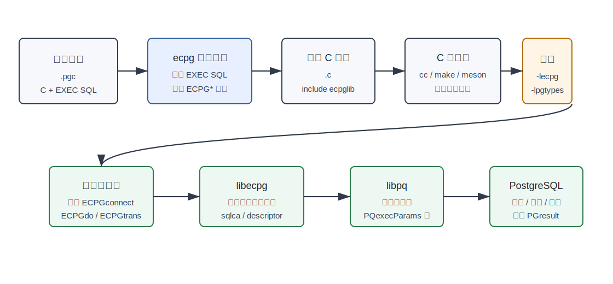
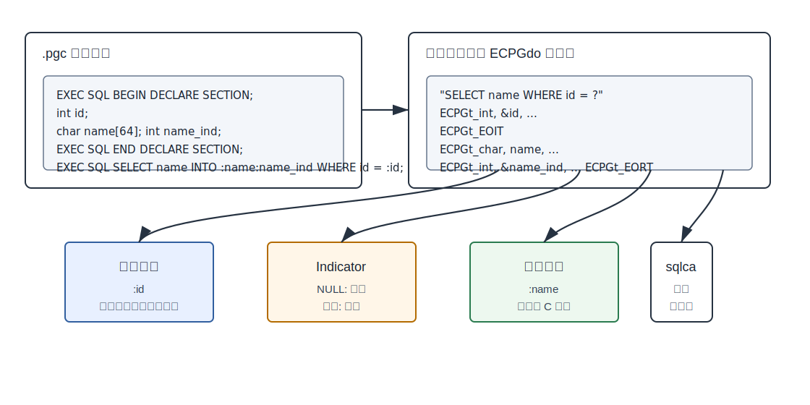
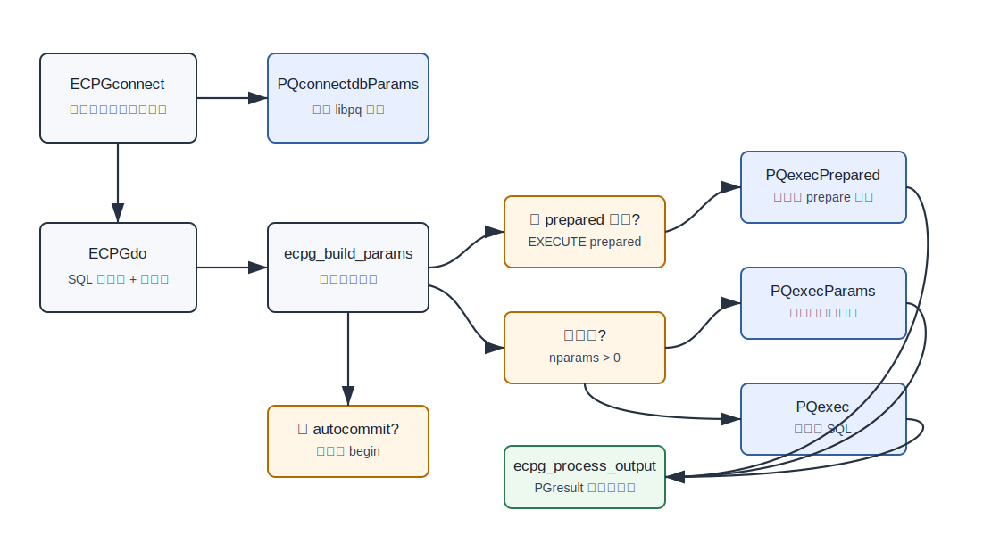
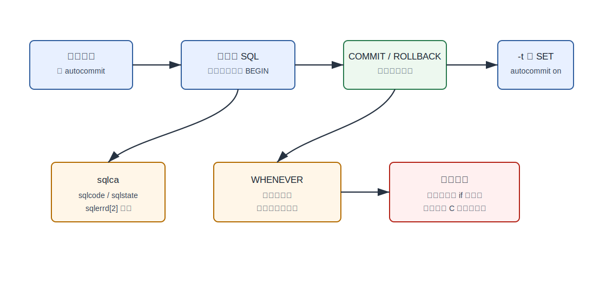
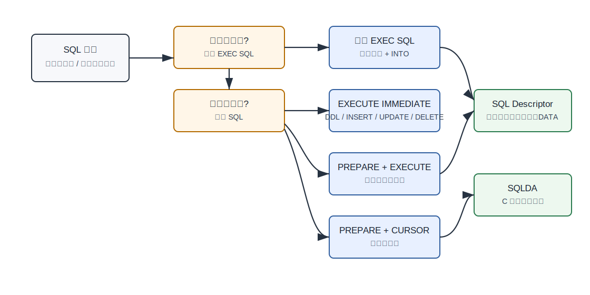

## 数据库筑基课 - ECPG

### 作者
digoal

### 日期
2026-06-08

### 标签
PostgreSQL , 应用开发者 , 数据库筑基课 , ECPG , Embedded SQL , libpq , C    

----

## 背景
   


这篇属于数据库筑基课里的“应用开发接口 + 客户端运行时机制”主题。ECPG 不是 PostgreSQL 后端的存储、索引或执行算子，而是 C 应用访问 PostgreSQL 的一种嵌入式 SQL 接口：开发者在 C 代码里写 `EXEC SQL ...;`，构建时由 `ecpg` 预处理器转成普通 C，再通过 `libecpg` 和 `libpq` 与数据库通信。

本地 `markdown/` 目录没有发现独立的“数据库筑基课大纲”文件，所以本文不强行引用不存在的大纲；后续如果项目补充大纲，可以在这里补上课程目录链接。

先从一个真实工程痛点切入：很多老核心系统、嵌入式系统、金融清结算程序、运营商计费程序仍然是 C/C++ 主体。应用团队既想保留 C 程序的结构和性能，又不希望每条 SQL 都手写 `PQexecParams()`、参数数组、结果转换、错误码判断和事务边界。ECPG 解决的就是这类“SQL 要写在 C 里，但不想把数据库访问写成低层协议代码”的问题。

本文主要依据本地 PostgreSQL 源码 `postgres`：

- 官方 ECPG 文档：[ecpg.sgml](../postgres/doc/src/sgml/ecpg.sgml)
- `ecpg` 命令参考：[ecpg-ref.sgml](../postgres/doc/src/sgml/ref/ecpg-ref.sgml)
- 预处理器源码：[src/interfaces/ecpg/preproc](../postgres/src/interfaces/ecpg/preproc)
- 运行时库源码：[src/interfaces/ecpg/ecpglib](../postgres/src/interfaces/ecpg/ecpglib)
- 类型库源码：[src/interfaces/ecpg/pgtypeslib](../postgres/src/interfaces/ecpg/pgtypeslib)
- ECPG 回归测试：[src/interfaces/ecpg/test](../postgres/src/interfaces/ecpg/test)
- 项目 codebase 说明：[postgres/CLAUDE.md](../postgres/CLAUDE.md)

DeepWiki repoName 使用用户补充的 `postgres/postgres`。DeepWiki 架构摘要与本地源码一致：ECPG 由 `src/interfaces/ecpg/preproc/` 的预处理器、`src/interfaces/ecpg/ecpglib/` 的运行时库、`src/interfaces/ecpg/pgtypeslib/` 的类型库、`src/interfaces/ecpg/compatlib/` 的兼容库组成，运行时经 `libpq` 访问后端。重要结论仍以官方文档和源码为准。

## 一、它解决什么问题？

ECPG 解决的是 C 程序中的数据库访问工程化问题，不是让 SQL 执行更快。

不用 ECPG 时，C 程序通常直接调用 libpq：

- 自己组装 SQL 字符串或参数数组。
- 自己维护连接、事务、prepared statement。
- 自己从 `PGresult` 取列、转类型、处理 NULL。
- 自己判断 SQLSTATE、行数、游标结束。
- 自己避免 SQL 注入、字符转义、内存释放错误。

ECPG 把这件事变成另一种写法：

```c
EXEC SQL BEGIN DECLARE SECTION;
int id;
char name[64];
int name_ind;
EXEC SQL END DECLARE SECTION;

id = 42;
EXEC SQL SELECT name INTO :name:name_ind
  FROM customer
  WHERE customer_id = :id;
```

它牺牲的是构建链路和语法自由度：源码不再是直接交给 C 编译器，而是先过 `ecpg`；宿主变量必须被预处理器认识；部分 C++ 构造、用户自定义 SQL 类型、多维数组、动态 SQL 元数据都需要额外处理。

一句话：ECPG 用“预编译 + 运行时库”换取 C 程序里更接近 SQL 标准的数据库访问模型。

## 二、它是什么？

ECPG 是 PostgreSQL 的 Embedded SQL in C 实现。官方文档把它描述为嵌入式 SQL 包：`.pgc` 源码先通过 embedded SQL C preprocessor 转成 `.c`，生成的 C 程序调用 `libecpg`，`libecpg` 再通过 `libpq` 使用普通前后端协议访问 PostgreSQL。

从组件看，它有五层：

| 层次 | 目录或文件 | 作用 |
|---|---|---|
| ECPG 语法与预处理器 | `src/interfaces/ecpg/preproc/` | 解析 `EXEC SQL`、宿主变量、cursor、WHENEVER、descriptor，输出普通 C |
| 运行时库 `libecpg` | `src/interfaces/ecpg/ecpglib/` | 连接、事务、参数构造、执行 SQL、结果回填、错误处理 |
| 类型库 `libpgtypes` | `src/interfaces/ecpg/pgtypeslib/` | numeric、decimal、date、timestamp、interval 等 C 侧类型函数 |
| 兼容库 | `src/interfaces/ecpg/compatlib/` | Informix 兼容函数和常量 |
| 底层客户端库 | `src/interfaces/libpq/` | 真正和 PostgreSQL 后端通信 |



图 1 说明：ECPG 的核心不在后端执行器，而在客户端构建链路和运行时库。`.pgc` 经 `ecpg` 变成 `.c`，再编译链接 `libecpg`；运行时 `libecpg` 调用 `libpq`，后端看到的仍是普通 SQL 请求。

## 三、核心原理

### 3.1 预处理器：把 `EXEC SQL` 改写成 C 函数调用

`doc/src/sgml/ref/ecpg-ref.sgml` 明确说明：`ecpg` 是 embedded SQL C preprocessor，会把带嵌入 SQL 的 C 程序转换成普通 C 代码，方式是把 SQL invocation 替换成特殊函数调用。

源码入口在 [preproc/ecpg.c](../postgres/src/interfaces/ecpg/preproc/ecpg.c)。这个文件处理命令行选项，例如：

- `-C INFORMIX|INFORMIX_SE|ORACLE`：兼容模式。
- `-r no_indicator|prepare|questionmarks`：运行时行为。
- `-t`：打开 autocommit。
- `-I`、`-D`、`-o`：include 路径、预处理宏、输出文件。

真正输出 C 调用的逻辑在 [preproc/output.c](../postgres/src/interfaces/ecpg/preproc/output.c)。例如 `output_statement()` 会生成形如：

```c
ECPGdo(__LINE__, compat, force_indicator, connection, questionmarks,
       ECPGst_normal, "select ...",
       input variables..., ECPGt_EOIT,
       output variables..., ECPGt_EORT);
```

`output_prepare_statement()` 会生成 `ECPGprepare()`，`output_deallocate_prepare_statement()` 会生成 `ECPGdeallocate()`。`WHENEVER` 不是普通 C 运行时代码，而是预处理器在后续 SQL 调用后插入 `if (sqlca...) ...`。

### 3.2 宿主变量：SQL 与 C 之间的边界表

ECPG 里的 C 变量叫 host variables。官方文档要求：要被 SQL 使用的变量需要出现在 `EXEC SQL BEGIN DECLARE SECTION; ... EXEC SQL END DECLARE SECTION;` 中，或者用 `EXEC SQL int i = 4;` 这类隐式声明写法。

预处理器看到 `:id`、`:name` 这类变量后，会把 SQL 中的位置转成占位符，把 C 变量的类型、地址、长度、数组大小、indicator 信息作为参数交给 `ECPGdo()`。



图 2 说明：`EXEC SQL SELECT ... WHERE id = :id` 并不是简单字符串替换。预处理器把 `:id` 变成输入变量描述，把 `:name:name_ind` 变成输出变量和 indicator 描述；运行时再完成参数绑定、结果取值和 NULL/截断标记。

这也是 ECPG 的主要价值之一：应用不用手动把每个 C 变量转成 libpq 参数数组，也不用对每个输出字段手写 `PQgetvalue()` 和类型转换。

### 3.3 运行时库：最终还是走 libpq

[ecpglib.h](../postgres/src/interfaces/ecpg/include/ecpglib.h) 暴露了客户端可见的运行时接口，包括：

- `ECPGconnect()` / `ECPGdisconnect()`
- `ECPGdo()`
- `ECPGprepare()` / `ECPGdeallocate()`
- `ECPGtrans()`
- `ECPGget_PGconn()`
- `ECPGtransactionStatus()`
- descriptor 相关函数

[ecpglib/connect.c](../postgres/src/interfaces/ecpg/ecpglib/connect.c) 的 `ECPGconnect()` 会解析 ECPG 的连接目标，把 dbname、host、port、user、password、options 转成 libpq 参数数组，然后调用 `PQconnectdbParams()`。

[ecpglib/execute.c](../postgres/src/interfaces/ecpg/ecpglib/execute.c) 是执行路径核心：

- `ecpg_build_params()` 把输入宿主变量转成 `paramvalues`、`paramlengths`、`paramformats`，供 `PQexecParams()` 使用。
- `ecpg_execute()` 根据语句类型和参数个数选择 `PQexecPrepared()`、`PQexecParams()` 或 `PQexec()`。
- `ecpg_process_output()` 根据 `PGresult` 状态，把结果写回宿主变量、SQL descriptor 或 SQLDA，并维护 `sqlca.sqlerrd[2]` 等状态。



图 3 说明：ECPG 的安全边界要具体看路径。有输入宿主变量时，运行时会构造参数数组并使用 `PQexecParams()` 或 `PQexecPrepared()`；无参数普通 SQL 才走 `PQexec()`。如果应用自己在运行时拼接 SQL 字符串再 `EXECUTE IMMEDIATE`，风险仍然回到字符串拼接本身。

### 3.4 事务：默认不是 autocommit

ECPG 默认模式下，语句只有在 `EXEC SQL COMMIT` 时才提交。官方文档说明可以通过 `ecpg -t` 或 `EXEC SQL SET AUTOCOMMIT TO ON` 打开 autocommit；否则需要显式 `COMMIT` 或 `ROLLBACK`。

源码也能看到这个边界：[execute.c](../postgres/src/interfaces/ecpg/ecpglib/execute.c) 的 `ecpg_autostart_transaction()` 会在连接空闲且非 autocommit 时自动执行 `begin transaction`。[misc.c](../postgres/src/interfaces/ecpg/ecpglib/misc.c) 的 `ECPGtrans()` 负责提交、回滚、两阶段事务相关命令。

这和很多应用开发者熟悉的 `psql` 默认 autocommit 不一样。迁移老 C 程序或排查锁等待时，必须先确认 ECPG 程序是否忘了提交。

### 3.5 错误处理：`sqlca` 是状态载体，`WHENEVER` 是预处理指令

[sqlca.h](../postgres/src/interfaces/ecpg/include/sqlca.h) 定义了 SQL communication area。重要字段包括：

- `sqlca.sqlcode`：0 表示成功，正数常用于无数据，负数表示错误。
- `sqlca.sqlstate`：五字符 SQLSTATE，新程序应优先使用。
- `sqlca.sqlerrm.sqlerrmc`：错误消息，长度有限，可能截断。
- `sqlca.sqlerrd[2]`：处理或返回的行数。
- `sqlca.sqlwarn[0]`、`sqlca.sqlwarn[1]`：警告和字符截断标记。

多线程程序中，每个线程会自动获得自己的 `sqlca`。源码 [ecpglib/misc.c](../postgres/src/interfaces/ecpg/ecpglib/misc.c) 使用 pthread key 实现 `ECPGget_sqlca()`。

`EXEC SQL WHENEVER SQLERROR ...`、`WHENEVER SQLWARNING ...`、`WHENEVER NOT FOUND ...` 的关键坑是：它是预处理器指令，不是 C 的运行时作用域。官方文档特别提醒，它按源码中出现的位置影响后续 embedded SQL 语句，不按 C 的 `if`、函数调用或块级作用域动态生效。



图 4 说明：ECPG 的事务默认、错误状态和 `WHENEVER` 都容易被 C 程序员误解。`WHENEVER` 最适合简单循环或样例程序；生产程序更建议显式检查 `sqlca.sqlstate`、`sqlca.sqlcode` 和业务状态，尤其是需要完整事务重试的场景。

### 3.6 动态 SQL：从 `EXECUTE IMMEDIATE` 到 descriptor

ECPG 支持动态 SQL，但要按结果形态选工具：

- 没有结果集的运行时 SQL：`EXEC SQL EXECUTE IMMEDIATE :stmt;`
- 有输入参数、可复用：`PREPARE` + `EXECUTE ... USING`
- 单行结果：`EXECUTE ... INTO ... USING`
- 多行结果：`PREPARE` + `DECLARE CURSOR` + `OPEN ... USING` + `FETCH`
- 列数或类型运行时才知道：SQL descriptor 或 SQLDA

官方文档明确说：`EXECUTE IMMEDIATE` 适合 DDL、`INSERT`、`UPDATE`、`DELETE` 等不返回结果集的语句，不能用于取数据的 `SELECT`。多行结果要用 cursor，或者在特定场景用数组宿主变量。

SQL descriptor 把一行数据和元数据组织起来，能通过 `COUNT`、`NAME`、`TYPE`、`LENGTH`、`DATA`、`INDICATOR` 等字段读取结果信息。它适合处理“查询列在运行期才知道”的动态 SQL。



图 5 说明：动态 SQL 不是一个单一功能，而是一组按结果形态分流的工具。固定 SQL 用宿主变量最简单；无结果动态 SQL 用 `EXECUTE IMMEDIATE`；有参数和结果集时应走 `PREPARE`、`EXECUTE`、cursor；结果元数据未知时再引入 SQL descriptor 或 SQLDA。

### 3.7 类型映射：简单类型直接映射，复杂类型走 pgtypes

ECPG 文档列出了 PostgreSQL 类型到 C 宿主变量类型的映射。例如：

| PostgreSQL 类型 | 常用 C 宿主变量 |
|---|---|
| `smallint` | `short` |
| `integer` | `int` |
| `bigint` | `long long int` |
| `real` | `float` |
| `double precision` | `double` |
| `varchar(n)`、`text` | `char[n+1]` 或 `VARCHAR[n+1]` |
| `boolean` | `bool` |
| `bytea` | `char *` 或 `bytea[n]` |
| `numeric`、`decimal` | `numeric`、`decimal`，通过 `pgtypes` 函数访问 |
| `date`、`timestamp`、`interval` | 对应 ECPG 特殊类型，通过 `pgtypes` 函数访问 |

要特别注意字符串：`char[]` 的长度要自己保证，否则可能溢出；`VARCHAR[n]` 会被预处理器转换成带 `len` 和 `arr` 的 struct，`arr` 包含终止零字节，`len` 不包含终止零字节。

`numeric`、`interval` 等复杂类型通常需要堆内存和 `PGTYPESnumeric_new()`、`PGTYPESinterval_new()`、`PGTYPESchar_free()` 等函数。不要把它们当普通 C 标量。

## 四、横向对比

| 维度 | ECPG | 直接 libpq | psql 脚本 | ODBC/JDBC |
|---|---|---|---|---|
| 主要目标 | C 程序中写嵌入式 SQL | C 程序直接调用 PostgreSQL 客户端 API | 交互或批处理 SQL | 标准化驱动接口 |
| 构建方式 | `.pgc` 先预处理成 `.c` | 普通 C 编译 | 不编译 | 依语言和驱动 |
| 参数绑定 | 宿主变量，预处理器生成描述 | 手写 `PQexecParams()` 参数数组 | psql 变量和 SQL 文本 | 驱动 prepared statement |
| 结果处理 | 宿主变量、数组、cursor、descriptor | 手写 `PGresult` 解析 | 文本输出为主 | ResultSet / cursor API |
| 事务默认 | 默认非 autocommit | 取决于应用 SQL | psql 默认 autocommit | 常见默认 autocommit |
| 可移植性 | 接近 SQL Embedded C 标准，仍有 PostgreSQL 差异 | PostgreSQL 专属 | PostgreSQL 专属 | 跨数据库较好但语义差异大 |
| 适合场景 | 老 C 系统、嵌入式 SQL、迁移 Informix/Oracle Pro*C 风格程序 | 新 C 程序、需要完全控制协议和异步能力 | 运维脚本、临时任务 | 企业应用、跨语言生态 |
| 不适合场景 | 动态复杂查询构造、现代服务端应用、需要 libpq 全能力 | 希望少写底层代码 | 强事务应用逻辑 | 纯 C 低依赖程序 |

表里的关键原因是：ECPG 把很多 libpq 细节藏进预处理器和 `libecpg`，但换来的是构建链路、语法限制和调试方式变化。新项目如果已经能接受直接 libpq、JDBC、Go/Rust/Python 驱动，通常不必为了“看起来像 SQL”引入 ECPG；但迁移和维护老 C Embedded SQL 系统时，ECPG 很有价值。

## 五、效果如何？

ECPG 的收益不是“查询更快”，而是工程复杂度下降：

- C 源码里的 SQL 更接近业务语义。
- 宿主变量减少手写参数绑定和结果转换。
- cursor、indicator、descriptor 提供了标准化处理模式。
- `sqlca` 和 `SQLSTATE` 给错误处理提供统一状态载体。
- `-r prepare` 可以让 `libecpg` 缓存 prepared statement，但这仍要按 workload 验证。

代价也很明确：

- 构建链路多一步预处理，CI、Makefile、Meson、IDE 跳转都要适配。
- 预处理器只理解它支持的 C/C++ 构造。官方文档说 ECPG 原本为 C 编写，也能用于 C++，但尚不能识别所有 C++ 构造。
- 动态 SQL 如果自己拼接字符串，仍然有注入风险；ECPG 不能替你证明字符串安全。
- 复杂类型、数组、复合类型、用户自定义类型不一定能自然映射。
- 错误处理如果滥用 `WHENEVER STOP` 或 `GOTO`，可维护性会下降。
- ECPG 暴露 `ECPGget_PGconn()`，但官方文档提醒直接操作 ECPG 管理的 libpq handle 不是好主意。

## 六、实操 DEMO

本机有 PostgreSQL 18.3 的 `ecpg`：

```bash
ecpg --version
```

本次已验证两件事：

- 在 PostgreSQL 源码的 ECPG 回归测试目录 `src/interfaces/ecpg/test/sql` 下执行 `ecpg -o /private/tmp/ecpg-fetch.c fetch.pgc`，能生成包含 `ECPGconnect()`、`ECPGdo()`、`sqlca` 检查代码的 C 文件。
- 下方 `customer_demo.pgc` 的同等内容已用本机 PostgreSQL 18.3 的 `ecpg` 预处理，并通过 `cc -I"$(pg_config --includedir)"`、`-L"$(pg_config --libdir)" -lecpg` 完成编译链接。

数据库连接运行依赖本机服务、测试库和权限，本次没有执行运行时 SQL，也不伪造运行输出。

下面给一个最小可验证程序。保存为 `customer_demo.pgc`：

```c
#include <stdio.h>

EXEC SQL WHENEVER SQLERROR SQLPRINT;

int
main(void)
{
  EXEC SQL BEGIN DECLARE SECTION;
  int id = 1;
  char name[64];
  int name_ind;
  EXEC SQL END DECLARE SECTION;

  EXEC SQL CONNECT TO testdb;
  EXEC SQL CREATE TEMP TABLE ecpg_customer(id int primary key, name text);
  EXEC SQL INSERT INTO ecpg_customer VALUES (1, 'alice');

  EXEC SQL SELECT name INTO :name:name_ind
    FROM ecpg_customer
    WHERE id = :id;

  if (name_ind < 0)
    printf("name is NULL\n");
  else
    printf("name=%s\n", name);

  EXEC SQL COMMIT;
  EXEC SQL DISCONNECT ALL;
  return 0;
}
```

预处理、编译、链接：

```bash
ecpg customer_demo.pgc
cc -I"$(pg_config --includedir)" -c customer_demo.c
cc -o customer_demo customer_demo.o -L"$(pg_config --libdir)" -lecpg
```

运行前需要确保 `testdb` 存在，且当前用户有连接权限。运行输出取决于本机数据库环境；本文不写固定输出。

观察预处理结果时，重点看三类内容：

```c
#include <ecpglib.h>
#include <ecpgerrno.h>
#include <sqlca.h>
```

```c
ECPGconnect(__LINE__, ...);
ECPGdo(__LINE__, ..., "select name from ecpg_customer where id = ?", ...);
ECPGtrans(__LINE__, NULL, "commit");
```

```c
if (sqlca.sqlcode < 0) sqlprint();
```

这三段分别对应“自动 include 运行时库”“SQL 改写成运行时函数调用”“`WHENEVER SQLERROR SQLPRINT` 被展开成后续 SQL 后面的检查逻辑”。

## 七、最佳实践

面向数据库架构师：

- 把 ECPG 定位成客户端接口方案，不要把它和后端执行性能优化混在一起评估。
- 老系统迁移时，优先盘点事务默认、autocommit、indicator、动态 SQL 拼接、descriptor 使用方式。
- 对需要跨数据库迁移的系统，明确哪些是 SQL Embedded C 标准能力，哪些是 PostgreSQL、Informix 或 Oracle 兼容模式差异。

面向 DBA：

- 排查锁等待时，先检查 ECPG 程序是否默认非 autocommit 且忘记 `COMMIT`。
- 用 `ECPGdebug()` 可以看到 SQL 和参数日志，但生产使用要注意敏感数据泄露。
- 遇到 ECPG 动态 SQL，不要只审 SQL 文本，还要审运行时字符串来源和 `PREPARE/USING` 是否正确使用。
- 关注 `sqlca.sqlerrd[2]` 的行数语义：对 `INSERT/UPDATE/DELETE`、`FETCH` 和无数据场景要按文档验证。

面向业务开发者：

- 任何会进入 SQL 的业务值优先用宿主变量，不要拼接字符串。
- 字符串输出变量要留足长度；需要处理 NULL 时必须配 indicator。
- 多行结果用 cursor 或数组宿主变量，不要用单行 `SELECT INTO` 接多行。
- 新程序优先检查 `SQLSTATE`，少依赖非可移植的 `SQLCODE` 数字。
- `WHENEVER` 适合样例和简单流程，复杂业务里建议显式检查错误并集中处理事务回滚。

## 八、适合与不适合场景

适合：

- 既有 C/C++ 系统已经采用 embedded SQL 模式。
- 从 Informix ESQL/C、Oracle Pro*C 风格程序迁移到 PostgreSQL。
- 团队希望 C 源码保留接近 SQL 标准的写法，而不是直接管理 libpq 细节。
- SQL 结构大多稳定，参数和结果列在编译期可知。
- 需要 cursor、indicator、descriptor 这类嵌入式 SQL 模式。

不适合：

- 新 Web 服务或微服务，本来就有成熟语言驱动和 ORM/query builder。
- SQL 大量动态拼装，列数、类型、对象名高度可变，且没有清晰的 descriptor 设计。
- 需要 libpq 异步、pipeline、COPY 高级控制或协议级优化的场景。
- 主要用 C++ 复杂模板、宏和现代构造，预处理器难以稳定解析。
- 团队不愿维护额外预处理构建链路。

## 九、常见坑

1. 把 `WHENEVER` 当成 C 运行时作用域。

   它按源码位置影响后续 embedded SQL，不按 `if` 条件或函数调用动态生效。

2. 忘记默认非 autocommit。

   ECPG 默认需要 `EXEC SQL COMMIT`。长时间不提交会持有事务、锁和快照，影响 VACUUM 和并发。

3. `EXECUTE IMMEDIATE` 用来执行 `SELECT`。

   官方文档明确：它不能用于返回结果集的 SQL。单行结果用 `EXECUTE ... INTO`，多行结果用 cursor。

4. 字符串宿主变量长度不足。

   `char[]` 要自己保证空间，`VARCHAR[n]` 的 `arr` 需要包含终止零字节。截断会通过 indicator 或 `sqlwarn` 暴露，但前提是程序正确检查。

5. NULL 不配 indicator。

   没有 indicator 时，取到 NULL 可能变成错误；`-r no_indicator` 虽然存在，但它用特殊值表示 NULL，容易和真实业务值混淆。

6. 动态 SQL 重新引入注入风险。

   宿主变量安全，不代表 `sprintf(command, "... %s ...", user_input)` 安全。运行时字符串仍需走 `PREPARE` + `USING` 或严格白名单。

7. 混用 ECPG 管理的 `PGconn` 和 libpq。

   文档提供 `ECPGget_PGconn()`，但也提醒直接操作 ECPG 连接 handle 不是好主意。除非非常清楚状态机，否则不要绕过 `libecpg`。

8. 复杂 SQL 类型期望自动映射。

   多维 SQL 数组不直接支持；复合类型、用户自定义 base type 通常需要拆字段、转外部字符串，或写转换函数。

9. prepared statement 不释放。

   `PREPARE` 后不用时应 `DEALLOCATE PREPARE`。`-r prepare` 的自动缓存也需要按 SQL 形态和连接生命周期评估。

10. 预处理器版本和运行时库版本不一致。

   文档中的错误码说明提到：预处理器生成的内容如果运行时库不认识，可能是版本不兼容。构建和运行要使用同一 PostgreSQL 安装。

## 十、扩展问题

1. 如果把一个 ECPG 程序改写成直接 libpq，你需要补齐哪些功能：参数绑定、结果转换、事务、错误码、cursor、descriptor？
2. 对一个老 ECPG 程序做 SQL 注入审计，应如何区分宿主变量绑定和运行时字符串拼接？
3. 为什么 `WHENEVER` 作为预处理器指令会影响可维护性？你会怎样设计统一错误处理函数？
4. 默认非 autocommit 对连接池、长事务、VACUUM、锁等待有什么影响？
5. 如果一个查询列数运行时才知道，使用 SQL descriptor 和直接 `PGresult` 解析各有什么代价？

## 十一、扩展阅读

- PostgreSQL 官方文档：ECPG chapter，[doc/src/sgml/ecpg.sgml](../postgres/doc/src/sgml/ecpg.sgml)
- PostgreSQL 官方文档：`ecpg` 命令参考，[doc/src/sgml/ref/ecpg-ref.sgml](../postgres/doc/src/sgml/ref/ecpg-ref.sgml)
- ECPG 预处理器源码：[src/interfaces/ecpg/preproc/ecpg.c](../postgres/src/interfaces/ecpg/preproc/ecpg.c)，[src/interfaces/ecpg/preproc/output.c](../postgres/src/interfaces/ecpg/preproc/output.c)
- ECPG 运行时源码：[src/interfaces/ecpg/ecpglib/connect.c](../postgres/src/interfaces/ecpg/ecpglib/connect.c)，[src/interfaces/ecpg/ecpglib/execute.c](../postgres/src/interfaces/ecpg/ecpglib/execute.c)，[src/interfaces/ecpg/ecpglib/prepare.c](../postgres/src/interfaces/ecpg/ecpglib/prepare.c)，[src/interfaces/ecpg/ecpglib/misc.c](../postgres/src/interfaces/ecpg/ecpglib/misc.c)
- ECPG 头文件：[src/interfaces/ecpg/include/ecpglib.h](../postgres/src/interfaces/ecpg/include/ecpglib.h)，[src/interfaces/ecpg/include/sqlca.h](../postgres/src/interfaces/ecpg/include/sqlca.h)，[src/interfaces/ecpg/include/ecpgtype.h](../postgres/src/interfaces/ecpg/include/ecpgtype.h)
- ECPG 动态 SQL 限制说明：[src/interfaces/ecpg/README.dynSQL](../postgres/src/interfaces/ecpg/README.dynSQL)
- ECPG 回归测试：[src/interfaces/ecpg/test/sql](../postgres/src/interfaces/ecpg/test/sql)，[src/interfaces/ecpg/test/preproc](../postgres/src/interfaces/ecpg/test/preproc)，[src/interfaces/ecpg/test/thread](../postgres/src/interfaces/ecpg/test/thread)
- DeepWiki 补充查询：`postgres/postgres` 的架构摘要显示 ECPG 位于 `src/interfaces/ecpg`，由 preproc、ecpglib、pgtypeslib、compatlib 等部分组成，并通过 `libpq` 访问后端。
  
## 附录 
1、克隆代码  
```  
git clone --depth 1 https://github.com/postgres/postgres
```  
  
2、启用 codex, 使用 [数据库筑基课 skill](../skills/README.md).  
```
文章标题: 
  数据库筑基课 - ECPG 
项目源码(本地目录): 
  postgres
项目 codebase 文件名: 
  postgres/CLAUDE.md 
开源项目相关的 deepwiki repoName: 
  postgres/postgres
```

    
#### [PostgreSQL 解决方案集合](../201706/20170601_02.md "40cff096e9ed7122c512b35d8561d9c8")
  
  
#### [德哥 / digoal's Github - 公益是一辈子的事.](https://github.com/digoal/blog/blob/master/README.md "22709685feb7cab07d30f30387f0a9ae")
  
  
#### [About 德哥](https://github.com/digoal/blog/blob/master/me/readme.md "a37735981e7704886ffd590565582dd0")
  
  

  
