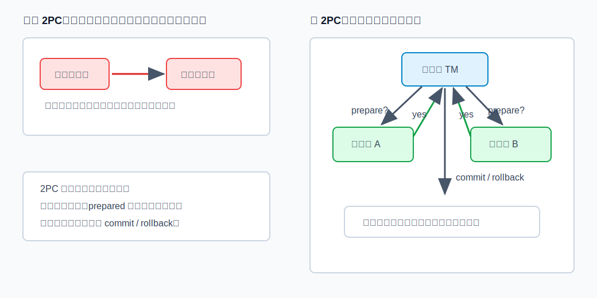
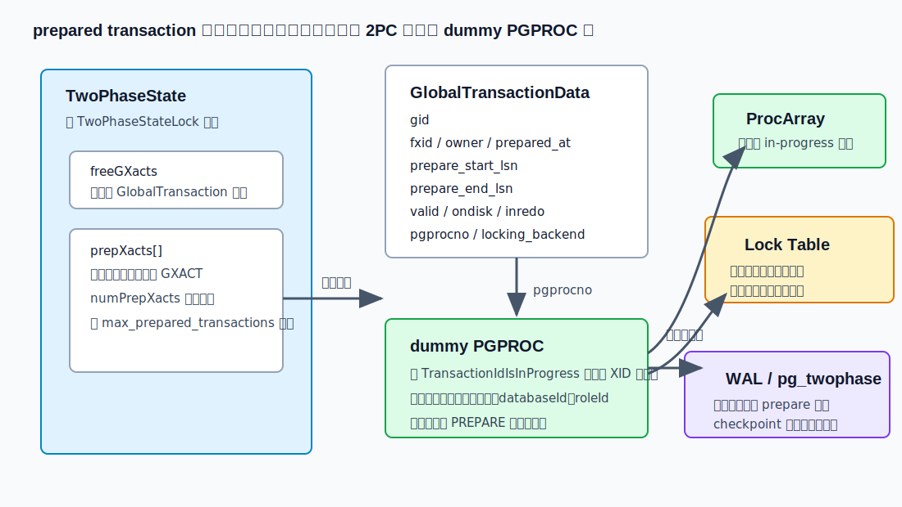
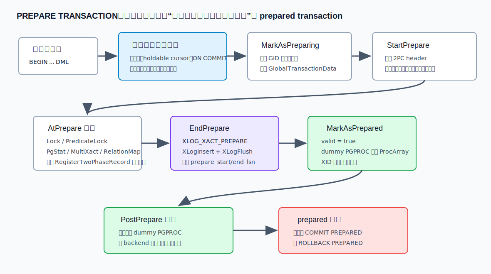
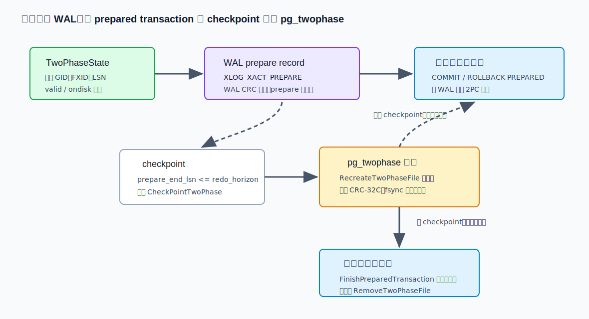
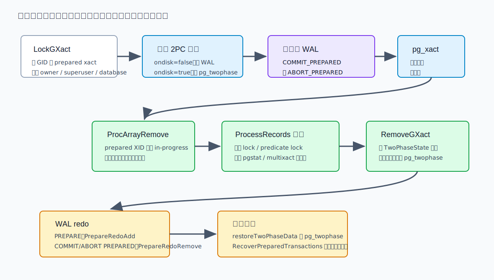
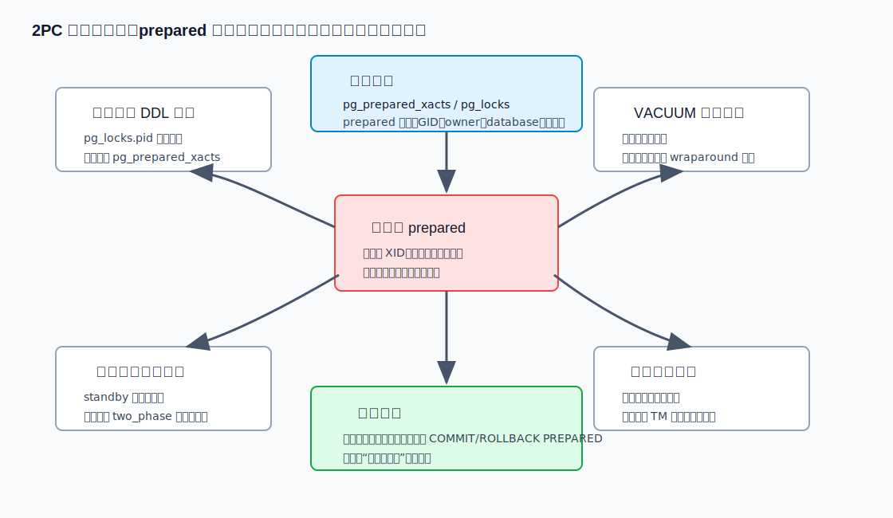

## 数据库筑基课 - 2PC

### 作者
digoal

### 日期
2026-06-08

### 标签
PostgreSQL , 应用开发者 , 数据库筑基课 , 事务 , 2PC , prepared transaction , WAL , pg_twophase    

----

## 背景
   


这篇属于数据库筑基课里的“事务机制 + 可靠性维护 + 场景实践”主题。2PC，也就是 two-phase commit，解决的是一个很朴素但很难绕开的工程问题：一次业务动作跨多个可提交资源时，怎样避免“有的资源提交了，有的资源回滚了”。

本地 `markdown/` 目录没有发现独立的“数据库筑基课大纲”文件，所以本文不强行引用不存在的大纲；后续如果项目补充大纲，可以在这里补上课程目录链接。

先看一个常见场景：

- 订单服务写 PostgreSQL。
- 库存服务写另一个 PostgreSQL 或消息系统。
- 支付服务写账务数据库。
- 业务要求三边要么都成功，要么都失败。

如果应用按顺序执行：

```text
提交订单库 -> 提交库存库 -> 提交支付库
```

中间任意一步网络超时、进程崩溃、节点切换，都会出现不确定状态。单库事务能保证一个 PostgreSQL 实例内部原子提交，但它不能天然保证多个数据库、消息队列、文件系统或外部账务系统一起原子提交。

2PC 的核心思想是把“提交”拆成两个阶段：

1. **prepare 阶段**：每个参与者先把本地事务推进到“我以后一定能提交或回滚”的状态，并把状态持久化。
2. **finish 阶段**：协调者根据所有参与者的 prepare 结果，统一发送 `commit` 或 `rollback` 决定。

PostgreSQL 支持的 SQL 命令是 `PREPARE TRANSACTION`、`COMMIT PREPARED`、`ROLLBACK PREPARED`。官方文档 `doc/src/sgml/xact.sgml` 明确说它面向外部事务管理器，模型接近 X/Open XA，但不实现一些较少使用的部分。`doc/src/sgml/ref/prepare_transaction.sgml` 也直接提醒：除非你在写事务管理器，否则通常不应该直接使用 `PREPARE TRANSACTION`。

本文以本地 PostgreSQL 源码 `postgres` 为主线。重要结论来自：

- 官方文档：`doc/src/sgml/xact.sgml`、`doc/src/sgml/ref/prepare_transaction.sgml`、`doc/src/sgml/ref/commit_prepared.sgml`、`doc/src/sgml/ref/rollback_prepared.sgml`、`doc/src/sgml/config.sgml`、`doc/src/sgml/system-views.sgml`、`doc/src/sgml/storage.sgml`、`doc/src/sgml/wal.sgml`。
- 源码：`src/backend/access/transam/twophase.c`、`twophase_rmgr.c`、`xact.c`、`src/include/access/twophase.h`、`twophase_rmgr.h`、`xact.h`、`src/backend/storage/lmgr/lock.c`、`predicate.c`、`src/backend/access/transam/multixact.c`、`src/backend/utils/activity/pgstat_relation.c`。
- 测试：`src/test/regress/sql/prepared_xacts.sql`、`src/test/regress/expected/prepared_xacts.out`、`src/test/recovery/t/009_twophase.pl`、`src/test/recovery/t/023_pitr_prepared_xact.pl`。
- DeepWiki repoName：`postgres/postgres`。本次用它查询了 PostgreSQL 2PC 架构脉络，只作为索引线索；正文关键结论均回到本地源码和官方文档验证。

## 一、它解决什么问题？

2PC 解决的是“跨资源原子决定”的问题，不是提升单条 SQL 性能，也不是替代普通事务。

如果只有一个 PostgreSQL 数据库，事务提交路径已经足够强：写 WAL、刷 WAL、更新事务状态、释放锁，崩溃恢复能根据 WAL 还原提交或回滚结论。问题出在多个资源之间：

- 资源 A 已经提交，资源 B 还没提交时协调者崩溃。
- 资源 A 返回超时，但它实际可能已经提交。
- 资源 B 崩溃重启后不知道自己是否应该提交。
- 应用为了补偿写一堆反向操作，但反向操作本身也可能失败。

2PC 把这个问题转化为两个更可控的约束：

- 参与者在 prepare 成功后，必须能在崩溃后恢复这个 prepared transaction。
- 协调者必须持久记录全局事务的最终决定，并尽快通知所有参与者结束 prepared 状态。



图 1 说明：没有 2PC 时，应用按顺序提交多个资源，会暴露“前一个已提交、后一个失败”的窗口。2PC 不是让问题消失，而是把风险集中到一个受协议约束的 prepared 状态。只要协调者的全局决定可靠保存，参与者崩溃重启后仍能根据 `COMMIT PREPARED` 或 `ROLLBACK PREPARED` 完成最终动作。

代价同样清楚：prepared transaction 会继续占用数据库内部状态。它通常会继续持有锁，继续影响 MVCC 清理边界，还需要 WAL、共享内存和可能的 `pg_twophase` 文件维护。所以 2PC 的正确姿势是“短时间悬挂、由事务管理器兜底关闭”，不是给应用做人工暂停按钮。

## 二、它是什么？

在 PostgreSQL 里，2PC 的用户可见模型由三个命令组成：

```sql
BEGIN;
-- 执行业务 DML
PREPARE TRANSACTION 'global-transaction-id';

-- 之后可以在其他会话中执行二选一：
COMMIT PREPARED 'global-transaction-id';
ROLLBACK PREPARED 'global-transaction-id';
```

`transaction_id` 也常叫 GID，Global Transaction Identifier。官方文档要求它是字符串字面量，小于 200 字节，且不能与当前已有 prepared transaction 重复。

从 PostgreSQL 内核角度看，一个 prepared transaction 主要包含：

- 一个全局 GID。
- 一个真实 XID，也就是本地事务 ID。
- 一个 `GlobalTransactionData` 共享内存条目。
- 一个 dummy `PGPROC`，让快照、锁管理和 `TransactionIdIsInProgress()` 继续感知该事务。
- 一份 2PC state data，包含 GID、子事务、待删除文件、缓存失效消息、锁、谓词锁、统计、MultiXact 等可恢复资源状态。
- 一个 `XLOG_XACT_PREPARE` WAL 记录。
- 如果跨过 checkpoint，可能还有 `PGDATA/pg_twophase` 下的状态文件。

`PREPARE TRANSACTION` 执行成功后，事务不再关联原会话。官方文档说它的效果对发起会话来说有点像 `ROLLBACK`：当前会话没有活动事务了，prepared transaction 的写入暂时不可见。后续任何会话，只要权限和数据库匹配，就可以执行 `COMMIT PREPARED` 或 `ROLLBACK PREPARED`。

这里有一个容易误解的点：prepared transaction 不是“已经提交一半”。在 `COMMIT PREPARED` 之前，它对其他事务仍然不是提交状态；但它也不是普通 running backend，因为原会话可以断开。PostgreSQL 用 dummy `PGPROC` 把它挂在全局事务、锁和可见性基础设施里。



图 2 说明：`TwoPhaseState` 里有 `prepXacts[]` 和 free list，容量由 `max_prepared_transactions` 控制。每个 `GlobalTransactionData` 记录 GID、FXID、owner、LSN、`valid/ondisk/inredo` 等状态，并通过 `pgprocno` 指向 dummy `PGPROC`。dummy `PGPROC` 进入 ProcArray 后，其他事务仍会把 prepared XID 当作 in-progress；锁表也能把原事务锁挂在这个 dummy 进程上。

## 三、核心原理

### 3.1 配置入口：默认禁用，容量固定

`doc/src/sgml/config.sgml` 说明，`max_prepared_transactions` 设置同一时刻能处于 prepared 状态的事务数。默认是 0，也就是禁用 prepared transaction。这个参数只能在服务器启动时设置。

如果你确实使用 2PC，文档建议通常至少设置到接近 `max_connections`，因为理论上每个会话都可能挂起一个 prepared transaction。standby 也要设置为不低于 primary，否则 standby 上的查询可能被拒绝。

源码 `twophase.c` 中 `MarkAsPreparing()` 会做三类关键检查：

- `max_prepared_xacts == 0` 时直接报错，提示设置 `max_prepared_transactions`。
- GID 长度不能超过 `GIDSIZE`。
- 在 `TwoPhaseState->prepXacts[]` 里查重，发现相同 GID 则报 `transaction identifier ... is already in use`。

所以 2PC 容量不是动态扩展的业务队列，而是启动时预留的共享内存资源。把它打开，就要把监控和清理流程一起打开。

### 3.2 PREPARE 路径：先收集状态，再写 WAL，最后脱离原会话

`src/backend/access/transam/xact.c` 的 `PrepareTransaction()` 是 `PREPARE TRANSACTION` 的主路径。核心顺序如下：

1. 触发 deferred trigger，关闭 portal，处理 `ON COMMIT` 动作。
2. 拒绝不适合 prepared 的事务，例如访问过临时对象、导出过 snapshot。
3. 调用 `MarkAsPreparing()` 保留 GID 和 `GlobalTransactionData`。
4. 调用 `StartPrepare()` 写 2PC header，收集子事务、待删除文件、事务统计、缓存失效消息等基础状态。
5. 调用一组 `AtPrepare_*()` 回调，把锁、谓词锁、统计、MultiXact、RelationMap 等资源写成 2PC record。
6. 调用 `EndPrepare()` 写 `XLOG_XACT_PREPARE` WAL record 并 `XLogFlush()`。
7. `MarkAsPrepared()` 把 dummy `PGPROC` 加入 ProcArray。
8. `PostPrepare_Locks()` 把事务锁迁移到 dummy `PGPROC`。
9. 清理原 backend 的事务、本地资源和快照，最后 `PostPrepare_Twophase()` 解除 `locking_backend`。



图 3 说明：`PREPARE TRANSACTION` 的真正边界在 `EndPrepare()`。`XLOG_XACT_PREPARE` 写入并刷盘后，如果数据库崩溃，WAL replay 能恢复这个 prepared transaction。因此源码注释说“If we crash now, we have prepared”。在此之前如果报错，事务可以走 abort 路径；在此之后，prepared 状态必须被后续 `COMMIT PREPARED` 或 `ROLLBACK PREPARED` 完成。

为什么 prepare 时必须刷 WAL？因为参与者对协调者说“yes”之后，就承诺未来能根据协调者决定提交或回滚。如果 prepare record 只在内存里，节点崩溃后忘掉这个事务，协调者再发 commit 时就会发现参与者丢失承诺，协议就破了。

### 3.3 2PC state data：不是只记一个 GID

PostgreSQL prepared transaction 要恢复的不只是“事务号”和“提交意愿”。它要能在之后提交或回滚时正确处理事务结束动作，所以 2PC state data 会保存多类资源。

`StartPrepare()` 里写入的 `TwoPhaseFileHeader` 包括：

- magic、总长度、事务 XID、database、owner、prepared_at、GID 长度。
- 子事务数量和子事务 XID。
- commit 时要删除的 relfilenode。
- abort 时要删除的 relfilenode。
- 事务性统计项。
- shared invalidation 消息。
- replication origin 相关 LSN 和时间戳。

`twophase_rmgr.c` 定义了内置 2PC resource manager：

| 资源管理器 | prepare 时记录什么 | commit/rollback prepared 时做什么 | 恢复时做什么 |
|---|---|---|---|
| Lock | 普通事务级锁的 `LOCKTAG` 和 lock mode | 释放 dummy PGPROC 持有的锁 | 重新获取锁 |
| PgStat | 事务性表统计增量 | 按 commit 或 abort 语义合并统计 | 不需要恢复 |
| MultiXact | 当前事务相关的 oldest member MultiXactId | 清理 prepared slot | 恢复 prepared slot |
| PredicateLock | Serializable 事务的谓词锁和事务记录 | 释放谓词锁 | 重建 SerializableXact 和谓词锁 |

`RegisterTwoPhaseRecord()` 把每条资源记录按 `TwoPhaseRecordOnDisk` 格式追加到 state data。`ProcessRecords()` 后续根据 rmid 调用 `twophase_recover_callbacks`、`twophase_postcommit_callbacks` 或 `twophase_postabort_callbacks`。

这解释了一个关键约束：2PC 不是 SQL 层简单打个标记。只要一个资源在普通事务结束时有特殊收尾逻辑，它就必须考虑 prepare、commit prepared、rollback prepared、crash recovery 的语义。

### 3.4 锁迁移：prepared transaction 继续持有锁

`lock.c` 的 `AtPrepare_Locks()` 会扫描本地 lock table，忽略 session-level lock 和 VXID lock，但会记录事务级锁。它还会把 fast-path relation lock 转入主锁表，确保 prepared transaction 可以被其他 backend 正确发现。

`PostPrepare_Locks()` 随后把这些锁从当前 `MyProc` 转移到 dummy `PGPROC`。源码注释强调，这必须在 `ProcArrayClearTransaction()` 之前完成，否则其他进程可能看到锁还在，但事务 XID 已经不像 running transaction，从而误判。

这也是生产风险来源。prepared transaction 原会话虽然结束了，但锁没有消失。`pg_locks` 中 prepared transaction 持有的锁可能没有普通 backend pid，需要结合 `pg_prepared_xacts` 查询 GID、owner 和 prepared time。

回归测试 `src/test/regress/sql/prepared_xacts.sql` 专门验证了这些行为：

- `PREPARE TRANSACTION` 后，原事务修改对普通查询不可见。
- `pg_prepared_xacts` 能看到 GID。
- `ROLLBACK PREPARED` 后修改消失。
- `COMMIT PREPARED` 后修改可见。
- 重复 GID 会失败。
- prepared transaction 持有的表锁会阻塞其他会话。
- prepared transaction 持有的行锁和 MultiXact 相关锁会继续阻塞 `FOR UPDATE NOWAIT`。

### 3.5 状态存储：短时间只靠 WAL，跨 checkpoint 才写 pg_twophase

`twophase.c` 文件头把生命周期写得很明确：

- `PREPARE TRANSACTION` 时，backend 只把 state data 写入 WAL，并在 `gxact->prepare_start_lsn` 中保存 prepare record 的起点。
- 如果在 checkpoint 之前执行 `COMMIT PREPARED`，backend 从 WAL 读取 state data。
- checkpoint 会把满足条件的 prepared transaction state data 复制到 `pg_twophase` 目录并 fsync。
- 如果 checkpoint 之后才执行 `COMMIT PREPARED`，backend 从 `pg_twophase` 文件读取 state data。

`CheckPointTwoPhase()` 的条件是：`gxact` 有效或来自 redo，尚未 `ondisk`，且 `prepare_end_lsn <= redo_horizon`。这类 prepared transaction 已经跨过 checkpoint 的 redo 边界，checkpoint 要负责把它们变成独立状态文件。



图 4 说明：短生命周期的 prepared transaction 通常不会写 `pg_twophase` 文件，这符合官方文档中“short-lived prepared transactions are stored only in shared memory and WAL”的描述。只有跨 checkpoint 的 prepared transaction 才需要 `pg_twophase` 文件。这也是为什么健康系统里 `pg_twophase` 通常应该很安静；如果这里长期有文件，说明存在长时间未结束的 prepared transaction。

`RecreateTwoPhaseFile()` 写文件时会重新计算 CRC-32C，并 fsync 文件。`CheckPointTwoPhase()` 还会无条件 fsync `pg_twophase` 目录，确保新建或删除的状态文件目录项持久化。`doc/src/sgml/wal.sgml` 也说明 `pg_twophase` 的 individual state files 受 CRC-32C 保护。

### 3.6 COMMIT PREPARED 和 ROLLBACK PREPARED：先写最终决定，再释放资源

`src/backend/access/transam/twophase.c` 的 `FinishPreparedTransaction(gid, isCommit)` 是二阶段结束主路径。核心顺序是：

1. `LockGXact()` 根据 GID 找到 prepared transaction，检查是否 busy、用户是否 owner 或 superuser、当前 database 是否匹配。
2. 根据 `gxact->ondisk` 决定从 `pg_twophase` 文件读 state data，还是用 `prepare_start_lsn` 从 WAL 读 state data。
3. 解析 header、GID、子事务、待删文件、统计、缓存失效消息。
4. 如果是 commit，调用 `RecordTransactionCommitPrepared()`；如果是 rollback，调用 `RecordTransactionAbortPrepared()`。
5. 写 `XLOG_XACT_COMMIT_PREPARED` 或 `XLOG_XACT_ABORT_PREPARED` WAL，并同步刷 WAL。
6. commit 路径用 `TransactionIdCommitTree()` 标记 `pg_xact`；abort 路径标记 aborted。
7. `ProcArrayRemove()` 移除 dummy `PGPROC`，让其他事务不再把这个 XID 看作 in-progress。
8. 删除该删的 relation files，处理统计和 shared invalidation。
9. 调用 2PC resource manager 的 postcommit 或 postabort 回调，释放锁和其他资源。
10. `RemoveGXact()` 从 `TwoPhaseState` 删除条目；如果有 `pg_twophase` 文件则删除。

`RecordTransactionCommitPrepared()` 源码中特别写明：prepared transaction 的 commit record 不能优化掉，因为这个事务至少已经写过 prepare WAL record。它也不支持 async commit，因为 prepared xact 的异步提交概念上没有意义。



图 5 说明：二阶段结束时，最终决定必须先成为 WAL 中可恢复事实，然后才改变 `pg_xact` 和 ProcArray 状态，最后释放锁和资源。恢复路径也围绕这三类 WAL record 工作：`XLOG_XACT_PREPARE` 用 `PrepareRedoAdd()` 重建 prepared 状态；`XLOG_XACT_COMMIT_PREPARED` 和 `XLOG_XACT_ABORT_PREPARED` 在 redo 后调用 `PrepareRedoRemove()` 清除对应状态。

### 3.7 崩溃恢复：重建 prepared transaction，而不是默认回滚

2PC 的特殊之处在于：普通未提交事务崩溃后会被视为 abort，但 prepared transaction 不能这样处理。它已经对外部事务管理器承诺“我准备好了”，必须在重启后继续等待最终决定。

相关恢复路径在 `twophase.c` 和 `xact.c`：

- `restoreTwoPhaseData()` 在恢复开始时扫描 `pg_twophase`，把状态加入 `TwoPhaseState`。
- WAL redo 遇到 `XLOG_XACT_PREPARE` 时，`xact_redo()` 调用 `PrepareRedoAdd()`。
- WAL redo 遇到 prepared commit/abort 时，先按事务结束记录处理，再调用 `PrepareRedoRemove()` 删除 `TwoPhaseState` 条目或 `pg_twophase` 文件。
- `PrescanPreparedTransactions()` 在启动阶段扫描 prepared xact，推进 `nextXid`，处理子事务范围，并清理未来或陈旧的 2PC 状态。
- `RecoverPreparedTransactions()` 在恢复结束前重建 dummy `PGPROC`、子事务关系和锁等状态。
- hot standby 还有 `StandbyRecoverPreparedTransactions()`，让 standby 查询能把 prepared transaction 当作仍活跃的事务处理。

恢复测试 `src/test/recovery/t/009_twophase.pl` 和 `023_pitr_prepared_xact.pl` 覆盖了 prepared transaction 在重启、PITR、primary/standby 等场景下的行为。`023_pitr_prepared_xact.pl` 的测试思路尤其直观：PITR 到一个 `PREPARE TRANSACTION` 之后的 restore point，恢复出来的节点仍需要显式 `COMMIT PREPARED` 才让数据可见。

## 四、横向对比

### 4.1 普通事务、2PC、补偿事务

| 维度 | 普通单库事务 | PostgreSQL 2PC | 应用补偿事务 |
|---|---|---|---|
| 主要目标 | 单个数据库内部原子提交 | 多个事务资源之间统一决定 | 失败后用反向动作修正业务状态 |
| 协调者 | PostgreSQL 本身 | 外部事务管理器 | 应用服务或工作流系统 |
| 第一阶段 | 直接执行并等待提交 | `PREPARE TRANSACTION`，参与者持久保存可结束状态 | 执行业务正向动作 |
| 第二阶段 | `COMMIT` 或 `ROLLBACK` | `COMMIT PREPARED` 或 `ROLLBACK PREPARED` | 失败后执行补偿动作 |
| 崩溃恢复 | WAL 决定提交或回滚 | prepared 状态必须恢复并等待最终决定 | 依赖应用日志、幂等和人工兜底 |
| 锁与 MVCC 影响 | 事务结束后释放 | prepared 期间继续持有 | 通常不长时间持有数据库锁 |
| 适合场景 | 单实例强一致交易 | 金融、XA、中间件强一致跨资源提交 | 可接受最终一致、补偿语义明确的业务 |
| 不适合场景 | 跨多个独立资源原子提交 | 高延迟、长时间不确定、无事务管理器 | 不可逆外部动作或强原子账务 |

原因很简单：普通事务没有跨资源投票能力；补偿事务不要求所有资源在同一原子点提交，但要求业务能承受“先错后补”；2PC 提供更强的原子提交语义，但把锁、XID、恢复和协调者可靠性问题都带进来了。

### 4.2 PostgreSQL 2PC 与逻辑复制 two_phase

| 维度 | 本文 2PC prepared transaction | 逻辑复制 `two_phase` |
|---|---|---|
| 用户入口 | `PREPARE TRANSACTION`、`COMMIT PREPARED`、`ROLLBACK PREPARED` | subscription 或 replication slot 的 `two_phase` 配置 |
| 主要目标 | 本地作为 XA 参与者支持外部全局事务 | 复制 prepared transaction 的 prepare/commit/rollback 语义 |
| 核心状态 | `TwoPhaseState`、WAL、`pg_twophase`、dummy PGPROC | logical decoding 和 apply worker 的 prepared event |
| 风险 | prepared 事务忘记关闭，锁和 VACUUM 边界被拖住 | 初始同步、slot 状态和 apply 端 prepared transaction 管理更复杂 |
| 适合场景 | 外部事务管理器协调多个资源 | 需要下游也按 2PC 边界处理事务 |

本文重点是 PostgreSQL 作为事务参与者的内核 2PC。逻辑复制 two-phase 是另一个层次：它决定 WAL decoding 和 subscriber 是否按 prepare/commit prepared 事件复制，而不是替代本地 `PREPARE TRANSACTION` 语义。

## 五、效果如何？

2PC 的收益：

- **跨资源原子决定**：参与者 prepare 成功后，即使崩溃也能恢复并等待最终决定。
- **会话解耦**：原会话执行 `PREPARE TRANSACTION` 后可以退出，其他会话可按权限结束该事务。
- **恢复语义明确**：`XLOG_XACT_PREPARE`、`XLOG_XACT_COMMIT_PREPARED`、`XLOG_XACT_ABORT_PREPARED` 把 prepare 与最终决定都纳入 WAL。
- **资源状态可恢复**：锁、谓词锁、MultiXact、统计、缓存失效等不是靠内存侥幸保留，而是通过 2PC records 和 callbacks 处理。

2PC 的成本：

- **额外 WAL**：prepare、commit prepared 或 abort prepared 都需要 WAL。prepared commit 不能优化掉。
- **共享内存预留**：`max_prepared_transactions` 需要启动时确定，太小会拒绝 prepare，太大增加资源预留。
- **长时间锁占用**：prepared transaction 会继续持有事务锁，DDL 和 DML 都可能被阻塞。
- **MVCC 清理边界后退**：prepared XID 仍被认为 in-progress，会影响 `VACUUM` 清理旧版本和冻结推进。
- **运维复杂度上升**：需要监控、告警、事务管理器日志和故障恢复流程。人工误提交或误回滚可能直接制造业务账务错误。

这就是为什么 PostgreSQL 官方文档建议，如果不用 prepared transaction，最好把 `max_prepared_transactions` 保持为 0，避免误创建后被遗忘。



图 6 说明：2PC 的主要生产风险不是 prepare 很慢，而是 prepared 状态被长期遗忘。它会同时影响锁等待、VACUUM、复制、恢复和业务一致性。DBA 的观测入口通常是 `pg_prepared_xacts`、`pg_locks`、事务年龄、应用事务管理器日志，以及 standby 或 logical replication 的 two-phase 状态。

## 六、实操 DEMO

以下 SQL 是最小可验证实验。为了避免污染本地环境，本次写作没有启动 PostgreSQL 实例执行这些 SQL；示例按 PostgreSQL 官方语法和回归测试写法整理，不提供伪造输出。执行前必须确认测试库的 `max_prepared_transactions > 0`。

### 1. 最小 prepare、rollback、commit

```sql
SHOW max_prepared_transactions;

CREATE TABLE demo_2pc(id int primary key, note text);

BEGIN;
INSERT INTO demo_2pc VALUES (1, 'prepared but not visible');
PREPARE TRANSACTION 'demo_2pc_gid_1';

SELECT * FROM demo_2pc;

SELECT transaction, gid, prepared, owner, database
FROM pg_prepared_xacts
WHERE gid = 'demo_2pc_gid_1';

ROLLBACK PREPARED 'demo_2pc_gid_1';

SELECT * FROM demo_2pc;

BEGIN;
INSERT INTO demo_2pc VALUES (2, 'commit prepared');
PREPARE TRANSACTION 'demo_2pc_gid_2';

COMMIT PREPARED 'demo_2pc_gid_2';

SELECT * FROM demo_2pc ORDER BY id;

DROP TABLE demo_2pc;
```

你应该观察到：

- `PREPARE TRANSACTION` 后，当前会话已经没有活动事务。
- prepared 事务的写入在 `COMMIT PREPARED` 前不可见。
- `pg_prepared_xacts` 能看到 GID。
- `ROLLBACK PREPARED` 会取消写入。
- `COMMIT PREPARED` 后写入才对普通查询可见。

### 2. 观察 prepared transaction 持有锁

会话 1：

```sql
CREATE TABLE demo_2pc_lock(id int primary key, note text);
INSERT INTO demo_2pc_lock VALUES (1, 'row');

BEGIN;
SELECT * FROM demo_2pc_lock WHERE id = 1 FOR SHARE;
PREPARE TRANSACTION 'demo_2pc_lock_gid';
```

会话 2：

```sql
SELECT * FROM demo_2pc_lock WHERE id = 1 FOR UPDATE NOWAIT;
```

预期会失败，因为行锁仍由 prepared transaction 持有。然后在任意有权限会话执行：

```sql
ROLLBACK PREPARED 'demo_2pc_lock_gid';
DROP TABLE demo_2pc_lock;
```

### 3. 查询长时间 prepared transaction 和锁

```sql
SELECT
  transaction,
  gid,
  prepared,
  now() - prepared AS age,
  owner,
  database
FROM pg_prepared_xacts
ORDER BY prepared;
```

关联锁：

```sql
SELECT
  p.gid,
  p.prepared,
  l.locktype,
  l.mode,
  l.granted,
  l.database,
  l.relation::regclass AS relation_name,
  l.page,
  l.tuple
FROM pg_locks AS l
JOIN pg_prepared_xacts AS p
  ON l.transactionid = p.transaction
ORDER BY p.prepared;
```

注意：不是所有 prepared transaction 持有的锁都只通过 `transactionid` 关联出来。排障时还需要查看 `pg_locks` 中 `pid IS NULL` 或等待链关系，并结合 GID、owner、database、应用事务管理器日志判断最终决定。

## 七、最佳实践

### 面向数据库架构师

1. **只有强一致跨资源提交才引入 2PC**  
   如果业务可以用幂等消息、outbox、补偿事务、Saga 或最终一致解决，就不要为了“看起来更强”直接上 2PC。2PC 强在原子决定，弱在阻塞窗口和恢复复杂度。

2. **必须有外部事务管理器**  
   PostgreSQL 只是参与者，不是全局协调者。协调者要持久记录全局事务、参与者列表、prepare 结果、最终决定和重试状态。没有这套日志，prepared transaction 一旦遗留，DBA 无法凭数据库状态安全判断该 commit 还是 rollback。

3. **GID 要可追踪**  
   GID 应包含业务全局事务号、参与者类型或 shard 信息，便于从 `pg_prepared_xacts` 反查协调者日志。不要用随机短字符串让排障人员猜谜。

4. **把 prepared 生命周期纳入 SLO**  
   例如正常应在秒级关闭，超过 1 分钟告警，超过 5 分钟进入人工确认流程。具体阈值取决于业务，但不应允许小时级、天级 prepared transaction 常态存在。

### 面向 DBA

1. **不用就保持关闭**  
   如果没有明确 2PC 需求，保持 `max_prepared_transactions = 0`。这是官方文档推荐的防误用策略。

2. **监控 `pg_prepared_xacts`**  
   至少监控数量、最大 age、owner、database、GID 分布。任何非预期 prepared transaction 都应触发调查。

3. **排查锁等待时不要只看 pid**  
   prepared transaction 可能没有普通 backend pid。遇到 `pg_locks.pid IS NULL` 或等待链断点时，要联查 `pg_prepared_xacts`。

4. **不要凭感觉结束 prepared transaction**  
   `COMMIT PREPARED` 和 `ROLLBACK PREPARED` 是业务最终决定，不是数据库清理命令。必须先查协调者日志或业务账务状态。

5. **standby 参数要匹配 primary**  
   `max_prepared_transactions` 在 standby 上应不低于 primary。否则 standby 查询可能因为无法处理 prepared transaction 而被限制。

### 面向业务开发者

1. **不要在普通应用代码里手写 2PC**  
   如果没有成熟事务管理器，应用直接写 `PREPARE TRANSACTION` 往往只会制造遗留事务。

2. **prepare 前减少锁和事务范围**  
   事务内不要混入长查询、用户交互、远程 API 等不确定等待。先把外部调用前置或后置，数据库事务只包必须原子化的最小写入。

3. **处理所有不确定返回**  
   `COMMIT PREPARED` 超时不等于失败。应用必须按 GID 查询参与者状态和协调者日志，而不是盲目重试正向业务。

4. **保证幂等和可重入**  
   协调者重发 `COMMIT PREPARED` 或 `ROLLBACK PREPARED` 时，要能处理“已经完成”“GID 不存在”“参与者恢复中”等状态。

## 八、适合与不适合场景

适合：

- 银行、清算、核心账务等跨资源原子性强于可用性的场景。
- 中间件或 XA 事务管理器明确协调多个 PostgreSQL、消息系统或其他 XA 资源。
- 全局事务数量可控、事务很短、参与者可靠、故障演练充分的系统。
- 能接受短暂阻塞，并有自动巡检和清理流程的高一致性系统。

不适合：

- 普通 Web 请求里跨多个微服务“顺手保证一致性”。
- prepared 状态可能因为人工审批、外部支付回调、用户输入而长期停留。
- 高频、大批量、长事务写入场景。
- 没有事务管理器日志，只有数据库本身可查的系统。
- 可用性优先、允许最终一致的业务。此时 outbox、事件驱动、幂等消费、补偿事务通常更容易运维。

## 九、常见坑

1. **把 `PREPARE TRANSACTION` 当成暂停事务**  
   这是最危险的误用。prepared transaction 会继续持有锁和 XID 边界，不适合人为挂起。

2. **忘记设置或错误设置 `max_prepared_transactions`**  
   默认 0 会直接禁用。primary 打开而 standby 太小，会影响 standby 查询。

3. **GID 无法追踪业务事务**  
   事故时看到 `gid='abc'` 没有意义。GID 应能定位全局事务日志。

4. **prepared transaction 长期不结束**  
   官方文档明确警告，长时间 prepared 会干扰 `VACUUM` 回收空间，极端情况下会造成 XID wraparound 风险，并且继续持有锁。

5. **误判 `COMMIT PREPARED` 超时**  
   网络超时只说明客户端没收到结果，不说明数据库没执行。必须查数据库和协调者日志。

6. **在含临时对象、导出 snapshot、LISTEN/NOTIFY 等事务中尝试 prepare**  
   官方文档和源码都有明确限制，因为这些状态与当前会话绑定，不适合转成可由其他会话完成的 prepared transaction。

7. **忽略 Serializable 与谓词锁状态**  
   Serializable 事务 prepare 前会做序列化失败检查，并保存谓词锁状态。2PC 不会绕过隔离级别的正确性成本。

8. **把 2PC 和补偿事务混用但没有边界**  
   同一业务里有些资源走 2PC，有些资源靠补偿，要明确原子边界。否则 2PC 给人的强一致错觉会掩盖外部系统的最终一致风险。

## 十、扩展问题

1. 如果 coordinated transaction 的最终决定已经写入协调者日志，但所有参与者中有一个永久丢失数据，2PC 能不能自动修复业务一致性？
2. 为什么 PostgreSQL 要用 dummy `PGPROC`，而不是简单在 `pg_prepared_xacts` 里放一行元数据？
3. `PREPARE TRANSACTION` 后写入暂时不可见，但锁仍然存在。这对 DDL、VACUUM、索引维护分别意味着什么？
4. 如果业务可以接受最终一致，outbox + 幂等消费相比 2PC 少了哪些数据库内核压力，又多了哪些应用复杂度？
5. 在逻辑复制链路中启用 two-phase 后，subscriber 上的 prepared transaction 应该由谁监控和清理？

## 十一、扩展阅读

- PostgreSQL 官方事务文档：`postgres/doc/src/sgml/xact.sgml`
- `PREPARE TRANSACTION` 官方文档：`postgres/doc/src/sgml/ref/prepare_transaction.sgml`
- `COMMIT PREPARED` 官方文档：`postgres/doc/src/sgml/ref/commit_prepared.sgml`
- `ROLLBACK PREPARED` 官方文档：`postgres/doc/src/sgml/ref/rollback_prepared.sgml`
- `max_prepared_transactions` 配置：`postgres/doc/src/sgml/config.sgml`
- `pg_prepared_xacts` 系统视图：`postgres/doc/src/sgml/system-views.sgml`
- 数据目录 `pg_twophase`：`postgres/doc/src/sgml/storage.sgml`
- WAL 与 `pg_twophase` CRC 说明：`postgres/doc/src/sgml/wal.sgml`
- 2PC 核心实现：`postgres/src/backend/access/transam/twophase.c`
- 2PC resource manager 表：`postgres/src/backend/access/transam/twophase_rmgr.c`
- 事务状态机与 prepare 主路径：`postgres/src/backend/access/transam/xact.c`
- WAL transaction record opcode：`postgres/src/include/access/xact.h`
- 锁的 2PC prepare、recover、postcommit/postabort：`postgres/src/backend/storage/lmgr/lock.c`
- Serializable 谓词锁的 2PC 支持：`postgres/src/backend/storage/lmgr/predicate.c`
- MultiXact 的 2PC 支持：`postgres/src/backend/access/transam/multixact.c`
- 事务统计的 2PC 支持：`postgres/src/backend/utils/activity/pgstat_relation.c`
- 回归测试：`postgres/src/test/regress/sql/prepared_xacts.sql`
- 预期输出：`postgres/src/test/regress/expected/prepared_xacts.out`
- 恢复测试：`postgres/src/test/recovery/t/009_twophase.pl`
- PITR prepared transaction 测试：`postgres/src/test/recovery/t/023_pitr_prepared_xact.pl`
- DeepWiki：repoName `postgres/postgres`，用于辅助梳理 2PC 相关源码入口；关键事实以本地源码和官方文档为准。
  
## 附录 
1、克隆代码  
```  
git clone --depth 1 https://github.com/postgres/postgres
```  
  
2、启用 codex, 使用 [数据库筑基课 skill](../skills/README.md).  
```
文章标题: 
  数据库筑基课 - 2PC 
项目源码(本地目录): 
  postgres
项目 codebase 文件名: 
  postgres/CLAUDE.md 
开源项目相关的 deepwiki repoName: 
  postgres/postgres
```
    
#### [PostgreSQL 解决方案集合](../201706/20170601_02.md "40cff096e9ed7122c512b35d8561d9c8")
  
  
#### [德哥 / digoal's Github - 公益是一辈子的事.](https://github.com/digoal/blog/blob/master/README.md "22709685feb7cab07d30f30387f0a9ae")
  
  
#### [About 德哥](https://github.com/digoal/blog/blob/master/me/readme.md "a37735981e7704886ffd590565582dd0")
  
  

  
