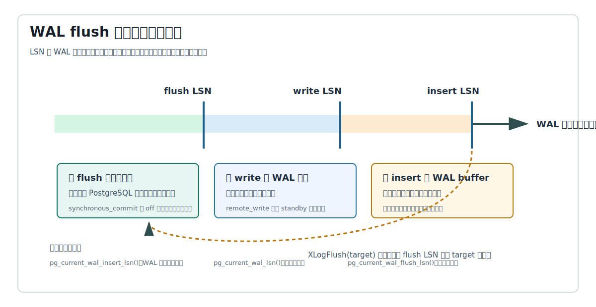
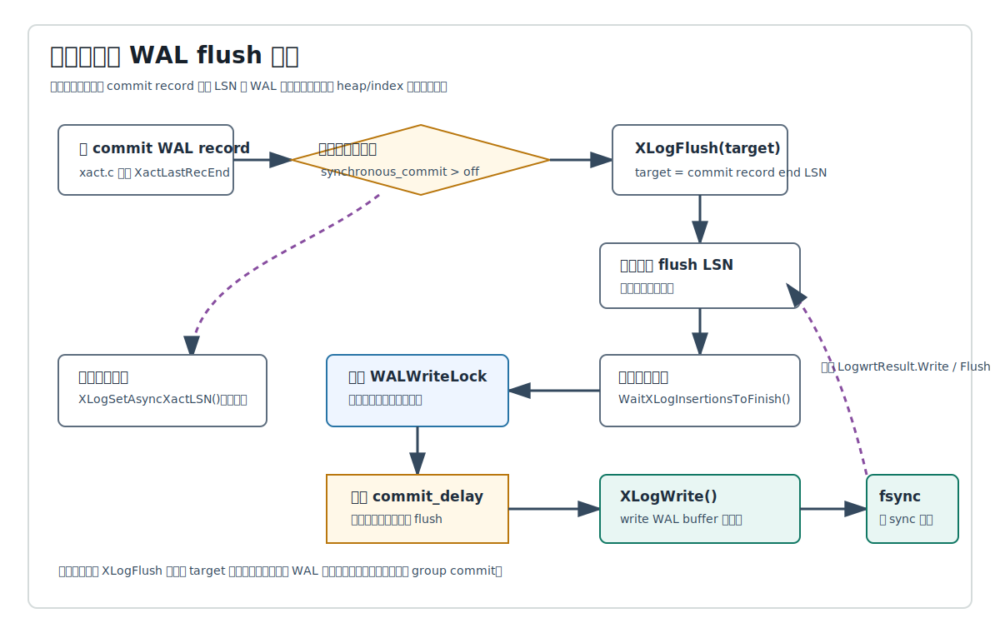
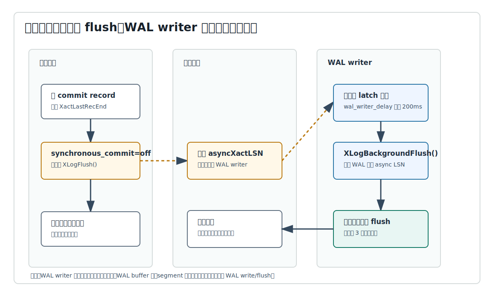
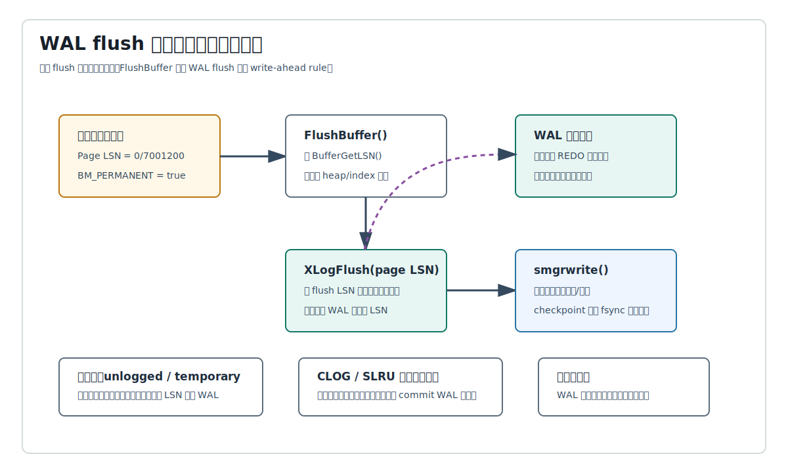
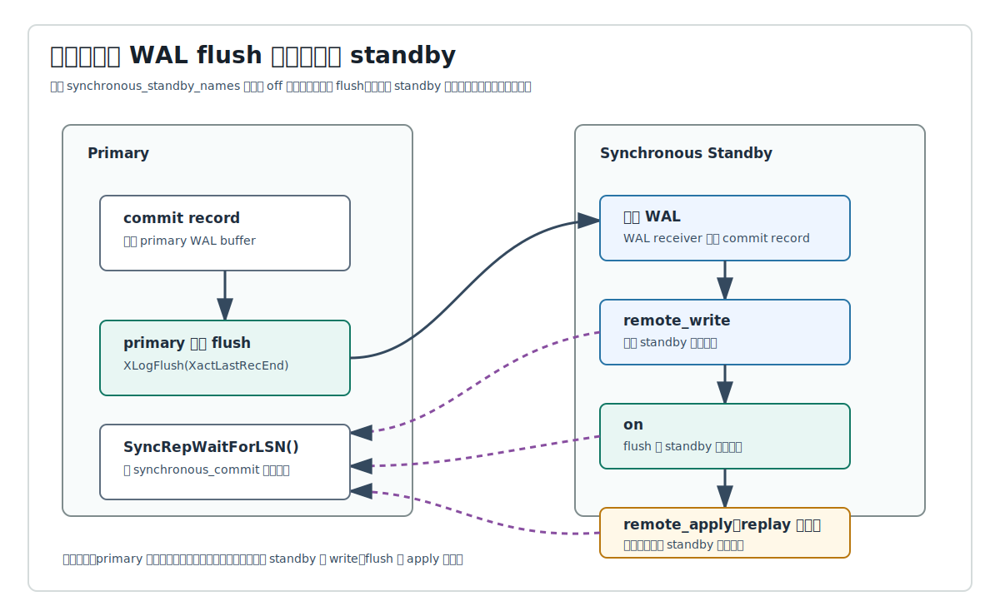

## 数据库筑基课 - wal flush 行为

### 作者
digoal

### 日期
2026-06-08

### 标签
PostgreSQL , 应用开发者 , 数据库筑基课 , WAL , XLogFlush , group commit , synchronous_commit , wal_writer    

----

## 背景
   
  

这篇属于数据库筑基课里的“维护机制 + 写入路径 + 可靠性边界”主题。前两篇已经把 WAL 的整体作用和 `wal buffer` 管理讲清楚：WAL 负责把数据修改转成可恢复的顺序日志，`wal buffer` 负责在共享内存里承接并发 WAL record。本文继续往下追一个更容易在生产中踩坑的问题：**WAL flush 到底什么时候发生，flush 的是什么，谁在等它，谁又不等它。**

本地 `markdown/` 目录没有发现独立的“数据库筑基课大纲”文件，所以本文不强行引用不存在的大纲；后续如果项目补充大纲，可以在这里补上课程目录链接。

先看几个真实场景：

- 小事务很多，CPU 不满，TPS 上不去，`pg_stat_activity.wait_event` 里出现 `WALSync`、`WALWrite` 或 LWLock `WALWrite`。
- 应用把 `synchronous_commit` 改成 `off` 后延迟下降，但担心“数据库会不会坏”。
- standby 做同步复制后，primary 本地磁盘很快，但提交延迟突然受网络和 standby I/O 影响。
- checkpoint 或后台写脏页时，明明不是事务提交，也会触发 `XLogFlush()`。
- 监控里看到 `pg_current_wal_insert_lsn()`、`pg_current_wal_lsn()`、`pg_current_wal_flush_lsn()` 三个值不一样，不知道哪个代表“安全”。

本文以用户提供的本地 PostgreSQL 源码目录 `postgres` 为事实依据。重要结论优先引用官方文档和源码：`doc/src/sgml/wal.sgml`、`doc/src/sgml/config.sgml`、`doc/src/sgml/func/func-admin.sgml`、`doc/src/sgml/monitoring.sgml`、`doc/src/sgml/high-availability.sgml`、`src/backend/access/transam/xlog.c`、`src/backend/access/transam/xact.c`、`src/backend/access/transam/README`、`src/backend/postmaster/walwriter.c`、`src/backend/storage/buffer/bufmgr.c`、`src/backend/access/transam/slru.c`、`src/backend/replication/syncrep.c`、`src/backend/replication/walsender.c`。DeepWiki repoName `postgres/postgres` 可访问，本次用它核对了 WAL 相关页面和源码路径；DeepWiki 指向的 `xlog.c`、`xloginsert.c`、`walwriter.c`、WAL/GUC 页面等结论，均已回到本地源码和官方 SGML 文档核验。

## 一、它解决什么问题？

WAL flush 解决的是“哪些 WAL 字节必须在什么时候到达稳定存储”的问题。

WAL 插入到共享内存并不等于持久化。一个修改走过的路径大致是：

1. 资源管理器构造 WAL record。
2. `XLogInsertRecord()` 把 record 放进 WAL buffer，得到 LSN。
3. `XLogWrite()` 把 WAL buffer 写到 WAL segment 文件。
4. `issue_xlog_fsync()` 或同步打开方式把 WAL 文件推进到稳定存储。
5. 事务提交、数据页写出、同步复制、归档或 walsender 根据不同目标等待不同水位。

如果所有后端每产生一点 WAL 就立刻 fsync，吞吐会被高频同步 I/O 拖垮。如果完全不等 WAL 持久化，崩溃后又不知道哪些提交和数据页修改能被安全重做。PostgreSQL 的策略是把 WAL 进度拆成多个水位：

- `insert LSN`：逻辑上已经插入 WAL buffer 的位置。
- `write LSN`：已经写出到 WAL 文件的位置，通常可从服务器外部读取。
- `flush LSN`：已知写到稳定存储的位置。

这三个水位让系统可以按风险和代价做选择：

- 普通同步提交等本地 `flush LSN` 到达 commit record 末尾。
- 异步提交只登记 commit LSN，然后让 WAL writer 后续补刷。
- 数据页写出前，buffer manager 要确保 WAL 已经 flush 到该页 LSN。
- 同步复制在 primary 本地 flush 后，还可能等 standby 的 write、flush 或 apply。
- WAL writer 和 group commit 尽量用一次写出/刷盘服务多个后端。

代价也很明确：flush 是昂贵 I/O，同步复制还叠加网络和 standby 端 I/O；为了减少 fsync 次数，PostgreSQL 引入了 WAL writer、group commit、`commit_delay`、`wal_writer_delay`、`wal_writer_flush_after` 等机制，但这些机制会带来可见的延迟窗口和调参边界。

## 二、它是什么？

在 PostgreSQL 语境里，WAL flush 通常指 **把 WAL 字节推进到 durable storage**，不是把 heap/index 数据页刷盘。官方文档 `doc/src/sgml/wal.sgml` 把两个内部函数区分得很清楚：

- `XLogWrite()`：把 WAL buffer 写到 WAL 文件。对 `fdatasync`、`fsync`、`fsync_writethrough` 这类同步方式来说，这一步通常只是进入内核缓存。
- `issue_xlog_fsync()`：把 WAL 文件同步到磁盘或等价的稳定存储。

`wal_sync_method` 决定这两步是否分离：

| `wal_sync_method` 类型 | write 行为 | flush 行为 |
|---|---|---|
| `open_datasync` / `open_sync` | WAL 文件用同步写方式打开，`write` 本身带同步语义 | `issue_xlog_fsync()` 通常不再额外做事 |
| `fdatasync` / `fsync` / `fsync_writethrough` | `XLogWrite()` 把 WAL 写到文件/内核缓存 | `issue_xlog_fsync()` 调用对应同步函数 |
| `fsync=off` | 不强制 WAL 到稳定存储 | `wal_sync_method` 失去可靠性意义 |

源码里有两个共享进度结构值得记住。`src/backend/access/transam/xlog.c` 定义：

```c
typedef struct XLogwrtRqst
{
    XLogRecPtr Write;  /* last byte + 1 to write out */
    XLogRecPtr Flush;  /* last byte + 1 to flush */
} XLogwrtRqst;

typedef struct XLogwrtResult
{
    XLogRecPtr Write;  /* last byte + 1 written out */
    XLogRecPtr Flush;  /* last byte + 1 flushed */
} XLogwrtResult;
```

`LogwrtRqst` 表示“希望写/刷到哪里”，`LogwrtResult` 表示“已经写/刷到哪里”。`WALWriteLock` 保护把 WAL buffer 写到磁盘文件和刷盘的长 I/O 路径。



图 1 说明：`insert LSN`、`write LSN`、`flush LSN` 不是同一个概念。`pg_current_wal_insert_lsn()` 反映 WAL 逻辑插入尾部；`pg_current_wal_lsn()` 反映已写出位置；`pg_current_wal_flush_lsn()` 反映已知持久位置。同步提交最关心第三个水位。

## 三、核心原理

### 3.1 事务提交：为什么通常只等 WAL，不等数据页？

事务提交路径在 `src/backend/access/transam/xact.c` 的 `RecordTransactionCommit()`。它先写 commit WAL record，再根据条件决定是否调用：

```c
XLogFlush(XactLastRecEnd);
```

这里的 `XactLastRecEnd` 是 commit record 的结束 LSN。对已经写 WAL、已经分配 XID、且 `synchronous_commit` 非 `off` 的事务，提交返回前必须让 WAL flush 到这个 LSN。之后才更新事务状态，例如 `TransactionIdCommitTree()`。这个顺序保证了：崩溃恢复时，如果看到了持久化的 commit record，就能把事务视为提交；如果没有看到，就等价于事务未提交。

它没有要求提交时把所有 heap/index 脏页刷盘。原因是这些数据页修改已经有 WAL record 描述，只要 WAL durable，崩溃后可以 REDO。数据页可以由 checkpoint、后台写、缓冲区淘汰等路径晚些写出。

### 3.2 XLogFlush：快速返回、等待插入、争用写锁、组提交

`XLogFlush(record)` 位于 `src/backend/access/transam/xlog.c`。简化后的行为是：

1. 如果处于恢复中且不允许插入 WAL，不真的 flush WAL，而是更新 `minRecoveryPoint`。
2. 如果本地 `LogwrtResult.Flush` 已经覆盖目标 LSN，快速返回。
3. 进入 critical section。
4. 把目标 LSN 和已有写请求合并，等待相关范围内的 WAL 插入完成。
5. 尝试获得 `WALWriteLock`。
6. 如果锁被别人持有，先等待释放，再重新检查是否已经被别人刷到目标。
7. 拿到锁后，在符合条件时执行 `commit_delay`，给其他后端加入本次 group commit 的机会。
8. 调用 `XLogWrite()`，通常把目标之后已经完成插入的 WAL 也一起写出/刷盘。
9. 更新共享 `logWriteResult`、`logFlushResult`，唤醒 walsender 和等待 primary flush LSN 的进程。

这里有两个工程含义。

第一，`XLogFlush()` 不只是“刷我自己的事务”。它会尽量把已经插入完成的更多 WAL 一起刷掉。多个提交并发到达时，一次 fsync 可以服务一批事务，这就是 group commit。

第二，等待 `WALWriteLock` 不一定是坏事。当前面某个 leader 正在 fsync，后面的 follower 等锁释放后可能发现自己的 commit LSN 已经被 leader 一并刷掉。高并发时，即使 `commit_delay=0`，也可能自然形成 group commit。



图 2 说明：同步提交的关键等待点是 `XLogFlush(commit LSN)`。`commit_delay` 发生在 leader 拿到 `WALWriteLock` 之后，它增加当前事务延迟，换取更多事务共用一次 flush 的机会。

### 3.3 XLogWrite：write 和 fsync 为什么要分开看？

`XLogWrite()` 必须在持有 `WALWriteLock` 时调用。它做几件事：

- 从当前未写出的 WAL buffer 页开始，把连续页合并成较少的 `write()` 调用。
- 必要时打开或切换 WAL segment。
- 如果写到 segment 末尾，立即 fsync 这个 segment，并通知归档、walsender、checkpoint 等相关逻辑。
- 如果请求里包含 `Flush` 目标，则按 `wal_sync_method` 决定是否调用 `issue_xlog_fsync()`。
- 更新 `LogwrtResult.Write` 和 `LogwrtResult.Flush`。

官方文档 `doc/src/sgml/wal.sgml` 明确说明：当 `wal_sync_method` 为 `fdatasync`、`fsync`、`fsync_writethrough` 时，`XLogWrite()` 的 write 是把 WAL buffer 移到内核缓存，`issue_xlog_fsync()` 才把它同步到磁盘；当 `wal_sync_method` 为 `open_datasync` 或 `open_sync` 时，`XLogWrite()` 的 write 已经保证同步，`issue_xlog_fsync()` 不再做额外工作。

这也是很多监控误判的来源：`write LSN` 往前走，不代表同步提交已经满足；`flush LSN` 往前走，才代表 durable 边界推进。

### 3.4 异步提交：不等 flush，但不等于 fsync=off

当 `synchronous_commit=off`，`RecordTransactionCommit()` 不调用 `XLogFlush(XactLastRecEnd)`，而是调用：

```c
XLogSetAsyncXactLSN(XactLastRecEnd);
```

这会把最近异步提交 LSN 记录到共享内存，并在 WAL writer 睡眠或未及时刷盘时唤醒它。前台事务可以更快返回客户端。

官方文档和 `src/backend/access/transam/README` 对风险窗口说得很明确：异步提交可能在 PostgreSQL 崩溃、操作系统崩溃或 immediate shutdown 时丢失最近已经向客户端报告成功的事务；但数据库状态应该仍然一致，效果等价于这些事务干净 abort。它和 `fsync=off` 不同，后者会破坏 PostgreSQL 维护不同文件写入顺序和持久化的整体机制，系统级崩溃可能造成任意严重的数据损坏。

`src/backend/postmaster/walwriter.c` 的文件头说明，WAL writer 的目标之一就是保证异步提交记录在可知时间内到达磁盘，最坏约为三倍 `wal_writer_delay` 周期。默认 `wal_writer_delay` 是 200ms；官方配置文档也说明 `wal_writer_flush_after` 默认 1MB，若设为 0 则 WAL writer 每次都立即 flush。



图 3 说明：异步提交的风险是“已返回事务可能丢失”，不是“数据库任意损坏”。WAL writer 通过周期唤醒和异步提交唤醒推进 flush LSN，但它不是唯一写出者；前台仍可在同步提交、WAL buffer 满或其他需要时自己写 WAL。

### 3.5 数据页写出前：WAL flush 保护 write-ahead rule

WAL flush 不只发生在事务提交。`src/backend/storage/buffer/bufmgr.c` 的 `FlushBuffer()` 在写共享缓冲区脏页前，会读取页面 LSN：

```c
recptr = BufferGetLSN(buf);
if (pg_atomic_read_u64(&buf->state) & BM_PERMANENT)
    XLogFlush(recptr);
```

这实现了最基础的 WAL 规则：**描述数据页修改的 WAL 必须先于数据页本身到达稳定存储**。如果一个永久关系的数据页 LSN 是 `0/7001200`，那写这个数据页前，WAL 至少要 flush 到 `0/7001200`。否则崩溃时可能出现“数据页已经写了，但恢复时找不到对应 WAL”的不可恢复状态。

这个规则不适用于 unlogged relation。unlogged relation 崩溃后本来就会丢失或重建，而且某些 unlogged index 可能使用 fake LSN 做内部并发检测；把 fake LSN 当真实 WAL LSN 去 flush 反而可能出错，所以源码明确只对 `BM_PERMANENT` 的 buffer 强制。

SLRU 也有类似保护。`src/backend/access/transam/slru.c` 在写出某些状态页前，会根据页内记录的最大 LSN 调用 `XLogFlush()`，保证异步提交的 commit WAL 先于事务状态页落盘。否则可能出现事务状态已经落盘为 committed，但对应 commit record 还没持久化的顺序错误。



图 4 说明：提交 flush 保护事务返回时的持久性，数据页写前 flush 保护 WAL-before-data 的恢复不变量。二者都调用 `XLogFlush()`，但触发原因不同。

### 3.6 WAL writer：后台写出、后台 flush、异步提交兜底

`XLogBackgroundFlush()` 是 WAL writer 周期调用的核心函数。它的策略不是“每次都刷到最新 insert LSN”，而是分层处理：

1. 读取共享 `LogwrtRqst`。
2. 通常退到最后一个完整 WAL 页边界，只写完整页。
3. 如果完整页已经 flush，再考虑当前不完整页里的最新异步提交 LSN。
4. 根据 `wal_writer_delay` 和 `wal_writer_flush_after` 决定这次只是 write，还是 write + flush。
5. 写完后机会性初始化后续 WAL buffer 页，降低前台插入路径的负担。

这样做的目的，是在后台尽量减少前台后端被迫写 WAL 的概率，同时避免 WAL writer 过于频繁 fsync 影响并发 I/O。

但不要把 WAL writer 理解成“提交安全的唯一保障”。同步提交仍由前台 `XLogFlush()` 确认；WAL buffer 满时，`XLogInsertRecord()` 也可能被迫调用写出路径；segment 结束、checkpoint、walsender 等路径也会推动 WAL 写出或 flush。

### 3.7 同步复制：本地 flush 之后，还可能等远端

如果没有配置 `synchronous_standby_names`，`synchronous_commit` 的非 `off` 模式主要体现为本地 WAL flush。配置同步复制后，提交路径会在本地 commit record flush 后调用 `SyncRepWaitForLSN(XactLastRecEnd, true)`，按 `synchronous_commit` 模式等待 standby 反馈。

官方高可用文档说明：

| `synchronous_commit` | primary 本地 | standby 等待层次 | 工程含义 |
|---|---|---|---|
| `local` | 等本地 flush | 不等同步复制 | 有同步 standby 时仍只要本地持久 |
| `remote_write` | 等本地 flush | 等 standby 接收并写到文件系统 | standby PostgreSQL 崩溃通常不丢，standby OS 崩溃仍可能丢 |
| `on` | 等本地 flush | 等 standby flush 到 durable storage | 默认同步复制语义，延迟受远端 fsync 影响 |
| `remote_apply` | 等本地 flush | 等 standby replay 后对查询可见 | 因果读最强，提交延迟最高 |
| `off` | 不等本地 flush | 不等同步复制 | 牺牲最近提交持久性 |

`src/backend/replication/walsender.c` 的 `WalSndWaitForWal()` 还体现了另一个边界：WAL sender 发送 WAL 前也要等待需要的 WAL 已经 flush 到合适位置；在 shutdown 等场景中还会主动 `XLogFlush(GetXLogInsertEndRecPtr())`，避免等待永远不会写出的 WAL。



图 5 说明：同步复制不是替代本地 WAL flush，而是在 primary 本地 durable 之后继续等待 standby 的 write、flush 或 apply。提交延迟会从“本地存储问题”升级成“本地存储 + 网络 + standby 存储/回放”的组合问题。

## 四、横向对比

### 4.1 Insert、write、flush 三个水位

| 维度 | insert LSN | write LSN | flush LSN |
|---|---|---|---|
| 含义 | WAL record 已插入共享 WAL buffer 的逻辑尾部 | WAL 已写到 WAL 文件的位置 | WAL 已知到达稳定存储的位置 |
| 代表函数 | `pg_current_wal_insert_lsn()` | `pg_current_wal_lsn()` | `pg_current_wal_flush_lsn()` |
| 主要代码 | `XLogInsertRecord()` | `XLogWrite()` | `XLogFlush()` / `issue_xlog_fsync()` |
| 对提交安全的意义 | 不足以保证崩溃后可见 | 对 `remote_write` 有意义，但本地 durable 不够 | 同步提交本地安全边界 |
| 常见误解 | “已经有 LSN 就安全” | “写到文件就等于落盘” | “flush 了就等于数据页也落盘” |

原因很简单：WAL 是顺序字节流，但存储系统有多层缓存。PostgreSQL 必须分别管理“逻辑上产生了”“写到文件了”“同步到稳定存储了”这三件事。

### 4.2 三类常见 WAL flush 触发者

| 维度 | 同步提交 `XLogFlush` | WAL writer `XLogBackgroundFlush` | 数据页写出前 `FlushBuffer` |
|---|---|---|---|
| 触发者 | 前台提交、两阶段提交、部分强制同步操作 | 后台 WAL writer 周期或 latch 唤醒 | checkpoint、后台写、buffer 淘汰、手工 flush |
| 目标 LSN | commit record 结束 LSN 或特定记录 LSN | 完整 WAL 页或最新 async commit LSN | 数据页上的 Page LSN |
| 是否关心客户端返回 | 是 | 间接关心异步提交风险窗口 | 否，关心恢复顺序 |
| 主要风险 | 提交延迟高、`WALWriteLock` 争用、fsync 慢 | flush 太慢导致异步提交窗口变长或前台写出增多 | 如果跳过会破坏 WAL-before-data |
| 典型调参 | `synchronous_commit`、`commit_delay`、存储、同步复制 | `wal_writer_delay`、`wal_writer_flush_after`、`wal_buffers` | checkpoint、shared buffers、存储写回 |

这三类路径都会碰到 `XLogFlush()` 或 `XLogWrite()`，但目标不同。调优时必须先判断慢的是哪条路径。

### 4.3 `synchronous_commit=off` 与 `fsync=off`

| 维度 | `synchronous_commit=off` | `fsync=off` |
|---|---|---|
| 作用范围 | 可按事务、会话、用户、库设置 | 服务器级可靠性设置 |
| 放弃什么 | 提交返回前不等 commit WAL 本地 flush | PostgreSQL 不再强制关键文件同步 |
| 崩溃后风险 | 最近已返回成功的事务可能丢失 | 可能出现任意严重数据损坏 |
| 数据库一致性 | 官方文档认为不应造成不一致，丢失事务等价 clean abort | 不能保证 |
| 适合场景 | 可重放事件、低价值日志、幂等队列消费结果 | 只适合可重建测试或临时环境 |

很多业务为了“快”直接关 `fsync`，这是非常危险的。真正想降低提交等待，通常先评估 `synchronous_commit=off` 或按事务使用 `SET LOCAL synchronous_commit TO off`，并让业务接受最近提交丢失窗口。

## 五、效果如何？

WAL flush 设计带来的收益：

- 提交不必刷所有数据页，只需保证 commit WAL durable。
- 多个事务可以 group commit，用一次 fsync 服务多个提交。
- 异步提交可以把低价值事务从 fsync 等待中移出，同时保持崩溃后一致性。
- 数据页写出前按 Page LSN 强制 WAL flush，保护 WAL-before-data 不变量。
- 同步复制可把持久性边界扩展到 standby。
- `pg_stat_wal`、`pg_stat_io`、LSN 函数、wait events 让问题可观测。

代价和边界：

- fsync 延迟会直接进入同步提交尾延迟。
- `WALWriteLock` 是写出/刷盘长路径锁，高并发时会出现 follower 等待。
- `commit_delay` 可能提升吞吐，也可能白白增加延迟。
- `synchronous_commit=off` 会带来最近提交丢失窗口，默认最长由 WAL writer 周期控制。
- 同步复制把提交延迟绑定到网络、standby 写盘、standby replay。
- 只调大 `wal_buffers` 不能解决 fsync 慢或同步复制慢。
- `fsync=off` 不是性能调优手段，而是放弃崩溃安全。

本文不提供虚构性能数字。`commit_delay`、`wal_writer_delay`、`wal_writer_flush_after`、`wal_sync_method` 的效果高度依赖存储、并发度、WAL 生成速率和同步复制拓扑，必须用代表性 workload 验证。

## 六、实操 DEMO

下面 SQL 和命令用于测试库验证。本文没有在本地启动 PostgreSQL 实例执行这些示例，因此不提供执行输出。

### 6.1 观察三个 WAL 水位

```sql
SELECT pg_current_wal_insert_lsn() AS insert_lsn,
       pg_current_wal_lsn()        AS write_lsn,
       pg_current_wal_flush_lsn()  AS flush_lsn;

CREATE TABLE wal_flush_demo(id bigint generated always as identity, payload text);

BEGIN;
INSERT INTO wal_flush_demo(payload)
SELECT repeat('x', 1000)
FROM generate_series(1, 1000);
SELECT pg_current_wal_insert_lsn() AS insert_lsn_in_xact,
       pg_current_wal_lsn()        AS write_lsn_in_xact,
       pg_current_wal_flush_lsn()  AS flush_lsn_in_xact;
COMMIT;

SELECT pg_current_wal_insert_lsn() AS insert_lsn_after_commit,
       pg_current_wal_lsn()        AS write_lsn_after_commit,
       pg_current_wal_flush_lsn()  AS flush_lsn_after_commit;
```

验证点：事务内插入可能推进 insert LSN；同步提交后，flush LSN 应该至少覆盖 commit record。不同系统上 write/flush 差距可能很小，也可能在高并发或异步提交下明显。

### 6.2 对比同步提交和异步提交

```sql
CREATE TABLE wal_flush_async_demo(id bigint generated always as identity, payload text);

-- 默认同步提交
BEGIN;
SET LOCAL synchronous_commit TO on;
INSERT INTO wal_flush_async_demo(payload) VALUES ('sync commit');
COMMIT;

SELECT pg_current_wal_insert_lsn() AS insert_lsn,
       pg_current_wal_lsn()        AS write_lsn,
       pg_current_wal_flush_lsn()  AS flush_lsn;

-- 单个事务异步提交
BEGIN;
SET LOCAL synchronous_commit TO off;
INSERT INTO wal_flush_async_demo(payload) VALUES ('async commit');
COMMIT;

SELECT pg_current_wal_insert_lsn() AS insert_lsn,
       pg_current_wal_lsn()        AS write_lsn,
       pg_current_wal_flush_lsn()  AS flush_lsn;
```

验证点：异步提交返回后，flush LSN 不一定立即追上最新 commit LSN。过一段时间或 WAL writer 被唤醒后，flush LSN 会继续推进。

### 6.3 观察 WAL 统计和 WAL I/O

```sql
SELECT wal_records,
       wal_fpi,
       wal_bytes,
       wal_fpi_bytes,
       wal_buffers_full,
       stats_reset
FROM pg_stat_wal;

SELECT backend_type,
       object,
       context,
       reads,
       writes,
       write_time,
       fsyncs,
       fsync_time
FROM pg_stat_io
WHERE object = 'wal'
ORDER BY backend_type, context;
```

验证点：`pg_stat_wal` 看 WAL 生成量和 WAL buffer 满触发写出；`pg_stat_io` 中 `object='wal'` 可看 WAL write/fsync 次数与时间。要观察时间列，需要关注 `track_wal_io_timing` 是否开启。

### 6.4 观察等待事件

```sql
SELECT pid,
       backend_type,
       wait_event_type,
       wait_event,
       state,
       left(query, 80) AS query
FROM pg_stat_activity
WHERE wait_event IN ('WALWrite', 'WALSync', 'CommitDelay')
   OR wait_event_type = 'LWLock';
```

验证点：`WALWrite` 和 `WALSync` 是 WAL 文件写和同步等待；LWLock `WALWrite` 表示等待 WAL buffers 写出到磁盘相关锁；`CommitDelay` 表示 group commit leader 正在主动等待更多事务加入。

### 6.5 用 pg_test_fsync 粗测单次 WAL flush 成本

```bash
pg_test_fsync
```

验证点：官方文档建议用 `pg_test_fsync` 了解不同 `wal_sync_method` 的相对成本。这个结果不能直接等同业务 TPS，但可以帮助判断 `commit_delay` 是否有测试价值。

## 七、最佳实践

### 7.1 面向数据库架构师

1. 按业务事务价值分级，不要所有事务都用同一个持久性策略。账务、库存扣减、订单状态通常保持 `synchronous_commit=on`；可重放日志、点击流、幂等事件可评估 `synchronous_commit=off`。
2. 同步复制要明确等什么。如果只是降低 primary 单点风险，`on` 通常够用；如果读请求马上打到 standby 且要求提交后可见，才考虑 `remote_apply`。
3. 把 RPO/RTO 转成参数边界。`synchronous_commit` 影响最近事务丢失窗口，checkpoint 参数影响恢复重放窗口，复制槽和归档影响 WAL 保留窗口。
4. 不要用 `fsync=off` 做生产性能优化。它改变的是系统一致性边界，不是单个事务提交策略。

### 7.2 面向 DBA

1. 先定位等待类型，再调参数。提交慢看 `WALSync`、`WALWrite`、LWLock `WALWrite`、同步复制等待、存储延迟，而不是直接改 `wal_buffers`。
2. 监控 `pg_stat_wal.wal_buffers_full`。如果高 WAL 速率下持续增长，说明前台插入路径可能被迫写 WAL，可评估增大 `wal_buffers` 或降低 WAL 峰值。
3. 监控 `pg_stat_io` 的 WAL write/fsync 次数和时间。开启 `track_wal_io_timing` 后，能把“写文件慢”和“fsync 慢”分开。
4. 调 `commit_delay` 前先测代表性 workload。它只在有并发提交且提交率受 flush 限制时可能有效；值太大只会抬高延迟。
5. 同步复制要同时看 primary 和 standby。primary 本地 I/O 快不代表提交快，standby 的 flush/apply 和网络都可能成为瓶颈。
6. checkpoint 后如果 WAL/FPI 峰值明显，联合观察 `wal_fpi`、`wal_fpi_bytes`、checkpoint 频率和 `full_page_writes`，不要只看总 WAL 字节。

### 7.3 面向业务开发者

1. 不要把“COMMIT 返回”理解成“所有数据页已经写盘”。正常情况下它表示 commit WAL durable，数据页可以稍后写。
2. 对低价值、高频写入，优先用事务级 `SET LOCAL synchronous_commit TO off`，并在业务上接受最近事务丢失窗口。
3. 异步提交必须配合幂等重试或上游可重放来源。不要用于用户资金、不可重复扣减、外部不可回滚动作。
4. 批量写入要减少提交次数。每行一提交会把 flush 压力放大；合理批量提交可以自然提升 group commit 效果。
5. 如果事务里有外部副作用，例如已经调用外部系统完成不可回滚动作，要谨慎使用异步提交，因为数据库崩溃可能丢掉本地事务记录。

## 八、适合与不适合场景

适合重点优化 WAL flush 的场景：

- 高并发小事务，提交延迟明显受 fsync 或 `WALWriteLock` 影响。
- 高 WAL 生成速率，`wal_buffers_full` 增长，前台插入路径被迫写 WAL。
- 使用同步复制，提交延迟需要在本地、网络、standby flush/apply 间拆解。
- 有低价值可重放事务，愿意用 `synchronous_commit=off` 换延迟。
- 存储平台差异明显，需要测试 `wal_sync_method` 或存储缓存策略。

不适合只从 WAL flush 入手的场景：

- 慢查询主要来自执行计划、锁等待、行锁冲突、CPU 或 buffer cache miss。
- WAL 量过大来自 schema/index 设计，例如过多二级索引、频繁大 UPDATE、TOAST 放大。
- 磁盘空间问题来自归档失败、复制槽不推进、standby 长期落后；这不是 flush 本身能解决。
- 业务不能接受任何已返回事务丢失，却想用 `synchronous_commit=off` 换性能。
- 想在生产关闭 `fsync` 来“提升性能”。

## 九、常见坑

1. **把 write LSN 当 durable LSN。** `pg_current_wal_lsn()` 是写出位置，不等于 `pg_current_wal_flush_lsn()`。
2. **以为 `COMMIT` 返回后数据页一定落盘。** 同步提交保证的是 WAL commit record durable，数据页稍后由 checkpoint 等路径落盘。
3. **把 `synchronous_commit=off` 和 `fsync=off` 混为一谈。** 前者可能丢最近事务，后者可能损坏数据库。
4. **只看 primary，不看 standby。** 同步复制下，`remote_write`、`on`、`remote_apply` 的等待层次完全不同。
5. **盲目调大 `wal_buffers`。** 它能减少 buffer 满导致的前台写出，但不能消除 commit fsync 或同步复制等待。
6. **错误使用 `commit_delay`。** 没有并发提交或 flush 不是瓶颈时，它只是人为增加延迟。
7. **忽略数据页写前 WAL flush。** checkpoint 或 buffer 淘汰也会触发 `XLogFlush(page LSN)`，所以 WAL flush 不只属于提交路径。
8. **把异步提交用于不可重放交易。** 崩溃窗口内已返回成功的事务可能消失，业务必须能承受。
9. **忽略 immediate shutdown。** 官方文档提示，immediate shutdown 等价于服务器崩溃，会丢失未 flush 的异步提交。
10. **用没有代表性的压测调 WAL 参数。** WAL flush 行为高度依赖事务大小、并发度、存储、checkpoint、复制拓扑。

## 十、扩展问题

1. 为什么 `XLogFlush()` 在拿不到 `WALWriteLock` 时先等别人释放，再重新检查，而不是所有后端排队各刷一次？
2. `commit_delay` 为什么在 leader 拿到 `WALWriteLock` 之后睡，而不是在写 commit record 之前睡？
3. 如果 `synchronous_commit=off` 可能丢事务，PostgreSQL 为什么仍然能保证数据库一致？
4. `remote_write` 为什么能抗 standby PostgreSQL 进程崩溃，却不能保证 standby 操作系统崩溃不丢？
5. 数据页 `Page LSN` 和事务 commit LSN 分别保护什么不变量？
6. 为什么 unlogged relation 的 buffer flush 不应该用 fake LSN 去强制 WAL flush？
7. 如果 `pg_stat_wal.wal_buffers_full` 增长，但 `pg_stat_io` 的 WAL fsync 时间很低，下一步应该怀疑什么？
8. 如果业务每行一提交，group commit 能缓解多少，批量提交又能改变什么？

## 十一、扩展阅读

- `postgres/doc/src/sgml/wal.sgml`：WAL 可靠性、异步提交、group commit、WAL internals、WAL write/fsync 说明。
- `postgres/doc/src/sgml/config.sgml`：`synchronous_commit`、`wal_sync_method`、`wal_writer_delay`、`wal_writer_flush_after`、`commit_delay`、`commit_siblings`、`wal_buffers`。
- `postgres/doc/src/sgml/func/func-admin.sgml`：`pg_current_wal_lsn()`、`pg_current_wal_insert_lsn()`、`pg_current_wal_flush_lsn()`。
- `postgres/doc/src/sgml/monitoring.sgml`：`pg_stat_wal`、`pg_stat_io`、WAL wait events。
- `postgres/doc/src/sgml/high-availability.sgml`：同步复制和 `synchronous_commit` 的远端等待语义。
- `postgres/src/backend/access/transam/xlog.c`：`XLogFlush()`、`XLogWrite()`、`XLogBackgroundFlush()`、`XLogSetAsyncXactLSN()`、`issue_xlog_fsync()`。
- `postgres/src/backend/access/transam/xact.c`：事务提交时同步/异步 WAL flush 决策。
- `postgres/src/backend/access/transam/README`：WAL-logged action 顺序、异步提交、CLOG 与 hint bit 的 WAL flush 边界。
- `postgres/src/backend/postmaster/walwriter.c`：WAL writer 的职责、周期和异步提交收敛说明。
- `postgres/src/backend/storage/buffer/bufmgr.c`：`FlushBuffer()` 中数据页写出前的 `XLogFlush(page LSN)`。
- `postgres/src/backend/access/transam/slru.c`：SLRU 页写出前 honor write-WAL-before-data rule。
- `postgres/src/backend/replication/syncrep.c`：`SyncRepWaitForLSN()` 同步复制等待。
- `postgres/src/backend/replication/walsender.c`：walsender 等待 WAL flush 和 standby catch-up 的边界。
- DeepWiki：`postgres/postgres`，尤其是 `Write-Ahead Logging (WAL)`、`Configuration Management System (GUC)` 页面；本次用于架构线索和源码路径核对，关键事实仍以本地源码和官方文档为准。
  
## 附录 
1、克隆代码  
```  
git clone --depth 1 https://github.com/postgres/postgres
```  
  
2、启用 codex, 使用 [数据库筑基课 skill](../skills/README.md).  
```
文章标题: 
  数据库筑基课 - wal flush 行为
项目源码(本地目录): 
  postgres
项目 codebase 文件名: 
  postgres/CLAUDE.md 
开源项目相关的 deepwiki repoName: 
  postgres/postgres
```
    
#### [PostgreSQL 解决方案集合](../201706/20170601_02.md "40cff096e9ed7122c512b35d8561d9c8")
  
  
#### [德哥 / digoal's Github - 公益是一辈子的事.](https://github.com/digoal/blog/blob/master/README.md "22709685feb7cab07d30f30387f0a9ae")
  
  
#### [About 德哥](https://github.com/digoal/blog/blob/master/me/readme.md "a37735981e7704886ffd590565582dd0")
  
  

  
