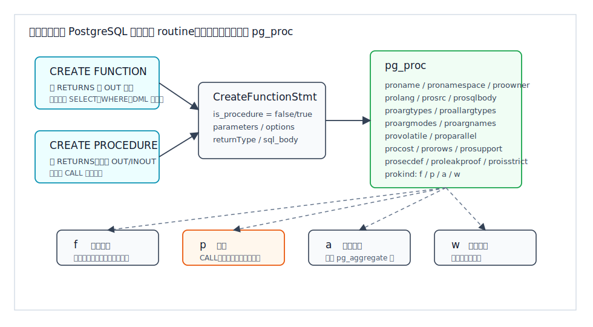
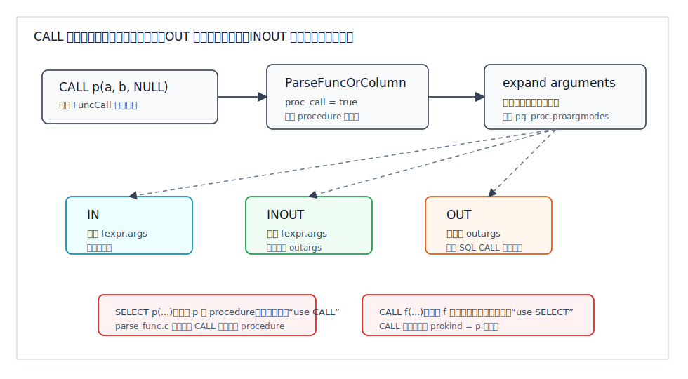
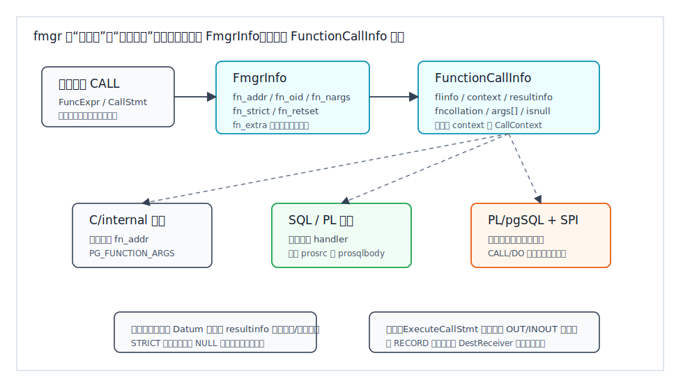
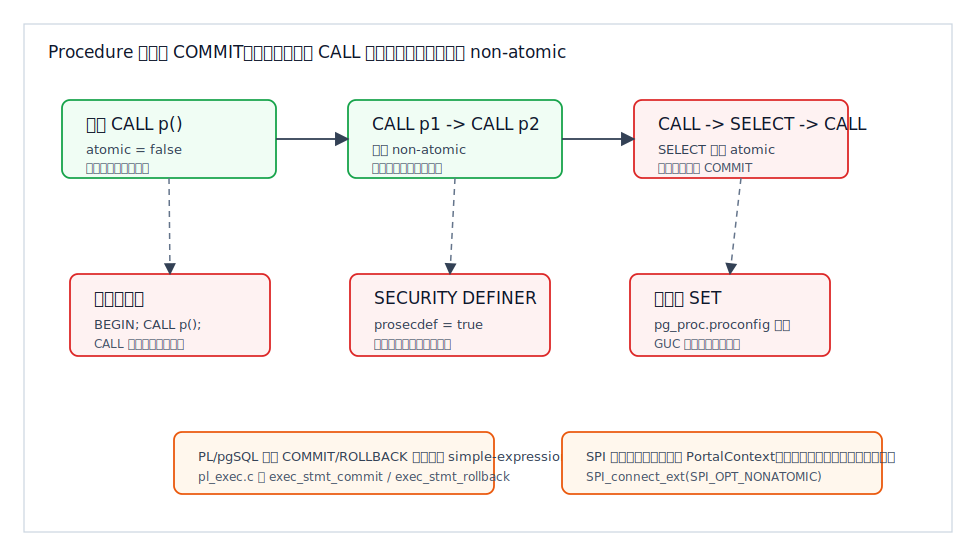
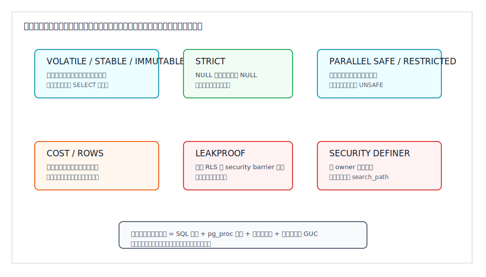

## 数据库筑基课 - 存储过程与函数

### 作者
digoal

### 日期
2026-06-08

### 标签
PostgreSQL , 应用开发者 , 数据库筑基课 , 存储过程 , 函数 , PL/pgSQL , pg_proc , CALL    

----

## 背景
   


这篇属于数据库筑基课里的“场景实践 + 执行器/优化器基础能力”主题。存储过程与函数不是“把应用代码搬进数据库”这么简单，它们是 PostgreSQL 把业务逻辑、表达式求值、权限边界、事务控制、语言处理器和优化器契约连接起来的一组 routine 机制。

本地 `markdown/` 目录没有发现独立的“数据库筑基课大纲”文件，所以本文不强行引用不存在的大纲；后续如果项目补充大纲，可以在这里补上课程目录链接。

先从一个常见工程现场说起：

一个业务系统把“扣款、写流水、更新额度、归档历史订单”都放在应用服务里。随着服务变多，同一段 SQL 在多个仓库里复制，字段名和边界条件开始漂移。于是团队决定把逻辑封装到数据库里：

- 查询侧想写成 `SELECT risk_score(user_id)`，让报表和风控共用一套评分逻辑。
- 写入侧想写成 `CALL settle_order(...)`，把复杂写入压缩成一次数据库调用。
- 运维侧想写成 `CALL archive_old_orders(...)`，让批处理自己分批提交，避免一个超大事务拖住 `VACUUM`。
- 权限侧想写成 `SECURITY DEFINER`，让普通用户只能执行受控动作，而不是直接访问底层敏感表。

这些想法都合理，但每一个都有边界。函数出现在 SQL 表达式里，优化器会根据 `VOLATILE/STABLE/IMMUTABLE`、`STRICT`、`PARALLEL`、`COST/ROWS` 做决策；过程通过 `CALL` 独立执行，只有在非原子上下文里才可能 `COMMIT` 或 `ROLLBACK`；`SECURITY DEFINER` 既能收口权限，也可能被不安全的 `search_path` 反向利用。

本文以本地 PostgreSQL 源码目录 `postgres` 为主线，重点引用：

- 官方文档：`postgres/doc/src/sgml/xfunc.sgml`、`ref/create_function.sgml`、`ref/create_procedure.sgml`、`ref/call.sgml`、`plpgsql.sgml`、`catalogs.sgml`、`monitoring.sgml`、`config.sgml`。
- 内核源码：`src/backend/commands/functioncmds.c`、`src/backend/catalog/pg_proc.c`、`src/backend/parser/parse_func.c`、`src/backend/parser/analyze.c`、`src/backend/commands/functioncmds.c`、`src/backend/executor/functions.c`、`src/backend/executor/spi.c`、`src/pl/plpgsql/src/pl_exec.c`、`src/include/fmgr.h`、`src/include/catalog/pg_proc.h`。
- 回归测试：`src/pl/plpgsql/src/sql/plpgsql_transaction.sql`、`src/pl/plpgsql/src/expected/plpgsql_transaction.out`、`src/pl/plpgsql/src/sql/plpgsql_call.sql`。
- DeepWiki：`postgres/postgres` 的目录与问答用于辅助定位 system catalogs、procedural languages、`pg_proc`、`fmgr` 等架构线索；关键结论已回到本地源码和官方文档核对。

用户更正后的 DeepWiki repoName 为 `postgres/postgres`。本次查询显示该 repoName 可访问；长篇 wiki 内容和问答只作为辅助索引，不替代本地 PostgreSQL 源码与官方文档。

## 一、它解决什么问题？

存储过程与函数解决的核心问题是：把一段可复用的数据库逻辑变成数据库对象，并让它在正确的权限、事务、优化器和语言运行时边界内执行。

它通常解决五类问题。

第一，减少重复 SQL。比如价格计算、评分、脱敏、类型转换、复杂校验，如果散落在多个服务里，版本漂移是迟早的事。函数可以让这些逻辑通过 `SELECT calc(...)` 或 `WHERE is_valid(...)` 复用。

第二，靠近数据执行。某些逻辑需要访问多张表、循环处理、异常处理、临时中间状态。把它放在数据库里可以减少网络往返和应用层状态同步，但也会把 CPU、锁等待、I/O 和错误路径集中到数据库端。

第三，封装权限。`SECURITY DEFINER` 函数或过程可以让调用者执行一个受控动作，而不是直接拿到底层表权限。这常用于密码校验、审计写入、租户隔离、后台维护入口。

第四，表达优化器可理解的计算。函数可以放进索引表达式、谓词、投影、连接条件和集合返回位置。标注正确时，优化器可以避免重复调用、常量折叠、使用索引或并行计划；标注错误时，也会产生错误结果或性能灾难。

第五，批处理和维护作业的事务切片。PostgreSQL 的过程在满足条件时可以在执行期间 `COMMIT` 或 `ROLLBACK`，这让维护任务可以分批提交，降低单个超大事务带来的 WAL、锁、复制延迟、膨胀和回滚成本。

但它付出的代价也很直接：

- 逻辑更隐蔽：应用日志里只看到一次 `CALL`，内部做了多少 SQL 需要数据库侧观测。
- 负载更集中：函数放进 `WHERE` 或 `JOIN` 条件可能被每行调用，CPU 成本会突然放大。
- 事务更难理解：过程能不能提交取决于调用上下文，不取决于过程名字。
- 权限更敏感：`SECURITY DEFINER` 写错 `search_path` 可能把高权限交给攻击者可控对象。
- 发布更谨慎：`CREATE OR REPLACE FUNCTION` 不能随意改变参数类型、返回类型和某些输出参数形态。

所以它不是“应用逻辑全部下沉”的许可证，而是一种需要声明、验证、观测和运维边界的数据库基础设施。

## 二、它是什么？

PostgreSQL 中，函数、过程、聚合函数、窗口函数统称为 routine。它们的核心元数据都存储在系统目录 `pg_proc`。`pg_proc.prokind` 用一个字符区分对象种类：

- `f`：普通函数。
- `p`：过程。
- `a`：聚合函数。
- `w`：窗口函数。

官方文档 `xfunc.sgml` 对函数和过程的关键差异定义得很清楚：

| 维度 | 函数 Function | 过程 Procedure |
|---|---|---|
| 创建命令 | `CREATE FUNCTION` | `CREATE PROCEDURE` |
| 调用方式 | 作为查询表达式调用，例如 `SELECT f(...)` | 使用 `CALL p(...)` 独立调用 |
| 返回值 | 必须有返回类型，或返回 `void` | 没有 `RETURNS` 子句，可通过 `OUT/INOUT` 参数返回数据 |
| 优化器关系 | 参与表达式求值、计划选择、谓词下推、并行计划判断 | 不作为查询表达式参与普通计划 |
| 事务控制 | 不能执行事务控制命令 | 顶层或合法嵌套 `CALL` 中可执行事务控制 |
| 属性差异 | 支持 `STRICT`、`VOLATILE`、`PARALLEL`、`COST`、`ROWS` 等 | 某些函数属性不适用，例如 `STRICT` 这类表达式求值属性 |

从用户层看，函数像一个 SQL 表达式的一部分，过程像一个数据库端命令入口。从内核层看，它们共享很多创建、目录、权限、语言处理器和调用接口，只是在 `prokind`、调用语法和执行上下文上分叉。

这个边界很重要。一个返回 `void` 的函数可以做动作：

```sql
CREATE FUNCTION clean_emp() RETURNS void
LANGUAGE SQL
AS $$
  DELETE FROM emp WHERE salary < 0;
$$;

SELECT clean_emp();
```

也可以写成过程：

```sql
CREATE PROCEDURE clean_emp()
LANGUAGE SQL
AS $$
  DELETE FROM emp WHERE salary < 0;
$$;

CALL clean_emp();
```

简单场景下两者接近；但一旦涉及查询优化、事务控制、权限封装、输出参数和调用位置，它们就不是同一个东西。

## 三、核心原理

### 3.1 创建阶段：函数和过程都进入 pg_proc

PostgreSQL 语法文件 `src/backend/parser/gram.y` 中，`CREATE FUNCTION` 和 `CREATE PROCEDURE` 最终都会构造 `CreateFunctionStmt`。`src/include/nodes/parsenodes.h` 里这个节点有一个关键字段：`is_procedure`。普通函数为 `false`，过程为 `true`。

执行创建时，`src/backend/commands/functioncmds.c` 的 `CreateFunction()` 会：

1. 解析目标 schema 和对象名。
2. 检查 schema 创建权限、语言是否存在、语言 `USAGE` 或超级用户要求。
3. 解析参数模式、参数类型、默认值、返回类型。
4. 解析 `LANGUAGE`、`AS`、`sql_body`、`SECURITY`、`VOLATILE`、`STRICT`、`PARALLEL`、`COST`、`ROWS` 等属性。
5. 调用 `ProcedureCreate()` 写入 `pg_proc`。

注意函数名 `ProcedureCreate()` 里的 “Procedure” 是历史和目录层面的通称，不表示只创建 SQL procedure。它会根据传入的 `prokind` 写入 `pg_proc`：过程传 `PROKIND_PROCEDURE`，普通函数传 `PROKIND_FUNCTION`，窗口函数传 `PROKIND_WINDOW`。



图 1 说明：`CREATE FUNCTION` 和 `CREATE PROCEDURE` 在语法层共用 `CreateFunctionStmt`，在目录层共用 `pg_proc`，真正区分它们的是 `is_procedure` 和 `pg_proc.prokind`。这也是为什么 `ALTER ROUTINE`、`DROP ROUTINE` 可以统一操作函数和过程，但没有 `CREATE ROUTINE` 命令。

`pg_proc` 中几个字段尤其关键：

| 字段 | 含义 | 工程影响 |
|---|---|---|
| `prokind` | routine 类型，`f/p/a/w` | 决定 `SELECT` 还是 `CALL`，以及返回值处理 |
| `prolang` | 实现语言或调用接口 | 决定走 SQL、PL/pgSQL、C、internal 等处理器 |
| `prosrc` | 函数或过程主体文本、C 符号等 | 字符串形式主体通常运行时解析 |
| `prosqlbody` | 新式 SQL body 的预解析节点 | 可记录依赖，`DROP ... CASCADE` 更准确 |
| `proargtypes` | 输入参数类型 oidvector | 重载解析主要看输入参数 |
| `proallargtypes` | 所有参数类型 | 包含 OUT/INOUT 参数 |
| `proargmodes` | 参数模式数组 | 区分 `IN/OUT/INOUT/VARIADIC/TABLE` |
| `provolatile` | `IMMUTABLE/STABLE/VOLATILE` | 影响快照、常量折叠、索引条件和调用次数 |
| `proparallel` | 并行安全级别 | 影响并行计划能否使用该函数 |
| `prosecdef` | 是否 `SECURITY DEFINER` | 影响权限上下文，也影响过程事务控制 |
| `proleakproof` | 是否 leakproof | 影响 RLS/security barrier 条件执行顺序 |
| `proisstrict` | NULL 输入是否跳过执行 | 影响函数调用行为 |
| `procost/prorows` | 成本和行数估算 | 影响计划选择，尤其集合返回函数 |

`CREATE OR REPLACE` 也不是万能替换。官方文档和 `pg_proc.c` 都体现了限制：不能用它改变函数或过程的名字和输入参数类型；函数不能随意改变返回类型；旧对象的 OID、owner、ACL 不会因为 replace 改变。要改变对象身份级属性，通常需要 `DROP` 再创建，但这会影响依赖对象。

### 3.2 调用解析：SELECT 调函数，CALL 调过程

`src/backend/parser/parse_func.c` 的 `ParseFuncOrColumn()` 明确区分调用场景。`proc_call = true` 时，也就是 `CALL` 语句中，如果解析结果不是过程，会报“不是 procedure，并提示用 SELECT 调函数”；反过来，如果普通表达式解析到了 procedure，会报“这是 procedure，并提示用 CALL”。

这不是语法洁癖，而是执行语义不同：

- 函数返回一个表达式值，可能在查询的每一行、每个分组、每个索引条件中被求值。
- 过程是一个 utility command，通过 `CALL` 执行，输出参数形成结果行，执行期间还可能涉及非原子事务上下文。

`CALL` 的参数也有特殊处理。`src/backend/parser/analyze.c` 的 `transformCallStmt()` 会先像普通函数一样解析实参、解析重载、展开命名参数和默认参数，然后读取 `pg_proc.proargmodes`：

- `IN` 和 `VARIADIC` 参数进入 `fexpr->args`，会被求值并传给过程。
- `OUT` 参数进入 `stmt->outargs`，普通 SQL `CALL` 中必须占位，但不求值，习惯写 `NULL`。
- `INOUT` 参数既进入 `fexpr->args`，也复制一份进入 `outargs`。



图 2 说明：`CALL p(a, b, NULL)` 不是把三个值都当作输入。`OUT` 参数只用于描述输出位置；`INOUT` 参数既是输入又是输出。普通 SQL `CALL` 和 PL/pgSQL 内部 `CALL` 还有差异：PL/pgSQL 要求 OUT/INOUT 对应可赋值变量，过程返回后再把结果写回变量。

这个差异会导致真实坑位。例如：

```sql
CREATE PROCEDURE triple(INOUT x int)
LANGUAGE plpgsql
AS $$
BEGIN
  x := x * 3;
END;
$$;

DO $$
DECLARE
  v int := 5;
BEGIN
  CALL triple(v);
  RAISE NOTICE 'v = %', v;
END;
$$;
```

在 PL/pgSQL 中，`v` 是输出目标；在普通 SQL `CALL` 中，OUT 参数通常写 `NULL` 占位，过程返回一个结果行。不要把两种调用语义混在一起。

### 3.3 执行阶段：fmgr 是统一函数调用接口

PostgreSQL 并不是为每种语言单独写一套调用协议，而是通过 function manager，也就是 `fmgr`，把调用统一成 `Datum (*PGFunction)(FunctionCallInfo fcinfo)` 这样的接口。

`src/include/fmgr.h` 和 `src/backend/utils/fmgr/README` 里定义了两个关键结构：

- `FmgrInfo`：一次目录查找得到的函数元信息，包含 `fn_addr`、`fn_oid`、`fn_nargs`、`fn_strict`、`fn_retset`、`fn_extra`、`fn_expr` 等。
- `FunctionCallInfo`：一次具体调用传入的参数和上下文，包含 `flinfo`、`context`、`resultinfo`、`fncollation`、`isnull`、`nargs`、`args[]`。

这套设计的关键是把“查找函数”与“调用函数”分开。一个表达式在每一行都要调用同一个函数时，目录查找、语言处理器定位、某些计划缓存不应该每行重做。



图 3 说明：内置 C/internal 函数可以直接由 `fn_addr` 调用；SQL、PL/pgSQL、PL/Tcl 等语言通常先进入语言处理器，再由语言处理器根据 `fn_oid`、`prosrc`、`fn_extra` 等找到具体执行体。过程也走 fmgr，但 `FunctionCallInfo.context` 会携带 `CallContext`，让语言实现知道当前是否处于原子上下文。

几个细节值得记住：

- `STRICT` 不是函数体里的 `IF arg IS NULL`，而是目录属性。调用方可以在 NULL 输入下直接返回 NULL，根本不调用函数体。
- `fn_extra` 是语言处理器缓存私有信息的地方。PL/pgSQL 可以缓存编译后的函数结构和表达式计划，但缓存也意味着错误的 volatility 或依赖处理会带来长期后果。
- `resultinfo` 是扩展点。集合返回函数、触发器、聚合、窗口函数等会通过不同上下文传递额外信息。
- 过程的 `CallContext.atomic` 会影响语言层是否允许事务控制。

### 3.4 SQL body：字符串体与 BEGIN ATOMIC 的依赖差异

PostgreSQL 支持两种 SQL 函数/过程主体形态。

一种是传统字符串体：

```sql
CREATE FUNCTION f(x int) RETURNS int
LANGUAGE SQL
AS $$
  SELECT x + 1;
$$;
```

这种形式对所有语言都适用。主体文本存入 `pg_proc.prosrc`，通常在执行或验证时解析。

另一种是 SQL 标准风格的 `sql_body`：

```sql
CREATE FUNCTION f(x int) RETURNS int
LANGUAGE SQL
RETURN x + 1;

CREATE PROCEDURE p(x int)
LANGUAGE SQL
BEGIN ATOMIC
  INSERT INTO t VALUES (x);
END;
```

文档 `create_function.sgml` 和 `create_procedure.sgml` 明确说明：`BEGIN ATOMIC` / `RETURN expression` 这种形式只适用于 `LANGUAGE SQL`，会在定义时解析，因此不能支持定义时无法解析的多态构造；好处是能记录函数/过程主体与所用对象之间的依赖，`DROP ... CASCADE` 行为更准确。源码 `pg_proc.c` 也能看到：如果是 SQL language 且有 `prosqlbody`，会对 `prosqlbody` 收集依赖。

工程上可以这样理解：

- 需要跨语言、PL/pgSQL 控制流、动态 SQL：用字符串体。
- 纯 SQL routine，且希望依赖关系更准确：优先考虑 SQL body。
- 不要为了“看起来现代”强行用 `BEGIN ATOMIC`，它的定义时解析会限制某些多态和动态场景。

### 3.5 过程事务控制：能 COMMIT，但边界很窄

PostgreSQL 过程最容易被误解的一点是：`CREATE PROCEDURE` 并不自动等于“里面可以随便 COMMIT”。

官方 `CALL` 文档说明：如果 `CALL` 在显式事务块中执行，被调用过程不能执行事务控制语句；只有当 `CALL` 自己独立作为一个事务执行时，事务控制才允许。

PL/pgSQL 文档进一步说明：

- 顶层 `CALL` 或顶层 `DO` 中可以用 `COMMIT`、`ROLLBACK`，结束后自动开始新事务。
- `CALL proc1()` -> `CALL proc2()` -> `CALL proc3()` 这样的纯调用链中，内层过程也可以事务控制。
- `CALL proc1()` -> `SELECT func2()` -> `CALL proc3()` 中，内层过程不能事务控制，因为中间的 `SELECT` 建立了原子上下文。
- PL/pgSQL 不支持在过程里直接使用 `SAVEPOINT`/`ROLLBACK TO SAVEPOINT`/`RELEASE SAVEPOINT`；常见 savepoint 模式可以用带 exception handler 的块替代，但带 exception handler 的块内部不能结束事务。
- cursor loop 中第一次 `COMMIT` 或 `ROLLBACK` 会把游标转成 holdable cursor，导致查询结果在第一次提交时被完整物化，锁也不再按原来的逐行方式保持。

源码 `src/backend/commands/functioncmds.c` 的 `ExecuteCallStmt()` 注释把机制讲得更底层：顶层 `CALL` 建立 non-atomic execution context；大多数其他命令建立 atomic context；语言实现应根据 `CallContext.atomic` 决定是否允许事务命令，例如 PL/pgSQL 通过 `SPI_connect_ext(SPI_OPT_NONATOMIC)` 进入非原子 SPI。

同时，`ExecuteCallStmt()` 还有两个强制关门条件：

- 如果过程有过程级 `SET`，也就是 `pg_proc.proconfig` 非空，不允许事务控制，因为 GUC 栈跨事务边界不好维护。
- 如果过程是 `SECURITY DEFINER`，不允许事务控制，因为安全上下文栈与事务开始/结束不兼容。



图 4 说明：`COMMIT` 是否可用，不是由过程体单独决定，而是由调用链和过程属性共同决定。生产里同一个 `CALL p()` 在 psql 顶层可以提交，放进 `BEGIN; ... COMMIT;`、函数内部、带过程级 `SET` 或 `SECURITY DEFINER` 后就可能报 `invalid transaction termination`。

PL/pgSQL 回归测试 `src/pl/plpgsql/src/sql/plpgsql_transaction.sql` 和 expected 输出验证了这些边界：顶层过程循环中偶数插入提交、奇数插入回滚；显式事务块中调用同一过程会在 `COMMIT` 处报错；函数内部调用带事务控制的过程也会报错；带 `SET work_mem` 或 `SECURITY DEFINER` 的过程执行 `COMMIT` 同样报错。

### 3.6 函数属性：这是优化器契约，不是注释

函数比过程更容易进入查询计划，所以函数声明属性会直接影响计划与结果。

`VOLATILE/STABLE/IMMUTABLE` 是最关键的三类：

- `VOLATILE`：函数可以做任何事，包括修改数据库；同样输入可能在同一条语句中多次返回不同结果。优化器不能做强假设，必要时每行重新调用。带副作用的函数必须是 `VOLATILE`。
- `STABLE`：函数不能修改数据库，同一条语句内固定输入结果稳定。适合在索引扫描条件中使用，因为索引扫描比较值可以只算一次。
- `IMMUTABLE`：固定输入永远返回同样结果。优化器可以在计划阶段把常量参数调用折叠成常量。错误标成 `IMMUTABLE` 会让 prepared statement 或 PL/pgSQL 缓存计划复用过期结果。

文档 `xfunc.sgml` 还说明了快照差异：SQL 和标准过程语言中的 `STABLE/IMMUTABLE` 函数使用调用查询开始时的快照；`VOLATILE` 函数执行内部查询时会获取新快照。这意味着函数 volatility 也影响函数内部 SQL 看见的数据版本。

并行属性也不是形式：

- 修改数据库状态、改变事务状态、访问 sequence、持久改变配置的函数应该是 `PARALLEL UNSAFE`。
- 访问临时表、连接状态、游标、prepared statement、后端本地状态的函数通常是 `PARALLEL RESTRICTED`。
- 只有确实不触碰并行不可同步状态时，才能标 `PARALLEL SAFE`。

`LEAKPROOF` 更敏感。它会影响 security barrier view 和 RLS 场景中用户谓词与安全谓词的执行顺序。一个会根据参数值抛不同错误、或把参数值带进错误信息的函数就不是 leakproof。PostgreSQL 只允许超级用户设置这个属性。



图 5 说明：函数属性是数据库行为契约。`VOLATILE` 影响调用次数和快照；`STRICT` 影响是否真正调用函数体；`PARALLEL` 影响并行计划；`COST/ROWS` 影响计划估算；`LEAKPROOF` 和 `SECURITY DEFINER` 影响安全边界。把这些属性当注释写，后果会落在执行计划和权限结果上。

## 四、横向对比

| 维度 | PostgreSQL 函数 | PostgreSQL 过程 | 触发器函数 | 应用层代码 |
|---|---|---|---|---|
| 主要目标 | 表达式求值、复用计算、封装查询逻辑 | 独立命令入口、批处理、维护动作、可选事务切片 | 响应表或事件变化 | 跨系统编排、业务流程、外部 API |
| 调用位置 | `SELECT`、DML 表达式、索引表达式、约束等 | `CALL` | `CREATE TRIGGER ... EXECUTE FUNCTION` | 服务请求、任务队列、脚本 |
| 返回方式 | 标量、复合、集合、`void` | OUT/INOUT 形成结果行，或无结果 | 通过 `NEW/OLD` 和返回触发行 | 语言对象、HTTP 响应、消息 |
| 优化器影响 | 很强，属性会影响计划 | 较弱，不是普通查询表达式 | 间接影响 DML 成本 | 数据库优化器不可见 |
| 事务控制 | 不能直接 `COMMIT/ROLLBACK` | 特定 non-atomic CALL 中可以 | 不能结束事务 | 由连接和事务 API 控制 |
| 权限封装 | 支持 `SECURITY DEFINER` | 支持 `SECURITY DEFINER`，但会禁用过程内事务控制 | 通常随触发事件执行 | 依赖服务权限和数据库账号 |
| 可观测性 | `track_functions`、`pg_stat_user_functions`、日志、EXPLAIN 间接观察 | `CALL` 级日志、函数统计、内部 SQL 需额外观测 | 触发 SQL 的延迟和错误上下文 | APM、日志、trace 更自然 |
| 适合场景 | 纯计算、查询封装、索引表达式、权限受控查询 | 维护任务、批处理、复杂写入入口 | 数据一致性、审计、派生字段 | 跨服务事务、长流程、外部副作用 |
| 不适合场景 | 隐藏昂贵逐行计算、误标 volatility | 长时间业务流程、外部交互、显式事务块内提交 | 大量复杂业务逻辑 | 需要数据库内部强约束的逻辑 |

这里的关键不是谁“更高级”，而是谁承担什么职责。函数最适合做可组合的数据库表达式；过程最适合作为数据库端命令入口；触发器函数适合绑定数据变化；应用层适合跨系统、长流程和用户交互。把职责混起来，通常会得到难观测、难重试、难扩展的系统。

## 五、效果如何？

存储过程与函数的效果不能只用“快不快”概括，要看工作负载。

可能的收益：

- 减少网络往返：一次 `CALL` 或一次函数调用可以封装多条 SQL，尤其对高延迟网络有帮助。
- 减少重复逻辑：把规则收敛到数据库对象，降低多服务复制 SQL 的漂移风险。
- 提高权限控制精度：调用者只拿 `EXECUTE`，不必拿底层表全部权限。
- 让优化器理解部分逻辑：正确标注 `IMMUTABLE/STABLE/STRICT/PARALLEL/COST/ROWS` 后，计划可能更稳。
- 让维护任务分批提交：过程可在合法上下文中切分事务，降低超大事务风险。

对应代价：

- 数据库 CPU 压力增加：尤其是函数放在每行过滤、排序、连接条件中时。
- 计划风险增加：错误的 volatility、parallel、cost、rows 会误导优化器。
- 锁和事务风险隐藏：应用只看到一个函数或过程，内部可能访问多张表、加锁、循环。
- 安全风险集中：`SECURITY DEFINER` 一旦写错，影响比普通 invoker 函数更大。
- 发布和依赖更复杂：函数签名、返回类型、OUT 参数、默认参数、重载都会影响调用解析。

一个实用判断是：

- 如果逻辑是纯计算，且经常作为 SQL 表达式组合，优先函数。
- 如果逻辑是数据库端动作，尤其需要批处理或输出多个状态，优先过程。
- 如果逻辑必须随数据变更自动触发，考虑触发器函数。
- 如果逻辑要调用外部系统、等待用户、编排多个数据库或服务，留在应用层。

## 六、实操 DEMO

说明：本文没有在本地启动 PostgreSQL 实例执行以下 SQL，因此不提供伪造输出。SQL 按 PostgreSQL 官方语法、本地文档和回归测试组织；其中事务控制边界可对照 `src/pl/plpgsql/src/sql/plpgsql_transaction.sql` 与 `src/pl/plpgsql/src/expected/plpgsql_transaction.out`。

### 6.1 建立实验 schema

```sql
DROP SCHEMA IF EXISTS routine_demo CASCADE;
CREATE SCHEMA routine_demo;
SET search_path = routine_demo, public;

CREATE TABLE account (
  id bigint PRIMARY KEY,
  balance numeric NOT NULL CHECK (balance >= 0)
);

CREATE TABLE account_log (
  id bigserial PRIMARY KEY,
  account_id bigint NOT NULL REFERENCES account(id),
  delta numeric NOT NULL,
  created_at timestamptz NOT NULL DEFAULT now()
);

INSERT INTO account(id, balance) VALUES (1, 1000), (2, 500);
```

### 6.2 用函数封装一个可组合动作

这个函数修改数据库状态，所以必须是 `VOLATILE`，不能标 `STABLE` 或 `IMMUTABLE`。

```sql
CREATE OR REPLACE FUNCTION routine_demo.apply_delta(
  p_account_id bigint,
  p_delta numeric
) RETURNS numeric
LANGUAGE plpgsql
VOLATILE
STRICT
SECURITY INVOKER
AS $$
DECLARE
  v_balance numeric;
BEGIN
  UPDATE routine_demo.account
  SET balance = balance + p_delta
  WHERE id = p_account_id
    AND balance + p_delta >= 0
  RETURNING balance INTO v_balance;

  IF NOT FOUND THEN
    RAISE EXCEPTION 'account % cannot apply delta %', p_account_id, p_delta
      USING ERRCODE = '23514';
  END IF;

  INSERT INTO routine_demo.account_log(account_id, delta)
  VALUES (p_account_id, p_delta);

  RETURN v_balance;
END;
$$;

SELECT routine_demo.apply_delta(1, -100);
```

验证点：

- `STRICT` 表示任一输入为 NULL 时函数体不会执行。
- `VOLATILE` 表示它有副作用，优化器不能把调用优化掉。
- 这个函数不能在函数体内 `COMMIT` 或 `ROLLBACK`。

### 6.3 用过程封装一个转账入口

过程不写 `RETURNS`，可以用 `OUT` 参数返回状态。

```sql
CREATE OR REPLACE PROCEDURE routine_demo.transfer(
  IN p_from bigint,
  IN p_to bigint,
  IN p_amount numeric,
  OUT ok boolean,
  OUT message text
)
LANGUAGE plpgsql
AS $$
BEGIN
  IF p_amount <= 0 THEN
    ok := false;
    message := 'amount must be positive';
    RETURN;
  END IF;

  PERFORM routine_demo.apply_delta(p_from, -p_amount);
  PERFORM routine_demo.apply_delta(p_to, p_amount);

  ok := true;
  message := 'done';
EXCEPTION WHEN others THEN
  ok := false;
  message := SQLERRM;
END;
$$;

CALL routine_demo.transfer(1, 2, 50, NULL, NULL);
```

验证点：

- 普通 SQL `CALL` 中，`OUT` 参数仍要占位，习惯写 `NULL`。
- 过程内部调用的函数失败时，exception block 会形成子事务语义；不要在这个 exception block 内结束事务。
- 这个过程没有 `COMMIT`，它会运行在调用者的事务上下文中。

### 6.4 验证过程事务控制边界

下面的过程演示合法的事务切片形态。它只能在顶层 `CALL` 或合法 non-atomic 调用链中使用，不能放进显式事务块。

```sql
CREATE TABLE routine_demo.batch_log (
  id int PRIMARY KEY,
  note text NOT NULL
);

CREATE OR REPLACE PROCEDURE routine_demo.batch_insert_commit(p_max int)
LANGUAGE plpgsql
AS $$
BEGIN
  FOR i IN 1..p_max LOOP
    INSERT INTO routine_demo.batch_log(id, note)
    VALUES (i, 'batch');

    IF i % 100 = 0 THEN
      COMMIT;
    END IF;
  END LOOP;
END;
$$;

CALL routine_demo.batch_insert_commit(500);
```

不要这样调用：

```sql
BEGIN;
CALL routine_demo.batch_insert_commit(500);
COMMIT;
```

预期验证点：显式事务块中的 `CALL` 不能让过程内部结束事务，通常会在 `COMMIT` 处报 `invalid transaction termination`。

也不要给这种需要事务控制的过程加过程级 `SET` 或 `SECURITY DEFINER`：

```sql
CREATE OR REPLACE PROCEDURE routine_demo.bad_tx_control()
LANGUAGE plpgsql
SET work_mem = '64MB'
AS $$
BEGIN
  COMMIT;
END;
$$;

CALL routine_demo.bad_tx_control();
```

预期验证点：过程级 `SET` 会使 `ExecuteCallStmt()` 把上下文强制设为 atomic，过程体里的事务控制不再被允许。

### 6.5 观察目录与函数统计

```sql
SELECT
  n.nspname,
  p.proname,
  p.prokind,
  p.provolatile,
  p.proparallel,
  p.prosecdef,
  p.proisstrict,
  p.procost,
  p.prorows,
  pg_get_function_identity_arguments(p.oid) AS identity_args
FROM pg_proc p
JOIN pg_namespace n ON n.oid = p.pronamespace
WHERE n.nspname = 'routine_demo'
ORDER BY p.proname;
```

如果要统计函数调用次数和耗时：

```sql
-- 需要相应权限；生产环境变更前评估采样和开销。
SET track_functions = 'pl';

SELECT funcid::regprocedure, calls, total_time, self_time
FROM pg_stat_user_functions
WHERE schemaname = 'routine_demo'
ORDER BY total_time DESC;
```

注意：官方 `track_functions` 文档说明，足够简单并被内联的 SQL-language 函数不会被统计，不管 `track_functions` 怎么设置。不要把 `pg_stat_user_functions` 没有记录误解成函数一定没执行。

### 6.6 安全 definer 的最小安全写法

`SECURITY DEFINER` 必须固定安全 `search_path`，并收紧默认 `PUBLIC EXECUTE` 窗口。

```sql
CREATE SCHEMA admin;

CREATE TABLE admin.secret_config (
  k text PRIMARY KEY,
  v text NOT NULL
);

-- 将 app_user 替换为真实应用角色；如需完整复现，先创建测试角色。
BEGIN;

CREATE OR REPLACE FUNCTION admin.get_secret_config(p_key text)
RETURNS text
LANGUAGE plpgsql
SECURITY DEFINER
SET search_path = admin, pg_temp
AS $$
DECLARE
  result text;
BEGIN
  SELECT v INTO result
  FROM secret_config
  WHERE k = p_key;

  RETURN result;
END;
$$;

REVOKE ALL ON FUNCTION admin.get_secret_config(text) FROM PUBLIC;
GRANT EXECUTE ON FUNCTION admin.get_secret_config(text) TO app_user;

COMMIT;
```

验证点：

- `pg_temp` 放在最后，避免临时对象遮蔽受信 schema 中的表、函数或操作符。
- 创建、撤销默认权限、授权应放在一个事务里，避免新函数短暂暴露给 `PUBLIC`。

## 七、最佳实践

### 7.1 面向数据库架构师

先定义职责边界，再决定用函数、过程、触发器还是应用代码。

- 纯计算、类型转换、可组合谓词：用函数，并尽量让函数无副作用。
- 维护任务、复杂写入入口、需要 OUT 状态：用过程。
- 强一致的数据派生和审计：用触发器函数，但控制复杂度。
- 跨系统调用、长流程、用户交互、外部副作用：留在应用层。

不要把过程当成“数据库里的服务层”。数据库端 routine 最适合短事务、可验证、靠近数据的逻辑。跨系统业务流程需要幂等、重试、trace、熔断和外部状态协调，这些不是 PL/pgSQL 的强项。

### 7.2 面向 DBA

把 routine 纳入变更、权限和观测体系。

- 发布前查 `pg_depend`、`pg_proc`、`pg_namespace`，确认依赖和签名。
- 对 `SECURITY DEFINER` 例行检查 `search_path` 是否安全。
- 用事务包住 `CREATE FUNCTION`、`REVOKE FROM PUBLIC`、`GRANT EXECUTE`。
- 对重 CPU 函数打开 `track_functions` 做阶段性观测，结合 `pg_stat_statements` 看 SQL 层入口。
- 对批处理过程设置 `lock_timeout`、`statement_timeout`、`idle_in_transaction_session_timeout` 等边界，但注意过程级 `SET` 会禁用过程内事务控制。
- 排查阻塞时不要只看应用 SQL 文本，要展开函数/过程内部访问表、锁对象和调用路径。

### 7.3 面向业务开发者

把函数属性当合同填写。

- 读表的函数通常不要标 `IMMUTABLE`，除非读的是真正不变的内置逻辑。
- 有副作用的函数必须是 `VOLATILE`。
- 不确定并行安全时保持 `PARALLEL UNSAFE`。
- 输入为 NULL 时没有意义的函数可以标 `STRICT`，减少无效调用。
- 集合返回函数要认真估算 `ROWS`，昂贵函数要调整 `COST`，否则优化器可能过度调用。
- `CALL` 的 OUT 参数在普通 SQL 和 PL/pgSQL 内部语义不同，写过程接口时要给调用者明确示例。
- 需要事务控制的过程必须文档化调用方式：只能顶层 `CALL`，不要包在显式事务中。

## 八、适合与不适合场景

适合场景：

- 多个 SQL 查询反复使用的纯计算规则，例如规范化、脱敏、地理或文本匹配辅助函数。
- 权限受控的读写入口，例如用户只能执行审批函数，不能直接访问底层表。
- 需要靠近数据执行的短流程，例如账务原子更新、审计写入、批量校验。
- 数据库维护批处理，例如分批归档、分批清理、分批刷新中间表。
- 需要在 SQL 中组合的集合返回逻辑，但要明确 `ROWS/COST` 和使用位置。

不适合场景：

- 需要调用外部 HTTP、消息队列、第三方服务的长流程。
- 需要用户等待、人工审批、跨天状态机的业务流程。
- 对 trace、灰度、熔断、回放要求很高的应用服务逻辑。
- 不可预测高 CPU 或高 I/O 的逐行函数调用。
- 为了“封装”而隐藏所有 SQL，让 DBA 无法判断锁、索引和访问路径。
- 需要过程内部事务控制，但又要求 `SECURITY DEFINER` 或过程级 `SET` 的场景。两者在 PostgreSQL 当前实现中冲突。

## 九、常见坑

1. 把 procedure 当成可在 `SELECT` 里调用的函数。解析器会拒绝，过程必须 `CALL`。
2. 把返回 `void` 的函数当成 procedure。它仍然是函数，不能在内部事务控制，也会参与函数调用语义。
3. 在显式事务块里调用带 `COMMIT` 的过程。顶层 `CALL` 才可能是 non-atomic；`BEGIN; CALL ...; COMMIT;` 会让过程内提交失败。
4. 给需要事务控制的过程加 `SECURITY DEFINER` 或过程级 `SET`。`ExecuteCallStmt()` 会强制 atomic。
5. 把读表函数标成 `IMMUTABLE`。prepared statement 或 PL/pgSQL 缓存计划可能复用过期常量。
6. 把有副作用函数标成 `STABLE`。优化器可能减少调用或改变调用位置，造成副作用丢失。
7. 滥用 `LEAKPROOF`。它会影响安全谓词执行顺序，只应给真正不会泄露参数信息的函数。
8. `SECURITY DEFINER` 不固定 `search_path`。攻击者可用临时表、同名函数或操作符遮蔽目标对象。
9. 在 `WHERE` 中调用昂贵函数但不建表达式索引、不调整成本。结果可能是每行调用，CPU 被打满。
10. 依赖 `pg_stat_user_functions` 判断所有函数调用。简单 SQL 函数可能被内联而不统计。
11. 重载加默认参数导致调用歧义。文档明确：同名函数不同参数可以共存，但默认参数可能让某次调用无法判定目标。
12. 修改函数返回类型还想用 `CREATE OR REPLACE`。返回类型和 OUT 参数类型变化通常需要 drop/recreate，并处理依赖对象。

## 十、扩展问题

1. 一个函数如果读取配置表但配置表每小时更新一次，应该标 `STABLE` 还是 `IMMUTABLE`？如果它被 PL/pgSQL 缓存计划调用，错误标注会怎样？
2. 一个过程需要高权限读敏感表，又需要每 1000 行提交一次，为什么 `SECURITY DEFINER` 和过程内 `COMMIT` 在 PostgreSQL 里冲突？可以怎样重新设计？
3. 把复杂业务校验写成函数放进 `CHECK` 约束、触发器、应用层，各自的失败边界、锁边界和可观测性有什么不同？
4. 集合返回函数默认 `ROWS = 1000`，当实际只返回 1 行或返回 100 万行时，会怎样影响计划？
5. 如果一个函数只在表达式索引中使用，为什么 volatility 和 collation 都需要特别谨慎？

## 十一、扩展阅读

- `postgres/doc/src/sgml/xfunc.sgml`：用户自定义函数与过程、volatility、优化器支持函数。
- `postgres/doc/src/sgml/ref/create_function.sgml`：`CREATE FUNCTION` 语法、属性、`SECURITY DEFINER` 安全写法、重载限制。
- `postgres/doc/src/sgml/ref/create_procedure.sgml`：`CREATE PROCEDURE` 语法、过程级 `SET` 与事务控制限制、SQL body。
- `postgres/doc/src/sgml/ref/call.sgml`：`CALL` 语义、OUT 参数、事务控制说明。
- `postgres/doc/src/sgml/plpgsql.sgml`：PL/pgSQL 调用过程、事务管理、cursor loop 注意事项。
- `postgres/doc/src/sgml/catalogs.sgml`：`pg_proc` 系统目录字段。
- `postgres/doc/src/sgml/monitoring.sgml` 与 `postgres/doc/src/sgml/config.sgml`：`pg_stat_user_functions`、`track_functions`。
- `postgres/src/include/catalog/pg_proc.h`：`pg_proc` 字段、`PROKIND_*`、`PROVOLATILE_*`、`PROPARALLEL_*` 常量。
- `postgres/src/backend/commands/functioncmds.c`：创建函数/过程、执行 `CALL`、non-atomic context 注释。
- `postgres/src/backend/catalog/pg_proc.c`：写入和替换 `pg_proc`、依赖收集。
- `postgres/src/backend/parser/parse_func.c`：函数/过程调用解析和错误提示。
- `postgres/src/backend/parser/analyze.c`：`transformCallStmt()` 拆分 `CALL` 输入/输出参数。
- `postgres/src/include/fmgr.h` 与 `postgres/src/backend/utils/fmgr/README`：fmgr 调用接口、`FmgrInfo`、`FunctionCallInfo`、`CallContext`。
- `postgres/src/backend/executor/spi.c`：SPI atomic/non-atomic 上下文、过程内事务相关内存上下文。
- `postgres/src/pl/plpgsql/src/pl_exec.c`：PL/pgSQL 执行函数、执行 `CALL`、`COMMIT`、`ROLLBACK` 的实现。
- `postgres/src/pl/plpgsql/src/sql/plpgsql_transaction.sql` 与 `expected/plpgsql_transaction.out`：过程事务控制边界回归测试。
- DeepWiki `postgres/postgres`：辅助定位 PostgreSQL system catalogs、procedural languages、`pg_proc` 与 `fmgr` 的架构说明；本文未把未核验的 DeepWiki 叙述作为单独事实依据。
  
## 附录 
1、克隆代码  
```  
git clone --depth 1 https://github.com/postgres/postgres
```  
  
2、启用 codex, 使用 [数据库筑基课 skill](../skills/README.md).  
```
文章标题: 
  数据库筑基课 - 存储过程与函数
项目源码(本地目录): 
  postgres
项目 codebase 文件名: 
  postgres/CLAUDE.md 
开源项目相关的 deepwiki repoName: 
  postgres/postgres
```
    
#### [PostgreSQL 解决方案集合](../201706/20170601_02.md "40cff096e9ed7122c512b35d8561d9c8")
  
  
#### [德哥 / digoal's Github - 公益是一辈子的事.](https://github.com/digoal/blog/blob/master/README.md "22709685feb7cab07d30f30387f0a9ae")
  
  
#### [About 德哥](https://github.com/digoal/blog/blob/master/me/readme.md "a37735981e7704886ffd590565582dd0")
  
  

  
