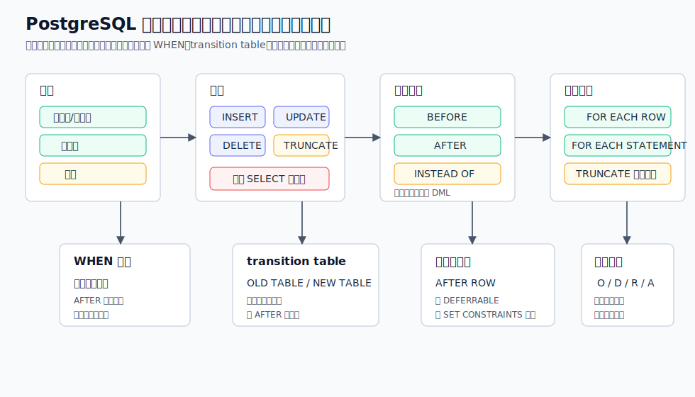
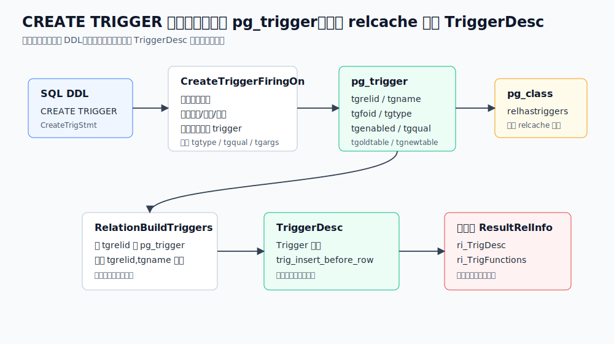
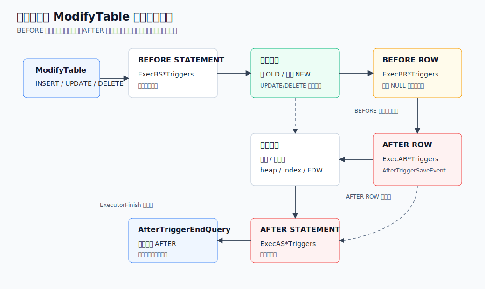
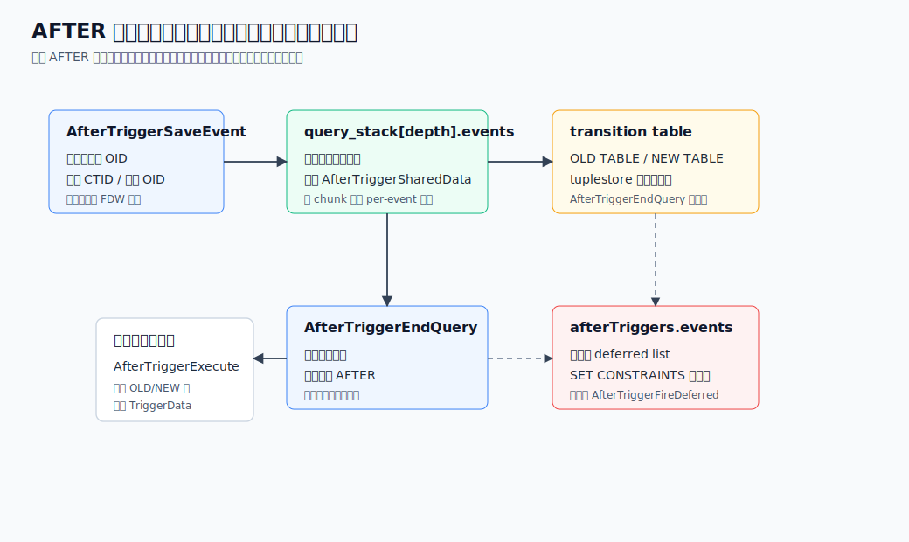
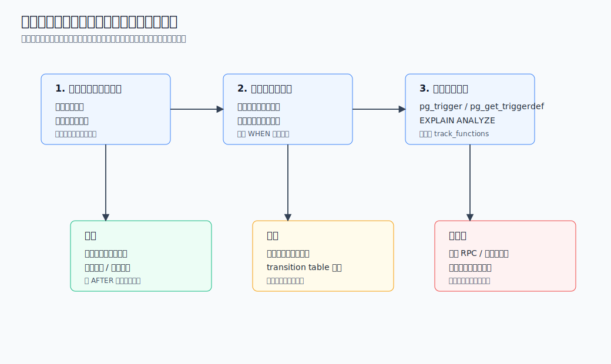

## 数据库筑基课 - 触发器

### 作者
digoal

### 日期
2026-06-08

### 标签
PostgreSQL , 应用开发者 , 数据库筑基课 , 触发器 , 执行器 , 约束 , 审计 , transition table    

----

## 背景
   


这篇属于数据库筑基课里的“执行器机制 + 业务一致性实践”主题。触发器不是一个“数据库里自动跑点代码”的小功能，而是把数据修改事件、触发时机、行级/语句级粒度、事务边界、约束检查、分区、复制角色和过程语言函数绑在一起的机制。

本地 `markdown/` 目录没有发现独立的“数据库筑基课大纲”文件，所以本文不强行引用不存在的大纲；后续如果项目补充大纲，可以在这里补上课程目录链接。

先看工程痛点：

订单、账户、库存、审计、数据同步、物化统计这些系统，常常有一个共同问题：同一张表可能被后台任务、管理后台、应用服务、批量脚本、复制回放同时修改。如果“谁写表谁记审计、谁写表谁维护更新时间、谁写表谁刷新派生统计”完全放在应用侧，很容易有入口漏掉。触发器的价值，就是把某些必须贴近数据事实的逻辑挂在数据库写入路径上，让它随 `INSERT`、`UPDATE`、`DELETE`、`TRUNCATE` 自动发生。

但触发器的危险也来自同一个地方：它把额外行为藏进写入路径。一个普通 `UPDATE` 可能实际执行了函数调用、跨表写入、锁等待、递归触发、约束触发器排队，甚至把错误推迟到 `COMMIT`。所以触发器不是“少写应用代码”的捷径，而是一种需要边界、命名、观测和验证的执行机制。

本文以本地 PostgreSQL 源码 `postgres` 为主线。用户补充的 DeepWiki repoName `postgres/postgres` 可查询；本文使用其触发器相关问答和 “Query Execution and Table Commands” 页面作为架构导航，关键结论均回到官方文档和源码核验。

## 一、它解决什么问题？

触发器解决的是“当数据发生变化时，如何在数据库事务内自动执行一段与变化绑定的逻辑”的问题。

它通常把下面几类问题从应用侧转移到数据库写入路径：

1. **入口一致性。** 不管是哪套应用、脚本或后台任务写表，都会触发同一套规则。
2. **审计与溯源。** 在行变化发生时记录旧值、新值、操作者、时间、来源。
3. **派生数据维护。** 更新汇总表、计数器、搜索辅助表、变更队列。
4. **复杂约束。** 内置 `CHECK`、唯一约束、外键无法直接表达时，用触发器检查跨行或跨表规则。
5. **视图可写。** `INSTEAD OF` 触发器可以把对视图的 DML 转成对底层表的实际修改。
6. **延迟校验。** 约束触发器可以在语句末或事务末检查，配合 `SET CONSTRAINTS` 调整触发时机。

它付出的代价也必须明说：

- 行级触发器按受影响行数调用，批量 DML 会线性放大函数调用成本。
- `AFTER` 触发器要保存事件，必要时还要保存 transition table 的行集合。
- 触发器内 SQL 会再触发触发器，递归和级联行为由开发者控制。
- 触发器是隐式副作用，应用端只看 SQL 文本容易低估锁、WAL、延迟和失败点。
- 递延触发器可能把错误推迟到 `COMMIT` 或 `SET CONSTRAINTS IMMEDIATE`。
- 复制回放、批量导入、禁用触发器、分区行迁移会改变触发语义，运维必须知道边界。

## 二、它是什么？

PostgreSQL 官方触发器文档把触发器定义为：当某类操作发生时，数据库自动执行某个函数的规格说明。普通触发器可以挂在表、分区表、视图、外部表上；本文主线是普通 DML 触发器，事件触发器只在对比中提及。

普通触发器由几个维度组成：

| 维度 | 可选项 | 关键边界 |
|---|---|---|
| 对象 | 表、分区表、视图、外部表 | 视图只能有行级 `INSTEAD OF` DML 触发器，或语句级 `BEFORE/AFTER` 触发器 |
| 事件 | `INSERT`、`UPDATE`、`DELETE`、`TRUNCATE` | 没有 `SELECT` 触发器；`TRUNCATE` 只能语句级 |
| 时机 | `BEFORE`、`AFTER`、`INSTEAD OF` | `INSTEAD OF` 只能用于视图行级 DML |
| 粒度 | `FOR EACH ROW`、`FOR EACH STATEMENT` | 行级按行触发；语句级即使影响 0 行也会触发 |
| 条件 | `WHEN (...)` | 行级可引用 `OLD`/`NEW`；`INSTEAD OF` 不支持 `WHEN` |
| 列过滤 | `UPDATE OF column` | 只对 `UPDATE` 有意义，按 `SET` 目标列判断，不等于值真的改变 |
| transition table | `REFERENCING OLD TABLE/NEW TABLE` | 仅普通表 `AFTER` 触发器；不能和多事件、列过滤、约束触发器混用 |
| 约束触发器 | `CREATE CONSTRAINT TRIGGER` | 必须是普通表 `AFTER ROW`，可递延 |
| 启用状态 | `ENABLE/DISABLE`，`ALWAYS`，`REPLICA` | 存在 `pg_trigger.tgenabled`，受 `session_replication_role` 影响 |



图 1 说明：触发器不是单一类型。工程上要先确定“对象、事件、时机、粒度”四个主维度，再决定是否需要 `WHEN`、transition table、约束触发器和复制角色策略。很多坑都来自把这些维度混在一起理解。

### 普通触发器和事件触发器

普通触发器响应表、视图、外部表上的 DML 或 `TRUNCATE`。事件触发器响应数据库级事件，例如 DDL 命令开始、DDL 命令结束、对象删除、登录等，函数返回类型是 `event_trigger`，不是 `trigger`。事件触发器是数据库级对象，不是挂在某张表上的行级机制；只有超级用户能创建事件触发器。本文后续默认“触发器”指普通触发器。

## 三、核心原理

### 3.1 DDL 创建：从 `CREATE TRIGGER` 到 `pg_trigger`

触发器创建入口在 [`src/backend/commands/trigger.c`](../postgres/src/backend/commands/trigger.c)。`CreateTrigger()` 调用 `CreateTriggerFiringOn()`，后者做几类关键工作：

1. 打开目标关系并加 `ShareRowExclusiveLock`。
2. 校验对象类型：普通表和分区表不能有 `INSTEAD OF`；视图不能有行级 `BEFORE/AFTER`；外部表不能有 `INSTEAD OF` 和约束触发器。
3. 计算 `tgtype` 位图，把“行级/语句级、BEFORE/AFTER/INSTEAD、INSERT/UPDATE/DELETE/TRUNCATE”编码到 `pg_trigger.tgtype`。
4. 校验 transition table 限制：只能 `AFTER`，不能 `TRUNCATE`，不能多事件，不能列过滤，不能约束触发器，不能外部表或视图，分区表/继承子表还有额外限制。
5. 解析 `WHEN` 条件，把 `OLD`、`NEW` 放入解析命名空间，生成 `nodeToString()` 格式的表达式树存入 `pg_trigger.tgqual`。
6. 查找触发器函数，确认函数返回类型是 `trigger`。
7. 向 `pg_trigger` 写入元组，包括 `tgrelid`、`tgname`、`tgfoid`、`tgtype`、`tgenabled`、`tgattr`、`tgargs`、`tgqual`、`tgoldtable`、`tgnewtable` 等。
8. 设置 `pg_class.relhastriggers` 或失效关系缓存。
9. 记录依赖关系：触发器依赖函数、表、列、`WHEN` 表达式涉及的对象；约束触发器还和 `pg_constraint` 关联。
10. 如果在分区表上创建用户行级触发器，会递归给已有分区创建 clone trigger，后续分区 attach 时也会处理。

`pg_trigger` 的结构在 [`src/include/catalog/pg_trigger.h`](../postgres/src/include/catalog/pg_trigger.h) 定义，官方目录文档 [`doc/src/sgml/catalogs.sgml`](../postgres/doc/src/sgml/catalogs.sgml) 也说明了各字段含义。几个字段尤其重要：

| 字段 | 含义 | 工程价值 |
|---|---|---|
| `tgrelid` | 触发器挂在哪个关系上 | 通过它查一张表有哪些触发器 |
| `tgparentid` | 分区 clone trigger 的父触发器 | 判断是否来自分区父表 |
| `tgfoid` | 要调用的函数 OID | 触发器最终执行的是函数 |
| `tgtype` | 触发条件位图 | 编码时机、事件和粒度 |
| `tgenabled` | 启用状态 | `O/D/R/A`，受复制角色影响 |
| `tgisinternal` | 是否系统内部生成 | 外键等约束会生成内部触发器 |
| `tgconstraint` | 关联约束 | 约束触发器和外键内部触发器的重要线索 |
| `tgattr` | `UPDATE OF` 列号 | 列过滤触发器的列集合 |
| `tgargs` | 触发器参数 | 每个参数以空字符结尾存储 |
| `tgqual` | `WHEN` 条件表达式树 | 执行时反序列化并求值 |
| `tgoldtable` / `tgnewtable` | transition table 名称 | 支持 `OLD TABLE`、`NEW TABLE` |



图 2 说明：`CREATE TRIGGER` 并不是把一段 SQL 文本原样挂在表上。PostgreSQL 会把触发器规格拆成 catalog 字段，写入 `pg_trigger`，再通过 relcache 构造执行期结构。`relhastriggers` 是快速提示，不是完整定义。

### 3.2 关系缓存：`TriggerDesc` 才是执行器真正看的结构

执行器不会每行都去查 `pg_trigger`。关系缓存加载时，`RelationBuildTriggers()` 会扫描 `pg_trigger`，把 catalog 元组复制成内存里的 [`TriggerDesc`](../postgres/src/include/utils/reltrigger.h)：

```c
typedef struct TriggerDesc
{
    Trigger    *triggers;
    int         numtriggers;
    bool        trig_insert_before_row;
    bool        trig_insert_after_row;
    bool        trig_insert_instead_row;
    bool        trig_insert_before_statement;
    bool        trig_insert_after_statement;
    ...
    bool        trig_insert_new_table;
    bool        trig_update_old_table;
    bool        trig_update_new_table;
    bool        trig_delete_old_table;
} TriggerDesc;
```

这里有两个关键点。

第一，`RelationBuildTriggers()` 用 `TriggerRelidNameIndexId` 扫描，注释明确说明这会按触发器名称顺序读取，因而触发器按名称字母序触发。官方文档也说明：同一关系、同一事件上的多个触发器按名称字母序触发。

第二，`TriggerDesc` 里有大量布尔提示位。执行器可以先看 `trig_insert_before_row` 这类标志，如果没有对应触发器就跳过整段触发器逻辑。这是 PostgreSQL 把“灵活触发器系统”和“常见无触发器写入路径”隔开的关键。

### 3.3 写入执行：BEFORE 立即执行，AFTER 先排队

普通 DML 最终进入 [`src/backend/executor/nodeModifyTable.c`](../postgres/src/backend/executor/nodeModifyTable.c) 的 `ModifyTable` 路径。以 `INSERT` 为例，源码顺序大致是：

1. 如有分区路由，先找到目标分区。
2. 如有 `BEFORE ROW INSERT`，调用 `ExecBRInsertTriggers()`。
3. 如有 `INSTEAD OF ROW INSERT`，调用 `ExecIRInsertTriggers()`，常见于视图。
4. 否则执行实际写入：生成列、RLS、约束、heap/FDW 插入、索引维护。
5. 如有 `AFTER ROW INSERT` 或 transition table 需求，调用 `ExecARInsertTriggers()`，内部通过 `AfterTriggerSaveEvent()` 排队。
6. 语句级 `AFTER` 在 `ExecASInsertTriggers()` 中排队。
7. 查询结束时 `AfterTriggerEndQuery()` 触发立即 `AFTER` 事件，并把递延事件转移到事务级队列。

`UPDATE`、`DELETE` 同理，但需要处理旧行、并发更新、`EvalPlanQual` 重检、分区行迁移等复杂情况。`ExecBRUpdateTriggers()` 会为 `UPDATE` 准备 `OLD` 和 `NEW`；如果处于 READ COMMITTED 并遇到并发更新，可能用 EPQ 重新形成新行。`ExecBRDeleteTriggers()` 会锁定即将删除的元组并传给触发器。



图 3 说明：`BEFORE ROW` 在实际写入前执行，可以修改 `NEW` 或返回 `NULL` 跳过当前行。`AFTER ROW` 不是在行写完后立刻调用函数，而是保存事件，语句结束时再统一触发立即事件。语句级触发器与行级触发器的顺序也不同。

### 3.4 触发器函数调用协议

触发器函数必须声明为无普通参数、返回 `trigger`。这不是说函数没有输入，而是输入不通过普通参数传递。C 层的 [`TriggerData`](../postgres/src/include/commands/trigger.h) 结构包含：

- `tg_event`：事件类型、行级/语句级、BEFORE/AFTER/INSTEAD。
- `tg_relation`：触发器所在关系。
- `tg_trigtuple`：旧行或待插入行。
- `tg_newtuple`：`UPDATE` 的新行。
- `tg_trigger`：当前触发器定义，包括名称、函数、参数、`WHEN`、transition table 名称等。
- `tg_oldtable` / `tg_newtable`：transition table 的 tuplestore。
- `tg_updatedcols`：`UPDATE` 涉及的列集合。

触发器函数调用由 `ExecCallTriggerFunc()` 完成。它会缓存 `fmgr` 查找信息，把 `TriggerData` 放入 `fcinfo->context`，增加 `MyTriggerDepth`，再调用函数。`pg_trigger_depth()` 返回的就是当前触发器嵌套层级。

PL/pgSQL 的处理在 [`src/pl/plpgsql/src/pl_exec.c`](../postgres/src/pl/plpgsql/src/pl_exec.c)。`plpgsql_exec_trigger()` 会把 C 层 `TriggerData` 映射成 PL/pgSQL 里的特殊变量：

| 变量 | 含义 |
|---|---|
| `NEW` | `INSERT`/`UPDATE` 的新行，行级触发器可用 |
| `OLD` | `UPDATE`/`DELETE` 的旧行，行级触发器可用 |
| `TG_NAME` | 触发器名称 |
| `TG_WHEN` | `BEFORE`、`AFTER` 或 `INSTEAD OF` |
| `TG_LEVEL` | `ROW` 或 `STATEMENT` |
| `TG_OP` | `INSERT`、`UPDATE`、`DELETE` 或 `TRUNCATE` |
| `TG_RELID` | 触发关系 OID |
| `TG_TABLE_SCHEMA` / `TG_TABLE_NAME` | 触发关系的 schema 和名称 |
| `TG_NARGS` / `TG_ARGV[]` | `CREATE TRIGGER` 中传入的字符串参数 |

返回值规则要牢记：

- 语句级触发器应该返回 `NULL`。
- 行级 `BEFORE INSERT/UPDATE` 返回 `NEW` 表示继续，返回修改后的 `NEW` 可以改写将写入的行，返回 `NULL` 表示跳过当前行。
- 行级 `BEFORE DELETE` 通常返回 `OLD` 表示继续，返回 `NULL` 表示跳过删除。
- 行级 `AFTER` 的返回值会被忽略，通常返回 `NULL`。
- 行级 `INSTEAD OF` 触发器返回非空行表示它完成了视图底层修改，影响行数会增加；返回 `NULL` 表示未执行该行修改。

生成列也有特殊边界：存储生成列在 `BEFORE` 触发器之后、`AFTER` 触发器之前计算。`BEFORE` 触发器中不要依赖 `NEW` 的新生成列值；即使修改生成列，也会被后续计算覆盖。

### 3.5 `TriggerEnabled()`：不满足条件就不触发

执行器在真正调用或排队触发器前，会走 `TriggerEnabled()`：

1. 检查 `tgenabled` 和 `session_replication_role`。
   - `O`：origin/local 触发。
   - `D`：禁用。
   - `R`：replica 触发。
   - `A`：always 触发。
2. 如果是 `UPDATE OF column` 列过滤触发器，检查 `SET` 目标列是否命中。
3. 如果有 `WHEN` 条件，第一次执行时把 `tgqual` 反序列化为表达式树，替换 `OLD`/`NEW` 引用并准备表达式，然后逐行求值。

`WHEN` 对 `AFTER` 触发器的意义很大。官方文档和源码都说明：`AFTER` 行级触发器的 `WHEN` 条件在行更新后、事件入队前判断；如果不满足，就不会保存事件，也不需要语句末再取回该行。这对大批量 DML 中只有少数行需要触发的场景很有价值。

列过滤触发器容易误解：`UPDATE OF x` 判断的是 `UPDATE` 语句是否把 `x` 列列入 `SET` 目标。`UPDATE t SET x = x` 会触发；而某个 `BEFORE UPDATE` 触发器修改了 `x`，不会让另一个 `UPDATE OF x` 触发器因为这个修改自动触发。

### 3.6 AFTER 队列、递延触发器和 transition table

`AFTER` 触发器使用 [`AfterTriggersData`](../postgres/src/backend/commands/trigger.c) 管理事务内状态。源码注释把结构分成几类：

- `query_stack[query_depth].events`：当前查询级别排队的 `AFTER` 事件。
- `afterTriggers.events`：事务级 deferred event list。
- `firing_counter`：每轮触发的 firing id，避免 `SET CONSTRAINTS` 嵌套触发混乱。
- `trans_stack`：子事务回滚时恢复递延事件和 `SET CONSTRAINTS` 状态。
- `AfterTriggersTableData`：每个关系和操作类型的 transition table tuplestore，以及语句级触发器是否已排队的信息。

`AfterTriggerSaveEvent()` 被 `ExecAR*Triggers()` 和 `ExecAS*Triggers()` 调用。它不只是“把触发器放进队列”：

- 对行级 `AFTER`，保存 CTID，`UPDATE` 保存旧行和新行 CTID；跨分区更新还要保存源分区和目标分区 OID。
- 对外部表行级触发器，必要时用 tuplestore 保存 FDW 提供的元组。
- 如有 transition table，立即把 OLD/NEW 行放入 tuplestore。源码解释原因：`AFTER ROW` 触发器也允许查询本语句的 transition table，所以行集合必须在排队时构建，而不是等语句末才构建。
- 外键内部触发器和唯一约束重检触发器有额外跳过逻辑，避免明显不需要的检查。

`AfterTriggerEndQuery()` 在一个查询完成后运行。它会：

1. 标记本查询中应立即触发的事件。
2. 把递延事件移动到事务级 deferred list。
3. 调用 `afterTriggerInvokeEvents()` 执行立即触发器。
4. 处理触发器函数中新排队的事件。
5. 释放查询级 transition table tuplestore。

`AfterTriggerFireDeferred()` 在提交前触发事务级 deferred list。约束触发器如果定义为 `DEFERRABLE INITIALLY DEFERRED`，错误可能在这里才出现；`SET CONSTRAINTS IMMEDIATE` 也可以强制触发。



图 4 说明：transition table 和 deferred trigger 的生命周期不同。transition table 只需要活到 `AfterTriggerEndQuery()`，因为使用 transition table 的触发器不允许递延；递延约束触发器事件则可能活到事务提交前。

### 3.7 外键也是触发器系统的重要用户

PostgreSQL 外键约束的检查和级联动作由内部触发器实现，代码在 [`src/backend/utils/adt/ri_triggers.c`](../postgres/src/backend/utils/adt/ri_triggers.c)。这解释了几个现象：

- `pg_trigger` 里能看到 `tgisinternal = true` 的触发器。
- `ON UPDATE CASCADE`、`ON DELETE SET NULL` 等引用动作会执行普通 SQL `UPDATE`/`DELETE`，并触发引用表上的相关触发器。
- 如果用户触发器阻止或修改这些动作，可能破坏外键语义；官方文档明确把避免这种情况的责任放在触发器编写者身上。
- 外键触发器会缓存 SPI 计划，近期源码还包含批量 fast-path 元数据，用于摊薄某些 FK 检查开销。

所以，DBA 排查“为什么我没有建触发器，表上却有触发器”时，第一步要看 `tgisinternal` 和 `tgconstraint`。

## 四、横向对比

很多需求看起来都可以用触发器做，但触发器不一定是最小正确工具。

| 维度 | 触发器 | CHECK/NOT NULL/UNIQUE | 外键 | 生成列 | 规则/可更新视图 | 应用代码 |
|---|---|---|---|---|---|---|
| 主要目标 | 在数据变化时执行函数逻辑 | 声明式行内或索引约束 | 维护引用完整性 | 派生列值 | 查询重写或视图写入 | 业务流程编排 |
| 执行位置 | 执行器 DML 路径 | 执行器/索引路径 | 内部触发器 + 约束 | 表达式计算 | rewrite 阶段 | 应用进程 |
| 写入代价 | 函数调用、可能额外 SQL、事件队列 | 通常较低，规则明确 | 检查引用表和锁 | 表达式计算和存储 | 取决于重写后的 SQL | 可控但可能漏入口 |
| 事务一致性 | 同事务内，可回滚 | 同事务内 | 同事务内，可递延 | 同事务内 | 重写后同事务 | 取决于应用事务设计 |
| 可观测性 | 需查 `pg_trigger`、函数、执行计划 | catalog 和约束名清晰 | catalog 清晰但内部触发器存在 | 表结构清晰 | 重写后 SQL 可能不直观 | 应用日志清晰 |
| 适合场景 | 审计、复杂局部规则、跨入口派生写入 | 简单数据质量约束 | 引用完整性 | 确定性派生字段 | 视图兼容和重写 | 长流程、外部服务、RPC |
| 不适合场景 | 长耗时、远程调用、大量隐藏副作用 | 跨表复杂逻辑 | 非引用关系规则 | 需要副作用的逻辑 | 复杂多副作用 DML | 必须不可绕过的底层规则 |

触发器和约束的根本区别是：约束是声明式事实，数据库知道它在检查什么；触发器是过程式代码，数据库只知道何时调用函数。能用内置约束表达的规则，优先用内置约束。只有当规则确实需要旧值/新值、跨表操作、审计记录、视图底层写入或复杂过程逻辑时，触发器才更合适。

触发器和应用代码的区别是：触发器更靠近数据、不可被普通写入口绕过；应用代码更显式、更容易测试和观测。不要因为“应用里写起来麻烦”就把流程藏进触发器。反过来，如果一个规则是“所有写入口都必须遵守的数据事实”，只放在某个应用服务里也不可靠。

## 五、效果如何？

触发器的收益和代价不是一个固定数值，而取决于触发粒度、函数体、DML 行数、是否访问其他表、是否排队 `AFTER` 事件、是否使用 transition table、是否递延到提交。

### 收益

- **减少漏入口。** 所有直接写表的入口都会触发同一逻辑。
- **事务内原子性。** 触发器内修改和原语句在同一事务内，出错会一起回滚。
- **靠近旧值/新值。** 行级触发器天然拿到 `OLD`、`NEW`，适合审计和差量维护。
- **语句级集合视角。** transition table 让触发器看到一条语句影响的所有行，避免逐行重复查询。
- **可递延约束。** 一些跨行约束可以等事务末统一检查。

### 成本

- **CPU 成本。** 行级触发器每行调用函数，PL/pgSQL 还要执行解释器和 SPI。
- **锁和等待。** 触发器内 SQL 会访问其他表，可能引入额外锁顺序和死锁风险。
- **WAL 与写放大。** 触发器额外写审计表、汇总表，会产生自己的 heap/index/WAL 成本。
- **队列内存。** `AFTER` 事件保存在事务上下文；大量行级 `AFTER` 触发器会增加内存压力。源码注释还保留了“事件过大时写文件”的改进空间。
- **transition table 存储。** transition table 使用 tuplestore，行集合大时可能消耗内存并落临时文件。
- **提交尖峰。** deferred constraint trigger 在提交前触发，业务看到的延迟可能集中在 `COMMIT`。
- **可解释性下降。** SQL 文本和应用日志不一定显示触发器内部副作用。

生产上判断触发器效果，至少要看四类信号：

- DML 的 `EXPLAIN (ANALYZE)`，是否显示触发器耗时。
- `pg_trigger` 和 `pg_get_triggerdef()`，确认哪些触发器会触发。
- 触发器函数体是否启用函数统计，例如 `track_functions` 下的 `pg_stat_user_functions`。
- 等待事件、锁等待、WAL 量、临时文件和语句耗时是否随触发器变化。



图 5 说明：触发器适合靠近数据事实的轻量规则，不适合承载远程调用、复杂工作流和不可解释的链式副作用。设计触发器前，先确认它是否必须贴近数据、行数是否可控、是否可观测、是否有更声明式的替代方案。

## 六、实操 DEMO

下面示例是最小可验证实验，用来观察 `BEFORE ROW`、`AFTER ROW`、`AFTER STATEMENT` 和 transition table。本文没有在本地执行这些 SQL，因为当前任务只提供了 PostgreSQL 源码目录，没有可用的已启动 PostgreSQL 实例；示例按 PostgreSQL 语法编写，可在测试库中执行。

### 6.1 建表

```sql
DROP TABLE IF EXISTS account_batch_log;
DROP TABLE IF EXISTS account_audit;
DROP TABLE IF EXISTS account;

CREATE TABLE account (
    id          bigint PRIMARY KEY,
    balance     numeric NOT NULL CHECK (balance >= 0),
    updated_at  timestamptz NOT NULL DEFAULT clock_timestamp()
);

CREATE TABLE account_audit (
    audit_id     bigserial PRIMARY KEY,
    account_id   bigint NOT NULL,
    old_balance  numeric,
    new_balance  numeric,
    op           text NOT NULL,
    changed_at   timestamptz NOT NULL DEFAULT clock_timestamp(),
    changed_by   text NOT NULL DEFAULT current_user
);

CREATE TABLE account_batch_log (
    log_id     bigserial PRIMARY KEY,
    op         text NOT NULL,
    row_count  bigint NOT NULL,
    logged_at  timestamptz NOT NULL DEFAULT clock_timestamp()
);
```

### 6.2 `BEFORE ROW`：修改将写入的行

```sql
CREATE OR REPLACE FUNCTION account_before_update()
RETURNS trigger
LANGUAGE plpgsql
AS $$
BEGIN
    IF NEW.balance < 0 THEN
        RAISE EXCEPTION 'balance cannot be negative: %', NEW.balance;
    END IF;

    NEW.updated_at := clock_timestamp();
    RETURN NEW;
END;
$$;

CREATE TRIGGER account_bu_balance
BEFORE UPDATE OF balance ON account
FOR EACH ROW
WHEN (OLD.balance IS DISTINCT FROM NEW.balance)
EXECUTE FUNCTION account_before_update();
```

验证点：

- `UPDATE OF balance` 只在 `balance` 出现在 `SET` 目标列时触发。
- `WHEN` 判断旧值和新值不同，避免无意义调用。
- 返回 `NEW` 表示继续写入；如果返回 `NULL`，当前行更新会被跳过。

### 6.3 `AFTER ROW`：审计最终变化

```sql
CREATE OR REPLACE FUNCTION account_after_update_audit()
RETURNS trigger
LANGUAGE plpgsql
AS $$
BEGIN
    INSERT INTO account_audit(account_id, old_balance, new_balance, op)
    VALUES (OLD.id, OLD.balance, NEW.balance, TG_OP);

    RETURN NULL;
END;
$$;

CREATE TRIGGER account_au_balance_audit
AFTER UPDATE OF balance ON account
FOR EACH ROW
WHEN (OLD.balance IS DISTINCT FROM NEW.balance)
EXECUTE FUNCTION account_after_update_audit();
```

验证点：

- `AFTER` 看到的是最终写入后的行值。
- 返回值被忽略，通常返回 `NULL`。
- 如果审计写入失败，原 `UPDATE` 同事务回滚。

### 6.4 `AFTER STATEMENT` + transition table：一次语句一个集合

```sql
CREATE OR REPLACE FUNCTION account_after_update_stmt()
RETURNS trigger
LANGUAGE plpgsql
AS $$
BEGIN
    INSERT INTO account_batch_log(op, row_count)
    SELECT TG_OP, count(*) FROM new_rows;

    RETURN NULL;
END;
$$;

CREATE TRIGGER account_au_stmt
AFTER UPDATE ON account
REFERENCING NEW TABLE AS new_rows
FOR EACH STATEMENT
EXECUTE FUNCTION account_after_update_stmt();
```

验证点：

- `new_rows` 是本条 `UPDATE` 的 after-image 行集合。
- 即使 `UPDATE` 影响 0 行，语句级触发器仍会触发，此时 `new_rows` 为空。
- transition table 不适合无限大批量更新；大行集合可能消耗内存和临时文件。

### 6.5 执行和观察

```sql
INSERT INTO account(id, balance) VALUES (1, 100), (2, 200), (3, 300);

UPDATE account
SET balance = balance + 10
WHERE id IN (1, 2);

SELECT * FROM account ORDER BY id;
SELECT account_id, old_balance, new_balance, op FROM account_audit ORDER BY audit_id;
SELECT op, row_count FROM account_batch_log ORDER BY log_id;

SELECT
    tgname,
    tgenabled,
    tgisinternal,
    pg_get_triggerdef(oid, false) AS trigger_def
FROM pg_trigger
WHERE tgrelid = 'account'::regclass
ORDER BY tgname;

EXPLAIN (ANALYZE, VERBOSE, COSTS OFF, TIMING ON)
UPDATE account
SET balance = balance + 1
WHERE id = 3;
```

不要在生产库直接执行这个 demo。建议在临时库执行，并用 `EXPLAIN (ANALYZE)` 观察触发器耗时，用 `pg_trigger` 确认触发器定义。

## 七、最佳实践

### 面向数据库架构师

1. **优先声明式约束。** 能用 `NOT NULL`、`CHECK`、唯一约束、外键、生成列表达的规则，不要用触发器。
2. **把触发器定位为数据事实守门员。** 审计、派生事实、不可绕过的本地一致性适合触发器；订单流程、支付调用、通知发送不适合。
3. **明确触发粒度。** 大多数行级副作用都要问：是否可以改成语句级 + transition table，或者异步变更队列表。
4. **为递归设计退出条件。** 触发器内写同一张表或关联表时，必须有幂等条件、状态条件或明确的触发器禁用策略。
5. **把命名当成执行顺序。** 同一事件触发器按名称字母序触发。用 `01_`、`02_` 这类前缀虽然朴素，但比隐式顺序可靠。

### 面向 DBA

1. **上线前查 catalog。**

```sql
SELECT
    c.oid::regclass AS table_name,
    t.tgname,
    t.tgenabled,
    t.tgisinternal,
    co.conname AS constraint_name,
    pg_get_triggerdef(t.oid, false) AS trigger_def
FROM pg_trigger t
JOIN pg_class c ON c.oid = t.tgrelid
LEFT JOIN pg_constraint co ON co.oid = t.tgconstraint
WHERE NOT t.tgisinternal
ORDER BY 1, 2;
```

2. **批量导入前确认触发器语义。** `COPY` 和批量 `INSERT` 也会触发行级/语句级触发器。禁用触发器前要确认是否会绕过审计、外键、派生表维护。
3. **谨慎使用 `session_replication_role`。** 它会影响 `tgenabled` 为 `O/R/A/D` 的触发器触发行为，错误使用可能绕过业务触发器或约束相关触发器。
4. **用测试事务验证 `COMMIT` 延迟。** 递延约束触发器可能把检查推迟到提交前，压测不能只看 `UPDATE` 语句本身耗时。
5. **分区表重点看 clone trigger。** 分区父表上的行级触发器会克隆到分区；排查时要看 `tgparentid`。

### 面向业务开发者

1. **触发器函数要短。** 不做远程调用，不做长循环，不做不可控动态 SQL。
2. **用 `WHEN` 减少无效调用。** 大批量更新中，能在 `WHEN` 过滤掉的行，不要进函数里再判断。
3. **避免隐藏返回语义。** `BEFORE` 行级触发器返回 `NULL` 会跳过当前行，这是强行为，应在函数名和注释里写清楚。
4. **把审计表设计成 append-only。** 审计触发器不要再更新原表，避免递归。
5. **写迁移脚本时带回滚方案。** `CREATE OR REPLACE TRIGGER` 不能替换约束触发器；一个事务内先改表再替换触发器，已经排队的触发决策不会重新计算，官方文档不建议这样做。

## 八、适合与不适合场景

### 适合

- 多个系统入口写同一张表，必须统一更新时间、操作者、审计日志。
- 表变更需要写入轻量级本地 outbox 表，由异步消费者发消息。
- 需要维护局部汇总表，且行数可控、逻辑简单、失败必须和原 DML 一起回滚。
- 视图需要对外保持兼容写入接口，用 `INSTEAD OF` 触发器拆解到底层表。
- 需要事务末检查的复杂约束，且能接受 `COMMIT` 时失败。

### 不适合

- 触发器内调用外部 HTTP/RPC、发短信、发邮件、写远程系统。
- 高吞吐批量更新每行都执行复杂 SQL，且没有 `WHEN` 过滤或语句级聚合。
- 业务流程需要多步骤状态机、人工审批、补偿、重试。
- 触发器内反复修改同一张表，靠 `pg_trigger_depth()` 勉强防递归但没有业务幂等条件。
- 只是为了省应用代码，把本来清晰的流程隐藏到数据库函数里。

## 九、常见坑

1. **以为 `UPDATE OF col` 等于列值改变。** 它看的是 `SET` 目标列，不是最终值差异。需要值变化时加 `WHEN (OLD.col IS DISTINCT FROM NEW.col)`。
2. **在 `BEFORE` 中读取新生成列。** 存储生成列在 `BEFORE` 后计算，`AFTER` 中才能可靠查看新生成值。
3. **行级触发器批量放大。** `UPDATE big_table SET ...` 影响 100 万行，就是 100 万次行级函数调用。
4. **递归触发。** 触发器内 SQL 会再次触发触发器，PostgreSQL 没有直接限制级联深度。`pg_trigger_depth()` 可观测深度，但不是业务幂等的替代品。
5. **错误禁用触发器。** `ALTER TABLE ... DISABLE TRIGGER ALL` 会影响用户触发器，也可能影响内部触发器，权限和风险都很高。
6. **外键动作触发用户触发器。** `ON DELETE CASCADE` 等动作是普通 SQL 修改引用表，会触发引用表上的触发器。
7. **分区行迁移语义复杂。** 更新分区键导致跨分区移动时，行级触发器可能表现为源分区 `DELETE` 加目标分区 `INSERT`，而语句级仍按目标语句事件理解。
8. **transition table 被误用成无限缓冲。** 它适合一次语句的集合视角，不适合无限大批量任务。大批量应分批执行。
9. **递延触发器把错误推迟。** 应用可能在前面多条语句都成功，最后 `COMMIT` 才失败。
10. **视图触发器和规则混淆。** 视图语句级触发器只有在行级 `INSTEAD OF` 触发器处理动作时才触发；如果由规则或自动可更新视图改写到底层表，触发的是底层表触发器。

## 十、扩展问题

1. 为什么 PostgreSQL 把 `AFTER` 触发器设计成事件队列，而不是每行写完立即调用？
2. 如果一个审计触发器只需要记录“本语句影响了多少行”，行级触发器和语句级 transition table 哪个更合适？
3. `CHECK` 约束、外键、触发器都能阻止非法写入，它们在可解释性和优化空间上有什么不同？
4. 分区表上的行级触发器为什么要 clone 到分区？如果不 clone，会丢失哪些执行期信息？
5. 为什么 transition table 不允许和可递延约束触发器混用？
6. 批量导入时禁用触发器会节省什么成本，又可能破坏哪些数据事实？
7. 如果触发器内要维护一个汇总表，如何设计幂等和锁顺序，避免死锁和重复累加？

## 十一、扩展阅读

本节主要来源：

- PostgreSQL 官方触发器行为文档：[`doc/src/sgml/trigger.sgml`](../postgres/doc/src/sgml/trigger.sgml)
- `CREATE TRIGGER` 官方语法与限制：[`doc/src/sgml/ref/create_trigger.sgml`](../postgres/doc/src/sgml/ref/create_trigger.sgml)
- `pg_trigger` 系统目录说明：[`doc/src/sgml/catalogs.sgml`](../postgres/doc/src/sgml/catalogs.sgml)
- PL/pgSQL 触发器变量与示例：[`doc/src/sgml/plpgsql.sgml`](../postgres/doc/src/sgml/plpgsql.sgml)
- 事件触发器文档：[`doc/src/sgml/event-trigger.sgml`](../postgres/doc/src/sgml/event-trigger.sgml)
- 触发器 catalog 定义：[`src/include/catalog/pg_trigger.h`](../postgres/src/include/catalog/pg_trigger.h)
- 执行期 `TriggerData` 和触发器函数声明：[`src/include/commands/trigger.h`](../postgres/src/include/commands/trigger.h)
- relcache 触发器结构：[`src/include/utils/reltrigger.h`](../postgres/src/include/utils/reltrigger.h)
- 触发器创建、执行、AFTER 队列、transition table：[`src/backend/commands/trigger.c`](../postgres/src/backend/commands/trigger.c)
- DML 执行器触发器调用点：[`src/backend/executor/nodeModifyTable.c`](../postgres/src/backend/executor/nodeModifyTable.c)
- PL/pgSQL 触发器执行映射：[`src/pl/plpgsql/src/pl_exec.c`](../postgres/src/pl/plpgsql/src/pl_exec.c)
- 外键内部触发器实现：[`src/backend/utils/adt/ri_triggers.c`](../postgres/src/backend/utils/adt/ri_triggers.c)
- 回归测试触发器用例：[`src/test/regress/sql/triggers.sql`](../postgres/src/test/regress/sql/triggers.sql)
- DeepWiki：`postgres/postgres` 触发器相关问答与 “Query Execution and Table Commands” 页面，仅作架构导航，正文事实以本地源码和官方文档为准。
  
## 附录 
1、克隆代码  
```  
git clone --depth 1 https://github.com/postgres/postgres
```  
  
2、启用 codex, 使用 [数据库筑基课 skill](../skills/README.md).  
```
文章标题: 
  数据库筑基课 - 触发器
项目源码(本地目录): 
  postgres
项目 codebase 文件名: 
  postgres/CLAUDE.md 
开源项目相关的 deepwiki repoName: 
  postgres/postgres
```
    
#### [PostgreSQL 解决方案集合](../201706/20170601_02.md "40cff096e9ed7122c512b35d8561d9c8")
  
  
#### [德哥 / digoal's Github - 公益是一辈子的事.](https://github.com/digoal/blog/blob/master/README.md "22709685feb7cab07d30f30387f0a9ae")
  
  
#### [About 德哥](https://github.com/digoal/blog/blob/master/me/readme.md "a37735981e7704886ffd590565582dd0")
  
  

  
