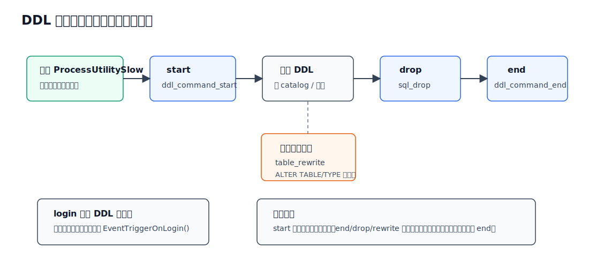
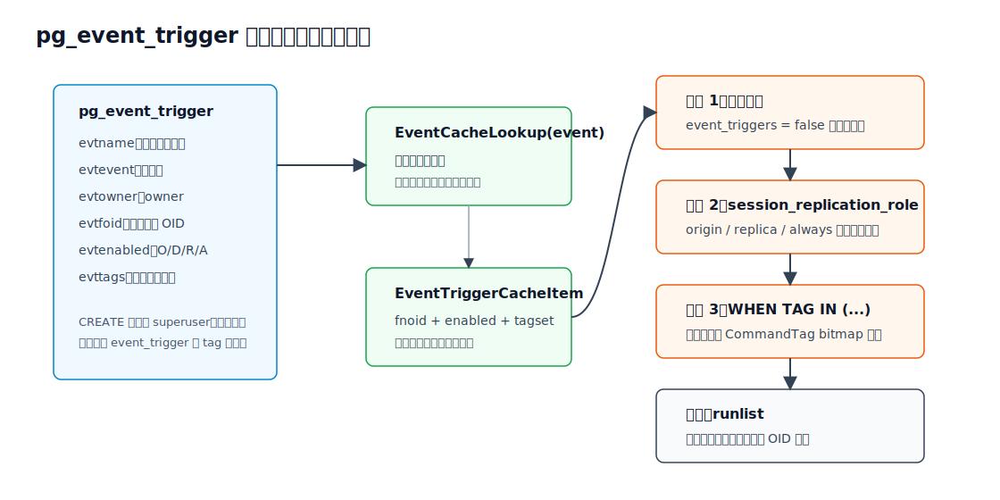
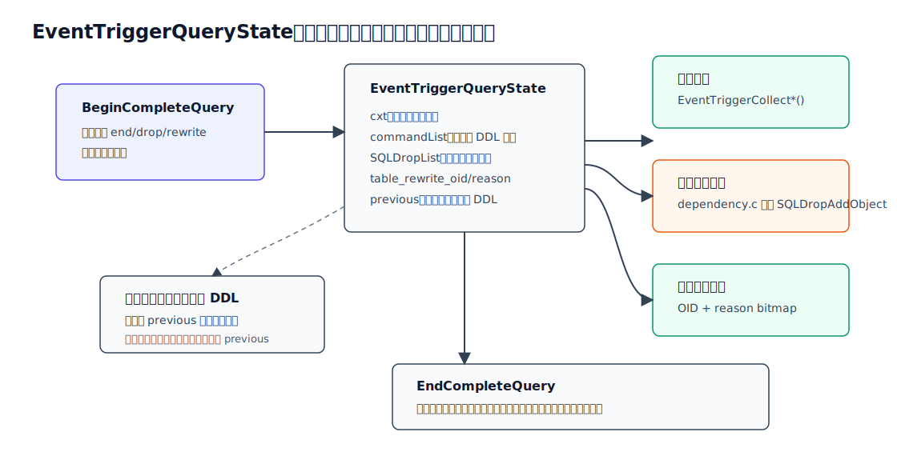
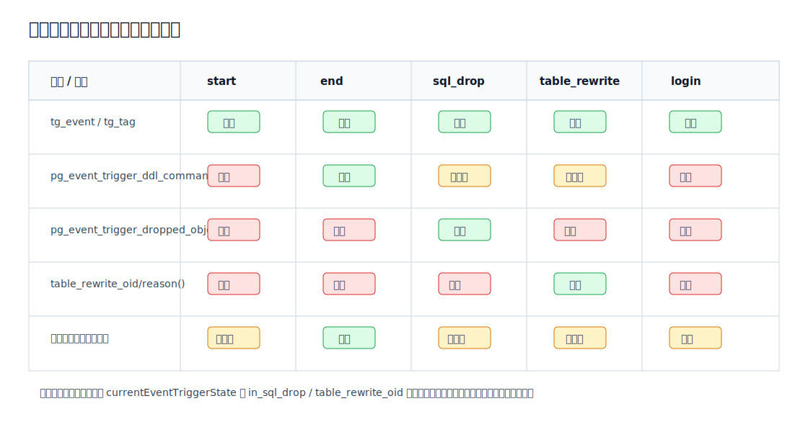
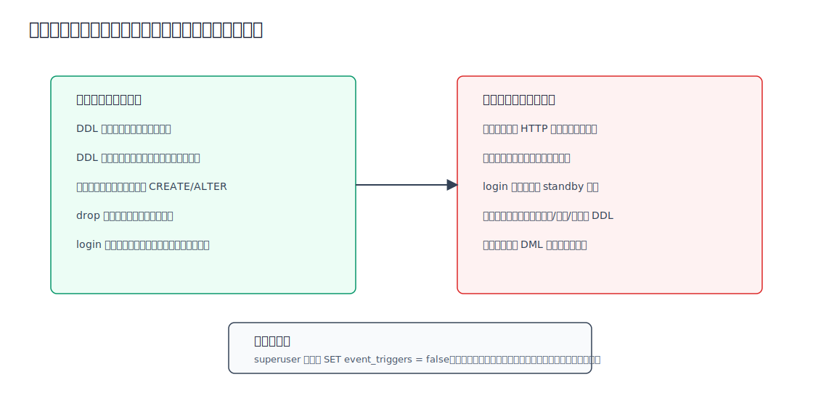

## 数据库筑基课 - 事件触发器

### 作者
digoal

### 日期
2026-06-08

### 标签
PostgreSQL , 应用开发者 , 数据库筑基课 , DDL治理 , 事件触发器 , 运维审计    

----

## 背景
   


本文属于“DDL 治理、元数据变更审计与运维边界”基础能力。当前项目的 `markdown` 目录未发现明确的“数据库筑基课大纲”文件，因此本文按本地 PostgreSQL 源码、官方文档、回归测试和 DeepWiki 辅助说明展开。

业务系统里真正危险的变更，经常不是一条慢 SQL，而是一条看似普通的 DDL：

- 开发在高峰期执行 `ALTER TABLE ... TYPE`，触发表重写，表被长时间锁住。
- 有人 `DROP SCHEMA ... CASCADE`，顺带删掉依赖对象，审计系统只看见最终故障。
- 生产库被错误创建函数、触发器、扩展，问题过几天才暴露。
- 希望统一记录 DDL，但应用层代理、审计日志、客户端规范都可能绕过。

事件触发器解决的不是“每行数据变化如何响应”，而是“数据库级事件发生时，能不能在数据库内部做审计、拦截和治理”。它站在 utility command 执行路径上，能捕捉一部分 DDL、对象删除、表重写和登录事件。它的价值很直接：靠近内核、覆盖所有客户端、和事务绑定。代价也同样直接：写错会阻断 DDL，登录事件写错甚至可能让数据库难以连接。

## 一、它解决什么问题？

普通触发器绑定在表上，处理 `INSERT`、`UPDATE`、`DELETE`、`TRUNCATE` 等 DML 或表级事件。它看不到 `CREATE TABLE`、`DROP FUNCTION`、`ALTER TYPE`、`REINDEX`、`COMMENT`、`GRANT` 这类元数据变更。应用层审计又有两个天然漏洞：一是多入口系统中不一定所有 DDL 都经过同一个应用；二是超级用户、维护脚本、迁移工具可能直接连库。

事件触发器把问题转换成数据库内部的事件处理：

1. DDL 执行前能不能拦截？用 `ddl_command_start`。
2. DDL 执行后能不能看到实际创建或修改的对象？用 `ddl_command_end` 和 `pg_event_trigger_ddl_commands()`。
3. 删除对象前后能不能知道被删对象和依赖对象？用 `sql_drop` 和 `pg_event_trigger_dropped_objects()`。
4. 表即将被物理重写时能不能阻止？用 `table_rewrite`。
5. 用户登录后能不能执行轻量初始化或策略检查？用 `login`。

它牺牲的是系统可用性边界。事件触发器函数运行在触发它的会话和事务中。函数抛错会中止当前命令或事务；登录触发器抛错会阻止连接；长逻辑会把 DDL 或登录路径拖慢。所以事件触发器更像“数据库内的安全阀和审计探针”，不是通用后台任务框架。

## 二、它是什么？

一个简洁定义：

> PostgreSQL 事件触发器是数据库级触发器，定义在 `pg_event_trigger` 系统表中，由 `ProcessUtility` 和登录路径在特定事件点调用，用于捕捉 DDL、对象删除、表重写和登录等数据库级事件。

它有几个关键特征：

- **数据库级**：事件触发器属于某个数据库，不是某张表。官方文档明确说它 global to a particular database。
- **面向 DDL 和登录**：支持的事件是 `ddl_command_start`、`ddl_command_end`、`sql_drop`、`table_rewrite`、`login`。
- **需要特殊函数类型**：触发函数必须声明为无参数、返回 `event_trigger`。PL/pgSQL、PL/Python、PL/Tcl、PL/Perl、C 等支持事件触发器的语言可以写，plain SQL 函数不能作为事件触发器函数。
- **创建权限很高**：`CREATE EVENT TRIGGER` 只有 superuser 能执行；源码 `CreateEventTrigger()` 也直接检查 `superuser()`。
- **不覆盖所有命令**：事件触发器不支持数据库、角色、表空间、参数权限、`ALTER SYSTEM` 这类 shared/global 对象命令，也不支持事件触发器自身的 DDL。

系统表结构来自 `src/include/catalog/pg_event_trigger.h`：

| 字段 | 含义 |
|---|---|
| `evtname` | 事件触发器名，数据库内唯一 |
| `evtevent` | 事件名，例如 `ddl_command_start` |
| `evtowner` | owner，引用 `pg_authid` |
| `evtfoid` | 被调用函数的 OID，引用 `pg_proc` |
| `evtenabled` | 是否启用，以及 origin/replica/always 语义 |
| `evttags` | `WHEN TAG IN (...)` 的命令标签数组 |

## 三、核心原理

### 3.1 事件时序：它插在 utility command 的哪一段？

PostgreSQL 普通查询会走 parser、rewriter、planner、executor；DDL、`GRANT`、`COMMENT`、`REINDEX` 等 utility command 的核心入口在 `src/backend/tcop/utility.c`。本地源码中，事件触发器主要接入 `ProcessUtilitySlow()`：

1. 如果是完整查询，调用 `EventTriggerBeginCompleteQuery()` 准备事件状态。
2. DDL 主体执行前，调用 `EventTriggerDDLCommandStart(parsetree)`。
3. 执行具体 utility command，并在过程中收集 DDL 命令、删除对象、表重写信息。
4. DDL 主体执行后，先调用 `EventTriggerSQLDrop(parsetree)`，再调用 `EventTriggerDDLCommandEnd(parsetree)`。
5. 无论成功还是报错，都在 `PG_FINALLY` 里调用 `EventTriggerEndCompleteQuery()` 清理状态。

`login` 事件不在这条 DDL 路径中。它由 `EventTriggerOnLogin()` 在认证连接进入数据库后执行，并且内部会启动事务、设置快照、调用触发器函数。



图 1 说明：`ddl_command_start` 在主命令执行前，适合做禁止和预检；`ddl_command_end` 在 catalog 已变更但事务未提交前，适合审计实际变更；`sql_drop` 在 `ddl_command_end` 前，专门暴露删除对象列表；`table_rewrite` 是 ALTER 过程中的中途事件；`login` 是独立登录路径。

### 3.2 支持哪些事件？

| 事件 | 触发时机 | 典型用途 | 关键限制 |
|---|---|---|---|
| `ddl_command_start` | 支持的 DDL 执行前 | 禁止危险 DDL、命令白名单、变更窗口控制 | 不检查对象是否存在就会触发；看不到执行后的对象明细 |
| `ddl_command_end` | 支持的 DDL 执行后、事务提交前 | DDL 审计、采集变更对象、同步元数据 | 命令失败后不会触发；函数报错会回滚 DDL |
| `sql_drop` | 删除对象后、`ddl_command_end` 前 | drop 审计、依赖对象检查、删除保护 | 对象已经从 catalog 删除，不能再按普通方式查找对象 |
| `table_rewrite` | 某些 `ALTER TABLE` / `ALTER TYPE` 即将重写表前 | 禁止高峰期表重写、识别高代价 ALTER | 不由 `CLUSTER`、`VACUUM` 触发 |
| `login` | 认证用户登录数据库后 | 轻量登录审计、会话初始化、按时间策略拒绝登录 | 触发器 bug 可阻断登录；standby 上不能写入 |

官方文档列出的 `ddl_command_start` 覆盖面包括 `CREATE`、`ALTER`、`DROP`、`COMMENT`、`GRANT`、`IMPORT FOREIGN SCHEMA`、`REINDEX`、`REFRESH MATERIALIZED VIEW`、`REVOKE`、`SECURITY LABEL`，并把 `SELECT INTO` 视作类似 `CREATE TABLE AS` 的 DDL。源码进一步用 `cmdtaglist.h` 的 `event_trigger_ok` 标志控制哪些 command tag 被接受。

### 3.3 创建、系统表与运行列表

`CREATE EVENT TRIGGER` 的执行路径在 `src/backend/commands/event_trigger.c` 的 `CreateEventTrigger()`。它做几类校验：

- 创建者必须是 superuser。
- 事件名必须属于支持列表。
- `WHEN` 过滤变量目前只支持 `tag`。
- `tag` 必须能解析成合法 `CommandTag`，并且该 tag 支持事件触发器。
- `login` 不支持 tag 过滤。
- 函数必须存在，且返回类型必须是 `event_trigger`。

通过后，`insert_event_trigger_tuple()` 把定义写入 `pg_event_trigger`，记录 owner 依赖、函数依赖和 extension 依赖。如果是 `login` 事件，还会设置当前数据库 `pg_database.dathasloginevt`，用于避免每次 backend 启动都扫描 `pg_event_trigger`。

运行时不会每次都从头解析系统表。`src/backend/utils/cache/evtcache.c` 提供 `EventCacheLookup(event)`：

- 缓存按事件类型分组。
- 构建时按 `pg_event_trigger_evtname_index` 以名称顺序扫描，所以同一事件下触发器按名称字母序执行。
- `TRIGGER_DISABLED` 的触发器直接跳过。
- `evttags` 会被解码成 `CommandTag` bitmap。
- `pg_event_trigger` 更新后通过 syscache callback 让事件缓存失效，下次访问重建。



图 2 说明：系统表保存定义，事件缓存按事件预分组，真正执行前还要经过全局 GUC、`session_replication_role` 和 `WHEN TAG` 过滤。最后得到的是触发函数 OID 的 `runlist`，再由 `EventTriggerInvoke()` 逐个调用。

### 3.4 完整查询状态：为什么 end/drop/rewrite 需要状态？

`ddl_command_end`、`sql_drop`、`table_rewrite` 不只是“调用一个函数”。它们需要把主命令执行过程中产生的信息暂存下来，等事件触发器函数运行时再暴露出来。源码里的核心结构是 `EventTriggerQueryState`：

- `SQLDropList`：当前命令删除的对象列表。
- `in_sql_drop`：只在 `sql_drop` 触发器执行期间为真，用来保护 `pg_event_trigger_dropped_objects()`。
- `table_rewrite_oid` / `table_rewrite_reason`：只在 `table_rewrite` 期间设置。
- `commandList`：当前完整查询收集到的 DDL 命令列表。
- `previous`：支持事件触发器函数内部再次执行 DDL 时保存外层状态。

`EventTriggerBeginCompleteQuery()` 不是无条件创建状态。源码注释写得很清楚：目前只有存在 `sql_drop`、`table_rewrite`、`ddl_command_end` 事件触发器时，才有必要维护这些状态。否则不安装状态，减少无意义开销。



图 3 说明：一次用户动作可能内部展开成多个基础命令，例如 `CREATE SCHEMA ... CREATE TABLE ... CREATE INDEX ...`。`commandList` 记录已执行基础命令，`SQLDropList` 记录依赖删除图中的对象，`previous` 保证事件触发器内部递归执行 DDL 时不会破坏外层上下文。

### 3.5 上下文函数：为什么只能在特定事件里调用？

事件触发器函数拿到的低层 C 上下文是 `EventTriggerData`，字段包括：

- `event`：事件名。
- `parsetree`：命令 parse tree。
- `tag`：命令标签。

PL/pgSQL 层常用 `tg_event` 和 `tg_tag` 访问事件名和命令标签。更细的信息通过专用 SQL 函数读取：

- `pg_event_trigger_ddl_commands()`：官方文档把它定义为 `ddl_command_end` 事件触发器里的命令明细接口，用于返回本次用户动作执行的 DDL 基础命令列表；源码用 `currentEventTriggerState` 保护它，普通 SQL 或无事件状态时会报错。返回字段包括 `classid`、`objid`、`command_tag`、`object_type`、`schema_name`、`object_identity`、`in_extension` 和内部 `pg_ddl_command`。
- `pg_event_trigger_dropped_objects()`：只能在 `sql_drop` 事件触发器中使用，用于返回被删除对象及其依赖对象。返回字段包括 `original`、`normal`、`is_temporary`、`object_type`、`schema_name`、`object_name`、`object_identity`、`address_names`、`address_args`。
- `pg_event_trigger_table_rewrite_oid()` 和 `pg_event_trigger_table_rewrite_reason()`：只能在 `table_rewrite` 事件触发器中使用。reason 是 bitmap：`1` 表示持久性变化，`2` 表示列默认值变化，`4` 表示列类型重写，`8` 表示表访问方法变化。



图 4 说明：上下文函数不是普通查询接口。源码会检查 `currentEventTriggerState`、`in_sql_drop`、`table_rewrite_oid` 等状态；离开事件上下文后调用会抛出协议违规错误。生产代码应按官方文档把 `pg_event_trigger_ddl_commands()` 放在 `ddl_command_end` 中使用，把 drop 和 rewrite 专用函数放在对应事件中使用。

### 3.6 调用与事务语义

`EventTriggerInvoke()` 做几件重要的事：

- 调用前检查栈深，避免递归事件触发器导致栈溢出。
- 为事件触发器创建独立内存上下文，函数执行后统一清理泄漏。
- 对函数逐个调用；如果多个触发器定义在同一事件上，执行顺序来自事件缓存按名称扫描。
- 构造 `EventTriggerData` 作为 fmgr context 传给触发函数。

失败语义要特别记住：

- `ddl_command_start` 触发器报错，主 DDL 不执行。
- 主 DDL 自身报错，`ddl_command_end` 不执行。
- `ddl_command_end`、`sql_drop`、`table_rewrite` 触发器报错，当前事务回滚，已经做的 DDL 也回滚。
- 事件触发器和普通函数一样，不能在已经 abort 的事务中执行。

这使事件触发器天然适合“硬拦截”。例如高峰期禁止表重写，可以在 `table_rewrite` 事件中直接 `RAISE EXCEPTION`。但它也意味着审计表写入和主 DDL 是同一个事务：DDL 回滚时审计记录也会回滚。如果你想保留失败审计，需要在数据库外层日志、扩展、代理或异步通道另做设计，不能假设普通表审计一定能记录失败命令。

### 3.7 不支持 shared/global 对象与事件触发器自身

官方文档和源码都强调，事件触发器不支持一些全局对象命令：

- databases。
- roles，包括 role definition 和 role membership。
- tablespaces。
- parameter privileges。
- `ALTER SYSTEM`。
- 事件触发器自身的 DDL。

源码里的 `EventTriggerSupportsObjectType()` / `EventTriggerSupportsObject()` 也排除了 global objects 和 `EventTriggerRelationId`。这不是疏忽，而是边界选择：事件触发器是数据库级对象，不能可靠地表达跨数据库共享对象的治理语义；同时允许事件触发器拦截自身，会让修复故障触发器变得更危险。

## 四、横向对比

| 维度 | 事件触发器 | 普通表触发器 | ProcessUtility hook / 扩展 | 外部审计/代理 |
|---|---|---|---|---|
| 主要目标 | 数据库级 DDL、drop、rewrite、login 治理 | 表级 DML/行变化处理 | 扩展级拦截 utility command | 连接入口或日志侧审计 |
| 覆盖范围 | 支持的 DDL 和登录事件 | 单表或指定表事件 | 取决于扩展代码 | 取决于流量是否经过代理 |
| 部署难度 | SQL 创建，函数可用 PL/pgSQL | SQL 创建，最常见 | 需要 C 扩展和部署权限 | 需要外部组件和接入改造 |
| 事务语义 | 与触发命令同事务 | 与 DML 同事务 | 由扩展实现决定 | 通常在数据库事务外 |
| 可观测对象 | command tag、DDL 命令、drop 对象、rewrite reason | OLD/NEW 行、表和操作 | 可访问更底层结构 | SQL 文本、会话、日志 |
| 误用风险 | 阻断 DDL 或登录 | 拖慢写入、引入递归 | 崩溃风险更高 | 漏审、语义还原不完整 |
| 最适合场景 | DDL 审计、变更禁令、drop 保护、表重写管控 | 数据校验、审计行变化、派生数据维护 | 内核级治理产品、审计插件 | 合规审计、失败审计、跨库集中分析 |

事件触发器的位置很独特：它比外部代理更靠近数据库语义，比 C hook 更容易部署，比普通触发器覆盖更高层的元数据事件。但它不是 C hook 的替代品，因为它只能使用 PostgreSQL 暴露的事件和上下文；也不是外部审计的替代品，因为失败审计、跨库集中、长耗时处理更适合放在数据库外。

## 五、效果如何？

事件触发器带来的收益主要是治理效果，不是性能收益：

- **覆盖所有客户端**：psql、迁移工具、应用、脚本只要连到同一数据库，支持事件都会经过同一机制。
- **语义比日志清晰**：`pg_event_trigger_ddl_commands()` 返回对象类型、schema、identity；`pg_event_trigger_dropped_objects()` 返回依赖删除图中的对象，而不是只有 SQL 文本。
- **可阻断**：触发器函数可以 `RAISE EXCEPTION`，把不合规 DDL 变成事务失败。
- **事务一致**：审计写入和 DDL 同事务，避免记录已提交而对象未提交的假状态。

代价也需要量化理解，虽然本文没有跑 benchmark，不给虚构数字：

- **每个支持事件的 utility command 需要事件缓存查找和过滤**。没有相关 end/drop/rewrite 触发器时，不会安装完整查询状态；有相关触发器时，会收集命令和删除对象信息。
- **触发函数成本直接加到 DDL 或登录延迟上**。函数里查询大表、访问远端、等待锁，都会拖慢触发路径。
- **drop 对象收集有额外开销**。源码 `trackDroppedObjectsNeeded()` 明确说明，只有存在 `sql_drop`、`table_rewrite`、`ddl_command_end` 事件触发器时才开启相关跟踪，因为这件事有成本。
- **错误风险放大**。普通审计程序挂了可能只是漏记；`ddl_command_start` 触发器挂了会阻断 DDL；`login` 触发器挂了会阻断连接。



图 5 说明：事件触发器适合短、确定、和数据库事件强相关的治理逻辑。不适合长链路、外部依赖、复杂审批和大扫描。特别是 `login` 事件，必须按“认证路径上的短函数”对待。

## 六、实操 DEMO

以下示例按 PostgreSQL 语法编写，来自官方文档、回归测试和源码行为整理。当前环境没有启动本地 PostgreSQL 实例，因此本文未实际执行这些 SQL；示例不包含编造输出。

### 6.1 DDL 审计：记录命令结束后的对象

```sql
CREATE TABLE ddl_audit_log (
  id bigserial PRIMARY KEY,
  audit_time timestamptz NOT NULL DEFAULT clock_timestamp(),
  username name NOT NULL DEFAULT current_user,
  command_tag text NOT NULL,
  object_type text,
  schema_name text,
  object_identity text,
  in_extension boolean
);

CREATE OR REPLACE FUNCTION audit_ddl_command_end()
RETURNS event_trigger
LANGUAGE plpgsql
AS $$
DECLARE
  r record;
BEGIN
  FOR r IN SELECT * FROM pg_event_trigger_ddl_commands()
  LOOP
    INSERT INTO ddl_audit_log
      (command_tag, object_type, schema_name, object_identity, in_extension)
    VALUES
      (r.command_tag, r.object_type, r.schema_name, r.object_identity, r.in_extension);
  END LOOP;
END;
$$;

CREATE EVENT TRIGGER audit_ddl_command_end_trg
ON ddl_command_end
EXECUTE FUNCTION audit_ddl_command_end();
```

注意：这个审计表写入与 DDL 同事务。如果 DDL 或事件触发器之后报错导致事务回滚，审计记录也会回滚。

### 6.2 禁止非维护窗口表重写

```sql
CREATE OR REPLACE FUNCTION block_table_rewrite_outside_window()
RETURNS event_trigger
LANGUAGE plpgsql
AS $$
DECLARE
  h int := extract(hour from current_time);
  rel oid := pg_event_trigger_table_rewrite_oid();
  reason int := pg_event_trigger_table_rewrite_reason();
BEGIN
  IF h NOT BETWEEN 1 AND 5 THEN
    RAISE EXCEPTION
      'table rewrite is not allowed now: table=%, reason=%',
      rel::regclass, reason;
  END IF;
END;
$$;

CREATE EVENT TRIGGER block_table_rewrite_outside_window_trg
ON table_rewrite
EXECUTE FUNCTION block_table_rewrite_outside_window();
```

这个例子适合生产环境的“硬边界”：宁愿让高风险 ALTER 失败，也不要在高峰期悄悄重写大表。

### 6.3 删除对象审计与保护

```sql
CREATE TABLE protected_objects (
  object_type text NOT NULL,
  object_identity text NOT NULL,
  PRIMARY KEY (object_type, object_identity)
);

CREATE OR REPLACE FUNCTION protect_drop_objects()
RETURNS event_trigger
LANGUAGE plpgsql
AS $$
DECLARE
  obj record;
BEGIN
  FOR obj IN SELECT * FROM pg_event_trigger_dropped_objects()
  LOOP
    IF EXISTS (
      SELECT 1
      FROM protected_objects p
      WHERE p.object_type = obj.object_type
        AND p.object_identity = obj.object_identity
    ) THEN
      RAISE EXCEPTION 'protected object cannot be dropped: % %',
        obj.object_type, obj.object_identity;
    END IF;
  END LOOP;
END;
$$;

CREATE EVENT TRIGGER protect_drop_objects_trg
ON sql_drop
WHEN TAG IN ('DROP TABLE', 'DROP VIEW', 'DROP FUNCTION', 'DROP SCHEMA', 'ALTER TABLE')
EXECUTE FUNCTION protect_drop_objects();
```

`sql_drop` 触发器执行时，对象已经从系统目录删除，所以不要再用普通 catalog 查询假设对象仍然存在。要使用 `pg_event_trigger_dropped_objects()` 提供的 `object_identity`、`address_names` 和 `address_args`。

### 6.4 故障逃生：临时禁用事件触发器

```sql
-- 需要 superuser 或具备相应 SET 权限
SET event_triggers = off;

-- 修复或删除问题事件触发器
DROP EVENT TRIGGER IF EXISTS block_table_rewrite_outside_window_trg;

SET event_triggers = on;
```

如果触发器已经严重到无法正常连接，官方文档给出的逃生口是把 `event_triggers` 设为 `false` 后重启连接，或者使用单用户模式；源码也明确单用户模式下事件触发器完全禁用。

## 七、最佳实践

面向数据库架构师：

- 把事件触发器定位为 DDL 治理层，不要把业务工作流塞进去。复杂审批应在发布平台完成，数据库内只做最后一道可验证边界。
- 先做审计，再做阻断。观察一段时间命令分布、迁移工具行为和误报，再逐步开启 `RAISE EXCEPTION`。
- 对 shared/global 对象另建治理机制。数据库、角色、表空间、`ALTER SYSTEM` 不属于事件触发器覆盖范围。
- 给触发器命名加顺序前缀，例如 `a_audit_ddl`、`m_policy_rewrite`、`z_guard_drop`，因为同一事件按触发器名顺序执行。

面向 DBA：

- 所有事件触发器函数都要短、幂等、可解释，禁止长事务、大表扫描和外部网络调用。
- 对 `login` 触发器特别保守：必须避免 standby 写入，避免长查询，保留 `event_triggers = off` 和单用户模式的修复预案。
- 对 `table_rewrite` 触发器记录 reason bitmap。`4` 通常意味着列类型改写，`2` 常见于带非空默认值新增列或默认值引起的重写，`8` 是访问方法变化。
- 把事件触发器本身纳入变更管理。创建、修改、禁用、删除事件触发器需要 superuser 权限，风险级别接近 DDL 防火墙规则。

面向业务开发者：

- 不要假设所有 DDL 都能在任意时间执行。迁移脚本应能处理事件触发器抛出的明确错误。
- 对大表 `ALTER TABLE` 先在预发验证是否会触发 rewrite。能拆分、能用在线迁移工具、能避免物理重写时，不要硬改。
- 如果看到 DDL 被拦截，先读错误信息和审计表，不要直接要求 DBA 关掉所有事件触发器。
- `CREATE EVENT TRIGGER ... WHEN TAG IN (...)` 里的 tag 要使用 PostgreSQL 命令标签，不是随便写 SQL 关键字。

## 八、适合与不适合场景

适合：

- 生产 DDL 审计，需要记录对象类型、对象 identity、schema、是否 extension 内部命令。
- 禁止危险 DDL，例如高峰期 `ALTER TABLE` 重写、未经授权的 `DROP SCHEMA`、不合规命名。
- drop 保护，需要看到 `DROP ... CASCADE` 实际删除了哪些依赖对象。
- 表重写治理，需要在真正重写前拦截。
- 轻量登录策略，例如只读检查、短路径初始化、有限审计。

不适合：

- 行级数据变更处理。应该用普通触发器、逻辑复制、CDC 或应用逻辑。
- 复杂跨系统审批。事件触发器里等待 HTTP、消息队列或人工确认，会把 DDL/登录路径拖死。
- 失败 DDL 的持久审计。普通审计表和 DDL 同事务，事务回滚会清掉记录。
- 管理数据库、角色、表空间、`ALTER SYSTEM`。这些命令不在事件触发器支持边界内。
- 在 standby 上执行写入型 login 触发器。官方文档明确提示，login 事件也会在 standby 触发，写入会导致不可用风险。

## 九、常见坑

1. **把 `ddl_command_start` 当成对象存在后的事件。**  
   官方文档说明，`ddl_command_start` 触发前不会检查受影响对象是否存在。要读取实际对象，通常用 `ddl_command_end`。

2. **在错误上下文调用 `pg_event_trigger_*` 函数。**  
   `pg_event_trigger_dropped_objects()` 只能在 `sql_drop`；`table_rewrite_oid/reason()` 只能在 `table_rewrite`；`pg_event_trigger_ddl_commands()` 面向 `ddl_command_end`。回归测试也覆盖了部分函数在普通 SQL 中调用会报错。

3. **以为 `DROP EVENT TRIGGER` 会被自己的事件触发器拦截。**  
   事件触发器自身的 DDL 不被事件触发器支持，这是重要逃生边界。

4. **忽略 `session_replication_role` 与启用状态。**  
   `ALTER EVENT TRIGGER ... ENABLE REPLICA` 只在 replica 角色下触发；`ENABLE ALWAYS` 则两边都触发；默认 `ENABLE` 是 origin。

5. **在 login 事件里写复杂逻辑。**  
   登录触发器 bug 可能阻断连接。文档明确建议避免长查询；取消客户端连接也不一定能取消正在执行的 login 触发器。

6. **假设 `sql_drop` 可以查原对象 catalog。**  
   `sql_drop` 触发时对象已从系统目录删除。要用事件函数给出的身份信息。

7. **把 tag 写错大小写或名称。**  
   创建时源码会把 tag 转成大写文本数组，并用 `GetCommandTagEnum()` 校验；不存在或不支持的 tag 会直接报错。

8. **用事件触发器替代权限系统。**  
   它可以作为补充边界，但不是 GRANT/REVOKE、默认权限、schema ownership、RLS 的替代品。

## 十、扩展问题

1. 如果要做“失败 DDL 也必须审计”，为什么普通 `ddl_command_end` 审计表不够？应该放在数据库外、C 扩展、日志解析，还是发布平台？
2. `DROP SCHEMA ... CASCADE` 的 `original` 和 `normal` 字段能帮助你区分什么？哪些对象是用户直接删除，哪些是依赖删除？
3. 为什么 PostgreSQL 要把事件触发器自身排除在事件触发器之外？如果不排除，会出现哪些恢复困难？
4. `table_rewrite` 能阻止哪些高风险 ALTER？哪些重写来源它又捕捉不到？
5. 如果一个事件触发器函数内部再执行 DDL，`EventTriggerQueryState.previous` 解决了什么问题？

## 十一、扩展阅读

- PostgreSQL 官方文档：`doc/src/sgml/event-trigger.sgml`，事件触发器总览、事件定义、失败语义、C 接口和示例。
- PostgreSQL 官方文档：`doc/src/sgml/ref/create_event_trigger.sgml`、`alter_event_trigger.sgml`、`drop_event_trigger.sgml`，SQL 语法、权限和禁用方式。
- PostgreSQL 官方文档：`doc/src/sgml/func/func-event-triggers.sgml`，`pg_event_trigger_ddl_commands()`、`pg_event_trigger_dropped_objects()`、`pg_event_trigger_table_rewrite_oid()`、`pg_event_trigger_table_rewrite_reason()`。
- PostgreSQL 官方文档：`doc/src/sgml/config.sgml` 的 `event_triggers` GUC；`doc/src/sgml/catalogs.sgml` 的 `pg_event_trigger` 和 `pg_database.dathasloginevt`。
- PostgreSQL 源码：`src/backend/commands/event_trigger.c`，事件触发器创建、过滤、调用、状态管理、上下文函数实现。
- PostgreSQL 源码：`src/backend/tcop/utility.c`，`ProcessUtilitySlow()` 中的事件触发器接入点。
- PostgreSQL 源码：`src/backend/utils/cache/evtcache.c` 和 `src/include/utils/evtcache.h`，事件触发器缓存。
- PostgreSQL 源码：`src/include/catalog/pg_event_trigger.h`，系统表定义。
- PostgreSQL 源码：`src/include/tcop/cmdtaglist.h`、`src/backend/tcop/cmdtag.c`，命令标签、事件支持标志、表重写支持标志。
- PostgreSQL 回归测试：`src/test/regress/sql/event_trigger.sql`、`src/test/regress/sql/event_trigger_login.sql`，覆盖权限、启用状态、drop 对象、table rewrite、REINDEX、RLS policy、GUC 和 login 行为。
- DeepWiki：`postgres/postgres` 的系统目录、查询处理与事件触发器相关问答，用于辅助理解架构；关键结论均以本地源码和官方文档校验。
  
## 附录 
1、克隆代码  
```  
git clone --depth 1 https://github.com/postgres/postgres
```  
  
2、启用 codex, 使用 [数据库筑基课 skill](../skills/README.md).  
```
文章标题: 
  数据库筑基课 - 事件触发器
项目源码(本地目录): 
  postgres
项目 codebase 文件名: 
  postgres/CLAUDE.md 
开源项目相关的 deepwiki repoName: 
  postgres/postgres
```
    
#### [PostgreSQL 解决方案集合](../201706/20170601_02.md "40cff096e9ed7122c512b35d8561d9c8")
  
  
#### [德哥 / digoal's Github - 公益是一辈子的事.](https://github.com/digoal/blog/blob/master/README.md "22709685feb7cab07d30f30387f0a9ae")
  
  
#### [About 德哥](https://github.com/digoal/blog/blob/master/me/readme.md "a37735981e7704886ffd590565582dd0")
  
  

  
