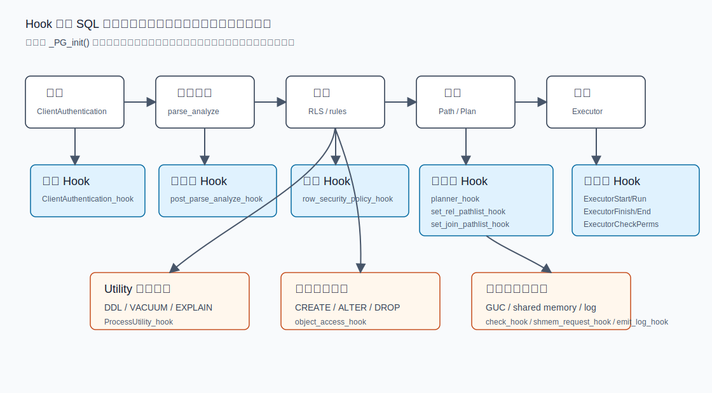
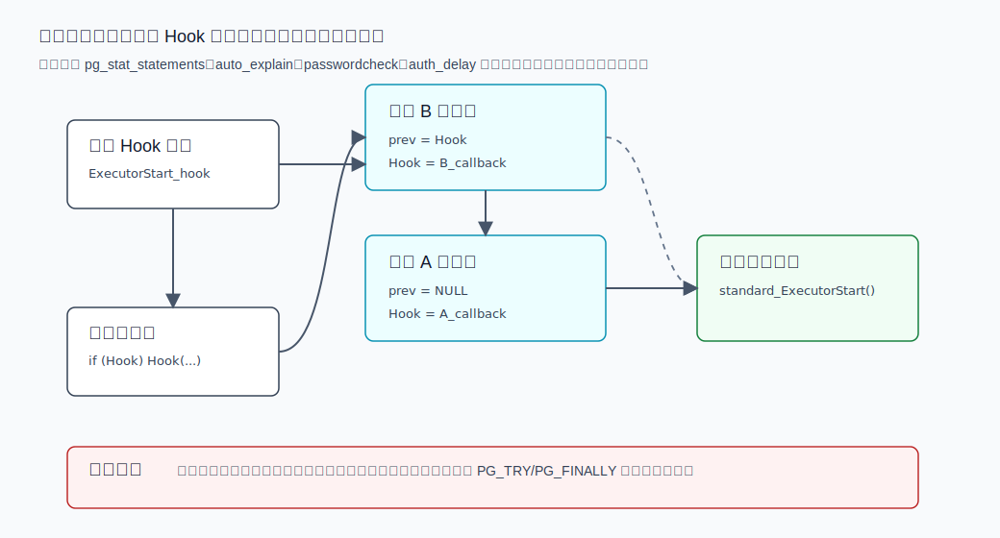
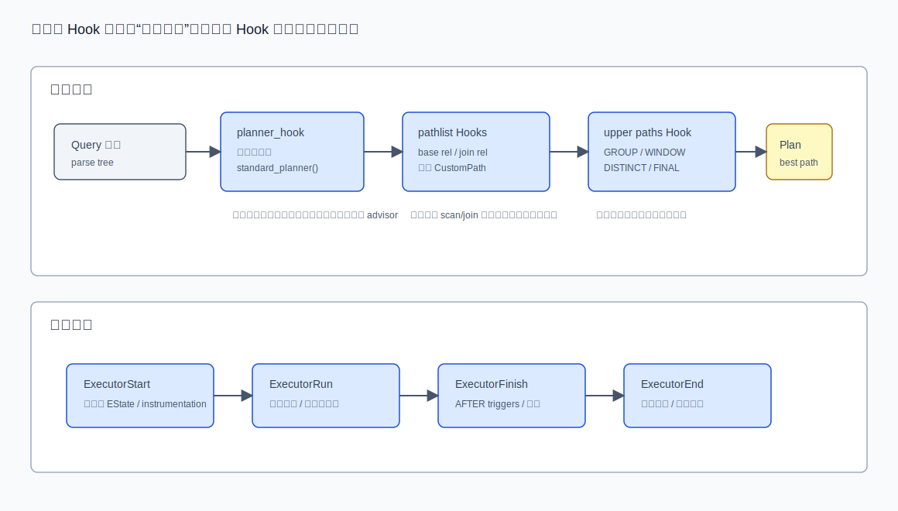
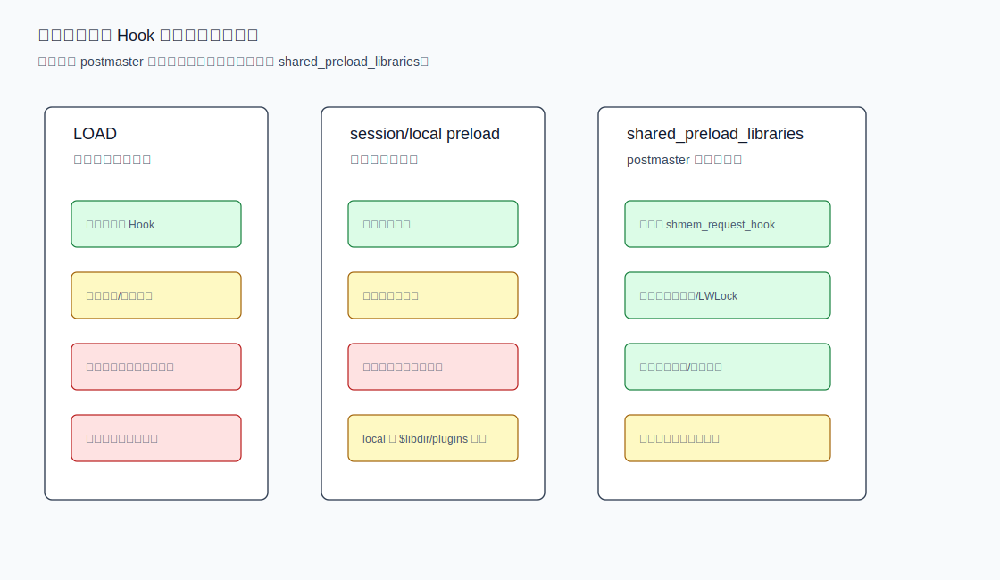
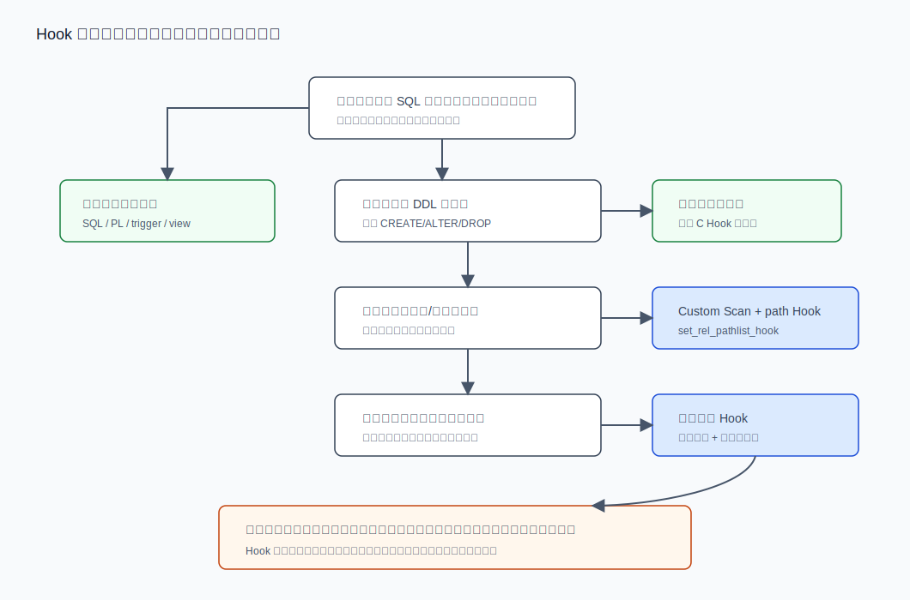

## 数据库筑基课 - Hook

### 作者
digoal

### 日期
2026-06-08

### 标签
PostgreSQL , 应用开发者 , 数据库筑基课 , Hook , 扩展机制 , 优化器 , 执行器 , 可观测性    

----

## 背景
   


这篇属于数据库筑基课里的“扩展机制 + 场景实践”主题。Hook 不是一个 SQL 功能，也不是某个单独模块；它是 PostgreSQL 给扩展留下的内核插槽：认证、解析、规划、执行、DDL、对象访问、共享内存、GUC、日志等路径，在固定位置暴露函数指针，让外部模块能观察、补充或有限改变核心行为。

本地 `markdown/` 目录没有发现独立的“数据库筑基课大纲”文件，所以本文不强行引用不存在的大纲；后续如果项目补充大纲，可以在这里补上课程目录链接。

先看一个真实工程痛点：

业务上线后慢 SQL 偶发，但常规日志只能看到语句，拿不到执行计划和 buffer/WAL 消耗；另一个团队要做统一审计，想拦截 `CREATE ROLE`、`ALTER SYSTEM`、`DROP TABLE`；还有一个优化器团队想给特定查询加自定义扫描路径。如果每个需求都去改 PostgreSQL 主干代码，升级、回归和冲突都会失控。

Hook 解决的就是这类问题：不改核心流程的大结构，在关键流程点插入一段扩展逻辑。

本文以本地 `postgres` 源码为主要依据，重点参考：

- `src/include/parser/analyze.h`、`src/backend/parser/analyze.c`
- `src/include/optimizer/planner.h`、`src/backend/optimizer/plan/planner.c`
- `src/include/optimizer/paths.h`、`src/backend/optimizer/path/allpaths.c`、`src/backend/optimizer/path/joinpath.c`
- `src/include/executor/executor.h`、`src/backend/executor/execMain.c`
- `src/include/tcop/utility.h`、`src/backend/tcop/utility.c`
- `src/include/catalog/objectaccess.h`、`src/backend/catalog/objectaccess.c`
- `src/include/utils/guc.h`、`src/backend/utils/misc/guc.c`
- `contrib/pg_stat_statements/pg_stat_statements.c`、`contrib/auto_explain/auto_explain.c`
- `contrib/passwordcheck/passwordcheck.c`、`contrib/auth_delay/auth_delay.c`
- 官方文档源码 `doc/src/sgml/custom-scan.sgml`、`doc/src/sgml/xfunc.sgml`、`doc/src/sgml/ref/load.sgml`、`doc/src/sgml/config.sgml`

用户修正后的 DeepWiki repoName 是 `postgres/postgres`。DeepWiki 可用页面包括 `Query Processing Pipeline`、`Query Planner and JOIN Optimization`、`Query Execution and Table Commands`、`Configuration Management System (GUC)`、`Extensions and Contrib Modules` 等；其返回的 Hook 摘要与本文源码梳理方向一致。本文仍以本地源码和官方文档为事实依据，DeepWiki 只作为架构导航参考。

## 一、它解决什么问题？

Hook 解决的是“扩展要进入内核生命周期，但又不应该 fork 内核”的问题。

典型场景有五类：

1. 可观测性：`pg_stat_statements` 用解析、规划、执行、Utility Hook 统计 SQL；`auto_explain` 用执行器 Hook 在慢查询结束时输出计划。
2. 安全与审计：`passwordcheck` 用 `check_password_hook` 检查口令；`auth_delay` 用 `ClientAuthentication_hook` 对认证失败注入延迟；`sepgsql` 用对象访问和权限相关 Hook 做强制访问控制。
3. 优化器扩展：自定义扫描提供者通过 `set_rel_pathlist_hook`、`set_join_pathlist_hook` 添加 `CustomPath`，让优化器把新路径纳入成本比较。
4. 资源初始化：需要共享内存、LWLock tranche 的扩展必须在 postmaster 启动期注册共享内存需求。
5. 配置协议：扩展自定义 GUC 时，通过 `check_hook`、`assign_hook`、`show_hook` 控制配置值校验、赋值副作用和展示。

代价也很直接：

- Hook 是 C 级扩展能力，错误会影响后端进程甚至实例稳定性。
- 同一个 Hook 通常只有一个全局函数指针，多个扩展要靠“保存前值、链式转发”协作。
- Hook 的调用顺序受加载顺序影响，不能假设自己永远第一个或最后一个。
- Hook 的 ABI 和语义会随 PostgreSQL 版本变化。当前源码里 `doc/src/sgml/release-19.sgml` 就记录了 `get_relation_info_hook` 被 `build_simple_rel_hook` 替换，以及新增 planner 相关 Hook。
- 一些 Hook 只能在特定加载时机发挥作用。例如申请启动期共享内存和 LWLock 需要 `shared_preload_libraries`。

所以 Hook 是强工具，不是默认工具。能用 SQL 函数、触发器、事件触发器、FDW、Custom Scan API 解决的问题，就不要先上全局 Hook。

## 二、它是什么？

从实现上看，Hook 通常是三件东西：

1. 一个函数指针类型，例如 `planner_hook_type`。
2. 一个全局变量，例如 `planner_hook`。
3. 核心流程里的一段分支：如果 Hook 非空，就调用 Hook；否则走标准实现。

以优化器入口为例，`src/include/optimizer/planner.h` 定义：

```c
typedef PlannedStmt *(*planner_hook_type) (Query *parse,
                                           const char *query_string,
                                           int cursorOptions,
                                           ParamListInfo boundParams,
                                           ExplainState *es);
extern PGDLLIMPORT planner_hook_type planner_hook;
```

`src/backend/optimizer/plan/planner.c` 的 `planner()` 里则检查：

```c
if (planner_hook)
    result = (*planner_hook) (parse, query_string, cursorOptions,
                              boundParams, es);
else
    result = standard_planner(parse, query_string, cursorOptions,
                              boundParams, es);
```

扩展在 `_PG_init()` 中安装：

```c
static planner_hook_type prev_planner_hook = NULL;

void
_PG_init(void)
{
    prev_planner_hook = planner_hook;
    planner_hook = my_planner;
}
```

回调中通常再转发：

```c
static PlannedStmt *
my_planner(Query *parse, const char *query_string, int cursorOptions,
           ParamListInfo boundParams, ExplainState *es)
{
    if (prev_planner_hook)
        return prev_planner_hook(parse, query_string, cursorOptions,
                                 boundParams, es);

    return standard_planner(parse, query_string, cursorOptions,
                            boundParams, es);
}
```

这就是 PostgreSQL Hook 的基本模型：核心负责提供插槽和标准实现，扩展负责保存旧指针、安装新指针、决定何时转发。

## 三、核心原理

### 3.1 Hook 在请求处理管线中的位置

PostgreSQL 一条 SQL 请求大致经过：认证、解析分析、重写、规划、执行、资源释放和日志输出。不同 Hook 插在不同阶段，能看到的数据结构也不同。



图 1 说明：Hook 的能力边界由调用位置决定。`post_parse_analyze_hook` 能看到 `Query`，但还没到路径生成；`set_rel_pathlist_hook` 能给 base relation 加路径；`ExecutorEnd_hook` 可以统计执行完成后的指标；`ProcessUtility_hook` 处理 DDL、VACUUM、EXPLAIN 这类 Utility 命令；`object_access_hook` 则围绕对象创建、修改、删除等事件工作。

常见 Hook 可以按层次理解：

| 层次 | Hook | 典型用途 | 主要源码 |
|---|---|---|---|
| 认证 | `ClientAuthentication_hook` | 登录审计、失败延迟、认证后策略 | `src/include/libpq/auth.h`、`contrib/auth_delay/auth_delay.c` |
| 解析分析 | `post_parse_analyze_hook` | queryId、规范化 SQL、语义审计 | `src/include/parser/analyze.h`、`src/backend/parser/analyze.c` |
| 优化器入口 | `planner_hook` | 规划计时、advisor、替换规划入口 | `src/include/optimizer/planner.h`、`planner.c` |
| 路径生成 | `set_rel_pathlist_hook`、`set_join_pathlist_hook`、`join_search_hook` | CustomPath、自定义 join 搜索 | `paths.h`、`allpaths.c`、`joinpath.c` |
| 上层路径 | `create_upper_paths_hook` | GROUP、WINDOW、DISTINCT、FINAL 阶段加路径 | `planner.c` |
| 执行器 | `ExecutorStart/Run/Finish/End_hook` | 执行统计、自动 EXPLAIN、嵌套层级追踪 | `executor.h`、`execMain.c` |
| Utility | `ProcessUtility_hook` | DDL 审计、Utility 计时、管控命令 | `tcop/utility.h`、`utility.c` |
| 对象访问 | `object_access_hook`、`object_access_hook_str` | 安全、审计、对象生命周期事件 | `catalog/objectaccess.h`、`objectaccess.c` |
| GUC | `check_hook`、`assign_hook`、`show_hook` | 配置校验、赋值副作用、展示值 | `utils/guc.h`、`utils/misc/guc.c` |
| 共享内存 | `shmem_request_hook`、`shmem_startup_hook` | 启动期申请共享内存和初始化状态 | `miscadmin.h`、`storage/ipc.h`、`ipci.c` |
| 日志 | `emit_log_hook` | 日志转发、审计采集 | `utils/elog.h`、`utils/error/elog.c` |

### 3.2 链式转发：一个插槽，多个扩展

多数 Hook 是全局变量，不是内建链表。多个扩展要共存，靠每个扩展保存前一个 Hook 指针，再在自己的回调中转发。



图 2 说明：后加载的扩展通常位于链头。它保存加载前的 Hook 指针，然后把全局 Hook 指向自己。运行时先进入后加载扩展，再由它转发到前一个扩展，最后到标准实现。如果中间某个扩展不转发，就会截断链条。

源码里这个模式非常明显：

- `contrib/pg_stat_statements/pg_stat_statements.c` 保存 `prev_post_parse_analyze_hook`、`prev_planner_hook`、`prev_ExecutorStart`、`prev_ProcessUtility` 等，然后在 `_PG_init()` 安装多个 Hook。
- `contrib/auto_explain/auto_explain.c` 保存 `prev_ExecutorStart`、`prev_ExecutorRun`、`prev_ExecutorFinish`、`prev_ExecutorEnd`，再安装自己的执行器 Hook。
- `contrib/passwordcheck/passwordcheck.c` 保存 `prev_check_password_hook`，先调用旧 Hook，再执行自己的密码规则。
- `contrib/auth_delay/auth_delay.c` 保存 `original_client_auth_hook`，认证回调中先调用已有 Hook，再对失败认证 sleep。

这带来几个工程纪律：

- 回调里不要默认自己是唯一扩展。
- 除非明确要拦截，否则应该转发到前一个 Hook 或标准实现。
- 对嵌套层级、全局状态、采样状态的修改要用 `PG_TRY/PG_FINALLY` 保证恢复。`pg_stat_statements` 和 `auto_explain` 都这样维护 `nesting_level`。
- 不要在 Hook 中做长时间阻塞或不可控 I/O，尤其是执行器、认证和日志路径。

### 3.3 优化器 Hook：影响候选路径，而不是随便改结果

优化器 Hook 最容易被误用。它不是“强行改 SQL 结果”的入口，而是把扩展能力纳入路径生成、成本比较和计划选择。



图 3 说明：规划阶段先有 `Query`，再进入 `planner_hook` 或 `standard_planner()`，随后生成 base relation、join relation、upper relation 的候选路径，最后选择 cheapest path 形成 `Plan`。执行阶段的 `ExecutorStart/Run/Finish/End` 更适合加 instrumentation、统计、日志，而不是临时改写计划语义。

几个关键源码点：

- `planner_hook` 在 `planner()` 入口包住整个规划过程。插件通常调用 `standard_planner()`。
- `planner_setup_hook` 在 `PlannerGlobal` 初始化后调用，`planner_shutdown_hook` 在 `PlannerGlobal` 丢弃前调用。
- `set_rel_pathlist_hook` 在核心代码为 base relation 生成路径后调用。`allpaths.c` 的注释说明，扩展可以用 `add_path()` 或 `add_partial_path()` 添加新路径，也可以尝试修改已有路径。
- `set_join_pathlist_hook` 在 join relation 路径生成后调用；`join_path_setup_hook` 更早，适合影响 join 路径生成的准备数据。
- `join_search_hook` 可以替换 `standard_join_search()`，这是非常强的入口，风险也更高。
- `create_upper_paths_hook` 在 GROUP、WINDOW、DISTINCT、ORDERED、FINAL 等 upper relation 阶段给扩展添加路径。

官方 `doc/src/sgml/custom-scan.sgml` 对 Custom Scan 的描述很关键：自定义扫描提供者通常在规划阶段生成 `CustomPath`；如果这个 path 被优化器选中，就转换成 plan；执行阶段必须产生与被替代路径相同的结果。这句话决定了边界：Custom Scan 可以改变“怎么扫”，不能改变“应该返回什么”。

### 3.4 执行器 Hook：适合观测，不适合重写语义

执行器 Hook 分成四个主入口：

- `ExecutorStart_hook`：执行计划初始化前后，适合打开 instrumentation。
- `ExecutorRun_hook`：实际执行计划树，可能被多次调用，适合维护嵌套层级和总执行时间。
- `ExecutorFinish_hook`：执行完成后的收尾动作，包括 AFTER triggers。
- `ExecutorEnd_hook`：释放资源前，适合读取执行统计并落库或写日志。

`auto_explain` 是典型例子：它在 `_PG_init()` 安装四个执行器 Hook；`ExecutorStart` 中根据配置决定是否采样，并设置 `queryDesc->query_instr_options` 或 `queryDesc->instrument_options`；`ExecutorEnd` 中如果耗时超过阈值，就用 `ExplainPrintPlan()` 输出实际计划。

`pg_stat_statements` 也很典型：`ExecutorStart` 打开 `INSTRUMENT_ALL`，`ExecutorEnd` 把耗时、行数、buffer、WAL、JIT、并行 worker 等信息写入共享统计。

这解释了一个常见问题：为什么慢 SQL 观测类扩展通常需要执行器 Hook，而不是只靠日志？因为日志路径只能看到文本和时间；执行器 Hook 能拿到 `QueryDesc`、`EState`、instrumentation、执行行数、buffer/WAL 使用等内部结构。

### 3.5 ProcessUtility 与 ObjectAccess：DDL 管控不能只看 SELECT 路径

不是所有语句都会走普通优化器和执行器路径。`CREATE TABLE`、`ALTER ROLE`、`DROP INDEX`、`VACUUM`、`EXPLAIN` 等 Utility 命令通过 `ProcessUtility()` 处理。

`src/backend/tcop/utility.c` 对 `ProcessUtility_hook` 的注释提醒了两个细节：

- 同一个 `queryString` 可能对应多个分号分隔语句，扩展要用 `pstmt->stmt_location` 和 `pstmt->stmt_len` 找当前语句片段。
- 一些 Utility 命令会递归调用 `ProcessUtility()` 处理子语句，例如 `CREATE SCHEMA` 内部的子命令。

对象访问 Hook 关注的不是 SQL 文本，而是对象生命周期事件。`src/include/catalog/objectaccess.h` 定义了：

- `OAT_POST_CREATE`
- `OAT_DROP`
- `OAT_POST_ALTER`
- `OAT_NAMESPACE_SEARCH`
- `OAT_FUNCTION_EXECUTE`
- `OAT_TRUNCATE`

`src/backend/catalog/objectaccess.c` 的 `RunObjectPostCreateHook()`、`RunObjectDropHook()` 等函数把事件和参数打包后调用 `object_access_hook`。这类 Hook 很适合安全和审计扩展，因为它绕开 SQL 文本差异，直接挂在对象事件上。

但是它也有边界：不同事件能拿到的上下文不同；某些内部对象创建或修改会带 `is_internal`；扩展必须决定是否跳过内部事件，否则可能误报或阻断 PostgreSQL 自己的维护动作。

### 3.6 GUC Hook：配置不是普通变量赋值

PostgreSQL 自定义配置项不是裸变量。`src/include/utils/guc.h` 定义了多种 GUC Hook：

- `GucBoolCheckHook`、`GucIntCheckHook`、`GucStringCheckHook` 等：校验新值，必要时返回错误。
- `GucBoolAssignHook`、`GucStringAssignHook` 等：确认赋值后执行副作用。
- `GucShowHook`：控制展示值。

`src/backend/utils/misc/guc.c` 的 `call_*_check_hook()` 会在调用 check hook 前重置错误消息相关变量；如果 hook 返回 false，就按 GUC 协议报错。字符串类型还用 `PG_TRY/PG_CATCH` 避免错误路径泄漏已分配的新字符串。

工程含义：

- check hook 应该验证“能不能设”，不要偷偷做不可回滚副作用。
- assign hook 才适合把已确认的配置传播到运行状态。
- show hook 应该轻量，不要做昂贵计算。
- 自定义 GUC 应该 `MarkGUCPrefixReserved()`，避免扩展名前缀被其他配置误占用。`pg_stat_statements`、`auto_explain`、`passwordcheck`、`auth_delay` 都采用这个做法。

### 3.7 加载时机：LOAD 能做的事和 shared_preload 不一样

Hook 注册发生在动态库加载时，通常写在 `_PG_init()`。但“什么时候加载”决定了扩展能覆盖的范围。



图 4 说明：`LOAD` 适合当前会话调试或局部启用；`session_preload_libraries`、`local_preload_libraries` 适合会话启动时加载；需要共享内存、LWLock、全局统计的扩展，通常必须放进 `shared_preload_libraries`，并在 postmaster 启动期声明资源需求。

官方 `doc/src/sgml/ref/load.sgml` 明确说：显式 `LOAD` 通常只在库要通过 hooks 修改服务器行为、而不只是提供函数时需要。

`doc/src/sgml/xfunc.sgml` 对共享内存和 LWLock 的说明更直接：

- 扩展如果要在启动期预留共享内存，需要通过 `shared_preload_libraries` 加载。
- 申请 LWLock tranche 时，扩展应在 `_PG_init()` 中注册 `shmem_request_hook`，并在其中调用 `RequestNamedLWLockTranche()`。
- `src/backend/storage/ipc/ipci.c` 的 `RequestAddinShmemSpace()` 要求只能在 `shmem_request_hook` 期间调用，否则会 `FATAL`。

这解释了为什么 `pg_stat_statements` 在 `_PG_init()` 里先检查 `process_shared_preload_libraries_in_progress`：它需要共享内存区域；如果不是通过 `shared_preload_libraries` 加载，就不安装主系统 Hook。

## 四、横向对比

| 维度 | Hook | SQL 函数/过程 | 普通触发器 | 事件触发器 | FDW | Custom Scan |
|---|---|---|---|---|---|---|
| 主要目标 | 进入内核生命周期 | 提供计算或操作接口 | 响应表级 DML | 响应 DDL 事件 | 访问外部数据源 | 添加新的扫描/执行路径 |
| 实现语言 | C 为主 | SQL/PL/C | SQL/PL/C | SQL/PL/C | C 为主 | C |
| 影响范围 | 可能是全局或会话级 | 调用点局部 | 目标表局部 | DDL 层面 | 外表访问 | 优化器选择路径 |
| 加载要求 | 可能需要 preload | 安装扩展即可 | 表绑定 | 数据库级事件 | 安装 server/user mapping | 通常配合 path Hook |
| 典型风险 | 截断 Hook 链、崩溃、版本 ABI 变化 | 权限和执行成本 | 写放大、递归触发 | DDL 递归和覆盖不足 | 远端一致性、下推边界 | 成本估计错误、结果语义必须一致 |
| 适合场景 | 观测、审计、优化器接入、共享状态 | 业务函数、工具函数 | 行级/语句级数据约束 | DDL 审计 | 外部系统读写 | 硬件加速、缓存、特殊访问路径 |
| 不适合场景 | 普通业务逻辑、局部校验 | 全局内核观测 | 跨数据库全局策略 | DML 观测 | 改造本地表执行计划 | 只想拦截 SQL 文本 |

解释：Hook 的优势是靠近内核，劣势也是靠近内核。它能拿到普通 SQL 对象拿不到的上下文，但同时承担版本、并发、错误路径和全局副作用。设计扩展时，应该先问“能不能用更窄的机制完成”，再决定是否使用 Hook。

## 五、效果如何？

Hook 的收益不是“性能必然更好”，而是可插拔地改变能力边界：

- `pg_stat_statements` 通过解析、规划、执行和 Utility Hook，把每条语句的统计聚合到共享状态中。收益是全局 SQL 画像；代价是共享内存、锁、规范化文本存储和执行路径上的额外统计开销。
- `auto_explain` 通过执行器 Hook，在慢查询完成后输出计划。收益是事故现场有执行计划；代价是 instrumentation 采集成本，尤其是开启 `log_analyze`、buffer、I/O、WAL、timing 时。
- `passwordcheck` 通过密码 Hook 在角色口令变更时校验规则。收益是统一安全策略；代价是只能在 PostgreSQL 能看到明文或可推断密码时做检查，加密密码的检查能力有限。
- `auth_delay` 通过认证 Hook 对失败认证 sleep。收益是降低暴力尝试速度；代价是失败连接会占用后端时间，参数要谨慎。
- Custom Scan 相关 Hook 可以让新扫描路径进入优化器成本模型。收益是无需改核心即可试验硬件加速或特殊扫描；代价是成本估计错了会让优化器选错计划，执行语义必须与被替代路径一致。

不要把 Hook 当作“免费观测”。越热的路径，越要关注：

- 每次调用是否分配内存。
- 是否访问共享状态或加锁。
- 是否写日志。
- 是否在嵌套 SQL、SPI、触发器、并行 worker 中重复计数。
- 是否处理错误路径恢复。

## 六、实操 DEMO

下面是一个最小执行器 Hook 模板，用于理解链式转发。这个示例没有在本地编译执行，仅作为结构演示；真实扩展还需要 `.control`、SQL 安装文件、Makefile 或 Meson 配置，并按目标 PostgreSQL 版本调整头文件。

```c
#include "postgres.h"
#include "fmgr.h"
#include "executor/executor.h"

PG_MODULE_MAGIC;

static ExecutorStart_hook_type prev_ExecutorStart = NULL;

static void
demo_ExecutorStart(QueryDesc *queryDesc, int eflags)
{
    /*
     * 在这里做极轻量的观测或设置 instrumentation。
     * 不要阻塞，不要长期持有锁，不要假设 queryDesc 所有字段都非空。
     */

    if (prev_ExecutorStart)
        prev_ExecutorStart(queryDesc, eflags);
    else
        standard_ExecutorStart(queryDesc, eflags);
}

void
_PG_init(void)
{
    prev_ExecutorStart = ExecutorStart_hook;
    ExecutorStart_hook = demo_ExecutorStart;
}
```

如果用会话内 `LOAD` 调试，思路是：

```sql
LOAD 'demo_executor_hook';
SELECT count(*) FROM pg_class;
```

如果扩展需要共享内存，不能只靠 `LOAD`：

```conf
shared_preload_libraries = 'demo_executor_hook'
```

然后重启实例。原因是 `RequestAddinShmemSpace()` 这类启动期共享内存申请只能发生在 `shmem_request_hook` 期间。

最小验证清单：

```sql
-- 1. 确认扩展库是否加载
SELECT name, setting
FROM pg_settings
WHERE name IN ('shared_preload_libraries', 'session_preload_libraries', 'local_preload_libraries');

-- 2. 如果扩展定义了 GUC，确认前缀和上下文
SELECT name, context, setting
FROM pg_settings
WHERE name LIKE 'demo_executor_hook.%';

-- 3. 触发目标路径
EXPLAIN (ANALYZE, BUFFERS)
SELECT count(*) FROM pg_class;
```

以上 SQL 未在本次环境执行，因为本文目标是写课程文章，不改动和编译 PostgreSQL 扩展。实际生产验证必须在测试实例中完成，并观察 PostgreSQL 日志、崩溃恢复、并发连接和扩展卸载/重载行为。

## 七、最佳实践

### 面向数据库架构师

1. 先把需求归类。观测执行统计用执行器 Hook；DDL 审计优先看事件触发器和 `ProcessUtility_hook`；对象生命周期审计看 `object_access_hook`；新扫描方式看 Custom Scan 和 path Hook。
2. 把加载时机写进架构设计。需要共享内存、LWLock、后台全局状态的扩展，必须明确 `shared_preload_libraries`、重启窗口和容量参数。
3. 不要把业务策略深埋在全局 Hook 中。业务规则优先用约束、触发器、RLS、函数或应用协议表达；Hook 只处理必须进入内核生命周期的部分。
4. 版本升级前做 Hook ABI 审计。检查目标版本的 `src/include/*` Hook 签名和 release notes，尤其是优化器 Hook。

### 面向 DBA

1. 审查 `shared_preload_libraries`。这里的每个库都进入核心生命周期，升级、重启和故障排查都要记录。
2. 对观测类 Hook 分级开启。`auto_explain.log_analyze`、timing、buffer、I/O、WAL 统计会带来额外成本，事故期间可以提高采样或开启更多维度，常态要控制。
3. 关注扩展链冲突。如果两个扩展都挂同一 Hook，加载顺序会影响调用顺序；异常现象包括重复计数、统计缺失、DDL 被误拦截。
4. 排查问题时先二分扩展。测试环境中调整 preload 列表，观察问题是否随某个 Hook 扩展消失。

### 面向业务开发者

1. 不要把 Hook 当作应用逻辑入口。它不是“数据库里的中间件”，而是 DBA/内核扩展开发者的工具。
2. 如果依赖 `pg_stat_statements` 或 `auto_explain` 的数据，要理解采样、规范化、queryId、Utility 语句和嵌套语句的边界。
3. 对 Serializable 重试、慢 SQL 诊断、审计告警等上层逻辑，不要假设 Hook 扩展永远启用；应用仍应有基本的超时、重试和日志。

## 八、适合与不适合场景

适合：

- 需要在 SQL 执行生命周期内采集内部指标，例如规划耗时、执行耗时、buffer/WAL/JIT 用量。
- 需要对 Utility 命令做统一审计或管控。
- 需要在对象创建、修改、删除、命名空间搜索、函数执行等对象事件上做安全检查。
- 需要为优化器添加新扫描路径或 join 路径。
- 需要在 postmaster 启动期申请共享内存、LWLock 或初始化全局状态。
- 需要定义扩展自己的 GUC，并对配置做强校验和赋值副作用处理。

不适合：

- 普通业务校验。优先用约束、触发器、函数、RLS 或应用事务。
- 只想记录某张表变更。优先用触发器、逻辑复制或审计扩展。
- 只想响应 DDL。优先看事件触发器，除非事件触发器拿不到所需上下文。
- 想强行改写 SQL 结果语义。优化器和执行器 Hook 不应该让同一 SQL 在同一权限和数据状态下返回不符合语义的结果。
- 对版本稳定性要求高但没有内核升级测试能力的场景。

## 九、常见坑

1. 不转发前一个 Hook。结果是后加载扩展把先加载扩展“吃掉”，表现为统计消失或策略失效。
2. 在 Hook 中递归触发 SQL 却没有处理嵌套层级。`pg_stat_statements`、`auto_explain` 都显式维护 `nesting_level`，这是为了区分顶层语句和嵌套语句。
3. 在错误路径忘记恢复状态。Hook 中修改全局或静态状态，要考虑 `ereport(ERROR)` 跳转。
4. 在热路径做昂贵工作。执行器 Hook 每条查询都会碰到，认证 Hook 每个连接都会碰到，日志 Hook 可能在错误风暴中被频繁调用。
5. 把 `LOAD` 当作全局启用。`LOAD` 只影响当前会话；需要全局覆盖或共享内存时，要用正确 preload 机制。
6. 忽略并行 worker。`auto_explain` 在 parallel worker 中选择不做采样决策，避免干扰父会话收集。
7. 忽略 Utility 递归。`ProcessUtility_hook` 处理 `CREATE SCHEMA`、`ALTER TABLE` 子命令时会遇到递归调用。
8. GUC check hook 做副作用。check 阶段可能失败或被测试，副作用应放在 assign 阶段。
9. 忽略对象内部事件。对象访问 Hook 的 `is_internal` 标志很重要，TOAST、索引、内部约束变化可能不是用户直接操作。
10. 忽略版本变化。优化器 Hook 尤其容易因版本演进变化，扩展要把版本适配写进测试。

## 十、扩展问题

1. 如果你要做“禁止非白名单用户执行 `ALTER SYSTEM`”，应该用 `ProcessUtility_hook`、事件触发器，还是权限体系？各自拿得到什么上下文？
2. 如果你要统计每条 SQL 的执行时间、行数、buffer、WAL，为什么 `ExecutorEnd_hook` 比日志 hook 更合适？
3. 如果你要给向量索引或 GPU 扫描增加路径，应该修改 `planner_hook`，还是通过 `set_rel_pathlist_hook` 添加 `CustomPath`？
4. 如果两个扩展都使用 `ExecutorStart_hook`，加载顺序怎样影响调用顺序？怎样测试链式转发没有被截断？
5. 如果一个扩展需要共享内存 Hash 表，为什么会要求 `shared_preload_libraries`？能否用 DSM 降低重启依赖？

## 十一、扩展阅读

- PostgreSQL 源码：`src/include/parser/analyze.h`、`src/backend/parser/analyze.c`
- PostgreSQL 源码：`src/include/optimizer/planner.h`、`src/backend/optimizer/plan/planner.c`
- PostgreSQL 源码：`src/include/optimizer/paths.h`、`src/backend/optimizer/path/allpaths.c`、`src/backend/optimizer/path/joinpath.c`
- PostgreSQL 源码：`src/include/executor/executor.h`、`src/backend/executor/execMain.c`
- PostgreSQL 源码：`src/include/tcop/utility.h`、`src/backend/tcop/utility.c`
- PostgreSQL 源码：`src/include/catalog/objectaccess.h`、`src/backend/catalog/objectaccess.c`
- PostgreSQL 源码：`src/include/utils/guc.h`、`src/backend/utils/misc/guc.c`
- PostgreSQL contrib：`contrib/pg_stat_statements/pg_stat_statements.c`
- PostgreSQL contrib：`contrib/auto_explain/auto_explain.c`
- PostgreSQL contrib：`contrib/passwordcheck/passwordcheck.c`
- PostgreSQL contrib：`contrib/auth_delay/auth_delay.c`
- 官方文档源码：`doc/src/sgml/custom-scan.sgml`，Custom Scan Provider
- 官方文档源码：`doc/src/sgml/xfunc.sgml`，C 扩展、共享内存、LWLock
- 官方文档源码：`doc/src/sgml/ref/load.sgml`，`LOAD`
- 官方文档源码：`doc/src/sgml/config.sgml`，`shared_preload_libraries`、`session_preload_libraries`、`local_preload_libraries`
- DeepWiki：`postgres/postgres`，重点参考目录 `2.2 Query Processing Pipeline`、`2.2.2 Query Planner and JOIN Optimization`、`2.2.3 Query Execution and Table Commands`、`4.1 Configuration Management System (GUC)`、`4.4 Extensions and Contrib Modules`。

## 附：选择 Hook 的决策流程



图 5 说明：Hook 应该是最后一公里扩展手段。越能用窄机制解决，越不应该使用全局 Hook。必须使用 Hook 时，要把加载时机、链式转发、并发状态、错误路径、版本差异和回归测试一起设计。
  
## 附录 
1、克隆代码  
```  
git clone --depth 1 https://github.com/postgres/postgres
```  
  
2、启用 codex, 使用 [数据库筑基课 skill](../skills/README.md).  
```
文章标题: 
  数据库筑基课 - Hook
项目源码(本地目录): 
  postgres
项目 codebase 文件名: 
  postgres/CLAUDE.md 
开源项目相关的 deepwiki repoName: 
  postgres/postgres
```
    
#### [PostgreSQL 解决方案集合](../201706/20170601_02.md "40cff096e9ed7122c512b35d8561d9c8")
  
  
#### [德哥 / digoal's Github - 公益是一辈子的事.](https://github.com/digoal/blog/blob/master/README.md "22709685feb7cab07d30f30387f0a9ae")
  
  
#### [About 德哥](https://github.com/digoal/blog/blob/master/me/readme.md "a37735981e7704886ffd590565582dd0")
  
  

  
