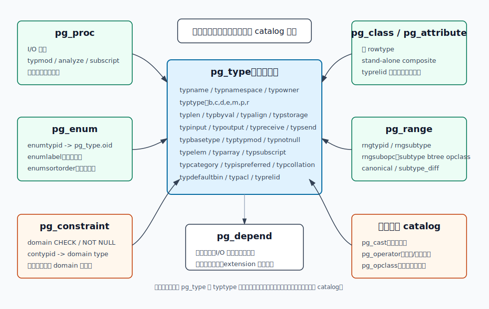
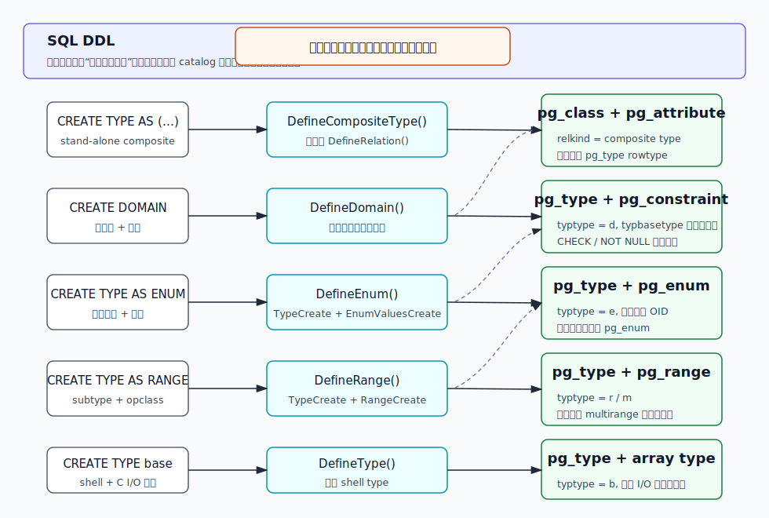
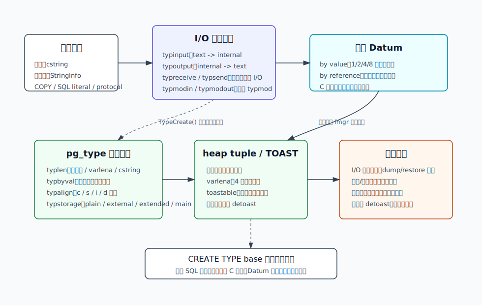
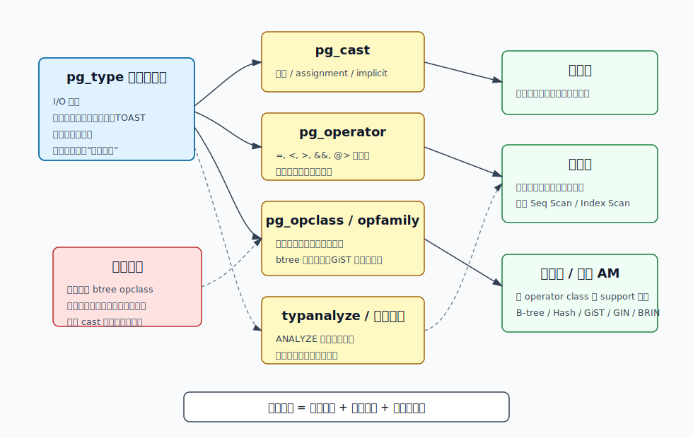
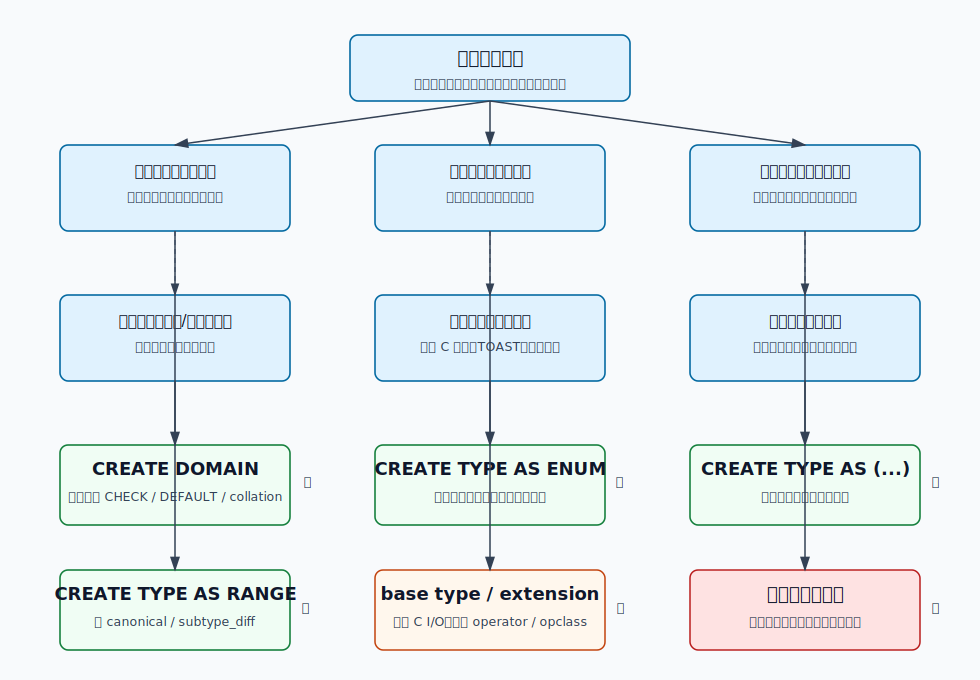
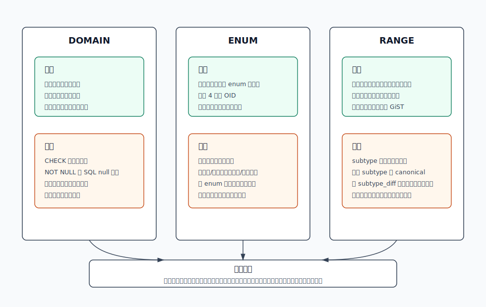

## 数据库筑基课 - 自定义类型

### 作者
digoal

### 日期
2026-06-08

### 标签
PostgreSQL , 应用开发者 , 数据库筑基课 , 数据类型 , 自定义类型 , pg_type , enum , domain , range    

----

## 背景
   


这篇属于数据库筑基课里的“数据类型与操作符”主题。很多系统一开始把业务语义全塞进 `text`、`integer`、`jsonb`：订单状态是字符串，邮箱是字符串，价格区间是两个字段，函数返回值靠多列临时拼装。短期很快，长期会遇到几类问题：

- 同一个约束散落在几十张表里，某个表漏了检查。
- 状态值可以随便写，`open`、`opened`、`OPEN` 同时存在。
- 时间、价格、版本范围的“相交、包含、是否为空”被应用代码反复重写。
- 函数返回结构没有名字，调用方靠字段位置猜语义。
- 真正需要新内部表示时，只注册了类型名，却没有补齐输入输出、比较、统计、索引契约。

PostgreSQL 的自定义类型不是“给字段起一个别名”这么简单。它是一组 catalog 级契约：类型名、存储布局、I/O 函数、约束、排序语义、转换语义、索引语义和依赖关系。设计得好，类型会把业务事实前移到数据库边界；设计得坏，类型会让迁移、索引、dump/restore、扩展升级都变难。

本地 `markdown/` 目录没有发现独立的“数据库筑基课大纲”文件，所以本文不强行引用不存在的大纲；后续如果项目补充大纲，可以在这里补上课程目录链接。

本文以用户提供的本地 PostgreSQL 源码目录 `postgres` 为主线，主要依据：

- 官方文档：`doc/src/sgml/ref/create_type.sgml`、`doc/src/sgml/ref/create_domain.sgml`、`doc/src/sgml/xtypes.sgml`、`doc/src/sgml/datatype.sgml`、`doc/src/sgml/rangetypes.sgml`、`doc/src/sgml/xindex.sgml`、`doc/src/sgml/ref/create_opclass.sgml`。
- 源码：`src/backend/commands/typecmds.c`、`src/backend/catalog/pg_type.c`、`src/backend/catalog/pg_enum.c`、`src/include/catalog/pg_type.h`、`src/include/catalog/pg_enum.h`、`src/include/catalog/pg_range.h`。
- 回归测试：`src/test/regress/sql/create_type.sql`、`src/test/regress/sql/domain.sql`、`src/test/regress/sql/enum.sql`。
- DeepWiki：用户给的 repoName 为 `postgres/postgres`。本次用它做架构背景核对；关键结论仍以本地源码和官方文档为准。

## 一、它解决什么问题？

自定义类型解决的是“数据语义在哪里被定义、检查、复用和优化”的问题。

以订单状态、邮箱、价格区间和函数返回值为例，传统做法常见是：

```sql
CREATE TABLE orders (
    id bigint PRIMARY KEY,
    customer_email text,
    status text,
    min_price numeric,
    max_price numeric
);
```

这张表能存数据，但数据库并不知道：

- `customer_email` 应该满足什么格式。
- `status` 的合法集合是什么，状态之间有没有稳定排序。
- `min_price` 和 `max_price` 是一组边界，还是两个互不相关的数。
- 其他表复用这些规则时，规则是否完全一致。

自定义类型把问题转化成几种更明确的建模选择：

- 用 `DOMAIN` 表达“同一底层类型上的稳定约束”。
- 用 `ENUM` 表达“小而稳定、需要类型安全的有序取值集合”。
- 用 `COMPOSITE TYPE` 表达“多个字段作为一个逻辑值传递”。
- 用 `RANGE` 表达“有序 subtype 上的区间语义”。
- 用 base type 表达“SQL 已有类型无法承载的新内部表示”。

代价也必须提前说清楚：

- 类型越靠近底层，迁移成本越高。
- 类型越参与解析器、优化器和索引，语义契约越多。
- base type 需要 C 函数和超级用户权限，错误定义可能让服务端崩溃。
- `ENUM` 很适合稳定状态，不适合高频变化的运营字典。
- `DOMAIN` 适合值级约束，不适合跨行、跨表、随时间变化的业务规则。

## 二、它是什么？

在 PostgreSQL 里，自定义类型首先是一行 `pg_type`。

`src/include/catalog/pg_type.h` 定义了类型的核心元数据。当前源码中 `typtype` 包含：

| `typtype` | 含义 | 常见来源 |
|---|---|---|
| `b` | base type，普通标量类型 | 内置类型、自定义 base type、自动数组类型 |
| `c` | composite type，复合类型 | 表 rowtype、`CREATE TYPE AS (...)` |
| `d` | domain | `CREATE DOMAIN` |
| `e` | enum | `CREATE TYPE AS ENUM` |
| `m` | multirange | range 类型自动关联或显式命名 |
| `p` | pseudo-type | `record`、`anyelement` 等伪类型 |
| `r` | range | `CREATE TYPE AS RANGE` |

`CREATE TYPE` 官方文档把用户显式创建类型分成五种形式：

- composite type。
- enum type。
- range type。
- base type。
- shell type，也就是 forward reference 占位符。

`CREATE DOMAIN` 虽然不是 `CREATE TYPE` 语法分支，但在 catalog 上也是 `pg_type.typtype = 'd'` 的类型。



图 1 说明：不要只看 `pg_type.typname`。一个类型能不能输入、输出、比较、排序、索引、dump/restore、随扩展升级，取决于它和 `pg_proc`、`pg_enum`、`pg_range`、`pg_constraint`、`pg_class`、`pg_depend`、`pg_cast`、`pg_operator`、`pg_opclass` 等 catalog 的组合关系。

## 三、核心原理

### 3.1 CREATE TYPE 不是一条路

`src/backend/commands/typecmds.c` 的文件注释说得很清楚：`DefineFoo` 例程从 parse tree 提取参数和检查权限，然后调用 catalog 层例程做实际 catalog 修改。base type 的创建顺序也写在注释里：

1. 先创建 input/output、recv/send 函数。
2. 再创建 type。
3. 再创建 operator。

不同 SQL 形式进入不同路径：

- `DefineCompositeType()` 把复合类型包装成一个 `RELKIND_COMPOSITE_TYPE` 的 relation，由 `DefineRelation()` 创建 `pg_class`、`pg_attribute` 和对应 row type。
- `DefineDomain()` 查询基类型，继承长度、传值、对齐、TOAST、I/O、分析函数等属性，再创建 `pg_type` 行，并把 domain 约束写入 `pg_constraint`。
- `DefineEnum()` 先用 `TypeCreate()` 创建 `pg_type` 行，再调用 `EnumValuesCreate()` 写入 `pg_enum`。
- `DefineRange()` 创建 range、multirange、二者的数组类型，并把 subtype、opclass、canonical、subtype_diff 等写入 `pg_range`。
- `DefineType()` 创建 base type。它要求先有 shell type，因为 I/O 函数要引用尚未完整定义的返回类型或参数类型。



图 2 说明：用户看到的都是“创建类型”，但内核路径完全不同。特别要注意，PostgreSQL 会为多数用户类型自动创建对应数组类型，`pg_type.typarray` 和数组类型的 `typelem` 互相建立关系。

### 3.2 pg_type 是类型的“总账”

`src/backend/catalog/pg_type.c` 中的 `TypeCreate()` 是创建类型的关键函数。它会写入或替换 `pg_type` 行，主要字段包括：

- 标识：`typname`、`typnamespace`、`typowner`。
- 类型种类：`typtype`、`typcategory`、`typispreferred`。
- 存储表示：`typlen`、`typbyval`、`typalign`、`typstorage`。
- I/O：`typinput`、`typoutput`、`typreceive`、`typsend`。
- typmod 与统计：`typmodin`、`typmodout`、`typanalyze`。
- 容器关系：`typelem`、`typarray`、`typsubscript`。
- domain 关系：`typbasetype`、`typtypmod`、`typnotnull`。
- 复合类型关系：`typrelid`。
- 默认值和权限：`typdefaultbin`、`typdefault`、`typacl`。

`TypeCreate()` 还会校验若干容易导致灾难的组合：

- `typlen` 只能是正数、`-1` varlena 或 `-2` cstring。
- 传值类型必须是固定长度，并且长度和对齐必须匹配 `Datum` 支持的取值。
- 非 `PLAIN` TOAST 存储只允许 varlena 类型。
- shell type 被完整定义时，不能随便换 owner，也不能强行指定新 OID。

最后，`GenerateTypeDependencies()` 会记录类型对 schema、owner、I/O 函数、基类型、collation、默认表达式、复合类型 relation、数组元素类型、extension membership 等对象的依赖。这解释了为什么删除某个 I/O 函数、基类型或复合类型字段时，数据库会拒绝或要求 `CASCADE`。

### 3.3 shell type 是前向引用，不是可用类型

base type 和某些 range type 的难点是循环依赖：I/O 函数签名里需要新类型，新类型又需要 I/O 函数 OID。

PostgreSQL 用 shell type 打断这个环：

```sql
CREATE TYPE complex;

CREATE FUNCTION complex_in(cstring)
RETURNS complex
AS 'MODULE_PATHNAME'
LANGUAGE C IMMUTABLE STRICT;

CREATE FUNCTION complex_out(complex)
RETURNS cstring
AS 'MODULE_PATHNAME'
LANGUAGE C IMMUTABLE STRICT;

CREATE TYPE complex (
    internallength = 16,
    input = complex_in,
    output = complex_out,
    alignment = double
);
```

`TypeShellMake()` 会在 `pg_type` 中插入一行 `typisdefined = false` 的占位类型，`typtype` 使用 pseudo-type，I/O 函数使用 `shell_in` / `shell_out`。完整 `CREATE TYPE` 执行时，`TypeCreate()` 会替换这行 shell tuple，把 `typisdefined` 改成 true。

所以 shell type 不是半成品可用类型。它只是允许函数签名先引用这个名字。

### 3.4 base type 的本质是 I/O、Datum 与磁盘布局契约

官方 `xtypes.sgml` 明确说，自定义 base type 是低于 SQL 语言层次的数据类型，通常需要 C 实现的函数。至少要有 input 和 output 函数：

- input：把外部文本表示转成内部内存表示。
- output：把内部表示转成文本表示。
- receive/send：可选二进制协议表示。
- typmodin/typmodout：可选类型修饰符，例如类似 `numeric(30,2)`。
- analyze：可选类型专用统计收集。
- subscript：可选下标语义。

这不是普通 SQL 函数开发。base type 的 C 代码必须和 `pg_type` 中声明的 `typlen`、`typbyval`、`typalign`、`typstorage` 完全一致。对于 varlena 类型，内部表示必须以长度头开始；如果允许 TOAST，函数读取参数时要能处理压缩、外置、packed 或 expanded 表示。



图 3 说明：base type 不是“注册一个名字”。它把 SQL 字面量、wire protocol、C 内存结构、heap tuple、TOAST 和函数管理器连在一起。I/O 函数如果不是互逆关系，`pg_dump` 导出再导入就可能失败；长度、对齐或 TOAST 处理错误，风险不是查询报错，而是服务端崩溃或数据解释错误。

### 3.5 DOMAIN：复用约束，但不改变底层表示

`CREATE DOMAIN` 用于在已有类型上叠加约束。源码 `DefineDomain()` 会从基类型继承：

- 存储长度、传值方式、对齐、TOAST 策略。
- 输出、send、analyze 函数。
- 类型分类、数组分隔符、collation。

同时，domain 自己使用 `domain_in` / `domain_recv` 作为输入入口，`typbasetype` 指向基类型，`typtypmod` 记录基类型 typmod，约束写入 `pg_constraint`。

domain 的关键边界来自官方 `CREATE DOMAIN` notes：

- domain 约束是在值转换成 domain 类型时检查，不是在每次读取时重复检查。
- `CHECK` 表达式被 PostgreSQL 假定为不可变。如果约束引用用户函数，而函数行为后来变了，历史数据不会自动重检，dump/restore 可能暴露问题。
- domain 上的 `NOT NULL` 有 SQL null 边界。外连接、空 scalar subquery 等场景可能产生 nominal domain type 的 null。最佳实践是让 domain 允许 null，在列上加 `NOT NULL`。

所以 domain 适合表达稳定、局部、值级规则，不适合表达跨行、跨表、随时间变化的规则。

### 3.6 ENUM：静态有序集合，内部值是 OID

官方 `datatype.sgml` 定义 enum 为静态、有序的值集合。排序顺序就是 `CREATE TYPE ... AS ENUM (...)` 中列出的顺序。每个 enum 类型彼此独立，不能和另一个 enum 类型直接比较。

实现上：

- `DefineEnum()` 创建 `pg_type` 行，`typtype = 'e'`，内部长度是 `sizeof(Oid)`，传值，普通 int 对齐，`typinput = enum_in`，`typoutput = enum_out`。
- `EnumValuesCreate()` 把每个标签写入 `pg_enum`，包括 `enumtypid`、`enumlabel`、`enumsortorder`。
- 文档说明 enum 值磁盘占用 4 字节，标签长度受 `NAMEDATALEN` 限制，标准构建下最多 63 字节。
- `pg_enum` 还有一个优化细节：同一 enum type 内，偶数 OID 的大小顺序保证和 enum sort order 一致，使比较函数在许多情况下可以避免 catalog lookup。

enum 的操作边界也很明确：可以新增值、重命名值，但不能直接删除已有值，也不能改变已有值排序，除非 drop/recreate 类型。这就是为什么高频变化的业务字典不适合 enum。

### 3.7 RANGE：把“两个边界”变成一个可索引语义值

range type 表达的是某个有序 subtype 上的区间。官方 `rangetypes.sgml` 强调 subtype 必须有 total order，这样才能判断某个元素是否在区间内、区间是否相交、哪个边界在前。

`CREATE TYPE ... AS RANGE` 至少需要：

- `SUBTYPE`：区间元素类型。
- subtype 的 B-tree operator class：默认使用 subtype 的默认 btree opclass，也可以显式指定。
- 可选 `CANONICAL`：离散 subtype 建议提供，把等价范围归一化。
- 可选 `SUBTYPE_DIFF`：返回两个 subtype 值的 `float8` 差值，GiST/SP-GiST 索引会更高效。
- 可选 `MULTIRANGE_TYPE_NAME`：否则自动推导 multirange 名称。

源码 `DefineRange()` 会创建 range type、multirange type、range array type、multirange array type，并调用 `RangeCreate()` 写入 `pg_range`。

range 最适合那些业务本来就是区间的场景：会议室预订、价格带、时间有效期、版本兼容区间、地理或度量的标量区间。不要把两个字段硬凑成 range，也不要把没有稳定排序语义的业务对象伪装成 range。

### 3.8 从“能存”到“能优化”：还差 operator、cast、opclass、统计信息

只有 `pg_type`，数据库最多知道一个值怎么进出、怎么存储。要让 SQL 写得自然、让索引能用、让优化器估算靠谱，还需要额外语义：

- `CREATE CAST` / `pg_cast`：控制显式、assignment、implicit 转换。隐式转换必须非常克制，否则会让函数重载和操作符解析变得不可预测。
- `CREATE OPERATOR` / `pg_operator`：定义 `=`、`<`、`&&`、`@>` 等运算语义。
- `CREATE OPERATOR CLASS` / `pg_opclass`：定义某个 index method 如何使用这个类型。官方文档明确说 operator class 定义一个类型如何用于索引，并把策略号、操作符和支持函数绑定起来。
- `typanalyze` 或默认统计：影响 `ANALYZE` 如何收集分布，进而影响选择率和成本估算。



图 4 说明：类型设计不是到 `CREATE TYPE` 就结束。很多生产问题发生在第二阶段：值能存，但没有默认 btree opclass，导致排序、唯一性、分区键、某些索引或约束失败；或者有操作符但选择率不准，优化器无法正确估算。

## 四、横向对比

| 维度 | DOMAIN | ENUM | COMPOSITE | RANGE | base type | 普通表 + 外键 |
|---|---|---|---|---|---|---|
| 主要目标 | 复用值级约束 | 稳定有序集合 | 命名一组字段 | 区间语义 | 新内部表示 | 可维护字典和关系 |
| 是否改变存储表示 | 不改变，继承基类型 | 4 字节 OID | row/composite 表示 | varlena range | 自己定义 | 不改变字段类型 |
| 创建门槛 | 普通 DDL | 普通 DDL | 普通 DDL | subtype 要有排序 | 超级用户 + C 函数 | 普通 DDL |
| 约束表达 | `CHECK`、`NOT NULL`、默认值 | 标签集合 | 字段类型和字段名 | bounds、canonical、subtype opclass | 自己写函数 | 外键、唯一、CHECK |
| 索引关系 | 通常复用基类型能力 | 内置 enum 比较能力 | 依赖字段/表达式 | GiST/SP-GiST 等 range opclass | 需要 operator/opclass | 常规索引 |
| 迁移弹性 | 中等，改约束要重检 | 较低，删除/重排困难 | 中等，改属性影响依赖 | 中等，语义较强 | 低，扩展升级复杂 | 高 |
| 适合场景 | 邮箱、正数、业务编码格式 | 订单状态、任务状态 | 函数参数/返回值 | 时间段、价格区间 | 向量、几何、压缩结构 | 运营字典、频繁变化配置 |
| 不适合场景 | 跨行规则、动态规则 | 高频变化枚举 | 替代表设计 | 无稳定排序对象 | 只是想起别名 | 极稳定且需要类型安全的状态 |

表里的关键不是“谁更高级”，而是语义稳定性和迁移成本。越稳定、越接近值本身的事实，越适合类型化；越动态、越依赖运营配置或跨行关系，越应该留在普通表模型里。



图 5 说明：选择自定义类型时，先问问题性质，而不是先问 PostgreSQL 支持什么语法。邮箱格式这种值级约束优先 domain；稳定状态集合优先 enum；区间运算优先 range；只有当 SQL 层类型无法表达内部结构时才进入 base type。

## 五、效果如何？

自定义类型的收益主要体现在四个方面：

1. **正确性前移**：把应用代码里的散落校验变成数据库边界的一致检查。
2. **语义可读**：`status bug_status` 比 `status text` 更能表达业务含义。
3. **查询表达力**：range 的 `&&`、`@>`、`<@` 比手写边界条件更少出错。
4. **优化器可理解**：operator class、统计信息和选择率函数让索引方法能参与规划。

代价同样实际：

- catalog 依赖增加，DDL 改动可能触发更多对象重建或 `CASCADE` 风险。
- 类型一旦被表、函数、索引、视图、扩展引用，迁移需要更严谨的顺序。
- enum 删除/重排困难，不适合当运营后台字典。
- base type 错误不只是 SQL 报错，可能破坏内存安全。
- 没有补齐 operator/opclass 的自定义类型，常见症状是“能存，但建不了某类索引、做不了分区键、排序语义不对或计划很差”。



图 6 说明：SQL 层三类常用自定义类型各有清晰边界。domain 是约束复用，enum 是类型安全的稳定集合，range 是区间代数。它们都不是“更漂亮的字段别名”。

## 六、实操 DEMO

下面示例是最小可验证 SQL，设计目标是观察 `DOMAIN`、`ENUM`、`COMPOSITE`、`RANGE` 在 catalog 中如何落地。本次没有启动本地 PostgreSQL 实例执行这些 SQL，因此不提供伪造执行输出。

```sql
DROP SCHEMA IF EXISTS type_lab CASCADE;
CREATE SCHEMA type_lab;
SET search_path = type_lab, public;

CREATE DOMAIN email_text AS text
CHECK (VALUE ~* '^[A-Z0-9._%+-]+@[A-Z0-9.-]+\.[A-Z]{2,}$');

CREATE TYPE ticket_status AS ENUM ('new', 'open', 'blocked', 'closed');

CREATE TYPE money_pair AS (
    amount numeric(12,2),
    currency char(3)
);

CREATE TYPE float8_range AS RANGE (
    subtype = float8,
    subtype_diff = float8mi
);

CREATE TABLE ticket (
    id bigint GENERATED ALWAYS AS IDENTITY PRIMARY KEY,
    owner_email email_text NOT NULL,
    status ticket_status NOT NULL DEFAULT 'new',
    budget money_pair,
    score_band float8_range
);

INSERT INTO ticket(owner_email, status, budget, score_band)
VALUES
    ('dev@example.com', 'open', ROW(100.00, 'USD')::money_pair, '[0.1,0.9]'::float8_range),
    ('dba@example.com', 'blocked', ROW(200.00, 'CNY')::money_pair, '[0.4,1.0)'::float8_range);
```

观察 `pg_type`：

```sql
SELECT
    typname,
    typtype,
    typcategory,
    typinput::regproc AS input_fn,
    typoutput::regproc AS output_fn,
    NULLIF(typbasetype, '0'::oid)::regtype AS base_type,
    NULLIF(typarray, '0'::oid)::regtype AS array_type
FROM pg_type
WHERE typnamespace = 'type_lab'::regnamespace
ORDER BY typname;
```

观察 enum 标签：

```sql
SELECT
    enumtypid::regtype AS enum_type,
    enumlabel,
    enumsortorder
FROM pg_enum
WHERE enumtypid = 'ticket_status'::regtype
ORDER BY enumsortorder;
```

观察 range 元数据：

```sql
SELECT
    r.rngtypid::regtype AS range_type,
    r.rngsubtype::regtype AS subtype,
    opc.opcname AS subtype_opclass,
    opc.opcnamespace::regnamespace AS opclass_schema,
    NULLIF(r.rngcanonical, '0'::oid)::regproc AS canonical_fn,
    NULLIF(r.rngsubdiff, '0'::oid)::regproc AS subtype_diff_fn
FROM pg_range r
JOIN pg_opclass opc ON opc.oid = r.rngsubopc
WHERE r.rngtypid = 'float8_range'::regtype;
```

验证约束和类型安全：

```sql
-- 应该失败：domain CHECK 不通过
INSERT INTO ticket(owner_email) VALUES ('not-an-email');

-- 应该失败：enum 没有这个标签
INSERT INTO ticket(owner_email, status) VALUES ('ops@example.com', 'started');

-- 应该成功：enum 按定义顺序排序
SELECT id, status
FROM ticket
ORDER BY status;

-- 应该成功：range 使用区间相交语义
SELECT id, score_band
FROM ticket
WHERE score_band && '[0.8,1.2]'::float8_range;
```

验证索引契约：

```sql
CREATE INDEX ticket_status_idx ON ticket(status);
CREATE INDEX ticket_score_band_gist_idx ON ticket USING gist(score_band);

EXPLAIN (COSTS OFF)
SELECT *
FROM ticket
WHERE status = 'open';

EXPLAIN (COSTS OFF)
SELECT *
FROM ticket
WHERE score_band && '[0.8,1.2]'::float8_range;
```

base type 的完整 demo 不适合只用 SQL 表达，因为它需要 C 源码、共享库、extension 控制文件和 SQL 安装脚本。官方 `xtypes.sgml` 和 `src/tutorial/complex.c`、`src/tutorial/complex.source` 提供了复杂数类型示例，适合作为后续扩展开发实验。

## 七、最佳实践

面向数据库架构师：

- 先区分“值级稳定事实”和“业务过程规则”。前者适合 domain/enum/range；后者通常适合普通表、约束、触发器、事务逻辑或应用服务。
- enum 只用于低频变化、生命周期长、需要类型安全的状态集合。运营字典、权限项、渠道码优先普通表。
- range 用在本来就是区间代数的问题上，不要为了少建一个字段强行引入 range。
- base type 要按扩展产品设计：版本升级、dump/restore、pg_upgrade、二进制兼容、回滚方案都要先设计。

面向 DBA：

- 上线前检查类型依赖：`pg_depend`、函数、视图、索引、表字段、extension membership。
- domain 约束变更要评估历史数据重检成本和锁影响。
- enum 变更要评估应用部署顺序。新增 enum 值通常容易，删除或重排要按重建类型迁移处理。
- 自定义 base type 要重点审查 I/O 函数是否互逆、是否能处理 TOAST、是否有二进制协议兼容策略。
- 排查“类型无法做索引或分区键”时，优先检查默认 operator class，而不是只看字段类型名。

面向业务开发者：

- 不要为了“看起来更领域化”滥用自定义类型。先问这个规则是否稳定、是否应该由数据库强制。
- 对 domain 上的 `NOT NULL` 保持谨慎，列级 `NOT NULL` 更直观。
- enum 比 `text` 更安全，但迁移比普通字典表更重。
- composite type 适合函数边界，不要把它当成表设计的替代品。
- 使用 range 后，应用代码应使用 range 操作符表达语义，不要又拆成 lower/upper 手写判断。

## 八、适合与不适合场景

适合：

- 多张表共享同一个字段格式，例如邮箱、手机号、正金额、业务编码。
- 状态集合稳定，并且错误状态值会造成严重数据质量问题。
- 时间段、价格区间、数值区间需要包含、相交、排他约束或 GiST 索引。
- SQL 函数需要稳定、命名的返回结构。
- 扩展确实需要新的内部表示和配套索引语义，例如向量、几何、压缩结构、自定义编码。

不适合：

- 运营后台可频繁增删改的字典项。
- 跨行、跨表、依赖当前时间或外部状态的业务规则。
- 只是想给 `text` 起一个显示更漂亮的名字，却没有稳定约束。
- 没有 C 扩展维护能力，却想创建 base type。
- 希望用 enum 表达复杂状态机。enum 只能限制取值集合，不能表达状态流转规则。

## 九、常见坑

1. **把 enum 当字典表用**  
   enum 支持新增和重命名，但不适合删除、重排和高频运营维护。需要动态维护时，用普通表加外键。

2. **在 domain CHECK 里调用会变的函数**  
   PostgreSQL 假定 domain CHECK 不可变。函数行为改变后，历史数据不会自动重检，可能在 dump/restore 时暴露问题。

3. **把 domain NOT NULL 当绝对不可能为 null**  
   官方文档明确提醒，外连接和空 scalar subquery 等 SQL 语义可能绕开直觉。需要非空时，在具体列上加 `NOT NULL`。

4. **base type 的 input/output 不互逆**  
   写入能成功不代表导出导入可靠。浮点、时区、转义、二进制格式尤其要小心。

5. **长度、对齐、TOAST 声明和 C 结构不一致**  
   这是 base type 最危险的问题。`TypeCreate()` 能检查一部分组合，但它无法证明你的 C 结构和函数实现正确。

6. **只定义类型，不定义比较和索引语义**  
   没有 operator/opclass，优化器和索引方法就不知道如何使用这个类型。

7. **过度使用 implicit cast**  
   隐式转换会影响函数重载、操作符解析和查询可读性。自定义类型默认应保守使用显式转换或 assignment cast。

8. **忽略自动数组类型**  
   多数用户类型会自动生成数组类型。命名冲突时 PostgreSQL 会尝试移动已有自动数组类型名，但 schema 设计仍应避免让类型名和数组名混乱。

9. **复合类型变更影响函数和视图**  
   `CREATE TYPE AS (...)` 适合函数边界，但一旦被大量函数、视图和表字段引用，改字段类型或删字段会牵动依赖链。

10. **把 range 当两个字段的语法糖**  
    range 的价值是区间代数、canonical、opclass 和索引。没有这些需求，两个普通字段加 CHECK 可能更简单。

## 十、扩展问题

1. 一个业务状态应该建 enum 还是字典表？判断依据是“值集合是否稳定”，还是“开发者写 SQL 是否方便”？
2. domain 的约束应该写到 domain 上，还是写到表列上？什么时候两者同时需要？
3. 如果一个类型能存储，但不能排序、不能建默认 btree 索引，哪些 SQL 能正常工作，哪些会失败？
4. range 的 canonical function 为什么只对离散 subtype 尤其重要？
5. base type 的二进制 I/O 为什么要考虑跨平台稳定性，而不能直接 memcpy 内存结构？
6. 自定义类型进入 extension 后，升级脚本应该如何处理已有表、索引和依赖函数？

## 十一、扩展阅读

- PostgreSQL `CREATE TYPE` 官方文档：[postgres/doc/src/sgml/ref/create_type.sgml](../postgres/doc/src/sgml/ref/create_type.sgml)
- PostgreSQL `CREATE DOMAIN` 官方文档：[postgres/doc/src/sgml/ref/create_domain.sgml](../postgres/doc/src/sgml/ref/create_domain.sgml)
- PostgreSQL User-Defined Types 文档：[postgres/doc/src/sgml/xtypes.sgml](../postgres/doc/src/sgml/xtypes.sgml)
- PostgreSQL Enumerated Types 文档：[postgres/doc/src/sgml/datatype.sgml](../postgres/doc/src/sgml/datatype.sgml)
- PostgreSQL Range Types 文档：[postgres/doc/src/sgml/rangetypes.sgml](../postgres/doc/src/sgml/rangetypes.sgml)
- PostgreSQL index operator class 文档：[postgres/doc/src/sgml/xindex.sgml](../postgres/doc/src/sgml/xindex.sgml)
- PostgreSQL `CREATE OPERATOR CLASS` 文档：[postgres/doc/src/sgml/ref/create_opclass.sgml](../postgres/doc/src/sgml/ref/create_opclass.sgml)
- 类型 DDL 实现：[postgres/src/backend/commands/typecmds.c](../postgres/src/backend/commands/typecmds.c)
- `pg_type` catalog 写入与依赖：[postgres/src/backend/catalog/pg_type.c](../postgres/src/backend/catalog/pg_type.c)
- `pg_type` catalog 定义：[postgres/src/include/catalog/pg_type.h](../postgres/src/include/catalog/pg_type.h)
- enum catalog 实现：[postgres/src/backend/catalog/pg_enum.c](../postgres/src/backend/catalog/pg_enum.c)
- `pg_enum` catalog 定义：[postgres/src/include/catalog/pg_enum.h](../postgres/src/include/catalog/pg_enum.h)
- `pg_range` catalog 定义：[postgres/src/include/catalog/pg_range.h](../postgres/src/include/catalog/pg_range.h)
- 回归测试示例：[postgres/src/test/regress/sql/create_type.sql](../postgres/src/test/regress/sql/create_type.sql)、[postgres/src/test/regress/sql/domain.sql](../postgres/src/test/regress/sql/domain.sql)、[postgres/src/test/regress/sql/enum.sql](../postgres/src/test/regress/sql/enum.sql)
- DeepWiki 参考：`postgres/postgres`，用于高层目录核对；本文机制性结论以本地源码和官方文档为主。
  
## 附录 
1、克隆代码  
```  
git clone --depth 1 https://github.com/postgres/postgres
```  
  
2、启用 codex, 使用 [数据库筑基课 skill](../skills/README.md).  
```
文章标题: 
  数据库筑基课 - 自定义类型
项目源码(本地目录): 
  postgres
项目 codebase 文件名: 
  postgres/CLAUDE.md 
开源项目相关的 deepwiki repoName: 
  postgres/postgres
```

    
#### [PostgreSQL 解决方案集合](../201706/20170601_02.md "40cff096e9ed7122c512b35d8561d9c8")
  
  
#### [德哥 / digoal's Github - 公益是一辈子的事.](https://github.com/digoal/blog/blob/master/README.md "22709685feb7cab07d30f30387f0a9ae")
  
  
#### [About 德哥](https://github.com/digoal/blog/blob/master/me/readme.md "a37735981e7704886ffd590565582dd0")
  
  

  
