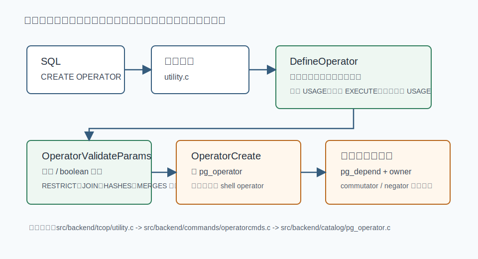
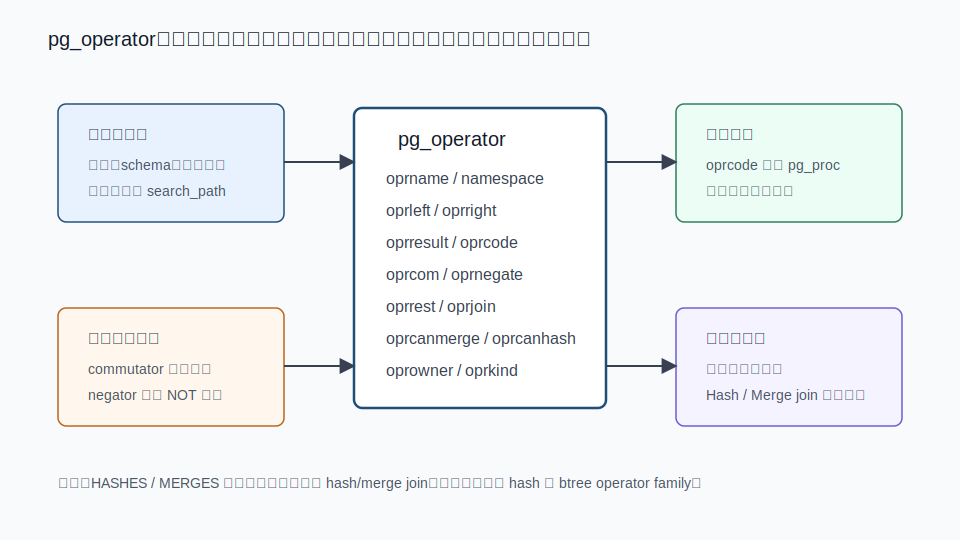
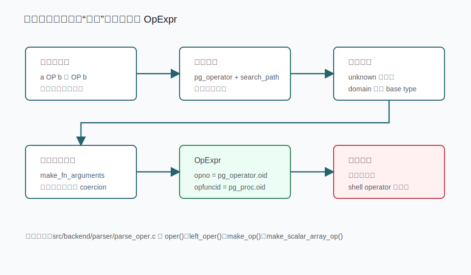
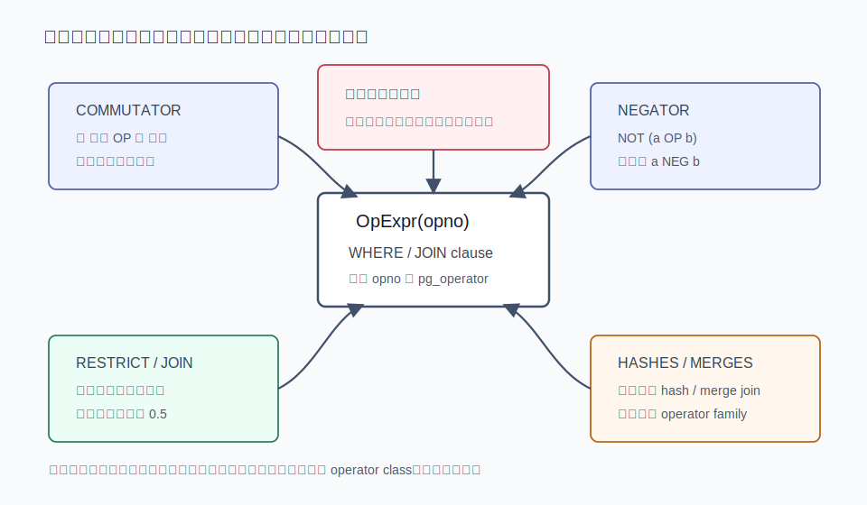
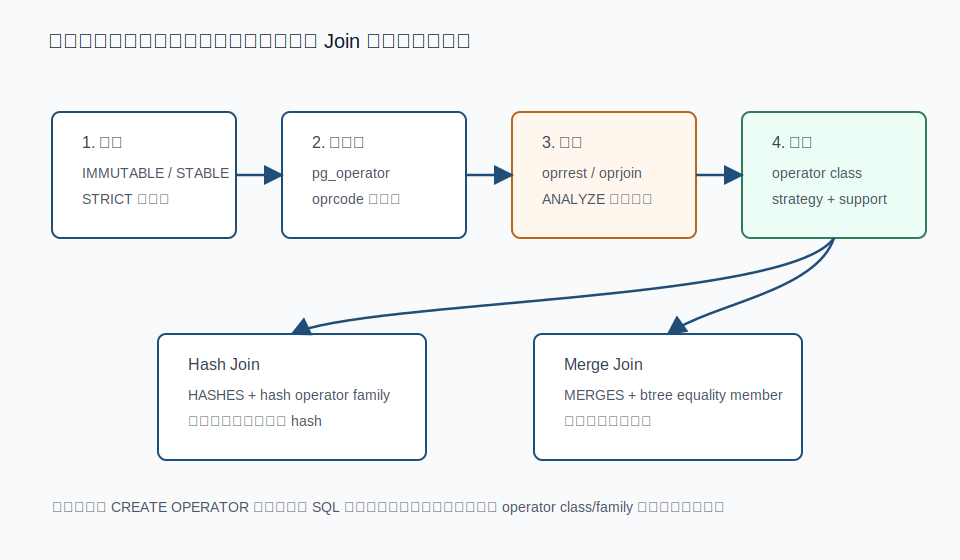

## 数据库筑基课 - 自定义操作符

### 作者
digoal

### 日期
2026-06-08

### 标签
PostgreSQL , 应用开发者 , 数据库筑基课 , 自定义操作符 , 类型系统 , 优化器 , operator class    

----

## 背景
   


这篇属于数据库筑基课里的“数据类型 / 操作符 + 优化器契约”主题。很多团队第一次写 PostgreSQL 扩展时，会先写一个函数，再觉得 SQL 不够自然，于是把函数包装成操作符，例如 `embedding <=> query`、`geom && box`、`ip <<= subnet`、`jsonb @> pattern`。写到这里，功能通常已经能跑；但真正的工程问题才刚开始：

- 为什么 `a OP b` 能执行，却不用索引？
- 为什么同样的条件，`列 OP 常量` 能用索引，`常量 OP 列` 不行？
- 为什么 join 估算离谱，导致小表大表连接顺序反了？
- 为什么把一个非等值操作符标成 `HASHES` 后，计划看似更“高级”，结果却可能错？
- 为什么自定义 domain 上的操作符不一定会被解析器选中？

自定义操作符不是“给函数换个符号”。在 PostgreSQL 里，操作符是函数、类型系统、系统目录、解析器、优化器、索引访问方法之间的一份契约。函数决定怎么计算；`pg_operator` 决定它叫什么、参数是什么、返回什么、能不能翻转、能不能取反、选择性怎么估；operator class / operator family 决定它能不能成为某类索引和 join 算法的合法成员。

本地 `markdown/` 目录没有发现独立的“数据库筑基课大纲”文件，所以本文不强行引用不存在的大纲；后续如果项目补充大纲，可以在这里补课程目录链接。

本文以本地 PostgreSQL 源码目录 `postgres` 为事实来源。核心参考包括：`doc/src/sgml/xoper.sgml`、`doc/src/sgml/ref/create_operator.sgml`、`doc/src/sgml/ref/alter_operator.sgml`、`doc/src/sgml/catalogs.sgml`、`doc/src/sgml/typeconv.sgml`、`doc/src/sgml/indices.sgml`、`doc/src/sgml/xindex.sgml`、`src/backend/commands/operatorcmds.c`、`src/backend/catalog/pg_operator.c`、`src/backend/parser/parse_oper.c`、`src/backend/optimizer/util/plancat.c`、`src/backend/utils/cache/lsyscache.c`、`src/backend/utils/adt/selfuncs.c`、`src/test/regress/sql/opr_sanity.sql`。用户提供的 DeepWiki repoName 修正为 `postgres/postgres` 后，本地 DeepWiki CLI 的目录查询和窄问题查询可用，并把 `pg_operator`、`CREATE OPERATOR` 相关文件指向 `doc/src/sgml/catalogs.sgml`、`doc/src/sgml/ref/create_operator.sgml`、`src/backend/catalog/pg_operator.c`、`src/backend/commands/operatorcmds.c` 等；这些线索已用本地官方文档和源码逐项核验，本文不把未核验的 DeepWiki 叙述作为主要事实依据。

## 一、它解决什么问题？

自定义操作符解决的不是“少打几个函数名”的问题，而是把业务语义暴露给 SQL 语言层和优化器。

假设你有一个业务类型 `vector3`，想表达“相似”“距离小于阈值”“包含”“重叠”“IP 归属”“区域相交”“模糊相等”等语义。只写函数时，SQL 可能是：

```sql
WHERE vector_distance(item.embedding, query.embedding) < 0.3
```

这当然能表达逻辑，但优化器很难从普通函数调用里自动知道：

- 这个条件是不是布尔谓词？
- 能不能把左右参数交换？
- `NOT (...)` 能不能改写成另一个操作符？
- 这个条件大概过滤多少行？
- 它是不是某个 GiST、GIN、B-tree、Hash、BRIN operator class 的合法 search operator？
- 它能不能参与 hash join 或 merge join？

操作符把这些信息放进系统目录，使 SQL 层、解析器、优化器和索引访问方法能共享同一份语义。

代价也很明确：操作符一旦带上优化属性，就等于你向优化器作出承诺。PostgreSQL 官方 `xoper.sgml` 明确提醒，错误使用优化子句可能造成慢查询、细微错误结果或其他严重问题。不确定时，宁可先不标优化属性，也不要把“看起来像等值”的操作符硬标成等值。

## 二、它是什么？

PostgreSQL 自定义操作符是 `pg_operator` 里的一个对象。它至少绑定：

- 操作符名称。
- 左右参数类型；前缀操作符没有左参数。
- 底层实现函数，也就是 `oprcode` 指向的 `pg_proc` 函数。
- 返回类型。

它还可以绑定一组优化器信息：

- `COMMUTATOR`：交换律关系，例如 `x < y` 的 commutator 通常是 `y > x`。
- `NEGATOR`：否定关系，例如 `x < y` 的 negator 通常是 `x >= y`。
- `RESTRICT`：单表过滤选择性估算函数。
- `JOIN`：两表连接选择性估算函数。
- `HASHES`：提示该操作符可作为 hash join 条件。
- `MERGES`：提示该操作符可作为 merge join 条件。

`CREATE OPERATOR` 的核心语法来自 `doc/src/sgml/ref/create_operator.sgml`：

```sql
CREATE OPERATOR name (
    FUNCTION = function_name,
    LEFTARG = left_type,
    RIGHTARG = right_type,
    COMMUTATOR = com_op,
    NEGATOR = neg_op,
    RESTRICT = res_proc,
    JOIN = join_proc,
    HASHES,
    MERGES
);
```

几个边界要先记住：

- PostgreSQL 支持前缀和二元中缀操作符，不支持后缀操作符；`operatorcmds.c` 和 `parse_oper.c` 都会报出 postfix operators are not supported。
- 操作符可以重载，同名操作符可以有不同参数类型。
- 操作符名最多 `NAMEDATALEN - 1` 个字符，默认 63 字节；允许字符来自 `+ - * / < > = ~ ! @ # % ^ & |`、反引号和 `?` 这一类符号。
- `--` 和 `/*` 不能出现在操作符名里，因为会被词法层当成注释起点。
- 多字符操作符不能以 `+` 或 `-` 结尾，除非名称里还含有 `~ ! @ # % ^ & |`、反引号或 `?` 中的字符；这是为了保持 SQL token 解析不需要额外空格。
- `=>` 被 SQL 语法保留，不能作为操作符名。
- `!=` 在输入阶段会被映射成 `<>`，所以二者不能作为两个不同操作符存在。
- 不能在 `CREATE OPERATOR` 里声明词法优先级；操作符优先级是 parser 硬编码行为。
- 如果可选参数里要引用带 schema 的操作符，要用 `OPERATOR(schema.operator)` 语法。



图 1 说明：`CREATE OPERATOR` 不是直接插一行目录。命令层先解析属性、检查 schema 创建权限、类型 USAGE 权限、底层函数 EXECUTE 权限、返回类型 USAGE 权限，并验证选择性估算函数签名；catalog 层再写入 `pg_operator`，处理 shell operator、依赖和 commutator / negator 的反向链接。

## 三、核心原理

### 3.1 目录模型：pg_operator 是语义总线

`doc/src/sgml/catalogs.sgml` 的 `pg_operator` 章节说明，`pg_operator` 存储操作符信息。几个字段是理解自定义操作符的主线：

| 字段 | 含义 | 工程影响 |
|---|---|---|
| `oprname` | 操作符名 | 参与解析和重载 |
| `oprnamespace` | 所属 schema | 非限定名受 `search_path` 影响 |
| `oprowner` | owner | 决定 `ALTER/DROP` 权限 |
| `oprkind` | `b` 表示二元，`l` 表示前缀 | PostgreSQL 不支持后缀 |
| `oprleft` / `oprright` | 左右参数类型 | 二元操作符必须都有；前缀操作符左类型为 0 |
| `oprresult` | 返回类型 | shell operator 尚未定义时为 0 |
| `oprcode` | 底层实现函数 | parser 构造 `OpExpr.opfuncid` 时使用 |
| `oprcom` | commutator 操作符 OID | 支持条件翻转、索引匹配 |
| `oprnegate` | negator 操作符 OID | 支持 `NOT` 简化 |
| `oprrest` | restriction selectivity estimator | 影响过滤条件行数估算 |
| `oprjoin` | join selectivity estimator | 影响 join 行数和连接顺序估算 |
| `oprcanmerge` | 是否可能 merge join | 只是入口提示，还要查 btree family |
| `oprcanhash` | 是否可能 hash join | 必须与 hash family 和 hash 函数语义一致 |



图 2 说明：`pg_operator` 把一个符号拆成四类信息：身份解析、执行函数、布尔代数关系、优化器代价与路径提示。实际执行看 `oprcode`，计划质量看 commutator、negator、选择性函数和 operator family 是否补齐。

### 3.2 创建路径：DefineOperator 负责校验，OperatorCreate 负责落目录

源码 `src/backend/commands/operatorcmds.c` 的 `DefineOperator()` 从 parser 生成的参数列表里取出 `leftarg`、`rightarg`、`function/procedure`、`commutator`、`negator`、`restrict`、`join`、`hashes`、`merges` 等属性。

它做几类硬校验：

- 必须指定底层函数。
- 必须指定右参数；只缺右参数会被解释成试图创建后缀操作符并报错。
- 参数不能是 `SETOF`。
- 创建者必须对目标 schema 有 `CREATE` 权限。
- 创建者必须对参数类型和返回类型有 `USAGE` 权限。
- 创建者必须对底层函数有 `EXECUTE` 权限。
- `RESTRICT` estimator 必须是 `float8(internal, oid, internal, int4)` 形态。
- `JOIN` estimator 推荐形态是 `float8(internal, oid, internal, int2, internal)`；旧的 4 参数形态仍被允许但已过时。
- 非内置选择性估算函数要求 superuser 权限才能挂到操作符上，这是为了避免把不符合 estimator 约定的函数塞给优化器。

然后 `DefineOperator()` 调用 `src/backend/catalog/pg_operator.c` 的 `OperatorCreate()`。`OperatorCreate()` 会：

1. 校验操作符名是否合法，规则要和 `parser/scan.l` 保持一致。
2. 读取底层函数返回类型。
3. 调用 `OperatorValidateParams()` 检查优化属性是否和参数/返回类型匹配。
4. 查同名同 schema 同参数类型的操作符是否已存在。
5. 处理 commutator / negator，如果引用的对端操作符尚未定义，必要时创建 shell operator。
6. 插入或更新 `pg_operator`。
7. 建立 namespace、参数类型、返回类型、底层函数、选择性函数、owner、extension 的依赖。
8. 用 `OperatorUpd()` 维护 commutator / negator 的反向链接。

`OperatorValidateParams()` 的规则很关键：

- 非二元操作符不能有 commutator、join selectivity、`MERGES`、`HASHES`。
- 非 boolean 返回的操作符不能有 negator、restriction selectivity、join selectivity、`MERGES`、`HASHES`。

这说明 `HASHES/MERGES` 不是“让任何函数跑得更快”的开关。它们只对返回 boolean 的二元谓词有意义。

### 3.3 Shell operator：为成对关系解决先后定义问题

commutator 和 negator 经常成对出现。问题是，第一条 `CREATE OPERATOR` 怎么引用第二个尚未创建的操作符？

`create_operator.sgml` 给出三种办法：

- 第一个操作符先不写 `COMMUTATOR`，第二个操作符创建时补上；PostgreSQL 会回填第一个操作符的 commutator。
- 两边都写 `COMMUTATOR`；第一个引用不存在的对端时，PostgreSQL 创建一个 shell operator，后续定义对端时再填完整。
- 两个操作符都先不写关系，之后用 `ALTER OPERATOR` 设置；设置一边即可，PostgreSQL 会维护对端链接。

源码里的 `OperatorShellMake()` 会创建一条只有名称、namespace、左右类型、owner 等最小信息的 `pg_operator` 记录，`oprcode` 和 `oprresult` 为无效 OID。`parse_oper.c` 的 `make_op()` 在使用操作符时会检查 `oprcode`；如果只是 shell，会报“operator is only a shell”。

这里有个依赖处理细节：`makeOperatorDependencies()` 明确不把操作符视为依赖于 `oprcom` 和 `oprnegate` 指向的操作符。原因是删除对端时不应该级联删除本操作符，而应该把链接字段清掉；这件事由 `RemoveOperatorById()` 手工调用 `OperatorUpd(..., isDelete=true)` 处理。

### 3.4 解析器：先找操作符，再把表达式变成 OpExpr

`doc/src/sgml/typeconv.sgml` 的 operator type resolution 章节给出解析规则。简化后：

1. 从 `pg_operator` 找候选。非 schema 限定名只考虑当前 `search_path` 中可见、名称和参数个数匹配的操作符；schema 限定名只考虑指定 schema。
2. 先找精确参数类型匹配。
3. 二元操作符中一边是 `unknown` 时，精确匹配阶段先假设 unknown 和另一边同类型。
4. 如果一边是 domain，一边是 unknown，还会考虑 domain base type。
5. 找不到精确匹配时，过滤掉不能通过隐式转换匹配的候选。
6. 对剩余候选按精确匹配数量、preferred type、unknown 字面量类型类别等规则选最合适者。
7. 仍无法唯一确定时，报 ambiguous operator，需要显式 cast。

源码 `src/backend/parser/parse_oper.c` 对应这些行为：

- `oper()` 查二元操作符，先查 lookaside cache，再找 exact match，最后走候选选择。
- `left_oper()` 查前缀操作符。
- `make_op()` 选中操作符后检查不是 shell，按声明类型插入必要 coercion，最后构造 `OpExpr`。
- `make_scalar_array_op()` 处理 `op ANY/ALL(array)`，并要求操作符返回 boolean 且不能返回 set。

`OpExpr` 里最关键的是：

- `opno`：选中的 `pg_operator.oid`。
- `opfuncid`：底层函数 OID。
- `opresulttype`：返回类型。
- `args`：完成类型转换后的参数表达式。



图 3 说明：SQL 里看到的是符号，解析器最终交给优化器和执行器的是 `OpExpr`。所以同名操作符、unknown 字面量、domain base type、`search_path` 都会影响到底选中哪一个 `pg_operator` 记录。

一个容易踩的坑是 domain 类型。`typeconv.sgml` 举例说明，用户给 domain 单独定义操作符是可能的，但不一定有想象中有用，因为操作符解析规则倾向于让 domain 像 base type 一样参与歧义解析。要强制使用 domain 上的自定义操作符，往往需要显式 cast。这个行为对“用 domain 包装业务 ID，然后重载 `=`”的设计非常重要。

### 3.5 优化器：不会猜，只消费目录契约

官方 `xoper.sgml` 明确说，操作符不只是语法糖，因为它携带帮助优化器的信息。核心信息有五类。

第一，`COMMUTATOR` 让条件可以翻转。`indices.sgml` 说明，PostgreSQL 索引通常匹配：

```sql
indexed_column indexable_operator comparison_value
```

如果原始条件写成：

```sql
comparison_value operator indexed_column
```

只有当原始操作符有 commutator，且 commutator 是索引 operator class 的成员时，优化器才能翻转成可索引形式。`xoper.sgml` 也用 join 条件说明，如果 `tab2.y` 有索引，优化器不能凭空假设 `tab1.x = tab2.y` 等价于 `tab2.y = tab1.x`；必须由操作符定义者通过 commutator 明确声明。

第二，`NEGATOR` 让否定改写更直接。例如 `NOT (x = y)` 可以简化为 `x <> y`。这在谓词下推、约束证明、布尔表达式改写里会间接出现。

第三，`RESTRICT` 估计单表过滤率。`src/backend/optimizer/util/plancat.c` 的 `restriction_selectivity()` 会通过 `get_oprrest(operatorid)` 找 estimator。如果没有 estimator，代码回落到 0.5。0.5 对很多高选择性谓词会很糟：本来只命中 0.01% 的条件，优化器却可能当成一半行都命中。

第四，`JOIN` 估计连接选择性。`join_selectivity()` 类似读取 `oprjoin`，没有时也回落到 0.5。连接选择性错，会直接影响 join 顺序、join 方法和内外表选择。

第五，`HASHES` 和 `MERGES` 是 join 算法入口标记，但不是充分条件。`xoper.sgml` 写得很清楚：

- `HASHES` 只对表示某种等值语义的 boolean 二元操作符有意义；如果两个值 hash 到不同 bucket，hash join 根本不会比较它们，所以相等值必须产生相同 hash code。
- 标成 `HASHES` 的操作符必须出现在 hash index operator family 中，系统需要 operator family 找到相应数据类型的 hash 函数。
- `MERGES` 也要求等值语义，并且操作符必须是 btree operator family 的 equality 成员；两边数据类型必须能按兼容顺序排序。
- hash/merge joinable 操作符必须有 commutator；跨类型场景需要在同一个 family 里建立一致关系。
- 底层函数如果是 volatile，系统不会尝试用它做 hash join 或 merge join。

`src/backend/utils/cache/lsyscache.c` 进一步说明，`op_mergejoinable()` 对普通操作符主要依赖 `pg_operator.oprcanmerge`，但 planner 还需要找适合的 btree opfamily；`op_hashjoinable()` 对普通操作符依赖 `oprcanhash`，且必须有适合的 hash opfamily。

`src/backend/optimizer/plan/initsplan.c` 的注释更有工程味：`oprcanmerge` is considered a hint，but `oprcanhash` had better be correct。原因很直观：merge join 还要找 btree family，找不到就放弃；hash join 如果你错误声明“不同 bucket 的值不可能相等”，结果可能不是慢，而是错。



图 4 说明：优化器不会从函数体里自动推导交换律、否定关系、过滤率、连接率或 join 能力。它只消费 `pg_operator`、`pg_amop`、`pg_amproc`、统计信息和函数属性里已经声明的契约。

### 3.6 Operator class/family：能执行不等于能用索引

`CREATE OPERATOR` 只让 SQL 认识这个操作符。要让索引访问方法认识它，还要把它放进 operator class 或 operator family。

`doc/src/sgml/ref/create_opclass.sgml` 说明，operator class 定义某个数据类型怎样用于某种索引方法：哪些操作符填充哪些 strategy，哪些 support function 被索引方法调用。文档也强调，`CREATE OPERATOR CLASS` 目前不会完整检查定义是否包含索引方法需要的所有操作符和函数，也不会检查它们是否自洽；定义有效性是用户责任。创建 operator class 还要求 superuser，因为错误定义可能混淆甚至 crash server。

`xindex.sgml` 的 B-tree 示例展示了完整链条：

1. 先写一个内部比较函数。
2. 用它包装出 `<`、`<=`、`=`、`>=`、`>` 等 boolean 操作符。
3. 为操作符声明正确的 commutator、negator、restriction estimator、join estimator。
4. 再创建 B-tree support function。
5. 最后 `CREATE OPERATOR CLASS ... USING btree`，把 strategy 1 到 5 对应到比较操作符，把 support function 放入指定 slot。

operator family 则把多个相关 opclass 和跨类型操作符放到同一语义集合里。内置 `integer_ops` family 就包含 `int8_ops`、`int4_ops`、`int2_ops` 以及跨类型比较操作符，使 `integer` 索引能用 `smallint` 或 `bigint` 常量进行合理查找。



图 5 说明：一个操作符从“能执行”到“能产生好计划”通常有四级：底层函数正确，`pg_operator` 正确，选择性估算合理，operator class/family 与索引方法语义一致。只做前两级，SQL 能跑，但不要期待它自动用索引或自动成为 hash/merge join 条件。

## 四、横向对比

| 维度 | 自定义函数 | 自定义操作符 | Operator class / family |
|---|---|---|---|
| 主要目标 | 封装计算逻辑 | 把计算逻辑变成 SQL 谓词/表达式语义 | 把操作符接入索引访问方法和跨类型语义集合 |
| 系统目录 | `pg_proc` | `pg_operator`，依赖 `pg_proc` 和 `pg_type` | `pg_opclass`、`pg_opfamily`、`pg_amop`、`pg_amproc` |
| 解析方式 | 函数名 + 参数类型解析 | 操作符名 + 参数个数 + 类型解析，可重载 | 创建索引或匹配 indexable clause 时使用 |
| 优化器信息 | 函数 volatility、strict、cost、support function 等 | commutator、negator、selectivity estimator、hash/merge 标记 | strategy、support function、排序/哈希/搜索语义 |
| 索引使用 | 普通函数条件通常不能直接成为索引 search key，表达式索引例外 | 只有属于相应 opclass/family 的操作符才是 indexable operator | 明确定义哪些操作符能驱动哪类索引 |
| 连接算法 | 普通函数 join 条件通常只能当过滤表达式 | 可声明 hash/merge join 入口 | hash/btree family 提供实际 hash/sort/equality 支撑 |
| 风险 | 函数写错，语义错 | 优化属性写错，计划错或结果错 | opclass/family 不自洽，可能造成严重错误 |
| 权限门槛 | 通常普通用户可创建 SQL 函数 | 需要相关类型/函数权限；非内置 estimator 要 superuser | 创建 opclass 要 superuser |

结论很直接：函数是“怎么算”，操作符是“这个计算在 SQL 里代表什么关系”，operator class/family 是“这个关系怎样被某种索引和 join 算法安全使用”。三者不是替代关系，而是递进关系。

## 五、效果如何？

正确设计自定义操作符的收益：

- SQL 表达更贴近业务和数学模型，例如 `point <@ box`、`range && range`、`vector <=> vector`。
- 优化器可以翻转条件，让索引列出现在索引匹配需要的位置。
- `NOT` 谓词可以转成更直接的 negator 操作符。
- 过滤率和连接率估算更接近真实 workload，减少错误 join 顺序。
- 配合 operator class/family 后，操作符可以成为 B-tree、Hash、GiST、GIN、BRIN 等索引方法的 search operator。
- 等值语义完整时，可以支持 hash join 和 merge join。
- 跨类型 family 可以避免大量显式 cast，让不同但兼容的类型自然参与比较和索引查找。

代价和风险：

- 语义承诺比函数更重。commutator、negator、HASHES、MERGES 不是注释，而是优化器会使用的事实。
- 选择性函数写错，计划可能长期偏离真实数据分布。
- `HASHES` 错标尤其危险，因为 hash join 会跳过不同 hash bucket 的比较。
- operator class/family 要保持 strategy、support function、排序、等值、hash 函数的一致性；PostgreSQL 不会帮你完整证明。
- 重载和 `search_path` 会增加解析不确定性，尤其是 unknown 字面量、domain、跨 schema 操作符。
- 操作符优先级不能自定义，符号设计必须顺应 PostgreSQL parser 规则。

## 六、实操 DEMO

下面示例用于说明“操作符能执行”和“能用普通 B-tree 索引”不是一回事。SQL 语法按 PostgreSQL 文档和源码规则编写；本次没有连接数据库执行，因此不提供任何编造的 `EXPLAIN` 输出。

### 6.1 只创建一个可执行操作符

```sql
DROP SCHEMA IF EXISTS op_demo CASCADE;
CREATE SCHEMA op_demo;
SET search_path = op_demo, public;

CREATE FUNCTION abs_eq_int(integer, integer)
RETURNS boolean
LANGUAGE sql
IMMUTABLE
STRICT
AS $$
  SELECT abs($1) = abs($2);
$$;

CREATE OPERATOR === (
  LEFTARG = integer,
  RIGHTARG = integer,
  FUNCTION = abs_eq_int,
  COMMUTATOR = OPERATOR(op_demo.===),
  RESTRICT = eqsel,
  JOIN = eqjoinsel
);

SELECT 3 === -3 AS same_abs;
```

这个操作符满足基本条件：

- 二元操作符。
- 返回 boolean。
- 底层函数 immutable、strict。
- 自 commutator，因为 `abs(a) = abs(b)` 对左右参数交换成立。
- 使用内置 `eqsel` / `eqjoinsel`，只是作为示例；真实相似、包含、重叠语义不要机械套用等值估算。

但它还没有被放进任何 B-tree 或 Hash operator family。因此它只是“能执行、能估算”，不是“能用普通 `integer` B-tree 索引”。

### 6.2 验证普通索引不会自动认识它

```sql
CREATE TABLE t_abs(v integer);
INSERT INTO t_abs
SELECT CASE WHEN g % 2 = 0 THEN g ELSE -g END
FROM generate_series(1, 10000) AS g;

CREATE INDEX t_abs_v_idx ON t_abs(v);
ANALYZE t_abs;

EXPLAIN (COSTS OFF)
SELECT *
FROM t_abs
WHERE v === 42;

EXPLAIN (COSTS OFF)
SELECT *
FROM t_abs
WHERE v = 42;
```

预期验证点不是“某个固定输出”，而是观察计划为什么不同：

- `v = 42` 使用的是内置 `integer` B-tree opclass 里的 equality operator，优化器可以把它作为 indexable clause。
- `v === 42` 虽然也是 boolean 二元操作符，但不属于 `t_abs_v_idx` 对应 opclass 的 search operator，普通 B-tree 索引不能把它当成 search key。
- 如果业务真的需要按 `abs(v)` 查，可以考虑表达式索引，例如 `CREATE INDEX ON t_abs ((abs(v)));`，然后写能匹配表达式索引的谓词；或者设计完整 operator class，但这不是随手加 `CREATE OPERATOR` 能解决的。

### 6.3 查看目录信息

```sql
SELECT
  o.oid,
  n.nspname,
  o.oprname,
  o.oprkind,
  o.oprleft::regtype,
  o.oprright::regtype,
  o.oprresult::regtype,
  o.oprcode::regproc,
  o.oprcom::regoperator,
  o.oprnegate::regoperator,
  o.oprrest::regproc,
  o.oprjoin::regproc,
  o.oprcanmerge,
  o.oprcanhash
FROM pg_operator AS o
JOIN pg_namespace AS n ON n.oid = o.oprnamespace
WHERE n.nspname = 'op_demo'
  AND o.oprname = '===';
```

这条查询是 DBA 排查自定义操作符的第一层体检：先确认解析到的对象、参数类型、底层函数、commutator/negator、选择性函数和 hash/merge 标记是否符合预期。

### 6.4 清理

```sql
DROP SCHEMA op_demo CASCADE;
```

## 七、最佳实践

### 面向数据库架构师

把操作符当成类型系统设计的一部分，而不是 SQL 美化工具。设计一个新类型时，先写清楚：

- 哪些关系是等值、排序、包含、重叠、距离、相似？
- 哪些关系满足交换律？
- 哪些关系有严格的 negator？
- 哪些关系能被索引方法安全支持？
- 哪些跨类型比较是语义一致的？
- hash 函数和 equality 是否完全一致？

如果回答不了这些问题，不要急着创建 operator family。先只暴露函数或普通操作符，等语义和测试收敛后再接入索引。

### 面向 DBA

排查慢 SQL 时，不要只看谓词长什么样，要看它解析成哪个 `pg_operator.oid`。建议从四层检查：

```sql
-- 1. 操作符本身
SELECT oid, oprname, oprleft::regtype, oprright::regtype,
       oprresult::regtype, oprcode::regproc,
       oprcom::regoperator, oprnegate::regoperator,
       oprrest::regproc, oprjoin::regproc,
       oprcanmerge, oprcanhash
FROM pg_operator
WHERE oprname = '你的操作符名';

-- 2. 是否进入某个索引 operator family
SELECT am.amname, ofam.opfname, amop.amopstrategy,
       amop.amoppurpose, amop.amopopr::regoperator
FROM pg_amop AS amop
JOIN pg_opfamily AS ofam ON ofam.oid = amop.amopfamily
JOIN pg_am AS am ON am.oid = ofam.opfmethod
WHERE amop.amopopr = '你的操作符(左类型,右类型)'::regoperator;

-- 3. support function 是否齐全
SELECT am.amname, ofam.opfname, amproc.amprocnum,
       amproc.amproc::regprocedure
FROM pg_amproc AS amproc
JOIN pg_opfamily AS ofam ON ofam.oid = amproc.amprocfamily
JOIN pg_am AS am ON am.oid = ofam.opfmethod
WHERE ofam.opfname = '你的 operator family';

-- 4. 计划是否真的按预期使用
EXPLAIN (ANALYZE, BUFFERS)
SELECT ...
WHERE indexed_column OP constant;
```

重点看实际行数和估算行数的差距。如果差距很大，问题可能不在索引，而在 `oprrest/oprjoin`、统计信息、表达式写法或参数类型解析。

### 面向业务开发者

不要用自定义操作符隐藏昂贵函数。`WHERE a ~~ b` 看起来短，不代表便宜。写 SQL 时要明确：

- 操作符是否和列的索引类型匹配。
- 字面量是否需要显式 cast，避免 unknown 导致解析到意外操作符。
- schema 是否需要 `OPERATOR(schema.op)` 明确限定，避免 `search_path` 干扰。
- `NOT (a OP b)` 是否有可靠 negator；没有就不要假设优化器能改写。
- 参数左右顺序是否影响索引匹配；commutator 不完整时，尽量把索引列写在左侧。

## 八、适合与不适合场景

适合自定义操作符的场景：

- 新数据类型需要自然表达比较、包含、重叠、相似、距离、排序等关系。
- 扩展需要把操作符接入 GiST、GIN、SP-GiST、BRIN、B-tree、Hash 等索引方法。
- 业务 SQL 大量使用某类二元谓词，函数形式可读性差且难以接入优化器。
- 需要跨类型比较，例如不同精度数值、网络地址与网段、几何对象与边界框。
- 需要让 join 条件被 hash/merge join 考虑，且语义确实满足等值关系。

不适合的场景：

- 只是为了缩短函数名，没有明确优化器语义。
- 操作符语义依赖时间、随机数、外部状态、配置表或会话状态。
- 不能证明 commutator、negator、hash equality、sort equality 的一致性。
- 只是想改变优先级或 SQL 语法；PostgreSQL 不允许自定义操作符优先级。
- 需要覆盖 domain base type 的默认解析，但无法接受显式 cast 带来的 SQL 约束。
- 希望普通索引自动识别新操作符，却没有设计 operator class/family。

## 九、常见坑

### 9.1 把操作符当函数别名

只写：

```sql
CREATE OPERATOR <#> (
  LEFTARG = mytype,
  RIGHTARG = mytype,
  FUNCTION = my_distance_less
);
```

这只解决了可读性，没有解决索引、选择性、join、翻转、否定。对优化器来说，这个操作符的大部分语义仍然是空白。

### 9.2 错误声明 COMMUTATOR

`x A y` 和 `y B x` 必须对所有可能输入等价，不能只在常见数据上等价。尤其要考虑：

- NULL 行为。
- NaN、正负零、空字符串、空数组、空 range。
- collation。
- 精度、舍入、归一化。
- 跨类型表示差异。

### 9.3 错误声明 NEGATOR

negator 要求两个 boolean 操作符互为完全否定。`x A y` 等价于 `NOT (x B y)`。SQL 三值逻辑下，NULL 行为很容易破坏这个关系。不要只拿 true/false 样例测试，要覆盖 NULL。

### 9.4 把非等值操作符标成 HASHES

hash join 的前提是：如果操作符可能返回 true，左右值必须落入同一个 hash code。包含、重叠、近似相等、距离小于阈值通常不满足这个前提。把它们标成 `HASHES` 很危险。

### 9.5 以为 MERGES 只需要能排序

merge join 需要的是 equality-like join operator，与两侧排序顺序兼容。不是“类型能排序”就能让任何比较操作符 merge join。

### 9.6 选择性函数随便套

`eqsel`、`neqsel`、`scalarltsel`、`matchingsel` 等内置 estimator 有各自假设。近似匹配、包含、相交、相似度阈值、向量距离等谓词如果套错 estimator，会让计划严重偏离真实数据。

### 9.7 忽略 operator class 的自洽性

`CREATE OPERATOR CLASS` 文档明确说 PostgreSQL 目前不会完整检查 opclass 是否包含索引方法需要的全部操作符和函数，也不会证明它们自洽。扩展作者必须用回归测试、随机测试、边界值测试、索引一致性检查去证明。

### 9.8 忽略 search_path 安全边界

操作符解析受 `search_path` 影响。`typeconv.sgml` 还指出，通过 schema 限定名调用且没有精确匹配时，在允许不可信用户创建对象的 schema 中可能有安全风险。高权限代码里要固定 `search_path`，必要时显式 cast 参数。

### 9.9 在 domain 上重载后误以为一定生效

domain 操作符可能被 base type 操作符“盖过去”。如果你依赖 domain 专属操作符，要写测试覆盖 unknown 字面量、显式 cast、prepared statement 参数类型等情况。

## 十、扩展问题

1. 如果你要为一个新向量类型设计 `<=>` 距离操作符，它应该返回 distance 还是 boolean？如果返回 distance，它还能有 `RESTRICT/JOIN/HASHES/MERGES` 吗？
2. 一个“近似相等”操作符能不能作为 hash join 条件？如果不能，它能不能作为 GiST 或 HNSW 类索引的 search operator？
3. 如果两个值在业务上相等，但二进制表示不同，hash 函数应该如何归一化？
4. B-tree operator family 里的 `<`、`<=`、`=`、`>=`、`>` 如果在 NaN 或 NULL 附近不自洽，会影响哪些 SQL 能力？
5. 为什么 `常量 OP 列` 能不能用索引，取决于 `COMMUTATOR` 和 opclass，而不只是函数是否 immutable？
6. 什么时候应该写 expression index，而不是创建新操作符和 operator class？
7. 如果 `oprrest` 总是估小 100 倍，优化器在 nested loop、hash join、bitmap scan 上可能出现什么偏差？

## 十一、扩展阅读

- `postgres/doc/src/sgml/xoper.sgml`：User-Defined Operators，解释操作符定义和优化属性。
- `postgres/doc/src/sgml/ref/create_operator.sgml`：`CREATE OPERATOR` 语法、限制、权限、shell operator 说明。
- `postgres/doc/src/sgml/ref/alter_operator.sgml`：`ALTER OPERATOR` 可修改属性及不可回退边界。
- `postgres/doc/src/sgml/catalogs.sgml`：`pg_operator` 系统目录字段。
- `postgres/doc/src/sgml/typeconv.sgml`：操作符类型解析、unknown、domain、search_path 行为。
- `postgres/doc/src/sgml/indices.sgml`：indexable operator、commutator 与索引匹配。
- `postgres/doc/src/sgml/xindex.sgml`：扩展索引、operator class、operator family、B-tree 示例。
- `postgres/doc/src/sgml/ref/create_opclass.sgml`：`CREATE OPERATOR CLASS` 的责任边界。
- `postgres/src/backend/commands/operatorcmds.c`：`DefineOperator()`、`AlterOperator()`、选择性函数验证。
- `postgres/src/backend/catalog/pg_operator.c`：`OperatorCreate()`、shell operator、`OperatorUpd()`、依赖处理。
- `postgres/src/backend/parser/parse_oper.c`：操作符查找、类型解析、`OpExpr` 构造。
- `postgres/src/backend/optimizer/util/plancat.c`：`restriction_selectivity()`、`join_selectivity()`。
- `postgres/src/backend/utils/cache/lsyscache.c`：`op_mergejoinable()`、`op_hashjoinable()`、`get_commutator()`、`get_negator()`。
- `postgres/src/backend/utils/adt/selfuncs.c`：restriction / join estimator 调用约定。
- `postgres/src/test/regress/sql/opr_sanity.sql`：内置操作符、opclass、estimator 的一致性体检查询。
- DeepWiki `postgres/postgres`：作为源码导航辅助，目录页包含 Query Processing Pipeline、System Catalogs and Metadata Management 等章节；窄问题查询返回的 `pg_operator` / `CREATE OPERATOR` 文件线索已由本地源码核验。
  
## 附录 
1、克隆代码  
```  
git clone --depth 1 https://github.com/postgres/postgres
```  
  
2、启用 codex, 使用 [数据库筑基课 skill](../skills/README.md).  
```
文章标题: 
  数据库筑基课 - 自定义操作符
项目源码(本地目录): 
  postgres
项目 codebase 文件名: 
  postgres/CLAUDE.md 
开源项目相关的 deepwiki repoName: 
  postgres/postgres
```
    
#### [PostgreSQL 解决方案集合](../201706/20170601_02.md "40cff096e9ed7122c512b35d8561d9c8")
  
  
#### [德哥 / digoal's Github - 公益是一辈子的事.](https://github.com/digoal/blog/blob/master/README.md "22709685feb7cab07d30f30387f0a9ae")
  
  
#### [About 德哥](https://github.com/digoal/blog/blob/master/me/readme.md "a37735981e7704886ffd590565582dd0")
  
  

  
