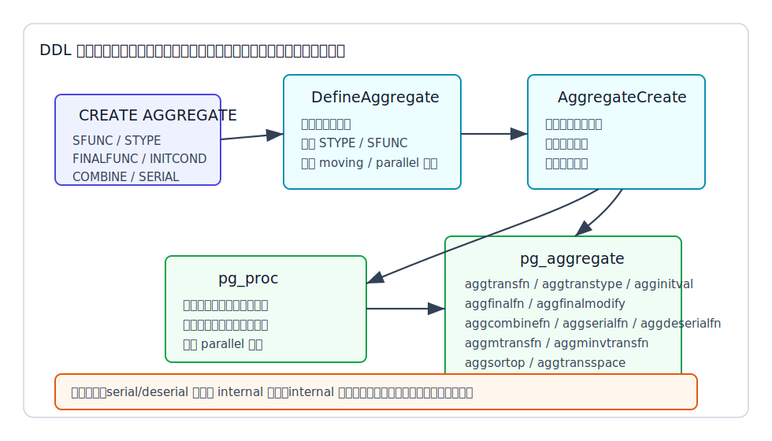
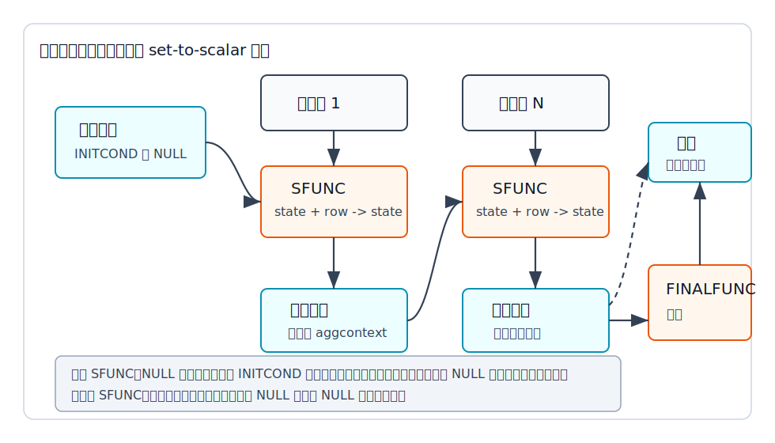
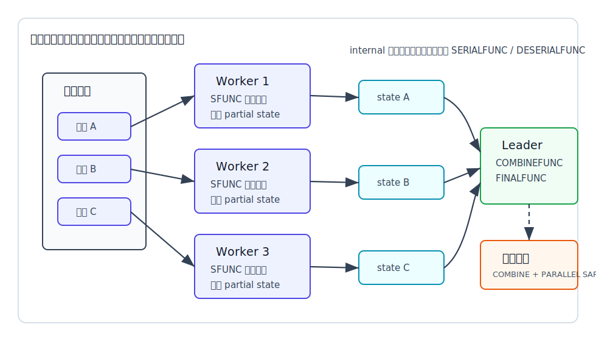
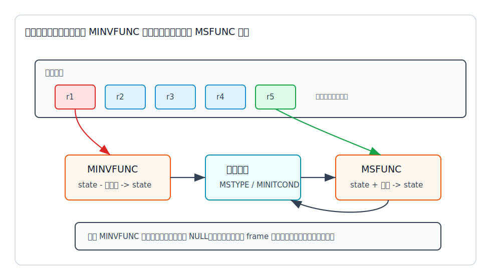

## 数据库筑基课 - 自定义聚合函数

### 作者
digoal

### 日期
2026-06-08

### 标签
PostgreSQL , 应用开发者 , 数据库筑基课 , 自定义聚合函数 , 执行器 , 扩展机制 , 并行聚合    

----

## 背景
   


这篇属于数据库筑基课里的“执行算子 + 扩展机制”主题。自定义聚合函数不是把一个 SQL 函数换个名字，它是在数据库内部注册一套“状态如何初始化、每行如何进入状态、状态如何合并、结果如何产出”的执行协议。

本地 `markdown/` 目录没有发现独立的“数据库筑基课大纲”文件，所以本文不强行引用不存在的大纲；后续如果项目补充大纲，可以在这里补上课程目录链接。

用户提供的 DeepWiki repoName 为 `postgres/postgres`。本次通过 `npx --yes @seflless/deepwiki ask postgres/postgres ...` 查询到的架构线索包括 `pg_aggregate`、`pg_proc`、`nodeAgg.c`、`nodeWindowAgg.c`、`AggState` 和 partial/moving aggregate 路径；这些线索已回到本地源码和官方文档核对。本文的关键结论来自本地 PostgreSQL 源码和官方文档：`doc/src/sgml/ref/create_aggregate.sgml`、`doc/src/sgml/xaggr.sgml`、`doc/src/sgml/catalogs.sgml`、`src/backend/commands/aggregatecmds.c`、`src/backend/catalog/pg_aggregate.c`、`src/include/catalog/pg_aggregate.h`、`src/include/catalog/pg_aggregate.dat`、`src/backend/executor/nodeAgg.c`、`src/backend/executor/nodeWindowAgg.c`、`src/backend/optimizer/prep/prepagg.c`、`src/backend/optimizer/plan/planagg.c`，以及回归测试 `src/test/regress/sql/create_aggregate.sql`。

一个典型场景是这样的：

业务要做“加权平均成交价”“会话轨迹压缩”“自定义风险评分”“多字段合并后的质量分”。开发者先把明细拉到应用侧循环计算，结果网络传输大、并发下 CPU 和内存都压在应用服务器上；改成 SQL 里的 `sum()`、`count()` 组合后，普通报表够用，但一旦状态不是单个数字，或者需要最终函数、窗口滑动、并行状态合并，就开始写一堆重复子查询和临时表。

自定义聚合函数解决的就是这个问题：把“多行归约成一个值”的业务逻辑放进数据库执行器，让它能和 `GROUP BY`、`FILTER`、`DISTINCT`、`ORDER BY`、窗口函数、并行执行、系统目录和权限体系配合。但代价也很明确：你必须设计状态类型、NULL 语义、内存边界、顺序敏感性、并行合并规则和升级路径。

## 一、它解决什么问题？

聚合的本质是 set-to-scalar：输入是一组行，输出是一个值。普通标量函数只处理当前行；聚合函数必须记住“已经看过的行”对当前结果的影响。

PostgreSQL 的自定义聚合函数把这个问题拆成三个基本动作：

- `SFUNC`：状态转移函数。每读到一行，就把旧状态和当前行输入合成为新状态。
- `STYPE`：状态数据类型。它不一定等于输入类型，也不一定等于输出类型。
- `FINALFUNC`：最终函数。所有输入行处理完后，把内部状态转换成用户看到的结果；没有 `FINALFUNC` 时直接返回最终状态。

更复杂时，还可以加上：

- `COMBINEFUNC`：把两个 partial state 合成一个 state，用于 partial aggregation 和并行聚合。
- `SERIALFUNC` / `DESERIALFUNC`：当状态类型是 `internal` 时，把私有状态序列化成 `bytea`，再从 `bytea` 还原，用于跨进程传递。
- `MSFUNC` / `MINVFUNC` / `MSTYPE`：窗口滑动时添加新行、移除旧行，避免每次 frame 起点移动都全量重算。
- `FINALFUNC_EXTRA`：给多态 final 函数传入额外的 NULL dummy 参数，让结果类型能从聚合输入类型推导出来。
- `FINALFUNC_MODIFY`：声明 final 函数是否会破坏状态，影响窗口函数可用性和多个聚合共享 transition state 的优化。
- `SORTOP`：声明一个类似 `min` / `max` 的排序算子，让优化器在合适条件下把聚合改写成索引有序访问。

所以自定义聚合函数解决的不只是“PostgreSQL 没有某个函数”。它解决的是：如何把业务归约逻辑变成数据库执行器可调度、可分组、可并行、可估算内存、可被系统目录管理的状态机。

它牺牲的是简单性。一个写错的状态函数，可能导致 NULL 处理不符合预期；一个错误的 `COMBINEFUNC`，可能让并行查询返回和串行查询不同的结果；一个没有边界的状态类型，可能让 `HashAggregate` 的内存估算失真。

## 二、它是什么？

PostgreSQL 里的聚合函数由两个系统目录共同表达：

| 目录 | 作用 | 和自定义聚合的关系 |
|---|---|---|
| `pg_proc` | 记录函数名、参数、返回类型、owner、parallel 属性等 | 聚合本身也有一个 `pg_proc` 入口，因此能用函数式名字解析和重载 |
| `pg_aggregate` | 记录聚合专有信息 | 记录 `aggtransfn`、`aggtranstype`、`agginitval`、`aggcombinefn`、`aggserialfn`、`aggmtransfn`、`aggsortop` 等 |

官方目录文档 `doc/src/sgml/catalogs.sgml` 明确说明：`pg_aggregate` 是 `pg_proc` 条目的扩展。源码 `src/include/catalog/pg_aggregate.h` 里也能看到字段定义：`aggfnoid` 指向聚合自身的 `pg_proc` OID；`aggkind` 区分普通聚合、ordered-set 聚合和 hypothetical-set 聚合；`aggtransfn`、`aggfinalfn`、`aggcombinefn`、`aggserialfn`、`aggdeserialfn` 等字段指向各个支持函数。



图 1 说明：`CREATE AGGREGATE` 的结果不是生成一段新执行器代码，而是把聚合的状态协议登记到 `pg_proc` 和 `pg_aggregate`。运行查询时，优化器和执行器再根据这些目录字段决定普通转移、状态合并、序列化、窗口移动、final 函数调用和内存估算。

从用户视角看，一个普通自定义聚合大致是：

```sql
CREATE AGGREGATE name(input_type [, ...])
(
    SFUNC = state_transition_function,
    STYPE = state_data_type,
    FINALFUNC = final_function,
    INITCOND = 'initial_state'
);
```

从内核视角看，它是：

```text
state = initcond
for each input row:
    state = sfunc(state, input_value...)
result = finalfunc(state)
```

这段公式不是比喻。`src/backend/executor/nodeAgg.c` 文件开头的注释就是用这个流程描述 `ExecAgg` 的普通执行路径，并且继续解释了 partial aggregation、`DISTINCT` / `ORDER BY`、strict 函数、内存上下文和 final 函数的行为。

## 三、核心原理

### 3.1 DDL 入口：先解析定义，再校验支持函数

`CREATE AGGREGATE` 的命令处理入口在 `src/backend/commands/aggregatecmds.c`。`DefineAggregate()` 做几类事：

1. 解析聚合名和目标 schema，并检查 schema 上的 `CREATE` 权限。
2. 解析 `SFUNC`、`STYPE`、`FINALFUNC`、`COMBINEFUNC`、`SERIALFUNC`、`DESERIALFUNC`、`MSFUNC`、`MINVFUNC`、`MSTYPE`、`SORTOP`、`PARALLEL` 等参数。
3. 强制要求普通状态类型 `STYPE` 和普通状态函数 `SFUNC` 必须存在。
4. 如果指定 `MSTYPE`，则必须同时指定 `MSFUNC` 和 `MINVFUNC`；如果没指定 `MSTYPE`，则不能孤立指定 moving aggregate 选项。
5. 检查 transition type。伪类型通常不能作为状态类型；`internal` 例外，但只允许超级用户定义，因为错误组合可能崩溃系统甚至更糟。
6. 检查 `SERIALFUNC` 和 `DESERIALFUNC` 必须成对出现，并且只允许在 `STYPE = internal` 时指定。
7. 将整理好的定义交给 `src/backend/catalog/pg_aggregate.c` 中的 `AggregateCreate()`。

`AggregateCreate()` 会进一步查找支持函数并验证签名。例如：

- `SFUNC` 的第一个参数必须是 `STYPE`，后续参数匹配聚合输入类型，返回值必须是 `STYPE`。
- `FINALFUNC` 不存在时，聚合返回类型就是 `STYPE`；存在时，聚合返回类型由 final 函数返回类型决定。
- `COMBINEFUNC` 必须接收两个 `STYPE` 参数并返回 `STYPE`。
- `STYPE = internal` 的 `COMBINEFUNC` 不允许声明为 strict，因为它必须能正确处理 NULL 状态，并把返回状态放在正确的聚合内存上下文。
- `SERIALFUNC` 必须是 `internal -> bytea`。
- `DESERIALFUNC` 必须是 `(bytea, internal) -> internal`，第二个 `internal` 参数是类型安全用的 dummy 参数。
- `FINALFUNC_EXTRA` 场景下 final 函数会收到至少一个 NULL dummy 参数，因此 final 函数不能声明为 strict。

这就是为什么回归测试 `src/test/regress/sql/create_aggregate.sql` 里会专门测试“只给 serial 不给 deserial”“serial/deserial 签名不对”“combine 参数类型不对”等错误。自定义聚合的安全边界主要在定义阶段建立，而不是等到查询执行时再碰运气。

### 3.2 执行器：状态机运行在专用内存上下文里

`nodeAgg.c` 描述了聚合执行器的核心路径：每个输入行先计算聚合参数，再调用 transition function；所有行处理完成后再调用 final function。这个过程会用到几类内存上下文：

- `tmpcontext`：计算输入表达式和调用 transition function 的临时上下文，至少每个输入 tuple 重置一次。
- `aggcontexts`：保存 transition state 的上下文；分组、分组集和 hash aggregate 都依赖它管理状态生命周期。
- executor 普通表达式上下文：用于 final function 和输出 tuple。

这解释了一个实践规则：如果 transition state 是 pass-by-reference 类型，状态函数要么返回一个长期有效的值，要么让执行器复制到合适上下文；如果 C 语言状态函数想原地修改状态，必须确认自己在聚合上下文中被调用。文档 `doc/src/sgml/xaggr.sgml` 和源码都提到 `AggCheckCallContext()`：C 扩展可以用它确认当前调用来自聚合执行器，并取到保存状态的内存上下文。



图 2 说明：聚合不是“最后一次性处理所有行”，而是每行推进一次状态。`INITCOND` 决定初始状态；`SFUNC` 决定每行如何改变状态；`FINALFUNC` 决定内部状态如何变成用户结果。严格函数和非严格函数的 NULL 语义不同，这会直接影响结果。

### 3.3 NULL 和 strict：最常见的语义坑

官方 `CREATE AGGREGATE` 文档和 `xaggr.sgml` 都强调 strict transition function 的特殊行为：

- 如果 `SFUNC` 是 strict，输入参数里有 NULL 时不会调用它，上一轮状态保持不变。
- 如果 `SFUNC` 是 strict、`INITCOND` 未指定且状态初始为 NULL，那么第一条全非 NULL 输入可以直接成为状态；之后才开始调用 `SFUNC`。
- 上面这个“首个非 NULL 输入直接成为状态”的优化只在 `STYPE` 等于第一个输入类型时可用。
- 如果 `SFUNC` 不是 strict，它会在每一行被调用，函数必须自己处理 NULL 输入和 NULL 状态。
- 如果 `FINALFUNC` 是 strict，最终状态为 NULL 时不会调用它，直接返回 NULL。

这也是为什么 `max`、`min` 这种简单聚合常常能靠 strict 函数和 NULL 初始状态实现；而“统计 NULL 数量”“把 NULL 当作 0”“保留 NULL 出现过的信息”这类语义，通常需要非 strict transition function。

### 3.4 `DISTINCT`、`ORDER BY` 和 ordered-set：谁负责排序？

普通聚合调用里可以写：

```sql
SELECT my_agg(DISTINCT x ORDER BY y) FROM t;
```

对普通聚合来说，`nodeAgg.c` 会在调用 transition function 前处理 `DISTINCT` 和普通聚合的 `ORDER BY`：需要时先排序，再去重，再把结果喂给 `SFUNC`。自定义聚合的支持函数不需要自己处理这部分。

ordered-set aggregate 不同。它的语法是：

```sql
SELECT percentile_disc(0.5) WITHIN GROUP (ORDER BY income) FROM households;
```

`doc/src/sgml/xaggr.sgml` 说明：ordered-set 聚合有 direct arguments 和 aggregated arguments。direct arguments 每次聚合只计算一次；`WITHIN GROUP` 中的排序输入由聚合支持函数负责处理。典型实现会把 `tuplesort` 对象放在 `internal` 状态里，在 final 函数里完成排序和取值。因此 ordered-set 聚合通常需要 C 语言实现，普通 PL/pgSQL 函数很难可靠表达它的内部状态。

边界也很清楚：

- ordered-set 聚合不能作为窗口函数使用。
- partial aggregation 当前不支持 ordered-set 聚合。
- 包含普通 `DISTINCT` 或普通聚合 `ORDER BY` 的聚合调用也不会使用 partial aggregation，因为局部状态无法保证全局去重和全局排序语义。

### 3.5 partial aggregation：状态必须可合并

partial aggregation 的目标是把输入拆成多个子集，先各自算出 partial state，再把这些 state 合并成一个最终 state。`doc/src/sgml/xaggr.sgml` 明确说：`COMBINEFUNC` 接收两个 state，返回一个 state，表示两个输入子集整体聚合后的状态。

这要求状态设计满足一个强约束：合并 partial state 后的结果，必须等价于单线程按某种合法顺序扫描全部输入。`sum`、`count`、`min`、`max` 容易满足；依赖输入顺序的聚合通常很难满足。

优化器和执行器也会检查这些条件：

- `src/backend/optimizer/prep/prepagg.c` 从 `pg_aggregate` 读取 `aggcombinefn`、`aggserialfn`、`aggdeserialfn`、`aggtranstype` 和 `aggtransspace`。
- 如果没有 `COMBINEFUNC`，partial aggregation 不可行。
- 如果 `STYPE = internal`，还需要 serial/deserial 函数，否则不能序列化 partial state。
- 如果聚合调用带普通 `ORDER BY` 或 `DISTINCT`，partial aggregation 不可行。
- `CREATE AGGREGATE` 文档还强调：聚合本身必须标记 `PARALLEL SAFE`，才会被考虑并行化；规划器不会替你检查支持函数的 parallel 标记。



图 3 说明：并行聚合不是“自动多线程调用你的 `SFUNC`”。每个 worker 先扫描自己的输入分片得到 partial state；leader 再用 `COMBINEFUNC` 合并这些 state，最后调用 `FINALFUNC`。如果状态不能无损合并，或者状态顺序敏感，就不要声明可并行。

`nodeAgg.c` 用 `aggsplit` 表达不同执行模式：可以跳过 final 函数输出 state，可以把 `COMBINEFUNC` 替代 `SFUNC` 用来合并 state，也可以对 state 做 serialize/deserialize。规划器负责把这些 `Agg` 节点连接成合理的计划。

### 3.6 `SSPACE`：内存估算不是装饰参数

`CREATE AGGREGATE` 的 `SSPACE` 参数表示 transition state 的平均大小估计。`doc/src/sgml/ref/create_aggregate.sgml` 说明：正数表示估算字节数；0 表示使用默认估算；负数表示状态可能无界增长，例如积累输入行的 `array_agg`、`string_agg` 类状态。

源码 `src/backend/optimizer/prep/prepagg.c` 会把 `aggtransspace` 加入聚合 transition space 成本估算。`src/backend/optimizer/plan/initsplan.c` 里还有 `is_partial_agg_memory_risky()`：如果某个 aggregate 的 `aggtransspace` 为负，说明 partial aggregation 下可能有过高内存风险，因为 partial state 可能被保存在 hash table 或 materialized node 中。

这给 DBA 和扩展开发者一个明确提醒：如果你的状态是固定大小，给一个合理 `SSPACE`；如果状态随输入行增长，不要把它伪装成小状态。优化器用错估算，最终是 `work_mem`、hash aggregate spill、临时文件和查询延迟来还债。

### 3.7 moving aggregate：窗口滑动靠“逆函数”，不是靠缓存结果

普通聚合也可以作为窗口函数使用：

```sql
SELECT sum(x) OVER (ORDER BY ts ROWS BETWEEN 9 PRECEDING AND CURRENT ROW)
FROM t;
```

当窗口 frame 起点移动时，如果没有 moving aggregate 支持，执行器可能需要为新的 frame 重新计算聚合。`doc/src/sgml/xaggr.sgml` 说明：moving aggregate 通过 `MSFUNC` 添加新行，通过 `MINVFUNC` 移除离开窗口的旧行，把复杂度从“行数 × 平均窗口长度”降到接近“行数”。

但这要求 `MINVFUNC` 能精确撤销 `MSFUNC` 的影响。文档专门举了 `float8` 求和的反例：浮点加法有精度损失，看似可以用减法逆转，实际可能产生和全量重算不同的用户可见结果。对 `numeric` 这类精确数值更容易成立；对浮点、近似结构、压缩摘要要非常谨慎。



图 4 说明：moving aggregate 的关键是“旧行离开”和“新行进入”都能作用在同一个移动状态上。如果 `MINVFUNC` 遇到无法逆转的输入，可以返回 NULL，执行器会对当前 frame 从头重算。这是正确性优先于速度的设计。

### 3.8 `SORTOP`：只有真正的 min/max 语义才该声明

`CREATE AGGREGATE` 支持 `SORTOP`，用于声明一个类似 `min` 或 `max` 的排序算子。文档给出的等价关系是：

```sql
SELECT agg(col) FROM tab;
```

应该等价于：

```sql
SELECT col FROM tab ORDER BY col USING sortop LIMIT 1;
```

源码 `src/backend/optimizer/plan/planagg.c` 会尝试把满足条件的 `MIN` / `MAX` 类聚合替换成索引有序访问路径。它会检查聚合的 `aggsortop`，并构造 `ORDER BY ... LIMIT 1` 风格的子计划。

不要为了“让查询更快”随便填 `SORTOP`。这个优化要求聚合忽略 NULL，并且只有在没有非 NULL 输入时返回 NULL；排序算子还要是 B-tree 操作符类里合适的 `<` 或 `>` 策略成员。语义不满足时，优化器可能替你执行一个更快但错误的计划。

## 四、横向对比

| 维度 | 自定义普通聚合 | ordered-set 聚合 | moving aggregate | 应用侧聚合 |
|---|---|---|---|---|
| 主要目标 | 把多行归约成一个状态和结果 | 处理强依赖排序的聚合，如 percentile/rank | 优化滑动窗口 frame | 数据库外自行循环计算 |
| 状态位置 | 执行器聚合上下文 | 通常是 C 代码中的 `internal` 状态和 tuplesort | moving state 独立于普通 state | 应用内存 |
| 写法复杂度 | SQL 函数可覆盖很多普通场景 | 通常需要 C 扩展 | 需要正向和逆向函数都正确 | 编程简单但脱离优化器 |
| 并行潜力 | 有 `COMBINEFUNC` 且 `PARALLEL SAFE` 时可用 | 当前不支持 partial aggregation | 主要用于窗口滑动，不是并行接口 | 由应用自己拆分合并 |
| 顺序敏感性 | 普通 `ORDER BY` 由执行器预排序 | 排序由支持函数负责 | frame 顺序由窗口执行器管理 | 由应用负责 |
| 内存风险 | 每组一个状态，受 `SSPACE` 和 group 数影响 | tuplesort 和 internal 状态可能较重 | frame 状态必须可逆且可持续 | 应用承担全部内存压力 |
| 适合场景 | 自定义指标、摘要、质量分、组合统计 | 百分位、排名、假设集计算 | 滑动窗口求和、计数、可逆精确统计 | 少量数据、复杂外部逻辑 |
| 不适合场景 | 状态无界且 group 数巨大 | 只用 SQL 就能表达的简单聚合 | 无法精确撤销的状态 | 大量明细跨网络搬运 |

这张表背后的原则是：能交给数据库执行器的，就别把明细搬到应用侧；但要交给执行器，必须遵守执行器能理解的状态协议。普通聚合重在“逐行推进状态”；ordered-set 重在“排序输入由聚合自己管理”；moving aggregate 重在“状态可逆”；partial aggregation 重在“状态可合并”。

## 五、效果如何？

自定义聚合的收益主要来自四个方向：

1. **减少数据搬运**：明细数据留在数据库内部，应用只拿最终结果。
2. **复用执行器能力**：同一个聚合可以参与 `GROUP BY`、`FILTER`、窗口函数、hash aggregate、sorted aggregate。
3. **支持并行和 partial aggregation**：只要 state 可合并，就能让多个 worker 先算 partial state。
4. **把语义登记进目录**：权限、依赖、重载、类型解析、parallel 标记、系统目录查询都能统一管理。

代价也必须写清楚：

- 每行都会调用 transition function。SQL 语言 transition function 简单易写，但大量行场景下函数调用开销可能明显；高性能场景通常会写 C 扩展。
- 每个 group 都要保存状态。group 数高、状态大、状态无界增长时，`HashAggregate` 内存压力会很大。
- 并行不是自动出现。必须提供正确 `COMBINEFUNC`；`internal` 状态还要提供 serial/deserial；聚合本身要 `PARALLEL SAFE`；查询成本和 GUC 也要让并行计划有吸引力。
- 普通聚合调用带 `DISTINCT` 或 `ORDER BY` 时 partial aggregation 不会使用。
- final 函数如果声明 `READ_WRITE`，会限制窗口函数使用，也会阻止多个聚合共享 transition state。
- `SORTOP`、moving inverse、combine function 都是语义承诺，写错比不写更危险。

这里不提供虚构性能数字。实际收益要用同一数据集、同一配置、同一并发下的 `EXPLAIN (ANALYZE, BUFFERS)`、`pg_stat_statements`、临时文件、CPU profiling 和内存上下文观测来验证。

## 六、实操 DEMO

下面示例是一个“加权平均值”自定义聚合。它把状态定义为 `(sum, weight)`，transition function 每行累加 `value * weight` 和 `weight`，final function 返回 `sum / weight`。请在干净测试库或未使用过的示例 schema 中执行；如果重复执行，先手工清理同名示例对象。示例未在本机数据库实例执行；语法依据来自 PostgreSQL 官方 `CREATE AGGREGATE` 文档和本地回归测试写法。

```sql
CREATE SCHEMA IF NOT EXISTS agg_demo;
SET search_path = agg_demo, pg_catalog;

CREATE TYPE demo_wavg_state AS
(
    sum_value numeric,
    sum_weight numeric
);

CREATE FUNCTION demo_wavg_sfunc(
    state demo_wavg_state,
    val numeric,
    weight numeric
)
RETURNS demo_wavg_state
LANGUAGE sql
IMMUTABLE
PARALLEL SAFE
AS $$
    SELECT CASE
        WHEN val IS NULL OR weight IS NULL THEN state
        ELSE ROW((state).sum_value + val * weight,
                 (state).sum_weight + weight)::demo_wavg_state
    END
$$;

CREATE FUNCTION demo_wavg_combine(
    left_state demo_wavg_state,
    right_state demo_wavg_state
)
RETURNS demo_wavg_state
LANGUAGE sql
IMMUTABLE
PARALLEL SAFE
AS $$
    SELECT CASE
        WHEN left_state IS NULL THEN right_state
        WHEN right_state IS NULL THEN left_state
        ELSE ROW((left_state).sum_value + (right_state).sum_value,
                 (left_state).sum_weight + (right_state).sum_weight)::demo_wavg_state
    END
$$;

CREATE FUNCTION demo_wavg_final(state demo_wavg_state)
RETURNS numeric
LANGUAGE sql
IMMUTABLE
PARALLEL SAFE
AS $$
    SELECT CASE
        WHEN (state).sum_weight IS NULL OR (state).sum_weight = 0 THEN NULL
        ELSE (state).sum_value / (state).sum_weight
    END
$$;

CREATE AGGREGATE demo_weighted_avg(numeric, numeric)
(
    SFUNC = demo_wavg_sfunc,
    STYPE = demo_wavg_state,
    FINALFUNC = demo_wavg_final,
    COMBINEFUNC = demo_wavg_combine,
    INITCOND = '(0,0)',
    SSPACE = 64,
    PARALLEL = SAFE
);
```

验证聚合结果时，不要只看一个返回值，而要用等价 SQL 表达式做交叉检查：

```sql
WITH sample(val, weight) AS
(
    VALUES
        (10::numeric, 1::numeric),
        (20::numeric, 2::numeric),
        (NULL::numeric, 3::numeric),
        (40::numeric, NULL::numeric)
)
SELECT
    demo_weighted_avg(val, weight) AS custom_agg,
    sum(val * weight) FILTER (WHERE val IS NOT NULL AND weight IS NOT NULL)
      / NULLIF(sum(weight) FILTER (WHERE val IS NOT NULL AND weight IS NOT NULL), 0)
      AS check_expr
FROM sample;
```

验证目录登记：

```sql
SELECT
    aggfnoid::regproc,
    aggtransfn::regproc,
    aggcombinefn::regproc,
    aggtranstype::regtype,
    aggtransspace,
    aggfinalmodify
FROM pg_aggregate
WHERE aggfnoid = 'agg_demo.demo_weighted_avg(numeric,numeric)'::regprocedure;
```

验证计划时，可以尝试让查询有足够数据量，并打开并行相关参数：

```sql
CREATE TABLE agg_demo.large_sample AS
SELECT
    g::numeric AS val,
    ((g % 10) + 1)::numeric AS weight
FROM generate_series(1, 1000000) AS g;

ANALYZE agg_demo.large_sample;

SET max_parallel_workers_per_gather = 4;
SET parallel_setup_cost = 0;
SET parallel_tuple_cost = 0;

EXPLAIN (COSTS OFF)
SELECT demo_weighted_avg(val, weight)
FROM agg_demo.large_sample;
```

是否出现 `Partial Aggregate` / `Finalize Aggregate` 取决于版本、成本参数、表大小、并行开关和服务器配置。`PARALLEL SAFE` 是必要条件，不是保证条件。

moving aggregate 的最小形式可以参考本地回归测试中的 `sumdouble(float8)`；不过官方文档也解释了浮点逆函数可能导致结果差异。若要写滑动窗口聚合，优先用可精确逆转的状态，例如 `numeric`、整数计数或有严格数学不变量的结构。

```sql
CREATE AGGREGATE agg_demo.demo_moving_sum_numeric(numeric)
(
    SFUNC = numeric_add,
    STYPE = numeric,
    INITCOND = '0',
    MSFUNC = numeric_add,
    MINVFUNC = numeric_sub,
    MSTYPE = numeric,
    MINITCOND = '0',
    PARALLEL = SAFE
);
```

这段示例的重点不是让你重写内置 `sum`，而是展示 moving aggregate 的定义形状：普通状态函数和 moving 状态函数可以相同，也可以完全不同；关键是逆函数必须能保持和全量重算一致的结果。

## 七、最佳实践

面向数据库架构师：

- 先判断聚合是否满足“状态可合并”。如果不能，就不要承诺 `COMBINEFUNC` 和并行。
- 把状态类型设计成最小充分状态。加权平均只需要 sum 和 weight，不需要保存所有明细。
- 对 ordered-set 聚合保持谨慎。它通常意味着 `internal` 状态、tuplesort、C 扩展和更复杂的 final 语义。
- 如果要靠 `SORTOP` 获取 min/max 类索引优化，先证明语义等价，再确认操作符属于合适的 B-tree 操作符类。

面向 DBA：

- 用 `pg_aggregate` 和 `pg_proc` 查看聚合定义，不要只看函数名。
- 对大 group 数查询，重点关注状态大小、`work_mem`、hash aggregate spill、临时文件和 `EXPLAIN (ANALYZE, BUFFERS)`。
- 如果聚合使用 `internal` 状态，确认扩展来源、版本、owner 权限和升级脚本，避免 catalog 定义和 C 函数 ABI 不匹配。
- 并行计划不出现时，检查聚合 `PARALLEL` 标记、`COMBINEFUNC`、serial/deserial、`DISTINCT` / `ORDER BY`、成本参数和表大小。

面向业务开发者：

- NULL 语义要写进测试。`NULL` 是忽略、当 0、计入异常，还是影响最终返回值，必须明确。
- 用等价 SQL 或小数据手算做回归测试，再上大表测性能。
- 不要在 transition/final 函数里做外部副作用，例如发消息、写文件、访问不稳定外部服务；聚合函数会被优化器重排、并行或重复调用。
- 自定义聚合属于数据库 API。上线后要像表结构和函数签名一样管理版本，避免随意 `CREATE OR REPLACE` 改语义。

## 八、适合与不适合场景

适合：

- 自定义指标能表示为固定大小或可控大小状态。
- 状态能通过 `COMBINEFUNC` 无损合并，适合并行或分布式思路。
- 逻辑需要和 `GROUP BY`、窗口函数、`FILTER`、权限、视图或物化视图结合。
- 明细数据量大，不适合拉到应用侧计算。
- 需要在数据库扩展中提供稳定聚合 API。

不适合：

- 状态必须保存所有明细，且 group 数很大，内存不可控。
- 结果依赖输入顺序，但没有清晰的 ordered-set 设计。
- 无法定义正确的 partial state 合并规则，却想强行并行。
- moving aggregate 的逆函数不能精确还原状态，尤其是浮点和近似结构。
- 逻辑包含外部副作用、权限绕行或不稳定结果。
- 只是一次性报表，普通 SQL 表达式已经足够清楚。

## 九、常见坑

1. **`SFUNC` 声明 strict 后发现 NULL 没被统计。** strict transition function 遇到 NULL 输入不会被调用，这是设计行为。
2. **没有 `INITCOND`，但 `STYPE` 和首个输入类型不同。** 这种情况下不能依赖“首个非 NULL 输入直接成为状态”的特殊规则。
3. **`COMBINEFUNC` 写成看似合理但不满足结合律。** 串行查询正确，并行查询可能错误。
4. **`STYPE = internal` 却没有 serial/deserial。** 可以 partial，但跨进程并行聚合无法传递状态。
5. **只把支持函数标成 `PARALLEL SAFE`。** 文档明确说，规划器看的是聚合本身的 parallel 标记。
6. **普通聚合调用里用了 `DISTINCT` 或 `ORDER BY`，却期待 partial aggregation。** 这类调用当前不会使用 partial aggregation。
7. **`FINALFUNC_MODIFY = READ_WRITE` 随便写。** 它会限制窗口函数使用，也影响 transition state 共享。
8. **`SSPACE` 乱填。** 状态越大、group 越多，估算越重要；无界状态应如实暴露风险。
9. **`FINALFUNC_EXTRA` 搭配 strict final 函数。** 创建阶段就会报错，因为额外 dummy 参数会以 NULL 传入。
10. **把 `SORTOP` 当性能开关。** 它是语义声明，不是 hint；不满足 min/max 等价关系时会引入错误结果。
11. **C transition function 缓存了错误的内存上下文。** 分组集和多个 transition state 共享 call site 时，不能把属于某个状态的上下文错误缓存在 `flinfo` 里。
12. **`CREATE OR REPLACE AGGREGATE` 误以为能改一切。** 回归测试显示，已有聚合不能通过 replace 改返回类型，也不能改成不同 kind。

## 十、扩展问题

1. 一个聚合如果要支持并行，除了 `COMBINEFUNC`，还要证明哪些数学性质？
2. `avg` 为什么通常需要保存 sum 和 count，而不是每行都维护当前平均值？
3. 为什么 ordered-set 聚合的排序不能完全交给普通 `ORDER BY` 预处理？
4. 如果状态是 HyperLogLog、TopN、TDigest 这类近似结构，`COMBINEFUNC` 和 `SSPACE` 应该怎样设计？
5. 为什么浮点数的 moving sum 不能简单认为“加法的逆就是减法”？
6. 一个聚合函数作为窗口函数使用时，为什么 final 函数不能破坏 transition state？
7. 如果你要把自定义聚合发布成扩展，升级脚本应该如何处理已有对象和依赖？

## 十一、扩展阅读

- PostgreSQL 官方文档：`postgres/doc/src/sgml/ref/create_aggregate.sgml`，`CREATE AGGREGATE` 语法、参数、strict、partial、moving、`SORTOP`、parallel 边界。
- PostgreSQL 官方文档：`postgres/doc/src/sgml/xaggr.sgml`，User-Defined Aggregates、moving aggregate、polymorphic aggregate、ordered-set aggregate、partial aggregation、support functions。
- PostgreSQL 官方文档：`postgres/doc/src/sgml/catalogs.sgml` 中 `pg_aggregate` 小节，系统目录字段含义。
- PostgreSQL 源码：`postgres/src/backend/commands/aggregatecmds.c`，`DefineAggregate()` 参数解析和创建前校验。
- PostgreSQL 源码：`postgres/src/backend/catalog/pg_aggregate.c`，`AggregateCreate()` 支持函数签名校验和目录写入。
- PostgreSQL 源码：`postgres/src/include/catalog/pg_aggregate.h`，`pg_aggregate` catalog 字段和 `AGGKIND_*`、`AGGMODIFY_*` 常量。
- PostgreSQL 源码：`postgres/src/include/catalog/pg_aggregate.dat`，内置 `avg`、`sum`、`min`、`max` 等聚合的初始目录数据，可用于对照 `aggtransfn`、`aggcombinefn`、`aggserialfn`、`aggmtransfn` 等字段的真实写法。
- PostgreSQL 源码：`postgres/src/backend/executor/nodeAgg.c`，聚合执行器、内存上下文、`aggsplit`、partial/serialize/deserialize 执行模式。
- PostgreSQL 源码：`postgres/src/backend/executor/nodeWindowAgg.c`，窗口聚合与 `aggfinalmodify`、moving aggregate 的执行边界。
- PostgreSQL 源码：`postgres/src/backend/optimizer/prep/prepagg.c`，聚合信息收集、transition state 共享、partial aggregation 可行性、`aggtransspace` 成本估算。
- PostgreSQL 源码：`postgres/src/backend/optimizer/plan/planagg.c`，min/max 类聚合的 `aggsortop` 优化。
- PostgreSQL 回归测试：`postgres/src/test/regress/sql/create_aggregate.sql` 和 `postgres/src/test/regress/expected/create_aggregate.out`，覆盖普通聚合、ordered-set、moving、combine、serial/deserial、replace 和错误场景。
- DeepWiki：`postgres/postgres` 的 “Query Processing Pipeline”、“Query Execution and Table Commands”、“System Catalogs and Metadata Management” 页面，用于辅助定位架构与文件关系；本文中涉及 DDL 入口和函数签名的关键说法已按本地源码重新核对。

本文示例未在本机 PostgreSQL 实例执行；文中没有使用虚构的执行输出或性能数字。
  
## 附录 
1、克隆代码  
```  
git clone --depth 1 https://github.com/postgres/postgres
```  
  
2、启用 codex, 使用 [数据库筑基课 skill](../skills/README.md).  
```
文章标题: 
  数据库筑基课 - 自定义聚合函数
项目源码(本地目录): 
  postgres
项目 codebase 文件名: 
  postgres/CLAUDE.md 
开源项目相关的 deepwiki repoName: 
  postgres/postgres
```
    
#### [PostgreSQL 解决方案集合](../201706/20170601_02.md "40cff096e9ed7122c512b35d8561d9c8")
  
  
#### [德哥 / digoal's Github - 公益是一辈子的事.](https://github.com/digoal/blog/blob/master/README.md "22709685feb7cab07d30f30387f0a9ae")
  
  
#### [About 德哥](https://github.com/digoal/blog/blob/master/me/readme.md "a37735981e7704886ffd590565582dd0")
  
  

  
