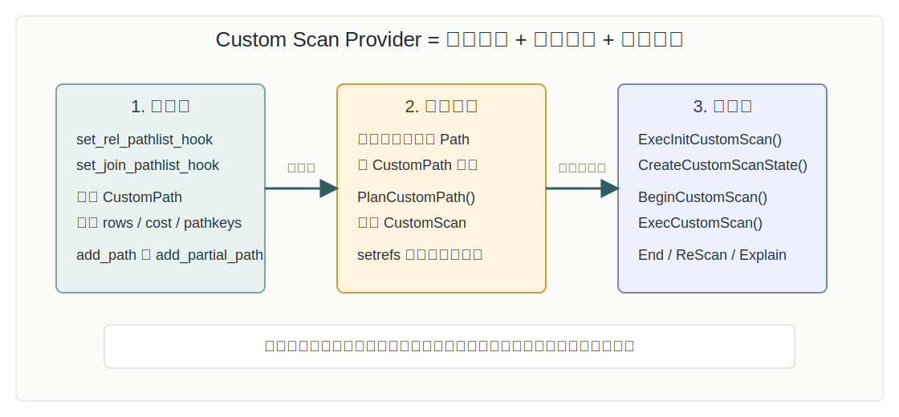
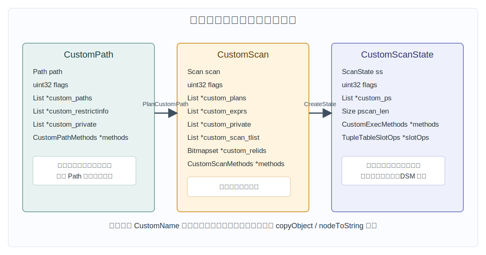
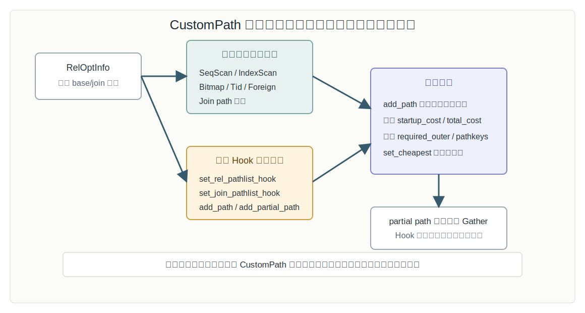
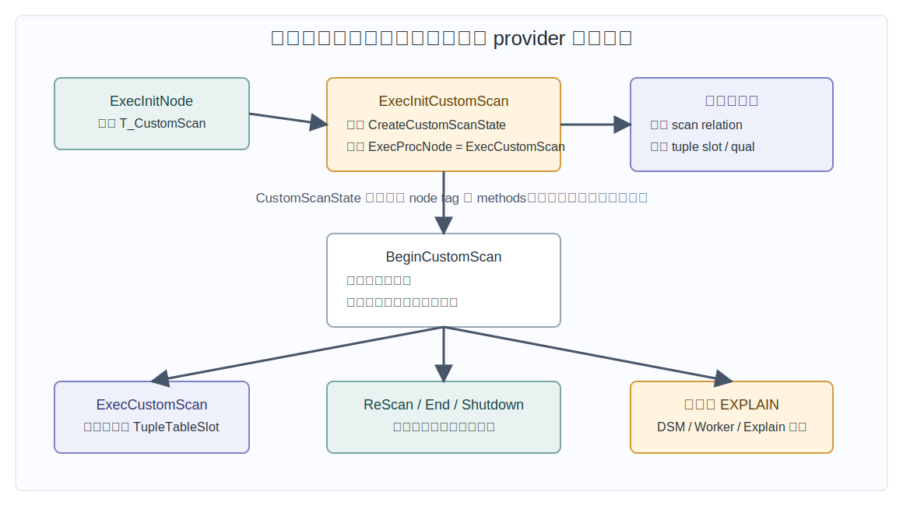
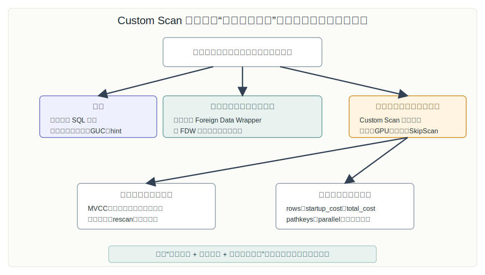

## 数据库筑基课 - 自定义数据 Scan Provider

### 作者
digoal

### 日期
2026-06-08

### 标签
PostgreSQL , 应用开发者 , 数据库筑基课 , 优化器 , 执行器 , Custom Scan , 扩展开发    

----

## 背景
   


这篇属于数据库筑基课里的“优化器 Scan 算法 + 执行器扩展接口”主题。当前项目的 `markdown/` 目录没有发现独立的“数据库筑基课大纲”文件，所以本文不强行引用不存在的大纲；后续如果项目补充课程目录，可以在这里补上链接。

很多数据库优化问题，表面看是“SQL 慢”，底层其实是“现有扫描路径不适合这个 workload”。例如：

- 数据已经在外部缓存、列式块、向量索引或 GPU 显存里，但 PostgreSQL 核心只知道普通 heap/index 扫描。
- 某类 `DISTINCT`、时序 chunk、压缩列存、全文检索或分布式执行，能够用更短路径得到等价结果，但核心优化器没有这个内置算子。
- 扩展想把多个关系的扫描或连接合并成一个执行节点，避免把中间结果拉回 PostgreSQL 再做普通 join。

这时只靠 SQL 改写、索引、统计信息或 GUC 不一定够。PostgreSQL 提供了一个更底层的接口：Custom Scan Provider。它允许扩展在规划期加入自己的 `CustomPath`，如果优化器认为它比核心路径更好，就把它变成 `CustomScan` 计划节点，最后由扩展自己的执行回调产出元组。

本文基于本地 PostgreSQL 源码 `postgres`，重点参考：

- 官方文档 `postgres/doc/src/sgml/custom-scan.sgml`，对应线上文档 [Writing a Custom Scan Provider](https://www.postgresql.org/docs/current/custom-scan.html)。
- 核心接口 `postgres/src/include/nodes/extensible.h`。
- 路径、计划、执行状态结构 `postgres/src/include/nodes/pathnodes.h`、`plannodes.h`、`execnodes.h`。
- 优化器与执行器调用链 `postgres/src/backend/optimizer/path/allpaths.c`、`joinpath.c`、`createplan.c`、`setrefs.c`、`postgres/src/backend/executor/nodeCustom.c`。

开源项目相关 DeepWiki repoName 使用 `postgres/postgres`。本地 DeepWiki CLI 能读取该仓库目录，显示其 Query Processing Pipeline 下包含 Query Planner and JOIN Optimization、Query Execution and Table Commands 等页面；问答结果也把规划与执行的主要源码区域指向 `src/backend/optimizer/plan`、`src/backend/optimizer/path` 和 `src/backend/executor`。本文只把 DeepWiki 用作架构导航，关键结论仍回到本地源码和官方文档校验。

## 一、它解决什么问题？

Custom Scan Provider 解决的是“扩展想给 PostgreSQL 增加一种新的扫描或连接执行方式”的问题。

普通优化手段的边界很清楚：

- 索引能改变访问路径，但索引扫描仍然是 PostgreSQL 核心已知的节点。
- FDW 能扫描外部表，但它主要负责自己的 foreign table，不是任意本地关系。
- table access method 能定义表的物理访问方式，但它绑定表存储，不适合把一个 join、缓存命中、GPU pipeline 或特殊算法伪装成普通表访问。
- planner hook 能影响优化器，但如果没有新的计划节点和执行回调，最终仍要落回核心执行器节点。

Custom Scan 的价值，是把“扩展自己的算法”变成优化器可比较、执行器可调度、`EXPLAIN` 可观察的计划节点。它的典型动机包括官方文档提到的缓存、硬件加速，也包括真实扩展里的列存扫描、SkipScan、PGroonga 自定义全文扫描、Citus 分布式执行节点等。

它牺牲的是实现复杂度和责任边界。扩展作者不只是写一个函数返回数据，还要负责：

- 规划期：正确估算行数、成本、排序能力、并行能力、参数化路径。
- 计划期：把私有数据放进可复制、可序列化或至少可被计划树处理的字段。
- 执行期：遵守快照、MVCC、锁、权限、投影、过滤、rescan、异常清理和并行生命周期。
- 运维期：提供 `EXPLAIN` 信息，让 DBA 能看懂为什么它被选中、实际做了什么。

一句话：Custom Scan Provider 不是“让扩展绕开数据库规则”，而是“让扩展在 PostgreSQL 规则内新增一种可竞争的执行路径”。

## 二、它是什么？

Custom Scan Provider 是 PostgreSQL 给扩展提供的一组规划器 hook、计划节点结构和执行器回调接口。它有三个核心对象：

- `CustomPath`：优化器阶段的候选路径。它和 `SeqScan`、`IndexScan`、`BitmapHeapScan` 等路径一起竞争。
- `CustomScan`：最终计划树里的计划节点。如果 `CustomPath` 被选中，扩展通过 `PlanCustomPath` 把它转换成 `CustomScan`。
- `CustomScanState`：执行器阶段的运行时状态。执行器调用扩展提供的 `BeginCustomScan`、`ExecCustomScan`、`EndCustomScan` 等回调。



图 1 说明：Custom Scan 的生命周期分三段。规划期通过 hook 把 `CustomPath` 加入候选集合；计划生成期只有在它胜出时才调用 `PlanCustomPath`；执行期 PostgreSQL 负责基础框架，真正取下一行由扩展自己的 `ExecCustomScan` 回调完成。

几个容易混淆的点要先分清：

| 机制 | 主要解决什么 | 是否面向任意本地关系 | 是否定义新执行节点 | 典型用途 |
|---|---|---:|---:|---|
| Custom Scan Provider | 新扫描或连接执行方式 | 是 | 是 | 缓存扫描、GPU、列存、SkipScan、分布式执行 |
| Foreign Data Wrapper | 外部数据访问与下推 | 否，主要是 foreign table | 有 `ForeignScan` | 远端数据库、文件、对象存储 |
| Table Access Method | 表存储访问方法 | 绑定该表 AM | 使用表访问 API | heap 之外的新表存储 |
| Index Access Method | 新索引结构 | 通过索引访问表 | 使用索引 AM API | btree、GIN、GiST、BRIN、向量索引 |
| Planner Hint / Hook | 干预计划选择 | 可以 | 通常不新增节点 | 诊断、止血、限制路径空间 |

所以，Custom Scan 不是 FDW 的替代品，也不是 table AM 的替代品。它更像一个“把扩展算法接入优化器和执行器的计划节点接口”。

## 三、核心原理

### 3.1 从 hook 注入候选路径

官方文档说得很直接：实现一个新的 custom scan 通常分三步。第一步是在规划期生成代表新扫描策略的 access path。

基础关系的入口是 `set_rel_pathlist_hook`。本地 `postgres/src/backend/optimizer/path/allpaths.c` 先为普通表、外部表、采样表、函数、VALUES、CTE 等生成核心路径，然后调用：

```c
if (set_rel_pathlist_hook)
    (*set_rel_pathlist_hook) (root, rel, rti, rte);
```

注释也说明，插件可以通过 `add_path()` 或 `add_partial_path()` 加入新路径。注意这里的顺序：core path 先生成，扩展 hook 后执行；如果扩展加入了 partial path，后面的 `generate_useful_gather_paths()` 才有机会基于它生成 `Gather` 或相关并行路径。

连接关系的入口是 `set_join_pathlist_hook`。`postgres/src/backend/optimizer/path/joinpath.c` 在生成 nested loop、merge join、hash join、FDW join path 之后，最后给扩展机会追加 `CustomPath`。官方文档特别强调：如果 custom path 替代的是 join，它必须产生和原 join 等价的输出，并把该 join 使用的 join clauses 放进 `custom_restrictinfo`，供计划转换阶段使用。

### 3.2 `CustomPath` 要像普通 Path 一样参与成本竞争

`CustomPath` 定义在 `postgres/src/include/nodes/pathnodes.h`，核心字段包括：

```c
typedef struct CustomPath
{
    Path        path;
    uint32      flags;
    List       *custom_paths;
    List       *custom_restrictinfo;
    List       *custom_private;
    const struct CustomPathMethods *methods;
} CustomPath;
```

`path` 不是摆设。扩展必须像普通路径一样填写：

- `rows`：估算输出行数。
- `startup_cost`、`total_cost`：启动成本和总成本。
- `pathkeys`：如果能输出有序结果，要表达排序属性。
- `param_info`：如果是参数化路径，要表达外部依赖。
- `parallel_aware`、`parallel_safe` 等并行属性。

`flags` 表示可选能力，定义在 `postgres/src/include/nodes/extensible.h`：

- `CUSTOMPATH_SUPPORT_BACKWARD_SCAN`：支持反向扫描。
- `CUSTOMPATH_SUPPORT_MARK_RESTORE`：支持 mark/restore。
- `CUSTOMPATH_SUPPORT_PROJECTION`：支持在扫描节点内部做投影表达式。

不要低估这些标志。比如上层 `MergeJoin` 可能要求 mark/restore；如果扩展谎称支持，但执行期没有正确实现 `MarkPosCustomScan` 和 `RestrPosCustomScan`，不是慢的问题，而是语义错误或执行错误。



图 2 说明：`CustomPath`、`CustomScan`、`CustomScanState` 分别属于规划期、计划树和执行期。一个重要边界是：`CustomPath` 和 `CustomScanState` 可以作为更大私有结构的第一个字段，但 `CustomScan` 不能，因为计划树可能被 `copyObject` 复制；计划私有数据必须放在 `custom_plans`、`custom_exprs`、`custom_private`、`custom_scan_tlist` 等字段里。

### 3.3 从 `CustomPath` 到 `CustomScan`

如果优化器选择了 `CustomPath`，`postgres/src/backend/optimizer/plan/createplan.c` 会进入 `create_customscan_plan()`：

1. 递归把 `best_path->custom_paths` 里的子 `Path` 转成子 `Plan`。
2. 对 scan clauses 做执行顺序排序。
3. 调用扩展的 `best_path->methods->PlanCustomPath(...)`。
4. 从 `Path` 复制通用成本信息到 `Plan`。
5. 设置 `custom_relids`。
6. 如果是参数化路径，替换 nestloop params。

`CustomPathMethods` 里最关键的回调是：

```c
Plan *(*PlanCustomPath) (PlannerInfo *root,
                         RelOptInfo *rel,
                         CustomPath *best_path,
                         List *tlist,
                         List *clauses,
                         List *custom_plans);
```

扩展通常在这里分配 `CustomScan`，设置：

- `scan.scanrelid`：扫描单表时是 range table index；替代 join 时应为 0。
- `scan.plan.targetlist`、`scan.plan.qual`：目标列和过滤条件。
- `custom_plans`：子计划列表。
- `custom_exprs`：需要 `setrefs.c` 和 `subselect.c` 修正的表达式。
- `custom_private`：只给 provider 使用的私有数据。
- `custom_scan_tlist`：如果输出不是基础表行类型，必须描述真实扫描元组结构；替代 join 时通常必须提供。
- `methods`：指向静态 `CustomScanMethods` 方法表。

`setrefs.c` 的 `set_customscan_references()` 会处理 `CustomScan` 中的 tlist、qual、`custom_exprs` 和 `custom_plans`。这就是为什么表达式类私有数据要放进 `custom_exprs`，而不是随便塞进一个 C 指针。

### 3.4 方法注册和计划反序列化

`postgres/src/backend/nodes/extensible.c` 提供：

```c
void RegisterCustomScanMethods(const CustomScanMethods *methods);
const CustomScanMethods *GetCustomScanMethods(const char *CustomName,
                                              bool missing_ok);
```

内部用 hash table 按 `CustomName` 注册方法表。`postgres/src/backend/nodes/gen_node_support.pl` 生成的节点读写逻辑也依赖 `CustomName`：输出计划节点时写出 `methods->CustomName`，读回时用 `GetCustomScanMethods(custom_name, false)` 找回方法表。

这带来两个工程约束：

- `CustomName` 要稳定、唯一，不能随版本随意改。
- 使用该 `CustomScan` 的扩展必须已经加载并注册方法表，否则计划反序列化时找不到方法。

真实扩展里可以看到类似模式。例如 `pgroonga/src/pgrn-custom-scan.c` 在初始化时保存旧 hook、安装 `set_rel_pathlist_hook`，然后 `RegisterCustomScanMethods(&PGrnScanMethods)`；TimescaleDB 用 `TryRegisterCustomScanMethods()` 避免同名方法重复注册；Citus 会一次注册多个 custom scan 方法表，用于不同分布式执行节点。

### 3.5 优化器如何选择它

Custom Scan 不是“注册了就会执行”。它必须进入路径列表，然后和核心路径一起被成本模型比较。



图 3 说明：`set_rel_pathlist_hook` 和 `set_join_pathlist_hook` 的作用是把扩展路径加入候选集合。`add_path()` 会裁剪明显劣势路径；`set_cheapest()` 会选出最便宜路径。CustomPath 的成本估计如果偏低，会错误压过核心路径；如果偏高，就永远不会被选中。

这也是 Custom Scan 最难的地方：扩展算法可能很快，但如果不能给优化器一个可信的 `rows/startup_cost/total_cost/pathkeys`，它就不能稳定地被正确选择。

例如：

- 列存扫描如果只读少量列，I/O 成本可能低；但如果需要大量随机 tuple reconstruction，CPU 成本可能高。
- GPU 扫描启动成本高，批量吞吐强；小表或高选择性索引查询不一定适合。
- SkipScan 对 `DISTINCT` 或分组前缀很强，但对普通范围扫描可能没有优势。
- 缓存扫描命中时快，失效时可能退化；成本模型必须能表达命中率或降级路径。

### 3.6 执行器如何调用它

执行器入口在 `postgres/src/backend/executor/execProcnode.c`。遇到 `T_CustomScan` 时，调用：

```c
ExecInitCustomScan((CustomScan *) node, estate, eflags)
```

`postgres/src/backend/executor/nodeCustom.c` 做了几件标准工作：

1. 调用 `cscan->methods->CreateCustomScanState(cscan)`，让扩展分配 `CustomScanState`。扩展可以分配一个更大的私有结构，只要 `CustomScanState` 是第一个字段。
2. 设置 `flags`、`plan`、`state`、`ExecProcNode`。
3. 如果 `scan.scanrelid > 0`，打开被扫描 relation。
4. 如果 `custom_scan_tlist` 非空，按它建立扫描 tuple slot；否则用基础表 rowtype。
5. 初始化 result slot、projection 和 qual。
6. 调用扩展的 `BeginCustomScan()` 做最终初始化。

真正取下一行时，核心执行器调用 `ExecCustomScan()`，它只是检查中断并转调：

```c
return node->methods->ExecCustomScan(node);
```



图 4 说明：执行器负责通用框架，例如打开关系、初始化 slot、表达式上下文和投影；provider 负责真正的扫描状态和取数逻辑。`ExecCustomScan` 必须返回填好的 `TupleTableSlot`；没有更多行时返回 `NULL` 或空 slot。资源释放、重复扫描、提前 shutdown、并行 DSM 和 `EXPLAIN` 也都要按回调契约实现。

`CustomExecMethods` 的必选回调包括：

- `BeginCustomScan`
- `ExecCustomScan`
- `EndCustomScan`
- `ReScanCustomScan`

可选回调包括：

- `MarkPosCustomScan`、`RestrPosCustomScan`：只有声明支持 mark/restore 时才需要。
- `EstimateDSMCustomScan`、`InitializeDSMCustomScan`、`ReInitializeDSMCustomScan`、`InitializeWorkerCustomScan`、`ShutdownCustomScan`：并行执行相关。
- `ExplainCustomScan`：向 `EXPLAIN` 输出自定义信息。

并行部分尤其容易踩坑。`postgres/src/backend/executor/execParallel.c` 只有在 plan node `parallel_aware` 时才会调用 custom scan 的 DSM 估算、初始化、worker 初始化和重新初始化逻辑。如果扩展只是把 path 标成 parallel aware，却没有正确设计共享状态和 worker 本地状态，结果可能是重复扫描、漏扫或资源泄漏。

## 四、横向对比

| 维度 | Custom Scan Provider | FDW | Table Access Method | Index Access Method | 普通 Planner Hook |
|---|---|---|---|---|---|
| 主要目标 | 新增扫描或连接执行节点 | 访问外部数据源 | 定义表存储访问方式 | 定义索引结构与索引扫描 | 干预规划流程 |
| 作用对象 | 本地关系、join relation，也可包装子计划 | foreign table 或远端 join | 使用该 AM 的表 | 使用该 AM 的索引 | 优化器内部状态 |
| 是否参与成本竞争 | 是，以 `CustomPath` 参与 | 是，以 `ForeignPath` 参与 | 间接参与表扫描路径 | 间接参与索引路径 | 取决于 hook 做法 |
| 是否新增计划节点 | 是，`CustomScan` | 是，`ForeignScan` | 通常不是新 plan node | 通常不是新 plan node | 通常不新增 |
| 私有执行逻辑 | `CustomExecMethods` | FDW routine | table AM routine | index AM routine | 通常无独立执行节点 |
| 典型优势 | 可替代复杂扫描/连接 pipeline | 远端访问和下推 | 新表存储布局 | 新索引搜索能力 | 快速影响优化器 |
| 主要风险 | 语义等价、成本估计、生命周期复杂 | 远端事务、下推语义、网络成本 | 存储兼容和 MVCC 边界 | 选择性估算、维护成本 | 易变、隐式、可观测性差 |
| 不适合场景 | 只是想改一个计划选择 | 扫描的不是外部数据 | 只想加一个执行算法 | 不需要新索引结构 | 需要长期稳定可观察节点 |

核心区别在于：Custom Scan 的中心是“计划节点 + 执行回调”。如果你只需要访问外部表，FDW 更合适；如果你要定义表怎么存，table AM 更合适；如果你要定义索引怎么搜索，index AM 更合适；如果你只是临时影响优化器选择，planner hook 或 hint 更轻。

## 五、效果如何？

Custom Scan 的效果不能用固定性能数字概括，因为它只是一个接口，收益来自扩展实现。可观察的收益通常包括：

- 少读数据：列存、压缩块、分区 chunk 或缓存扫描减少 heap/page 访问。
- 少走中间层：把多个扫描、过滤、聚合或 join 合并到一个节点。
- 硬件加速：把适合批处理的过滤、表达式、聚合放到 GPU 或专用设备。
- 特殊算法：例如 SkipScan 避免把所有重复 key 都扫出来再去重。
- 分布式执行：把本地计划节点变成远端任务调度、结果合并或延迟错误节点。

代价也同样具体：

- 计划不稳定：成本估计差会导致它该用不用、不该用乱用。
- 语义风险：快照、可见性、权限、锁、触发器语义、连接输出列、NULL 处理，只要一处不一致就是错误结果。
- 版本维护成本：规划器、执行器、节点结构、setrefs 逻辑都可能随 PostgreSQL 主版本变化。
- 可观测性压力：如果 `EXPLAIN` 不输出关键私有信息，DBA 很难判断它做了什么。
- 并行复杂度：DSM 协调、worker 状态、rescan、提前 shutdown 都要严谨处理。

因此，Custom Scan 的收益不是“扩展天然更快”，而是“扩展能把某个 workload 的物理执行路径表达得比核心节点更贴近真实代价”。

## 六、实操 DEMO

当前任务是写文章，没有在本机编译 PostgreSQL 或自定义扩展；下面给出未执行的最小验证路径，不伪造 `EXPLAIN` 输出。Custom Scan 的真实 DEMO 通常需要一个 C 扩展，而不是几条纯 SQL。

### 6.1 最小实验目标

一个最小 Custom Scan 扩展应该能做到：

1. `_PG_init()` 注册 `CustomScanMethods`，并安装 `set_rel_pathlist_hook`。
2. hook 中识别目标表或目标查询形态，构造一个 `CustomPath`，通过 `add_path()` 加入 `RelOptInfo`。
3. `PlanCustomPath()` 返回 `CustomScan`。
4. `CreateCustomScanState()` 返回带有 `CustomExecMethods` 的 `CustomScanState`。
5. `ExecCustomScan()` 产出与被替代扫描等价的 `TupleTableSlot`。
6. `EXPLAIN` 能看到类似 `Custom Scan (YourName)` 的节点名称。

### 6.2 扩展骨架

下面是结构骨架，不是完整可编译扩展。它用于说明字段和回调位置，真正实现时还必须补齐 memory context、snapshot、slot 填充、qual/projection、hook 链式调用、错误清理和 build system。

```c
static set_rel_pathlist_hook_type prev_set_rel_pathlist_hook = NULL;

static Plan *demo_plan_custom_path(PlannerInfo *root,
                                   RelOptInfo *rel,
                                   CustomPath *best_path,
                                   List *tlist,
                                   List *clauses,
                                   List *custom_plans);

static Node *demo_create_custom_scan_state(CustomScan *cscan);

static CustomPathMethods demo_path_methods = {
    .CustomName = "DemoScan",
    .PlanCustomPath = demo_plan_custom_path,
};

static CustomScanMethods demo_scan_methods = {
    .CustomName = "DemoScan",
    .CreateCustomScanState = demo_create_custom_scan_state,
};

void
_PG_init(void)
{
    RegisterCustomScanMethods(&demo_scan_methods);
    prev_set_rel_pathlist_hook = set_rel_pathlist_hook;
    set_rel_pathlist_hook = demo_set_rel_pathlist;
}
```

规划期 hook 的关键不是“把路径塞进去”，而是“只在适合的关系上加入成本可信的路径”：

```c
static void
demo_set_rel_pathlist(PlannerInfo *root, RelOptInfo *rel,
                      Index rti, RangeTblEntry *rte)
{
    CustomPath *cpath;

    if (prev_set_rel_pathlist_hook)
        prev_set_rel_pathlist_hook(root, rel, rti, rte);

    if (rte->rtekind != RTE_RELATION)
        return;

    cpath = makeNode(CustomPath);
    cpath->path.pathtype = T_CustomScan;
    cpath->path.parent = rel;
    cpath->path.rows = rel->rows;
    cpath->path.startup_cost = 0;
    cpath->path.total_cost = rel->rows;
    cpath->flags = 0;
    cpath->custom_paths = NIL;
    cpath->custom_restrictinfo = NIL;
    cpath->custom_private = NIL;
    cpath->methods = &demo_path_methods;

    add_path(rel, (Path *) cpath);
}
```

计划期要返回 `CustomScan`，并把需要后续修正的表达式放到正确字段：

```c
static Plan *
demo_plan_custom_path(PlannerInfo *root, RelOptInfo *rel,
                      CustomPath *best_path, List *tlist,
                      List *clauses, List *custom_plans)
{
    CustomScan *cscan = makeNode(CustomScan);

    cscan->scan.scanrelid = rel->relid;
    cscan->scan.plan.targetlist = tlist;
    cscan->scan.plan.qual = clauses;
    cscan->flags = best_path->flags;
    cscan->custom_plans = custom_plans;
    cscan->custom_exprs = NIL;
    cscan->custom_private = best_path->custom_private;
    cscan->custom_scan_tlist = NIL;
    cscan->methods = &demo_scan_methods;

    return (Plan *) cscan;
}
```

执行期最小接口长这样：

```c
typedef struct DemoScanState
{
    CustomScanState css;
    /* provider 私有状态 */
} DemoScanState;

static CustomExecMethods demo_exec_methods = {
    .CustomName = "DemoScan",
    .BeginCustomScan = demo_begin,
    .ExecCustomScan = demo_exec,
    .EndCustomScan = demo_end,
    .ReScanCustomScan = demo_rescan,
    .ExplainCustomScan = demo_explain,
};

static Node *
demo_create_custom_scan_state(CustomScan *cscan)
{
    DemoScanState *state = palloc0(sizeof(DemoScanState));

    NodeSetTag(&state->css, T_CustomScanState);
    state->css.methods = &demo_exec_methods;
    return (Node *) state;
}
```

如果扩展被正确加载、hook 命中，并且成本模型让 `CustomPath` 胜出，`EXPLAIN` 的节点名由 `postgres/src/backend/commands/explain.c` 生成，形态会是：

```text
Custom Scan (DemoScan) on ...
```

这里不写具体执行计划输出，因为上面的代码不是完整扩展，也未在当前环境编译执行。

### 6.3 验证清单

真正做实验时，不要只看节点有没有出现。至少验证：

- `EXPLAIN (ANALYZE, BUFFERS, VERBOSE)` 中估算行数和实际行数是否偏离可接受范围。
- 与被替代的核心扫描或 join 在结果集上是否完全一致。
- `WHERE` 过滤、投影表达式、NULL、排序、LIMIT、并行、rescan 是否正确。
- 在事务隔离级别、并发 UPDATE/DELETE、长事务和 VACUUM 场景下是否遵守 MVCC。
- 错误路径是否释放资源，提前结束时 `ShutdownCustomScan` 和 `EndCustomScan` 是否能兜底。

## 七、最佳实践

### 面向数据库架构师

先判断问题是否真的需要 Custom Scan。只要索引、SQL 改写、统计信息、FDW、table AM 或 index AM 能自然表达，就不要用 Custom Scan 增加内核级维护成本。Custom Scan 适合“新执行算法”或“新执行 pipeline”，不是修补普通 SQL 性能问题的首选工具。

设计阶段要明确三件事：

- 等价语义：替代的是单表扫描、子计划包装，还是整个 join？
- 成本模型：什么条件下比核心路径更优？如何估计命中率、I/O、CPU、启动成本和并行收益？
- 降级路径：不适合时是否让核心路径自然胜出？执行期失败是否能安全退化或报错？

### 面向 DBA

看到 `Custom Scan (xxx)` 时，不要只问“为什么用了扩展节点”，要问：

- 它处理了哪些 relation？看 `custom_relids` 对应的表范围。
- 它有没有子计划？`EXPLAIN` 是否展示 children。
- 它是否并行？worker 是否扫描重复范围。
- 它的过滤条件、返回行数、buffer 访问和执行时间是否合理。
- 是否存在扩展版本升级后计划形态突变。

生产排障时，建议保留一组开关或成本参数，让 DBA 能临时禁止该 custom path，观察核心路径作为对照。没有对照组，就很难判断问题来自扩展实现、成本模型，还是数据变化。

### 面向业务开发者

业务侧不应该依赖“某条 SQL 一定出现 Custom Scan”。Custom Scan 是优化器选择结果，不是 SQL 语义的一部分。应用开发者应该关注：

- SQL 是否表达了清晰过滤条件和连接条件。
- 是否使用了扩展能识别的查询形态，例如特定全文检索、时序查询、`DISTINCT` 前缀、列存过滤。
- 结果正确性是否和普通路径一致，而不是只比较延迟。
- 扩展禁用或升级时，应用是否仍能得到正确结果。



图 5 说明：Custom Scan 只有在“确实要替换扫描或连接执行方式”时才值得评估。外部数据优先 FDW，存储布局优先 table AM，索引搜索优先 index AM，普通计划控制优先统计信息、SQL、索引或 planner hook。进入生产前必须同时证明语义等价、成本可信和生命周期可控。

## 八、适合与不适合场景

适合场景：

- 扩展能用专门算法扫描任意本地关系，并且比核心节点少读、少算或少传输。
- 需要把多个关系的处理合并成一个自定义 join/scan 节点，核心 join 节点无法表达真实执行路径。
- 有硬件加速、列存、压缩块、缓存、时序 chunk、全文检索、分布式执行等明确物理优势。
- 查询形态稳定，provider 能可靠识别并估算成本。
- 团队有能力维护 PostgreSQL 主版本升级带来的 planner/executor API 变化。

不适合场景：

- 只是想强制某条 SQL 走索引或换 join 方法。这更像 planner hint、统计信息或 SQL/索引治理。
- 只是要访问外部数据源。FDW 更直接。
- 只是要新增一种索引。Index AM 更合适。
- 只是要新增表存储。Table AM 更合适。
- 无法证明与核心扫描结果等价，尤其在 MVCC、并发更新、事务隔离和 rescan 场景下。
- 没有可信成本模型，只想通过低报成本强行抢计划。

## 九、常见坑

1. 低报成本，导致 CustomPath 抢走不该抢的计划。

   这是最常见也最危险的问题。优化器相信你填的 `startup_cost`、`total_cost` 和 `rows`。如果扩展为了“更容易被选中”故意低报成本，短期看节点出现了，长期会造成错误计划扩散。

2. 把 C 指针塞进计划树。

   `CustomScan` 是计划树节点，计划树会被复制、输出、读回。官方文档明确说 provider 不能用更大的结构嵌入 `CustomScan`，计划数据要放在 custom 字段里，并且字段内容要能被相关节点处理。运行时指针应该放到 `CustomScanState`，不是 `CustomScan`。

3. 混淆 `custom_exprs` 和 `custom_private`。

   需要 `setrefs.c`、`subselect.c` 修正的表达式应放进 `custom_exprs`。如果表达式藏在 `custom_private` 里，变量引用、参数替换、子查询处理可能失效。

4. 替代 join 时忘记 `scan.scanrelid = 0` 和 `custom_scan_tlist`。

   单表扫描和 join replacement 的语义不同。官方文档要求：扫描单个关系时 `scan.scanrelid` 是表的 range table index；替代 join 时应为 0。替代 join 通常还要提供真实输出 tuple 的 target list。

5. 声明支持 mark/restore，却没有实现。

   `nodeCustom.c` 中如果上层要求 mark/restore，而 provider 没有对应回调，会报 `custom scan "%s" does not support MarkPos`。更糟的是实现了但语义不对，可能造成重复行、漏行或 join 错误。

6. 并行扫描重复或漏扫。

   parallel-aware custom scan 必须设计 DSM 协调结构。leader 初始化共享状态，worker 基于共享状态取任务，rescan 时共享和本地状态都要正确重置。

7. `EXPLAIN` 输出太少。

   `Custom Scan (Name)` 只能告诉 DBA 节点类型。好的 provider 应该通过 `ExplainCustomScan` 输出扫描范围、命中条件、下推过滤、缓存命中、远端任务、chunk 数量、设备信息等关键事实。

8. 没有 hook 链式调用。

   多个扩展可能同时安装 `set_rel_pathlist_hook`。常见做法是保存 previous hook，并在自己的 hook 中先调用或按设计调用它。直接覆盖会让其他扩展失效。

9. 忽略扩展加载和方法注册顺序。

   节点读写逻辑依赖 `CustomName` 找回 `CustomScanMethods`。如果计划需要反序列化，而对应扩展尚未注册方法表，会直接失败。

## 十、扩展问题

1. 如果一个扩展既能通过 FDW 远端下推，又能通过 Custom Scan 包装本地执行，应该如何划分两者边界？

2. Custom Scan 替代 join 时，如何证明输出列、NULL 扩展、外连接语义和 join qual 处理完全一致？

3. 一个 GPU Custom Scan 的成本模型应该如何表达启动成本、批量大小、PCIe 传输、选择性和表达式复杂度？

4. 如果 Custom Scan 使用缓存，缓存命中率应该作为 planner 成本输入、executor 运行时判断，还是两者都需要？

5. parallel-aware Custom Scan 如何避免多个 worker 重复扫描同一个块、chunk 或远端 shard？

6. 扩展升级后 `CustomName`、`custom_private` 编码和计划反序列化如何保持兼容？

## 十一、扩展阅读

- PostgreSQL 官方文档：[Writing a Custom Scan Provider](https://www.postgresql.org/docs/current/custom-scan.html)。
- DeepWiki：`postgres/postgres`，重点看 Query Processing Pipeline、Query Planner and JOIN Optimization、Query Execution and Table Commands；本次用它确认规划/执行源码区域，再用本地源码细化 Custom Scan 机制。
- 本地文档：`postgres/doc/src/sgml/custom-scan.sgml`。
- 核心接口：`postgres/src/include/nodes/extensible.h`。
- 路径结构：`postgres/src/include/nodes/pathnodes.h` 中 `CustomPath`。
- 计划结构：`postgres/src/include/nodes/plannodes.h` 中 `CustomScan`。
- 执行状态：`postgres/src/include/nodes/execnodes.h` 中 `CustomScanState`。
- 方法注册：`postgres/src/backend/nodes/extensible.c`。
- base relation hook：`postgres/src/backend/optimizer/path/allpaths.c`。
- join relation hook：`postgres/src/backend/optimizer/path/joinpath.c`。
- Path 到 Plan 转换：`postgres/src/backend/optimizer/plan/createplan.c` 中 `create_customscan_plan()`。
- setrefs 处理：`postgres/src/backend/optimizer/plan/setrefs.c` 中 `set_customscan_references()`。
- 执行器实现：`postgres/src/backend/executor/nodeCustom.c`。
- EXPLAIN 输出：`postgres/src/backend/commands/explain.c` 中 `Custom Scan` 分支和 `ExplainCustomChildren()`。
- 并行执行：`postgres/src/backend/executor/execParallel.c` 中 `CustomScanState` 分支。
- 工作区实践案例：`pgroonga/src/pgrn-custom-scan.c`、`timescaledb/tsl/src/nodes/skip_scan/planner.c`、`citus/src/backend/distributed/executor/citus_custom_scan.c`。
  
## 附录 
1、克隆代码  
```  
git clone --depth 1 https://github.com/postgres/postgres
```  
  
2、启用 codex, 使用 [数据库筑基课 skill](../skills/README.md).  
```
文章标题: 
  数据库筑基课 - 自定义数据 Scan Provider
项目源码(本地目录): 
  postgres
项目 codebase 文件名: 
  postgres/CLAUDE.md 
开源项目相关的 deepwiki repoName: 
  postgres/postgres
```


    
#### [PostgreSQL 解决方案集合](../201706/20170601_02.md "40cff096e9ed7122c512b35d8561d9c8")
  
  
#### [德哥 / digoal's Github - 公益是一辈子的事.](https://github.com/digoal/blog/blob/master/README.md "22709685feb7cab07d30f30387f0a9ae")
  
  
#### [About 德哥](https://github.com/digoal/blog/blob/master/me/readme.md "a37735981e7704886ffd590565582dd0")
  
  

  
