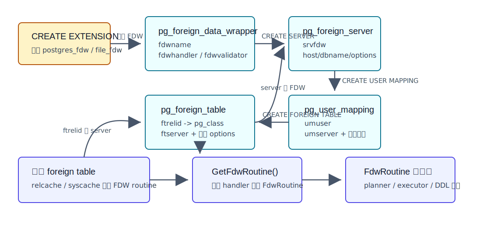
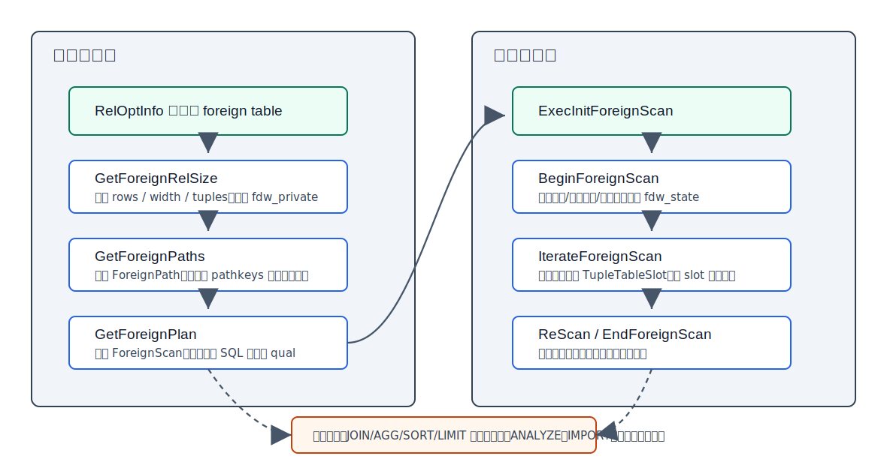
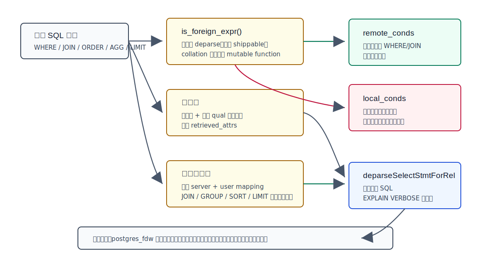
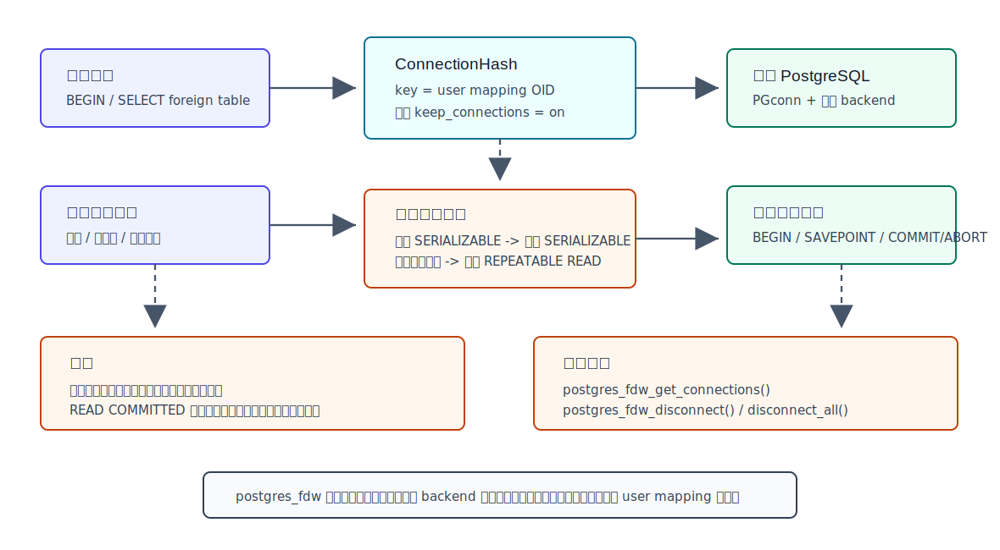
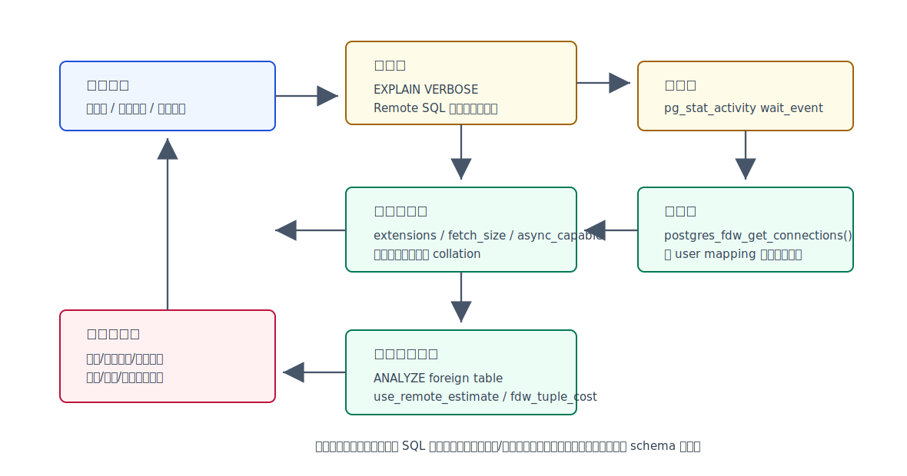

## 数据库筑基课 - FDW

### 作者
digoal

### 日期
2026-06-08

### 标签
PostgreSQL , 应用开发者 , 数据库筑基课 , FDW , SQL/MED , postgres_fdw , 优化器 , 执行器    

----

## 背景
   


这篇属于数据库筑基课里的“执行器接口 + 场景实践 + 跨库访问边界”主题。FDW 不是一个简单的“跨库查询功能”，而是 PostgreSQL 把外部数据源包装成关系表、交给优化器估价、交给执行器扫描或修改、并让 DBA 可以用 SQL DDL 管理连接与权限的一套扩展接口。

本地 `markdown/` 目录没有发现独立的“数据库筑基课大纲”文件，所以本文不强行引用不存在的大纲；后续如果项目补充课程目录，可以在这里补上链接。

业务上最常见的 FDW 诉求有三类：

1. 跨 PostgreSQL 实例做联邦查询，例如在一个分析库里访问多个业务库的少量维表。
2. 把文件、对象存储、外部系统、搜索引擎或其他数据库暴露成 SQL 表，降低应用侧集成成本。
3. 在迁移、拆库、冷热分层、临时数据校验场景里，用 SQL 统一访问本地和远端数据。

FDW 的价值是“把外部数据接入 PostgreSQL 的优化器和执行器生态”。它的代价也同样明确：网络、远端事务、统计信息失真、表达式语义差异、连接数放大和故障域扩散都会进入本地查询路径。把 FDW 当成本地表用，是很多生产事故的起点。

## 一、它解决什么问题？

没有 FDW 时，应用访问外部数据通常有几种做法：

- 应用自己连多个数据源，再在应用内 join、过滤、排序。
- 定时 ETL，把外部数据复制到本地表。
- 使用 `dblink` 这类函数式接口，把远端 SQL 当字符串执行。
- 为每种外部系统写一套专用同步或查询服务。

这些方式都能工作，但问题很明显：

- 优化器不知道外部数据源的行数、列宽、过滤条件和远端能力。
- SQL 权限、对象依赖、DDL 生命周期和审计边界不统一。
- 应用侧跨库 join 容易把大量数据拉到应用内存。
- 字符串 SQL 不容易和本地表、视图、权限、执行计划诊断组合。

FDW 把问题转换成“外部数据源如何向 PostgreSQL 声明自己的扫描、估价、下推、写入和维护能力”。从内核角度看，外部数据源不需要变成本地 heap，也不需要实现一个完整 table access method；它只要实现 `FdwRoutine` 中的一组回调，告诉优化器和执行器：

- 这张外部表大约有多少行，扫描要多少钱。
- 哪些条件、join、聚合、排序、limit 可以交给外部系统。
- 执行时如何一批批取回 tuple。
- 如果支持写入，如何 insert、update、delete、truncate。
- 如果支持维护，如何 `ANALYZE`、`IMPORT FOREIGN SCHEMA`、解释 `EXPLAIN` 附加信息。

牺牲的代价是：查询从单机数据库内部路径变成“本地优化器 + FDW 扩展 + 外部系统”的协作路径。任何一段估错、慢了、语义不一致、权限变了，都会影响最终 SQL。

## 二、它是什么？

FDW 是 Foreign Data Wrapper 的缩写，来自 SQL/MED 思路。PostgreSQL 官方文档说明，所有 foreign table 操作都通过它所属的 FDW 处理；FDW 负责从远端数据源取数并返回给 PostgreSQL executor，如果支持更新，也要处理外部表更新。

一个简洁定义：

> FDW 是 PostgreSQL 用 SQL 对象描述外部数据源、用 `FdwRoutine` 回调表把外部数据源接入优化器和执行器的扩展机制。

FDW 由两部分组成：

- 元数据对象：`FOREIGN DATA WRAPPER`、`SERVER`、`USER MAPPING`、`FOREIGN TABLE`。
- 运行时接口：FDW handler 返回的 `FdwRoutine`，里面是一组 planner、executor、DDL、ANALYZE、EXPLAIN、异步和并行相关回调。



图 1 说明：`pg_foreign_data_wrapper` 记录 FDW 名称、handler、validator；`pg_foreign_server` 记录某个远端服务及其 FDW；`pg_user_mapping` 记录本地用户到远端认证信息的映射；`pg_foreign_table` 把本地 `pg_class` 里的 foreign table 关联到 foreign server。执行查询时，PostgreSQL 通过 foreign table 找 server，再找 FDW handler，最后拿到 `FdwRoutine`。

几个关键概念要分清：

| 概念 | 作用 | 典型例子 |
|---|---|---|
| FDW extension | 提供 handler、validator 和实现代码 | `postgres_fdw`、`file_fdw` |
| foreign server | 一个外部服务实例或数据源配置 | 远端 PostgreSQL 主机、端口、数据库名 |
| user mapping | 本地用户到外部认证信息的映射 | 远端用户名、密码、证书选项 |
| foreign table | 本地 SQL 表对象，描述远端对象的列和选项 | `CREATE FOREIGN TABLE ft (...) SERVER s OPTIONS (...)` |
| `FdwRoutine` | FDW 能力表，供优化器/执行器调用 | `GetForeignPaths`、`IterateForeignScan` |

## 三、核心原理

### 3.1 catalog 如何把 SQL 对象串起来

源码里四张核心 catalog 分别定义在：

- `src/include/catalog/pg_foreign_data_wrapper.h`
- `src/include/catalog/pg_foreign_server.h`
- `src/include/catalog/pg_user_mapping.h`
- `src/include/catalog/pg_foreign_table.h`

`pg_foreign_data_wrapper` 里最关键的是 `fdwhandler` 和 `fdwvalidator`。handler 必须返回伪类型 `fdw_handler`，实际返回值是一个 `FdwRoutine` 指针。validator 负责校验 `CREATE` / `ALTER` 时传入 FDW、server、user mapping、foreign table、foreign column 的 options；如果不提供 validator，创建或修改对象时不会检查这些 options。

`CreateForeignTable()` 位于 `src/backend/commands/foreigncmds.c`。它在普通 `DefineRelation()` 创建 `pg_class` 记录之后，再往 `pg_foreign_table` 插入 `ftrelid`、`ftserver` 和表级 options，并记录 foreign table 对 foreign server 的依赖。也就是说，foreign table 首先仍是一个 PostgreSQL relation，只是 `relkind` 和访问路径不同。

运行时，`src/backend/foreign/foreign.c` 提供了查找入口：

- `GetForeignServer()` / `GetForeignTable()` / `GetUserMapping()` 从 syscache 读取元数据。
- `GetFdwRoutineByRelId()` 通过 foreign table 找 server，再找 FDW handler。
- `GetFdwRoutineForRelation()` 会把 `FdwRoutine` 缓存在 relcache 中，避免反复 catalog lookup。
- `GetFdwRoutine()` 直接调用 handler，并检查返回值必须是 `FdwRoutine`。

### 3.2 `FdwRoutine` 是 FDW 的能力表

`src/include/foreign/fdwapi.h` 定义了 `FdwRoutine`。官方文档明确说，scan 相关函数是必需的，其余是可选的。当前源码中的能力面已经很宽：

- 扫描：`GetForeignRelSize`、`GetForeignPaths`、`GetForeignPlan`、`BeginForeignScan`、`IterateForeignScan`、`ReScanForeignScan`、`EndForeignScan`。
- join 下推：`GetForeignJoinPaths`。
- upper relation 下推：`GetForeignUpperPaths`，用于聚合、排序、limit 等 scan/join 之后的处理。
- 写入：`PlanForeignModify`、`BeginForeignModify`、`ExecForeignInsert`、`ExecForeignBatchInsert`、`ExecForeignUpdate`、`ExecForeignDelete` 等。
- 直接修改：`PlanDirectModify`、`BeginDirectModify`、`IterateDirectModify`、`EndDirectModify`。
- 行锁和 EPQ：`GetForeignRowMarkType`、`RefetchForeignRow`、`RecheckForeignScan`。
- 维护与 DDL：`AnalyzeForeignTable`、`ImportForeignStatistics`、`ImportForeignSchema`、`ExecForeignTruncate`。
- 诊断与并发：`ExplainForeignScan`、`IsForeignScanParallelSafe`、异步执行相关回调。

`postgres_fdw_handler()` 在 `contrib/postgres_fdw/postgres_fdw.c` 中填满了大量回调，所以它是一个“完整型 FDW”参考实现；`file_fdw_handler()` 在 `contrib/file_fdw/file_fdw.c` 中只实现扫描、解释、分析和并行安全判断等较小能力，所以它是理解最小 FDW 的好例子。

### 3.3 优化器如何规划 foreign scan

对 foreign table 做 `SELECT` 时，优化器主线是：

1. 识别 base relation 是 foreign table。
2. 调用 FDW 的 `GetForeignRelSize()`，让 FDW 填充行数、宽度、私有 planning 状态。
3. 调用 `GetForeignPaths()`，让 FDW 生成一个或多个 `ForeignPath`，并通过 `add_path()` 放进路径竞争。
4. 最优路径确定后，调用 `GetForeignPlan()`，生成 `ForeignScan` plan node。



图 2 说明：优化器阶段的回调产出估算、路径和计划；执行器阶段的回调负责初始化外部资源、逐行或分批返回 tuple、重扫和结束清理。FDW 的关键工程难度在于：优化器阶段做出的“远端能执行什么、成本是多少”的判断，必须和执行器阶段真正发送的远端请求一致。

以 `postgres_fdw` 为例，`postgresGetForeignRelSize()` 会：

- 读取 foreign table 和 server 元数据。
- 应用 server/table options，例如 `use_remote_estimate`、`fetch_size`、`async_capable`。
- 用 `classifyConditions()` 把 restriction quals 分成 `remote_conds` 和 `local_conds`。
- 识别需要从远端取回的列：最终输出列、join 需要的列、本地过滤条件需要的列。
- 如果 `use_remote_estimate` 为 true，则连接远端执行 `EXPLAIN` 获取远端估算；否则依赖本地统计信息。

`postgresGetForeignPaths()` 会创建最基础的 `ForeignPath`，这个路径类似本地表的 seq scan，但远端实际可能使用索引。它还可以添加有 pathkeys 的路径，以及在 `use_remote_estimate` 打开时为可下推 join clause 构造 parameterized path。

`postgresGetForeignPlan()` 最终会把远端表达式、本地表达式、远端 SQL、取回列列表、`fetch_size` 等放入 `ForeignScan`。其中远端 SQL 由 `deparseSelectStmtForRel()` 生成；`EXPLAIN VERBOSE` 可以看到实际发送给远端的 SQL。

### 3.4 执行器如何从外部数据源取 tuple

执行阶段入口在 `src/backend/executor/nodeForeignscan.c`：

- `ExecInitForeignScan()` 打开 foreign table relation，取得 `FdwRoutine`，初始化 slot、projection、qual，然后调用 `BeginForeignScan()`。
- `ExecForeignScan()` 使用通用 `ExecScan()` 框架，每次通过 `ForeignNext()` 调 FDW 的 `IterateForeignScan()`。
- `IterateForeignScan()` 返回 `TupleTableSlot`。空 slot 表示没有更多数据。
- `ExecReScanForeignScan()` 调用 `ReScanForeignScan()`，用于参数变化后的重扫。
- `ExecEndForeignScan()` 调用 `EndForeignScan()` 释放外部资源。

这里有一个内核约束：`IterateForeignScan()` 是在短生命周期 per-tuple memory context 中调用的。官方 FDW 文档提醒，如果 FDW 需要跨调用保存状态，应在 `BeginForeignScan()` 创建较长生命周期的 memory context，或使用执行器 query context。

`file_fdw` 展示了最直观的执行模型：`fileBeginForeignScan()` 根据 foreign table options 创建 `CopyFromState`，`fileIterateForeignScan()` 每次调用 `NextCopyFrom()` 从文件或程序输出读取下一行，并填充 scan slot。它没有远端 pushdown 能力，所有 `scan_clauses` 都作为本地 qual 由 PostgreSQL executor 检查。

`postgres_fdw` 更复杂：`postgresBeginForeignScan()` 会根据 user mapping 获取远端连接，生成 cursor id，取出 planner 阶段保存的远端 SQL、取回列、`fetch_size`，准备参数表达式；`postgresIterateForeignScan()` 在第一次取数时创建远端 cursor，之后按 `fetch_size` 分批 fetch，转换为本地 tuple。

### 3.5 下推：FDW 的性能分水岭

FDW 性能好不好，核心看两件事：

1. 能不能把过滤、join、聚合、排序、limit 推给外部系统。
2. 本地优化器对远端结果规模和成本估得准不准。

`postgres_fdw` 的下推逻辑在 `contrib/postgres_fdw/deparse.c` 和 `postgres_fdw.c`。`classifyConditions()` 对每个条件调用 `is_foreign_expr()`。一个表达式要被认为适合远端执行，至少要满足：

- 表达式节点能被 FDW deparse 成远端 SQL。
- 类型、函数、操作符是 shippable 的：内置对象，或配置在 foreign server `extensions` 选项中且两端兼容的扩展对象。
- collation 安全，不能把本地排序规则语义错误地交给远端解释。
- 不能包含非 `IMMUTABLE` 函数。源码函数名叫 `contain_mutable_functions()`，实际判断是 `func_volatile(func_id) != PROVOLATILE_IMMUTABLE`；因此 `STABLE` 的 `now()` 也会被挡住。源码注释以 `now()` 为例：发送到远端可能因时钟差异引入混乱。



图 3 说明：`postgres_fdw` 会把条件分成 `remote_conds` 和 `local_conds`。能安全下推的条件进入远端 SQL，减少传输行数；不能安全下推的条件留在本地 executor 检查。列裁剪则决定 `retrieved_attrs`，避免取回无关列。JOIN、GROUP、SORT、LIMIT 等更高层下推，还要满足同一 server、user mapping、表达式安全等额外条件。

官方文档也强调，`postgres_fdw` 只会在降低误执行风险的前提下下推：默认只考虑内置函数和操作符；非内置函数和操作符必须来自 `extensions` 选项列出的扩展，且需要是 `IMMUTABLE`。这是正确性优先的设计。

### 3.6 连接和事务不是透明的

`postgres_fdw` 的连接管理在 `contrib/postgres_fdw/connection.c`。它不是全局连接池，而是每个本地 backend 维护自己的连接缓存。缓存 key 是 user mapping OID，不是单纯的 foreign server OID。源码注释说明，这样能保证同一查询中的多个 scan 使用同一 snapshot，也避免 PUBLIC mapping 场景下创建重复连接。

默认情况下，`postgres_fdw` 建立到 foreign server 的连接后，会在本地 session 中保留以便复用；`keep_connections` 可以控制事务结束后是否关闭。PostgreSQL 也提供 `postgres_fdw_get_connections()`、`postgres_fdw_disconnect()`、`postgres_fdw_disconnect_all()` 观察和断开连接。



图 4 说明：一个本地 backend 会按 user mapping 缓存远端连接；远端事务跟随本地事务打开、提交或回滚，远端 savepoint 跟随本地子事务层级。这个模型保证一条本地查询中多次远端扫描的快照一致，但也意味着远端连接数会随本地连接数、user mapping 数和并发事务放大。

事务隔离是另一个边界。官方文档说明：本地事务是 `SERIALIZABLE` 时，远端事务也是 `SERIALIZABLE`；否则远端使用 `REPEATABLE READ`。这样能保证一次查询涉及多个远端扫描时结果一致。副作用是，本地 `READ COMMITTED` 事务里连续访问同一个远端事务，可能看不到远端其他事务后来提交的数据。这对习惯“每条语句一个新快照”的应用来说容易意外。

当前官方文档还说明，`postgres_fdw` 不支持把远端事务 prepare 成两阶段提交。因此跨本地和远端的原子提交能力不能按本地两阶段提交来假设。

## 四、横向对比

| 维度 | FDW / foreign table | dblink | ETL/同步到本地表 | 应用层多数据源访问 |
|---|---|---|---|---|
| 主要目标 | 把外部数据源纳入 SQL relation、优化器和执行器 | 在 SQL 中显式执行远端 SQL 字符串 | 把远端数据复制成本地数据 | 应用直接管理多个连接和结果合并 |
| 优化器参与 | 有，FDW 可估价、下推和返回 path | 很弱，更多是函数调用 | 同步后按本地表优化 | 数据库优化器不可见跨源逻辑 |
| SQL 体验 | 可以 join 本地表、建视图、授权 | SQL 字符串和返回列定义较重 | 与本地表一致 | 取决于应用代码 |
| 数据新鲜度 | 查询时访问外部源 | 查询时访问外部源 | 取决于同步频率 | 查询时访问外部源 |
| 写入能力 | 取决于 FDW，例如 `postgres_fdw` 支持 DML/COPY/TRUNCATE | 可执行远端命令，但接口不如表透明 | 写本地表，不等于写远端 | 应用自定义 |
| 性能关键 | 下推、统计、网络、连接、远端计划 | 远端 SQL 手写质量和网络 | 同步成本、本地索引和存储 | 应用 join/filter 实现 |
| 事务边界 | FDW 自己实现远端事务协作，通常不是分布式强一致 | 由调用方式决定 | 同步链路另行保证 | 应用自行保证 |
| 适合场景 | 联邦查询、迁移过渡、外部源少量访问 | 运维脚本、临时远端查询 | 高频分析、复杂本地计算 | 强定制业务编排 |
| 不适合场景 | 高吞吐 OLTP 跨库 join、大量远端扫描、强 2PC 需求 | 复杂可维护业务查询 | 强实时跨源查询 | 希望 SQL 统一治理和诊断 |

表里的核心差异是：FDW 比 `dblink` 更像表，比 ETL 更新鲜，比应用层集成更容易纳入 SQL 治理；但它不消灭网络和远端事务成本。FDW 是联邦访问接口，不是魔法本地化。

`file_fdw` 和 `postgres_fdw` 也可以横向看：

| 维度 | file_fdw | postgres_fdw |
|---|---|---|
| 外部源 | 服务器文件系统里的文件或程序输出 | 外部 PostgreSQL server |
| scan 实现 | 复用 COPY FROM 解析文件 | 通过 libpq 连接远端并 fetch cursor |
| 下推能力 | 基本无，过滤在本地做 | WHERE/JOIN/AGG/SORT/LIMIT 等可按安全规则下推 |
| 写入能力 | 不支持写 foreign table | 支持 INSERT/UPDATE/DELETE/COPY/TRUNCATE，受限制 |
| 统计 | 可估算文件大小，可 ANALYZE | 可本地 ANALYZE，也可 `use_remote_estimate` 请求远端估价 |
| 典型用途 | 查询日志、CSV、外部文件 | 跨 PostgreSQL 实例联邦查询和迁移过渡 |

## 五、效果如何？

FDW 的收益：

- 降低数据接入成本：外部源以 SQL relation 形式出现，可以被视图、权限、查询组合复用。
- 减少不必要数据搬运：`postgres_fdw` 可以下推过滤、join、聚合、排序、limit，并只取需要列。
- 保留 PostgreSQL 诊断入口：`EXPLAIN VERBOSE` 可以看到远端 SQL，`postgres_fdw_get_connections()` 可以看连接。
- 支持渐进迁移：拆库、合库、云迁移、只读校验时，不必一次性改完应用访问路径。
- 可扩展：第三方可以为不同外部系统实现 FDW，而不需要改 PostgreSQL 核心执行器。

FDW 的成本：

- 网络往返和带宽成本：`fetch_size` 太小会增加 round trip，太大可能增加内存和首批返回延迟。
- 统计信息成本：本地统计可能过期，`use_remote_estimate` 又会增加规划期远端 `EXPLAIN` 开销。
- 下推不确定性：函数、操作符、collation、扩展版本不安全时，条件会留在本地执行，传输量可能暴涨。
- 连接数放大：每个本地 backend、每个 user mapping 都可能持有远端连接。
- 事务语义差异：远端 `REPEATABLE READ` 快照、一阶段提交、远端触发器和远端权限都会影响正确性。
- 故障域扩大：本地 SQL 可能因为远端连接失败、远端锁等待、远端慢查询而变慢或失败。

不要把 FDW 的收益理解成“跨库 join 免费”。更准确的判断是：FDW 适合把少量、可过滤、能下推、频率可控的外部访问纳入 SQL；一旦访问变成高频、大量、复杂、多表跨源事务，就应该重新评估同步、本地化或应用架构。

## 六、实操 DEMO

以下示例是可执行 SQL，用于演示 `postgres_fdw` 的最小链路、下推观察和连接观察。本次没有启动 PostgreSQL 实例执行这些 SQL，因此不提供伪造输出。

### 6.1 创建最小 postgres_fdw 外部表

假设远端有数据库 `appdb`、schema `public`、表 `customer(id bigint primary key, name text, updated_at timestamptz)`。

```sql
CREATE EXTENSION IF NOT EXISTS postgres_fdw;

CREATE SERVER appdb_srv
  FOREIGN DATA WRAPPER postgres_fdw
  OPTIONS (
    host '127.0.0.1',
    port '5432',
    dbname 'appdb',
    fetch_size '500'
  );

CREATE USER MAPPING FOR CURRENT_USER
  SERVER appdb_srv
  OPTIONS (
    user 'app_reader',
    password 'replace_with_real_password'
  );

CREATE FOREIGN TABLE ft_customer (
  id bigint NOT NULL,
  name text,
  updated_at timestamptz
)
SERVER appdb_srv
OPTIONS (
  schema_name 'public',
  table_name 'customer'
);
```

### 6.2 观察远端 SQL 是否下推

```sql
EXPLAIN (VERBOSE, COSTS ON)
SELECT id, name
FROM ft_customer
WHERE id = 100;
```

重点看 `Foreign Scan` 节点里的 `Remote SQL`。如果条件安全下推，远端 SQL 中应该能看到类似 `WHERE ((id = 100))` 的条件。不要手工假设已经下推；以 `EXPLAIN VERBOSE` 为准。

### 6.3 让本地统计信息参与估价

```sql
ANALYZE ft_customer;

EXPLAIN (VERBOSE, COSTS ON)
SELECT id, name
FROM ft_customer
WHERE updated_at >= now() - interval '1 day';
```

注意：`now()` 是 `STABLE` 函数，不是 `IMMUTABLE` 函数；按 `postgres_fdw` 的普通表达式安全判断，这类条件不会被当作可直接远端执行的 immutable 条件。生产里应看 `Remote SQL`，不要只看业务 SQL。

如果远端计划和本地估价偏差很大，可以在 server 或 table 级打开远端估价：

```sql
ALTER SERVER appdb_srv
  OPTIONS (ADD use_remote_estimate 'true');
```

这会让规划期可能访问远端执行 `EXPLAIN`，提高估算真实性，但增加规划延迟和远端压力。

### 6.4 观察 postgres_fdw 连接

```sql
SELECT *
FROM postgres_fdw_get_connections(false);
```

如果需要释放当前 session 中不再使用的连接：

```sql
SELECT postgres_fdw_disconnect('appdb_srv');
```

在生产中更常见的做法是结合连接池容量、远端 `max_connections`、本地活跃 backend 数、user mapping 数一起估算连接压力。不要只看一条 SQL 的计划。

### 6.5 使用 IMPORT FOREIGN SCHEMA 减少列定义错误

```sql
IMPORT FOREIGN SCHEMA public
  LIMIT TO (customer)
  FROM SERVER appdb_srv
  INTO public;
```

`postgres_fdw` 文档提醒：导入 default、generated、collation、not null 等行为有选项控制；除 `NOT NULL` 以外的约束不会自动导入。即使导入成功，也要检查类型、collation 和语义是否真与远端一致。

## 七、最佳实践

### 面向数据库架构师

把 FDW 定位成联邦访问和迁移工具，而不是默认的跨库事务架构。高频 OLTP 主路径不要依赖跨实例 FDW join；如果业务必须频繁 join，应优先考虑数据同库化、异步同步、读模型构建或服务边界调整。

对远端对象做能力分层：

- 小表、维表、低频查询：可用 FDW 直接访问。
- 大表但过滤条件可高选择性下推：可用 FDW，但必须验证 `Remote SQL` 和远端索引。
- 高频报表和复杂聚合：倾向同步到本地分析库。
- 强一致写入链路：不要把 `postgres_fdw` 当两阶段提交系统。

### 面向 DBA

上线前固定检查四件事：

1. `EXPLAIN VERBOSE`：确认 `Remote SQL` 是否下推了关键过滤、join、聚合、limit。
2. 统计信息：决定用本地 `ANALYZE`、`restore_stats`，还是 `use_remote_estimate`。
3. 连接上限：估算本地 backend 数乘以 user mapping 和 foreign server 的组合，确认远端能承受。
4. 远端索引和权限：远端执行的 SQL 是否能用索引，远端用户是否只有必要权限。

出现慢查询时，不要只看本地 `EXPLAIN`。还要把 `Remote SQL` 拿到远端执行 `EXPLAIN (ANALYZE, BUFFERS)`，确认远端实际计划、锁等待和 IO。



图 5 说明：FDW 排障应先从 `EXPLAIN VERBOSE` 看远端 SQL，再看 `pg_stat_activity` 和 FDW wait events，之后检查连接缓存、统计信息、代价参数和语义边界。若远端 SQL 已经不符合预期，优先修下推和查询写法；若远端 SQL 正确但仍慢，再查远端索引、锁、IO 和网络。

### 面向业务开发者

写 FDW 查询时要把“远端传输量”当成第一等指标：

- 明确列清单，不要 `SELECT *`。
- 让高选择性过滤条件尽量出现在 foreign table 上，并用 `EXPLAIN VERBOSE` 验证下推。
- 避免在 foreign table 列上包本地自定义函数、非 immutable 函数或不安全 collation 表达式。
- 避免把大 foreign table 与本地大表直接 join，除非计划明确显示远端数据量很小。
- 对写入 foreign table 的业务，明确失败重试、幂等、远端触发器、副作用和权限边界。

## 八、适合与不适合场景

适合：

- 低频或中频联邦查询，访问远端少量结果。
- 迁移过渡期，旧库和新库需要短期互查。
- 查询远端维表、小表、配置表，且可缓存或可控。
- 数据校验、灰度对账、一次性修复脚本。
- 把 CSV、日志文件等以 `file_fdw` 暴露给 SQL 做临时分析。
- PostgreSQL 到 PostgreSQL 的只读访问，且查询条件能下推、远端有合适索引。

不适合：

- 高频 OLTP 主链路跨库 join。
- 每次扫描都要拉远端大表，再本地过滤。
- 强一致跨库写事务，尤其是期待透明两阶段提交的场景。
- 远端函数、排序规则、类型版本和本地不一致但又依赖精确语义的查询。
- 远端连接数已经紧张，而本地会话数很高的场景。
- 把 FDW 当作替代数据仓库同步链路，承载复杂历史分析。

## 九、常见坑

### 9.1 条件没有下推，传输量暴涨

症状：本地 SQL 看起来有 `WHERE`，但远端仍返回大量行。原因通常是不安全函数、非 shippable 操作符、collation 问题、本地表达式包装列，或 join 关系不满足同 server/user mapping 条件。

规避：用 `EXPLAIN VERBOSE` 看 `Remote SQL`；必要时重写查询，把可下推条件写得更直接；确认扩展函数是否能放入 server 的 `extensions` 选项，并保证两端扩展版本和语义一致。

### 9.2 统计信息失真导致错误 join 顺序

症状：优化器以为 foreign table 很小，实际远端返回很多行；或者反过来。原因可能是没有 `ANALYZE` foreign table，远端数据变化快，本地统计过期，或 `use_remote_estimate` 没开。

规避：对稳定远端表定期 `ANALYZE` foreign table；对计划高度依赖远端实际过滤选择性的查询，评估 `use_remote_estimate`；同时调整 `fdw_startup_cost`、`fdw_tuple_cost` 反映网络成本。

### 9.3 连接数被本地并发放大

症状：远端 PostgreSQL 连接数飙升，甚至超过 `max_connections`。原因是 `postgres_fdw` 在每个本地 backend 内按 user mapping 缓存连接，不是共享连接池。

规避：估算连接上限；控制本地连接池大小；减少 user mapping 组合；必要时设置 `keep_connections off`，但要理解这会增加频繁建连成本。

### 9.4 本地 READ COMMITTED 下看到远端旧快照

症状：本地事务里连续查询 foreign table，看不到远端刚提交的新数据。原因是 `postgres_fdw` 为了保证一个本地事务内远端扫描一致，在非 SERIALIZABLE 本地事务下使用远端 `REPEATABLE READ`。

规避：对实时性敏感的读取缩短本地事务；不要在长事务里期待每次 foreign table 查询都看到远端最新提交。

### 9.5 类型、collation、函数版本不一致

症状：本地和远端查询结果排序、比较、过滤语义不一致。官方文档建议 foreign table 列类型和 collation 尽量与远端一致；导入 schema 时也要谨慎处理 collation/default/generated。

规避：两端保持相同类型、collation、扩展版本；对 check constraint 和 default 不要盲目信任自动导入；关键查询用样本对账验证。

### 9.6 把 FDW 写入当成本地写入

`postgres_fdw` 支持写 foreign table，但远端权限、触发器、约束、默认值、生成列、网络失败、远端锁等待都会进入写路径。官方文档还列出 `ON CONFLICT` 支持限制，以及分区行移动中的边界。

规避：核心写链路优先本地化或服务化；必须用 FDW 写入时，做幂等设计、明确重试策略，并在远端监控锁等待和错误。

## 十、扩展问题

1. 为什么 `file_fdw` 没有 pushdown 能力，而 `postgres_fdw` 可以下推 join 和聚合？这背后要求外部数据源具备什么能力？
2. 如果一个查询在本地 `EXPLAIN` 中成本很低，但实际运行很慢，你如何判断问题在本地估价、远端计划、网络，还是连接等待？
3. `use_remote_estimate` 为什么不是默认打开？它在哪些场景会让规划期成本高于收益？
4. 如果要为对象存储实现一个 FDW，应该优先实现哪些回调？哪些能力不应该一开始就做？
5. `postgres_fdw` 用远端 `REPEATABLE READ` 保证快照一致，这对业务实时性和长事务有什么影响？
6. 如果一个函数在本地和远端都存在，为什么仍然不能随便下推？`IMMUTABLE`、extension 版本、collation 分别保护什么？

## 十一、扩展阅读

- PostgreSQL 官方文档：`doc/src/sgml/fdwhandler.sgml`，Writing a Foreign Data Wrapper。
- PostgreSQL 官方文档：`doc/src/sgml/postgres-fdw.sgml`，`postgres_fdw` 用法、选项、连接、事务、远端优化和限制。
- PostgreSQL 官方文档：`doc/src/sgml/file-fdw.sgml`，`file_fdw` 文件外部表。
- PostgreSQL 源码：`src/include/foreign/fdwapi.h`，`FdwRoutine` 回调定义。
- PostgreSQL 源码：`src/include/foreign/foreign.h`，FDW、server、user mapping、foreign table 运行时结构。
- PostgreSQL 源码：`src/backend/foreign/foreign.c`，FDW 元数据读取和 `GetFdwRoutine*`。
- PostgreSQL 源码：`src/backend/commands/foreigncmds.c`，foreign table、import foreign schema 等 DDL 实现。
- PostgreSQL 源码：`src/backend/executor/nodeForeignscan.c`，`ForeignScan` 执行器节点。
- PostgreSQL 源码：`contrib/postgres_fdw/postgres_fdw.c`、`deparse.c`、`connection.c`、`shippable.c`，`postgres_fdw` 规划、下推、连接和事务实现。
- PostgreSQL 源码：`contrib/file_fdw/file_fdw.c`，最小扫描型 FDW 参考实现。
- DeepWiki：`postgres/postgres` 的目录可用，并包含 `5.4 Foreign Data Wrappers` 页面；`ask` 接口本次返回 unknown error，后续二次抽取 wiki 页时又遇到本机代理权限错误。因此本文只把 DeepWiki 作为架构导航，关键结论均已回到本地源码和官方文档验证。
  
## 附录 
1、克隆代码  
```  
git clone --depth 1 https://github.com/postgres/postgres
```  
  
2、启用 codex, 使用 [数据库筑基课 skill](../skills/README.md).  
```
文章标题: 
  数据库筑基课 - FDW
项目源码(本地目录): 
  postgres
项目 codebase 文件名: 
  postgres/CLAUDE.md 
开源项目相关的 deepwiki repoName: 
  postgres/postgres
```
    
#### [PostgreSQL 解决方案集合](../201706/20170601_02.md "40cff096e9ed7122c512b35d8561d9c8")
  
  
#### [德哥 / digoal's Github - 公益是一辈子的事.](https://github.com/digoal/blog/blob/master/README.md "22709685feb7cab07d30f30387f0a9ae")
  
  
#### [About 德哥](https://github.com/digoal/blog/blob/master/me/readme.md "a37735981e7704886ffd590565582dd0")
  
  

  
