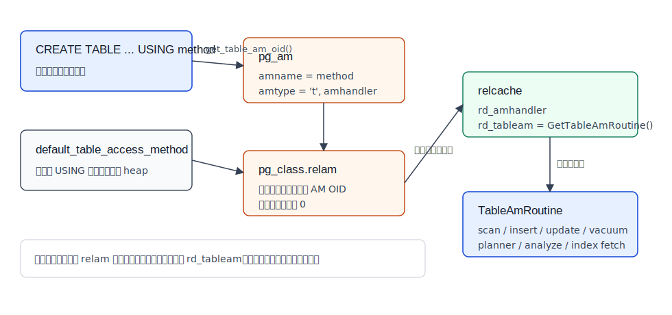
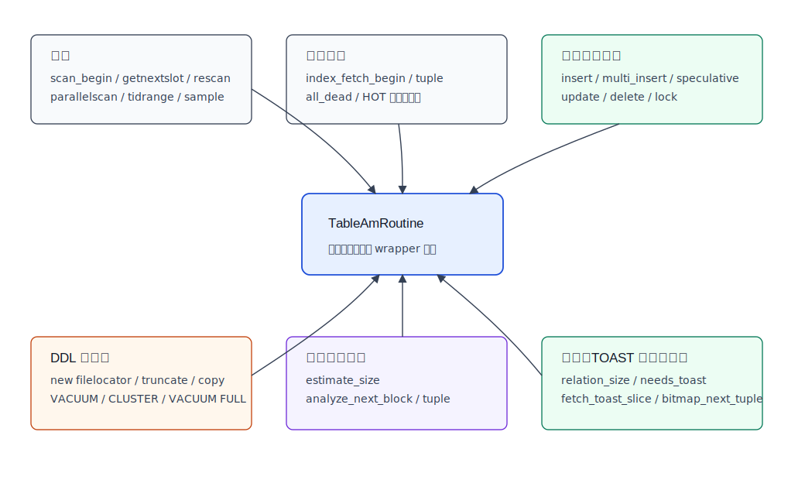
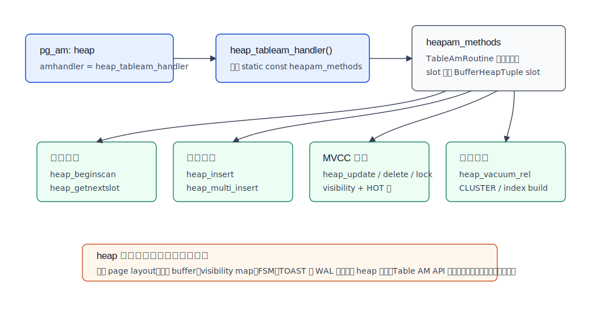
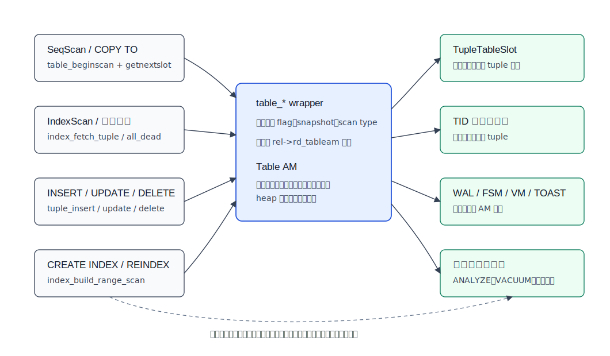
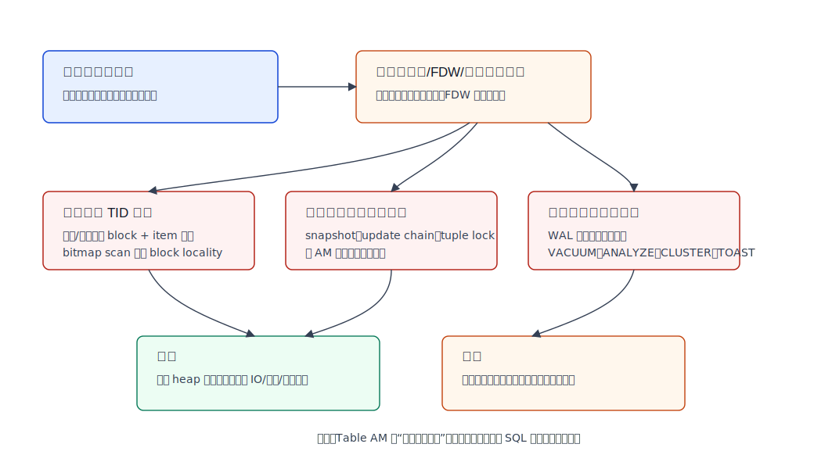

## 数据库筑基课 - Table Access Method

### 作者
digoal

### 日期
2026-06-08

### 标签
PostgreSQL , 应用开发者 , 数据库筑基课 , Table Access Method , 表存储 , heap , MVCC , VACUUM    

----

## 背景
   


这篇属于数据库筑基课里的“表存储 + 内核扩展接口”主题。Table Access Method，简称 Table AM，解决的不是“某条 SQL 怎么更快”，而是“PostgreSQL 的上层执行器、优化器、DDL、索引和维护逻辑，怎样在不知道具体物理存储细节的情况下访问一张表”。

本地 `markdown/` 目录没有发现独立的“数据库筑基课大纲”文件，所以本文不强行引用不存在的大纲；后续如果项目补充课程目录，可以在这里补上链接。

工程里常见的误解是：业务看到 `CREATE TABLE ... USING method`，以为 Table AM 是一个普通参数，像 `fillfactor` 或索引类型一样随手切换。实际上它更接近“表存储内核的插件接口”。你想把 heap 行存换成列存、压缩存储、冷热分层、LSM、外部对象存储或特殊 MVCC 布局，Table AM 才是那个入口。但这个入口很重：它要和 TID、MVCC、WAL、索引回表、VACUUM、ANALYZE、TOAST、CLUSTER、并行扫描和优化器估算一起工作。

本文以本地 PostgreSQL 源码 `postgres` 为主。主要依据包括：`doc/src/sgml/tableam.sgml`、`doc/src/sgml/ref/create_table.sgml`、`doc/src/sgml/ref/create_access_method.sgml`、`doc/src/sgml/config.sgml`、`doc/src/sgml/storage.sgml`、`src/include/access/tableam.h`、`src/backend/access/table/tableam.c`、`src/backend/access/table/tableamapi.c`、`src/backend/access/heap/heapam_handler.c`、`src/backend/utils/cache/relcache.c`、`src/backend/commands/tablecmds.c`、`src/include/catalog/pg_am.dat`、`src/include/catalog/pg_class.h`、`src/test/regress/sql/create_am.sql`。DeepWiki repoName `postgres/postgres` 用于补充架构导航和交叉检查，关键事实仍以官方文档和本地源码为准。

## 一、它解决什么问题？

Table AM 解决的是“表存储实现可替换”这个问题。

没有 Table AM 时，执行器做顺序扫描、索引回表、`INSERT`、`UPDATE`、`DELETE`、`COPY`、`VACUUM`、`ANALYZE`、`CREATE INDEX`、`CLUSTER` 时，都要直接知道 heap 的页面格式、tuple header、可见性判断、HOT 链、FSM、VM、TOAST、WAL 记录和清理规则。这样 PostgreSQL 只能有一种表存储实现，上层代码也会被 heap 细节绑死。

有了 Table AM 后，上层只需要调用 `table_*` wrapper，例如：

- `table_beginscan()` / `table_scan_getnextslot()` 做普通表扫描。
- `table_index_fetch_tuple()` 做索引回表和可见性检查。
- `table_tuple_insert()` / `table_multi_insert()` / `table_tuple_update()` / `table_tuple_delete()` 做 DML。
- `table_relation_vacuum()` 做 VACUUM。
- `table_scan_analyze_next_block()` / `table_scan_analyze_next_tuple()` 做 ANALYZE 采样。
- `table_index_build_scan()` 做索引构建时的表扫描。
- `table_relation_estimate_size()` 给优化器估算表大小和可见页比例。

上层仍然表达“我要扫描、插入、更新、清理、估算”，但具体“怎么读页、怎么判断可见、怎么组织 tuple、怎么写 WAL、怎么回收垃圾”交给表访问方法。

代价也很直接：一旦你实现新的 Table AM，你不是只写一个扫描函数，而是要补齐一套表存储生命周期。



图 1 说明：SQL 层通过 `USING method` 或 `default_table_access_method` 选择 AM；系统目录 `pg_am` 记录 AM 名称、类型和 handler，`pg_class.relam` 记录表使用哪个 AM；打开关系时 relcache 把 handler 解析成 `rd_tableam`，也就是 `TableAmRoutine` 函数指针表。执行器后续不再按 AM 名称分支，而是通过函数指针调用。

## 二、它是什么？

Table AM 是 PostgreSQL 核心系统和“表存储实现”之间的 C 级接口。官方 `tableam.sgml` 的定义很清楚：核心系统对具体 access method 知道得很少，只知道接口规定的内容，所以可以通过扩展代码开发新的表访问方法。

几个关键术语要分清：

| 术语 | 含义 | 源码或目录 |
|---|---|---|
| `pg_am` | 访问方法系统目录；`amtype = 't'` 表示 table AM，`amtype = 'i'` 表示 index AM | `src/include/catalog/pg_am.dat` |
| `pg_class.relam` | 表、物化视图、索引等对象记录访问方法 OID 的字段；非相关对象通常为 0 | `src/include/catalog/pg_class.h` |
| handler function | SQL 目录里记录的 C handler，表 AM 必须返回 `table_am_handler` | `doc/src/sgml/ref/create_access_method.sgml` |
| `TableAmRoutine` | handler 返回的静态函数指针表，核心代码通过它调用 AM | `src/include/access/tableam.h` |
| `rd_tableam` | relcache 中挂好的 `TableAmRoutine` 指针 | `src/backend/utils/cache/relcache.c` |
| heap | PostgreSQL 内置默认表访问方法 | `src/backend/access/heap/heapam_handler.c` |

内置的 `heap` 在 `pg_am.dat` 中定义为：

```text
amname => 'heap', amhandler => 'heap_tableam_handler', amtype => 't'
```

`heap_tableam_handler()` 位于 `heapam_handler.c`，返回 `heapam_methods`。这张 `heapam_methods` 函数指针表把 `TableAmRoutine` 的回调接到 heap 的真实实现上，例如 `heap_beginscan`、`heap_getnextslot`、`heap_insert`、`heap_multi_insert`、`heap_update`、`heap_delete`、`heap_vacuum_rel`、`heapam_estimate_rel_size`。

这也解释了一个实践边界：`heap` 是默认 Table AM，但 Table AM 不等于 heap。官方 `storage.sgml` 也提醒，PostgreSQL 存储章节描述的是内置 heap 表访问方法和内置索引访问方法；由于访问方法可扩展，其他方法可能不同。标准 page layout 对 heap 是事实，但不是所有 Table AM 必须照搬。

## 三、核心原理

### 3.1 SQL 如何选 Table AM

用户能接触到的入口主要有三个：

1. `CREATE TABLE ... USING method`：显式指定新表的 table AM。`create_table.sgml` 说明，该 method 必须是 `TABLE` 类型访问方法；不指定时使用默认 table AM。
2. `default_table_access_method`：创建表、物化视图或 `SELECT ... INTO` 且语句没有显式 AM 时使用。`config.sgml` 说明默认值是 `heap`。
3. `ALTER TABLE ... SET ACCESS METHOD`：把已有表改成另一个 AM。源码 `tablecmds.c` 会把有存储对象标记为 `AT_REWRITE_ACCESS_METHOD`，生产上应按表重写类操作评估锁、WAL、时间和回退窗口。

分区要特别小心。源码和回归测试共同说明：

- 分区根表可以记录 `relam`，供新分区继承；但分区根表没有自己的实际存储，因此没有 `rd_tableam`。
- 如果分区根表显式指定了 AM，新分区默认继承它。
- 如果分区根表没有记录 AM，普通 `CREATE TABLE ... PARTITION OF` 会使用当前 `default_table_access_method`。
- 也可以在创建分区时显式写 `USING heap` 或 `USING heap2`。

这个规则在 `src/test/regress/sql/create_am.sql` 里有覆盖，测试通过创建 `heap2` 这个指向同一个 `heap_tableam_handler` 的 AM 来验证语法、继承、依赖和 `pg_class.relam` 行为。

### 3.2 relcache 如何把目录记录变成函数指针

表创建时，`tablecmds.c` 根据 `USING`、父分区、默认 GUC 选择 AM OID，并传给 `heap_create_with_catalog()` 写入 `pg_class.relam`。

真正执行查询时，系统打开 relation，`relcache.c` 会做几步：

1. 对普通表、TOAST 表、物化视图和 sequence 调用 `RelationInitTableAccessMethod()`；分区根表只保留设置，不初始化 `rd_tableam`。
2. 普通用户表通过 `pg_class.relam` 查 `pg_am`，拿到 `amhandler`。
3. 系统 catalog 为了避免额外 syscache 查找，直接使用 `F_HEAP_TABLEAM_HANDLER`。
4. sequence 当前像 heap 表一样访问，但不在 catalog 里暴露为 table AM。
5. `InitTableAmRoutine()` 调用 `GetTableAmRoutine()`，把 handler 返回值转成 `TableAmRoutine`。
6. `GetTableAmRoutine()` 校验返回值必须是 `TableAmRoutine`，并在断言构建中检查必需回调是否存在。

这一步之后，上层代码拿到的是 `rel->rd_tableam`。访问路径不再关心 `heap`、`heap2` 或其他名字，只关心回调是否能完成语义。

### 3.3 TableAmRoutine 到底覆盖哪些面

`src/include/access/tableam.h` 里的 `TableAmRoutine` 很大，因为一张表从创建到销毁要经历很多动作。可以按功能域理解：



图 2 说明：Table AM 不是一个单点接口，而是一组围绕“表生命周期”的回调。扫描、索引回表、DML、DDL、维护、统计、TOAST、大小估算和位图扫描都可能经过它。实现新 AM 时，缺一块通常不是“少个功能”，而是某类 SQL、维护任务或索引能力无法正确运行。

几个回调面最值得关注：

- slot 回调：`slot_callbacks()` 返回适合该 AM tuple 的 `TupleTableSlotOps`。上层 executor 用 slot 持有 tuple，不需要知道底层 tuple 格式。
- 扫描回调：`scan_begin()`、`scan_getnextslot()`、`scan_rescan()` 支撑 Seq Scan；并行扫描、TID range scan、Sample Scan 也有对应入口。
- 索引回表回调：`index_fetch_tuple()` 根据索引返回的 TID 找表 tuple，并做 snapshot 可见性判断。heap 还要处理 HOT 链：索引 TID 指向旧版本时，可能需要返回当前可见版本。
- tuple 修改回调：`tuple_insert()`、`multi_insert()`、`tuple_update()`、`tuple_delete()`、`tuple_lock()` 支撑 executor 的 DML。
- DDL/维护回调：创建新存储、非事务 truncate、复制存储、CLUSTER/VACUUM FULL 重写、VACUUM。
- ANALYZE/索引构建回调：优化器统计和索引构建需要表扫描，但不能假设表一定是 heap page。
- planner 回调：`relation_estimate_size()` 给 `plancat.c` 估算 `pages`、`tuples`、`allvisfrac`，影响执行计划成本。

### 3.4 heap 如何作为默认实现挂上去

`heapam_handler.c` 的注释说得很直接：这个文件把低层 `heapam.c` 等例程接到 tableam 抽象上。



图 3 说明：`heap_tableam_handler()` 返回 `heapam_methods`。这张表把扫描接到 `heap_beginscan` / `heap_getnextslot`，把写入接到 `heap_insert` / `heap_multi_insert`，把更新删除接到 `heap_update` / `heap_delete`，把维护接到 `heap_vacuum_rel`、CLUSTER、索引构建和 ANALYZE。heap 是 PostgreSQL 内置默认实现，但 Table AM API 允许别的实现采用不同的物理组织。

heap 的一些重要选择包括：

- 使用 PostgreSQL 标准 page layout。
- 使用共享 buffer 管理普通数据页。
- tuple header 中存 `xmin`、`xmax`、`ctid` 等 MVCC 信息。
- `UPDATE` 通常写新版本，旧版本留给 VACUUM 清理。
- HOT 更新允许某些不改索引列的更新不新增普通索引条目。
- visibility map、free space map、TOAST、WAL 与 VACUUM 共同构成完整生命周期。

这些都是 heap 的实现选择，不是 Table AM 抽象的全部。

### 3.5 执行器、索引和 VACUUM 怎样通过 Table AM 协作

执行器调用路径里到处能看到 `table_*` wrapper：

- `nodeSeqscan.c` 用 `table_beginscan()` 和 `table_scan_getnextslot()`。
- `nodeBitmapHeapscan.c` 用 `table_beginscan_bm()` 和 `table_scan_bitmap_next_tuple()`。
- `nodeTidscan.c`、`nodeTidrangescan.c` 用 TID scan / TID range scan 入口。
- `nodeModifyTable.c` 用 `table_tuple_insert()`、`table_tuple_insert_speculative()`、`table_tuple_update()`、`table_tuple_delete()`。
- `copyfrom.c` 在可批量插入时用 `table_multi_insert()`。
- `indexam.c` 在 Index Scan 中通过 `table_index_fetch_begin()` 和 `table_index_fetch_tuple()` 回表。
- `nbtinsert.c` 做唯一检查时可用 `table_index_fetch_tuple_check()` 判断索引项对应的表 tuple 是否仍可见或全死。
- `vacuum.c` 调用 `table_relation_vacuum()`。
- `analyze.c` 调用 `table_scan_analyze_next_block()` 和 `table_scan_analyze_next_tuple()`。
- `plancat.c` 调用 `table_relation_estimate_size()`。



图 4 说明：Table AM 位于执行器、索引、统计和维护之间。索引 AM 管理索引结构，但索引返回 TID 后，表 tuple 是否可见、是否沿 HOT 链找到新版本、是否可以删除某个 index tuple，仍要问 table AM。VACUUM 和 ANALYZE 的结果又会影响后续索引扫描、顺序扫描和优化器估算。

这也是为什么“换 Table AM”不是只换读取算法。索引、可见性和维护必须一起对齐，否则会出现更严重的问题：索引指向找不到的 tuple、旧版本不能清理、唯一约束误判、统计不可信、并发更新返回错误版本。

### 3.6 TID 是当前 API 的硬约束

官方 `tableam.sgml` 明确写到一个很大的约束：如果 AM 要支持修改和/或索引，目前每个 tuple 需要有一个 TID，由 block number 和 item number 组成。子部分不一定要和 heap 完全同义，但如果想支持 bitmap scan，block number 需要提供局部性。

这对“列存 Table AM”尤其关键。列存可以不按 heap 行格式存储，但只要还想让 PostgreSQL 的索引、executor、tuple lock、UPDATE/DELETE、bitmap scan 正常工作，就必须把自己的物理位置映射到 PostgreSQL 能理解的 TID 语义上。否则你只能削减能力，或者在 AM 内部模拟一层 TID。

### 3.7 事务、WAL 和恢复不是可选细节

`tableam.sgml` 还说明：为了 crash safety，AM 可以使用 PostgreSQL WAL，也可以实现自定义机制；如果使用 WAL，可以用 generic WAL record，也可以实现 custom WAL resource manager。为了让不同 table AM 能在同一事务内访问，还可能需要深度集成 `xlog.c` 等事务/WAL 机制。

换句话说，Table AM 的“存储自由度”是有价格的：

- 你可以不用 heap page layout，但必须保证 crash recovery 后数据和索引一致。
- 你可以选择不同可见性表示，但必须满足 PostgreSQL snapshot 语义。
- 你可以选择不同压缩/编码，但 executor 仍需要从 slot 读列值。
- 你可以选择不同垃圾回收机制，但 VACUUM、autovacuum、索引删除和统计估算要能得到可信结果。

## 四、横向对比

| 维度 | Table AM | Index AM | FDW | 分区/表参数 |
|---|---|---|---|---|
| 主要目标 | 替换表的物理存储与表级生命周期 | 替换索引组织与搜索算法 | 访问外部数据源 | 管理数据分布、生命周期或局部参数 |
| SQL 入口 | `CREATE TABLE ... USING method` | `CREATE INDEX ... USING method` | `CREATE FOREIGN TABLE ... SERVER` | `PARTITION BY`、`WITH (...)` |
| 核心接口 | `TableAmRoutine` | `IndexAmRoutine` | FDW routine | 仍使用已有 AM |
| 改变内容 | 表扫描、DML、VACUUM、ANALYZE、TOAST、索引回表协作 | 索引 build/search/insert/vacuum/cost | 外部扫描、外部 DML、pushdown | 不改变底层 tuple 语义 |
| MVCC 责任 | 强，必须处理可见性和 tuple 修改语义 | 间接，通常依赖 table AM 判断 heap/table tuple 可见性 | 取决于外部源和 FDW 实现 | 由原 Table AM 负责 |
| WAL/恢复 | 强，表数据一致性由 AM 负责 | 强，索引恢复由 index AM 负责 | 通常不负责 PostgreSQL 内部表文件恢复 | 由原 Table AM 负责 |
| 适合场景 | 新表存储内核：列存、压缩、冷热、特殊 MVCC | 新索引结构：向量、倒排、空间、BRIN-like | 访问远端数据库、文件、服务 | 时间分区、租户隔离、冷热生命周期 |
| 不适合场景 | 普通查询调优、少量表参数调整 | 改变表物理布局 | 想要本地事务化表存储 | 想改变行格式或可见性机制 |

原因很简单：Table AM 是“表如何存在”的接口；Index AM 是“如何加速定位”的接口；FDW 是“如何把外部对象伪装成表”的接口；分区和表参数是在已有表存储实现上做组织和调参。把这些混在一起，设计会很快失控。

## 五、效果如何？

Table AM 的收益空间很大，但不是每个系统都值得走到这里。

可能收益包括：

- IO 模型：把 heap 行存改成列式、压缩块、冷热分层或按对象存储组织，减少特定 workload 的读取放大。
- 写入模型：批量写入、追加、合并、压缩、compaction 可以采用不同策略。
- 空间模型：改变 tuple header、压缩、编码、空值表示、冷数据布局。
- 维护模型：垃圾回收、冻结、可见性信息、统计采样可以按新存储格式优化。
- 扩展生态：让 PostgreSQL 的 SQL、事务、权限、优化器、索引和执行器继续可用，同时替换底层表存储。

成本也同样大：

- 必须实现大量回调，并跟随 PostgreSQL major version 演进。
- 必须处理索引回表和 TID 映射，否则索引能力受限。
- 必须处理 MVCC、并发更新、tuple lock、snapshot 可见性。
- 必须处理 WAL 或自定义恢复，否则 crash safety 不成立。
- 必须处理 VACUUM/ANALYZE/统计估算，否则会带来膨胀或计划错误。
- 必须处理 TOAST 或替代大字段机制，否则宽行和变长字段会出问题。

所以生产判断不是“Table AM 能不能做到”，而是“这个存储问题是否重要到值得替换 PostgreSQL 表存储内核”。

## 六、实操 DEMO

下面示例来自 PostgreSQL 自带回归测试思路，用内置 `heap_tableam_handler` 创建一个名为 `heap2` 的 table AM。它不会改变物理行为，只是验证 Table AM 的 SQL 入口、目录记录和对象使用关系。

本地没有启动 PostgreSQL 实例，因此以下 SQL 未在本次 workspace 中执行；语法和行为已按 `src/test/regress/sql/create_am.sql`、`src/test/regress/expected/create_am.out`、官方文档和源码校验。实际执行需要足够权限。

```sql
-- 创建一个新的 table AM 名称，但 handler 仍然指向 heap 实现。
CREATE ACCESS METHOD heap2 TYPE TABLE HANDLER heap_tableam_handler;

-- 查看 table AM。
SELECT amname, amhandler, amtype
FROM pg_am
WHERE amtype = 't'
ORDER BY 1;

-- 显式使用 table AM 创建普通表。
CREATE TABLE tableam_demo (id int, payload text) USING heap2;

INSERT INTO tableam_demo VALUES (1, 'a'), (2, 'b');

-- 查看表使用哪个 AM。
SELECT c.relname, a.amname
FROM pg_class c
JOIN pg_am a ON a.oid = c.relam
WHERE c.oid = 'tableam_demo'::regclass;

-- 未显式指定 USING 时，使用 default_table_access_method。
BEGIN;
SET LOCAL default_table_access_method = heap2;
CREATE TABLE tableam_default_demo (id int);
ROLLBACK;
```

分区示例：

```sql
CREATE TABLE tableam_parted_demo (k int, v text)
PARTITION BY RANGE (k)
USING heap2;

CREATE TABLE tableam_parted_demo_p1
PARTITION OF tableam_parted_demo
FOR VALUES FROM (0) TO (100);

SELECT child.relname AS partition_name, am.amname
FROM pg_inherits i
JOIN pg_class parent ON parent.oid = i.inhparent
JOIN pg_class child ON child.oid = i.inhrelid
JOIN pg_am am ON am.oid = child.relam
WHERE parent.oid = 'tableam_parted_demo'::regclass;
```

验证重点不是 `heap2` 更快，因为它仍然是 heap；验证重点是：

- `pg_am` 有一行 `amtype = 't'` 的访问方法。
- `pg_class.relam` 记录表或物化视图使用的 AM。
- `CREATE TABLE AS` 和 `CREATE MATERIALIZED VIEW ... USING` 支持 table AM。
- `SELECT INTO` 不支持写 `USING`，它依赖 `default_table_access_method`。
- `CREATE VIEW`、`CREATE SEQUENCE` 不支持通过 `USING` 指定 table AM。

## 七、最佳实践

**数据库架构师**

把 Table AM 当作存储内核级方案评审。只有当 heap 的行存、MVCC、VACUUM、压缩或冷热模型已经成为结构性瓶颈，并且 FDW、分区、索引、物化视图、扩展函数、表参数不能解决时，才进入 Table AM 设计。评审清单必须包括：TID 语义、索引回表、可见性、WAL、恢复、VACUUM、ANALYZE、TOAST、并发 DML、逻辑复制或物理复制影响。

**DBA**

不要把 `ALTER TABLE SET ACCESS METHOD` 当作轻量切换。对有存储的表，它会走表重写路径；需要评估锁窗口、WAL 峰值、磁盘临时空间、备库延迟、失败回滚和应用写入暂停。上线前用小表验证 `pg_class.relam`、对象依赖、`pg_dump`/`pg_restore`、备份恢复和监控展示。

**业务开发者**

业务 SQL 不应该依赖某个 Table AM 的内部物理布局。可以查询 `pg_class` 和 `pg_am` 做诊断，但不要把 TID 当稳定业务标识，也不要假设所有表都有 heap page 语义。应用层应该关心 SQL 语义、索引、事务和数据模型；底层 AM 变化应由数据库侧保证兼容。

**内核/扩展开发者**

优先从最小能力面验证：只读扫描、slot、TID 映射、可见性，再逐步扩展到 DML、索引回表、VACUUM、ANALYZE、TOAST 和 WAL。每加一块能力，都要有隔离测试、崩溃恢复测试和与索引/约束协作测试。不要一开始就承诺“完整替代 heap”。



图 5 说明：自定义 Table AM 的收益在于突破 heap 的物理存储模型；硬边界在于 TID、事务、WAL、索引、VACUUM、ANALYZE 和 TOAST。普通调优问题不应上升到 Table AM，除非已经证明现有机制不能解决核心矛盾。

## 八、适合与不适合场景

适合考虑 Table AM 的场景：

- 要在 PostgreSQL 内部实现列式或混合行列存储，并继续使用 SQL、事务、权限和部分索引能力。
- 需要为特定 workload 改变表数据布局，例如强压缩、追加写、冷数据分层、特殊可见性表示。
- 需要让表存储与自定义 WAL/rmgr、对象存储、压缩块或新型 compaction 机制深度结合。
- 研究或产品化数据库内核存储能力，而不是只做应用层优化。

不适合用 Table AM 的场景：

- 只是查询慢。优先看统计信息、索引、SQL、分区、work_mem、并行度和执行计划。
- 只是要访问外部数据。优先看 FDW。
- 只是要新的搜索结构。优先看 Index AM 或扩展索引。
- 只是历史数据冷热分离。优先看分区、表空间、归档、物化视图或外部表。
- 只是想换默认参数。优先用表参数、GUC、扩展或运维策略。

## 九、常见坑

**把 `heap2` 当成新存储。**  
回归测试里的 `heap2` 只是把新 AM 名称指向同一个 `heap_tableam_handler`。它用于验证框架，不改变存储行为。

**以为分区根表有实际 table AM 执行路径。**  
分区根表可以记录 AM 设置，但没有实际存储，不初始化 `rd_tableam`。真正读写发生在叶子分区。

**忽略 `SELECT INTO` 的限制。**  
`SELECT INTO` 不能显式写 `USING method`，需要通过 `default_table_access_method` 控制。

**只实现扫描，不实现维护。**  
只读扫描跑通不代表 AM 可用于生产。VACUUM、ANALYZE、索引构建、索引回表、tuple lock、DML、TOAST、WAL 都是生产边界。

**TID 映射随意设计。**  
索引、bitmap scan、tuple lock、UPDATE/DELETE 都会依赖 TID 语义。没有稳定 TID，就很难接入 PostgreSQL 现有执行和索引体系。

**低估升级成本。**  
`TableAmRoutine` 是 C 级内部接口，不是稳定 SQL API。PostgreSQL major version 变更可能要求 AM 适配新回调、新语义或新断言。

## 十、扩展问题

1. 如果一个列存 Table AM 要支持 btree 索引回表，它应该如何把列式块位置映射成 TID？
2. 如果 AM 不使用标准 heap page layout，`VACUUM`、`ANALYZE` 和 `relation_estimate_size()` 应该返回什么统计信息，才能让优化器不被误导？
3. 一个只读压缩 Table AM 是否必须支持 `tuple_update()`、`tuple_delete()`？如果不支持，应该在哪个阶段报错最合理？
4. 如果 AM 使用自定义 WAL resource manager，如何验证 crash recovery 后表数据和索引仍然一致？
5. 如果业务只是想减少历史数据查询 IO，分区 + 列式外部表 + FDW 是否比自定义 Table AM 更便宜？

## 十一、扩展阅读

- `postgres/doc/src/sgml/tableam.sgml`：Table Access Method 官方接口说明。
- `postgres/src/include/access/tableam.h`：`TableAmRoutine` 定义和 `table_*` wrapper 注释。
- `postgres/src/backend/access/table/tableam.c`：table AM wrapper 中较大的非 inline 逻辑，例如 catalog scan、parallel scan、index fetch check。
- `postgres/src/backend/access/table/tableamapi.c`：`GetTableAmRoutine()` 和 `default_table_access_method` 校验。
- `postgres/src/backend/access/heap/heapam_handler.c`：heap Table AM 如何填充 `heapam_methods`。
- `postgres/src/backend/utils/cache/relcache.c`：relcache 如何根据 `pg_class.relam` 和 `pg_am.amhandler` 初始化 `rd_tableam`。
- `postgres/src/backend/commands/tablecmds.c`：`CREATE TABLE ... USING`、分区 AM 继承和 `ALTER TABLE SET ACCESS METHOD` 相关路径。
- `postgres/src/include/catalog/pg_am.dat`：内置 heap table AM 和各类 index AM 的 catalog 初始数据。
- `postgres/src/include/catalog/pg_class.h`：`relam` 字段和 `RELKIND_HAS_TABLE_AM` 宏。
- `postgres/doc/src/sgml/ref/create_table.sgml`：`USING method` 语法说明。
- `postgres/doc/src/sgml/ref/create_access_method.sgml`：访问方法 handler 返回类型说明。
- `postgres/doc/src/sgml/config.sgml`：`default_table_access_method` 说明。
- `postgres/doc/src/sgml/storage.sgml`：heap page layout 与“其他 AM 可能不同”的边界说明。
- `postgres/src/test/regress/sql/create_am.sql`、`postgres/src/test/regress/expected/create_am.out`：Table AM 回归测试和预期行为。
- DeepWiki `postgres/postgres`：用于补充架构导航，相关页面包括 `Table and Index Management`、`System Catalogs and Metadata Management`；本文中的函数名、目录路径和行为边界已按本地源码核对。
  
## 附录 
1、克隆代码  
```  
git clone --depth 1 https://github.com/postgres/postgres
```  
  
2、启用 codex, 使用 [数据库筑基课 skill](../skills/README.md).  
```
文章标题: 
  数据库筑基课 - Table Access Method
项目源码(本地目录): 
  postgres
项目 codebase 文件名: 
  postgres/CLAUDE.md 
开源项目相关的 deepwiki repoName: 
  postgres/postgres
```
    
#### [PostgreSQL 解决方案集合](../201706/20170601_02.md "40cff096e9ed7122c512b35d8561d9c8")
  
  
#### [德哥 / digoal's Github - 公益是一辈子的事.](https://github.com/digoal/blog/blob/master/README.md "22709685feb7cab07d30f30387f0a9ae")
  
  
#### [About 德哥](https://github.com/digoal/blog/blob/master/me/readme.md "a37735981e7704886ffd590565582dd0")
  
  

  
