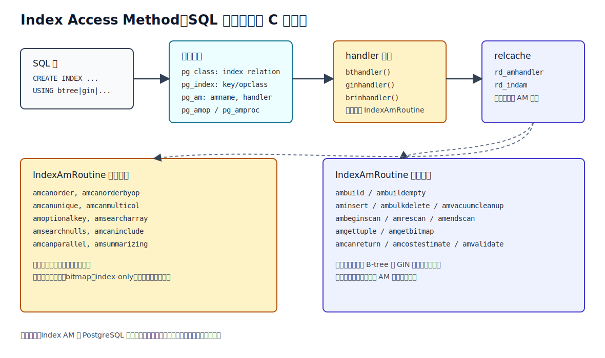
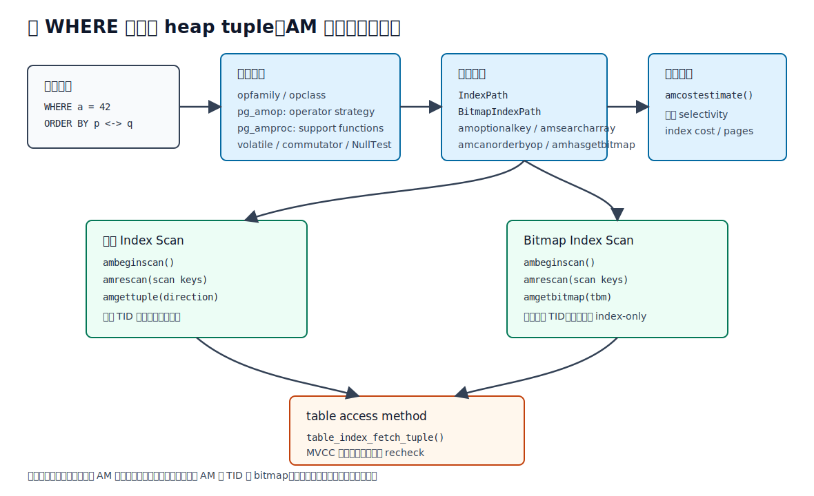
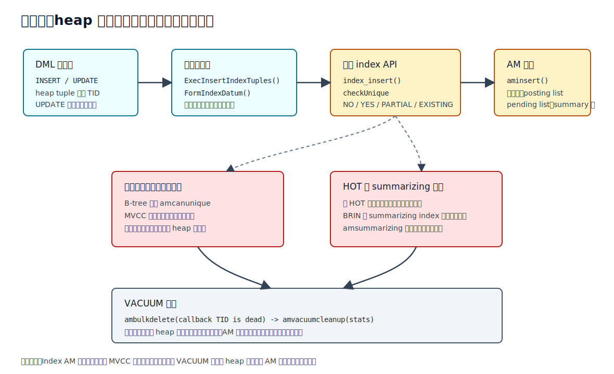
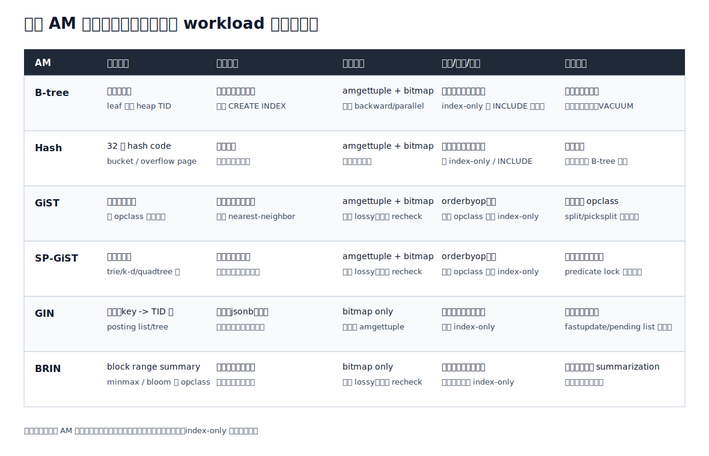
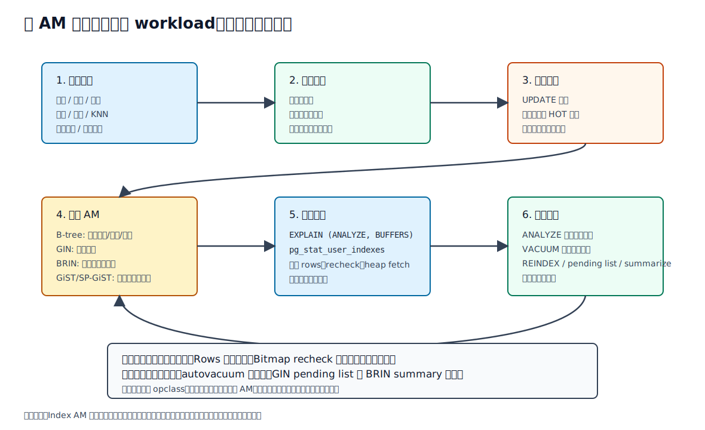

## 数据库筑基课 - Index Access Method

### 作者
digoal

### 日期
2026-06-08

### 标签
PostgreSQL , 应用开发者 , 数据库筑基课 , Index Access Method , 索引 , 优化器 , 执行器 , VACUUM     

----

## 背景
   


本文属于数据库筑基课里的“索引结构 + 优化器/执行器接口”主题。`Index Access Method` 容易被误解成“某一种索引”。在 PostgreSQL 里，它更准确地说是一个接口边界：核心系统通过统一的目录、能力标志和 C 回调表使用索引；B-tree、Hash、GiST、SP-GiST、GIN、BRIN 这些具体索引类型，在边界后面各自实现完全不同的数据结构和维护算法。

本地 `markdown/` 目录没有发现独立的“数据库筑基课大纲”文件，所以本文不强行引用不存在的大纲；后续如果项目补充大纲，可以在这里补上课程目录链接。

一个常见工程痛点是这样的：

业务表有订单号、创建时间、状态、`jsonb` 扩展字段、地理位置、全文搜索字段。开发者为了“让查询快”，给所有字段都建 B-tree。结果等值和范围查询还可以，`jsonb @>` 不走索引，全文搜索慢，地理最近邻排序要额外排序；后来又补 GIN、GiST、BRIN，写入延迟和 autovacuum 压力上来，索引膨胀越来越明显。最后问题不是“索引有没有建”，而是“查询谓词、数据形态、AM 能力、写入维护成本是否匹配”。

本文以本地 PostgreSQL 源码 `postgres` 为主线。重要结论优先引用官方文档和源码：[`doc/src/sgml/indexam.sgml`](../postgres/doc/src/sgml/indexam.sgml)、[`doc/src/sgml/indices.sgml`](../postgres/doc/src/sgml/indices.sgml)、[`doc/src/sgml/ref/create_access_method.sgml`](../postgres/doc/src/sgml/ref/create_access_method.sgml)、[`src/include/access/amapi.h`](../postgres/src/include/access/amapi.h)、[`src/backend/access/index/amapi.c`](../postgres/src/backend/access/index/amapi.c)、[`src/backend/access/index/indexam.c`](../postgres/src/backend/access/index/indexam.c)、[`src/backend/optimizer/path/indxpath.c`](../postgres/src/backend/optimizer/path/indxpath.c)、[`src/backend/optimizer/path/costsize.c`](../postgres/src/backend/optimizer/path/costsize.c)、[`src/backend/optimizer/util/plancat.c`](../postgres/src/backend/optimizer/util/plancat.c)、[`src/backend/executor/nodeIndexscan.c`](../postgres/src/backend/executor/nodeIndexscan.c)、[`src/backend/executor/nodeBitmapIndexscan.c`](../postgres/src/backend/executor/nodeBitmapIndexscan.c)、[`src/backend/executor/execIndexing.c`](../postgres/src/backend/executor/execIndexing.c)。用户更正后的 DeepWiki repoName `postgres/postgres` 对应的 `Table and Index Management` 页面可访问，最近索引时间为 2026-04-20；本文把它作为架构导航来源，具体字段、路径和能力结论仍以本地源码核验。

## 一、它解决什么问题？

Index Access Method 解决的是“数据库核心如何在不写死索引算法的情况下使用多种索引结构”的问题。

如果没有这个接口边界，数据库核心会被迫理解每一种索引内部结构：

- B-tree 的多层有序页、页分裂、唯一性检查、deduplication。
- Hash 的 hash code、bucket 和 overflow page。
- GiST 的 penalty、picksplit、consistent、distance ordering。
- SP-GiST 的 radix tree、quad tree、k-d tree 这类空间分区结构。
- GIN 的 key 到 posting list/tree 的倒排结构和 pending list。
- BRIN 的 block range summary、minmax、bloom、summarization。

这会让优化器、执行器、VACUUM、约束检查、`CREATE INDEX`、`REINDEX` 全部和具体索引结构耦合。PostgreSQL 的做法是把问题拆成三层：

1. **目录层。** `pg_am` 记录访问方法名称、类型和 handler；`pg_opclass`、`pg_opfamily`、`pg_amop`、`pg_amproc` 描述某个数据类型、操作符、支持函数如何挂到 AM 上。
2. **能力层。** `IndexAmRoutine` 里的 `amcanorder`、`amcanunique`、`amcaninclude`、`amgettuple`、`amgetbitmap` 等字段告诉核心“能做什么”。
3. **回调层。** 核心需要建索引、插入索引条目、扫描索引、估算成本、VACUUM 清理时，调用 AM 提供的 C 函数。

代价也很明确：AM 不是魔法层。它把索引算法扩展出来，但不会自动解决错误建模、坏统计、写入放大、MVCC 旧版本、VACUUM 滞后和错误 opclass 选择。



图 1 说明：`CREATE INDEX ... USING xxx` 只是入口。运行期真正被使用的是 relcache 里的 `rd_indam`，它指向 AM handler 返回的 `IndexAmRoutine`。核心代码不直接理解每种索引的页结构，而是通过能力标志和回调函数调用具体 AM。

## 二、它是什么？

PostgreSQL 官方 `indexam.sgml` 对 Index AM 的定义很直接：它是核心 PostgreSQL 系统和具体索引访问方法之间的接口。核心系统除了接口中规定的内容之外，不知道索引的内部细节，因此可以通过附加代码开发新的索引类型。

几个术语先定清楚：

| 术语 | 含义 | 关键文件 |
|---|---|---|
| Index Access Method | 一类索引访问方法，例如 `btree`、`gin`、`brin` | `pg_am`、`amapi.h` |
| handler function | 返回 `IndexAmRoutine` 的 C 函数，例如 `bthandler()`、`ginhandler()` | `pg_proc.dat`、各 AM 源码 |
| `IndexAmRoutine` | AM 的能力标志和回调函数表 | `src/include/access/amapi.h` |
| operator class | 某个数据类型如何被某个 AM 索引 | `pg_opclass` |
| operator family | 跨类型相关 operator class 的集合 | `pg_opfamily` |
| `pg_amop` | operator 到 AM strategy number 的映射 | `pg_amop` |
| `pg_amproc` | AM 支持函数，例如比较、consistent、extractValue | `pg_amproc` |
| `IndexScanDesc` | 扫描时 AM 与核心共享的状态 | `genam.h`、`indexam.c` |

一个索引在 PostgreSQL 中是二级索引：它和表 heap 物理分离，索引项通常把键值映射到 heap TID。TID 由 block number 和 item number 组成，足以定位一个表中的行版本。注意这里是“行版本”，不是“逻辑行”。MVCC 下同一逻辑行可能有多个物理版本，索引通常把它们当作独立对象；HOT 是重要例外，但 HOT 的判断和索引维护仍要遵守 AM 能力边界。

从 SQL 看，新增 AM 的入口是：

```sql
CREATE ACCESS METHOD heptree TYPE INDEX HANDLER heptree_handler;
```

官方 `CREATE ACCESS METHOD` 文档说明，handler 必须是已注册函数；对 index AM 来说，handler 返回类型必须是 `index_am_handler`，C 层 API 由 Index AM 接口定义。普通用户很少自己写 AM，但 DBA 和开发者必须理解这个接口，因为它解释了为什么同一条 SQL 在不同索引类型上会有不同计划、不同 recheck、不同写入成本。

## 三、核心原理

### 3.1 目录入口：`pg_am` 和 handler

内置 AM 记录在 [`src/include/catalog/pg_am.dat`](../postgres/src/include/catalog/pg_am.dat)：

- `btree` -> `bthandler`，类型 `i`。
- `hash` -> `hashhandler`，类型 `i`。
- `gist` -> `gisthandler`，类型 `i`。
- `gin` -> `ginhandler`，类型 `i`。
- `spgist` -> `spghandler`，类型 `i`。
- `brin` -> `brinhandler`，类型 `i`。

对应 handler 函数在 [`src/include/catalog/pg_proc.dat`](../postgres/src/include/catalog/pg_proc.dat) 注册为 `index_am_handler`。运行期 [`amapi.c`](../postgres/src/backend/access/index/amapi.c) 的 `GetIndexAmRoutineByAmId()` 先从 `pg_am` 查 handler OID，确认 `amtype` 是 index，再调用 `GetIndexAmRoutine()`。`GetIndexAmRoutine()` 调用 handler，要求返回一个 `IndexAmRoutine`，并断言必需回调存在，例如 `ambuild`、`aminsert`、`ambulkdelete`、`amvacuumcleanup`、`amcostestimate`、`ambeginscan`、`amrescan`、`amendscan`。

这意味着 `pg_am` 不是装饰性目录。它是 SQL 对象和 C API 的桥。

### 3.2 `IndexAmRoutine`：能力标志和函数表

[`amapi.h`](../postgres/src/include/access/amapi.h) 中的 `IndexAmRoutine` 分为两类字段。

第一类是能力标志：

- `amcanorder`：能否按索引键自然顺序输出，例如 B-tree。
- `amcanorderbyop`：能否按操作符结果排序，例如 GiST/SP-GiST 的 KNN。
- `amcanunique`：能否支持唯一索引。当前内置 AM 中只有 B-tree 支持。
- `amcanmulticol`：能否多列索引。
- `amoptionalkey`：扫描时是否允许第一列没有约束。
- `amsearcharray`：是否原生支持 `ScalarArrayOpExpr`，例如 `col = ANY (...)`。
- `amsearchnulls`：是否支持 `IS NULL` / `IS NOT NULL` 作为索引条件。
- `amcaninclude`：是否支持 `INCLUDE` 覆盖列。
- `amcanparallel` / `amcanbuildparallel`：是否支持并行扫描或并行构建。
- `amsummarizing`：是否只在 block granularity 上总结 tuple，例如 BRIN。

第二类是回调函数：

- 构建：`ambuild`、`ambuildempty`。
- 写入和维护：`aminsert`、`aminsertcleanup`、`ambulkdelete`、`amvacuumcleanup`。
- 扫描：`ambeginscan`、`amrescan`、`amgettuple`、`amgetbitmap`、`amendscan`。
- 能力查询与优化器：`amcanreturn`、`amcostestimate`、`amproperty`、`amgettreeheight`。
- opclass 管理：`amvalidate`、`amadjustmembers`。

这个结构是理解 PostgreSQL 索引体系的钥匙：**AM 的内部结构可以完全不同，但必须把自己包装成这套能力和回调。**

### 3.3 operator class：为什么同一个 AM 能支持很多语义？

`USING gin (payload)` 还不够完整。GIN 是索引框架，真正决定 `payload @> '{"a":1}'` 能不能走索引的是 operator class 和 operator family。

官方 `indexam.sgml` 说明，一个有用的 index AM 还必须有 operator families 和 operator classes，目录涉及 `pg_opfamily`、`pg_opclass`、`pg_amop`、`pg_amproc`。它们让优化器知道哪些 WHERE 条件可以用于该 AM。

以概念方式看：

- `pg_opclass`：`jsonb_ops`、`jsonb_path_ops`、`array_ops` 这类“这个类型如何被这个 AM 索引”的定义。
- `pg_amop`：把 SQL operator 映射到 AM strategy number。例如 B-tree 常见 strategy 是 `<`、`<=`、`=`、`>=`、`>`。
- `pg_amproc`：保存 AM 需要的支持函数，例如 B-tree 比较函数、GIN 的 `extractValue` / `extractQuery` / `consistent`、GiST 的 `consistent` / `union` / `compress` / `penalty` / `picksplit`。

所以“建了 GIN 还没走索引”经常不是 GIN 不行，而是 operator、opclass、表达式形态、统计和成本估算不匹配。

### 3.4 优化器怎样使用 AM？

优化器不会盲目给每个索引生成所有计划形态。它先在 [`plancat.c`](../postgres/src/backend/optimizer/util/plancat.c) 中把 relcache 的 AM 能力复制到 `IndexOptInfo`：

- `amcanorderbyop`
- `amoptionalkey`
- `amsearcharray`
- `amsearchnulls`
- `amcanparallel`
- `amhasgettuple`
- `amhasgetbitmap`
- `amcostestimate`

然后 [`indxpath.c`](../postgres/src/backend/optimizer/path/indxpath.c) 根据这些能力生成路径。例如：

- 如果要普通 Index Scan，AM 必须有 `amgettuple`。
- 如果要 Bitmap Index Scan，AM 必须有 `amgetbitmap`。
- 如果第一列没有可用约束，且 `amoptionalkey=false`，不能生成该索引路径。
- 如果 AM 不支持 `amsearcharray`，某些数组条件不能原生下推给索引。
- 如果 AM 支持 `amcanorderbyop`，优化器可以尝试把 `ORDER BY indexed_col operator constant` 变成索引排序路径。

成本估算在 [`costsize.c`](../postgres/src/backend/optimizer/path/costsize.c) 的 `cost_index()` 中调用 AM 的 `amcostestimate()`。AM 需要估算索引访问成本、选择率、相关性和页数。核心优化器随后再叠加 heap page 访问成本、CPU 过滤成本、index-only 的可见性因素等。



图 2 说明：优化器先用 operator class 匹配条件，再根据 AM 能力生成普通索引路径或 bitmap 路径。执行器不会自己解析 B-tree 或 GIN 页，它通过 `amgettuple` 或 `amgetbitmap` 拿 TID，随后由表访问方法读取 heap tuple 并做 MVCC 可见性检查。lossy AM 或 lossy bitmap 还需要 recheck。

### 3.5 执行器怎样扫描索引？

普通 Index Scan 的路径在 [`nodeIndexscan.c`](../postgres/src/backend/executor/nodeIndexscan.c) 和 [`indexam.c`](../postgres/src/backend/access/index/indexam.c)：

1. `index_beginscan()` 建立 `IndexScanDesc`。
2. `index_rescan()` 把 scan keys 和 orderby keys 传给 AM。
3. `index_getnext_tid()` 调 AM 的 `amgettuple()`，AM 把下一个匹配 TID 放到 scan state。
4. `index_fetch_heap()` 通过 table AM 读取 heap tuple，并检查 snapshot 可见性。
5. 如果 `xs_recheck=true`，执行器用原始 index qual 对 heap tuple 再验一次。

Bitmap Index Scan 的路径在 [`nodeBitmapIndexscan.c`](../postgres/src/backend/executor/nodeBitmapIndexscan.c)：

1. 执行器创建 `TIDBitmap`。
2. 调用 `index_getbitmap()`。
3. `index_getbitmap()` 调 AM 的 `amgetbitmap()`，把匹配 TID 批量 OR 到 bitmap 中。
4. 上层 Bitmap Heap Scan 再按 heap 页访问，并处理 recheck。

这解释了几个工程现象：

- GIN 和 BRIN 只有 `amgetbitmap`，没有 `amgettuple`，所以主要走 Bitmap Index Scan。
- Bitmap 路径没有索引顺序，也不能 index-only，因为 `amgetbitmap` 只返回 TID 集。
- BRIN 天然 lossy，返回的是可能匹配的 block range，执行器必须访问这些页再过滤。
- GiST/SP-GiST 可以返回近邻排序，但是否准确、是否需要 recheck 取决于 opclass。

### 3.6 写入路径：heap 先有行版本，索引再跟上

索引不是表的主存储。`INSERT` 或 `UPDATE` 先产生 heap tuple 和 TID，随后执行器调用 [`ExecInsertIndexTuples()`](../postgres/src/backend/executor/execIndexing.c) 为目标表上的每个索引生成条目。

核心步骤：

1. 遍历 `ResultRelInfo` 中打开的索引。
2. 如果是 partial index，先计算谓词，不满足就跳过该索引。
3. `FormIndexDatum()` 计算索引键值，表达式索引也在这里求值。
4. 根据索引是否唯一、是否 deferrable、是否 speculative insertion，设置 `IndexUniqueCheck`。
5. 调用 `index_insert()`。
6. `index_insert()` 再调 AM 的 `aminsert()`。
7. 如果是唯一或排他约束，可能立即报错、等待并发事务、记录 deferred recheck，或返回 speculative conflict。

官方 `indexam.sgml` 对唯一性检查说得很清楚：SQL 唯一约束由唯一索引实现，但 MVCC 下物理上必须允许重复键存在，因为它们可能指向同一逻辑行的不同版本。真正要保证的是“没有一个 MVCC snapshot 能同时看到两个相同键的 live row”。因此唯一性检查不能只看索引键，还要检查 heap 行版本的可见性和事务状态。当前内置 AM 中只有 B-tree 设置 `amcanunique=true`。



图 3 说明：Index AM 边界没有取消 MVCC。heap 产生新版本后，执行器才为各索引维护条目；唯一性检查需要结合 heap 可见性；VACUUM 清理索引时也要通过 AM 的 `ambulkdelete` 和 `amvacuumcleanup`，不能简单删除文件里的键值。

### 3.7 VACUUM 和索引维护：死 tuple 不会自己消失

官方 `indexam.sgml` 说明，索引里的 dead tuple 条目在对应 heap dead tuple 被回收时由 vacuuming 回收。通用入口在 [`indexam.c`](../postgres/src/backend/access/index/indexam.c)：

- `index_bulk_delete()` 调 AM 的 `ambulkdelete()`，通过 callback 判断某个 TID 是否应该删除。
- `index_vacuum_cleanup()` 调 AM 的 `amvacuumcleanup()`，做后处理和统计。

B-tree 有 bottom-up index deletion 和 deduplication；GIN 有 pending list 和 cleanup；BRIN 有 summarization。不同 AM 的“维护”不是同一回事。DBA 不能只看 `idx_scan`，还要看写入频率、dead tuple、pending list、BRIN 是否 summarizing、索引膨胀、autovacuum 是否能跟上。

### 3.8 内置 AM 的能力来自 handler 源码

内置 AM 的能力不是文档口号，而是 handler 返回的 `IndexAmRoutine`：

- [`nbtree.c`](../postgres/src/backend/access/nbtree/nbtree.c)：B-tree 支持自然排序、backward scan、唯一、多列、`IS NULL`、数组搜索、并行扫描、并行构建、INCLUDE、index-only。
- [`hash.c`](../postgres/src/backend/access/hash/hash.c)：Hash 支持 hash 等值语义，但不支持排序、唯一、多列、INCLUDE、index-only。
- [`gist.c`](../postgres/src/backend/access/gist/gist.c)：GiST 支持多列、`amcanorderbyop`、`IS NULL`、INCLUDE，具体语义依赖 opclass。
- [`spgutils.c`](../postgres/src/backend/access/spgist/spgutils.c)：SP-GiST 支持 `amcanorderbyop`、`IS NULL`、INCLUDE，适合空间分区类结构，内置标志里 `ampredlocks=false`。
- [`ginutil.c`](../postgres/src/backend/access/gin/ginutil.c)：GIN 支持多列、并行构建、使用 `maintenance_work_mem`，只有 `amgetbitmap`，不支持 index-only 和 INCLUDE。
- [`brin.c`](../postgres/src/backend/access/brin/brin.c)：BRIN 是 summarizing index，支持多列、`IS NULL`、并行构建，只有 `amgetbitmap`，不支持 index-only 和 INCLUDE。



图 4 说明：不要把 AM 选择理解为“哪个最快”。B-tree 是通用默认，但不是倒排、空间、block summary 的替代品；GIN/BRIN 适用面很强，但扫描路径、recheck、写入和维护边界完全不同。

## 四、横向对比

| 维度 | B-tree | Hash | GiST | SP-GiST | GIN | BRIN |
|---|---|---|---|---|---|---|
| 主要目标 | 通用等值、范围、排序 | 单列等值 hash | 可扩展平衡搜索框架 | 空间分区类结构 | 多值倒排索引 | block range summary |
| 典型数据 | 可排序标量、组合键 | hashable 标量 | 几何、范围、相似、扩展类型 | 点、前缀、非均匀分布 | array、jsonb、全文、标签集合 | 时间序列、追加写、物理相关列 |
| 普通 Index Scan | 支持 | 支持 | 支持 | 支持 | 不支持 | 不支持 |
| Bitmap Scan | 支持 | 支持 | 支持 | 支持 | 支持 | 支持 |
| 排序输出 | 支持自然顺序 | 不支持 | 支持 ordering operator | 支持 ordering operator | 不支持 | 不支持 |
| 唯一索引 | 支持 | 不支持 | 不支持 | 不支持 | 不支持 | 不支持 |
| Index-only | 支持 | 不支持 | 部分 opclass | 部分 opclass | 不支持 | 不支持 |
| INCLUDE | 支持 | 不支持 | 支持 | 支持 | 不支持 | 不支持 |
| 写入代价 | 多索引写放大、页分裂、膨胀 | 适用面窄 | 依赖 opclass split 质量 | 数据分布影响明显 | 写入和 cleanup 可能重 | 写入轻，但 summary 质量关键 |
| 不适合场景 | 多值包含、全文、低相关超大扫描 | 范围、排序、多列、唯一 | opclass 不成熟或 recheck 过高 | 数据分布不适合分区 | 高频小更新且 pending list 失控 | 随机分布列、高精确点查 |

这张表的关键不是记结论，而是理解原因：AM 能力决定优化器能生成什么 plan，AM 结构决定写入、扫描和维护代价，opclass 决定 SQL operator 是否能被索引理解。

## 五、效果如何？

Index AM 带来的收益：

- **扩展性。** 核心系统不用写死索引算法，新 AM 可以通过 handler 接入。
- **优化器可感知。** AM 能力、opclass、成本估算共同决定计划搜索空间。
- **执行器统一。** 普通 index scan、bitmap scan、index-only scan、KNN 等都通过统一接口调用。
- **维护路径统一。** `CREATE INDEX`、DML、VACUUM、REINDEX、progress reporting 都有 AM 回调点。
- **业务建模空间更大。** 多值、空间、范围、时间序列、全文、相似检索可以选择不同 AM。

代价和边界：

- **多一个索引就是多一份写入和维护。** 对 UPDATE-heavy 表尤其明显。
- **AM 选择错误会让索引存在但无效。** 例如把 `jsonb @>` 期待在普通 B-tree 上生效。
- **lossy 索引会引入 recheck。** BRIN、部分 GiST/SP-GiST/GIN 场景可能返回候选集而不是精确集。
- **index-only 不是只看索引定义。** AM 必须能返回原始值，查询列必须被索引覆盖，heap page 还要足够 all-visible，否则仍要访问 heap。
- **成本估算不是事实。** `amcostestimate()` 和统计信息只能估算，生产上必须用 `EXPLAIN (ANALYZE, BUFFERS)` 核验。
- **VACUUM 是索引正确性和空间回收的一部分。** dead index tuple、GIN pending list、BRIN summary 不是建索引时一次性解决的问题。

## 六、实操 DEMO

本机没有指定可用的 PostgreSQL 运行实例，因此以下 SQL 没有执行，也不提供伪造输出。它们是可复制到目标 PostgreSQL 实例里验证的最小路径。

### 6.1 查看当前实例有哪些 AM

```sql
SELECT
  oid,
  amname,
  amtype,
  amhandler::regproc
FROM pg_am
ORDER BY amtype, amname;
```

预期你会看到内置 index AM：`btree`、`hash`、`gist`、`gin`、`spgist`、`brin`，以及 table AM `heap`。

### 6.2 查询 AM 暴露给 SQL 的核心属性

```sql
SELECT
  amname,
  pg_indexam_has_property(oid, 'can_order') AS can_order,
  pg_indexam_has_property(oid, 'can_unique') AS can_unique,
  pg_indexam_has_property(oid, 'can_multi_col') AS can_multi_col,
  pg_indexam_has_property(oid, 'can_include') AS can_include
FROM pg_am
WHERE amtype = 'i'
ORDER BY amname;
```

这些属性来自 `IndexAmRoutine` 和 AM 的 property API。它们只能回答“能不能”，不能回答“这条 SQL 会不会选它”。

### 6.3 用不同 AM 建最小索引

```sql
CREATE TABLE iam_demo (
  id bigserial PRIMARY KEY,
  tenant_id int NOT NULL,
  created_at timestamptz NOT NULL,
  tags text[] NOT NULL,
  payload jsonb NOT NULL,
  point_xy point
);

CREATE INDEX iam_demo_created_btree ON iam_demo USING btree (created_at);
CREATE INDEX iam_demo_tags_gin ON iam_demo USING gin (tags);
CREATE INDEX iam_demo_payload_gin ON iam_demo USING gin (payload jsonb_path_ops);
CREATE INDEX iam_demo_created_brin ON iam_demo USING brin (created_at);
CREATE INDEX iam_demo_point_gist ON iam_demo USING gist (point_xy);
```

验证思路：

```sql
EXPLAIN (ANALYZE, BUFFERS)
SELECT *
FROM iam_demo
WHERE created_at >= now() - interval '1 day'
ORDER BY created_at
LIMIT 20;

EXPLAIN (ANALYZE, BUFFERS)
SELECT *
FROM iam_demo
WHERE tags @> ARRAY['vip'];

EXPLAIN (ANALYZE, BUFFERS)
SELECT *
FROM iam_demo
WHERE payload @> '{"channel":"app"}';

EXPLAIN (ANALYZE, BUFFERS)
SELECT *
FROM iam_demo
ORDER BY point_xy <-> point '(0,0)'
LIMIT 10;
```

重点看：

- 计划是 `Index Scan`、`Index Only Scan`、`Bitmap Index Scan`，还是 `Seq Scan`。
- `Rows Removed by Index Recheck` 是否很高。
- `Heap Fetches` 是否说明 index-only 实际仍回表。
- `Buffers` 中 index 和 heap 的访问是否符合预期。
- 估算 rows 与实际 rows 差距是否过大。

### 6.4 观察索引使用情况

```sql
SELECT
  schemaname,
  relname,
  indexrelname,
  idx_scan,
  idx_tup_read,
  idx_tup_fetch
FROM pg_stat_user_indexes
WHERE relname = 'iam_demo'
ORDER BY indexrelname;
```

`idx_scan=0` 不一定马上删除索引，但它是排查入口。你还要结合业务周期、约束用途、写入成本、是否用于唯一约束或外键关联查询。



图 5 说明：选 AM 不是一次性动作。先识别 workload 和数据形态，再用 `EXPLAIN` 验证计划，上线后持续观察统计、recheck、heap fetch、写入延迟、VACUUM 和索引膨胀。计划不符合预期时，先检查 operator、opclass、统计和成本，而不是盲目再加一个索引。

## 七、最佳实践

### 面向数据库架构师

把 AM 选择放进数据建模阶段，而不是上线后补救。

- 默认从 B-tree 开始，但不要把 B-tree 当作所有查询的万能索引。
- 多值包含、全文、标签集合、`jsonb` 包含查询优先评估 GIN 和具体 opclass。
- 空间、范围、相似、nearest-neighbor 查询评估 GiST/SP-GiST，并确认 operator class 的 recheck 和排序能力。
- 超大追加表上的时间、递增 id、物理相关列评估 BRIN，但必须验证相关性。
- 唯一约束默认意味着 B-tree，不要期待 GIN/BRIN 提供唯一性。
- 对高写入表限制索引数量，避免“每个查询一个索引”把写入和 VACUUM 拖垮。

验证方式：为核心查询保留 `EXPLAIN (ANALYZE, BUFFERS)` 基线，记录选择率、heap fetch、recheck、执行时间和 buffer 访问，而不是只记录“用了索引”。

### 面向 DBA

把索引看成需要运维的物理对象。

- 定期检查 `pg_stat_user_indexes`，识别长期不用但写入成本高的索引。
- 对 GIN 关注 pending list、`fastupdate`、批量装载和 cleanup 压力。
- 对 BRIN 关注 `pages_per_range`、summarization 是否及时、数据是否仍保持物理相关。
- 对 B-tree 关注膨胀、页分裂、重复值、deduplication、`REINDEX CONCURRENTLY` 窗口。
- 对高更新表关注 HOT 命中机会。索引覆盖越多列，越容易让 UPDATE 变成多索引写入。
- 统计信息过旧时先 `ANALYZE`，不要先改随机成本参数。

验证方式：结合 `pg_stat_user_tables`、`pg_stat_user_indexes`、`pg_stat_all_indexes`、`pg_stat_progress_create_index`、`EXPLAIN (ANALYZE, BUFFERS)` 和 autovacuum 日志。

### 面向业务开发者

写 SQL 时要让谓词落到索引和 opclass 能理解的形态。

- B-tree 能处理等值、范围、前缀 LIKE 场景，但 `LIKE '%abc'` 不会变成普通 B-tree 前缀扫描。
- `jsonb` 查询要确认使用的 operator 和 opclass，例如 `jsonb_ops` 与 `jsonb_path_ops` 适用面不同。
- `array @>`、`&&` 这类多值查询通常不是 B-tree 的工作。
- `ORDER BY distance LIMIT n` 要看 GiST/SP-GiST 的 ordering operator，而不是只建空间字段索引。
- index-only scan 需要查询列都在索引中，并且表页可见性足够好；频繁更新表不要指望它长期稳定。
- 避免在 indexed column 上包无法匹配表达式索引的函数，例如 `WHERE lower(name)=...` 需要表达式索引或改写。

验证方式：每个新增索引都要绑定至少一类 SQL，并用真实选择率数据验证。没有对应 SQL 的索引就是写入税。

## 八、适合与不适合场景

适合深入使用 Index AM 思维的场景：

- 查询模式多样，既有范围排序，也有全文、JSON、数组、空间或相似检索。
- 表很大，顺序扫描成本高，但不同列的物理相关性差异明显。
- 写入量大，需要在读性能和索引维护成本之间做明确取舍。
- 扩展开发，需要为新数据类型提供 operator class 或新 AM。
- DBA 需要解释为什么某个索引存在但优化器不用，或者为什么 bitmap recheck 很高。

不适合过度复杂化的场景：

- 小表或高缓存命中表，顺序扫描已经足够快。
- 查询条件不稳定，盲目提前建多种 AM 会制造写入和维护负担。
- 没有可验证 SQL，只是“以后可能会用”的索引。
- 数据分布和业务语义不支持某 AM 假设，例如随机分布列上用 BRIN 期待高过滤率。
- 写入极重且延迟敏感的表，除必要约束和核心查询外，应谨慎新增二级索引。

## 九、常见坑

1. **把 AM 当成语法装饰。** `USING gin`、`USING gist` 背后是完全不同的数据结构和执行路径，不是换个关键字。
2. **忽略 opclass。** 同一个 AM 对不同 opclass 的 operator 支持、存储表示和 recheck 行为可能不同。
3. **只看是否用了索引。** Bitmap scan 可能 recheck 大量行；index-only scan 可能因为 visibility map 不理想仍回 heap。
4. **把 BRIN 用在随机分布列上。** BRIN 依赖 block range summary，物理相关性差时过滤能力会很弱。
5. **把 GIN 当低成本索引。** GIN 适合多值检索，但写入、pending list、cleanup 和 `maintenance_work_mem` 边界必须纳入设计。
6. **误以为所有索引都能唯一。** 当前内置 AM 中唯一约束主要由 B-tree 支撑。
7. **索引过多破坏 HOT。** UPDATE 没改业务关键列，也可能因为索引覆盖列或表达式索引导致额外索引条目。
8. **忽略 partial index 谓词。** partial index 只有当优化器能证明查询条件蕴含谓词时才容易使用。
9. **用生产参数掩盖建模错误。** 调 `random_page_cost` 之前，先确认 operator、opclass、统计、列相关性和 SQL 形态。
10. **只建不维护。** 索引是物理对象，会膨胀、会积累 dead entries、会受 VACUUM 和 REINDEX 窗口影响。

## 十、扩展问题

1. 为什么 B-tree 可以同时支持范围扫描、排序和唯一约束，而 GIN 更适合多值包含查询？
2. 如果一个查询走了 Bitmap Heap Scan，哪些信息会丢失？为什么它不能天然保持索引顺序？
3. BRIN 的 `pages_per_range` 应该怎样根据表大小、物理相关性和查询选择率调整？
4. GIN 的 `fastupdate` 在批量写入和低延迟查询之间如何取舍？
5. 为什么唯一性检查必须进入 heap 判断 MVCC 可见性，而不能只靠索引页里的键值？
6. 一个自定义数据类型想支持 B-tree 排序、GiST KNN 和 GIN 包含查询，分别需要定义哪些 operator class 语义？
7. 如果 `EXPLAIN` 估算 rows 与实际 rows 差两个数量级，应该先查统计、opclass、相关性还是 AM cost 函数？

## 十一、扩展阅读

- PostgreSQL 官方文档：[`doc/src/sgml/indexam.sgml`](../postgres/doc/src/sgml/indexam.sgml)，Index Access Method Interface Definition。
- PostgreSQL 官方文档：[`doc/src/sgml/indices.sgml`](../postgres/doc/src/sgml/indices.sgml)，Indexes、Index Types、Index-Only Scans。
- PostgreSQL 官方文档：[`doc/src/sgml/ref/create_access_method.sgml`](../postgres/doc/src/sgml/ref/create_access_method.sgml)，`CREATE ACCESS METHOD`。
- PostgreSQL 官方文档：[`doc/src/sgml/btree.sgml`](../postgres/doc/src/sgml/btree.sgml)，B-tree operator classes 与实现细节。
- PostgreSQL 官方文档：[`doc/src/sgml/gin.sgml`](../postgres/doc/src/sgml/gin.sgml)，GIN 倒排结构、operator class、fast update。
- PostgreSQL 官方文档：[`doc/src/sgml/brin.sgml`](../postgres/doc/src/sgml/brin.sgml)，BRIN block range summary。
- DeepWiki：[`postgres/postgres - Table and Index Management`](https://deepwiki.com/postgres/postgres/2.3.2-table-and-index-management)，用于核对 PostgreSQL table/index 管理相关源码导航，最近索引时间为 2026-04-20。
- 源码接口：[`src/include/access/amapi.h`](../postgres/src/include/access/amapi.h)，`IndexAmRoutine` 定义。
- 源码入口：[`src/backend/access/index/amapi.c`](../postgres/src/backend/access/index/amapi.c)，handler 到 `IndexAmRoutine` 的获取。
- 通用索引调用层：[`src/backend/access/index/indexam.c`](../postgres/src/backend/access/index/indexam.c)，`index_insert`、`index_getnext_tid`、`index_getbitmap`、`index_bulk_delete`。
- 优化器路径生成：[`src/backend/optimizer/path/indxpath.c`](../postgres/src/backend/optimizer/path/indxpath.c)，AM 能力如何影响路径。
- 优化器成本估算：[`src/backend/optimizer/path/costsize.c`](../postgres/src/backend/optimizer/path/costsize.c)，`cost_index()` 调用 `amcostestimate()`。
- relcache 到优化器元数据：[`src/backend/optimizer/util/plancat.c`](../postgres/src/backend/optimizer/util/plancat.c)，`IndexOptInfo` 初始化。
- 执行器普通索引扫描：[`src/backend/executor/nodeIndexscan.c`](../postgres/src/backend/executor/nodeIndexscan.c)。
- 执行器 bitmap 索引扫描：[`src/backend/executor/nodeBitmapIndexscan.c`](../postgres/src/backend/executor/nodeBitmapIndexscan.c)。
- 索引写入和约束：[`src/backend/executor/execIndexing.c`](../postgres/src/backend/executor/execIndexing.c)。
- 内置 AM handler：[`src/backend/access/nbtree/nbtree.c`](../postgres/src/backend/access/nbtree/nbtree.c)、[`src/backend/access/hash/hash.c`](../postgres/src/backend/access/hash/hash.c)、[`src/backend/access/gist/gist.c`](../postgres/src/backend/access/gist/gist.c)、[`src/backend/access/gin/ginutil.c`](../postgres/src/backend/access/gin/ginutil.c)、[`src/backend/access/spgist/spgutils.c`](../postgres/src/backend/access/spgist/spgutils.c)、[`src/backend/access/brin/brin.c`](../postgres/src/backend/access/brin/brin.c)。
  
## 附录 
1、克隆代码  
```  
git clone --depth 1 https://github.com/postgres/postgres
```  
  
2、启用 codex, 使用 [数据库筑基课 skill](../skills/README.md).  
```
文章标题: 
  数据库筑基课 - Index Access Method
项目源码(本地目录): 
  postgres
项目 codebase 文件名: 
  postgres/CLAUDE.md 
开源项目相关的 deepwiki repoName: 
  postgres/postgres
```
    
#### [PostgreSQL 解决方案集合](../201706/20170601_02.md "40cff096e9ed7122c512b35d8561d9c8")
  
  
#### [德哥 / digoal's Github - 公益是一辈子的事.](https://github.com/digoal/blog/blob/master/README.md "22709685feb7cab07d30f30387f0a9ae")
  
  
#### [About 德哥](https://github.com/digoal/blog/blob/master/me/readme.md "a37735981e7704886ffd590565582dd0")
  
  

  
