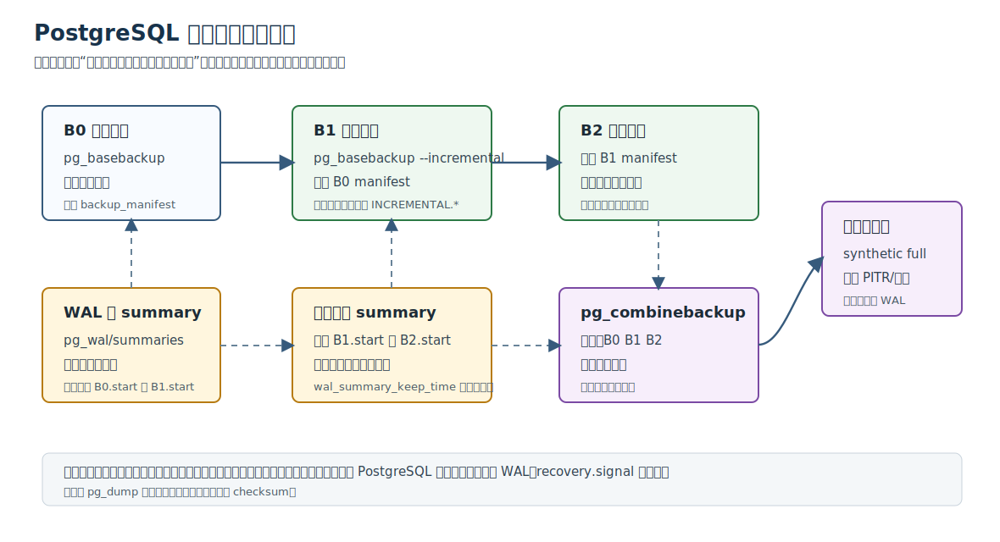
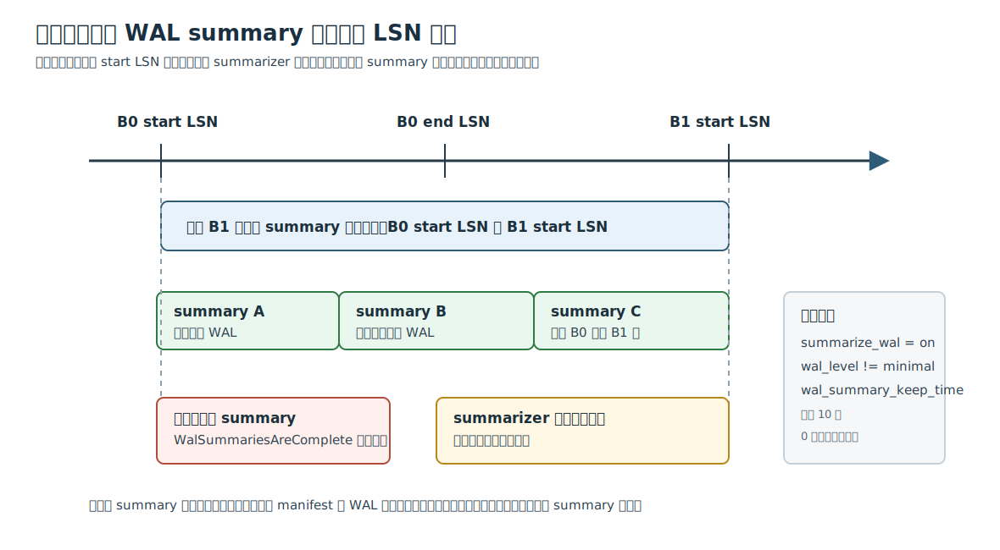
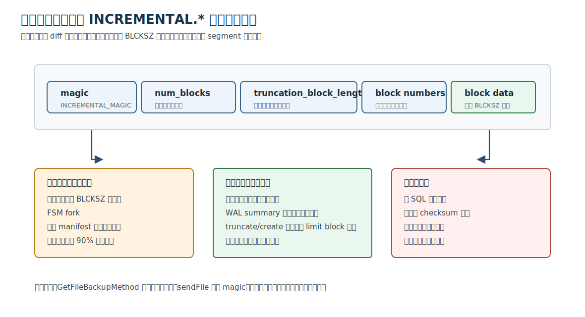
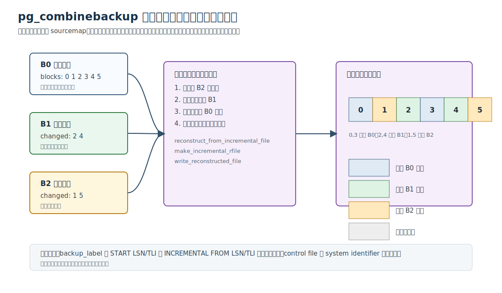
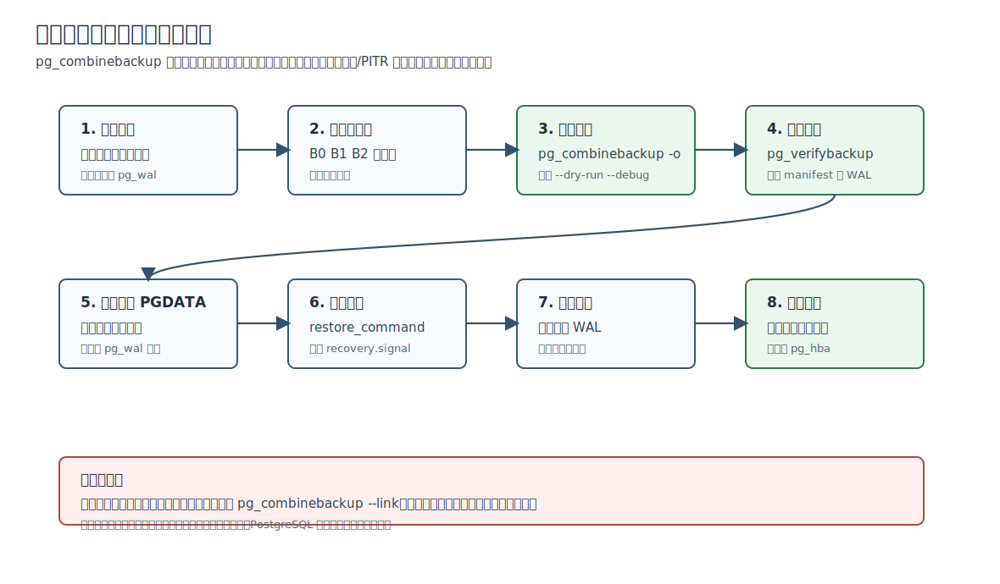

## 数据库筑基课 - 增量备份和增量还原

### 作者
digoal

### 日期
2026-06-08

### 标签
PostgreSQL , 应用开发者 , 数据库筑基课 , 物理备份 , 增量备份 , WAL summary , PITR , pg_basebackup , pg_combinebackup     

----

## 背景
   


这篇属于数据库筑基课里的“维护机制 + 场景实践”主题。增量备份不是一个节省磁盘的开关，而是一组恢复链协议：你要知道哪些块变了、哪些块没变、旧块在哪里、WAL 从哪里开始重放、备份链是否还能拼起来。

本地 `markdown/` 目录没有发现独立的“数据库筑基课大纲”文件，所以本文不强行引用不存在的大纲；后续如果项目补充大纲，可以在这里补上课程目录链接。

真实工程痛点通常是这样的：

一个 30TB 的 PostgreSQL 集群，全量物理备份每天跑一次。业务低峰只有 4 小时，备份窗口却越来越接近 4 小时；对象存储账单持续上涨；恢复演练时还要从全量备份开始重放大量 WAL。DBA 想“只备份今天变化的数据”，但数据库不能只回答“哪些文件修改过”，因为一个 1TB 的关系文件里可能只改了几十个 8kB block。反过来，如果只靠文件 checksum 判断，整个文件都会被判定变化，增量就没有意义。

PostgreSQL 的物理增量备份方案从 PostgreSQL 17 开始由 `pg_basebackup --incremental`、WAL summary、backup manifest 和 `pg_combinebackup` 共同完成。本文基于本地源码 `postgres`、官方文档和 DeepWiki repoName `postgres/postgres` 展开。

## 一、它解决什么问题？

增量备份解决的是：**在保留物理备份恢复能力的前提下，减少每次备份需要传输和保存的数据量**。

它把原问题拆成三个小问题：

1. 哪些关系块从上一次参考备份到这次备份开始前发生过 WAL 记录过的变化？
2. 对于没保存的新版本块，还原时应该从哪一个旧备份取旧版本块？
3. 备份链合成出来以后，还需要哪些 WAL 才能把目录恢复到一致状态？

PostgreSQL 的回答很明确：

- 用 WAL summarizer 扫描 WAL，生成 `pg_wal/summaries` 下的 summary 文件，记录某段 WAL 中哪些 relation fork 的哪些 block 被修改过。
- 用 backup manifest 记录备份里的文件、系统标识、WAL ranges 等信息，增量备份时把参考备份的 manifest 上传给服务器。
- 用 `pg_basebackup --incremental=OLDMANIFEST` 生成新备份；其中非关系文件完整保存，部分关系文件替换为 `INCREMENTAL.*` 文件。
- 用 `pg_combinebackup` 按从旧到新的备份链，把全量和增量备份合成为一个 synthetic full backup。
- 再按普通物理备份/PITR 流程处理 `restore_command`、`recovery.signal`、WAL 重放和验收。

牺牲也很直接：

- 你需要开启并保留 WAL summary。
- 你需要管理备份链，不能随意删除旧全量或旧增量。
- 增量备份不能直接启动，必须先合成全量。
- 如果大部分数据块都变了，增量备份不会比全量小很多，甚至增加管理复杂度。



图 1 说明：`B0` 是全量备份，`B1`、`B2` 是增量备份。每次增量备份都基于前一次备份的 manifest 和 WAL summary 判断变化块。恢复最新状态时，必须把 `B0 B1 B2` 按顺序输入 `pg_combinebackup`，得到合成全量备份目录，然后再进入 PostgreSQL 常规恢复流程。

## 二、它是什么？

PostgreSQL 增量备份是**物理级、块级、备份链式**能力。

几个术语先定清楚：

| 术语 | 含义 |
|---|---|
| 全量备份 | `pg_basebackup` 生成的完整物理基础备份，包含完整数据文件和 `backup_manifest` |
| 增量备份 | `pg_basebackup --incremental=OLDMANIFEST` 生成的物理备份，部分关系文件可被 `INCREMENTAL.*` 文件替代 |
| backup manifest | UTF-8 JSON 文件，记录 manifest 版本、系统标识、文件列表、WAL ranges 和 manifest 自身 SHA-256 校验 |
| WAL summary | `pg_wal/summaries` 下的二进制 summary 文件，按 tablespace OID、relation OID、fork 记录被 WAL 修改过的 block |
| `INCREMENTAL.*` 文件 | 增量关系文件，包含 magic、变化块数量、截断长度、相对块号列表和对应 block 数据 |
| synthetic full backup | `pg_combinebackup` 输出的合成全量备份，可作为普通物理备份继续恢复，也可作为后续合成输入 |
| 备份链 | 从一个全量备份开始，后接一个或多个增量备份的依赖关系 |

它不是：

- 不是 `pg_dump` 的逻辑增量。
- 不是按表、按行、按事务保存变化。
- 不是把 WAL 当备份本体。
- 不是直接把最新增量目录拿来启动。
- 不是自动管理备份保留策略的备份系统。

官方文档 `doc/src/sgml/ref/pg_basebackup.sgml` 明确说明，增量备份不能直接使用，必须先用 `pg_combinebackup` 和它依赖的前序备份合成。`doc/src/sgml/backup.sgml` 也强调，恢复增量备份时仍然需要 full backup 的所有要求，包括所需 WAL segment、timeline history、`recovery.signal` 或 `standby.signal`。

## 三、核心原理

### 3.1 增量备份从 manifest 开始，不从文件扫描开始

客户端 `pg_basebackup` 的增量流程在 `src/bin/pg_basebackup/pg_basebackup.c`：

1. 解析 `--incremental=OLDMANIFEST`。
2. 检查服务器版本是否支持增量备份。
3. 通过复制协议发送 `UPLOAD_MANIFEST`。
4. 把旧 `backup_manifest` 分块上传给服务器。
5. 发送带 `INCREMENTAL` 选项的 `BASE_BACKUP` 命令。

服务器端 `src/backend/backup/basebackup.c` 要求：如果 `BASE_BACKUP` 指定 incremental，但没有先上传 manifest，就报错。它还检查 `summarize_wal` 是否开启；没开启时不能执行增量备份。

`src/backend/backup/basebackup_incremental.c` 会解析上传的 manifest，提取两类关键信息：

- `System-Identifier`：必须和当前数据库系统标识一致，防止拿别的集群备份当参考。
- `WAL-Ranges`：用来确定从前序备份到当前备份之间需要哪些 WAL summary。

源码注释还说明了一个关键点：manifest 的文件列表不是判断变化块的主要依据。文件列表会被保留用于 sanity check；真正决定哪些块变化的是 WAL summary。原因是同名文件可能被删除后重新创建，仅凭文件列表并不安全。

### 3.2 WAL summary 是“变化块索引”

WAL summarizer 是一个后台进程。`src/backend/postmaster/walsummarizer.c` 的文件头说明，它持续扫描 WAL，并周期性生成 summary 文件，指出某个 LSN 范围内哪些 relation fork 的哪些 block 被 WAL record 修改过。

`doc/src/sgml/ref/pg_walsummary.sgml` 描述了 summary 内容：

- 索引维度是 tablespace OID、relation OID、relation fork。
- 每个 relation fork 保存被修改的 block 列表。
- 还可以保存 limit block。relation fork 在相关 WAL 范围内被创建或截断时，limit block 为 0 或某个最短截断长度。

增量备份时，服务器要检查 summary 是否覆盖一个完整窗口：**从前序备份的 start LSN 到当前备份的 start LSN**。`PrepareForIncrementalBackup()` 会调用 `WaitForWalSummarization()` 等 summarizer 追到当前备份 start LSN，然后用 `GetWalSummaries()`、`FilterWalSummaries()` 和 `WalSummariesAreComplete()` 检查是否无缺口覆盖。



图 2 说明：增量备份需要 summary 文件覆盖从前序备份 start LSN 到当前备份 start LSN 的全部区间。注意这里不是从前序备份 end LSN 开始，因为前序备份过程本身持续一段时间，备份期间的 WAL 也可能影响“旧备份中哪些块可被后续复用”。

### 3.3 `summarize_wal` 和保留窗口是硬前提

官方配置文档 `doc/src/sgml/config.sgml` 给出两个核心参数：

| 参数 | 作用 | 默认值 | 生产含义 |
|---|---|---|---|
| `summarize_wal` | 开启 WAL summarizer 进程 | `off` | 要做增量备份必须开启 |
| `wal_summary_keep_time` | 自动删除旧 WAL summary 的时间阈值 | 10 天 | 应大于“某次备份到后续依赖它的增量备份之间可能经过的最长时间” |

还有一个边界：`wal_level=minimal` 与 WAL summarization 不兼容。官方文档说明，服务器不能以 `summarize_wal=on` 且 `wal_level=minimal` 启动；如果启动后配置成这种组合，summarizer 会运行但拒绝为 `wal_level=minimal` 生成的 WAL 生成 summary。

`wal_summary_keep_time=0` 表示不自动删除 summary。它不是“无限安全”，只是把删除责任交给你。你仍然要知道哪些 summary 不会再被未来增量备份依赖。

### 3.4 服务器怎样决定某个关系文件全量还是增量？

真正的选择逻辑在 `GetFileBackupMethod()`。

会直接退回全量备份的情况包括：

- 文件大小不是 `BLCKSZ` 的整数倍。
- 文件大小超过 relation segment 约束。
- FSM fork，因为 free-space map fork 没有完整 WAL 记录。
- 旧 manifest 中没有这个文件或对应增量文件。
- 数据库 OID/tablespace OID 组合在 summary 中显示为新建，需要完整备份。
- limit block 说明相关 segment 之前的旧块不能安全复用。
- 需要发送的变化块接近整个文件，源码当前阈值是变化块字节数超过文件大小约 90% 时退回全量。

如果适合增量，服务器会把原关系文件名替换为 `INCREMENTAL.<原文件名>`，并只读取被 WAL summary 标记需要保存的 block。`sendFile()` 会写出一个增量文件头，再写对应 block 数据。



图 3 说明：增量文件由头部和 block 数据组成。头部保存 magic、变化块数量、截断长度和相对块号列表；如果变化块为空且文件非空，也可以生成一个很小的增量文件，用来表达“这个关系文件在当前备份时存在，但没有需要保存的新块”。

### 3.5 为什么非关系文件仍然完整保存？

官方文档 `doc/src/sgml/backup.sgml` 说明，增量备份中非关系文件会完整包含；只有部分 relation files 可能替换为增量版本。

这不是偷懒。WAL summary 的语义是 relation fork block 的变化索引。很多非关系文件不属于 heap/index 这类 relation fork block 模型，不能用同一套 block reference 安全表达变化。例如配置文件、控制文件、状态文件、manifest 自身等文件，直接完整保存更简单、更可靠。

### 3.6 备份 manifest 在增量体系里扮演什么角色？

`doc/src/sgml/backup-manifest.sgml` 描述了 manifest 格式。PostgreSQL 17 起 manifest version 是 2，新增 `System-Identifier`，并包含 `WAL-Ranges`。

增量备份依赖 manifest 的三个作用：

1. **确认同源。** `manifest_process_system_identifier()` 会比较 manifest 里的 system identifier 和当前服务器 system identifier。
2. **确认 WAL 窗口。** `manifest_process_wal_range()` 记录前序备份需要的 WAL range；`PrepareForIncrementalBackup()` 据此推导 summary 覆盖窗口。
3. **辅助 sanity check。** 文件列表用于确认“我们认为可省略的旧文件”确实存在于前序备份或其增量形式中。

manifest 不是变化检测表。变化检测来自 WAL summary。

### 3.7 `pg_combinebackup` 如何合成全量？

`pg_combinebackup` 的文档 `doc/src/sgml/ref/pg_combinebackup.sgml` 说得很直白：命令行必须按从旧到新的顺序列出所有 required backups，第一个应该是 full backup，最后一个是要恢复到的 final incremental backup。

主流程在 `src/bin/pg_combinebackup/pg_combinebackup.c`：

1. 读取最后一个输入目录的 `PG_VERSION`。
2. 检查所有输入备份的 `pg_control`，要求 control file 版本、system identifier 等一致。
3. 检查所有 `backup_label` 是否形成合法链。
4. 加载各备份目录的 `backup_manifest`。
5. 创建输出目录和表空间目录。
6. 遍历最新备份目录，遇到普通文件就复制，遇到 `INCREMENTAL.*` 就调用重建逻辑。
7. 写出新的 `backup_label`，其中会移除 `INCREMENTAL FROM LSN/TLI` 行，使输出目录表现为普通全量备份。
8. 生成新的 `backup_manifest`，并按需要 fsync 输出目录。

`backup_label` 链路检查来自 `src/bin/pg_combinebackup/backup_label.c`：增量备份的 `INCREMENTAL FROM LSN` 和 `INCREMENTAL FROM TLI` 必须与前一个备份的 start LSN/TLI 接上；第一个输入必须是全量备份。

### 3.8 块级重建：从最新增量向前找来源

核心重建逻辑在 `src/bin/pg_combinebackup/reconstruct.c` 的 `reconstruct_from_incremental_file()`。

简化算法如下：

1. 读取最新 `INCREMENTAL.*` 文件头，得到 block count、relative block numbers 和 truncation block length。
2. 为输出文件的每个 block 建立 `sourcemap` 和 `offsetmap`。
3. 最新增量文件里存在的 block，优先作为输出 block 来源。
4. 对于还缺失的 block，向前遍历备份链：
   - 如果前序备份里有完整文件，就从完整文件补齐需要的 block。
   - 如果前序备份里还是 `INCREMENTAL.*`，就从那个增量文件补齐尚未找到的 block。
5. 如果某些 block 应存在但没有来源，按源码注释推断为“扩展出来但未被 WAL 修改过的初始化块”，输出零块。
6. 写出合成后的完整关系文件，并按需要计算新 manifest checksum。



图 4 说明：最新增量优先级最高；缺失块向旧备份回溯。只要中间任意一个仍被需要的备份目录丢失，某些 block 就可能没有来源，最新增量备份无法恢复。

### 3.9 合成全量不是恢复完成

`pg_combinebackup` 输出的是 synthetic full backup，不是已经打开可用的数据库实例。

之后仍然要按 `doc/src/sgml/backup.sgml` 的连续归档恢复流程处理：

- 把合成全量目录放入目标 data directory 和表空间位置。
- 清理备份里带来的旧 `pg_wal` 内容，必要时复制现场保存但未归档的 WAL。
- 设置 `restore_command`。
- 创建 `recovery.signal` 或 `standby.signal`。
- 启动服务器，让它从备份要求的 WAL range 起点开始重放。
- 根据目标时间、目标 LSN 或最新 WAL 结束点完成恢复。
- 验证数据状态后再开放业务连接。



图 5 说明：增量备份恢复分两段。第一段是备份链合成，由 `pg_combinebackup` 完成；第二段是 PostgreSQL 常规物理恢复，由 startup recovery 读取归档 WAL 完成。把这两段混为一谈，是恢复演练失败的常见原因。

## 四、横向对比

### 4.1 备份方式对比

| 维度 | PostgreSQL 增量物理备份 | PostgreSQL 全量物理备份 | SQL dump | 存储快照 |
|---|---|---|---|---|
| 主要目标 | 减少后续物理备份的数据量 | 获得完整可恢复的集群文件副本 | 逻辑迁移、跨版本恢复、对象级恢复 | 快速冻结文件系统状态 |
| 粒度 | relation fork block | 文件/目录 | SQL 对象和数据 | 卷、文件系统或存储层块 |
| 恢复前置 | 必须有完整备份链并运行 `pg_combinebackup` | 直接还原目录后做 WAL 恢复 | 建库后执行 SQL 或 `pg_restore` | 恢复快照后按一致性要求处理 WAL |
| 跨大版本 | 不适合跨大版本 | 不适合跨大版本 | 适合跨版本升级和迁移 | 不适合跨大版本 |
| 对 WAL 依赖 | 需要 WAL summary 做备份，仍需要 WAL 做恢复 | 仍需要备份期间和之后的 WAL | 不依赖物理 WAL 恢复 | 一致性通常仍要 WAL 或数据库冻结协议 |
| 管理复杂度 | 高，需要链路和 summary 保留 | 中 | 中到高，取决于对象规模 | 依赖存储平台 |
| 适合场景 | 大库、冷数据多、变化块比例低 | 小库或简单可靠优先 | 迁移、细粒度恢复、审计导出 | 存储平台能力强、要求快速复制 |
| 不适合场景 | 高频全库重写、链路管理薄弱 | 备份窗口或成本已不可接受 | 超大库频繁全量导出 | 缺少数据库一致性控制或跨平台迁移 |

结论不是“增量一定比全量好”。如果数据库小、恢复团队少、备份窗口足够，全量备份更简单。增量备份的价值来自“变化块比例低”和“链路管理能力强”。

### 4.2 增量备份、WAL 归档、PITR 的关系

| 机制 | 保存什么 | 解决什么 | 不能替代什么 |
|---|---|---|---|
| 增量备份 | 备份链中变化过的关系块和完整非关系文件 | 减少备份传输与存储 | 不能替代 WAL 恢复 |
| WAL 归档 | 连续 WAL segment 和 history 文件 | PITR、备份恢复、复制补档 | 不能替代基础备份 |
| WAL summary | 某段 WAL 中变化过的 relation block 索引 | 支持判断增量备份要保存哪些块 | 不能用于直接恢复数据 |
| `pg_combinebackup` | 合成全量备份目录 | 把增量链转成普通物理备份 | 不负责重放归档 WAL |

WAL 归档保存“怎么把旧状态推进到新状态”；增量备份保存“哪些物理块的新版本需要随备份带走”；WAL summary 保存“为了做增量备份，哪些块变过”。三者不是同一个东西。

## 五、效果如何？

增量备份的收益来自变化块比例。

假设某个关系 segment 有 100 万个 8kB block，但一个备份周期内只有 2 万个 block 被 WAL 记录过的修改触达。增量备份只需要保存这些变化块，加上头部和其他完整非关系文件。传输量、备份窗口、对象存储成本都有机会下降。

但不要凭这个例子估算生产收益。真实收益受这些因素影响：

- 热点表是否集中，是否有大量 UPDATE 导致同一批 block 反复变化。
- 索引维护是否放大了变化块范围。
- autovacuum、bulk load、`VACUUM FULL`、`CLUSTER`、`REINDEX` 等维护操作是否重写大量 block。
- checkpoint、full-page writes 和 WAL 生成形态如何影响 summary 覆盖窗口。
- FSM fork、非关系文件、变化比例超过阈值的文件会退回全量保存。
- 备份链越长，恢复合成时需要读取的旧备份越多，管理成本越高。

所以要用两个指标评估：

| 指标 | 怎么看 | 为什么重要 |
|---|---|---|
| 备份端收益 | 增量备份目录大小、传输时间、`pg_stat_progress_basebackup.backup_type` | 判断是否值得承担复杂度 |
| 恢复端成本 | `pg_combinebackup --dry-run --debug`、恢复演练耗时、需要读取的备份目录数量 | 备份不是目标，能按 RTO 恢复才是目标 |

PostgreSQL 提供的观测入口包括：

```sql
-- 查看当前有哪些 WAL summary 文件覆盖哪些 LSN 区间。
SELECT *
FROM pg_available_wal_summaries()
ORDER BY tli, start_lsn;

-- 查看 WAL summarizer 已经写到哪里、内存中处理到哪里。
SELECT *
FROM pg_get_wal_summarizer_state();

-- 查看某个 summary 文件中标记的变化块。
-- 参数来自 pg_available_wal_summaries() 的输出。
SELECT *
FROM pg_wal_summary_contents(1, '0/1000000'::pg_lsn, '0/2000000'::pg_lsn)
LIMIT 20;

-- 备份进行中查看类型和进度。
SELECT pid, phase, backup_type, backup_total, backup_streamed
FROM pg_stat_progress_basebackup;
```

这些 SQL 是语法层面的可执行模板。本轮没有启动本地 PostgreSQL 实例执行它们，因此没有提供执行结果。

## 六、实操 DEMO

下面是一条最小链路。命令使用占位路径，生产使用前要替换为真实连接串、目录、归档路径和恢复目标。

### 6.1 开启 WAL summary

```conf
# postgresql.conf
wal_level = replica
summarize_wal = on
wal_summary_keep_time = '14d'
archive_mode = on
archive_command = 'test ! -f /archive/%f && cp %p /archive/%f'
```

重载或按参数要求重启后确认：

```sql
SHOW wal_level;
SHOW summarize_wal;
SHOW wal_summary_keep_time;

SELECT *
FROM pg_get_wal_summarizer_state();
```

注意：`summarize_wal` 只能在 `postgresql.conf` 或服务器命令行设置；`wal_level=minimal` 下不能有效生成增量备份所需 summary。

### 6.2 做第一个全量备份

```bash
pg_basebackup \
  -h primary.example.com \
  -U repl \
  -D /backup/pg/b0 \
  -Fp \
  -X stream \
  --checkpoint=fast \
  --manifest-checksums=CRC32C \
  --progress
```

全量备份成功后，保留 `/backup/pg/b0/backup_manifest`。后续第一次增量要用它。

可做一次校验：

```bash
pg_verifybackup /backup/pg/b0
```

### 6.3 做第一次增量备份

```bash
pg_basebackup \
  -h primary.example.com \
  -U repl \
  -D /backup/pg/b1 \
  -Fp \
  -X stream \
  --incremental=/backup/pg/b0/backup_manifest \
  --manifest-checksums=CRC32C \
  --progress
```

如果报 WAL summary 不完整，常见原因是：

- `summarize_wal` 没开。
- summarizer 还没追上，等待后仍无进展。
- `wal_summary_keep_time` 太短，旧 summary 已被清理。
- 参考 manifest 不是同一个数据库系统。
- 在 standby 上做增量，但自上次备份以来没有新的 restartpoint，相关 start LSN 条件不满足。

### 6.4 做第二次增量备份

```bash
pg_basebackup \
  -h primary.example.com \
  -U repl \
  -D /backup/pg/b2 \
  -Fp \
  -X stream \
  --incremental=/backup/pg/b1/backup_manifest \
  --manifest-checksums=CRC32C \
  --progress
```

### 6.5 合成最新全量备份

先做 dry run：

```bash
pg_combinebackup \
  --dry-run \
  --debug \
  -o /restore/pgdata.synthetic \
  /backup/pg/b0 \
  /backup/pg/b1 \
  /backup/pg/b2
```

确认链路后正式合成：

```bash
pg_combinebackup \
  -o /restore/pgdata.synthetic \
  /backup/pg/b0 \
  /backup/pg/b1 \
  /backup/pg/b2
```

如果使用表空间，可以加 `-T OLDDIR=NEWDIR` 映射。不要在输入备份目录上启动数据库。

### 6.6 验证合成备份并进入恢复

```bash
pg_verifybackup /restore/pgdata.synthetic
```

`pg_verifybackup` 能检查 manifest、文件、checksum 和备份所需 WAL 的可解析性，但它不能替代真实恢复演练。生产验收仍要启动 PostgreSQL，让 recovery 读归档 WAL，把实例推进到目标点，并检查业务数据。

然后在目标 data directory 设置：

```conf
restore_command = 'cp /archive/%f %p'
recovery_target_time = '2026-06-07 10:30:00+08'
```

创建信号文件：

```bash
touch /restore/pgdata.synthetic/recovery.signal
```

启动 PostgreSQL，让它读取归档 WAL 完成恢复。恢复到目标点后，检查业务数据，再开放连接。

上面的命令没有在本轮执行，因为本地没有启动用于演示的 PostgreSQL 17+ 实例和归档环境。

## 七、最佳实践

### 面向数据库架构师

1. 把增量备份设计成“备份链产品”，不是一个单命令脚本。
   - 维护元数据：全量备份 ID、增量备份 ID、父备份 ID、manifest 路径、start LSN、timeline、校验状态、归档 WAL 范围。
   - 验证方式：定期随机抽链，执行 `pg_combinebackup` 和恢复演练。

2. 设计恢复目标时同时看 RPO 和 RTO。
   - 增量备份降低备份成本，不必然降低恢复耗时。
   - 链太长会增加合成阶段读旧备份的时间。
   - 实践上常见策略是“周期性全量 + 多次增量 + 定期合成新基线”。

3. 不要把增量备份当跨版本迁移工具。
   - 物理备份强依赖 major version、数据目录格式、block layout 和系统架构。
   - 跨版本升级优先考虑 `pg_dump`、逻辑复制或原生升级流程。

### 面向 DBA

1. `summarize_wal=on` 要和 `wal_summary_keep_time` 一起管理。
   - 保留时间必须覆盖最长增量间隔。
   - 如果备份调度可能延迟，保留时间要留冗余。
   - 可以用 `pg_available_wal_summaries()` 观察现有覆盖范围。

2. 每个备份都保留 `backup_manifest`。
   - 不要用 `--no-manifest` 做增量链基线。
   - `pg_combinebackup` 可以在缺少某些旧 manifest 时尝试工作，但生成输出 manifest 和快速 checksum 复用会受影响；生产不应依赖这个侥幸。

3. 恢复演练必须覆盖 `pg_combinebackup`。
   - 至少测试 `--dry-run --debug`。
   - 验证输入顺序必须从旧到新。
   - 验证表空间链接和权限。
   - 验证输出目录可被 `pg_verifybackup` 检查。

4. 谨慎使用 `--link`。
   - `pg_combinebackup --link` 会用硬链接节省空间和时间，但输出目录和输入目录共享底层文件。
   - 一旦在输出目录上启动数据库，可能修改输入备份。
   - 官方文档建议只在输入目录是临时副本且完成后会删除时使用。

### 面向业务开发者

1. 不要把“有增量备份”理解成“任何误删都能秒回”。
   - 增量备份恢复仍要合成和重放 WAL。
   - 如果要细粒度找回一张表或几行数据，通常还需要逻辑备份、延迟库或审计日志配合。

2. 批量任务前后要通知 DBA。
   - `VACUUM FULL`、`CLUSTER`、`REINDEX`、全表 UPDATE、批量重写会显著增加变化块。
   - 这些操作可能让下一次增量接近全量大小。

3. 业务 RTO 要用演练数据确认。
   - “备份成功”不代表“恢复能在 30 分钟完成”。
   - 应要求恢复演练报告包含合成耗时、WAL 重放耗时、校验耗时。

## 八、适合与不适合场景

适合：

- 大型 PostgreSQL 集群，绝大多数历史数据冷或变化慢。
- 全量备份窗口、网络带宽或对象存储成本已经成为瓶颈。
- 团队有能力维护备份链元数据和恢复演练。
- 已经有可靠 WAL 归档体系。
- 可以接受“恢复前先合成全量”的流程。

不适合：

- 小库，做全量备份更简单、更便宜。
- 大量表每天被全量重写，变化块比例接近 100%。
- 备份链管理薄弱，经常手工删除旧备份。
- 没有稳定 WAL 归档，PITR 本身都没有演练通过。
- 期望跨大版本迁移或对象级恢复。
- `wal_level=minimal` 的临时装载集群。

## 九、常见坑

1. **只保留最新增量，删除旧全量。**
   - 结果：最新增量缺少旧 block 来源，无法合成。
   - 规避：备份系统维护父子关系，只有确认所有子链都不再需要时才能删除父备份。

2. **`wal_summary_keep_time` 小于备份间隔。**
   - 结果：下一次增量备份找不到完整 summary 覆盖窗口。
   - 规避：保留时间至少大于最大备份间隔和调度延迟，关键库留更大冗余。

3. **认为 `pg_combinebackup` 完成就等于恢复完成。**
   - 结果：目录还没通过 WAL 恢复到一致点就被误用。
   - 规避：合成后继续执行 `restore_command`、`recovery.signal` 和启动恢复。

4. **在输入备份目录上运行 PostgreSQL。**
   - 结果：备份目录被写脏，后续链路和校验失效。
   - 规避：输入备份目录只读挂载；恢复总是写到新输出目录。

5. **使用 `--link` 后修改输出目录。**
   - 结果：硬链接导致输入备份也被修改。
   - 规避：生产恢复优先普通 copy 或 reflink/clone；`--link` 只用于短生命周期临时副本。

6. **在 standby 上做增量但活动太少。**
   - 结果：没有新的 restartpoint，增量备份可能因起始点条件不满足而失败。
   - 规避：理解 standby restartpoint 边界；必要时在 primary 做增量，或调整备份策略。

7. **把 manifest 当变化检测依据。**
   - 结果：误判机制，排障方向错误。
   - 规避：记住变化块来自 WAL summary，manifest 提供同源、WAL range 和 sanity check。

8. **没有校验 WAL 归档。**
   - 结果：备份链能合成，但启动恢复时缺 WAL。
   - 规避：`pg_verifybackup`、归档完整性检查、恢复演练一起做。

## 十、扩展问题

1. 如果你把 30 天备份设计成“每周全量 + 每天增量”，删除第 1 天全量前，要证明哪些后续备份不再依赖它？
2. 为什么 PostgreSQL 要用 WAL summary 记录 block 变化，而不是直接比较两个备份 manifest 的文件 checksum？
3. 如果一次 `REINDEX DATABASE` 后增量备份大小暴涨，这是备份系统异常，还是 workload 造成的合理结果？
4. 为什么 `pg_combinebackup` 输出的是 synthetic full backup，但仍然需要 WAL 才能完成 PITR？
5. 对于 RTO 很短的核心库，是应该保留长增量链，还是周期性把链合成为新的基线？代价分别是什么？

## 十一、扩展阅读

本节主要参考以下资料：

- `postgres/doc/src/sgml/backup.sgml`：Backup and Restore、Making an Incremental Backup、PITR recovery 流程。
- `postgres/doc/src/sgml/ref/pg_basebackup.sgml`：`pg_basebackup`、`--incremental`、WAL method、manifest 选项。
- `postgres/doc/src/sgml/ref/pg_combinebackup.sgml`：`pg_combinebackup` 用法、限制、`--link`、`--clone`、`--dry-run`。
- `postgres/doc/src/sgml/ref/pg_walsummary.sgml`：WAL summary 文件内容与 `pg_walsummary` 工具。
- `postgres/doc/src/sgml/backup-manifest.sgml`：backup manifest JSON 格式、`System-Identifier`、`Files`、`WAL-Ranges`。
- `postgres/doc/src/sgml/config.sgml`：`summarize_wal`、`wal_summary_keep_time`、`wal_level` 边界。
- `postgres/doc/src/sgml/func/func-info.sgml`：`pg_available_wal_summaries()`、`pg_wal_summary_contents()`、`pg_get_wal_summarizer_state()`。
- `postgres/doc/src/sgml/monitoring.sgml`：`pg_stat_progress_basebackup.backup_type`。
- `postgres/src/bin/pg_basebackup/pg_basebackup.c`：客户端上传 manifest、发送 incremental `BASE_BACKUP`。
- `postgres/src/backend/backup/basebackup.c`：服务器端 base backup 主流程、增量文件写出。
- `postgres/src/backend/backup/basebackup_incremental.c`：manifest 解析、WAL summary 检查、文件增量/全量选择。
- `postgres/src/backend/backup/walsummary.c` 与 `postgres/src/backend/postmaster/walsummarizer.c`：summary 文件发现、完整性检查、后台 summarizer。
- `postgres/src/bin/pg_combinebackup/pg_combinebackup.c`：合成全量主流程。
- `postgres/src/bin/pg_combinebackup/reconstruct.c`：块级 sourcemap/offsetmap 重建算法。
- `postgres/src/bin/pg_combinebackup/backup_label.c`：备份链 LSN/TLI 校验和输出 `backup_label` 处理。
- DeepWiki `postgres/postgres` 查询：用于辅助确认源文件范围。

## 十二、验证清单

- 文章标题与用户输入一致。
- 主题分类为“维护机制 + 场景实践”。
- 核心机制均绑定官方文档、源码路径或明确标注为工程推论。
- 命令和 SQL 为可执行模板，但本轮未执行。
- 没有虚构性能数字。
- 每个图都是独立 SVG 文件，并用相对路径引用。
- 恢复流程明确区分 `pg_combinebackup` 合成阶段和 PostgreSQL WAL 恢复阶段。
  
## 附录 
1、克隆代码  
```  
git clone --depth 1 https://github.com/postgres/postgres
```  
  
2、启用 codex, 使用 [数据库筑基课 skill](../skills/README.md).  
```
文章标题: 
  数据库筑基课 - 增量备份和增量还原
项目源码(本地目录): 
  postgres
项目 codebase 文件名: 
  postgres/CLAUDE.md 
开源项目相关的 deepwiki repoName: 
  postgres/postgres
```

    
#### [PostgreSQL 解决方案集合](../201706/20170601_02.md "40cff096e9ed7122c512b35d8561d9c8")
  
  
#### [德哥 / digoal's Github - 公益是一辈子的事.](https://github.com/digoal/blog/blob/master/README.md "22709685feb7cab07d30f30387f0a9ae")
  
  
#### [About 德哥](https://github.com/digoal/blog/blob/master/me/readme.md "a37735981e7704886ffd590565582dd0")
  
  

  
