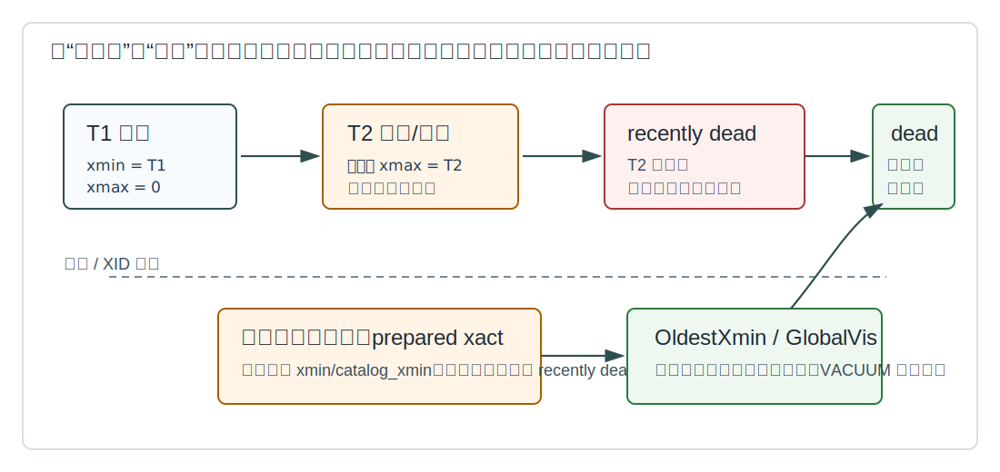
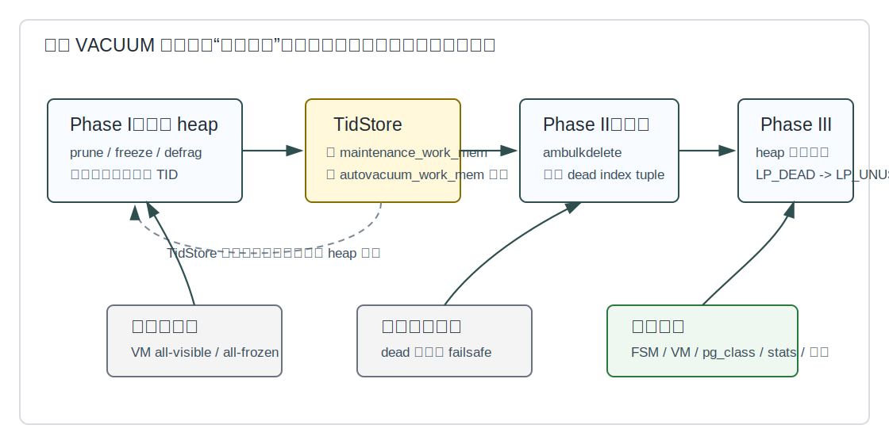
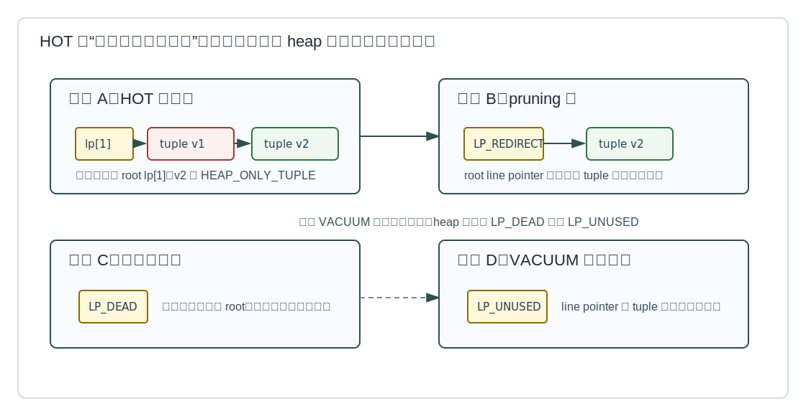
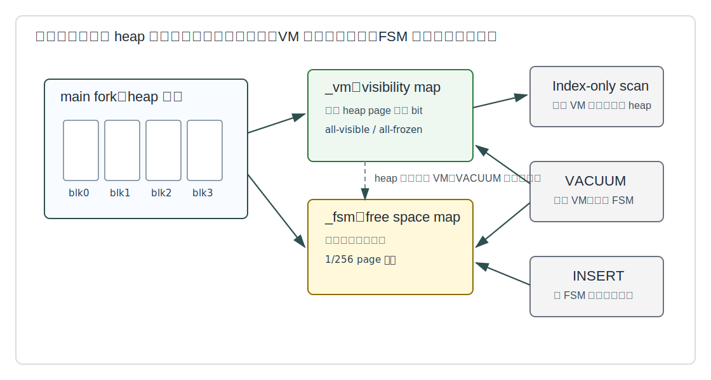
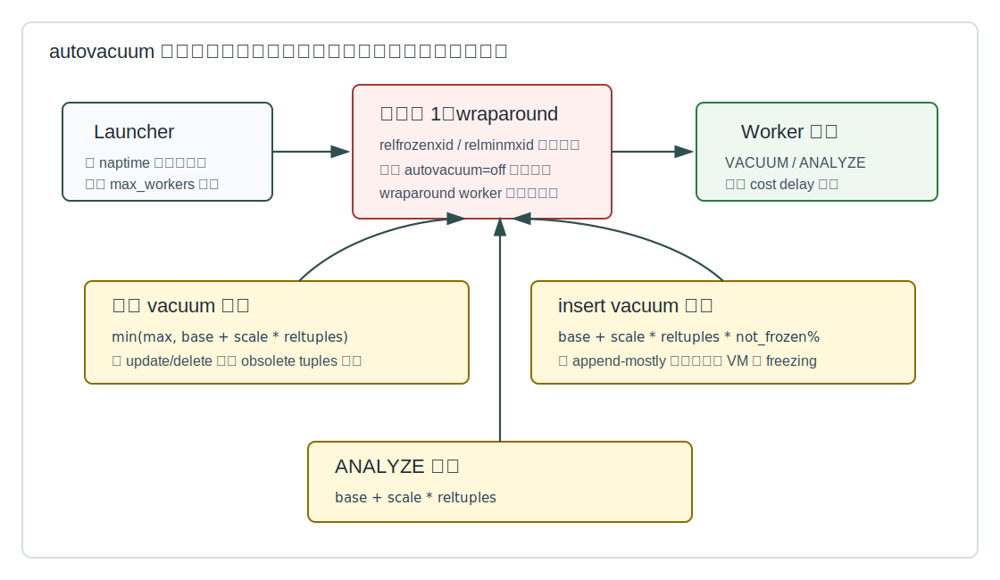
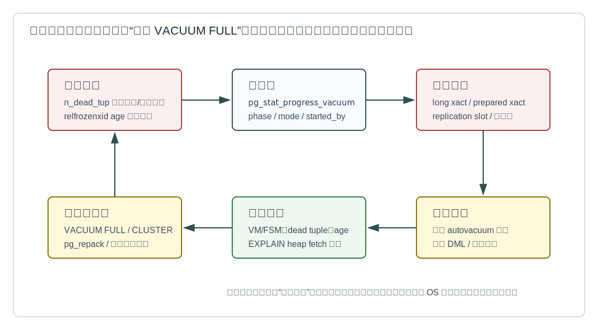

## 数据库筑基课 - 垃圾回收

### 作者
digoal

### 日期
2026-06-08

### 标签
PostgreSQL , 应用开发者 , 数据库筑基课 , MVCC , VACUUM , autovacuum , 表存储 , 运维     

----

## 背景
   


这篇属于数据库筑基课里的“表存储 + MVCC + 维护机制”主题。应用开发者经常把 `DELETE` 理解成“把数据删掉”，把 `UPDATE` 理解成“原地改一行”。在 PostgreSQL 里，这个理解会直接带来生产事故：磁盘为什么不降、索引为什么变大、长事务为什么拖垮写入、为什么 autovacuum 明明开着还会膨胀、为什么 `VACUUM FULL` 会把线上业务锁住。

本地 `markdown/` 目录没有发现独立的“数据库筑基课大纲”文件，所以本文不强行引用不存在的大纲；后续如果项目补充大纲，可以在这里补上课程目录链接。本文基于本地 PostgreSQL 源码、官方 SGML 文档、`postgres/CLAUDE.md` 的 codebase 说明，以及 DeepWiki `postgres/postgres` 的架构索引；关键结论以源码和官方文档为准。

## 一、它解决什么问题？

PostgreSQL 的并发基础是 MVCC。官方文档 `doc/src/sgml/mvcc.sgml` 说明：每个 SQL 语句看到某个时间点的数据快照，普通读写通常不互相阻塞。这个设计把很多锁等待成本转成了版本维护成本：`UPDATE` 会写入新行版本，旧版本还要留给可能仍在运行的快照；`DELETE` 也只是让旧版本带上删除事务信息，而不是马上从页面里消失。

这就产生四类工程问题：

1. **空间问题。** 旧行版本、dead line pointer、dead index tuple 不清理会造成表膨胀和索引膨胀。
2. **性能问题。** 扫描要跳过不可见版本，索引扫描可能遇到多个物理版本，缓存和 IO 被垃圾占用。
3. **正确性问题。** 事务 ID 是 32 位循环空间，旧 `xmin` 不冻结会触发 transaction ID wraparound 风险。
4. **运维问题。** 长事务、prepared transaction、逻辑复制槽、锁冲突和错误的 autovacuum 参数会让垃圾回收滞后。

垃圾回收解决的不是“把表缩到最小”，而是让 MVCC 产生的旧版本在不破坏快照一致性的前提下，重新变成可复用空间，并推进 visibility map、free space map、冻结边界和统计信息。

代价也明确：`VACUUM` 会消耗 IO、CPU、WAL、buffer 和维护内存；标准 `VACUUM` 多数情况下只让空间在同一个表内复用，不把磁盘空间还给操作系统；`VACUUM FULL` 能缩文件，但要重写表并持有强锁。

## 二、它是什么？

PostgreSQL 里的垃圾回收可以拆成三层：

1. **页内剪枝，heap pruning。** 访问 heap 页时或 VACUUM 扫描时，判断页内旧版本是否已经没人能看见，剪短 HOT 链、整理碎片，必要时把 line pointer 标成 `LP_DEAD` 或 `LP_UNUSED`。
2. **标准 VACUUM，lazy vacuum。** 扫描 heap，记录可删除索引项的 dead TID；清理索引；再回到 heap 把对应 `LP_DEAD` 变成可复用的 `LP_UNUSED`；更新 VM、FSM、统计和冻结信息。
3. **自动调度，autovacuum。** launcher 周期性启动 worker，worker 根据表级统计、插入阈值、update/delete 阈值、analyze 阈值和 wraparound 风险选择表。

相关物理对象有三个：

| 对象 | 文件形态 | 作用 |
|---|---|---|
| heap main fork | `relfilenode`、`relfilenode.1` 等 | 存储行版本、page header、line pointer、tuple header 和 tuple data |
| visibility map | `relfilenode_vm` | 每个 heap 页两位：all-visible、all-frozen；用于 VACUUM 跳页和 index-only scan |
| free space map | `relfilenode_fsm` | 近似记录每个页面可用空间，帮助 INSERT/UPDATE 找可复用页面 |

这些机制只针对内置 heap table access method 的常规行为。PostgreSQL 支持可扩展 table access method，其他存储引擎可以有不同的垃圾回收策略。

## 三、核心原理

### 3.1 旧版本何时从“可能可见”变成“垃圾”

`UPDATE` 和 `DELETE` 先改变 tuple header 里的事务信息。旧版本是否可以清理，取决于插入事务、删除/更新事务、提交状态、当前快照以及全局可见性边界。源码入口是 `src/backend/access/heap/heapam_visibility.c` 的 `HeapTupleSatisfiesVacuum()`、`HeapTupleSatisfiesVacuumHorizon()`，以及 `src/backend/access/heap/pruneheap.c` 中基于 `GlobalVisState` 的可移除性判断。



图 1 说明：提交后的旧版本不一定马上是可回收垃圾。只要还有活跃快照、prepared transaction、复制槽或其他 xmin 边界可能需要它，它就只能停在 recently dead 状态。VACUUM 的第一原则是正确性：宁可晚清理，也不能清理仍可能被快照看到的版本。

这个边界解释了很多线上现象：

- 一个 `idle in transaction` 连接不写数据，也可能让大量旧版本不能清理。
- 逻辑复制槽保留 `catalog_xmin`，会拖住系统 catalog 清理。
- 长查询本身不一定持有大量锁，但它的快照会让新产生的垃圾保留更久。
- `VACUUM` 运行过不等于垃圾都被移走；如果垃圾还不是 removable，只能下次再来。

### 3.2 标准 VACUUM 是三阶段状态机

`src/backend/commands/vacuum.c` 是 `VACUUM` 命令的控制和分发表；文件头注释明确说明 heap AM 的 VACUUM 在 `src/backend/access/heap/vacuumlazy.c`，并行 VACUUM 在 `src/backend/commands/vacuumparallel.c`，`VACUUM FULL` 走表重写路径。`heapam_handler.c` 把 heap table AM 的 `relation_vacuum` 回调指向 `heap_vacuum_rel()`。

`vacuumlazy.c` 顶部注释把 lazy vacuum 分成三个主阶段：

1. **Phase I：扫描 heap。** `lazy_scan_heap()` 扫描 relation page，做 pruning 和 freezing，把 dead tuple 的 TID 放入 `TidStore`。
2. **Phase II：清理索引。** `lazy_vacuum_all_indexes()` 调用索引 AM 的 vacuum 接口，删除 `TidStore` 里对应的 dead index entry。
3. **Phase III：回收 heap。** `lazy_vacuum_heap_rel()` 和 `lazy_vacuum_heap_page()` 再访问相关 heap 页，把已经完成索引清理的 `LP_DEAD` 变成 `LP_UNUSED`。



图 2 说明：这不是一次从头删到尾的简单循环。为了保证超大表也能在有限内存下 vacuum，dead TID 存储受 `maintenance_work_mem` 或 `autovacuum_work_mem` 约束；如果存储满了，VACUUM 会暂停 heap 扫描，先执行索引清理和 heap 回收，再回到 heap 继续扫描。

几个细节很重要：

- 如果没有索引，或索引扫描被跳过，Phase II 可以省掉。
- 如果 dead item 很少，`VACUUM` 可能跳过索引清理，因为清理所有索引的代价可能高于收益。
- 如果 wraparound failsafe 触发，VACUUM 会跳过非必要工作，例如索引清理，优先保住 transaction ID 安全。
- 完成后可能尝试截断 relation 尾部的全空页面，但这需要条件合适；标准 `VACUUM` 不承诺把中间空洞还给操作系统。

### 3.3 HOT：能页内解决的垃圾，不要拖到全表 VACUUM

`src/backend/access/heap/README.HOT` 解释了 HOT 的核心目标：当更新没有改变普通二级索引涉及的列，并且新版本能放在同一个 heap 页内时，新版本可以成为 heap-only tuple，不生成新的索引项。索引仍指向 HOT 链的 root tuple，扫描时沿 `t_ctid` 在同页内找到可见版本。



图 3 说明：HOT 让一部分垃圾可以在页面局部解决。中间 dead heap-only tuple 不需要删除索引项，因为没有索引直接指向它；页内 pruning 可以把链剪短并整理空间。但如果 root line pointer 仍被索引指向，就不能随便复用，必须等标准 VACUUM 清理索引项后再变成 `LP_UNUSED`。

所以 HOT 对工程实践有两个直接启发：

- 经常更新但不参与索引的字段，适合与高 churn 查询字段拆开建模，减少非 HOT 更新。
- 表上索引越多，更新越容易触碰“某个索引涉及的列”，索引垃圾和写入放大越严重。

### 3.4 VM 和 FSM：一个决定能不能跳，一个决定空间怎么复用

官方 `doc/src/sgml/storage.sgml` 说明：每个表和索引除了 main fork，还有 FSM；表还有 VM。`visibilitymap.c` 注释说明 VM 每个 heap 页有两个 bit：all-visible 和 all-frozen。VM 是保守结构：bit 被设置时必须为真；bit 没设置只代表“不知道”，不代表页面一定有垃圾。



图 4 说明：VM 和 FSM 是垃圾回收后的关键副产品。VM 让下一次 VACUUM 可以跳过已确认干净的页，也让 index-only scan 可以在 all-visible 页上跳过 heap fetch。FSM 让后续插入或更新能找到可复用空间，而不是盲目扩展 relation。

FSM 不是精确账本。`src/backend/storage/freespace/README` 说明，FSM 以约 `1/256` 页为粒度记录可用空间，并用树结构支持快速搜索。`doc/src/sgml/pgfreespacemap.sgml` 也说明这些值会取整，并且不会始终完全最新。把 FSM 当“近似导航”，不要当“审计口径”。

VM 比 FSM 更敏感。`visibilitymap.c` 注释强调：如果 VM bit 错误设置，可能导致 VACUUM 错误跳页或 index-only scan 返回错误结果。因此 heap 修改会清 VM，VACUUM 设置 VM 时要持有 heap 页锁并满足 WAL/LSN 顺序约束。

### 3.5 freezing：垃圾回收还承担 XID 保命职责

MVCC 判断可见性依赖 XID 比较，而普通 XID 是 32 位循环空间。`doc/src/sgml/maintenance.sgml` 的 wraparound 小节说明：如果行版本带着非常旧的 `xmin` 长期存在，XID 计数绕回后，过去的事务可能看起来像未来事务，造成灾难性不可见。解决办法是 freezing：把足够老且已提交的行版本标记成对所有当前和未来事务都可见。

`VACUUM` 有三种相关模式：

| 模式 | 触发原因 | 主要目标 | 代价 |
|---|---|---|---|
| normal | update/delete/insert 阈值或手工执行 | 清理 dead tuple、更新 VM/FSM、必要时冻结 | 可跳过 VM 已证明安全的页 |
| aggressive | `relfrozenxid` 或 `relminmxid` 到达表级冻结年龄 | 扫描所有可能含未冻结 XID/MXID 的页，推进冻结边界 | 比普通 vacuum 扫描范围更大 |
| failsafe | wraparound 风险接近最后安全线 | 最小化工作以避免系统级 wraparound 失败 | 跳过索引清理等非必要工作，取消 cost delay |

相关参数包括 `vacuum_freeze_min_age`、`vacuum_freeze_table_age`、`autovacuum_freeze_max_age`、`vacuum_failsafe_age`、multixact 对应参数，以及较新的 `vacuum_max_eager_freeze_failure_rate`。官方文档还说明，`autovacuum_freeze_max_age` 默认较低，是为了让 `pg_xact` 等提交状态文件也能及时裁剪。

### 3.6 autovacuum：不是开关，是调度器

`doc/src/sgml/maintenance.sgml` 说明 autovacuum 由 launcher 和 worker 组成。launcher 负责按数据库分配 worker，worker 检查数据库里的表并按需执行 `VACUUM` 或 `ANALYZE`。`src/backend/postmaster/autovacuum.c` 的 `AutoVacLauncherMain()`、`AutoVacWorkerMain()`、`relation_needs_vacanalyze()`、`autovacuum_do_vac_analyze()` 是主要源码入口。



图 5 说明：autovacuum 先考虑保命任务，再考虑普通表级阈值。普通 vacuum 阈值大致是 `base threshold + scale factor * reltuples`，并受 max threshold 限制；insert-only 或 append-mostly 表还有 insert vacuum 阈值，用于推进 VM 和 freezing；ANALYZE 有单独阈值。

几个容易误解的点：

- `autovacuum=off` 不等于永远不 vacuum；防 wraparound 的 autovacuum 仍会启动。
- 普通 autovacuum worker 一般会在遇到冲突锁时让路；防 wraparound worker 不会自动被同类冲突打断。
- 分区父表不直接存储 tuple，autovacuum 处理分区，但不会自动分析没有数据变更的分区父表整体统计。
- 临时表不能被 autovacuum 访问，需要会话自己 `VACUUM` 或 `ANALYZE`。

## 四、横向对比

| 维度 | 标准 VACUUM | VACUUM FULL / CLUSTER / 表重写 | heap pruning / HOT | autovacuum |
|---|---|---|---|---|
| 主要目标 | 回收 dead tuple，空间留给同表复用，推进 VM/FSM/freezing | 重写对象，把空洞真正压缩掉，通常能还给 OS | 页内剪枝和空间整理，减少索引垃圾 | 自动调度 VACUUM/ANALYZE |
| 锁影响 | 可与普通读写并行，持有 `SHARE UPDATE EXCLUSIVE` 等维护锁 | 需要强锁，`VACUUM FULL` 需要 `ACCESS EXCLUSIVE` | 需要 buffer cleanup lock，通常非阻塞尝试 | 普通 worker 通常会因冲突让路 |
| 索引处理 | 通过索引 AM 清理 dead index tuple，可并行处理部分索引 | 重建或配合重写，索引空间也重新组织 | HOT 更新避免新增普通索引项 | 调用标准 VACUUM 路径 |
| 是否归还磁盘给 OS | 通常不归还，除非尾部整页可截断且能拿到锁 | 通常可以显著缩小物理文件 | 不归还 OS，只改善页内复用 | 取决于执行的 VACUUM 类型，autovacuum 不执行 VACUUM FULL |
| 主要风险 | IO 干扰、运行太慢、被长事务拖住 | 长锁、额外磁盘、业务窗口要求高 | 受索引列、fillfactor、页内空间限制 | 参数不适合大表或高 churn 表时滞后 |
| 适合场景 | 常规 OLTP 表维护 | 已膨胀严重且必须缩文件 | 高频更新但索引列稳定的行 | 大多数生产系统的常态维护 |
| 不适合场景 | 期待立刻缩磁盘文件 | 在线高峰期无锁窗口 | 更新改动大量索引列或跨页 | 完全无统计、临时表、错误阈值 |

这张表的核心不是“谁更强”，而是边界不同。标准 VACUUM 是长期稳态维护；表重写是重灾之后的手术；HOT/pruning 是页内局部优化；autovacuum 是调度层。把重写当日常维护，或者把 autovacuum 当万能自动驾驶，都会出问题。

## 五、效果如何？

垃圾回收的收益和代价要分开看。

**收益：**

- heap 页里的 dead tuple 被清理后，空间可以被同表后续 INSERT/UPDATE 复用。
- dead index tuple 被删除后，索引页分裂压力、索引扫描版本 churn 和索引膨胀会下降。
- VM all-visible 提高后，index-only scan 更容易跳过 heap fetch。
- VM all-frozen 提高后，未来 aggressive vacuum 可跳过更多页面。
- FSM 更新后，新 tuple 更容易落到已有页面，减少 relation 扩展。
- relfrozenxid/datfrozenxid 推进后，wraparound 风险降低，`pg_xact` 等旧状态文件可被裁剪。

**代价：**

- VACUUM 扫描 heap 和索引会产生 IO，影响缓存命中和磁盘队列。
- pruning、freezing、VM/FSM 更新会消耗 CPU 和 WAL。
- 索引多的表，Phase II 代价高；如果 TID 存储放不下，需要多轮索引清理。
- 长事务阻止回收时，VACUUM 可能做了扫描却不能删除关键垃圾。
- 过度调低 autovacuum 阈值会增加后台 IO；过度调高又会让膨胀和 wraparound 风险累积。

不要使用不存在的“标准膨胀比例”套所有表。append-only 历史表、队列表、高 churn 账户表、宽 JSON 表、带大量二级索引的订单表，垃圾产生速度和清理代价完全不同。

## 六、实操 DEMO

以下 SQL 是最小可验证实验脚本。本文没有启动本地 PostgreSQL 实例执行它们，因此不提供执行输出；读者可在测试库中运行并观察统计变化。不要在生产库直接跑。

### 6.1 观察 UPDATE/DELETE 产生 dead tuple

```sql
DROP TABLE IF EXISTS gc_demo;
CREATE TABLE gc_demo (
    id bigint GENERATED ALWAYS AS IDENTITY PRIMARY KEY,
    k  int NOT NULL,
    v  text NOT NULL
);

INSERT INTO gc_demo(k, v)
SELECT g, repeat('x', 100)
FROM generate_series(1, 100000) AS g;

ANALYZE gc_demo;

UPDATE gc_demo
SET v = repeat('y', 100)
WHERE id % 3 = 0;

DELETE FROM gc_demo
WHERE id % 10 = 0;

SELECT relname, n_live_tup, n_dead_tup, n_tup_upd, n_tup_del,
       last_vacuum, last_autovacuum, vacuum_count, autovacuum_count
FROM pg_stat_user_tables
WHERE relname = 'gc_demo';
```

预期观察点：`n_dead_tup` 是估算值，不是精确计数；`UPDATE` 和 `DELETE` 后会增加 dead tuple 压力；`ANALYZE` 和统计刷新可能影响观察时间点。

### 6.2 执行 VACUUM 并观察进度

打开两个会话。会话 A 执行：

```sql
VACUUM (VERBOSE, ANALYZE) gc_demo;
```

会话 B 在 VACUUM 期间观察：

```sql
SELECT pid, relid::regclass AS rel, phase, mode, started_by,
       heap_blks_total, heap_blks_scanned, heap_blks_vacuumed,
       index_vacuum_count, num_dead_item_ids,
       indexes_total, indexes_processed, delay_time
FROM pg_stat_progress_vacuum;
```

官方 `doc/src/sgml/monitoring.sgml` 说明，`phase` 可能出现 `scanning heap`、`vacuuming indexes`、`vacuuming heap`、`cleaning up indexes`、`truncating heap`、`performing final cleanup`。这正好对应 `vacuumlazy.c` 的状态机。

### 6.3 观察 VM 和 FSM

需要扩展：

```sql
CREATE EXTENSION IF NOT EXISTS pg_visibility;
CREATE EXTENSION IF NOT EXISTS pg_freespacemap;

SELECT * FROM pg_visibility_map_summary('gc_demo');

SELECT blkno, avail
FROM pg_freespace('gc_demo')
ORDER BY blkno
LIMIT 20;
```

`pg_visibility` 能看 VM 的 all-visible/all-frozen 情况；`pg_freespacemap` 能看 FSM 记录的近似可用空间。注意 FSM 值有取整且可能不完全最新，不能当精确空间账。

### 6.4 查 wraparound 风险

```sql
SELECT c.oid::regclass AS table_name,
       greatest(age(c.relfrozenxid), age(t.relfrozenxid)) AS xid_age
FROM pg_class c
LEFT JOIN pg_class t ON c.reltoastrelid = t.oid
WHERE c.relkind IN ('r', 'm')
ORDER BY xid_age DESC
LIMIT 20;

SELECT datname, age(datfrozenxid) AS xid_age
FROM pg_database
ORDER BY xid_age DESC;
```

这是官方维护文档给出的监控方向。生产系统还要同时看 multixact 年龄、复制槽、prepared transaction 和长事务。

### 6.5 找阻塞垃圾回收的常见对象

```sql
SELECT pid, usename, state, xact_start, backend_xmin, query
FROM pg_stat_activity
WHERE backend_xmin IS NOT NULL
ORDER BY xact_start NULLS LAST;

SELECT gid, prepared, owner, database, age(transaction) AS xid_age
FROM pg_prepared_xacts
ORDER BY age(transaction) DESC;

SELECT slot_name, slot_type, active, xmin, catalog_xmin
FROM pg_replication_slots
WHERE xmin IS NOT NULL OR catalog_xmin IS NOT NULL;
```

这些查询的目标不是“看到就杀”，而是识别为什么 VACUUM 的可见性边界不能前进。

## 七、最佳实践

### 7.1 面向数据库架构师

1. **把更新频率纳入数据模型。** 高频变化字段不要轻易放进多个普通二级索引；否则每次更新都可能制造一组新索引项。
2. **用 fillfactor 给 HOT 留空间。** 对高频更新且常能 HOT 的表，适当降低 fillfactor，让新版本更可能留在同页。
3. **分离冷热数据。** 历史归档、按时间分区、状态流转表，不要让少数高 churn 数据拖着整张大表 vacuum。
4. **谨慎设计队列表。** 高频 `UPDATE status` 或 `DELETE` 的队列表最容易膨胀；可以考虑分区、批量归档、短事务消费、定期重写窗口。
5. **索引要按写入代价审核。** 每个索引都要参与更新和 vacuum；“为每个查询加一个索引”会把垃圾回收变成瓶颈。

### 7.2 面向 DBA

1. **不要关闭 autovacuum。** 特殊场景可以做表级参数覆盖，但全局关闭通常只是把问题推迟到 wraparound 事故。
2. **大表用表级参数。** 默认 `autovacuum_vacuum_scale_factor=0.2` 对百亿行表可能太迟，应该按 dead tuple 绝对量和业务窗口调小。
3. **同时看普通垃圾和冻结年龄。** `n_dead_tup` 低不代表没风险；insert-only 大表也可能需要 vacuum 推进 all-frozen。
4. **监控 worker 饥饿。** 多个大表同时达到阈值时，`autovacuum_max_workers`、cost delay、IO 能力和表级参数要一起评估。
5. **把长事务纳入告警。** `idle in transaction`、超长报表、prepared xact、逻辑复制槽都应有年龄阈值。
6. **先解除阻塞再重写。** 如果 xmin 被固定，盲目 `VACUUM FULL` 既不解决根因，还可能加锁扩大故障。

### 7.3 面向业务开发者

1. **事务要短。** 不要把用户交互、网络调用、批量计算放在一个数据库事务里。
2. **批量更新要分批提交。** 一次改几千万行会制造巨量旧版本和索引垃圾，也会拖慢后续 vacuum。
3. **少做无意义更新。** `UPDATE table SET col = col` 仍可能制造新版本；应用层要避免空更新。
4. **按访问模式建索引。** 不参与过滤、排序、唯一性或连接的索引，只会增加写入和 vacuum 成本。
5. **DELETE 全表周期清空优先考虑 TRUNCATE。** 官方文档也提示周期性删除全表内容时可考虑 `TRUNCATE`，但要理解它的 MVCC 语义差异和锁影响。

## 八、适合与不适合场景

**适合标准 VACUUM / autovacuum 的场景：**

- 普通 OLTP 表，持续有短事务更新和删除。
- append-mostly 表，需要推进 VM all-visible/all-frozen 以支持 index-only scan 和冻结。
- 大多数索引数量合理、事务边界清晰的生产表。
- 希望维持稳态空间，而不是每次都把文件缩到最小。

**需要额外策略的场景：**

- 高频更新大宽表，且更新列被多个索引覆盖。
- 大量删除后必须把磁盘空间还给 OS。
- 长事务或逻辑复制槽长期固定 xmin/catalog_xmin。
- autovacuum worker 长期被大表占满，其他表排队。
- 分区父表统计不准，需要手工 `ANALYZE` 父表。
- 临时表大量写入，需要会话内主动维护。

**不适合依赖普通 VACUUM 解决的场景：**

- 期望立即缩小物理文件。
- 已经严重膨胀并影响缓存/IO，且短期内没有自然复用空间的 workload。
- 索引膨胀严重但表垃圾很少，需要 `REINDEX` 或重建策略。
- 应用有长期事务习惯，导致旧版本永远不能越过可见性边界。

## 九、常见坑

1. **以为 DELETE 会释放磁盘。**  
   `DELETE` 只制造可删除版本；标准 `VACUUM` 通常只让空间同表复用。

2. **把 `VACUUM FULL` 当日常维护。**  
   它重写表、锁重、需要额外空间，适合有窗口的重整，不适合高峰期常规清理。

3. **只看表大小，不看索引大小。**  
   非 HOT 更新会给所有普通索引制造后继物理 index tuple，索引膨胀可能比表更先爆。

4. **只调大 autovacuum worker，不看 IO 和 cost delay。**  
   worker 多但 IO 不足，可能只是让更多 worker 一起慢。

5. **只调 scale factor，不设大表表级策略。**  
   大表按比例触发会非常迟；高 churn 大表应按绝对 dead tuple 预算设计。

6. **忽略 insert-only 表。**  
   没有 update/delete 也需要 freezing 和 VM 推进，否则会积累未来 aggressive vacuum 工作。

7. **让连接池保留事务。**  
   `idle in transaction` 是垃圾回收杀手。连接归还池前必须结束事务。

8. **逻辑复制槽无保留策略。**  
   下游断开后槽还在，`catalog_xmin` 可能长期不前进，系统 catalog 垃圾不能清。

9. **把统计视图当精确计数器。**  
   `n_dead_tup`、`n_live_tup` 是估算和累计统计，适合趋势监控，不适合逐行审计。

10. **看到 wraparound 告警还跑大事务。**  
    接近 wraparound 时目标是尽快让 VACUUM 推进冻结边界，不是继续制造 XID 压力。

## 十、扩展问题

1. 为什么 PostgreSQL 选择 MVCC + 后台垃圾回收，而不是所有更新都原地覆盖？
2. 如果一个表的更新都能 HOT，索引膨胀和表膨胀会分别怎样变化？
3. 为什么 VM bit 必须保守设置，而 FSM 可以是近似和自修复的？
4. 为什么长事务不写数据，也会阻止 VACUUM 清理旧版本？
5. 对一个百亿行 append-only 表，应该如何同时优化 insert vacuum、index-only scan 和 freezing？
6. 如果你要设计一个新的 table access method，会把垃圾回收放在写路径、读路径、后台线程，还是 compaction 任务里？各自代价是什么？

## 十一、扩展阅读

**官方文档：**

- [PostgreSQL MVCC 文档](../postgres/doc/src/sgml/mvcc.sgml)：并发控制和快照语义。
- [Routine Vacuuming](../postgres/doc/src/sgml/maintenance.sgml)：VACUUM 目的、空间回收、visibility map、wraparound、autovacuum。
- [VACUUM 命令参考](../postgres/doc/src/sgml/ref/vacuum.sgml)：`FREEZE`、`INDEX_CLEANUP`、`TRUNCATE`、`PARALLEL` 等选项。
- [物理存储文档](../postgres/doc/src/sgml/storage.sgml)：relation fork、FSM、VM、filenode、TOAST。
- [pg_visibility](../postgres/doc/src/sgml/pgvisibility.sgml)：检查 visibility map 和 page-level visibility。
- [pg_freespacemap](../postgres/doc/src/sgml/pgfreespacemap.sgml)：检查 free space map。
- [监控文档](../postgres/doc/src/sgml/monitoring.sgml)：`pg_stat_user_tables`、`pg_stat_progress_vacuum`、VACUUM phase。
- [B-tree 文档](../postgres/doc/src/sgml/btree.sgml)：bottom-up index deletion、version churn、与 VACUUM 的关系。

**源码入口：**

- [vacuum.c](../postgres/src/backend/commands/vacuum.c)：`VACUUM`/`ANALYZE` 控制、参数处理、分发入口。
- [vacuumlazy.c](../postgres/src/backend/access/heap/vacuumlazy.c)：heap 标准 VACUUM 三阶段实现。
- [vacuumparallel.c](../postgres/src/backend/commands/vacuumparallel.c)：并行索引 vacuum 支持。
- [pruneheap.c](../postgres/src/backend/access/heap/pruneheap.c)：heap page pruning、HOT 链剪枝、freezing。
- [heapam_visibility.c](../postgres/src/backend/access/heap/heapam_visibility.c)：tuple 对 VACUUM 和 snapshot 的可见性判断。
- [README.HOT](../postgres/src/backend/access/heap/README.HOT)：HOT 设计、line pointer 状态和 pruning 边界。
- [visibilitymap.c](../postgres/src/backend/access/heap/visibilitymap.c)：VM 两位语义、WAL/锁要求。
- [freespace README](../postgres/src/backend/storage/freespace/README)：FSM 树结构、近似粒度和自修复。
- [freespace.c](../postgres/src/backend/storage/freespace/freespace.c)：FSM 搜索和更新接口。
- [autovacuum.c](../postgres/src/backend/postmaster/autovacuum.c)：launcher、worker、阈值判断和 wraparound 优先级。

**DeepWiki：**

- [DeepWiki: postgres/postgres](https://deepwiki.com/postgres/postgres)。本次使用其目录和问答作为架构索引，重点页面包括 `Storage Management`、`Table and Index Management`、`VACUUM and Database Maintenance`；关键源码入口和机制已用上面的本地源码与官方文档核验。

## 十二、排查闭环



图 6 说明：垃圾回收排障要先判断“垃圾为什么不能变成可复用空间”，再决定调参数、解除阻塞、分批处理还是重写对象。`VACUUM FULL` 是最后的物理重整工具，不是第一反应。

一条实用路径：

1. 先看 `pg_stat_user_tables`：`n_dead_tup`、`n_tup_hot_upd`、`n_tup_upd`、`n_tup_del`、`last_autovacuum`、`autovacuum_count`。
2. 再看 `pg_stat_progress_vacuum`：确认是否正在跑、处在哪个 `phase`、是 `normal`、`aggressive` 还是 `failsafe`。
3. 查阻塞边界：`pg_stat_activity.backend_xmin`、`pg_prepared_xacts`、`pg_replication_slots.xmin/catalog_xmin`。
4. 查冻结风险：`age(relfrozenxid)`、`age(datfrozenxid)`、multixact 年龄。
5. 对高 churn 表设置表级 autovacuum 参数，并降低无效索引、空更新和超长事务。
6. 如果空间已经严重膨胀且短期无法自然复用，再安排 `VACUUM FULL`、`CLUSTER`、`REINDEX` 或在线重写工具的维护窗口。
  
## 附录 
1、克隆代码  
```  
git clone --depth 1 https://github.com/postgres/postgres
```  
  
2、启用 codex, 使用 [数据库筑基课 skill](../skills/README.md).  
```
文章标题: 
  数据库筑基课 - 垃圾回收
项目源码(本地目录): 
  postgres
项目 codebase 文件名: 
  postgres/CLAUDE.md 
开源项目相关的 deepwiki repoName: 
  postgres/postgres
```
    
#### [PostgreSQL 解决方案集合](../201706/20170601_02.md "40cff096e9ed7122c512b35d8561d9c8")
  
  
#### [德哥 / digoal's Github - 公益是一辈子的事.](https://github.com/digoal/blog/blob/master/README.md "22709685feb7cab07d30f30387f0a9ae")
  
  
#### [About 德哥](https://github.com/digoal/blog/blob/master/me/readme.md "a37735981e7704886ffd590565582dd0")
  
  

  
