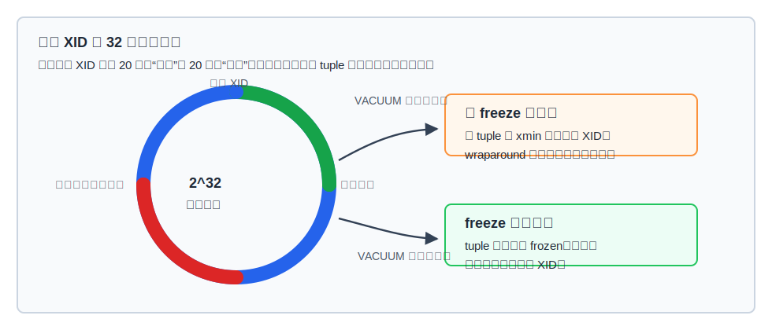
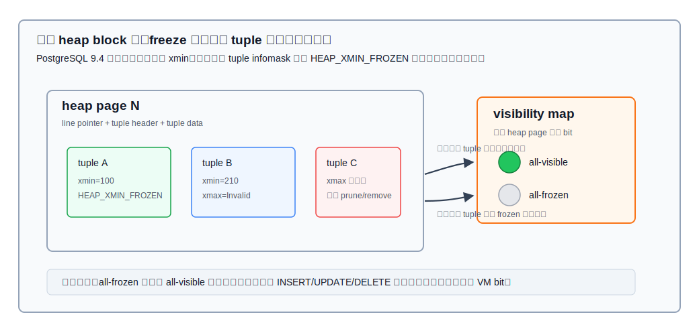
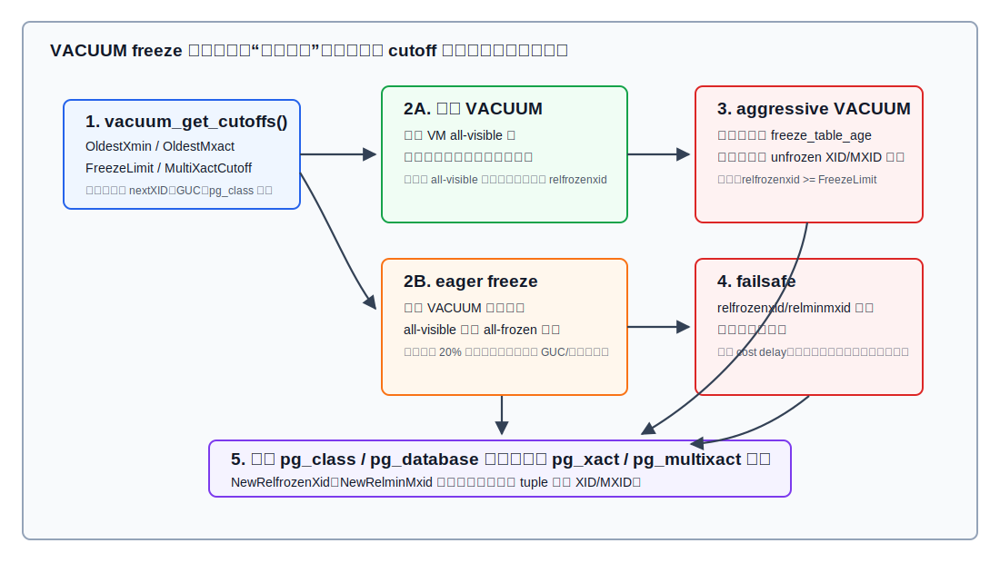
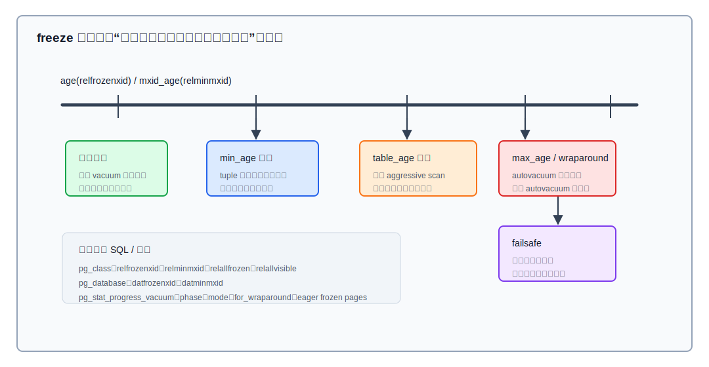

## 数据库筑基课 - freeze

### 作者
digoal

### 日期
2026-06-08

### 标签
PostgreSQL , 应用开发者 , 数据库筑基课 , freeze , VACUUM , MVCC , wraparound , visibility map     

----

## 背景
   


本文属于数据库筑基课里的“维护机制 + 表存储可见性”主题。`freeze` 经常被误解成“把表冻住”或“类似归档压缩”。在 PostgreSQL 里，它更准确地说是：`VACUUM` 把已经足够老、对所有当前和未来事务都可见的 tuple 事务信息标记为 frozen，从而让系统不再依赖这些旧 XID 的普通环形比较和 `pg_xact` 状态保留。

本地 `markdown/` 目录没有发现独立的“数据库筑基课大纲”文件；已有同系列文章使用“未发现大纲文件则说明”的写法，因此本文沿用这个约定。后续如果项目补充课程目录，可以在这里加上大纲链接。

本文以本地 PostgreSQL 源码目录 `postgres` 为主，DeepWiki repoName `postgres/postgres` 仅作为架构索引。本次通过 DeepWiki 定位到 `VACUUM and Database Maintenance` 相关摘要，关键事实均回到本地官方文档和源码验证，主要包括：

- 官方文档：`doc/src/sgml/maintenance.sgml`、`storage.sgml`、`config.sgml`、`catalogs.sgml`、`pgvisibility.sgml`、`monitoring.sgml`、`xact.sgml`。
- 源码：`src/backend/commands/vacuum.c`、`src/backend/access/heap/vacuumlazy.c`、`heapam.c`、`pruneheap.c`、`visibilitymap.c`，以及 `src/include/commands/vacuum.h`、`src/include/access/heapam.h`。
- 项目 codebase 说明：`postgres/CLAUDE.md`。

## 一、它解决什么问题？

PostgreSQL 的 MVCC 依赖 tuple 头部的 `xmin`、`xmax` 来判断行版本是否对当前快照可见。问题在于普通事务 ID 是 32 位环形空间。官方维护文档说明：普通 XID 计数器大约每 40 多亿个事务回绕一次；对任意普通 XID 来说，约有 20 亿个 XID 被视为“过去”，约有 20 亿个 XID 被视为“未来”。如果一个很老的 tuple 仍保留普通 `xmin`，当 XID 计数器绕回来后，它可能突然被判断成“未来事务写入”，结果就是旧数据不可见。

这就是 transaction ID wraparound 风险。数据页还在，但可见性判断错了；对业务来说，这和灾难性数据丢失没有区别。

`freeze` 解决的是这个根问题：当某个 tuple 的创建事务已经足够久远，且其提交效果必然对所有当前和未来事务可见，PostgreSQL 不再让普通 XID 环形比较决定它的可见性，而是把它标记成 frozen。frozen tuple 被视为早于所有普通 XID。

代价也很直接：

- 需要周期性 `VACUUM` 扫描 heap page。
- 冻结 tuple 会修改 heap page，产生 WAL 和脏页。
- 如果太晚才处理，会触发 aggressive VACUUM、anti-wraparound autovacuum，甚至 failsafe，影响业务 IO 和延迟。
- 如果太早冻结，刚冻结的行又被更新，前面的冻结工作就被浪费。



图 1 说明：普通 XID 的比较是环形的，长期运行的数据库不能无限保留旧 tuple 的普通事务身份。freeze 的本质不是锁定数据，而是把“这个 tuple 的插入事务已经永远在过去”这个事实固化到 tuple 可见性元数据里。

## 二、它是什么？

一句话定义：`freeze` 是 `VACUUM` 对 heap tuple 事务字段进行的可见性元数据老化处理，用来防止 XID/MultiXact wraparound，并允许 `pg_xact`、`pg_multixact` 的旧状态文件被安全截断。

涉及几个关键对象：

| 对象 | 含义 | freeze 中的作用 |
|---|---|---|
| `xmin` | 创建 tuple 的 XID | 旧且已提交时，可通过 `HEAP_XMIN_FROZEN` 标记为 frozen |
| `xmax` | 删除、更新或锁定 tuple 的 XID/MultiXact | 旧 lock-only 或已无意义的状态可被清理；必要时保留 updater XID |
| `relfrozenxid` | `pg_class` 中表级最老未冻结 XID 边界 | 表内早于它的 XID 应已被冻结或移除 |
| `relminmxid` | `pg_class` 中表级最老 MultiXact 边界 | 表内早于它的 MXID 应已被替换或移除 |
| `datfrozenxid` | `pg_database` 中库级冻结边界 | 取库内表 `relfrozenxid` 的下界，用于 wraparound 与 `pg_xact` 截断 |
| visibility map | 每 heap page 两个 bit：all-visible、all-frozen | all-frozen 页连 anti-wraparound VACUUM 也可跳过 |

官方文档还指出一个容易混淆的历史点：PostgreSQL 9.4 以前，冻结会实际把行的插入 XID 替换成 `FrozenTransactionId`；新版本通常设置 tuple flag，同时保留原始 `xmin` 供取证和排障使用。因此你不能只看 `xmin` 数值判断 tuple 是否已经 frozen。



图 2 说明：freeze 的粒度从 tuple 开始，但运维效果常以 page 和 relation 为单位体现。tuple 被处理后，如果一个 heap page 上所有 tuple 都冻结，VACUUM 可以设置 visibility map 的 all-frozen bit；这个 bit 使后续 anti-wraparound VACUUM 可以跳过该页。

## 三、核心原理

### 1. VACUUM 先计算 cutoff

`src/backend/commands/vacuum.c` 的 `vacuum_get_cutoffs()` 是 freeze 决策的入口。它读取：

- 当前 relation 的 `relfrozenxid`、`relminmxid`。
- `OldestXmin`：低于它的已提交删除事务可被视为 DEAD。
- `OldestMxact`：低于它的 MultiXact 不会被运行中事务看见。
- 当前 `nextXID`、`nextMXID`。
- GUC 或 VACUUM 参数里的 freeze age。

然后计算：

- `FreezeLimit = nextXID - vacuum_freeze_min_age`，且不允许晚于 `OldestXmin`。
- `MultiXactCutoff = nextMXID - vacuum_multixact_freeze_min_age`，且不允许晚于 `OldestMxact`。

源码注释明确说：aggressive VACUUM 至少必须把 `relfrozenxid` 推进到 `FreezeLimit`，把 `relminmxid` 推进到 `MultiXactCutoff`。

### 2. tuple freeze 不是简单改 xmin

`src/backend/access/heap/heapam.c` 的 `heap_prepare_freeze_tuple()` 会检查 tuple 的 `xmin`、`xmax`、历史 `xvac`，生成 freeze plan。核心规则包括：

- 如果 `xmin` 是普通 XID 且早于 `OldestXmin`，准备设置 `HEAP_XMIN_FROZEN`。
- 如果 `xmax` 是旧的普通 XID，需要确认它是可移除的 lock-only 或已中止更新，才能清理成 invalid。
- 如果 `xmax` 是 MultiXact，进入 `FreezeMultiXactId()`，可能删除 lock-only multi，可能保留 updater XID，也可能重建一个只包含仍需保留成员的新 MultiXact。
- 如果发现 tuple 中有早于当前 `relfrozenxid` 或 `relminmxid` 的值，源码会报数据损坏错误，而不是继续推进边界。

这说明 freeze 的目标不是“把所有字段清零”，而是在不破坏可见性、锁语义、HOT 链和 standby 冲突语义的前提下，移除不再需要的旧事务依赖。

### 3. page prune 与 freeze 绑定执行

`src/backend/access/heap/pruneheap.c` 的 `heap_page_prune_and_freeze()` 把页面剪枝、死 tuple 标记、freeze plan、VM bit 设置放在同一个页面处理框架里。它会跟踪：

- `nfrozen`：冻结的 tuple 数。
- `set_all_visible`：页面是否可设 all-visible。
- `set_all_frozen`：页面是否可设 all-frozen。
- `newest_live_xid`：用于可见性和冲突判断。

这也是为什么 `VACUUM` 不是只做一件事。一次 heap scan 可能同时完成：剪 HOT 链、把 DEAD item 变为可回收空间、记录 dead TID 供索引清理、冻结旧 tuple、设置 visibility map。

### 4. visibility map 是跳过 heap page 的依据

`src/backend/access/heap/visibilitymap.c` 的文件头写得很清楚：VM 每个 heap page 两个 bit，all-visible 表示页面所有 tuple 对所有事务可见，all-frozen 表示页面所有 tuple 完全冻结。all-frozen 必须建立在 all-visible 之上。

VM 是保守结构：

- bit 未设置，不代表页面一定不满足条件，只代表系统不能确定。
- bit 设置，系统会依赖它跳过 VACUUM 或支持 index-only scan；如果错误设置，可能导致错误结果或数据损坏。
- 数据修改会清除相关 VM bit；设置 VM bit 必须和让页面满足条件的 WAL/heap page 修改保持崩溃安全关系。

### 5. normal、eager、aggressive、failsafe 四条路径

`src/backend/access/heap/vacuumlazy.c` 把 heap VACUUM 描述成三阶段：heap scan、index vacuum、heap reaping。但从 freeze 角度，更重要的是扫描策略：

- 普通 VACUUM：主要扫描可能有死 tuple 的页，通常可跳过 all-visible 页。因此普通 VACUUM 不保证冻结表内所有旧 XID。
- eager freeze：普通 VACUUM 在满足条件时，额外扫描一部分 all-visible 但未 all-frozen 的页，提前减少下一次 aggressive VACUUM 的压力。源码中成功 eager freeze 有内部上限：最多约为开始时 all-visible 但非 all-frozen 页数量的 20%；失败率由 `vacuum_max_eager_freeze_failure_rate` 控制。
- aggressive VACUUM：当 `relfrozenxid` 或 `relminmxid` 年龄达到 table age 阈值时触发，必须扫描所有可能含未冻结 XID/MXID 的页，目标是推进表级冻结边界。
- failsafe：当表的 `relfrozenxid` 或 `relminmxid` 已经危险地落后，VACUUM 会进入保命模式，跳过非必要维护，例如索引清理、relation truncation 和 cost delay，优先推进冻结边界。



图 3 说明：freeze 不是一个孤立开关，而是一组从 cutoff 计算到 page scan 策略再到 catalog 边界推进的闭环。最关键的安全约束是：最终写入 `pg_class.relfrozenxid` 和 `pg_class.relminmxid` 的值，不能越过任何仍留在 tuple 中的 XID/MXID。

## 四、横向对比

| 维度 | PostgreSQL freeze | 普通 VACUUM 空间回收 | VACUUM FULL / rewrite | 只依赖无限事务 ID |
|---|---|---|---|---|
| 主要目标 | 防止 XID/MXID wraparound，推进冻结边界 | 清理死 tuple、维护 FSM/VM、更新统计 | 重写表文件、紧缩物理空间 | 理论上避免 wraparound 问题 |
| 是否重写整表 | 否，修改被扫描页面的 tuple 元数据 | 否 | 是 | 不适用 |
| 对业务影响 | IO、WAL、可能触发 autovacuum 压力 | IO、索引清理、可能影响缓存 | 锁重、空间峰值高、耗时长 | 需要更宽 tuple/状态结构或兼容层 |
| 可跳过页面 | 可用 all-frozen 跳过 | 可用 all-visible 跳过 | 通常不能按 VM 跳过重写 | 不适用 |
| 关键风险 | 太晚导致 anti-wraparound/failsafe；太早可能浪费 | 清理跟不上导致 bloat | 长时间阻塞和磁盘峰值 | 不是 PostgreSQL 当前设计 |
| 运维指标 | `age(relfrozenxid)`、`mxid_age(relminmxid)`、VM all-frozen | dead tuples、bloat、VACUUM 进度 | 锁等待、磁盘空间、重写进度 | 无直接 PostgreSQL 对应项 |

这个对比的重点是：freeze 不是空间压缩工具，也不是 `VACUUM FULL` 的轻量版。它的第一性目标是让 MVCC 的时间边界持续向前移动。空间回收是普通 VACUUM 的重要工作，但 freeze 解决的是更底层的事务 ID 生命周期问题。

## 五、效果如何？

收益：

- 避免普通 32 位 XID wraparound 导致的可见性灾难。
- 推进 `relfrozenxid`、`relminmxid`、`datfrozenxid`、`datminmxid`，让 `pg_xact` 和 `pg_multixact` 旧段有机会截断。
- all-frozen 页能被后续 aggressive VACUUM 跳过，降低大表周期性维护峰值。
- 对静态或 append-mostly 表，freeze 完成后维护成本会显著下降，因为大量页面可保持 all-frozen。

代价：

- 修改 heap page，会产生 WAL、脏页和 buffer 压力。
- eager freeze 如果冻完后页面很快又被更新，前面的工作会浪费。
- aggressive VACUUM 可能扫描大表中大量页面，影响 IO 峰值。
- 太高的 `autovacuum_freeze_max_age` 会增加 `pg_xact` 和 `pg_commit_ts` 保留空间；官方维护文档给出典型估算：默认 2 亿事务约对应 50MB `pg_xact`，如果调到 20 亿，`pg_xact` 约半 GB，开启 commit timestamp 时 `pg_commit_ts` 还会明显增长。

## 六、实操 DEMO

以下 SQL 用于在已有 PostgreSQL 实例中观察 freeze 边界。本文没有连接本地 PostgreSQL 服务执行这些语句，因此不提供伪造输出。

### 1. 找出 XID 年龄靠前的表

```sql
SELECT
    c.oid::regclass AS table_name,
    age(c.relfrozenxid) AS xid_age,
    mxid_age(c.relminmxid) AS mxid_age,
    c.relpages,
    c.relallvisible,
    c.relallfrozen
FROM pg_class AS c
WHERE c.relkind IN ('r', 'm', 't')
ORDER BY age(c.relfrozenxid) DESC
LIMIT 20;
```

### 2. 观察库级冻结边界

```sql
SELECT
    datname,
    age(datfrozenxid) AS database_xid_age,
    mxid_age(datminmxid) AS database_mxid_age
FROM pg_database
ORDER BY age(datfrozenxid) DESC;
```

### 3. 主动执行冻结型 VACUUM

```sql
VACUUM (VERBOSE, FREEZE) public.some_large_static_table;
```

`VACUUM (FREEZE)` 会使用更激进的冻结参数，但仍然不是 `VACUUM FULL`，不会为了紧缩文件而重写整表。生产环境不要把它当作日常默认命令；它更适合导入后静态大表、维护窗口、或明确要提前推进冻结边界的场景。

### 4. 使用 pg_visibility 检查 VM

如果安装了 `pg_visibility` 扩展，可以观察 all-visible/all-frozen 页面数量：

```sql
CREATE EXTENSION IF NOT EXISTS pg_visibility;

SELECT *
FROM pg_visibility_map_summary('public.some_large_static_table'::regclass);
```

如果怀疑 VM 损坏，可以使用 `pg_check_frozen()` 查找 VM 标记 all-frozen 但实际存在非 frozen tuple 的 TID。这个检查会访问 heap，比只读 VM 昂贵，不应在高峰期随意扫大表。



图 4 说明：freeze 运维不是只看一个阈值。表级年龄、库级年龄、XID/MXID 消耗速度、all-frozen 覆盖率、autovacuum 进度和长事务阻塞源要放在一起看。

## 七、最佳实践

### 数据库架构师

把 freeze 当成容量和生命周期设计的一部分，而不是故障后才处理的清理任务：

- 高事务吞吐系统要估算 XID 消耗速度：每天事务数越高，freeze 维护窗口越短。
- append-mostly 大表适合在批量导入后安排 `VACUUM (FREEZE)`，让页面尽快进入 all-frozen 状态。
- 多租户或多库实例要看最老数据库的 `datfrozenxid`，不要只看单个业务库的健康状态。
- 如果有大量 row lock、外键检查、`SELECT FOR UPDATE`，要同时关注 MultiXact，不能只看 XID。

### DBA

不要等 anti-wraparound autovacuum 才开始处理：

- 定期查询 `age(relfrozenxid)`、`mxid_age(relminmxid)` 排名前列的表。
- 对静态大表，观察 `relallfrozen / relpages`，判断是否已经形成稳定的 all-frozen 覆盖。
- 查长事务、prepared transaction、逻辑复制 slot、长时间 idle in transaction，它们会拖住 `OldestXmin`，使 VACUUM 不能安全清理或冻结。
- `autovacuum_freeze_max_age` 不是越大越好。调大能减少强制 vacuum 频率，但会扩大 `pg_xact` 和可能的 `pg_commit_ts` 保留空间。
- 看到 failsafe 相关 warning 时，不要只加大内存参数；还要检查 VACUUM 是否长期追不上 XID/MXID 分配速度。

### 业务开发者

freeze 风险通常是应用行为长期累积出来的：

- 避免长事务和长时间 `idle in transaction`。
- 批处理脚本不要把海量修改放进一个超长事务里；分批提交能降低可见性边界被拖住的时间。
- 频繁 `SELECT FOR UPDATE` 或外键热点更新会产生 MultiXact 压力，需要和 DBA 一起观察 `relminmxid`。
- 对一次性导入后长期只读的数据，可以和 DBA 约定导入完成后的 `VACUUM (FREEZE)` 窗口。

## 八、适合与不适合场景

适合主动关注 freeze 的场景：

- 7x24 高 TPS OLTP 系统。
- append-mostly 日志、账单、行为明细、时序数据。
- 大量静态历史分区表。
- 有逻辑复制、长事务、prepared transaction 或慢报表查询的系统。
- 使用外键、行锁、队列表导致 MultiXact 增长较快的系统。

不适合简单粗暴处理的场景：

- 高峰期对全库大表执行 `VACUUM (FREEZE)`。这可能把平滑的后台维护变成前台 IO 峰值。
- 把 `autovacuum_freeze_max_age` 调到很高却不评估 `pg_xact`、`pg_commit_ts` 空间和维护窗口。
- 因为害怕 autovacuum 而关闭 autovacuum。文档明确说明防 wraparound 的 autovacuum 即使 autovacuum 被禁用也会触发。
- 用 `VACUUM FULL` 代替 freeze。它解决的是物理重写和空间紧缩，不是日常 XID 生命周期维护。

## 九、常见坑

1. 只看表大小，不看 XID 年龄。小表如果长期不 vacuum，也可能成为 `datfrozenxid` 的拖累。

2. 认为普通 VACUUM 一定会冻结所有旧 tuple。普通 VACUUM 通常会跳过 all-visible 页，所以可能留下 all-visible 但未 all-frozen 的 backlog。

3. 把 all-visible 和 all-frozen 混为一谈。all-visible 支持跳过普通清理和 index-only scan；all-frozen 才能让 anti-wraparound VACUUM 跳过该页。

4. 忽略 MultiXact。`relminmxid`、`datminmxid` 老化同样会触发 aggressive vacuum 和 failsafe。

5. 长事务拖住 `OldestXmin`。只调 autovacuum 参数不能解决被长事务、prepared transaction、复制 slot 挡住的问题。

6. 误删 `pg_xact` 或 `pg_multixact` 文件。这些目录由 VACUUM 根据冻结边界安全截断，人工删除可能直接破坏可见性判断。

7. 看到 failsafe 后只关注索引膨胀。failsafe 的设计目标是避免 wraparound，它会故意跳过部分非必要维护；后续仍可能需要补做索引清理和空间治理。

## 十、扩展问题

1. 为什么 PostgreSQL 选择 32 位普通 XID 加 freeze，而不是所有地方都直接使用 64 位事务 ID？

2. 如果一个系统几乎只做 INSERT，不做 UPDATE/DELETE，为什么仍然需要 VACUUM？

3. 对按月分区的历史表，什么时候应该在 detach/archive 前执行 `VACUUM (FREEZE)`？

4. `relfrozenxid` 可以推进，但为什么 `OldestXmin` 被长事务拖住时，dead tuple 仍不能及时清理？

5. 如果 visibility map 的 all-frozen bit 错误设置，为什么会同时影响 VACUUM 安全性和查询正确性？

## 十一、扩展阅读

- PostgreSQL 官方文档：`doc/src/sgml/maintenance.sgml`，章节 `Preventing Transaction ID Wraparound Failures`。
- PostgreSQL 官方文档：`doc/src/sgml/storage.sgml`，章节 `Visibility Map`。
- PostgreSQL 官方文档：`doc/src/sgml/config.sgml`，参数 `vacuum_freeze_min_age`、`vacuum_freeze_table_age`、`vacuum_failsafe_age`、`autovacuum_freeze_max_age`、`vacuum_max_eager_freeze_failure_rate` 以及 MultiXact 对应参数。
- PostgreSQL 官方文档：`doc/src/sgml/catalogs.sgml`，`pg_class.relfrozenxid`、`pg_class.relminmxid`、`pg_database.datfrozenxid`、`pg_database.datminmxid`。
- PostgreSQL 官方文档：`doc/src/sgml/pgvisibility.sgml`，`pg_visibility`、`pg_visibility_map_summary()`、`pg_check_frozen()`。
- PostgreSQL 源码：`src/backend/commands/vacuum.c`，`vacuum_get_cutoffs()`、`vacuum_xid_failsafe_check()`、`vac_update_relstats()`、`vac_update_datfrozenxid()`。
- PostgreSQL 源码：`src/backend/access/heap/vacuumlazy.c`，heap VACUUM 三阶段、eager freeze、aggressive VACUUM、failsafe。
- PostgreSQL 源码：`src/backend/access/heap/heapam.c`，`heap_prepare_freeze_tuple()`、`FreezeMultiXactId()`。
- PostgreSQL 源码：`src/backend/access/heap/pruneheap.c`，`heap_page_prune_and_freeze()`。
- PostgreSQL 源码：`src/backend/access/heap/visibilitymap.c`，VM two-bit 设计和崩溃安全约束。
- DeepWiki：`postgres/postgres` 的 `VACUUM and Database Maintenance` 页面，用作架构索引；本文关键结论以本地源码和官方文档为准。
  
## 附录 
1、克隆代码  
```  
git clone --depth 1 https://github.com/postgres/postgres
```  
  
2、启用 codex, 使用 [数据库筑基课 skill](../skills/README.md).  
```
文章标题: 
  数据库筑基课 - freeze
项目源码(本地目录): 
  postgres
项目 codebase 文件名: 
  postgres/CLAUDE.md 
开源项目相关的 deepwiki repoName: 
  postgres/postgres
```
    
#### [PostgreSQL 解决方案集合](../201706/20170601_02.md "40cff096e9ed7122c512b35d8561d9c8")
  
  
#### [德哥 / digoal's Github - 公益是一辈子的事.](https://github.com/digoal/blog/blob/master/README.md "22709685feb7cab07d30f30387f0a9ae")
  
  
#### [About 德哥](https://github.com/digoal/blog/blob/master/me/readme.md "a37735981e7704886ffd590565582dd0")
  
  

  
