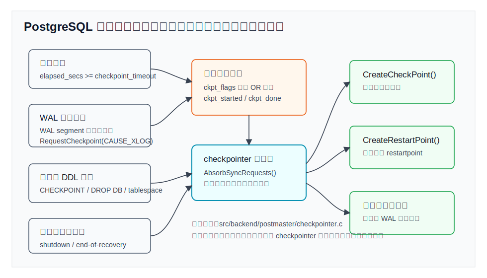
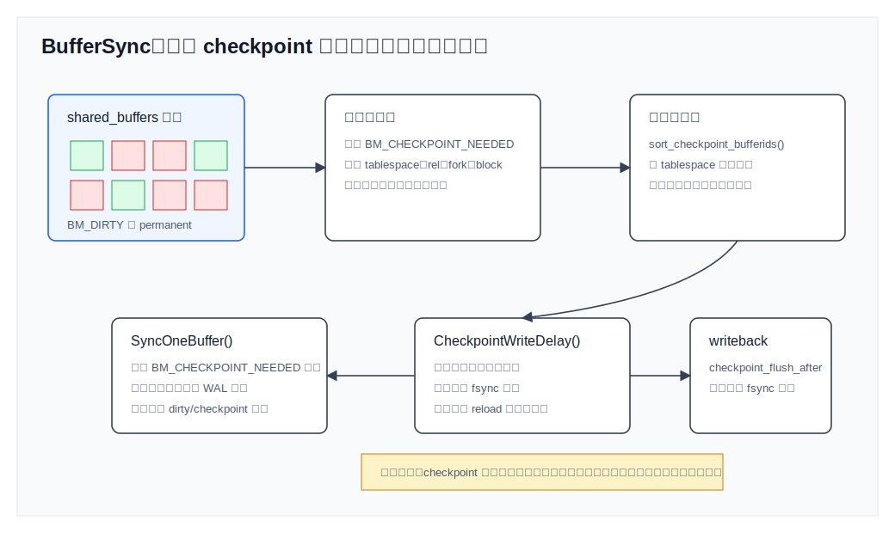
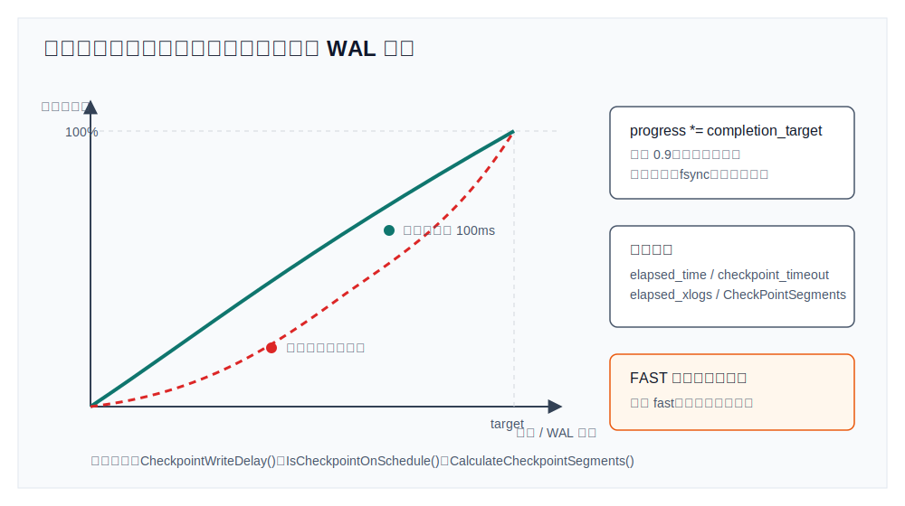
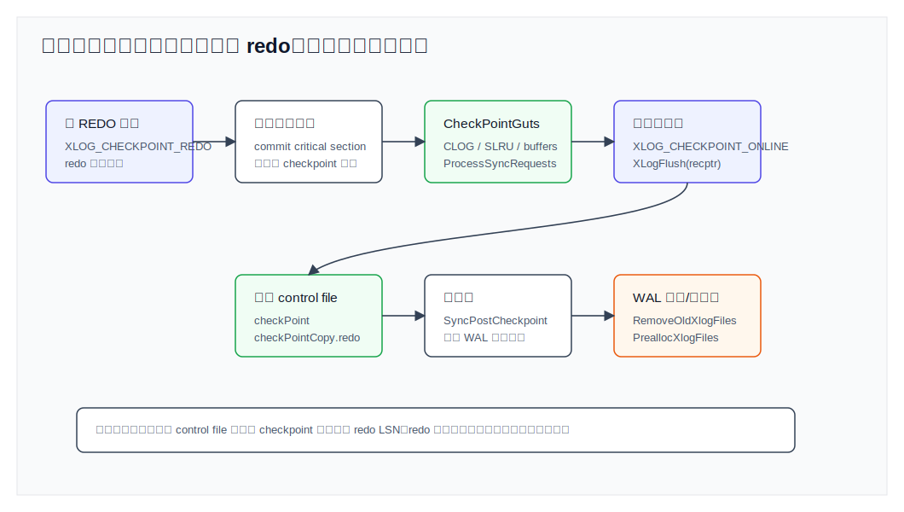
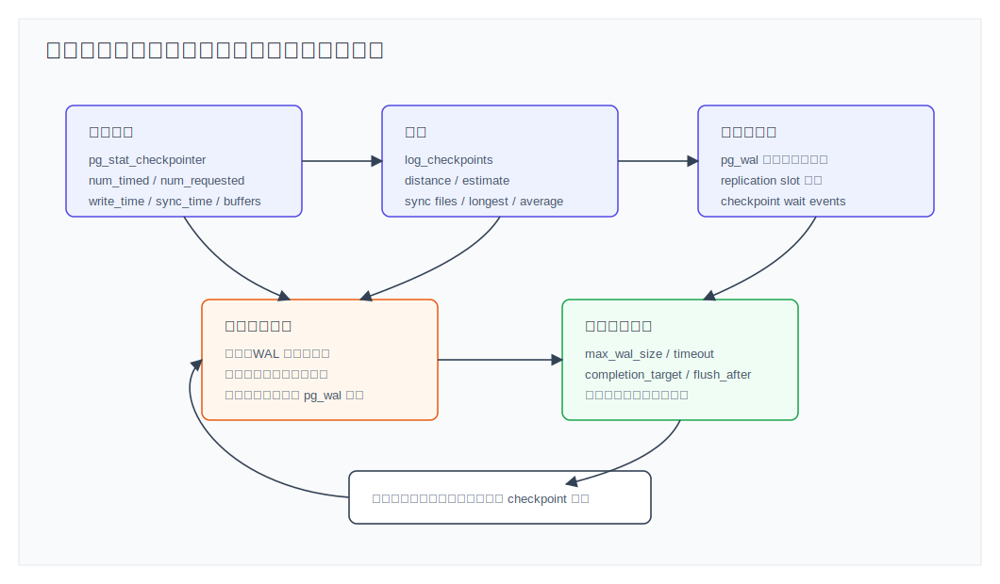

## 数据库筑基课 - 检查点调度

### 作者
digoal

### 日期
2026-06-08

### 标签
PostgreSQL , 应用开发者 , 数据库筑基课 , checkpoint , checkpointer , WAL , shared_buffers , 恢复     

----

## 背景
   


这篇属于数据库筑基课里的“维护机制 + 存储可靠性 + 性能诊断”主题。前面已经讲过 WAL、shared buffer、WAL flush、control file、增量备份等基础点，本文追一个生产系统更常见的问题：**检查点不是“把脏页刷一下盘”，而是数据库在恢复时间、WAL 空间、前台延迟和后台 I/O 之间做调度。**

本地 `markdown/` 目录没有发现独立的“数据库筑基课大纲”文件，所以本文不强行引用不存在的大纲；后续如果项目补充课程目录，可以在这里补上链接。

先看几个真实场景：

- 批量导入、建索引或高频更新期间，日志反复出现 `checkpoints are occurring too frequently`，提示增大 `max_wal_size`。
- 业务没有明显慢 SQL，但每隔一段时间延迟抖一下，`log_checkpoints` 显示 checkpoint 的 `sync` 或 `write` 时间很长。
- `pg_wal` 目录持续变大，DBA 以为 `max_wal_size` 是硬上限，结果发现复制槽、归档、备份和 checkpoint 都会影响保留边界。
- 为了缩短故障恢复时间，把 `checkpoint_timeout` 调得很小，结果 WAL 反而变多，写 I/O 更重。
- 手工执行 `CHECKPOINT` 后系统 I/O 被打满，才发现默认手工 checkpoint 是 fast 模式。

本文以用户提供的本地 PostgreSQL 源码目录 `postgres` 为事实依据。重要结论优先引用官方文档和源码：`postgres/CLAUDE.md`、`doc/src/sgml/wal.sgml`、`doc/src/sgml/config.sgml`、`doc/src/sgml/monitoring.sgml`、`doc/src/sgml/ref/checkpoint.sgml`、`src/backend/postmaster/checkpointer.c`、`src/backend/access/transam/xlog.c`、`src/backend/storage/buffer/bufmgr.c`、`src/backend/storage/sync/sync.c`、`src/backend/utils/misc/guc_parameters.dat`。DeepWiki repoName `postgres/postgres` 本次用于架构线索核对；其返回的关键点已回到本地源码和官方 SGML 文档验证。

## 一、它解决什么问题？

检查点调度解决三个问题。

第一，**限定崩溃恢复要重放多少 WAL**。官方文档 `wal.sgml` 说明，checkpoint 是 WAL 序列中的一个点：在这个点之前写入的信息已经反映到 heap 和 index 数据文件中；崩溃恢复会从最新 checkpoint 记录里的 redo record 开始 REDO。没有 checkpoint，恢复可能要从很久以前的 WAL 开始扫，恢复时间不可控。

第二，**限定旧 WAL 什么时候可以回收或删除**。checkpoint 完成后，早于 redo record 所在段之前的 WAL 通常不再为 crash recovery 所需，可以被回收或删除；但归档、复制槽、备份和保留策略仍可能要求继续保存。也就是说，checkpoint 给 WAL 生命周期提供一个重要边界，但不是唯一边界。

第三，**把昂贵的刷脏页工作摊开**。checkpoint 要写出当时已经脏的共享缓冲页，还要 fsync 相关文件。如果把这些 I/O 集中到一个短时间窗口，前台事务、读写缓存和操作系统 page cache 都可能被冲击。因此 PostgreSQL 用 `checkpoint_completion_target` 把写脏页节流到一个目标区间内完成。

代价也必须正视：

- checkpoint 太频繁：更频繁写脏页；在 `full_page_writes=on` 时，每个 checkpoint 后页面第一次修改会产生 full-page image，WAL 量会增加。
- checkpoint 太稀疏：崩溃后需要重放更多 WAL；`pg_wal` 空间和归档压力增加。
- checkpoint 太急：短时间写出大量数据页和 fsync，前台延迟容易抖。
- checkpoint 太慢：可能追不上 WAL 消耗，`max_wal_size` 被短期峰值突破，或者下一轮 checkpoint 过早到来。

所以检查点调度不是“越少越好”或“越快越好”，而是要匹配恢复目标、写入速率、存储能力和复制/归档边界。

## 二、它是什么？

PostgreSQL 的检查点调度可以拆成四层：

1. **触发层**：时间触发、WAL 消耗触发、手工 `CHECKPOINT`、关闭、恢复结束、某些 DDL 或维护命令请求。
2. **合并层**：后端不直接执行常规 checkpoint，而是通过共享内存里的 `ckpt_flags` 请求 checkpointer；多个请求按位 OR 合并，强请求不会被弱请求覆盖。
3. **执行层**：checkpointer 调 `CreateCheckPoint()`；恢复期间是 restartpoint；单用户模式下可由当前进程直接执行。
4. **节流层**：`BufferSync()` 写 checkpoint 开始时已脏的共享缓冲页，每写一批后调用 `CheckpointWriteDelay()`，根据时间进度和 WAL 消耗进度决定睡眠或追赶。

关键术语：

- `checkpointer`：专门负责 checkpoint/restartpoint 的辅助进程。源码入口是 `src/backend/postmaster/checkpointer.c` 的 `CheckpointerMain()`。
- `checkpoint_timeout`：自动 checkpoint 的最大时间间隔，默认 5 分钟，源码变量 `CheckPointTimeout`。
- `max_wal_size`：WAL 消耗触发 checkpoint 的主要空间参数，但不是磁盘硬上限。
- `checkpoint_completion_target`：checkpoint 写脏页目标完成位置，默认 0.9。
- `checkpoint_flush_after`：checkpoint 写出一定数据后尝试推动 OS writeback，减少末尾 fsync 抖动。
- `redo LSN`：恢复从哪里开始 REDO 的 WAL 位置。
- `BM_CHECKPOINT_NEEDED`：buffer manager 给本轮 checkpoint 需要写出的 buffer 打的标记。



图 1 说明：checkpoint 请求可能来自时间、WAL 消耗、手工命令、关闭和恢复边界。后端通常只是设置请求标志并唤醒 checkpointer；checkpointer 把多个请求合并后决定执行 checkpoint、restartpoint 或跳过空闲 checkpoint。

## 三、核心原理

### 3.1 checkpointer 主循环：时间触发和请求触发

`src/backend/postmaster/checkpointer.c` 文件开头说明：checkpointer 从 PostgreSQL 9.2 起负责处理所有 checkpoints；时间条件由 checkpointer 自己判断，WAL 段填充条件由后端在填充 WAL 时发信号请求。

`CheckpointerMain()` 的主循环做几件事：

1. 清理 latch。
2. 调 `AbsorbSyncRequests()` 吸收后端提交的 fsync 请求。
3. 处理信号和配置 reload。
4. 看共享内存 `ckpt_flags` 是否非零，有请求就做 checkpoint。
5. 计算 `elapsed_secs = now - last_checkpoint_time`，超过 `CheckPointTimeout` 就设置 `CHECKPOINT_CAUSE_TIME`。
6. 如果要执行，取出并清空 `ckpt_flags`，增加 `ckpt_started`，通知等待者。
7. 根据 `RecoveryInProgress()` 决定做 `CreateCheckPoint()` 还是 `CreateRestartPoint()`。
8. 完成后设置 `ckpt_done`，通知等待者，更新统计。

这里有两个细节很重要。

第一，`last_checkpoint_time` 记录的是 checkpoint 开始时间，而不是结束时间。源码注释解释这样可以让时间驱动的 checkpoint 以可预测间隔发生。如果用结束时间，写得越慢，下一轮越往后漂，恢复窗口会变得更难预测。

第二，checkpoint 可能被跳过。`CreateCheckPoint()` 会检查 `last_important_lsn` 是否等于当前 control file 的 checkpoint 位置；如果没有 WAL 活动需要 checkpoint，且不是 shutdown、end-of-recovery 或 force，就返回 false。官方监控文档也提醒：`pg_stat_checkpointer.num_timed`、`num_requested` 会计入完成和跳过的 checkpoint，而 `num_done` 只统计真正完成的 checkpoint。

### 3.2 WAL 消耗触发：为什么 `max_wal_size` 不是硬上限？

WAL 消耗触发不是 checkpointer 自己不断扫描 `pg_wal` 目录。`xlog.c` 的 `XLogWrite()` 在写满 WAL segment 时，会判断 `XLogCheckpointNeeded(openLogSegNo)`；如果 WAL 距离超过阈值，就调用：

```c
RequestCheckpoint(CHECKPOINT_CAUSE_XLOG);
```

触发阈值由 `CalculateCheckpointSegments()` 计算：

```c
target = ConvertToXSegs(max_wal_size_mb, wal_segment_size)
         / (1.0 + CheckPointCompletionTarget);
CheckPointSegments = (int) target;
```

这个公式背后的意思是：不能等 WAL 已经接近 `max_wal_size` 才开始 checkpoint，因为 checkpoint 运行期间系统还在继续产生 WAL。默认 `checkpoint_completion_target=0.9` 时，系统大致假设 checkpoint 期间还会产生 0.9 个 checkpoint 周期的 WAL，于是提前触发。

举个纯公式例子：如果 `wal_segment_size=16MB`、`max_wal_size=1GB`，对应 64 个 WAL segment；默认 target 0.9，则触发距离约为 `floor(64 / 1.9) = 33` 个 segment。它不是说 `pg_wal` 永远最多 1GB，而是给 checkpoint 期间继续产生的 WAL 留空间。

这也解释了一个常见误解：`max_wal_size` 是 checkpoint 触发和 WAL 回收策略的重要参数，但不是所有情况下的磁盘硬上限。短期 WAL 峰值、归档滞后、复制槽保留、备份、`wal_keep_size`、故障恢复等因素都可能让 `pg_wal` 临时超过它。

### 3.3 手工 CHECKPOINT：fast 与 spread 的差异

`ExecCheckpoint()` 是手工 `CHECKPOINT` 的入口。它会检查权限：只有超级用户或有 `pg_checkpoint` 角色权限的用户可以执行。

在本文本地 `postgres` master 源码中，`CHECKPOINT` 文档和实现都支持：

```sql
CHECKPOINT [ ( option [, ...] ) ]

-- option:
FLUSH_UNLOGGED [ boolean ]
MODE { FAST | SPREAD }
```

`MODE FAST` 是默认值，会设置 `CHECKPOINT_FAST`，要求尽快完成，跳过常规节流；`MODE SPREAD` 则请求像系统调度的常规 checkpoint 那样摊开 I/O。这里要注意版本边界：这份本地源码是 `master` 分支，提交为 `01a80f0`，源码文档里有 PostgreSQL 19 相关 release 条目。生产环境请以对应版本文档为准，不要把本文本地 master 语法直接套到较旧版本。

### 3.4 CreateCheckPoint：在线 checkpoint 为什么有两个 WAL 记录？

`CreateCheckPoint()` 的注释把在线 checkpoint 的顺序讲得很清楚。

在线 checkpoint 开始时，PostgreSQL 先插入 `XLOG_CHECKPOINT_REDO` 记录。这个记录的位置成为新的 redo pointer。之后 checkpointer 可以花很长时间刷脏页，期间其他事务仍然可以继续插入 WAL。等所有必须落盘的数据完成后，再插入 `XLOG_CHECKPOINT_ONLINE` 记录，它指回前面的 redo 记录，并 flush 这个 checkpoint 完成记录。

关闭 checkpoint 不同。shutdown 时没有并发 WAL 插入，因此只需要 `XLOG_CHECKPOINT_SHUTDOWN` 一个记录，它既标记 checkpoint 完成，也可以作为恢复起点。

这个设计的关键是并发性：在线 checkpoint 不应长时间阻塞所有 WAL 插入。它只在确定 redo 指针、读取关键共享状态等短窗口拿锁，真正耗时的刷脏页阶段允许前台继续工作。

### 3.5 CheckPointGuts：不只写 heap/index 页

`CheckPointGuts()` 是常规 checkpoint 和 restartpoint 共用的“刷盘核心”。它依次处理：

- relation map；
- replication slots；
- logical decoding snapshot build；
- logical rewrite heap；
- replication origin；
- CLOG / CommitTs / SUBTRANS / MultiXact / predicate 等 SLRU 或事务相关状态；
- shared buffer pool；
- queued fsync requests；
- two-phase state。

所以 checkpoint 不是“只写 heap/index 脏页”。它还把事务状态、复制和逻辑解码相关的恢复边界纳入同一个持久化闭环。

### 3.6 BufferSync：为什么只写本轮开始时已经脏的页？

`src/backend/storage/buffer/bufmgr.c` 的 `BufferSync()` 是 checkpoint 写共享缓冲区的核心路径。它先扫描全部 `NBuffers`，找出符合条件的脏页，设置 `BM_CHECKPOINT_NEEDED`，并把 buffer id、tablespace、relation、fork、block 记录到数组。

源码注释强调：这样做是为了只写 checkpoint 开始时已经脏的页面，而不是追逐 checkpoint 进行过程中又被弄脏的页面。否则高写入负载下，checkpoint 可能永远结束不了。

然后 `BufferSync()` 会：

1. 按表空间、relation、fork、block 对待写 buffer 排序，减少随机 I/O。
2. 为每个 tablespace 维护进度，用二叉堆在多个表空间之间平衡写入，避免单个表空间被连续打满。
3. 对仍然有 `BM_CHECKPOINT_NEEDED` 的 buffer 调 `SyncOneBuffer()`。
4. 每处理一个 buffer 后调用 `CheckpointWriteDelay(flags, progress)`。
5. 最后发出 pending writebacks，更新 checkpoint 统计。

默认情况下，常规 checkpoint 不写 unlogged relation 的脏 buffer；shutdown、end-of-recovery 或显式 `CHECKPOINT (FLUSH_UNLOGGED true)` 这类路径才会写 unlogged buffers。临时表不参与 checkpoint。



图 2 说明：checkpoint 开始时先“冻结”本轮要写的 buffer 集合，用 `BM_CHECKPOINT_NEEDED` 打标。后续新变脏的页不属于本轮，这保证 checkpoint 有明确终点。排序和平衡写入减少随机 I/O 和表空间倾斜；每处理一页都会进入节流判断。

### 3.7 CheckpointWriteDelay：节流看两个进度

`CheckpointWriteDelay()` 的职责是控制 `BufferSync()` 的写速率，使 checkpoint 尽量命中 `checkpoint_completion_target`。

如果不是 fast checkpoint、没有关闭请求、没有新的 fast 请求，并且 `IsCheckpointOnSchedule(progress)` 判断“当前进度领先或合适”，checkpointer 会：

- 处理配置 reload；
- 吸收 fsync 请求；
- 检查 `archive_timeout`；
- 汇报中间统计；
- 等待 100ms。

如果落后，就不睡，继续写。

`IsCheckpointOnSchedule()` 的判断不是只看时间。它先把 `progress` 乘以 `CheckPointCompletionTarget`，再和两个维度比较：

- `elapsed_xlogs = (当前 WAL 位置 - checkpoint 开始 WAL 位置) / CheckPointSegments`；
- `elapsed_time = checkpoint 已运行时间 / CheckPointTimeout`。

只要写脏页进度落后于 WAL 消耗或时间进度，就认为不在计划内，需要追赶。这就是为什么 checkpoint 节流不是固定睡眠，也不是简单按页数匀速写：WAL 产生速度变快时，checkpointer 会更积极。



图 3 说明：`checkpoint_completion_target` 把“完成进度”缩放成目标曲线。进度领先时可以睡眠，落后于时间或 WAL 消耗时就追赶。fast checkpoint 会绕过这个节流，可能造成更高瞬时 I/O。

### 3.8 ProcessSyncRequests：为什么写完还要 fsync？

checkpoint 写数据页通常只是把数据交给内核，真正的持久化还要处理 fsync。PostgreSQL 让后端把需要 fsync 的文件请求排队，checkpointer 在 checkpoint 期间不断 `AbsorbSyncRequests()`，并在 `ProcessSyncRequests()` 里处理。

`sync.c` 的注释说明了一个关键竞态：某个 buffer 可能在 `BufferSync()` 访问它之前，已经被后端写出并清除 dirty bit。只要该后端在清 dirty 前提交了 fsync 请求，checkpointer 在 `BufferSync()` 之后再 `AbsorbSyncRequests()`，就不会漏掉本轮 checkpoint 必须 fsync 的文件。

为避免 checkpoint 永远处理新来的 fsync 请求，`ProcessSyncRequests()` 用 `sync_cycle_ctr` 区分本轮旧请求和本轮开始后新来的请求。新请求留到下一轮处理。

`checkpoint_flush_after` 处理的是另一个层面：checkpoint 写出一定数据后尝试推动 OS writeback，减少大量 dirty page 堆在内核 page cache，最后 fsync 时集中停顿。但文档也提醒，它可能降低某些 workload 性能，特别是工作集大于 `shared_buffers` 但小于 OS page cache 的情况。

### 3.9 完成阶段：control file、WAL 回收和统计

`CreateCheckPoint()` 在 `CheckPointGuts()` 完成后，会插入 checkpoint 完成记录并 `XLogFlush(recptr)`。随后在 critical section 里更新 control file：

- `ControlFile->checkPoint = ProcLastRecPtr`；
- `ControlFile->checkPointCopy = checkPoint`；
- 清理 `minRecoveryPoint`；
- 持久化 `unloggedLSN` 等状态。

之后执行：

- `SyncPostCheckpoint()`；
- `UpdateCheckPointDistanceEstimate(RedoRecPtr - PriorRedoPtr)`；
- `KeepLogSeg()`、`RemoveOldXlogFiles()`；
- `PreallocXlogFiles()`；
- `TruncateSUBTRANS()`；
- `LogCheckpointEnd()` 和统计更新。

`UpdateCheckPointDistanceEstimate()` 用的是带峰值偏好的移动估计：如果本周期 WAL 距离超过估计值，立即抬高；如果低于估计值，只按 0.90/0.10 慢慢降低。这解释了为什么 `pg_wal` 文件回收和预分配对短期峰值比较敏感，而不是只看长期平均。



图 4 说明：在线 checkpoint 不是一个原子大锁。它先写 redo 记录，允许并发 WAL 插入，再刷数据和状态文件，最后写 checkpoint 完成记录、flush WAL、更新 control file，并根据新的 redo 边界回收或预分配 WAL。

## 四、横向对比

### 4.1 checkpoint、bgwriter、后端写脏页、OS writeback

| 维度 | checkpointer checkpoint | background writer | 后端自己写脏页 | OS writeback |
|---|---|---|---|---|
| 主要目标 | 建立恢复边界，写出本轮 checkpoint 需要的脏页并 fsync | 提前清理部分脏页，减少后端分配 buffer 时被迫写 | 在 buffer 淘汰、关系扩展或特定路径中保证可用 buffer | 把内核 page cache 中的脏页写回存储 |
| 是否决定 redo 起点 | 是 | 否 | 否 | 否 |
| 是否处理 fsync 请求闭环 | 是，`ProcessSyncRequests()` | 否，主要写页面 | 写出后提交 fsync 请求 | 不理解数据库恢复边界 |
| 写哪些页 | checkpoint 开始时已脏且符合条件的共享 buffer | 根据 buffer 分配压力写一部分 | 当前路径需要写的页 | 内核认为需要写回的页 |
| 对前台影响 | 过急会造成 I/O 和 fsync 抖动 | 配得合理可降低前台写脏页概率 | 直接影响当前会话延迟 | 可能造成不可控抖动 |
| 调参重点 | `checkpoint_timeout`、`max_wal_size`、`checkpoint_completion_target`、`checkpoint_flush_after` | `bgwriter_delay`、`bgwriter_lru_maxpages`、`bgwriter_lru_multiplier` | SQL 写入模式、事务大小、shared_buffers | OS 和存储层参数 |

原因在于 checkpoint 的职责带有恢复语义：它不仅写文件，还要证明“redo 之前的数据修改已经不需要 WAL 重放”。bgwriter 和 OS writeback 可以帮忙降低脏页压力，但不能替代 checkpoint。

### 4.2 不同 checkpoint 类型

| 维度 | 时间触发 checkpoint | WAL 触发 checkpoint | 手工 fast checkpoint | 手工 spread checkpoint | restartpoint |
|---|---|---|---|---|---|
| 触发原因 | `checkpoint_timeout` 到期 | WAL 消耗接近阈值 | 用户执行 `CHECKPOINT` 默认 fast | 本地 master 支持 `CHECKPOINT (MODE SPREAD)` | 恢复期间到达可用 checkpoint 记录 |
| I/O 形态 | 通常按 target 摊开 | WAL 压力高时可能更积极追赶 | 尽快完成，抖动风险高 | 尽量摊开 | 类似 checkpoint，但受已回放 WAL 中 checkpoint 记录限制 |
| 统计字段 | `num_timed` | `num_requested`，并带 `CAUSE_XLOG` | `num_requested` | `num_requested` | `restartpoints_*` |
| 常见用途 | 正常自动调度 | 写入高峰保护 WAL 空间 | 维护窗口、测试、某些 DDL/备份前后 | 降低手工 checkpoint 瞬时 I/O | standby/recovery 恢复边界 |
| 主要风险 | 间隔太短增加 FPI 和刷盘 | `max_wal_size` 太小导致频繁触发 | 生产高峰手工执行会冲击 I/O | 版本兼容性要核对 | standby 可能超过 `max_wal_size` 一个周期左右 |

## 五、效果如何？

检查点调度的效果不能靠一个 TPS 数字概括，应该从四组指标看。

第一，**恢复窗口**。`checkpoint_timeout` 和 `max_wal_size` 越大，通常 checkpoint 越少，崩溃恢复需要扫描和重放的 WAL 越多。适合吞吐优先、能接受较长恢复时间的系统；不适合 RTO 很紧的系统。

第二，**写 I/O 平滑度**。`checkpoint_completion_target=0.9` 的默认值把写脏页摊到接近整个 checkpoint 间隔，但给 checkpoint 末尾的 fsync 和其他工作留余量。把它调低通常会使 checkpoint 期间写 I/O 更集中；调到 1.0 看似更平滑，但官方文档提醒很可能无法按时完成。

第三，**WAL 量和 `pg_wal` 空间**。checkpoint 越频繁，在 `full_page_writes=on` 时 full-page image 越多；`max_wal_size` 越大，WAL 触发 checkpoint 越不频繁，但 `pg_wal` 可能保留更多文件。`min_wal_size` 则决定系统至少回收多少 WAL 文件供未来使用。

第四，**尾部 fsync 抖动**。如果 `log_checkpoints` 显示 `sync`、`longest` 很高，可能是大量写出页堆在 OS page cache 后由 checkpoint 末尾 fsync 集中兑现。`checkpoint_flush_after` 可以减少这类停顿，但要用真实 workload 验证，因为它可能削弱 OS page cache 的合并效果。

一个判断公式：

```text
预计写脏页目标时间 ~= checkpoint_timeout * checkpoint_completion_target
WAL 触发距离 ~= max_wal_size_segments / (1 + checkpoint_completion_target)
```

这两个公式不是性能承诺，只是调度目标。真实执行还受 WAL 生成速率、脏页数量、存储带宽、fsync 延迟、归档、复制槽和前台 I/O 竞争影响。

## 六、实操 DEMO

以下 SQL 是最小可验证实验。本文没有在本地启动 PostgreSQL 实例执行，因此不提供伪造输出；你可以在测试库执行并记录自己的结果。

### 6.1 查看当前 checkpoint 参数

```sql
SELECT name, setting, unit, context, source
FROM pg_settings
WHERE name IN (
  'checkpoint_timeout',
  'checkpoint_completion_target',
  'checkpoint_flush_after',
  'checkpoint_warning',
  'max_wal_size',
  'min_wal_size',
  'log_checkpoints'
)
ORDER BY name;
```

### 6.2 查看 checkpointer 累计统计

```sql
SELECT *
FROM pg_stat_checkpointer;
```

重点看：

- `num_timed`：时间触发次数；
- `num_requested`：请求触发次数，常见包括 WAL 消耗、手工 checkpoint 等；
- `num_done`：真正完成的 checkpoint 次数；
- `write_time`：写文件阶段累计耗时；
- `sync_time`：fsync 阶段累计耗时；
- `buffers_written`、`slru_written`：checkpoint 写出的共享 buffer 和 SLRU buffer 数。

### 6.3 打开 checkpoint 日志

```sql
ALTER SYSTEM SET log_checkpoints = on;
SELECT pg_reload_conf();
```

然后观察日志中的：

```text
checkpoint starting: ...
checkpoint complete: ... wrote ... buffers ... write=... sync=... total=...
distance=... estimate=... lsn=... redo lsn=...
```

不要只看 `total`。如果 `write` 高，说明写脏页压力重；如果 `sync` 或 `longest` 高，说明 fsync 尾部延迟值得关注；如果 `distance` 接近或频繁超过估计，要结合写入峰值和 `max_wal_size` 分析。

### 6.4 手工触发 checkpoint

通用写法：

```sql
CHECKPOINT;
```

在本文本地 PostgreSQL master 源码中还支持：

```sql
CHECKPOINT (MODE SPREAD);
CHECKPOINT (MODE FAST);
CHECKPOINT (FLUSH_UNLOGGED true);
```

生产版本是否支持这些选项，以对应版本官方文档为准。不要在业务高峰把手工 `CHECKPOINT` 当成常规优化手段。

### 6.5 关联 WAL 触发压力

```sql
SELECT pg_current_wal_insert_lsn(),
       pg_current_wal_lsn(),
       pg_current_wal_flush_lsn();

SELECT slot_name, active, restart_lsn, wal_status, safe_wal_size
FROM pg_replication_slots;
```

如果 `pg_wal` 空间很大，不能只看 checkpoint。复制槽、归档失败、备份、standby 滞后都会改变 WAL 保留边界。

## 七、最佳实践

### 面向数据库架构师

1. 先定义 RTO，再定义 checkpoint 区间。低 RTO 系统不能只追求减少 checkpoint；高吞吐系统也不能把恢复窗口放到无人负责。
2. 把 `pg_wal` 容量按峰值 WAL 速率、归档延迟、复制槽滞后和至少一个 checkpoint 周期规划，不要按 `max_wal_size` 一个参数规划磁盘。
3. 高写入系统优先通过批量提交、减少无效更新、降低索引维护压力、拆分冷热数据来减少脏页和 WAL，而不是只调大 checkpoint 参数。
4. 对同步复制系统，把 checkpoint、WAL flush、归档和 standby replay 分开建模；checkpoint 不是复制延迟的唯一来源。

### 面向 DBA

1. 打开 `log_checkpoints` 做基线，至少观察完整业务高峰和低峰周期。
2. 如果日志频繁提示 checkpoint 太密，先看是否 WAL 触发，再考虑增大 `max_wal_size`；同时检查批量任务、归档、复制槽和大事务。
3. 如果 checkpoint 的 `sync` 时间尖刺明显，再评估 `checkpoint_flush_after`，并结合 `pg_stat_io`、系统 iostat、云盘指标验证。
4. 不建议把 `checkpoint_completion_target` 调低来“更快完成”，除非你明确接受 checkpoint 期间更高瞬时 I/O。
5. 调整 `checkpoint_timeout` 或 `max_wal_size` 后，至少观察一个完整 checkpoint 周期，不要只看参数 reload 后几分钟。
6. 手工 `CHECKPOINT` 应用于维护边界和验证，不应用于日常“清理内存”。

### 面向业务开发者

1. 批量导入和大更新要安排节奏。单次大事务会集中制造 WAL 和脏页，checkpoint 后果会延迟体现。
2. 避免无意义 UPDATE。即使值不变，很多路径也可能产生行版本、WAL 和脏页。
3. 大批量写入前和 DBA 对齐 `max_wal_size`、归档带宽、复制延迟和维护窗口。
4. 不要在应用代码里执行 `CHECKPOINT`。这属于实例级维护动作，不是业务事务的一部分。



图 5 说明：checkpoint 调参应从 `pg_stat_checkpointer`、`log_checkpoints`、`pg_wal` 空间、归档/复制状态和等待事件出发。先判断是过密、过急还是过长，再选择参数和业务侧改造。

## 八、适合与不适合场景

### 更长 checkpoint 间隔适合

- 写入吞吐优先，存储带宽足够，但能接受更长崩溃恢复时间的系统。
- 批量导入、批量建索引、数据仓库加载这类短期 WAL 峰值明显的场景。
- `full_page_writes=on` 且频繁 checkpoint 导致 WAL 膨胀明显的系统。

不适合：

- RTO 很紧、崩溃后必须快速恢复服务的核心交易库。
- `pg_wal` 磁盘空间很紧、归档和复制槽保留已经有压力的系统。

### 更短 checkpoint 间隔适合

- 恢复时间比写入吞吐更重要的系统。
- 写入量稳定且存储能承受较频繁 checkpoint 的小型业务库。

不适合：

- 高更新、高随机写、大量页面首次修改的系统。频繁 checkpoint 会增加 full-page image 和刷盘压力。
- 存储 fsync 延迟不稳定的环境。更频繁 checkpoint 会更频繁暴露尾部抖动。

### 更高 `checkpoint_completion_target` 适合

- 希望 checkpoint 写 I/O 更均匀的 OLTP 系统。
- 存储对短时写峰值敏感，但整体带宽可支撑后台持续写的环境。

不适合：

- 已经经常追不上 WAL 消耗的系统。
- 把 target 调到 1.0 并期待完全无抖动的场景。官方文档不建议高于 0.9，因为 checkpoint 还包含非写脏页工作。

## 九、常见坑

1. **把 `max_wal_size` 当硬上限。** 它用于触发 checkpoint 和回收策略，但短期峰值、复制槽、归档、备份和恢复都可能让 `pg_wal` 超过它。
2. **看到 checkpoint_warning 就只调一个参数。** 这个警告只针对 WAL 填充导致的 checkpoint 过密。根因可能是批量任务、过多索引、无效更新、事务粒度或归档/复制压力。
3. **把 `checkpoint_timeout` 调小来追求安全。** 恢复时间可能缩短，但 full-page image 和刷脏页频率会上升。
4. **把手工 `CHECKPOINT` 当日常优化。** 默认 fast checkpoint 会尽快完成，可能制造明显 I/O 峰值。
5. **忽略空闲跳过。** 时间到了不代表一定有真实 checkpoint；没有重要 WAL 活动时可能跳过，所以监控要区分 `num_timed` 和 `num_done`。
6. **只看 buffers_written，不看 sync_time。** 写出页数不大也可能因为单个文件 fsync 很慢造成抖动。
7. **以为 bgwriter 能替代 checkpoint。** bgwriter 可以提前写部分脏页，但不建立 redo 边界，也不处理完整 fsync 闭环。
8. **不看 unlogged/temporary 边界。** 常规 checkpoint 不写 unlogged 脏 buffer，临时表不参与 checkpoint；关闭、恢复结束或显式选项路径不同。
9. **调参不考虑复制槽和归档。** checkpoint 完成不等于所有旧 WAL 都能删。
10. **只在低峰测试 checkpoint。** 低峰 `write` 和 `sync` 很漂亮，不代表批量写入峰值时仍然稳定。

## 十、扩展问题

1. 为什么在线 checkpoint 要先写 `XLOG_CHECKPOINT_REDO`，最后再写 `XLOG_CHECKPOINT_ONLINE`？
2. 为什么 `BufferSync()` 只写 checkpoint 开始时已经脏的 buffer，而不是把运行期间新脏的也写完？
3. `checkpoint_completion_target` 越高为什么不一定越好？
4. 为什么 WAL 触发距离要除以 `1 + checkpoint_completion_target`？
5. `num_requested` 增长很快但 `num_done` 增长较慢，可能意味着什么？
6. 如果 `log_checkpoints` 中 `sync` 很高但 `write` 不高，应该优先怀疑哪一层？
7. standby 上的 restartpoint 为什么可能比 primary 上的 checkpoint 更难严格控制在 `max_wal_size` 内？
8. 在 `full_page_writes=on` 的系统里，checkpoint 频率怎样影响 WAL 量？

## 十一、扩展阅读

- `postgres/CLAUDE.md`：本地 PostgreSQL 项目结构和构建说明。
- `postgres/doc/src/sgml/wal.sgml`：checkpoint 定义、触发条件、节流、恢复、WAL 文件回收和 restartpoint。
- `postgres/doc/src/sgml/config.sgml`：`checkpoint_timeout`、`checkpoint_completion_target`、`checkpoint_flush_after`、`checkpoint_warning`、`max_wal_size`、`min_wal_size`。
- `postgres/doc/src/sgml/monitoring.sgml`：`pg_stat_checkpointer` 字段、checkpoint/restartpoint 统计含义。
- `postgres/doc/src/sgml/ref/checkpoint.sgml`：`CHECKPOINT` 命令、权限、`MODE`、`FLUSH_UNLOGGED` 选项。注意本文本地源码为 master 分支，生产环境以对应版本文档为准。
- `postgres/src/backend/postmaster/checkpointer.c`：`CheckpointerMain()`、`CheckpointWriteDelay()`、`IsCheckpointOnSchedule()`、`RequestCheckpoint()`、`ExecCheckpoint()`。
- `postgres/src/backend/access/transam/xlog.c`：`CalculateCheckpointSegments()`、`CreateCheckPoint()`、`CheckPointGuts()`、checkpoint WAL 记录、control file 更新、WAL 回收/预分配。
- `postgres/src/backend/storage/buffer/bufmgr.c`：`BufferSync()`、`CheckPointBuffers()`、`BM_CHECKPOINT_NEEDED`、checkpoint 写脏页排序和平衡。
- `postgres/src/backend/storage/sync/sync.c`：`ProcessSyncRequests()`、fsync request 吸收、sync cycle 边界。
- `postgres/src/backend/utils/misc/guc_parameters.dat` 和 `postgres/src/backend/utils/misc/postgresql.conf.sample`：GUC 默认值、上下文和单位。
- DeepWiki：`postgres/postgres`，本次查询 “In PostgreSQL, how are checkpoints scheduled and throttled?”，用于定位架构主题和相关源码路径；关键事实仍以上述本地源码和官方文档为准。

  
## 附录 
1、克隆代码  
```  
git clone --depth 1 https://github.com/postgres/postgres
```  
  
2、启用 codex, 使用 [数据库筑基课 skill](../skills/README.md).  
```
文章标题: 
  数据库筑基课 - 检查点调度
项目源码(本地目录): 
  postgres
项目 codebase 文件名: 
  postgres/CLAUDE.md 
开源项目相关的 deepwiki repoName: 
  postgres/postgres
```
    
#### [PostgreSQL 解决方案集合](../201706/20170601_02.md "40cff096e9ed7122c512b35d8561d9c8")
  
  
#### [德哥 / digoal's Github - 公益是一辈子的事.](https://github.com/digoal/blog/blob/master/README.md "22709685feb7cab07d30f30387f0a9ae")
  
  
#### [About 德哥](https://github.com/digoal/blog/blob/master/me/readme.md "a37735981e7704886ffd590565582dd0")
  
  

  
