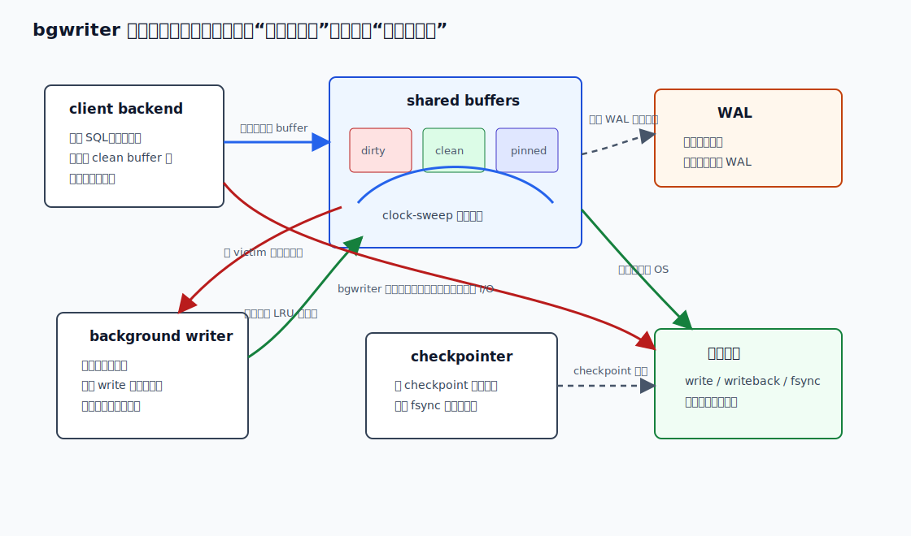
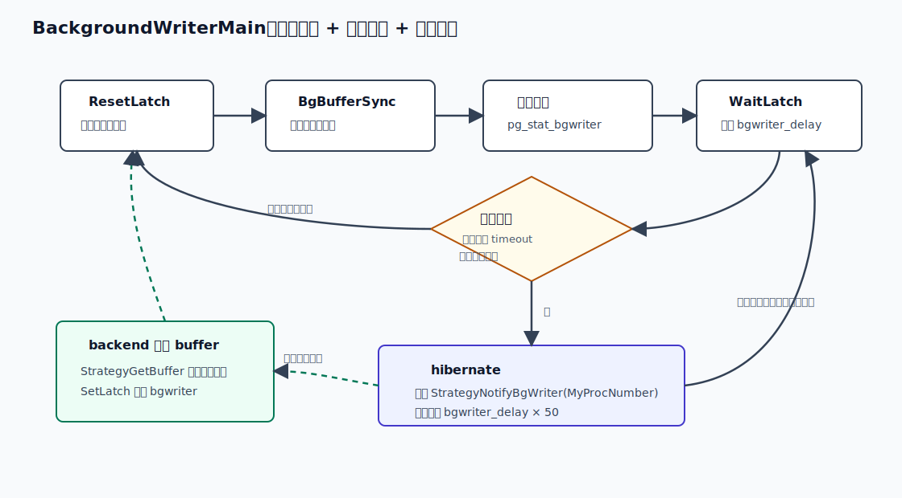
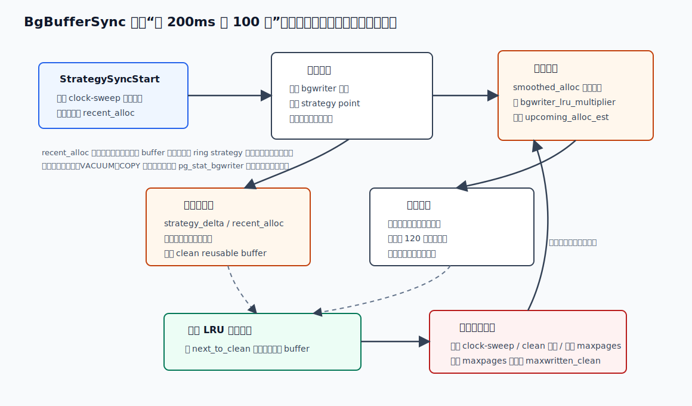
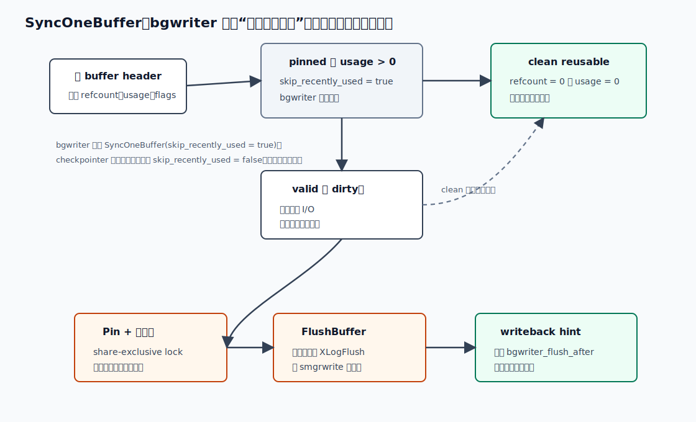
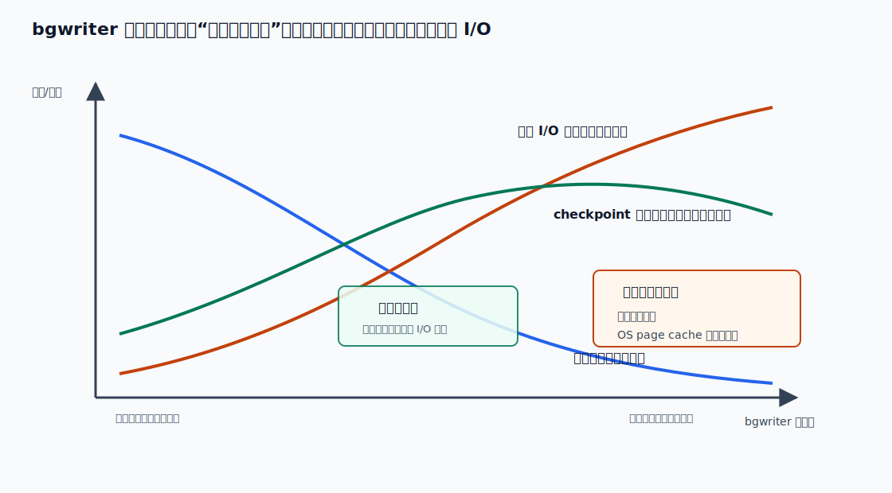
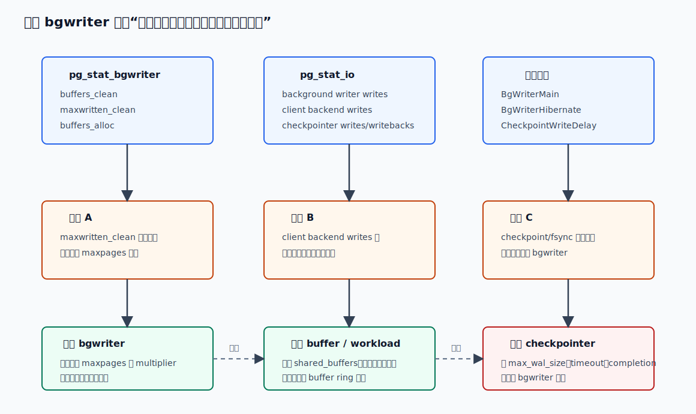

## 数据库筑基课 - bgwriter 调度

### 作者
digoal

### 日期
2026-06-08

### 标签
PostgreSQL , 应用开发者 , 数据库筑基课 , bgwriter , shared_buffers , checkpoint , I/O , 维护机制     

----

## 背景
   


这篇属于数据库筑基课里的“存储管理 + 维护机制 + 性能诊断”主题。前面的 shared buffer、WAL、wal buffer、wal flush、checkpoint 文章已经把“页面怎么进共享内存、修改怎么变成 WAL、什么时候必须刷盘”讲过了。本文聚焦一个更容易被误解的后台进程：`bgwriter`。

本地 `markdown/` 目录没有发现独立的“数据库筑基课大纲”文件，所以本文不强行引用不存在的大纲；后续如果项目补充课程目录，可以在这里补上链接。

生产里常见的现象是：业务 SQL 偶发抖动，`iostat` 看到写 I/O 起伏，DBA 第一反应是“后台写太慢”或“checkpoint 太猛”。但 PostgreSQL 的写出路径并不是一个后台进程全包了。`bgwriter`、普通 backend、`checkpointer`、WAL writer、操作系统 page cache 和存储设备分别处在不同边界。调 `bgwriter` 之前，必须先回答三个问题：

1. `bgwriter` 到底替谁写？
2. 它什么时候醒来、写多少、扫到哪里停？
3. 怎么判断是 `bgwriter` 不够，还是 shared buffers、checkpoint、WAL flush 或 workload 本身的问题？

## 一、它解决什么问题？

PostgreSQL 的表和索引页面先进入 `shared_buffers`。后端执行 SQL 时，如果需要读一个不在共享缓冲区里的页面，就要找一个可替换的 buffer。理想情况下，这个 victim buffer 是干净的，后端可以直接复用；如果 victim 是脏页，后端就必须先把它写出，再把新页面读进来。这个写出发生在用户请求路径上，会直接放大查询或写入延迟。

`bgwriter` 解决的就是这个问题：**提前把一部分“将来可能被替换”的脏 shared buffer 写到文件系统，使它们重新变成 clean reusable buffer，减少普通 backend 在分配 buffer 时被迫同步写脏页的概率。**

代价也很明确：如果一个热页在一个 checkpoint 周期内被多次修改，原本可能只需要在 checkpoint 或后端淘汰时写一次；`bgwriter` 过于激进时，可能把同一页反复提前写出，增加总 I/O。PostgreSQL 官方文档也直接提示：background writer 会增加总体 I/O 负载，因为同一页在同一个 checkpoint interval 内可能被多次写出。

所以 `bgwriter` 不是越勤快越好。它本质是在做延迟和 I/O 总量之间的交换：

- 写得太少：用户请求更容易撞上脏 victim buffer，backend writes 增多，尾延迟上升。
- 写得太多：后台写 I/O 增多，热页可能重复写，OS page cache 和存储队列压力上升。
- 写得合适：把不可预测的用户路径写等待，转移成相对平滑的后台写出。



图 1 说明：`bgwriter` 只负责提前清理 shared buffers 里的一部分 LRU 候选脏页；普通 backend 在 buffer replacement 路径上仍然有权写脏页；`checkpointer` 负责 checkpoint 边界上的脏页写出和持久化收口。PostgreSQL 9.2 之后，`bgwriter` 不再处理 checkpoints。

## 二、它是什么？

`bgwriter` 是 PostgreSQL 的一个辅助进程，进程类型是 `background writer`。源码入口是 `src/backend/postmaster/bgwriter.c` 的 `BackgroundWriterMain()`。它周期性调用 `BgBufferSync()`，根据 shared buffer 替换策略的状态，向前扫描一段 buffer descriptor，找出“当前可复用、有效、脏”的 buffer，把它们写出并标记为 clean。

几个核心术语先定清楚：

| 术语 | 含义 | 和 bgwriter 的关系 |
|---|---|---|
| dirty buffer | shared buffer 中有新修改，尚未写到数据文件的页面 | `bgwriter` 的主要写出对象 |
| clean reusable buffer | 没有脏数据、没有 pin、usage count 为 0 的 buffer | `bgwriter` 想提前准备的供给 |
| clock-sweep | PostgreSQL 默认 buffer replacement 策略，用 circular pointer 找 victim | `bgwriter` 沿着 clock-sweep 的当前位置提前扫描，但不推进替换指针 |
| recent_alloc | 最近一轮普通 buffer 分配数量 | `BgBufferSync()` 用它估算下一轮需要多少 clean reusable buffer |
| `bgwriter_lru_maxpages` | 每轮最多写多少个 buffer | 上限，命中后 `maxwritten_clean` 增加 |
| `bgwriter_lru_multiplier` | 对最近 buffer 需求的放大倍数 | 越大越激进，越小越保守 |
| `bgwriter_delay` | 两轮活动之间的基础 sleep 时间 | 默认 200ms，配置范围 10-10000ms |
| `bgwriter_flush_after` | 累积写出到一定页数后，请求 OS writeback | Linux 默认常见 512kB，非 Linux 默认 0，平台相关 |

注意一个边界：`bgwriter` 的 `write()` 不是 checkpoint 的 `fsync()`。写到文件系统和保证持久化不是同一件事。`FlushBuffer()` 会遵守 WAL 先写规则，永久关系的数据页写出前会先 `XLogFlush()` 到该页 LSN；但 checkpoint 的持久化收口仍然是 checkpointer 的职责。

## 三、核心原理

### 3.1 主循环：固定节拍和空闲休眠

`BackgroundWriterMain()` 的主循环很短，核心顺序是：

1. `ResetLatch(MyLatch)` 清理旧唤醒信号。
2. `ProcessMainLoopInterrupts()` 处理 SIGHUP、shutdown 等事件。
3. 调用 `BgBufferSync(&wb_context)` 执行一轮 shared buffer 清理。
4. 调用 `pgstat_report_bgwriter()` 和 `pgstat_report_wal(true)` 上报统计。
5. 如 checkpoint 后第一次返回主循环，清理 smgr 对象。
6. 在物理复制相关场景中定期 `LogStandbySnapshot()`。
7. `WaitLatch(..., BgWriterDelay, WAIT_EVENT_BGWRITER_MAIN)` 等待下一轮。

如果上一轮和这一轮都显示系统基本无 buffer 分配活动，并且 WaitLatch 是 timeout 醒来，bgwriter 会进入 hibernation：先调用 `StrategyNotifyBgWriter(MyProcNumber)` 注册“下次 buffer allocation 时叫醒我”，然后等待 `BgWriterDelay * HIBERNATE_FACTOR`。源码里 `HIBERNATE_FACTOR` 是 50，所以默认 `bgwriter_delay=200ms` 时，最长休眠约 10 秒。这个休眠不是永久的：普通 backend 在 `StrategyGetBuffer()` 分配 buffer 时会看到通知请求并 `SetLatch()` 唤醒 bgwriter；即使错过唤醒，也会因 timeout 再醒。



图 2 说明：`bgwriter_delay` 只是基础节拍，不代表进程永远每 200ms 都活跃写页。空闲系统中它会进入更长睡眠；一旦有普通 buffer allocation，backend 会通过 latch 唤醒它。这个设计避免空闲系统频繁 wakeup，同时尽量不让反馈控制长期失真。

### 3.2 调度输入：clock-sweep 位置和 buffer 分配速度

`BgBufferSync()` 的第一步是调用 `StrategySyncStart(&strategy_passes, &recent_alloc)`。这个函数读取 buffer replacement 策略的共享状态：

- `nextVictimBuffer`：clock-sweep 下一次考虑的 buffer 位置。
- `completePasses`：clock-sweep 完整绕过 buffer pool 的次数。
- `numBufferAllocs`：最近一次 bgwriter 读取以来，普通替换路径发生的 buffer allocation 数量；读取后清零。

这里的“普通替换路径”很重要。`freelist.c` 里明确注释：使用 strategy object 回收 ring buffer 的分配，不计入 `numBufferAllocs`。也就是说，顺序扫描、VACUUM、COPY 等使用 buffer ring 的路径，不会完整地体现在 `recent_alloc` 里。它们可能仍然造成 I/O 压力，但不能简单从 `pg_stat_bgwriter.buffers_alloc` 反推全部页面活动。

### 3.3 反馈控制：估计下一轮需要多少 clean buffer

`BgBufferSync()` 维护两个跨轮的平滑变量：

- `smoothed_alloc`：最近 buffer allocation 的平滑值。源码采用“快升慢降”：如果本轮 `recent_alloc` 更大，立刻跟上；如果更小，按 `smoothing_samples=16` 慢慢下降。
- `smoothed_density`：扫描多少个 buffer 大约能得到一个 reusable buffer。它来自 `strategy_delta / recent_alloc`，也会平滑更新。

然后它计算：

```text
upcoming_alloc_est = smoothed_alloc * bgwriter_lru_multiplier
```

如果这个估计太低，还会加上一个最低巡检量。源码里 `scan_whole_pool_milliseconds = 120000.0`，即使系统没什么分配，bgwriter 也会按大约 120 秒扫描完整个 buffer pool 的节奏，慢慢清掉可复用脏页，避免空闲后 buffer pool 里留下太多脏候选页。

最后进入扫描循环：

```text
从 next_to_clean 向前扫描
  如果追上 clock-sweep：停
  如果已有足够 reusable buffer：停
  如果本轮写出达到 bgwriter_lru_maxpages：停，并增加 maxwritten_clean
```



图 3 说明：调度核心不是“每轮固定写 N 页”，而是“根据最近的 buffer 消耗速度和可复用 buffer 密度，估计下一轮需求，再受 `bgwriter_lru_maxpages` 截断”。因此 `maxwritten_clean` 持续增长时，说明经常不是需求已经满足，而是写到上限被迫停下。

### 3.4 单页处理：只写可复用候选脏页

`BgBufferSync()` 通过 `SyncOneBuffer(next_to_clean, true, wb_context)` 处理单个候选 buffer。第二个参数 `skip_recently_used=true` 决定了 bgwriter 的选择边界：

- 如果 `refcount=0` 且 `usage_count=0`，这个 buffer 是 reusable。
- 如果 buffer 被 pin，或者 usage count 大于 0，bgwriter 跳过。它不会为了清脏页去抢正在使用或最近使用的页面。
- 如果 buffer 无效或不脏，直接返回。
- 如果 buffer 有效且脏，先 pin，然后用 share-exclusive buffer content lock 写出。

写出路径走 `FlushBuffer()`。对永久关系，`FlushBuffer()` 会先 `XLogFlush(BufferGetLSN(buf))`，保证 WAL 记录先落盘，再 `smgrwrite()` 写数据页。这就是 WAL 先写规则在 bgwriter 路径上的体现。

写出后，`SyncOneBuffer()` 调用 `ScheduleBufferTagForWriteback()`。当 pending writeback 达到 `bgwriter_flush_after` 时，`IssuePendingWritebacks()` 会对相邻 block 做合并，并调用 `smgrwriteback()` 请求内核尽早把这些写推向永久存储。这是降低 checkpoint 末尾 fsync 卡顿的一种手段，但它仍然是 writeback hint，不等价于 checkpoint 完成。



图 4 说明：`bgwriter` 的清理对象非常克制：它只处理没被 pin、usage count 为 0、有效且 dirty 的候选页。`checkpointer` 也调用 `SyncOneBuffer()`，但它传 `skip_recently_used=false`，因为 checkpoint 的目标不是提前准备 clean buffer，而是按 checkpoint 边界写出应写的脏页。

### 3.5 为什么 bgwriter 不推进 clock-sweep？

buffer replacement 的 clock hand 由普通 backend 在 `StrategyGetBuffer()` 中推进。`bgwriter` 只是从当前 strategy point 往前看，提前清理将来可能被替换的页面，但不改变 `nextVictimBuffer`。这样有三个好处：

1. 不改变用户请求真实的替换顺序。
2. 避免后台进程把 buffer pool 的替换状态搅乱。
3. 只需要短暂读取 strategy 状态和 buffer header，减少全局竞争。

这也是 `bgwriter` 和真正的 replacement path 的关系：它是“清洁工”，不是“调度者”；它提前清洗将来可能会被拿走的页面，但不决定后端下一次必须拿哪个页面。

## 四、横向对比

| 维度 | bgwriter | client backend 自己写 | checkpointer | OS page cache writeback |
|---|---|---|---|---|
| 主要目标 | 提前准备 clean reusable buffer | 为了完成当前 buffer replacement | 完成 checkpoint 边界上的脏页写出和 fsync 收口 | 把内核页缓存里的脏数据写回设备 |
| 触发方式 | 周期性 `bgwriter_delay`，空闲时 hibernate，分配时可被唤醒 | buffer miss 后找 victim，victim 是脏页时触发 | 时间、WAL 量、手工 CHECKPOINT、shutdown 等 | 内核策略、内存压力、writeback hint、fsync 等 |
| 写哪些页 | LRU 候选、未 pinned、usage 为 0 的脏页 | 当前 victim 脏页 | checkpoint 需要覆盖的脏页 | 文件系统层面的 dirty page cache |
| 对用户延迟影响 | 间接降低 backend 写等待 | 直接增加当前 SQL 延迟 | checkpoint 期间可能影响整体 I/O 和 fsync 尾延迟 | 可能造成系统级写回抖动 |
| 是否保证持久化 | 不单独保证 checkpoint 完成 | 不单独保证 checkpoint 完成 | 是 checkpoint 语义的一部分 | 取决于 fsync/writeback 语义 |
| 主要观测 | `pg_stat_bgwriter`、`pg_stat_io` background writer | `pg_stat_io` client backend writes | `pg_stat_checkpointer`、`pg_stat_io` checkpointer | OS 指标、`pg_stat_io.writebacks` |
| 过度激进风险 | 重复写热页、增加总 I/O | 不适用，是被动承担 | checkpoint I/O 压力大 | 设备队列和 fsync 抖动 |

这张表的关键不是谁“更重要”，而是定位边界。`bgwriter` 能减少普通 backend 自己写脏页的概率，但不能替代 checkpoint；`checkpointer` 能完成 checkpoint 边界，却不能保证用户请求路径永远不遇到脏 victim；OS writeback 能把内核缓存推向设备，但数据库仍要用 WAL 和 fsync 维护自己的恢复语义。

## 五、效果如何？

`bgwriter` 有效时，通常看到几个方向性的变化：

- `pg_stat_bgwriter.buffers_clean` 增长，表示 bgwriter 确实在清理脏 shared buffers。
- `pg_stat_bgwriter.maxwritten_clean` 不应持续高频增长；如果持续增长，说明每轮经常撞上 `bgwriter_lru_maxpages` 上限。
- `pg_stat_io` 里 `backend_type='client backend'` 的 relation writes 不应长期偏高；长期偏高说明用户请求路径仍在大量承担 dirty victim 写出。
- `pg_stat_io` 里 `backend_type='background writer'` 的 relation writes/writebacks 可用于观察 bgwriter 的实际写和 writeback hint。
- `pg_stat_checkpointer` 和 `pg_stat_io` 里 checkpointer 行可用于区分 checkpoint 压力，不要把所有写抖动都归到 bgwriter。



图 5 说明：调参是在三条曲线之间找平衡：backend 被迫写等待下降、后台 I/O 和重复写风险上升、checkpoint 尾部压力可能改善但不保证。不同 workload 的甜点区不同，不能照搬固定参数。

## 六、实操 DEMO

下面给一个最小观测脚本。它不追求稳定 benchmark，只用于让读者看到 `pg_stat_bgwriter`、`pg_stat_io` 和参数之间的关系。本文未在本机执行这些 SQL，因此不提供执行结果。

### 6.1 查看当前配置

```sql
SHOW shared_buffers;
SHOW bgwriter_delay;
SHOW bgwriter_lru_maxpages;
SHOW bgwriter_lru_multiplier;
SHOW bgwriter_flush_after;
SHOW checkpoint_timeout;
SHOW checkpoint_completion_target;
SHOW max_wal_size;
```

### 6.2 查看 bgwriter 统计

```sql
SELECT
  buffers_clean,
  maxwritten_clean,
  buffers_alloc,
  stats_reset
FROM pg_stat_bgwriter;
```

字段含义：

- `buffers_clean`：bgwriter 写出的 buffer 数。
- `maxwritten_clean`：bgwriter 因达到 `bgwriter_lru_maxpages` 而停止清理扫描的次数。
- `buffers_alloc`：buffer allocation 数。注意，使用 buffer ring 的复用不完整计入这里。

### 6.3 区分谁在写 relation 数据

如果版本包含 `pg_stat_io`，可以看不同 backend type 的写出：

```sql
SELECT
  backend_type,
  object,
  context,
  writes,
  write_bytes,
  writebacks,
  writeback_time
FROM pg_stat_io
WHERE object IN ('relation', 'temp relation')
ORDER BY backend_type, object, context;
```

重点看：

- `background writer` 的 relation writes/writebacks：bgwriter 实际写出和请求内核 writeback 的量。
- `client backend` 的 relation writes：用户请求路径承担 dirty buffer 写出的量。
- `checkpointer` 的 relation writes/writebacks/fsyncs：checkpoint 路径压力。

### 6.4 观察一段时间的增量

```sql
CREATE TEMP TABLE bgwriter_sample AS
SELECT clock_timestamp() AS ts, *
FROM pg_stat_bgwriter;

-- 在另一个会话执行一段写入 workload，例如批量 INSERT/UPDATE。
-- 等待 30 秒后：

SELECT
  now_stats.buffers_clean - old_stats.buffers_clean AS delta_buffers_clean,
  now_stats.maxwritten_clean - old_stats.maxwritten_clean AS delta_maxwritten_clean,
  now_stats.buffers_alloc - old_stats.buffers_alloc AS delta_buffers_alloc
FROM pg_stat_bgwriter AS now_stats
CROSS JOIN bgwriter_sample AS old_stats;
```

如果 `delta_maxwritten_clean` 在短时间内明显增长，说明 `bgwriter_lru_maxpages` 经常截断本轮清理；如果同时 `pg_stat_io` 中 client backend writes 也高，才有理由考虑 bgwriter 是否偏保守。若 client backend writes 不高，而 checkpointer 的 writes/fsyncs 抖动明显，应转向 checkpoint 配置和存储延迟分析。

### 6.5 重置统计

```sql
SELECT pg_stat_reset_shared('bgwriter');
```

如果要同时观察 I/O 统计，也可以按当前版本支持的方式重置相关统计。执行前确认这会影响集群级统计基线，不要在生产排障窗口随意重置。

## 七、最佳实践

### 7.1 数据库架构师

把 `bgwriter` 设计成延迟治理工具，而不是吞吐魔法开关。它适合缓解 buffer replacement 路径上的脏页写等待，但无法解决热集远大于 shared buffers、索引设计导致随机写放大、checkpoint 配置不合理、WAL flush 等问题。

在容量设计时，先估算热数据集、写入速率、checkpoint 周期、存储写带宽和 fsync 延迟，再决定 `shared_buffers` 与 checkpoint 参数。`bgwriter` 只是在这个框架内做平滑，不应替代整体 I/O 设计。

### 7.2 DBA

调参顺序建议：

1. 先采样 `pg_stat_bgwriter`、`pg_stat_io`、`pg_stat_checkpointer` 和 OS I/O 指标，区分 background writer、client backend、checkpointer 谁在写。
2. 如果 `maxwritten_clean` 持续增长，并且 client backend relation writes 高，可以小步提高 `bgwriter_lru_maxpages` 或 `bgwriter_lru_multiplier`。
3. 每次只改一个变量，至少跨过一个业务高峰和若干 checkpoint 周期观察。
4. 如果提高后后台写 I/O 上升明显，但 client backend writes 没下降，说明问题可能不在 bgwriter。
5. 如果 checkpoint 末尾 fsync 抖动明显，优先检查 `max_wal_size`、`checkpoint_timeout`、`checkpoint_completion_target`、存储 fsync latency，而不是继续加大 bgwriter。

`bgwriter_flush_after` 要按平台和存储测试。Linux 上默认常见 512kB，非 Linux 默认 0；它依赖底层 writeback 能力，有些平台可能无效果。过小可能制造过多 writeback 请求，过大可能让 OS page cache 脏数据积累更明显。

### 7.3 业务开发者

不要把“SQL 慢”直接归因于 `bgwriter`。应用层应减少无谓更新和热点行反复修改，因为热页反复 dirty 时，过于激进的 bgwriter 可能把同一页多次写出。批量写入要关注事务大小、索引数量、WAL 量、autovacuum/VACUUM 以及 checkpoint 周期，而不是只要求 DBA “把 bgwriter 开大”。

如果业务有大批量导入、VACUUM、顺序扫描等行为，要知道这些路径可能使用 buffer ring，相关 buffer 分配不会完整反映在 `pg_stat_bgwriter.buffers_alloc` 里。诊断时要结合 `pg_stat_io`、具体 SQL、表膨胀和索引维护成本。



图 6 说明：调 `bgwriter` 要形成闭环：先看统计，确认症状，再做小步调整，最后回到同一组指标复测。没有观测基线的调参，本质是在移动写 I/O 的位置，未必能降低业务延迟。

## 八、适合与不适合场景

适合重点关注 `bgwriter` 的场景：

- OLTP 写入较多，业务请求偶发遇到 dirty victim buffer，client backend relation writes 偏高。
- shared buffers 中存在可提前清理的冷脏页，且后台写 I/O 有余量。
- checkpoint 尾部抖动不严重，但普通 backend 写出明显影响 SQL 延迟。
- 希望用更平滑的后台写替换一部分用户路径同步写。

不适合把问题主要归给 `bgwriter` 的场景：

- 存储 fsync 延迟高，checkpoint 收口明显卡顿。
- WAL flush 或同步复制等待是主因。
- 热页被极高频修改，提前写只会增加重复写。
- 大量顺序扫描、VACUUM、COPY、批量更新导致的 I/O 压力主要来自 buffer ring 或维护路径。
- shared buffers 太小或热集远超内存，系统持续高 miss、高 eviction。
- 查询本身扫描量巨大或索引设计不合理，导致页面流量无法靠 bgwriter 平滑。

## 九、常见坑

**坑 1：把 `bgwriter_lru_maxpages=0` 当成减少 I/O 的万能手段。**  
它会禁用 background writing，但不禁用 checkpoint，也不消灭脏页写出。后果通常是更多写出落到普通 backend 或 checkpointer。

**坑 2：看到 `buffers_clean` 很高就认为配置好。**  
`buffers_clean` 高只说明 bgwriter 写了很多页，不说明延迟降低。要同时看 client backend writes、checkpoint stats、OS I/O 和业务延迟。

**坑 3：忽略 `maxwritten_clean`。**  
如果这个计数持续增长，说明本轮扫描经常被 `bgwriter_lru_maxpages` 截断。此时 `buffers_clean` 也许不低，但仍然可能“不够用”。

**坑 4：把 checkpoint 抖动甩给 bgwriter。**  
PostgreSQL 9.2 之后 bgwriter 不处理 checkpoints。checkpoint 的写出节流和 fsync 收口主要看 checkpointer。

**坑 5：把 writeback 当 fsync。**  
`bgwriter_flush_after` 触发的是请求内核 writeback，目标是减少 OS page cache 脏数据积累和 checkpoint 末尾 stall 风险；它不是数据库层面的 checkpoint 完成，也不是事务提交持久化语义。

**坑 6：只看 `pg_stat_bgwriter`，不看 `pg_stat_io`。**  
新版 PostgreSQL 可以用 `pg_stat_io` 区分 backend type。调 bgwriter 时尤其要看 client backend writes 是否真的下降。

**坑 7：照搬别人的参数。**  
同样的 `bgwriter_lru_multiplier=4.0`，在低写 OLTP、批量导入、索引很多的更新表、NVMe、本地盘、网络盘上效果完全不同。参数必须围绕本机 workload 和存储延迟复测。

## 十、扩展问题

1. 为什么 `bgwriter` 要沿着 clock-sweep 指针提前扫描，而不是随机扫描所有脏页？
2. 如果一个页面在一个 checkpoint interval 内被修改 100 次，`bgwriter` 过于激进会带来什么写放大？
3. 为什么 `bgwriter` 写数据页前仍要遵守 WAL 先写规则？
4. `bgwriter` 的 `buffers_alloc` 为什么不能完整代表所有 buffer 使用压力？
5. 如果 client backend writes 很高，但 `maxwritten_clean` 不高，你会优先检查哪些问题？
6. 如果 checkpointer fsync 抖动明显，为什么继续提高 `bgwriter_lru_multiplier` 可能没有效果？
7. DuckDB、LSM 存储引擎、云原生存储系统如何分别处理“后台写回”和“前台请求延迟”的取舍？

## 十一、扩展阅读

源码和本地项目资料：

- `postgres/CLAUDE.md`：本地 PostgreSQL 项目构建、测试和源码结构说明。
- `postgres/src/backend/postmaster/bgwriter.c`：`BackgroundWriterMain()` 主循环、信号处理、休眠、standby snapshot 日志。
- `postgres/src/backend/storage/buffer/bufmgr.c`：`BgBufferSync()`、`SyncOneBuffer()`、`FlushBuffer()`、writeback context。
- `postgres/src/backend/storage/buffer/freelist.c`：`StrategyGetBuffer()`、`StrategySyncStart()`、`StrategyNotifyBgWriter()`、clock-sweep 状态。
- `postgres/src/backend/storage/buffer/README`：shared buffer 访问规则、clock-sweep、buffer ring、background writer processing。
- `postgres/src/backend/postmaster/checkpointer.c`：checkpointer 职责、`CheckpointWriteDelay()`、checkpoint 节流。
- `postgres/src/backend/utils/activity/pgstat_bgwriter.c`：`pg_stat_bgwriter` 统计上报。
- `postgres/src/backend/catalog/system_views.sql`：`pg_stat_bgwriter`、`pg_stat_io` 视图定义。
- `postgres/src/backend/utils/misc/guc_parameters.dat`：`bgwriter_delay`、`bgwriter_lru_maxpages`、`bgwriter_lru_multiplier`、`bgwriter_flush_after` 的 GUC 定义。
- `postgres/src/include/pg_config_manual.h`：`bgwriter_flush_after` 平台相关默认值。

官方文档：

- PostgreSQL 文档 `config.sgml`：Resource Usage / Background Writer 参数说明。
- PostgreSQL 文档 `monitoring.sgml`：`pg_stat_bgwriter`、`pg_stat_io` 视图说明。

DeepWiki：

- DeepWiki repoName：`postgres/postgres`。本次使用 `@seflless/deepwiki ask postgres/postgres "Explain PostgreSQL bgwriter scheduling and how it interacts with buffer replacement, checkpointer, and stats. Include relevant source files."` 获取架构索引，再用本地源码和官方文档逐项校验关键结论。

历史背景：

- PostgreSQL 8.0 引入 bgwriter，用于减少普通 backend 写 dirty shared buffers。
- PostgreSQL 9.2 起 bgwriter 不再处理 checkpoints，checkpointer 成为独立辅助进程。
  
## 附录 
1、克隆代码  
```  
git clone --depth 1 https://github.com/postgres/postgres
```  
  
2、启用 codex, 使用 [数据库筑基课 skill](../skills/README.md).  
```
文章标题: 
  数据库筑基课 - bgwriter 调度
项目源码(本地目录): 
  postgres
项目 codebase 文件名: 
  postgres/CLAUDE.md 
开源项目相关的 deepwiki repoName: 
  postgres/postgres
```
    
#### [PostgreSQL 解决方案集合](../201706/20170601_02.md "40cff096e9ed7122c512b35d8561d9c8")
  
  
#### [德哥 / digoal's Github - 公益是一辈子的事.](https://github.com/digoal/blog/blob/master/README.md "22709685feb7cab07d30f30387f0a9ae")
  
  
#### [About 德哥](https://github.com/digoal/blog/blob/master/me/readme.md "a37735981e7704886ffd590565582dd0")
  
  

  
