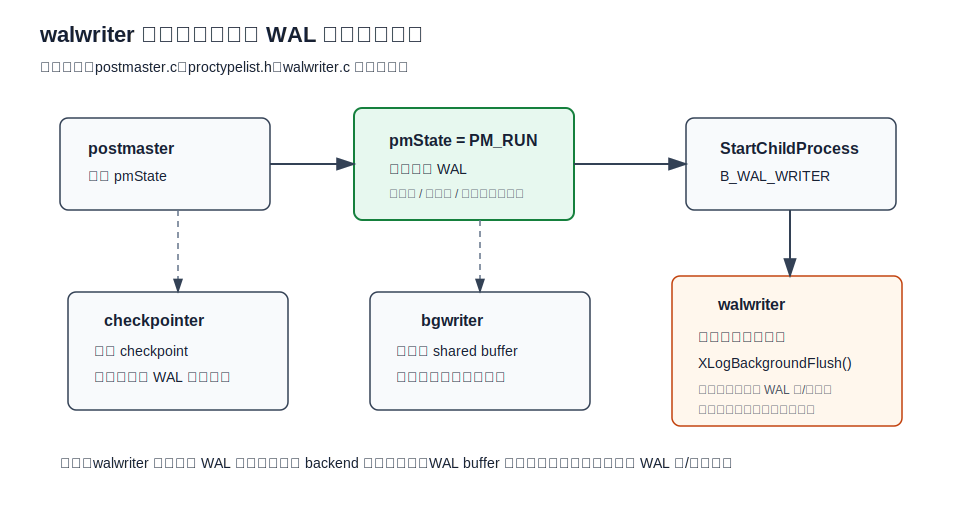
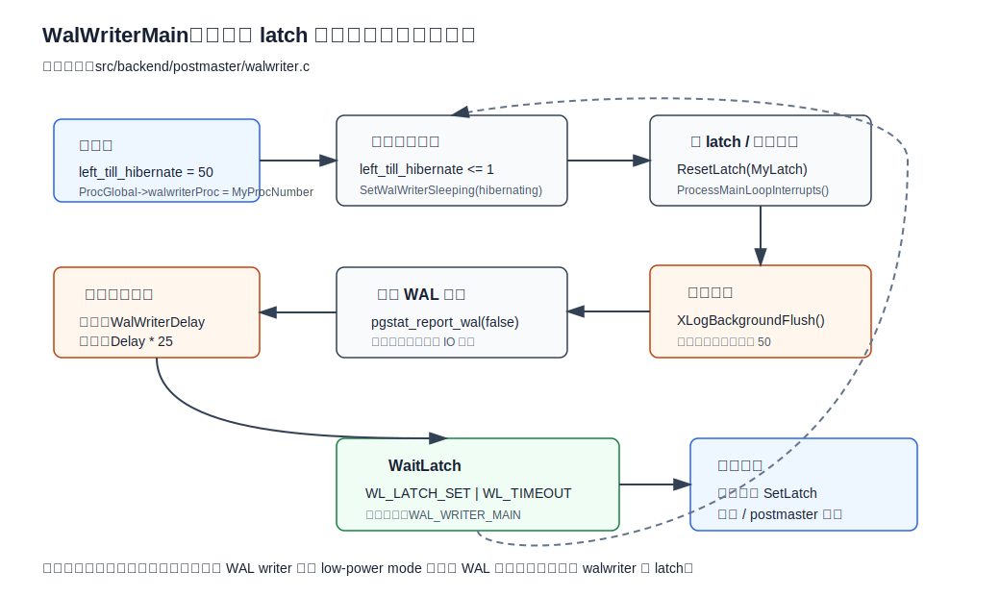
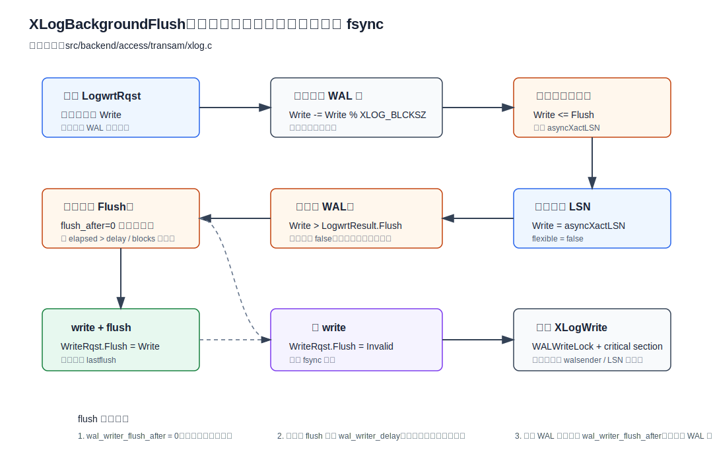
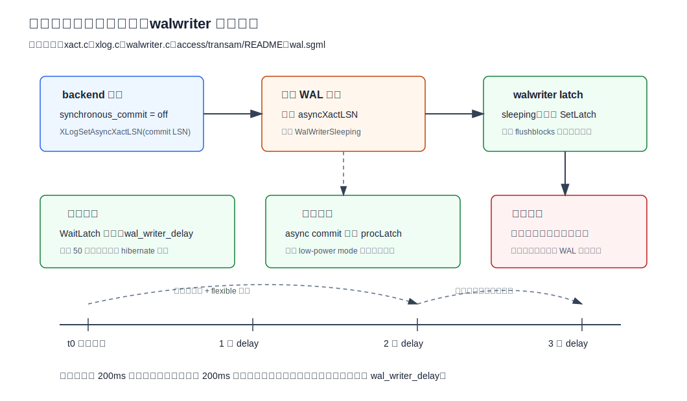
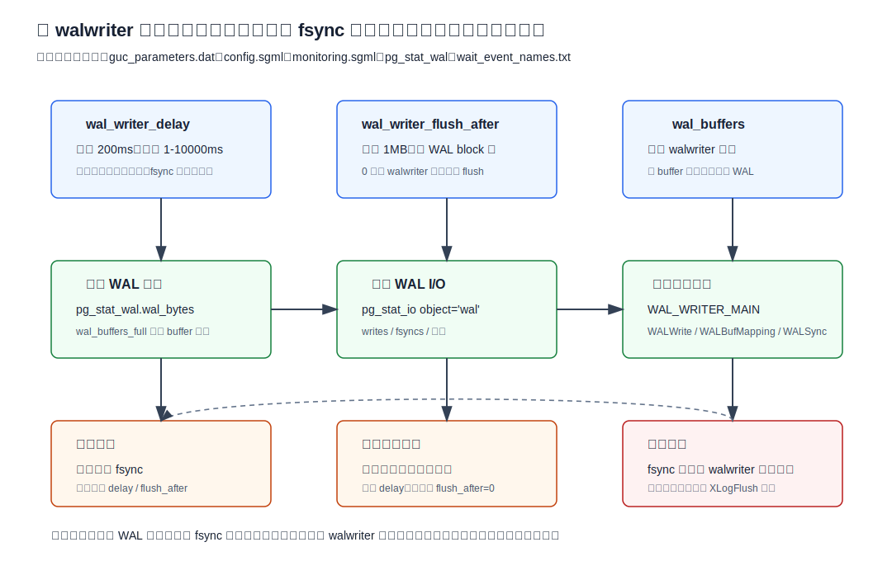

## 数据库筑基课 - walwriter 调度

### 作者
digoal

### 日期
2026-06-08

### 标签
PostgreSQL , 应用开发者 , 数据库筑基课 , WAL , walwriter , 异步提交 , 调度 , 可靠性     

----

## 背景
   


这篇属于数据库筑基课里的“维护机制 + 写入路径 + 可靠性边界”主题。前面的 WAL、wal buffer 管理、wal flush 行为文章已经解释了 WAL 为什么存在、WAL buffer 如何承接并发写入、`XLogFlush()` 到底把什么推进到稳定存储。本文再往下追一个更小但很关键的问题：**walwriter 这个后台进程到底怎么调度？**

本地 `markdown/` 目录没有发现独立的“数据库筑基课大纲”文件，所以本文不强行引用不存在的大纲；后续如果项目补充大纲，可以在这里补上课程目录链接。

这个问题在生产里通常不是从源码开始暴露，而是从几类现象开始：

- 开了 `synchronous_commit=off` 以后，提交延迟下降了，但团队不知道“最多可能丢多久的已返回事务”。
- 小事务高并发时，前台 backend 偶尔还是在写 WAL，想知道 walwriter 为什么没有兜住。
- 监控里看到 `pg_stat_wal.wal_buffers_full` 增长，或者 wait event 里出现 `WALWrite`、`WALBufMapping`。
- 有人把 `wal_writer_delay` 调得很小，结果 fsync 更密；有人把它调大，又拉长了异步提交风险窗口。
- 把 walwriter 当成“唯一负责 WAL 持久化的进程”，导致同步提交、数据页写出前 flush、WAL buffer 满这些路径被误判。

本文以用户提供的本地 PostgreSQL 源码目录 `postgres` 为事实依据。主要引用文件包括：

- `src/backend/postmaster/walwriter.c`
- `src/backend/access/transam/xlog.c`
- `src/backend/access/transam/xact.c`
- `src/backend/access/transam/README`
- `src/backend/postmaster/postmaster.c`
- `src/include/postmaster/proctypelist.h`
- `src/include/postmaster/walwriter.h`
- `src/backend/utils/misc/guc_parameters.dat`
- `doc/src/sgml/config.sgml`
- `doc/src/sgml/wal.sgml`
- `doc/src/sgml/monitoring.sgml`
- `src/backend/utils/activity/wait_event_names.txt`

DeepWiki repoName `postgres/postgres` 本次作为架构索引用来核对 WAL writer 所在路径和参数关系；关键结论均已回到本地源码和官方 SGML 文档验证。

## 一、它解决什么问题？

walwriter 解决的不是“事务提交一定由后台刷盘”这个问题，而是更具体的三件事。

第一，降低前台 backend 被迫写 WAL、刷 WAL 的概率。WAL record 先进入共享 WAL buffer；如果后台能及时把完整 WAL 页写到 WAL segment 文件，前台在后续提交、WAL buffer 复用、复制发送等路径上就少做一部分长 I/O。

第二，为异步提交提供可理解的风险窗口。`synchronous_commit=off` 的事务提交时不等 `XLogFlush(commit LSN)`，而是把 commit LSN 记录到共享内存，让 walwriter 后续补刷。源码和文档给出的关键边界是：异步提交记录最坏在约三倍 `wal_writer_delay` 周期内到达磁盘。

第三，把 WAL 后台 flush 频率变成可调的工程取舍。`wal_writer_delay` 控制时间维度，`wal_writer_flush_after` 控制容量维度。二者合起来决定 walwriter 是“只 write 到操作系统”还是“write 后继续 flush 到稳定存储”。

它付出的代价也很明确：

- 调小 `wal_writer_delay` 会缩短异步提交风险窗口，但可能增加 fsync 密度。
- 调大 `wal_writer_delay` 会减少空闲唤醒和部分 flush 频率，但拉长异步提交最长风险窗口。
- 调小 `wal_writer_flush_after` 会更积极刷盘，降低未 flush WAL 积压，但可能影响并发 I/O。
- walwriter 不是同步提交的替代品；同步提交仍由前台 `XLogFlush()` 保证。

## 二、它是什么？

walwriter 是 PostgreSQL postmaster 启动的辅助后台进程，进程类型为 `B_WAL_WRITER`，显示名称是 `walwriter`。`src/include/postmaster/proctypelist.h` 把 `B_WAL_WRITER` 绑定到 `WalWriterMain`；`src/backend/postmaster/postmaster.c` 说明它只在 `pmState == PM_RUN` 时启动，因为只有正常运行期才会产生新的 WAL。

`src/backend/postmaster/walwriter.c` 文件头把职责说得很清楚：

- 它尝试让普通 backend 少做 WAL page 写出和 fsync。
- 它保证异步提交的 commit record 在可知时间内落盘。
- 普通 backend 仍然有权在 walwriter 跟不上时自己写 WAL 和 fsync。
- 不应该往 walwriter 上塞太多额外职责，因为它的周期直接绑定异步提交最大延迟。



图 1 说明：`checkpointer`、`bgwriter`、`walwriter` 都是后台进程，但职责不同。`walwriter` 只在正常运行期负责 WAL 后台写/刷调度；checkpoint、shared buffer 写回、WAL segment 预分配等事情不应混在它的主循环里理解。

从调度角度看，walwriter 不是一个复杂调度器，而是一个 `WaitLatch()` 驱动的循环：

- 周期性醒来：默认每 `wal_writer_delay=200ms` 醒一次。
- 被动唤醒：异步提交 backend 发现需要它工作时设置它的 latch。
- 空闲休眠：连续多轮没有有效工作后，进入较长等待，降低空闲功耗。
- 每轮核心工作：调用 `XLogBackgroundFlush()`。

## 三、核心原理

### 3.1 postmaster 什么时候启动 walwriter？

`src/backend/postmaster/postmaster.c` 的逻辑是：checkpointer 和 bgwriter 在 `PM_RUN`、`PM_RECOVERY`、`PM_HOT_STANDBY`、`PM_STARTUP` 等状态都可能需要；walwriter 只在 `PM_RUN` 才启动。

原因很直接：恢复、启动、热备只读阶段不会接受普通事务产生新的 WAL 插入流；walwriter 的目标是服务正常运行期的新 WAL 后台写/刷。

`src/include/storage/proc.h` 里的 `ProcGlobal->walwriterProc` 记录当前 walwriter 的 proc number。walwriter 启动后在 `WalWriterMain` 中写入这个值，其他 backend 就能通过这个 proc number 找到 walwriter 的 latch 并唤醒它。

### 3.2 主循环：为什么它既能周期醒，也能被异步提交叫醒？

`WalWriterMain()` 初始化后进入无限循环。每轮的核心步骤是：

1. 根据 `left_till_hibernate` 判断本轮是否可能进入休眠，并通过 `SetWalWriterSleeping()` 把状态写进共享 WAL 控制结构。
2. `ResetLatch(MyLatch)` 清掉已经到达的唤醒信号。
3. `ProcessMainLoopInterrupts()` 处理 SIGHUP、SIGTERM 等信号。
4. 调用 `XLogBackgroundFlush()`。
5. 如果本轮有工作，把 `left_till_hibernate` 重置为 50；否则递减。
6. 调用 `pgstat_report_wal(false)` 非阻塞上报 WAL 和 IO 统计。
7. 用 `WaitLatch()` 等待 latch、超时或 postmaster 死亡。

源码里有两个常量：

```c
#define LOOPS_UNTIL_HIBERNATE 50
#define HIBERNATE_FACTOR      25
```

这意味着 walwriter 连续 50 轮没有有效工作后，会把等待时间从 `WalWriterDelay` 拉长到 `WalWriterDelay * 25`。默认 `wal_writer_delay=200ms` 时，活跃轮询是 200ms，休眠等待是 5 秒。



图 2 说明：walwriter 的调度不是普通操作系统定时器孤立完成的。`WaitLatch()` 同时接受超时和 latch 唤醒；异步提交会在需要时设置 walwriter 的 latch，从而打断长休眠。

这里有一个细节很重要：walwriter 在可能休眠前会先设置 `WalWriterSleeping` 标志。异步提交 backend 读取这个标志后，如果发现 walwriter 处于 low-power mode，会直接唤醒它。这样可以避免“walwriter 因为空闲进入 5 秒等待，而异步提交风险窗口被错误拉长到 5 秒”。

### 3.3 XLogBackgroundFlush：先写完整页，再处理异步提交

`XLogBackgroundFlush()` 位于 `src/backend/access/transam/xlog.c`。它不是简单地“刷到最新 insert LSN”。源码的策略分几层。

第一层：恢复中直接返回。注释明确说，恢复期间不需要 flush XLOG。

第二层：读取共享 `LogwrtRqst`，再把 `WriteRqst.Write` 回退到最后一个完整 WAL page 边界：

```c
WriteRqst.Write -= WriteRqst.Write % XLOG_BLCKSZ;
```

这体现了 walwriter 的吞吐取向：高负载下优先写完整 WAL page，减少碎片化写出。

第三层：如果完整页已经 flush 到位，再看 `XLogCtl->asyncXactLSN`。这用于处理当前不完整 WAL page 里的异步提交记录。此时 `flexible=false`，要求写到该异步提交 LSN，不能只写一点就停。

第四层：根据时间和容量决定是否 flush：

- `wal_writer_flush_after = 0`：只要有工作就把 `WriteRqst.Flush` 设为 `WriteRqst.Write`，也就是立即 flush。
- 首次调用：flush 并记录 `lastflush`。
- 距上次 flush 超过 `wal_writer_delay`：flush，限制异步提交等待时间。
- 未 flush WAL 块数达到 `wal_writer_flush_after`：flush，限制 WAL 脏数据积压。
- 否则只 write，不 flush，避免过高 fsync 频率。

最后，walwriter 在 critical section 里等待相关 WAL 插入完成，获取 `WALWriteLock`，调用 `XLogWrite()`。完成后唤醒 walsender 和等待 primary flush LSN 的进程，并机会性初始化后续 WAL buffer 页。



图 3 说明：walwriter 的“调度”不是单个 sleep 参数，而是 `完整页写出 -> async commit LSN -> 时间阈值 -> 容量阈值 -> XLogWrite` 这一整条决策链。理解这条链，才能解释为什么有时它只 write，不 fsync。

### 3.4 异步提交如何唤醒 walwriter？

事务提交路径在 `src/backend/access/transam/xact.c`。当事务写了 WAL、需要标记提交，且 `synchronous_commit > SYNCHRONOUS_COMMIT_OFF` 时，提交路径调用：

```c
XLogFlush(XactLastRecEnd);
```

当允许异步提交时，提交路径不等 flush，而是调用：

```c
XLogSetAsyncXactLSN(XactLastRecEnd);
```

`XLogSetAsyncXactLSN()` 做三件事：

1. 在共享状态里记录更大的 `asyncXactLSN`。
2. 如果 walwriter 处于 sleeping 状态，直接设置 walwriter 的 latch。
3. 如果 walwriter 没睡，则计算 `asyncXactLSN` 到当前 flush LSN 之间有多少 WAL block；当 `wal_writer_flush_after=0` 或未 flush blocks 达到阈值时，也设置 latch。

也就是说，异步提交不是“完全等下一个周期”。它会根据 walwriter 状态和 WAL 积压量主动唤醒后台进程。



图 4 说明：异步提交的风险窗口是“已返回成功但 commit WAL 尚未 flush 的时间”。默认 `wal_writer_delay=200ms` 不表示每个异步提交都 200ms 内落盘；源码和官方文档给出的最坏边界是三倍 `wal_writer_delay`，因为 walwriter 在繁忙期优先完整页和 flexible 写出。

### 3.5 为什么最坏是三倍 wal_writer_delay？

`src/backend/postmaster/walwriter.c` 文件头和 `doc/src/sgml/wal.sgml` 都说明，异步提交的实际最大风险窗口是三倍 `wal_writer_delay`。`src/backend/access/transam/README` 给了更完整的原因：

- walwriter 周期性醒来或被 latch 唤醒。
- 它优先检查最后一个完整 WAL page；如果完整页前进了，就写这些完整页。
- 如果活动中断且当前 WAL page 没变，才检查当前不完整页里的最新异步提交 LSN。
- 超过 `wal_writer_delay` 或超过 `wal_writer_flush_after` 后才 flush。
- 为了高负载下少发写请求，`XLogWrite()` 对完整页允许 flexible 写出，最坏情况会多一个 walwriter 周期。

所以设计上不是追求“每个异步提交立即刷盘”，而是追求“吞吐和可知风险之间的边界”。默认 200ms 下，理论最坏窗口约 600ms；如果把 `wal_writer_delay` 调到 1s，理论最坏窗口就变成约 3s。

### 3.6 wal_writer_delay 和 wal_writer_flush_after 到底影响什么？

`src/backend/utils/misc/guc_parameters.dat` 定义：

- `wal_writer_delay`：单位毫秒，默认 200，范围 1 到 10000，SIGHUP 生效。
- `wal_writer_flush_after`：单位 WAL block，默认 `DEFAULT_WAL_WRITER_FLUSH_AFTER`，也就是 `1MB / XLOG_BLCKSZ`；最小 0，SIGHUP 生效。

`src/include/postmaster/walwriter.h` 里默认值是：

```c
#define DEFAULT_WAL_WRITER_FLUSH_AFTER ((1024 * 1024) / XLOG_BLCKSZ)
```

官方配置文档 `doc/src/sgml/config.sgml` 说明：

- `wal_writer_delay` 指 WAL writer 在时间维度上多常 flush WAL。
- flush 后 writer 睡 `wal_writer_delay`，除非被异步提交事务提前唤醒。
- 如果距上次 flush 未超过 `wal_writer_delay`，且新增 WAL 未达到 `wal_writer_flush_after`，则 WAL 只写到操作系统，不 flush 到磁盘。
- `wal_writer_flush_after=0` 表示 WAL data 总是立即 flush。
- 未带单位时，`wal_writer_delay` 按毫秒，`wal_writer_flush_after` 按 WAL block，典型 `XLOG_BLCKSZ` 是 8kB。

这两个参数不改变同步提交的基本语义。同步提交仍要由前台 `XLogFlush(commit LSN)` 等本地 durable；walwriter 只能帮助提前写/刷一部分 WAL，减少前台后来遇到的工作量。

### 3.7 walwriter 和前台 backend 如何分工？

一个常见误解是：只要有 walwriter，前台就不会写 WAL。源码正好相反，`walwriter.c` 文件头明确说普通 backend 仍然可以在 walwriter 跟不上时写 WAL 和 fsync。

典型前台路径包括：

- 同步提交：`xact.c` 调用 `XLogFlush(XactLastRecEnd)`。
- WAL buffer 复用：`AdvanceXLInsertBuffer()` 发现要替换的 WAL buffer 页还没写出，会推进 `LogwrtRqst.Write`，必要时自己拿 `WALWriteLock` 调 `XLogWrite()`。
- 数据页写出前：buffer manager 写永久关系脏页前要保证 page LSN 对应 WAL 已 flush。
- 两阶段提交、SLRU 写出、控制文件更新、复制发送等路径，也可能直接或间接推动 WAL flush。

walwriter 的价值是把一部分工作从这些前台路径前移，但它不是 WAL 持久化的唯一执行者。

## 四、横向对比

### 4.1 walwriter、backend、checkpointer、bgwriter

| 维度 | walwriter | 前台 backend | checkpointer | bgwriter |
|---|---|---|---|---|
| 主要目标 | 后台写/刷 WAL，约束异步提交窗口 | 完成事务语义和必要 WAL flush | 推进 checkpoint，控制恢复距离 | 后台写 shared buffer 脏页 |
| 触发方式 | 周期、latch、SIGHUP、SIGTERM | 用户事务、WAL buffer 满、页面写出等 | checkpoint_timeout、max_wal_size、手工 checkpoint | 周期性扫描 buffer |
| 关键函数 | `WalWriterMain()`、`XLogBackgroundFlush()` | `XLogFlush()`、`XLogWrite()` | `CreateCheckPoint()` 等 | `BackgroundWriterMain()` |
| 是否直接决定同步提交返回 | 否 | 是 | 否 | 否 |
| 与 WAL 的关系 | 写完整页、按阈值 flush、处理 async commit LSN | 必要时写/刷到目标 LSN | 影响 WAL 保留和恢复起点 | 写数据页前仍受 WAL-before-data 约束 |
| 调参重点 | `wal_writer_delay`、`wal_writer_flush_after` | `synchronous_commit`、`commit_delay`、存储 I/O | checkpoint 参数 | bgwriter 和 shared buffers 相关参数 |

原因在于 PostgreSQL 把“事务持久性”“后台 WAL 推进”“数据页写回”“恢复边界”拆开实现。调优时把这些后台进程混在一起，很容易把症状归错因。

### 4.2 只 write、write + flush、同步提交 flush

| 维度 | walwriter 只 write | walwriter write + flush | 前台同步提交 flush |
|---|---|---|---|
| 触发条件 | 未达到时间/容量 flush 阈值 | `delay` 到期、`flush_after` 达阈值、首次调用或 flush_after=0 | 事务提交要求本地持久 |
| 推进水位 | `write LSN` | `write LSN` 和 `flush LSN` | 至少推进到 commit LSN |
| fsync 成本 | 通常没有独立 fsync | 有，或同步 open 方式等价完成 | 有，且提交等待它 |
| 目标 | 减少后续写 WAL 工作 | 缩短未 flush WAL 积压和异步风险窗口 | 保证当前事务返回前 durable |
| 风险 | 崩溃后只 write 未 flush 的 WAL 可能丢 | 风险窗口缩短 | 延迟进入客户端感知路径 |

`write LSN` 和 `flush LSN` 必须分开看。对 `fdatasync`、`fsync`、`fsync_writethrough` 这类 `wal_sync_method`，write 通常只是把 WAL 写到文件或内核缓存；flush 才是稳定存储边界。

### 4.3 时间阈值和容量阈值

| 维度 | `wal_writer_delay` | `wal_writer_flush_after` |
|---|---|---|
| 控制对象 | WAL writer 主循环等待和时间维度 flush | 未 flush WAL 容量达到多少后 flush |
| 默认值 | 200ms | 1MB |
| 最小值 | 1ms | 0 |
| 设小的效果 | 异步提交窗口缩短，唤醒/flush 可能更频繁 | WAL 积压更少，fsync 更积极 |
| 设大的效果 | 空闲唤醒减少，异步提交窗口变长 | 更多 write-only，flush 次数可能下降 |
| 常见误用 | 以为越小越安全且没有吞吐代价 | 以为 0 是“关闭 walwriter flush”，实际是有工作就立即 flush |

这两个参数应当一起看：低写入量系统可能主要受 `wal_writer_delay` 影响；高 WAL 生成系统更容易被 `wal_writer_flush_after` 提前触发 flush。

## 五、效果如何？

walwriter 调度带来的收益：

- 异步提交有清晰风险边界，而不是无限等后台碰运气。
- 高负载下优先写完整 WAL page，减少碎片化小写。
- 能在前台同步提交之前提前推进 write/flush 水位，降低部分前台等待概率。
- 空闲时自动进入较长等待，减少无意义唤醒。
- 通过 `wal_writer_delay` 和 `wal_writer_flush_after` 提供可解释的时间/容量取舍。

它不能解决的问题：

- 不能绕过同步提交对本地 `flush LSN` 的要求。
- 不能修复慢 fsync、慢存储、同步复制远端慢导致的提交尾延迟。
- 不能避免所有前台 WAL 写出；WAL buffer 满或前台需要特定 LSN durable 时仍会自己做。
- 不能保证异步提交零丢失；它只是限制风险窗口。
- 不能用来调 shared buffer 脏页写回，那个主要属于 bgwriter/checkpointer/buffer manager 话题。

本文不提供虚构性能数字。walwriter 参数效果高度依赖 WAL 生成速率、事务大小、存储 fsync 延迟、`wal_buffers`、同步复制拓扑和操作系统 I/O 行为，必须用代表性 workload 验证。



图 5 说明：调参前先明确目标。要缩短异步提交风险窗口，优先看 `wal_writer_delay` 和 `wal_writer_flush_after`；要降低同步提交延迟，不能只盯 walwriter，还要看前台 `XLogFlush()`、存储 fsync、同步复制和 group commit。

## 六、实操 DEMO

下面示例用于测试库验证。本文没有在本地启动 PostgreSQL 实例执行这些 SQL，因此不提供执行输出。

### 6.1 查看 walwriter 参数

```sql
SHOW wal_writer_delay;
SHOW wal_writer_flush_after;
SHOW synchronous_commit;

SELECT name, setting, unit, context, min_val, max_val, source
FROM pg_settings
WHERE name IN ('wal_writer_delay', 'wal_writer_flush_after', 'synchronous_commit');
```

验证点：

- `wal_writer_delay` 和 `wal_writer_flush_after` 的 `context` 应为 `sighup`。
- `synchronous_commit` 可按会话或事务调整，而 walwriter 两个参数不是普通业务会话内即时生效的开关。

### 6.2 观察 walwriter 后台进程和等待事件

```sql
SELECT pid, backend_type, wait_event_type, wait_event
FROM pg_stat_activity
WHERE backend_type = 'walwriter';
```

空闲时常见等待事件是 `WalWriterMain`。源码枚举名是 `WAIT_EVENT_WAL_WRITER_MAIN`，来自 `src/backend/utils/activity/wait_event_names.txt` 中的 `WAL_WRITER_MAIN`，生成到 SQL 视图时会转换成驼峰展示名。

如果要看正在等待 WAL 相关锁或 I/O 的会话：

```sql
SELECT pid, backend_type, state, wait_event_type, wait_event
FROM pg_stat_activity
WHERE wait_event IN ('WALWrite', 'WALBufMapping', 'WalWrite', 'WalSync', 'WalInitSync')
   OR wait_event = 'WalWriterMain'
ORDER BY backend_type, pid;
```

不同版本等待事件名称可能略有差异，以当前库的 `pg_wait_events` 为准：

```sql
SELECT type, name, description
FROM pg_wait_events
WHERE name ILIKE 'WAL%';
```

### 6.3 观察 WAL 生成和 buffer 压力

```sql
SELECT wal_records,
       wal_fpi,
       wal_bytes,
       wal_fpi_bytes,
       wal_buffers_full,
       stats_reset
FROM pg_stat_wal;
```

验证点：

- `wal_bytes` 表示 WAL 生成总量。
- `wal_buffers_full` 增长说明 WAL buffer 曾因满而触发写出，这通常意味着前台路径可能参与了 WAL 写出，不能只看 walwriter。

如果版本提供 `pg_stat_io`，可以继续看 WAL 对象的 write/fsync：

```sql
SELECT backend_type,
       object,
       context,
       writes,
       write_time,
       fsyncs,
       fsync_time
FROM pg_stat_io
WHERE object = 'wal'
ORDER BY backend_type, context;
```

要观察时间列，需要关注 `track_wal_io_timing` 是否开启。

### 6.4 构造异步提交并观察 flush LSN 追赶

```sql
CREATE TABLE walwriter_demo(
    id bigint generated always as identity,
    payload text
);

SELECT pg_current_wal_insert_lsn() AS insert_lsn_before,
       pg_current_wal_lsn()        AS write_lsn_before,
       pg_current_wal_flush_lsn()  AS flush_lsn_before;

BEGIN;
SET LOCAL synchronous_commit TO off;
INSERT INTO walwriter_demo(payload)
SELECT repeat('x', 1000)
FROM generate_series(1, 1000);
COMMIT;

SELECT pg_current_wal_insert_lsn() AS insert_lsn_after_commit,
       pg_current_wal_lsn()        AS write_lsn_after_commit,
       pg_current_wal_flush_lsn()  AS flush_lsn_after_commit;

SELECT pg_sleep(1);

SELECT pg_current_wal_insert_lsn() AS insert_lsn_after_sleep,
       pg_current_wal_lsn()        AS write_lsn_after_sleep,
       pg_current_wal_flush_lsn()  AS flush_lsn_after_sleep;
```

验证点：

- 异步提交返回后，`flush_lsn_after_commit` 不一定立即追到最新提交附近。
- 等待一段时间后，walwriter 或其他路径会继续推进 `flush LSN`。
- 在写入量很小、系统很快、或者其他路径刚好触发 flush 的环境里，三个 LSN 也可能很接近；不要把一次观察当成普遍规律。

### 6.5 临时测试更激进的 walwriter flush

在测试环境中，可以把参数调得更激进，再观察 fsync 次数和 flush LSN 追赶速度：

```sql
ALTER SYSTEM SET wal_writer_delay = '20ms';
ALTER SYSTEM SET wal_writer_flush_after = '0';
SELECT pg_reload_conf();

SHOW wal_writer_delay;
SHOW wal_writer_flush_after;
```

验证完成后恢复默认值：

```sql
ALTER SYSTEM RESET wal_writer_delay;
ALTER SYSTEM RESET wal_writer_flush_after;
SELECT pg_reload_conf();
```

注意：这个实验会改变实例级行为，不要在生产库直接执行。更合理的做法是在同配置、同存储类型的压测环境里对比 `pg_stat_io`、`pg_stat_wal`、提交延迟分位数和系统 I/O。

## 七、最佳实践

### 7.1 面向数据库架构师

把 `synchronous_commit=off` 当成业务一致性策略，而不是单纯性能开关。适合异步提交的业务通常满足至少一个条件：

- 事件可重放。
- 写入是低价值日志或统计。
- 上游还有可靠消息源。
- 客户端能接受“已返回成功但最近一小段可能丢失”。

如果业务要求每次确认后都不能丢，应该优化同步提交路径，而不是依赖 walwriter。

设计多租户或多业务等级库时，可以把事务按持久性要求分级：

- 核心账务、订单状态：`synchronous_commit=on` 或同步复制更高等级。
- 可重建统计、行为日志：可以评估 `synchronous_commit=off`。
- 批量导入中间表：结合 unlogged/临时表、批量提交、COPY 等机制综合设计。

### 7.2 面向 DBA

调 walwriter 前先做四个观测：

1. `pg_stat_wal.wal_bytes` 和业务 TPS，判断 WAL 生成速率。
2. `pg_stat_wal.wal_buffers_full`，判断前台是否因 WAL buffer 满被迫写出。
3. `pg_stat_io` 中 WAL write/fsync 次数和时间，判断存储同步 I/O 是否是主因。
4. `pg_stat_activity` / `pg_wait_events`，判断等待是否集中在 `WALWrite`、`WALBufMapping`、`WalWrite`、`WalSync`、同步复制等待，还是别的资源。`WALWrite` 是 LWLock 名，`WalWrite` 是 WAL 文件写 I/O 名，诊断时要同时看类型和名称。

如果目标是缩短异步提交风险窗口，优先减小 `wal_writer_delay`，必要时降低 `wal_writer_flush_after`。如果目标是降低 fsync 压力，过小的 `wal_writer_delay` 和 `wal_writer_flush_after=0` 可能反而增加压力。

不要只看平均提交延迟。walwriter 参数对尾延迟和 fsync 分布影响更大，至少要看 p95、p99、fsync 时间分位数和 WAL 生成突刺。

### 7.3 面向业务开发者

不要在不理解语义的情况下全局设置：

```sql
SET synchronous_commit TO off;
```

更安全的方式是只包住可丢、可重放的事务：

```sql
BEGIN;
SET LOCAL synchronous_commit TO off;
INSERT INTO app_event_log(event_id, payload) VALUES ($1, $2);
COMMIT;
```

这样核心交易仍走同步提交，低价值日志可以减少提交等待。应用层还应设计幂等键或上游重放机制，因为异步提交返回成功不等于崩溃后一定存在。

## 八、适合与不适合场景

适合重点关注 walwriter 调度的场景：

- 大量小事务，部分事务可接受异步提交。
- WAL 生成稳定但 fsync 成本较高，需要平衡后台 flush 频率。
- `pg_stat_wal.wal_buffers_full` 增长，需要判断后台写 WAL 是否跟不上。
- 希望明确 `synchronous_commit=off` 的风险窗口，而不是笼统说“可能丢”。
- 高并发写入系统中，希望分清前台 `XLogFlush()` 和后台 `XLogBackgroundFlush()` 的职责。

不适合把问题归给 walwriter 的场景：

- 同步复制远端慢：重点应看 replication wait、网络、standby flush/apply。
- 单次大事务提交慢：可能是 WAL 生成量、checkpoint、存储 fsync 或锁等待，不一定是 walwriter。
- 数据页写回导致 I/O 抖动：重点看 checkpoint、bgwriter、shared buffers、dirty page。
- `fsync=off` 后的可靠性问题：这是全局崩溃安全问题，不是 walwriter 能补救。
- 归档堆积或复制槽保留 WAL：重点看 archiver、replication slot、walsender/receiver。

## 九、常见坑

### 坑 1：把 `wal_writer_flush_after=0` 理解成关闭 flush

实际正好相反。官方配置文档说明，`wal_writer_flush_after=0` 时 WAL data 总是立即 flush。这个设置会让 walwriter 更积极刷盘，可能缩短异步提交风险窗口，但也可能增加 fsync 频率。

### 坑 2：以为 `wal_writer_delay=200ms` 就是异步提交最多丢 200ms

源码和官方文档给出的最坏边界是三倍 `wal_writer_delay`。默认 200ms 下是约 600ms，而不是 200ms。原因是 walwriter 优先写完整页，且高负载下 `XLogWrite()` 允许 flexible 写出。

### 坑 3：同步提交慢就先调 walwriter

同步提交等待的是前台 `XLogFlush(commit LSN)`。walwriter 可以提前推进水位，但不能改变同步提交必须等本地 durable 的事实。同步提交慢要优先看 fsync、`WALWriteLock` 争用、group commit、`commit_delay`、同步复制和存储。

### 坑 4：看到 walwriter 空闲就认为 WAL 没问题

walwriter 等待 `WalWriterMain` 很正常。真正要看的是前台是否频繁等 `WALWrite`、`WALBufMapping`、`WalWrite`、`WalSync`，以及 `pg_stat_wal.wal_buffers_full` 是否增长。

### 坑 5：把异步提交和 `fsync=off` 混为一谈

`synchronous_commit=off` 的风险是最近已返回成功的事务可能丢失，数据库一致性仍由 WAL 机制维护。`fsync=off` 是放弃关键文件同步，系统崩溃后可能造成严重数据损坏。二者不是同一类开关。

### 坑 6：忽略 abort 也会推动 async LSN

`xact.c` 中 abort 路径也会调用 `XLogSetAsyncXactLSN()`。源码注释解释，这对流复制和避免 WAL backlog 有意义。不要把 `XLogSetAsyncXactLSN()` 简化成“只处理 commit”。

## 十、扩展问题

1. 如果 `wal_writer_delay` 从 200ms 调到 20ms，哪些指标应该改善，哪些指标可能变差？
2. 为什么 walwriter 优先写完整 WAL page，而不是每次都写到最新 insert LSN？
3. `wal_writer_flush_after=0` 对低并发 OLTP 和高并发批量写入的影响会一样吗？
4. 为什么 walwriter 不能替代前台同步提交里的 `XLogFlush()`？
5. 当 `pg_stat_wal.wal_buffers_full` 增长时，应该先调 `wal_buffers`，还是先看 WAL 生成速率、checkpoint、fsync 和 walwriter 参数？
6. 如果业务把日志表事务设置为 `synchronous_commit=off`，上游应该怎样设计幂等和补偿？
7. 同步复制开启后，walwriter 的后台 flush 对提交延迟还剩多少帮助？
8. PostgreSQL 为什么不把 WAL segment 预创建等额外工作放进 walwriter？

## 十一、扩展阅读

- PostgreSQL 本地源码：`src/backend/postmaster/walwriter.c`
- PostgreSQL 本地源码：`src/backend/access/transam/xlog.c`
- PostgreSQL 本地源码：`src/backend/access/transam/xact.c`
- PostgreSQL 本地源码说明：`src/backend/access/transam/README`，Asynchronous Commit 小节
- PostgreSQL 本地源码：`src/backend/postmaster/postmaster.c`
- PostgreSQL 本地源码：`src/include/postmaster/proctypelist.h`
- PostgreSQL 本地源码：`src/include/postmaster/walwriter.h`
- PostgreSQL 本地源码：`src/backend/utils/misc/guc_parameters.dat`
- PostgreSQL 官方文档源码：`doc/src/sgml/config.sgml`，`wal_writer_delay` 和 `wal_writer_flush_after`
- PostgreSQL 官方文档源码：`doc/src/sgml/wal.sgml`，异步提交风险窗口
- PostgreSQL 官方文档源码：`doc/src/sgml/monitoring.sgml`，`pg_stat_wal` 和 wait event 说明
- PostgreSQL 本地源码：`src/backend/utils/activity/wait_event_names.txt`
- DeepWiki：`postgres/postgres`，用于核对 WAL writer 与 WAL 架构相关源码入口；本文机制结论以本地源码和官方文档为准。
  
## 附录 
1、克隆代码  
```  
git clone --depth 1 https://github.com/postgres/postgres
```  
  
2、启用 codex, 使用 [数据库筑基课 skill](../skills/README.md).  
```
文章标题: 
  数据库筑基课 - walwriter 调度
项目源码(本地目录): 
  postgres
项目 codebase 文件名: 
  postgres/CLAUDE.md 
开源项目相关的 deepwiki repoName: 
  postgres/postgres
```

    
#### [PostgreSQL 解决方案集合](../201706/20170601_02.md "40cff096e9ed7122c512b35d8561d9c8")
  
  
#### [德哥 / digoal's Github - 公益是一辈子的事.](https://github.com/digoal/blog/blob/master/README.md "22709685feb7cab07d30f30387f0a9ae")
  
  
#### [About 德哥](https://github.com/digoal/blog/blob/master/me/readme.md "a37735981e7704886ffd590565582dd0")
  
  

  
