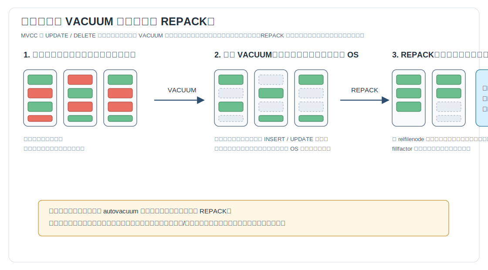
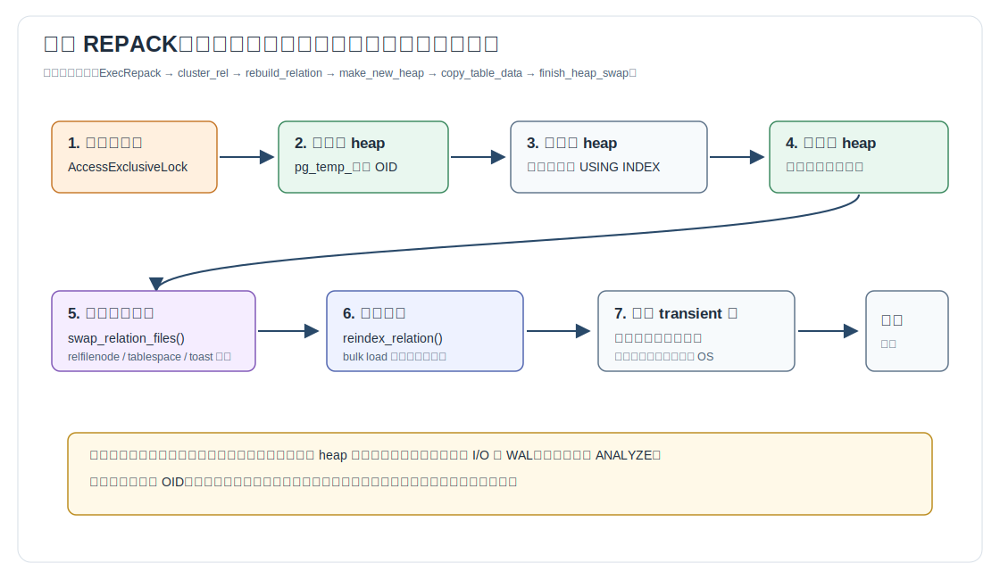
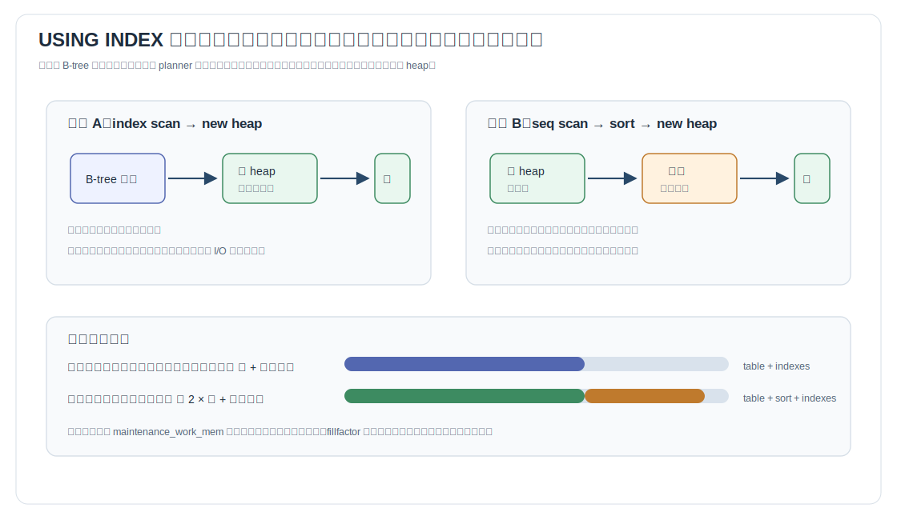
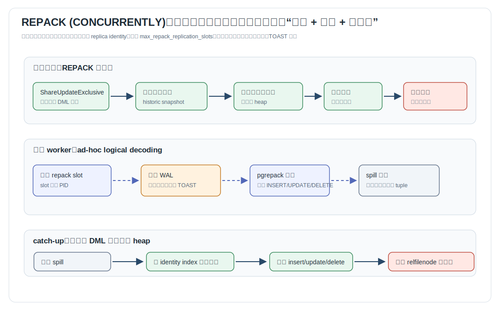
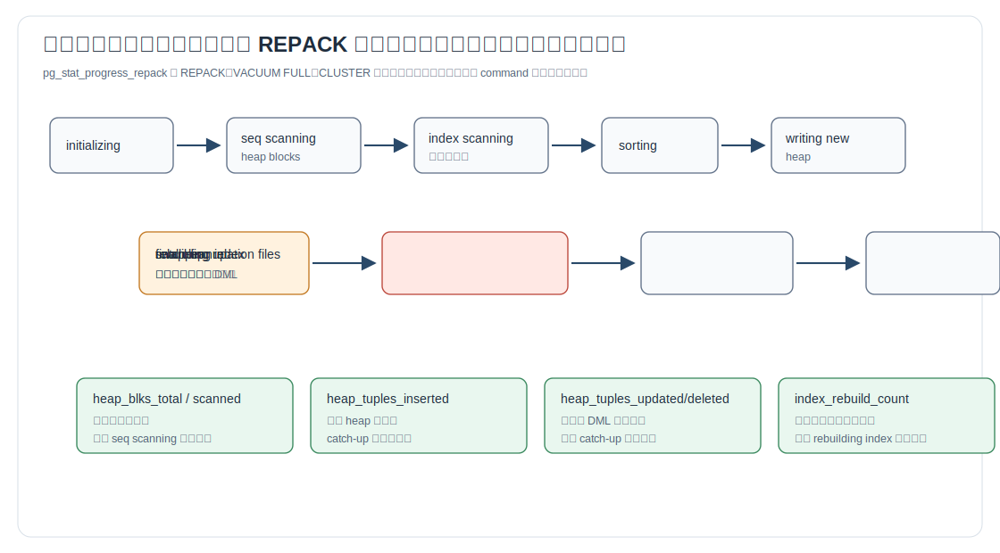
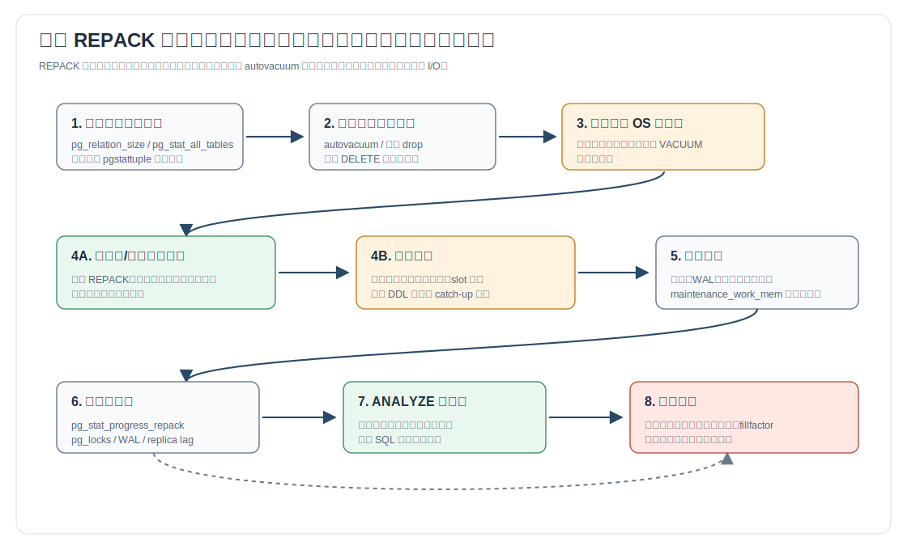

## 数据库筑基课 - repack

### 作者
digoal

### 日期
2026-06-08

### 标签
PostgreSQL , 应用开发者 , 数据库筑基课 , REPACK , VACUUM FULL , CLUSTER , MVCC , 表膨胀 , 维护机制     

----

## 背景
   


这篇属于数据库筑基课里的“维护机制 + 表存储重写 + MVCC 空间治理”主题。`repack` 解决的不是“清理垃圾”这么粗的问题，而是一个更具体的工程问题：**当普通 VACUUM 已经能把死元组空间留给表内复用，但业务仍然需要把膨胀后的物理文件缩小并归还给操作系统时，数据库应该怎样安全地重写一张正在被事务系统管理的表？**

本地 `markdown/` 目录没有发现独立的“数据库筑基课大纲”文件，所以本文不强行引用不存在的大纲；后续如果项目补充大纲，可以在这里补上课程目录链接。

本文基于本地 `postgres` 仓库当前源码快照展开，项目 codebase 文件为 `postgres/CLAUDE.md`，DeepWiki repoName 为 `postgres/postgres`。需要特别说明：本文讨论的是本地 PostgreSQL 开发文档和源码中的内核 `REPACK` 命令。低版本 PostgreSQL 生产环境如果没有内核 `REPACK` 语法，不能直接照搬本文 SQL，需要使用对应版本的 `VACUUM FULL`、`CLUSTER` 或外部扩展方案，并以所在版本官方文档为准。

真实业务场景通常是这样的：

- 一张订单流水表每天 UPDATE 状态字段、DELETE 过期数据，`pg_relation_size()` 持续变大。
- autovacuum 正常运行，`n_dead_tup` 也会下降，但磁盘上的关系文件没有明显缩小。
- 索引也跟着膨胀，缓存命中率下降，顺序扫描和索引扫描的 I/O 成本都变高。
- DBA 想要“压紧表”，但又不能接受长时间阻塞线上读写。

这就是 `REPACK` 的位置：它不是 autovacuum 的替代品，而是表膨胀已经影响成本之后，用更重的表重写换回物理空间、索引紧凑度和可预测布局。

## 一、它解决什么问题？

PostgreSQL 的 MVCC 不会在 `UPDATE` 或 `DELETE` 时立即把旧行版本从文件中拿掉。官方维护文档解释了原因：旧版本可能仍被其他事务的快照看见，所以必须等到不再有事务需要它们时才能回收。普通 `VACUUM` 的主要工作是清理这些死行版本，并把页面里的空间标记为后续插入/更新可复用。

问题在于，**可复用不等于归还给操作系统**。普通 `VACUUM` 通常不会把表文件中间的空洞挪到文件尾；除非尾部整页都空闲并且能拿到合适的锁，否则 OS 看到的文件大小不会明显下降。

`REPACK` 把问题转换成另一种做法：

1. 新建一个和旧表逻辑结构一致的临时 heap。
2. 扫描旧表，把仍需保留的行版本写入新 heap。
3. 按需要按照索引顺序重排物理行。
4. 交换旧表和新表的物理文件身份。
5. 重建索引，删除旧的物理文件。

它牺牲的是 I/O、WAL、额外磁盘、锁等待和运维窗口；换来的是紧凑的新表文件、新索引文件，以及可能改善的物理局部性。



图 1 说明：普通 `VACUUM` 清掉死元组后，空洞多数仍留在关系文件内部，适合未来复用；`REPACK` 则把保留行复制进新文件，再让旧文件在事务完成后释放。前者偏向稳态维护，后者偏向一次性压缩。

## 二、它是什么？

在本文所用的本地 PostgreSQL 源码里，`REPACK` 是一个 SQL 维护命令，文档 `doc/src/sgml/ref/repack.sgml` 给出的目的很直接：rewrite a table to reclaim disk space。语法核心如下：

```sql
REPACK [ ( option [, ...] ) ]
       [ table_name [ ( column_name [, ...] ) ]
         [ USING INDEX [ index_name ] ] ];

REPACK [ ( option [, ...] ) ] USING INDEX;

-- option:
--   VERBOSE [ boolean ]
--   ANALYZE [ boolean ]
--   CONCURRENTLY [ boolean ]
```

几个概念先定清楚：

| 术语 | 含义 |
|---|---|
| `REPACK table` | 按物理顺序重写表，回收死元组占用的文件空间 |
| `REPACK table USING INDEX idx` | 按指定索引顺序重写表，效果接近重新 cluster |
| `REPACK USING INDEX` | 对已配置 clustered index 的表执行基于索引的重写 |
| `REPACK (CONCURRENTLY)` | 大部分阶段只持有较弱锁，用逻辑解码捕获并补偿并发 DML，最后短暂强锁交换文件 |
| `REPACK (ANALYZE)` | 重写后执行 `ANALYZE`，当前源码只支持指定单张非分区表时使用 |
| `VACUUM FULL` | 本地文档中标为 deprecated，行为类似不带 `USING INDEX` 的 `REPACK` |
| `CLUSTER` | 本地文档说明等价于带 `USING INDEX` 的 `REPACK` |

它不是：

- 不是普通 `VACUUM` 的增强版。普通 `VACUUM` 原地清理，`REPACK` 重写新物理文件。
- 不是“无锁收缩”。并发模式也需要在交换文件时拿 `ACCESS EXCLUSIVE` 锁。
- 不是自动防膨胀机制。真正的日常防线仍然是合理的 autovacuum、数据模型、分区、批量写入策略和长事务治理。
- 不是 SQL 标准功能；`REPACK` 文档明确说明 SQL 标准没有这个语句。
- 不是外部 `pg_repack` 扩展的实现说明。本文主线是本地 PostgreSQL 内核源码。

## 三、核心原理

### 3.1 从 SQL 语法到统一执行入口

语法入口在 `src/backend/parser/gram.y`。源码注释把 `REPACK` 放在主语法前面，并把旧的 `CLUSTER` 变体作为 obsolete variants 兼容解析。解析结果是 `RepackStmt`，其中 `command` 字段区分：

- `REPACK_COMMAND_REPACK`
- `REPACK_COMMAND_CLUSTER`
- `REPACK_COMMAND_VACUUMFULL`

执行入口在 `src/backend/tcop/utility.c`，遇到 `T_RepackStmt` 后调用 `ExecRepack()`。真正的核心逻辑在 `src/backend/commands/repack.c`。DeepWiki 对 `postgres/postgres` 的交叉核对也指向同一个结论：`VACUUM FULL`、`CLUSTER` 和 `REPACK` 的表重写核心都汇聚到 `repack.c`，普通 `VACUUM` 的 lazy vacuum 则走另一条原地清理路径。

`src/backend/commands/vacuum.c` 中也能看到这一点：当 `VACUUM FULL` 被请求时，源码注释写明它是 `REPACK` 的一个变体，并调用 `cluster_rel(REPACK_COMMAND_VACUUMFULL, ...)`。

### 3.2 普通 REPACK：强锁、重写、交换、重建索引

普通模式的锁策略很直接：`RepackLockLevel(false)` 返回 `AccessExclusiveLock`。这个锁会阻塞其他读写，代价大，但逻辑简单：重写期间旧表不会发生并发变化，不需要额外补偿。

主流程是：

1. `ExecRepack()` 解析 `VERBOSE`、`ANALYZE`、`CONCURRENTLY` 选项。
2. `process_single_relation()` 或 `get_tables_to_repack()` 找到目标表。
3. `cluster_rel()` 做权限、锁、系统表、临时表、索引可用性检查。
4. `rebuild_relation()` 调用 `make_new_heap()` 创建 transient heap。
5. `copy_table_data()` 扫描旧表，复制需要保留的行到新表。
6. `finish_heap_swap()` 交换物理文件身份并重建索引。
7. 删除 transient 表，完成清理。

源码注释解释了为什么是“交换物理身份”而不是创建一张新表替换旧表：这样可以保留原表 OID，从而不丢失权限、继承关系和外部依赖。



图 2 说明：普通 `REPACK` 把风险集中在一个强锁窗口里。它最容易推理，也最容易造成业务停顿。适合明确维护窗口、离线表、或可以接受阻塞读写的场景。

### 3.3 copy_table_data：死元组为什么有的丢弃，有的还要复制？

非并发模式扫描旧 heap 时使用 `SnapshotAny`，然后用 `HeapTupleSatisfiesVacuum()` 判断元组状态。这个细节很重要：重写不是简单地“只复制当前查询可见行”，而是要考虑 MVCC 安全边界。

源码路径 `src/backend/access/heap/heapam_handler.c` 中的逻辑大致是：

- `HEAPTUPLE_DEAD`：确定可删除，计入可清理元组，不写入新表。
- `HEAPTUPLE_LIVE`：活元组，必须复制。
- `HEAPTUPLE_RECENTLY_DEAD`：近期死亡但仍可能被事务需要，必须复制。
- `INSERT_IN_PROGRESS` / `DELETE_IN_PROGRESS`：在特殊情况下也要谨慎当作仍需保留。

这解释了一个常见误解：`REPACK` 并不是无脑删除所有“看起来旧”的行版本。只要事务可见性还需要，它就不能丢。长事务会降低重写能清掉的空间收益。

### 3.4 USING INDEX：物理重排不是永久约束

`REPACK ... USING INDEX` 会让表按索引顺序重写。文档里的注意事项非常关键：clustering 是一次性操作，后续插入和更新不会自动继续保持索引顺序。`fillfactor` 小于 100 可以帮助更新时把新版本留在同一页，从而延缓物理顺序破坏，但它不是强约束。

当指定索引是 B-tree 时，`copy_table_data()` 会在两条路径中选择：

- 直接使用 index scan 扫描旧表。
- 顺序扫描旧表，把元组排序后再写入新表。

源码调用 `plan_cluster_use_sort()` 根据规划器成本参数和统计信息决定是否排序。文档也提示，顺序扫描加排序通常可能更快，但峰值临时空间可能更大。



图 3 说明：`USING INDEX` 只是目标顺序，不保证物理执行一定是索引扫描。DBA 要同时预算表副本、索引副本、排序文件和 `maintenance_work_mem`，而不是只看表大小。

### 3.5 并发 REPACK：用逻辑解码补偿重写期间的 DML

`REPACK (CONCURRENTLY)` 的核心设计是把长时间的强锁改成三段：

1. 大部分阶段持有 `ShareUpdateExclusiveLock`，允许普通 DML 继续。
2. 用逻辑解码捕获复制旧表期间发生的 `INSERT`、`UPDATE`、`DELETE`。
3. catch-up 后短暂获取 `AccessExclusiveLock`，处理剩余变化并交换物理文件。

并发模式不是简单地“边复制边让业务写”。它需要一个后台 worker 做 ad-hoc logical decoding。`src/backend/commands/repack_worker.c` 中的 worker 会：

- 创建临时 replication slot，slot 名包含当前进程 PID。
- 使用内置输出插件 `pgrepack`。
- 生成初始 snapshot 并交给主后端复制旧表可见数据。
- 持续读取 WAL，只保留目标表及其 TOAST 表的变化。
- 把变化写入共享 fileset 里的 spill 文件。

输出插件在 `src/backend/replication/pgrepack/pgrepack.c`，只关心三类变化：

- `REORDER_BUFFER_CHANGE_INSERT`
- `REORDER_BUFFER_CHANGE_UPDATE`
- `REORDER_BUFFER_CHANGE_DELETE`

主后端随后在 `apply_concurrent_changes()` 中读取 spill 文件并重放变化。`DELETE` 和 `UPDATE` 需要先通过 identity index 定位新 heap 中对应行，所以并发模式要求表有主键或索引型 replica identity。源码明确说明，`FULL` replica identity 尚未实现支持。

还有一个容易漏掉的细节：并发路径不是等到交换后才重建索引。`rebuild_relation_finish_concurrent()` 会先在新 heap 上按旧表索引定义创建新索引，然后第一次处理已经积累的并发变化；等拿到旧表、TOAST 和所有旧索引的 `AccessExclusiveLock` 后，再处理最后一段 WAL 变化，随后交换 heap 和索引的物理文件。这样把耗时较长的索引构建放在强锁之前完成，强锁窗口主要留给最终补偿和文件交换。



图 4 说明：并发模式的本质是“快照复制 + WAL 变化补偿”。业务写得越多，catch-up 压力越大；如果最后等锁期间又堆积很多变化，短强锁窗口仍可能变得可感知。

### 3.6 并发模式的限制不是形式主义

`check_concurrent_repack_requirements()` 把一些限制写死在源码里：

- 不支持系统目录，因为系统关系的数据变化不走普通逻辑解码。
- 不支持单独处理 TOAST relation。
- 只允许 permanent relation，不允许 unlogged 或临时关系。
- `REPLICA IDENTITY NOTHING` 不行，因为 WAL 缺少定位旧行需要的信息。
- 必须能取得 identity index，也就是显式 replica identity index 或非延迟主键。

文档还列出其他限制：

- 分区表不能使用 `REPACK (CONCURRENTLY)`；可考虑对叶子分区逐个执行。
- 不能在事务块里执行。
- `max_repack_replication_slots` 必须允许创建额外 slot。
- 服务器 WAL 配置必须支持 slot 使用；源码 `CheckSlotRequirements(true)` 要求 `wal_level >= replica`。
- 其他事务对目标表执行 DDL 可能让并发 repack 失败。
- `REPACK (CONCURRENTLY)` 不是 MVCC-safe。MVCC caveats 文档说明，对于在命令提交前已经取得快照但尚未访问目标表的事务，重写提交后可能看到目标表为空，从而与其他表产生可见性不一致。

这些限制背后的原因都很实际：并发重写必须能用 WAL 变化重建新 heap 的最终状态；只要缺少稳定行定位、缺少逻辑解码信息、或对象结构中途变化，重放就不再可靠。

### 3.7 进度视图：看见它卡在哪里

`pg_stat_progress_repack` 定义在 `src/backend/catalog/system_views.sql`，底层使用 `pg_stat_get_progress_info('REPACK')`。视图里的 `command` 字段能显示 `CLUSTER`、`REPACK` 或 `VACUUM FULL`；`phase` 字段显示当前阶段。

主要阶段包括：

- `initializing`
- `seq scanning heap`
- `index scanning heap`
- `sorting tuples`
- `writing new heap`
- `catch-up`
- `swapping relation files`
- `rebuilding index`
- `performing final cleanup`

主要计数器包括：

- `heap_tuples_scanned`
- `heap_tuples_inserted`
- `heap_tuples_updated`
- `heap_tuples_deleted`
- `heap_blks_total`
- `heap_blks_scanned`
- `index_rebuild_count`



图 5 说明：如果卡在 `seq scanning heap`，重点看块扫描进度和 I/O；如果卡在 `catch-up`，重点看并发 DML 是否太密集；如果卡在 `swapping relation files`，重点看锁等待；如果卡在 `rebuilding index`，重点看索引数量、大小和维护内存。

## 四、横向对比

| 维度 | 普通 REPACK | REPACK (CONCURRENTLY) | 普通 VACUUM | VACUUM FULL | CLUSTER |
|---|---|---|---|---|---|
| 主要目标 | 重写表，回收物理空间 | 尽量在线重写表 | 原地清理死元组，空间留给表内复用 | 重写表并回收物理空间 | 按索引顺序重写表 |
| 锁影响 | 全程 `ACCESS EXCLUSIVE` | 大部分较弱锁，交换阶段强锁 | 可与普通读写并行 | 独占锁 | 独占锁 |
| 是否归还 OS 空间 | 是，重写后旧文件释放 | 是，但取决于能否完成补偿与交换 | 通常不是，尾部整页例外 | 是 | 是 |
| 是否重排物理顺序 | 默认物理顺序；可 `USING INDEX` | 同左，但新写入行不保证排序 | 否 | 否 | 是，等价于 `REPACK ... USING INDEX` |
| 索引处理 | 重建索引 | 新 heap 上同步/重建索引并补偿变化 | 清理索引死项 | 重建索引 | 重建索引 |
| 额外磁盘 | 至少表 + 索引副本；排序路径更多 | 同普通模式，加 DML spill 文件 | 较低 | 需要新表副本 | 需要新表和索引副本 |
| 适合场景 | 维护窗口明确、空间回收强需求 | 热表在线重写，且满足 identity 和 slot 条件 | 日常维护、高频更新稳态控制 | 低版本或兼容语法下的空间回收 | 希望范围查询物理局部性更好 |
| 不适合场景 | 不能停读写的核心表 | 高 DML、高 DDL、无主键/identity、分区父表 | 需要立刻缩小文件 | 线上高并发无维护窗口 | 只想防膨胀，不需要物理排序 |

这张表的关键不是记命令，而是分清两类能力：

- **原地回收**：普通 `VACUUM`，成本低，适合日常，但多数情况下不缩小文件。
- **重写回收**：`REPACK`、`VACUUM FULL`、`CLUSTER`，成本高，能压缩物理文件，还可能重建索引和改变物理顺序。

## 五、效果如何？

`REPACK` 的收益来自三件事：

1. **物理文件变小。** 新 heap 只写入需要保留的行版本，旧文件释放后磁盘可回收。
2. **索引重新构建。** 旧索引中的历史膨胀随重建消失，索引层级和页面空洞可能减少。
3. **物理局部性改善。** 使用 `USING INDEX` 时，范围查询或同键多行访问可能减少随机 I/O。

但不要把它理解成性能加速器。收益依赖 workload：

- 如果表会继续以同样方式高频 UPDATE，重写后还会重新膨胀。
- 如果瓶颈是 CPU、锁等待、网络、应用 N+1 查询，表变小不一定改善核心延迟。
- 如果长事务让大量 recently dead 元组仍需保留，重写收益会打折。
- 如果索引很多，重建索引可能成为主要耗时。
- 如果并发写入很旺，`catch-up` 阶段可能持续追赶，最终强锁窗口也可能变长。

资源成本要按峰值估算，而不是按最终省下多少空间估算：

- 不排序时，临时空间至少要覆盖新表和所有新索引。
- 顺序扫描加排序时，峰值可能接近两倍表大小加索引大小。
- 并发模式还要保存重写期间的 DML spill 文件。
- permanent logged 表会带来大量 WAL、归档写入和复制延迟压力。
- `maintenance_work_mem` 太小会拖慢排序和索引构建，太大又可能挤压业务内存。

所以 `REPACK` 的正确评价指标是：重写前后的表/索引大小、关键 SQL 计划、I/O 延迟、缓存命中率、复制延迟、维护窗口时长，以及下一个业务周期内膨胀是否复发。

## 六、实操 DEMO

下面是语法层面的最小验证模板。本轮没有启动本地 PostgreSQL 实例执行这些 SQL，因此不提供执行结果。

### 6.1 构造膨胀并观察

```sql
CREATE TABLE repack_demo (
    id bigint PRIMARY KEY,
    status text NOT NULL,
    payload text
) WITH (fillfactor = 80);

INSERT INTO repack_demo
SELECT g, 'new', repeat(md5(g::text), 20)
FROM generate_series(1, 100000) AS g;

UPDATE repack_demo
SET status = 'done',
    payload = payload || payload
WHERE id % 3 = 0;

DELETE FROM repack_demo
WHERE id % 10 = 0;

ANALYZE repack_demo;

SELECT
    pg_size_pretty(pg_relation_size('repack_demo')) AS heap_size,
    pg_size_pretty(pg_total_relation_size('repack_demo')) AS total_size;

SELECT relname, n_live_tup, n_dead_tup, vacuum_count, autovacuum_count
FROM pg_stat_all_tables
WHERE relname = 'repack_demo';
```

如果安装了 `pgstattuple` 扩展，也可以做更精确的表内空洞测量：

```sql
CREATE EXTENSION IF NOT EXISTS pgstattuple;

SELECT *
FROM pgstattuple('repack_demo');
```

### 6.2 对比普通 VACUUM

```sql
VACUUM (VERBOSE, ANALYZE) repack_demo;

SELECT
    pg_size_pretty(pg_relation_size('repack_demo')) AS heap_size_after_vacuum,
    pg_size_pretty(pg_total_relation_size('repack_demo')) AS total_size_after_vacuum;
```

预期观察不是具体数值，而是现象：普通 `VACUUM` 会减少死元组、更新统计信息，但不保证 `pg_relation_size()` 明显下降。

### 6.3 执行普通 REPACK

```sql
REPACK (ANALYZE, VERBOSE) repack_demo;

SELECT
    pg_size_pretty(pg_relation_size('repack_demo')) AS heap_size_after_repack,
    pg_size_pretty(pg_total_relation_size('repack_demo')) AS total_size_after_repack;
```

如果希望按主键物理重排：

```sql
REPACK (ANALYZE, VERBOSE) repack_demo USING INDEX repack_demo_pkey;
```

如果已经用 `ALTER TABLE ... CLUSTER ON` 配置过 clustered index，也可以省略 index 名：

```sql
ALTER TABLE repack_demo CLUSTER ON repack_demo_pkey;

REPACK repack_demo USING INDEX;
```

### 6.4 执行并发 REPACK 前的检查

并发模式至少要确认这些条件：

```sql
-- 不能在事务块里执行 REPACK (CONCURRENTLY)。
-- 目标表应为 permanent relation，不能是分区父表、系统目录或 TOAST 表。
-- 必须有主键或索引型 replica identity。
-- 服务器需要 wal_level >= replica，且 max_repack_replication_slots > 0。

SELECT relname, relpersistence, relreplident
FROM pg_class
WHERE oid = 'repack_demo'::regclass;

SELECT indexrelid::regclass AS index_name, indisprimary, indisreplident
FROM pg_index
WHERE indrelid = 'repack_demo'::regclass;

SHOW wal_level;
SHOW max_repack_replication_slots;
```

满足条件后才考虑：

```sql
REPACK (CONCURRENTLY, ANALYZE, VERBOSE) repack_demo;
```

### 6.5 观察进度

在另一个会话里观察：

```sql
SELECT
    pid,
    relid::regclass AS rel,
    command,
    phase,
    repack_index_relid::regclass AS repack_index,
    heap_blks_scanned,
    heap_blks_total,
    heap_tuples_scanned,
    heap_tuples_inserted,
    heap_tuples_updated,
    heap_tuples_deleted,
    index_rebuild_count
FROM pg_stat_progress_repack;
```

如果并发模式卡住，还要一起看锁和复制压力：

```sql
SELECT pid, locktype, relation::regclass, mode, granted
FROM pg_locks
WHERE relation = 'repack_demo'::regclass;

SELECT application_name, state, write_lag, flush_lag, replay_lag
FROM pg_stat_replication;
```

## 七、最佳实践

面向数据库架构师：

- 先设计成不需要频繁重写。高频删除数据优先用时间分区、列表分区、冷热拆分，能 `DROP/TRUNCATE` 分区就不要长期在大表中间打洞。
- 对高频 UPDATE 表评估 `fillfactor`。页内预留空间可以降低 HOT 更新失败和页分裂概率，但会牺牲静态空间密度。
- 把 REPACK 纳入容量模型。执行前要同时估算新 heap、新索引、排序文件、WAL、归档和 standby 追赶空间。
- 把“空间回收”和“性能改善”分开验收。表变小不一定等于业务 SQL 变快。

面向 DBA：

- 日常先调 autovacuum，不要把 `REPACK` 当定期清洁工。目标是让空间进入稳定复用状态，而不是每周强行压缩。
- 执行前确认长事务、prepared transaction、复制延迟、归档吞吐和磁盘水位。
- 普通模式适合维护窗口；并发模式适合读写不能长停但满足 identity 条件的表。
- 并发模式执行期间持续看 `pg_stat_progress_repack`、`pg_locks`、WAL 生成速率和 replica lag。
- 完成后执行或确认 `ANALYZE`，因为重写会改变物理相关性和统计基础，规划器需要新统计信息。

面向业务开发者：

- 避免把大规模状态刷新写成一次全表 UPDATE。分批、按主键范围推进，并给 autovacuum 留出追赶时间。
- 对“保留最近 N 天”的业务，优先建模成分区生命周期，而不是每天 DELETE 老数据。
- 避免长事务长期持有旧快照。长事务会让 VACUUM 和 REPACK 都无法丢弃某些旧行版本。
- 大字段频繁更新要特别小心 TOAST 和 WAL 放大，必要时把热字段和冷大字段拆表。



图 6 说明：生产执行 `REPACK` 前先证明膨胀确实是问题，再判断是否需要归还 OS 空间，最后在普通模式和并发模式之间选择。执行完成后必须复盘根因，否则下一轮膨胀会重复出现。

## 八、适合与不适合场景

适合：

- 大表发生过批量 UPDATE/DELETE，普通 VACUUM 已经清理死元组，但磁盘文件仍明显膨胀。
- 索引膨胀严重，重建索引能明显降低读路径成本。
- 业务存在明确低峰或维护窗口，可以接受普通 REPACK 的强锁。
- 热表需要在线压缩，且有主键或索引型 replica identity，DML 速率可控。
- 范围查询依赖物理局部性，适合用 `USING INDEX` 周期性重排。

不适合：

- 表仍在持续高频更新，根因没有处理，重写后很快重新膨胀。
- 当前只是需要表内空间复用，普通 `VACUUM` 就能满足。
- 磁盘水位已经接近满，无法容纳新表、新索引、排序文件和 WAL 峰值。
- 没有主键或 identity index，却想用并发模式。
- 分区父表想直接并发 repack。
- 存在大量长事务、prepared transaction、DDL 变更或不可控批量写入。
- 复制链路、归档链路、备份窗口无法承受重写产生的 WAL。

## 九、常见坑

1. **把普通 VACUUM 失败误判成需要 REPACK。** 普通 `VACUUM` 的目标是复用空间，不是总能缩小文件。先确认你的需求到底是“防止继续膨胀”还是“把磁盘还给 OS”。

2. **只看表大小，不看索引和 WAL。** `pg_relation_size()` 只看 heap。生产预算要看 `pg_total_relation_size()`、索引数量、排序文件、WAL 归档和 standby 延迟。

3. **并发模式被理解成无锁。** `REPACK (CONCURRENTLY)` 仍然需要最后的 `ACCESS EXCLUSIVE` 锁；DML 越旺，catch-up 和最终交换前补偿越可能变长。

4. **没有 identity index。** 并发重放 UPDATE/DELETE 需要稳定定位新 heap 里的旧行。没有主键或 replica identity index，就不要指望并发模式可用。

5. **长事务让收益消失。** 仍可能被旧快照看到的行版本不能丢。执行前先清理长事务和 prepared transaction。

6. **重写后忘记 ANALYZE。** 文档建议对新重写表运行 `ANALYZE`，否则规划器可能继续用旧统计信息做差的选择。

7. **把 `USING INDEX` 当永久排序。** 物理顺序是一次性结果。后续 DML 会破坏顺序，尤其 fillfactor 不合适时更快。

8. **在事务块里执行不支持的形式。** 全库/多表 repack、分区表处理、并发 repack 都有事务块限制；脚本中不要把它们随手包进 `BEGIN`。

9. **DDL 同时发生。** 并发 repack 期间其他事务对目标表执行 DDL，可能导致命令失败。维护窗口不仅要管 DML，还要管发布、迁移和自动变更工具。

10. **低版本混淆。** 本文基于本地 PostgreSQL 开发源码中的内核 `REPACK`。如果你的生产版本没有这个命令，必须按生产版本文档选择 `VACUUM FULL`、`CLUSTER` 或外部扩展方案。

## 十、扩展问题

1. 为什么普通 `VACUUM` 不主动搬移页面中间的活元组来收缩文件？如果它这么做，会破坏哪些并发和索引假设？
2. `REPACK` 为什么要保留原表 OID，只交换物理文件身份？如果直接 `CREATE TABLE AS` 再改名，会丢掉哪些元数据和依赖？
3. 并发 `REPACK` 为什么不能只依赖当前 SQL 触发器捕获变化，而要使用逻辑解码？这两种方案在一致性和覆盖范围上有什么差异？
4. 如果表没有主键，但业务保证某列唯一，应该先创建唯一索引再并发 repack，还是直接普通 repack？取决于哪些成本？
5. `REPACK ... USING INDEX` 之后，规划器的 correlation 统计会如何影响 range scan 成本估算？
6. 对一张按时间分区的日志表，定期 `REPACK` 老分区和直接 `DROP` 过期分区，哪个更符合第一性原理？

## 十一、扩展阅读

- PostgreSQL 本地源码说明：[postgres/CLAUDE.md](../postgres/CLAUDE.md)
- `REPACK` 官方 SGML 文档：[postgres/doc/src/sgml/ref/repack.sgml](../postgres/doc/src/sgml/ref/repack.sgml)
- `VACUUM` 维护文档：[postgres/doc/src/sgml/maintenance.sgml](../postgres/doc/src/sgml/maintenance.sgml)
- `VACUUM FULL` 兼容说明：[postgres/doc/src/sgml/ref/vacuum.sgml](../postgres/doc/src/sgml/ref/vacuum.sgml)
- `CLUSTER` 兼容说明：[postgres/doc/src/sgml/ref/cluster.sgml](../postgres/doc/src/sgml/ref/cluster.sgml)
- MVCC caveats：[postgres/doc/src/sgml/mvcc.sgml](../postgres/doc/src/sgml/mvcc.sgml)
- 进度视图文档：[postgres/doc/src/sgml/monitoring.sgml](../postgres/doc/src/sgml/monitoring.sgml)
- REPACK 主实现：[postgres/src/backend/commands/repack.c](../postgres/src/backend/commands/repack.c)
- 并发 REPACK worker：[postgres/src/backend/commands/repack_worker.c](../postgres/src/backend/commands/repack_worker.c)
- REPACK 逻辑解码插件：[postgres/src/backend/replication/pgrepack/pgrepack.c](../postgres/src/backend/replication/pgrepack/pgrepack.c)
- heap copy 逻辑：[postgres/src/backend/access/heap/heapam_handler.c](../postgres/src/backend/access/heap/heapam_handler.c)
- 进度视图定义：[postgres/src/backend/catalog/system_views.sql](../postgres/src/backend/catalog/system_views.sql)
- DeepWiki repoName：`postgres/postgres`，本次用于架构交叉核对，核心结论以本地源码和官方文档为准。
  
## 附录 
1、克隆代码  
```  
git clone --depth 1 https://github.com/postgres/postgres
```  
  
2、启用 codex, 使用 [数据库筑基课 skill](../skills/README.md).  
```
文章标题: 
  数据库筑基课 - repack 
项目源码(本地目录): 
  postgres
项目 codebase 文件名: 
  postgres/CLAUDE.md 
开源项目相关的 deepwiki repoName: 
  postgres/postgres
```


    
#### [PostgreSQL 解决方案集合](../201706/20170601_02.md "40cff096e9ed7122c512b35d8561d9c8")
  
  
#### [德哥 / digoal's Github - 公益是一辈子的事.](https://github.com/digoal/blog/blob/master/README.md "22709685feb7cab07d30f30387f0a9ae")
  
  
#### [About 德哥](https://github.com/digoal/blog/blob/master/me/readme.md "a37735981e7704886ffd590565582dd0")
  
  

  
