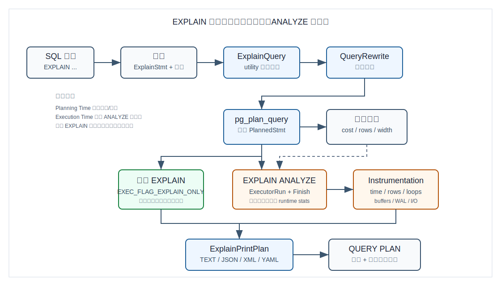
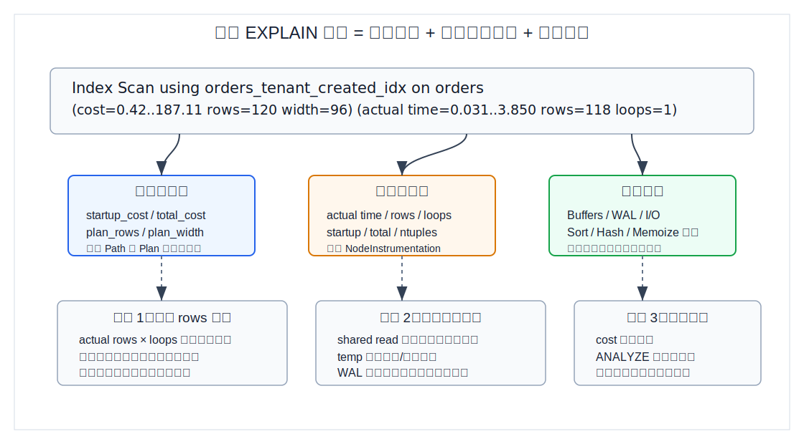
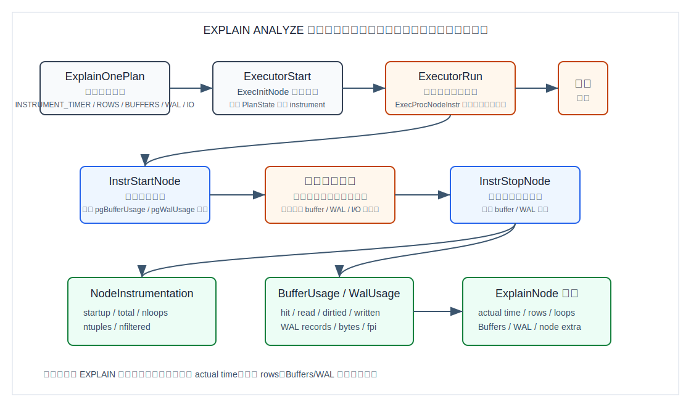
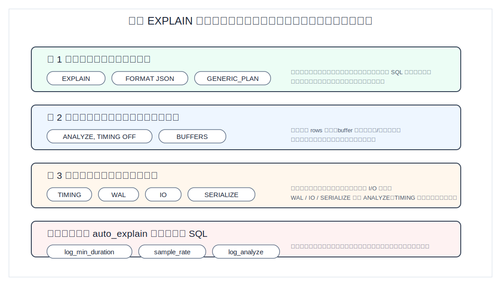
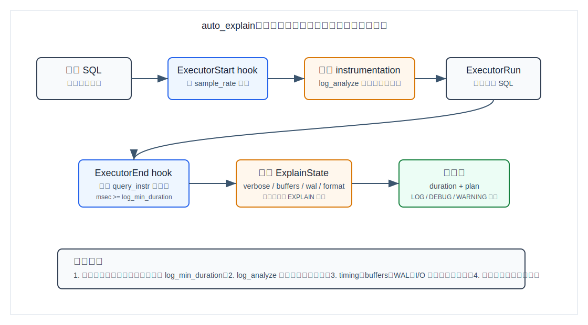

## 数据库筑基课 - EXPLAIN

### 作者
digoal

### 日期
2026-06-08

### 标签
PostgreSQL , 应用开发者 , 数据库筑基课 , 优化器 , 执行计划 , EXPLAIN  

----

## 背景
   


慢 SQL 最怕的不是慢，而是“看起来什么都对”：索引建了，SQL 也不复杂，测试环境很快，线上却突然抖动。此时只看 SQL 文本没有用，因为数据库真正执行的不是 SQL 字符串，而是优化器生成的计划树。`EXPLAIN` 就是把这棵计划树暴露出来的入口。

我在当前项目没有找到独立的“数据库筑基课大纲”文件，因此本文按执行算子与优化器可观测性模块组织。本文参考 PostgreSQL 本地源码与文档：`postgres/doc/src/sgml/ref/explain.sgml`、`postgres/doc/src/sgml/perform.sgml`、`postgres/src/backend/commands/explain.c`、`postgres/src/backend/commands/explain_state.c`、`postgres/src/include/executor/instrument.h`、`postgres/contrib/auto_explain/auto_explain.c`，并用 DeepWiki 的 `postgres/postgres` 架构说明做辅助索引，关键结论以本地源码和官方文档为准。

## 一、它解决什么问题？

`EXPLAIN` 解决的是“从 SQL 到执行路径之间的黑箱问题”。应用开发者看到的是：

```sql
SELECT *
FROM orders
WHERE tenant_id = 42
  AND created_at >= now() - interval '7 days'
ORDER BY created_at DESC
LIMIT 50;
```

数据库内部真正要决定的是：

- 从哪张表或哪个索引开始读；
- 用顺序扫描、索引扫描、索引仅扫描、Bitmap 扫描还是并行扫描；
- 多表查询时用 Nested Loop、Hash Join 还是 Merge Join；
- 排序、聚合、去重、Limit、CTE、Subquery 放在什么位置；
- 每个节点预计处理多少行、行宽多少、启动代价和总代价是多少；
- 如果执行真实查询，估算行数和真实行数偏差有多大，时间花在哪个节点，buffer、临时文件、WAL、I/O 是否异常。

传统做法是凭经验猜：是不是缺索引、是不是统计信息旧、是不是参数变化、是不是缓存冷。`EXPLAIN` 把问题转换成可检查的证据链：计划是否合理、估算是否失真、真实执行是否被 I/O、排序、哈希、写放大或输出序列化拖慢。

代价也很明确：普通 `EXPLAIN` 只看估算，不证明真实耗时；`EXPLAIN ANALYZE` 会真实执行语句，对写语句有副作用，并且会引入观测开销。

## 二、它是什么？

`EXPLAIN` 是 PostgreSQL 的非标准 SQL 命令，用于显示优化器为指定语句生成的执行计划。官方文档列出的可解释语句包括 `SELECT`、`INSERT`、`UPDATE`、`DELETE`、`MERGE`、`VALUES`、`EXECUTE`、`DECLARE`、`CREATE TABLE AS`、`CREATE MATERIALIZED VIEW AS` 等。

它有两种核心模式：

| 模式 | 是否执行 SQL | 主要输出 | 适合用途 |
|---|---:|---|---|
| `EXPLAIN` | 否 | 计划节点、估算 cost、估算 rows、估算 width | 低风险看优化器会怎么走 |
| `EXPLAIN ANALYZE` | 是 | 估算字段 + actual time、actual rows、loops、可选 Buffers/WAL/I/O | 验证估算和真实执行是否一致 |

关键术语：

- `cost`：优化器内部代价单位，不是毫秒。通常可理解为基于 page fetch、CPU tuple、operator 等成本参数组合出来的相对代价。
- `startup cost`：节点返回第一行前需要付出的估算代价。
- `total cost`：节点返回全部估算行数时的总代价。
- `rows`：优化器估算该节点输出多少行。
- `width`：优化器估算每行平均宽度。
- `actual time`：`ANALYZE` 执行后测得的真实节点耗时，单位毫秒。
- `loops`：节点被执行的轮数。内层 Nested Loop、并行执行、重复扫描都会让它大于 1。
- `Buffers`：共享、本地、临时 block 的命中、读取、弄脏、写出统计。
- `WAL`：写路径产生的 WAL records、full page images、bytes 等统计。

## 三、核心原理



图 1 说明：`EXPLAIN` 的主路径是 utility command。源码入口在 `ExplainQuery()`：先解析选项到 `ExplainState`，再走规则重写，随后调用 `pg_plan_query()` 生成 `PlannedStmt`。普通 `EXPLAIN` 设置 `EXEC_FLAG_EXPLAIN_ONLY`，不会运行查询；`EXPLAIN ANALYZE` 才调用 `ExecutorRun()` 和 `ExecutorFinish()`，并在执行器中收集真实统计。

### 3.1 选项先进入 ExplainState

`postgres/src/include/commands/explain_state.h` 定义了 `ExplainState`，里面有 `analyze`、`verbose`、`costs`、`buffers`、`wal`、`timing`、`summary`、`memory`、`settings`、`io`、`generic`、`serialize`、`format` 等字段。`postgres/src/backend/commands/explain_state.c` 的 `ParseExplainOptionList()` 负责把 SQL 选项写入这些字段。

几个边界来自源码校验，不是经验规则：

- `WAL` 必须和 `ANALYZE` 一起用；
- `TIMING` 必须和 `ANALYZE` 一起用；
- `IO` 必须和 `ANALYZE` 一起用；
- `SERIALIZE` 必须和 `ANALYZE` 一起用；
- `GENERIC_PLAN` 不能和 `ANALYZE` 同时使用；
- 没有显式设置时，`ANALYZE` 会默认打开 `TIMING`、`BUFFERS` 和 `SUMMARY`。

### 3.2 估算来自优化器，实测来自执行器



图 2 说明：一行计划输出里有两套来源。`cost/rows/width` 来自优化器的 `Plan` 字段和代价模型；`actual time/rows/loops` 来自执行器的 `NodeInstrumentation`。所以不要拿 `cost` 和 `actual time` 直接比较，它们不是同一单位。真正应该先比较的是估算 `rows` 与真实 `actual rows × loops` 是否同量级。

优化器侧，`postgres/src/include/nodes/plannodes.h` 的 `Plan` 结构保存 `startup_cost`、`total_cost`、`plan_rows`、`plan_width`。`postgres/src/backend/optimizer/path/costsize.c` 解释了代价模型的基础参数，例如 `seq_page_cost`、`random_page_cost`、`cpu_tuple_cost`，并说明 `startup_cost` 与 `total_cost` 如何用于估算取部分行时的代价。

执行器侧，`postgres/src/include/executor/instrument.h` 定义了：

- `NodeInstrumentation`：记录节点级 `startup`、`total`、`ntuples`、`nloops`、过滤行数等；
- `BufferUsage`：记录 shared/local/temp block 的 hit、read、dirtied、written 和 I/O timing；
- `WalUsage`：记录 WAL records、FPI、bytes、WAL buffers full 等；
- `InstrumentOption`：用 bitmask 表示是否需要 timer、buffers、rows、WAL、I/O。

### 3.3 ANALYZE 如何收集真实指标



图 3 说明：`ExplainOnePlan()` 根据选项设置 `instrument_option`。执行树初始化时，`ExecInitNode()` 会在 `estate->es_instrument` 存在时为每个 `PlanState` 分配 `NodeInstrumentation`。执行节点被 `ExecProcNodeInstr()` 包装，进入节点时 `InstrStartNode()` 保存时间和全局 buffer/WAL 计数快照，离开节点时 `InstrStopNode()` 累积耗时、元组数，并计算这段时间内 buffer/WAL 计数器差值。

这解释了三个常见现象：

1. `TIMING OFF` 仍然能看到真实行数，因为它可以只打开 `INSTRUMENT_ROWS`，不做节点级计时。
2. `BUFFERS`、`WAL` 不是优化器估计，而是执行期计数器差值。
3. 并行计划会有 worker instrumentation；文本输出默认汇总，`VERBOSE` 时可显示更多 worker 细节。

### 3.4 输出阶段只是把树打印出来

`ExplainPrintPlan()` 会遍历 `QueryDesc` 中的计划树，调用 `ExplainNode()` 打印节点类型和字段。文本格式由缩进表现父子节点关系；JSON、XML、YAML 使用结构化属性，适合工具解析。

`ExplainNode()` 还会按节点类型打印附加信息。例如：

- Sort 节点可显示 sort method、memory/disk 空间；
- Hash 节点可显示 buckets、batches、memory usage；
- Index Scan、Bitmap Index Scan、Index Only Scan 可显示 `Index Searches`；
- scan 或 join 过滤可显示 `Rows Removed by Filter`；
- lossy index recheck 可显示 `Rows Removed by Index Recheck`；
- Bitmap Heap Scan 可显示 exact/lossy heap blocks；
- `BUFFERS` 和 `WAL` 由 `show_buffer_usage()`、`show_wal_usage()` 打印。

## 四、横向对比

| 维度 | 普通 EXPLAIN | EXPLAIN ANALYZE | auto_explain |
|---|---|---|---|
| 主要目标 | 看优化器选择的计划 | 验证计划与真实执行 | 在生产日志中捕捉慢 SQL 计划 |
| 是否执行 SQL | 否 | 是 | 是，随业务 SQL 正常执行 |
| 是否有写副作用 | 否 | 写语句有 | 业务本来会执行，模块只记录 |
| 估算字段 | 有 | 有 | 有 |
| 真实行数/耗时 | 无 | 有 | `log_analyze` 开启时有 |
| Buffer/WAL/I/O | 规划期 buffer 可选；无执行期真实明细 | 可选，部分默认随 ANALYZE 打开 | 由 `auto_explain.log_buffers`、`log_wal`、`log_io` 控制 |
| 观测开销 | 低，主要是解析、重写、规划 | 中到高，取决于计时、资源统计、查询本身 | 可控但需谨慎，取决于采样、阈值和开启的指标 |
| 最适合场景 | 上线前审查、快速判断是否用索引 | 复现慢 SQL、验证统计信息与执行瓶颈 | 无法复现、只在线上出现的慢查询 |
| 不适合场景 | 判断真实耗时 | 对生产写语句直接运行 | 全量记录所有 SQL 且打开高成本选项 |

原因很简单：三者站在不同阶段。普通 `EXPLAIN` 站在规划阶段；`EXPLAIN ANALYZE` 站在一次真实执行阶段；`auto_explain` 站在生产执行路径上，用钩子在慢 SQL 结束时补打计划。



图 4 说明：越接近真实执行，越能看到真实瓶颈，也越要控制副作用和观测开销。安全的诊断顺序通常是先 `EXPLAIN`，再 `EXPLAIN (ANALYZE, TIMING OFF, BUFFERS)`，最后按需要打开 `TIMING`、`WAL`、`IO`、`SERIALIZE`。

## 五、效果如何？

`EXPLAIN` 的核心收益不是“让 SQL 自动变快”，而是把调优从猜测变成证据驱动。

### 5.1 找到估算错误

官方性能文档强调，`EXPLAIN ANALYZE` 最重要的检查点通常是估算行数是否接近真实行数。行数估算错了，优化器可能低估 Nested Loop 内层执行次数、误判 Hash Join 是否划算、误判索引扫描和顺序扫描的边界。

常见原因：

- 表刚经历大量变更，统计信息还没更新；
- 多列条件存在相关性，但普通单列统计难以表达；
- 表达式、函数、类型转换让选择率估算失真；
- 参数化 SQL 的 generic plan 和具体参数值的 custom plan 差异很大；
- 数据倾斜严重，平均值掩盖热点值。

### 5.2 找到资源瓶颈

`BUFFERS` 可以区分“CPU 慢”和“读块多”。例如：

- `shared hit` 多：主要来自缓存中的共享 buffer；
- `shared read` 多：需要从存储读入共享 block；
- `temp read/write` 多：排序、哈希、Materialize 等节点可能溢出到临时文件；
- `dirtied/written` 多：查询修改或写出 buffer，对写路径和检查点有影响。

`WAL` 可以解释写路径的日志放大。更新大量行、触发 full page image、索引维护多时，WAL bytes 和 records 会给出更直接的证据。

`SERIALIZE` 用于测量输出转换成本。默认 `EXPLAIN ANALYZE` 不把结果发给客户端，也不计入网络传输成本；如果结果行很宽、TOAST 值很多、输出函数昂贵，`SERIALIZE TEXT/BINARY` 可以把数据转换成本单独暴露出来。

### 5.3 明确边界

`EXPLAIN` 的结果不能随便外推。官方文档明确提醒：小表上的计划不能直接推导到大表，代价模型不是简单线性；`LIMIT`、Merge Join 提前停止、BitmapAnd/BitmapOr 的实现限制、分区运行期裁剪都会让输出看起来和直觉不一致。

## 六、实操 DEMO

以下 SQL 是最小可验证实验。当前任务没有启动 PostgreSQL 实例，因此示例未在本环境执行，也不提供伪造输出。执行后请用输出中的计划节点和指标验证旁边的观察点。

### 6.1 准备数据

```sql
DROP TABLE IF EXISTS explain_demo_orders;

CREATE TABLE explain_demo_orders (
  id bigserial PRIMARY KEY,
  tenant_id int NOT NULL,
  status text NOT NULL,
  amount numeric(12,2) NOT NULL,
  created_at timestamptz NOT NULL DEFAULT now()
);

INSERT INTO explain_demo_orders (tenant_id, status, amount, created_at)
SELECT
  (random() * 99)::int + 1,
  CASE WHEN random() < 0.8 THEN 'paid' ELSE 'pending' END,
  round((random() * 1000)::numeric, 2),
  now() - (random() * interval '60 days')
FROM generate_series(1, 200000);

ANALYZE explain_demo_orders;
```

### 6.2 只看计划

```sql
EXPLAIN
SELECT *
FROM explain_demo_orders
WHERE tenant_id = 42
  AND status = 'paid'
ORDER BY created_at DESC
LIMIT 50;
```

观察点：

- 是否出现 `Seq Scan` 或需要额外 `Sort`；
- `rows` 是否看起来很大；
- `LIMIT` 是否影响优化器对 startup cost 的偏好。

### 6.3 建索引后再看计划

```sql
CREATE INDEX explain_demo_orders_tenant_status_created_idx
ON explain_demo_orders (tenant_id, status, created_at DESC);

ANALYZE explain_demo_orders;

EXPLAIN
SELECT *
FROM explain_demo_orders
WHERE tenant_id = 42
  AND status = 'paid'
ORDER BY created_at DESC
LIMIT 50;
```

观察点：

- 是否改为 `Index Scan`；
- 是否不再需要显式 Sort；
- 估算 `rows` 是否随统计信息更新而变化。

### 6.4 验证真实执行

```sql
EXPLAIN (ANALYZE, BUFFERS, TIMING OFF)
SELECT *
FROM explain_demo_orders
WHERE tenant_id = 42
  AND status = 'paid'
ORDER BY created_at DESC
LIMIT 50;
```

观察点：

- `actual rows × loops` 与估算 `rows` 是否同量级；
- `Buffers` 里 `shared hit/read` 的比例；
- `TIMING OFF` 下仍可观察真实行数和 buffer 行为，减少节点级计时开销。

### 6.5 写语句必须保护副作用

```sql
BEGIN;

EXPLAIN (ANALYZE, BUFFERS, WAL)
UPDATE explain_demo_orders
SET status = 'paid'
WHERE tenant_id = 42
  AND status = 'pending';

ROLLBACK;
```

观察点：

- 顶层 `Update` 节点下方的扫描节点负责找行；
- `WAL` 显示写路径产生的日志；
- 即使 `EXPLAIN` 丢弃查询输出，`ANALYZE` 仍会真实执行写操作，所以用事务回滚保护。

### 6.6 参数化 SQL 看 generic plan

```sql
EXPLAIN (GENERIC_PLAN)
SELECT *
FROM explain_demo_orders
WHERE tenant_id = $1::int
  AND status = $2::text
ORDER BY created_at DESC
LIMIT 50;
```

观察点：

- generic plan 不依赖具体参数值；
- 它不能和 `ANALYZE` 同用；
- 如果热点租户和普通租户数据量差异很大，要对比 `EXPLAIN ANALYZE EXECUTE prepared_stmt(...)` 的 custom plan。

## 七、最佳实践

### 数据库架构师

把 `EXPLAIN` 当成建模验证工具，而不是事后救火工具。设计表、索引、分区、冷热拆分时，应该用代表性查询检查扫描方式、连接顺序、排序位置、分区裁剪、Limit 与索引顺序是否匹配。

推荐做法：

- 对核心 API SQL 保存 `EXPLAIN (FORMAT JSON)` 基线，方便版本升级和索引变更后做结构化 diff；
- 对多租户、状态机、时间线类查询，分别用热点值、冷门值、近期时间窗、历史时间窗验证计划；
- 不只看是否使用索引，还要看估算行数、回表成本、排序成本、并行计划启动成本。

### DBA

把 `EXPLAIN ANALYZE` 当成诊断工具，而不是压测工具。它能告诉你这一轮执行发生了什么，但不能替代长期监控。

推荐做法：

- 先用 `EXPLAIN` 降低风险，再用 `EXPLAIN (ANALYZE, TIMING OFF, BUFFERS)` 看真实行数与 buffer；
- 对写放大问题再加 `WAL`；
- 对输出很宽、客户端拿数慢的问题再加 `SERIALIZE`；
- 慢 SQL 只在线上出现时，用 `auto_explain` 设置阈值和采样，不要全量记录所有查询。

### 业务开发者

读计划时先问三个问题：

1. 返回 50 行的 SQL，底层是不是扫描了几十万行？
2. `rows` 估算和 `actual rows` 是否差一个数量级以上？
3. 慢是在扫描、连接、排序、哈希、写入，还是输出转换？

写 SQL 时避免让优化器失明：

- 避免在索引列外包不可下推或难估算的表达式；
- 多列条件经常同时出现时，考虑联合索引或扩展统计信息；
- 分页和排序要让索引顺序服务于 `WHERE + ORDER BY + LIMIT`；
- 参数化语句遇到极端数据倾斜时，要意识到 generic plan 可能不是某个具体参数的最优计划。

## 八、适合与不适合场景

适合：

- 核心查询上线前评审；
- 慢 SQL 复现和根因定位；
- 验证统计信息是否过旧或选择率是否失真；
- 比较索引、分区、SQL 改写前后的计划；
- 确认排序、哈希、聚合是否溢出；
- 写入语句的 WAL 与 buffer 行为分析；
- 生产慢 SQL 日志采样。

不适合：

- 用普通 `EXPLAIN` 断言真实耗时；
- 在生产对写语句直接跑 `EXPLAIN ANALYZE` 而不做事务保护；
- 用小样本表计划外推大表计划；
- 只凭一次 `EXPLAIN ANALYZE` 代替监控、采样和压测；
- 把 `cost` 当毫秒；
- 在高 QPS 生产环境无阈值、无采样地打开高成本 `auto_explain` 选项。

## 九、常见坑

### 坑 1：只看有没有用索引

索引扫描不一定快。小表顺序扫描可能更便宜；返回比例很高时顺序扫描可能更合理；索引扫描可能随机 I/O 多；索引条件之后还有大量 Filter 也可能很慢。

### 坑 2：把 cost 当耗时

`cost=0.42..187.11` 不是 `0.42ms..187.11ms`。cost 是优化器内部相对单位，用来比较候选路径，不等价于墙钟时间。

### 坑 3：忘记 loops

内层节点的 `actual rows=1 loops=10000` 不是只处理 1 行，而是平均每轮 1 行、执行 10000 轮。总处理量要乘以 `loops`。

### 坑 4：忽略 LIMIT 的提前停止

`LIMIT` 可能让上层节点拿到足够行后停止请求下层节点。下层估算仍按跑完显示，真实 `actual rows` 可能远小于估算，这不一定是估算错误。

### 坑 5：在写语句上直接 ANALYZE

`EXPLAIN ANALYZE UPDATE/DELETE/INSERT/MERGE` 会真实修改数据。官方推荐用：

```sql
BEGIN;
EXPLAIN ANALYZE ...;
ROLLBACK;
```

### 坑 6：忽略观测开销

节点级 `TIMING` 要频繁读取系统时钟。官方文档提醒，在某些系统上这会显著拖慢查询，尤其是本身很轻的节点。只需要真实行数时可用 `TIMING OFF`。

### 坑 7：以为 EXPLAIN ANALYZE 包含网络发送成本

默认情况下，结果不会发送给客户端，输出转换成本也不计入。需要观察输出序列化成本时使用 `SERIALIZE TEXT` 或 `SERIALIZE BINARY`；网络传输成本仍不能靠 `EXPLAIN` 直接测出。

### 坑 8：auto_explain 开太猛

`auto_explain.log_min_duration = 0` 且 `log_analyze = on`、`log_timing = on`、`log_buffers = on` 会带来日志量和观测开销。生产中要设置阈值、采样率、参数长度和日志等级。



图 5 说明：`auto_explain` 通过 executor hooks 接入生产执行路径。`ExecutorStart` 阶段决定是否采样并开启 instrumentation；`ExecutorEnd` 阶段判断耗时是否超过阈值，再构造 `ExplainState` 并调用 `ExplainPrintPlan()` 记录计划。这不是离线猜测，而是把线上慢 SQL 的真实执行计划写入日志。

## 十、扩展问题

1. 当 `rows` 估算偏差很大时，你应该先更新统计信息、加扩展统计信息、改索引，还是改 SQL？判断顺序是什么？
2. 为什么 `ORDER BY created_at DESC LIMIT 50` 经常需要把排序方向纳入联合索引设计？
3. 为什么 `EXPLAIN (FORMAT JSON)` 更适合作为 CI 或升级前后的计划对比基线？
4. generic plan 和 custom plan 的差异会如何影响多租户热点查询？
5. `BUFFERS` 显示 shared hit 很多但查询仍慢时，下一步应该看 CPU、锁等待、JIT、表达式计算，还是客户端取数？
6. 在同一条 SQL 上，如何区分“统计信息错误导致选错计划”和“计划正确但存储/I/O 太慢”？

## 十一、扩展阅读

- PostgreSQL 官方文档：`../postgres/doc/src/sgml/ref/explain.sgml`，`EXPLAIN` 语法、选项、边界和示例。
- PostgreSQL 官方文档：`../postgres/doc/src/sgml/perform.sgml`，`Using EXPLAIN`、`EXPLAIN ANALYZE`、caveats、planner statistics。
- PostgreSQL 官方文档：`../postgres/doc/src/sgml/auto-explain.sgml`，`auto_explain` 配置、阈值、采样和示例。
- PostgreSQL 源码：`../postgres/src/backend/commands/explain.c`，`ExplainQuery()`、`standard_ExplainOneQuery()`、`ExplainOnePlan()`、`ExplainPrintPlan()`、`ExplainNode()`。
- PostgreSQL 源码：`../postgres/src/backend/commands/explain_state.c`，`NewExplainState()`、`ParseExplainOptionList()`、扩展 EXPLAIN 选项注册。
- PostgreSQL 源码：`../postgres/src/include/commands/explain_state.h`，`ExplainState`、输出格式、序列化选项。
- PostgreSQL 源码：`../postgres/src/include/executor/instrument.h` 与 `../postgres/src/backend/executor/instrument.c`，`NodeInstrumentation`、`BufferUsage`、`WalUsage`、`InstrStartNode()`、`InstrStopNode()`。
- PostgreSQL 源码：`../postgres/src/backend/executor/execProcnode.c`，执行节点初始化和 instrumentation 分配。
- PostgreSQL 源码：`../postgres/src/backend/optimizer/path/costsize.c`，优化器代价模型基础。
- PostgreSQL 源码：`../postgres/contrib/auto_explain/auto_explain.c`，executor hooks、慢 SQL 阈值、采样与日志输出路径。
- DeepWiki：`postgres/postgres`，用于辅助梳理 PostgreSQL executor、utility command 与 `auto_explain` 的架构关系。
  
## 附录 
1、克隆代码  
```  
git clone --depth 1 https://github.com/postgres/postgres
```  
  
2、启用 codex, 使用 [数据库筑基课 skill](../skills/README.md).  
```
文章标题: 
  数据库筑基课 - explain 
项目源码(本地目录): 
  postgres
项目 codebase 文件名: 
  postgres/CLAUDE.md 
开源项目相关的 deepwiki repoName: 
  postgres/postgres
```


    
#### [PostgreSQL 解决方案集合](../201706/20170601_02.md "40cff096e9ed7122c512b35d8561d9c8")
  
  
#### [德哥 / digoal's Github - 公益是一辈子的事.](https://github.com/digoal/blog/blob/master/README.md "22709685feb7cab07d30f30387f0a9ae")
  
  
#### [About 德哥](https://github.com/digoal/blog/blob/master/me/readme.md "a37735981e7704886ffd590565582dd0")
  
  

  
