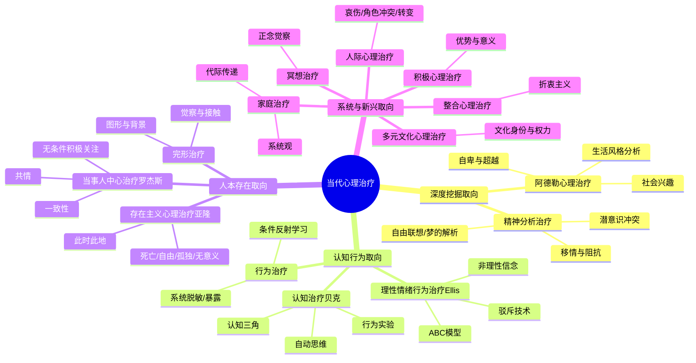
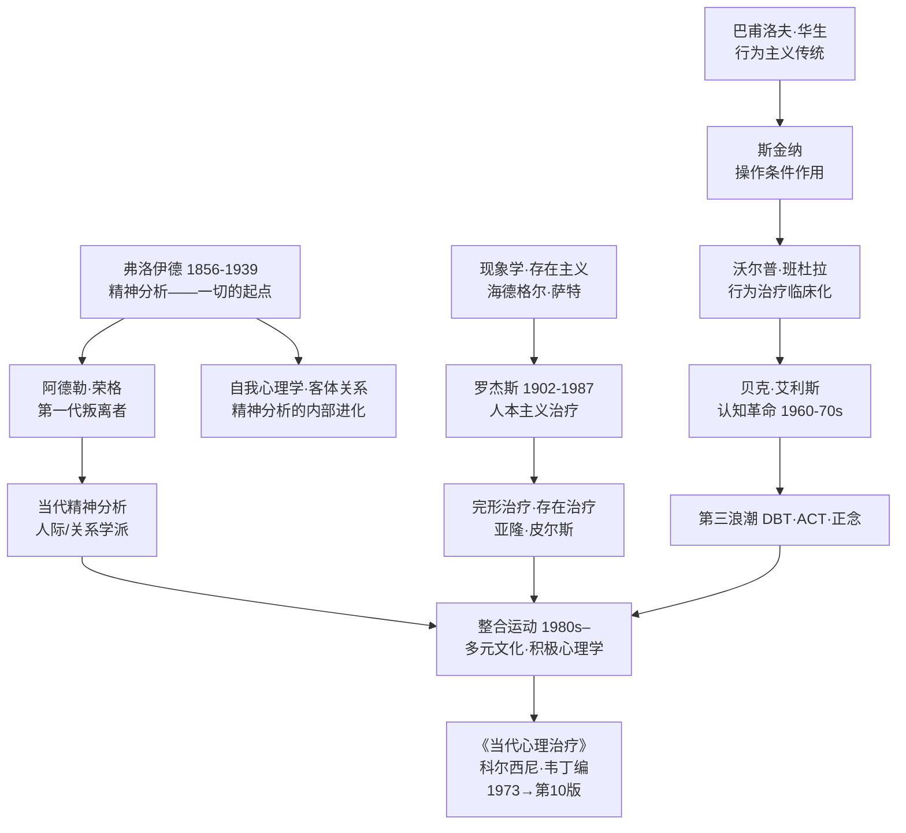

## 《当代心理治疗》读书笔记 
  
### 作者  
digoal  
  
### 日期  
2026-06-08 
  
### 标签  
读书笔记 , 当代心理治疗  
  
----  
  
## 背景 
  
  

---
书名: 《当代心理治疗》（第10版）  
原著: Current Psychotherapies  
主编: [美] 雷蒙德·科尔西尼（Raymond J. Corsini）/ [美] 丹尼·韦丁（Danny Wedding）  
译者: 伍新春 / 臧伟伟 / 刘畅 / 付芳  
出版社: 中国人民大学出版社  
出版年: 2021-9-1  
页数: 586页  
ISBN: 9787300297293  
笔记日期: 2026-06-07  
豆瓣链接: https://book.douban.com/subject/35591057/  
标签: [心理治疗, 心理咨询, 精神分析, 认知行为, 人本主义, 教材, 流派比较]  
---

  

> **一句话**：这不是一本书，而是一场由弗洛伊德、罗杰斯、贝克、阿德勒等伟大心灵共同出席的圆桌会议——他们用各自的语言，回答同一个问题：人是怎么变好的？  
>  
> **适合谁读**：心理咨询/心理学专业学生、正在接受心理治疗或考虑接受治疗的人、对人类内心世界感到好奇的普通读者  
>  
> **阅读难度**：⭐⭐⭐⭐☆（学术教材，但各章独立，可以选读）  
>  
> **推荐指数**：⭐⭐⭐⭐⭐  
  
---

## 一、时代坐标：这本书从哪里来？

1973年，美国心理学家雷蒙德·科尔西尼做了一件有点"疯狂"的事：他邀请十几个彼此看法不同甚至互相批评的治疗流派，让他们坐在同一本书里，用统一的体例讲清楚自己的主张。

这个时代背景非常重要。彼时，精神分析已统治心理治疗界数十年，但行为主义在60年代发起了强力挑战，人本主义紧随其后，认知治疗方兴未艾。心理咨询领域正处于"百家争鸣、诸侯割据"的状态——每个流派都说自己才是正宗，都说别人的方法是错的。

科尔西尼本人的经历本身就是一个隐喻。他在大学时代穷到无法完成学业，后来在监狱里当心理学家，有一次对一个囚犯说了一句"额外投入"的话（他无意中告诉这名囚犯，测试显示他其实拥有正常智力），而这名囚犯从此人生改变——不是通过任何系统的治疗方法，而是通过一次意外的、真实的对话。这件事让科尔西尼一辈子都在思考：**心理治疗的改变，到底来自哪里？**

《当代心理治疗》首版于1973年，半个世纪后已更新至第10版，成为美国高校使用时间最长、范围最广的心理咨询教材。这不只是一本教科书，更是一座博物馆——它把人类在20世纪对"心理痛苦"这件事最重要的思考方式，全部陈列在一起，让你自己去比较、去判断。

```svg
<svg viewBox="0 0 680 160" xmlns="http://www.w3.org/2000/svg" font-family="sans-serif">
  <defs>
    <marker id="arrow" markerWidth="8" markerHeight="8" refX="6" refY="3" orient="auto">
      <path d="M0,0 L0,6 L8,3 z" fill="#555"/>
    </marker>
  </defs>
  <!-- 时间轴主线 -->
  <line x1="30" y1="80" x2="650" y2="80" stroke="#555" stroke-width="2" marker-end="url(#arrow)"/>
  <!-- 节点 -->
  <circle cx="80"  cy="80" r="7" fill="#3B82F6"/>
  <circle cx="200" cy="80" r="7" fill="#10B981"/>
  <circle cx="310" cy="80" r="7" fill="#F59E0B"/>
  <circle cx="420" cy="80" r="7" fill="#EF4444"/>
  <circle cx="540" cy="80" r="7" fill="#8B5CF6"/>
  <!-- 标签（上） -->
  <text x="80"  y="58" text-anchor="middle" font-size="11" fill="#1E3A5F">1900s</text>
  <text x="80"  y="46" text-anchor="middle" font-size="10" fill="#555">弗洛伊德精神分析</text>
  <text x="310" y="58" text-anchor="middle" font-size="11" fill="#1E3A5F">1950–60s</text>
  <text x="310" y="46" text-anchor="middle" font-size="10" fill="#555">行为治疗崛起</text>
  <text x="540" y="58" text-anchor="middle" font-size="11" fill="#1E3A5F">2000s–</text>
  <text x="540" y="46" text-anchor="middle" font-size="10" fill="#555">整合与多元文化</text>
  <!-- 标签（下） -->
  <text x="200" y="103" text-anchor="middle" font-size="11" fill="#1E3A5F">1940–50s</text>
  <text x="200" y="115" text-anchor="middle" font-size="10" fill="#555">人本主义/罗杰斯</text>
  <text x="420" y="103" text-anchor="middle" font-size="11" fill="#1E3A5F">1973</text>
  <text x="420" y="115" text-anchor="middle" font-size="10" fill="#555">本书首版（科尔西尼）</text>
  <!-- 书籍标注 -->
  <rect x="378" y="120" width="86" height="22" rx="4" fill="#FEF3C7" stroke="#F59E0B"/>
  <text x="421" y="135" text-anchor="middle" font-size="10" fill="#92400E">第10版·2021中译</text>
</svg>
```

---

## 二、核心命题：这本书在说什么？

### 命题一：没有哪种流派是"终极真理"，每种流派都有它的道理

这本书最颠覆性的设计，就是它的**平等主义**。

它不评判谁对谁错。精神分析说人的痛苦来自压抑的潜意识冲突；行为治疗说不对，痛苦来自错误的条件反射学习；认知治疗说都不对，关键在于扭曲的思维模式；存在主义治疗说你们都错了，根本问题是人类面对死亡、自由、孤独时的存在焦虑……

有趣的是，这十四个流派都宣称自己有效，而且都有研究支持。所以科尔西尼才提出了一个让所有人不舒服的问题：**如果不同的方法都有效，那么"有效"的真正原因是什么？**

### 命题二：14种流派，其实回答的是同一个问题

本书收录的十四种主流治疗方式，可以粗略地分成三个大家族：

**挖掘过去派**（精神分析、阿德勒心理治疗）：你现在的问题，来自你没有解决的过去。治疗就是带你回溯，让潜意识的东西浮出水面。

**改变当下派**（行为治疗、认知治疗、理性情绪行为治疗）：过去不重要，重要的是你现在的行为模式和思维方式。治疗就是手术刀，精准切除错误的习惯和信念。

**促进存在派**（当事人中心治疗、存在主义治疗、完形治疗）：问题本身不是问题，你与自己的关系才是问题。治疗就是创造一个安全空间，让你真实地成为自己。

新兴的整合流派、多元文化治疗、冥想治疗，则是在说：以上三条路，也许可以同时走。

### 命题三：治疗师这个人，比"用什么方法"更重要

这是本书最难让人接受，却可能是最重要的洞见。书中援引的大量研究显示，不同疗法之间的效果差异，其实远小于不同治疗师之间的差异。换句话说——**你找的人，比你找的方法，更能决定你能不能好起来**。

这就是所谓的"共同因素"：无论哪个流派，有效治疗都包含同样的核心要素——温暖的关系、对来访者真诚的共情、一个让人觉得被理解的安全空间，以及一个可以解释症状的合理框架（哪怕这个框架是"你的超我压制了你的本我"这种对普通人来说完全陌生的语言）。

---

## 三、论证地图：十四条路的全景鸟瞰



每个章节的结构高度统一：理论概要 → 发展历史 → 人格理论 → 心理治疗过程 → 应用评价 → 真实治疗案例。这是这本书最大的工程价值：**它给了你一把横向比较的标尺**。当你读完所有章节，你会发现一个奇妙的现象：同一个"抑郁症来访者"，十四个流派会给出十四种完全不同的解释，但也许都会走向同一个终点——这个人变好了，也对自己的生命有了更清醒的理解。

---

## 四、前提假设与边界：什么情况下这本书的地图会失效？

### 假设一：言语可以治愈

所有心理治疗流派都建立在一个共同前提上：**通过谈话和关系，可以改变人的心理状态**。这在大多数情况下是对的，但对于严重的生物性精神疾病（如双相障碍、精神分裂症），单靠谈话是不够的，需要药物配合。书中各流派多少都承认这个边界，但论述重心不在这里。

### 假设二：来访者有动机改变

心理治疗对"有动机的来访者"效果最好。那些被强迫来的、对改变持矛盾态度的来访者，往往不在各流派的"最佳案例"范围内。本书的案例普遍是相对理想的情境。

### 假设三：西方文化的普适性

书中大多数流派诞生于欧美文化背景，其核心概念（如"自主性""个人边界""自我实现"）都带有深刻的西方个人主义色彩。最后一章的"多元文化心理治疗"试图修正这个盲点，但整体而言，这本书对集体主义文化背景下的治疗适应性讨论仍然有限——这对中国读者尤其值得注意。

### 假设四：流派之间壁垒分明

现实中的资深治疗师，往往不会只用一种方法。他们会在一次咨询中，先用罗杰斯式的共情建立关系，再用认知行为的方法做具体干预，再用存在主义的框架帮助来访者理解意义。本书的"分章讲述"在便于学习的同时，也在某种程度上强化了一种在现实中并不存在的清晰边界。

---

## 五、思想谱系：这本书站在哪个肩膀上？



科尔西尼本人深受阿德勒传统影响（他的博士导师鲁道夫·德雷克斯就是著名的阿德勒主义者），但他编辑这本书的视野超越了任何单一流派。他真正认同的，是**折衷主义**——即在不同来访者、不同问题面前，选择最适合的工具，而非坚守某一意识形态。

继承这本书精神的，是整合运动的兴起。今天越来越多的治疗师自称"整合取向"，正是对科尔西尼这一代人提问的某种回答。

---

## 六、我学到了什么？

读这本书，我最大的冲击来自一个简单的问题：**我们相信一种治疗方法有效，这个"相信"本身，就是有效的一部分。**

书里有个细节：研究发现，当治疗师对自己所用的方法真正有信心，来访者的疗效会更好——哪怕不同治疗师分别用了完全不同的方法。这说明什么？说明治疗框架的真正功能，不只是提供技术，而是提供一套让人觉得"被理解了""有解释了""有方向了"的意义系统。来访者不是被技术治好的，而是被"在一段关系里真实地被看见"这件事治好的。

第二个收获：**"挖过去"和"改当下"不是互斥的**，它们是两种不同的入口。精神分析问的是"你为什么会这样"，认知行为问的是"我们如何让你不再这样"。前者给你深度，后者给你速度。对于某些人，先搞清楚"为什么"才能真正改变；对于另一些人，"先改变再说"反而更有效。没有哪种顺序是错的。

第三个收获：**存在主义治疗章节是这本书里我读得最慢的，也是最有回响的。** 亚隆列出的四个"终极关怀"——死亡、自由、孤独、无意义——不是病理现象，而是人类存在的基本事实。我们的很多心理痛苦，其实不是"病"，而是对这些事实的逃避没有成功。这一点，任何技术都教不了你，只能靠你真的坐下来面对它。

---

## 七、举一反三：这个框架还能用在哪？

这本书提供的最核心的方法论是 **"统一格式下的横向比较"** 。这个思路，其实可以迁移到很多领域：

**管理/组织咨询**：一个企业文化问题，你可以用"系统论"视角（家庭治疗），也可以用"认知重构"视角（认知治疗），也可以用"动机激励"视角（阿德勒治疗）。了解多种框架，不是为了选一个，而是为了在不同情境下选最有用的那个。

**自我认知**：你可以问自己：我习惯从哪个角度看自己的问题？我总是在"挖原因"但不采取行动（精神分析困境），还是总在"解决问题"但不理解自己（行为治疗困境），还是总在"感受当下"但回避深层冲突（人本主义困境）？每种习惯都有它的优势和局限。

**亲密关系**：家庭治疗章节里"代际传递"的概念，几乎可以直接用于理解任何一段糟糕的关系——你现在的模式，往往是你父母那一代没有解决的模式在你这里的重演。

---

## 八、批判与反思

### 这本书最大的局限：它太像博物馆了

博物馆的好处是陈列全面、分门别类；坏处是，展品是静止的，而真实的治疗是流动的。真正在咨询室里工作的治疗师，不会按图索骥地"现在我执行认知重构步骤三"。他们处理的是此时此刻活生生的一个人，充满不确定性、模糊性和意外。这本书给了你地图，但地图不是地形。

### 疗效研究的争议它没有充分呈现

研究者Wampold和艾森克等人在疗效研究领域的激烈争论——到底是流派特异性起作用，还是共同因素起作用——书中虽有提及，但没有给读者一个清晰的现状图景。如果你只读这本书，你会以为每个流派都自信满满地知道自己为什么有效，而现实情况是，这个问题至今没有定论。

### 文化适应性的缺口

"多元文化心理治疗"只有一章，而其他十三章几乎都建立在西方白人中产阶级来访者的默认假设上。对于集体主义文化、宗教背景浓厚的群体、或者经历过系统性压迫的边缘群体，这些理论框架还需要大量本土化的修正工作，而这个工作，这本书只是开了个小小的门缝。

---

## 九、金句与记忆点

**1. "心理治疗的奇迹，往往发生在方法之外。"**（科尔西尼监狱故事的隐喻）
一句无意中说出的真话，可以比一百次系统脱敏更有力量。这提醒我们，改变的发生，永远比我们的理论框架更神秘。

**2. "每个流派都有它的理论，就像每个孩子都有一张解释自己行为的理由清单。"**
所有流派的理论都是解释系统，而解释系统本身就有治疗功能——让混乱的经历变得可以理解。

**3. 精神分析的核心信念**：过去没有消失，它只是潜伏在你的现在。
**4. 认知治疗的核心信念**：你感受到的，不是现实，而是你对现实的解读。
**5. 人本主义的核心信念**：你本来是好的，是外部条件让你偏离了自己。
**6. 存在主义的核心信念**：恐惧死亡、逃避自由、拒绝孤独——这才是大多数神经症的真正来源。
**7. 家庭治疗的核心信念**：没有个体的病，只有系统的病。你是症状，不是原因。
**8. 整合治疗的务实宣言**：不存在唯一正确的方法，只存在当前最合适的方法。

---

## 十、延伸阅读

**1. 《心理治疗大辩论》— Bruce Wampold**
直接质疑本书各流派特异性假设的核心著作。Wampold用元分析研究论证，治疗师因素和共同因素远比流派技术重要。读完《当代心理治疗》后，读这本是最好的解药——让你不至于对任何一个流派迷信过深。

**2. 《存在主义心理治疗》— 欧文·亚隆**
本书中存在主义章节的作者之一，这是他那一章的完整展开版。亚隆的文字兼具学术深度和文学温度，是心理学写作中难得的佳品，即使你不是心理从业者，也值得一读。

**3. 《成为一个人》— 卡尔·罗杰斯**
人本主义治疗的第一手文献，罗杰斯亲自书写他的治疗哲学与案例。读完《当代心理治疗》里对罗杰斯的那章"综述"，再读这本"原著"，你会发现很多综述里没有的温度和细节。

**4. 《认知疗法：基础与应用》— 亚伦·贝克**
认知治疗的奠基性著作，与本书第7章直接对应。如果你对CBT感兴趣，这是最正统的入门文本，操作性极强。

**5. 《心理治疗师的成长》— Orlinsky & Ronnestad**
关注治疗师个人发展的研究性著作，补充了《当代心理治疗》里"治疗师这个人"这个维度的缺失。如果你想成为治疗师，这本书告诉你前辈们走过的路。

---

*笔记写于 2026-06-07 | 基于公开学术资料、豆瓣书评及深度研读整理*
*作者观点代表读书笔记的主观思考，非学术综述*
  
#### [PostgreSQL 解决方案集合](../201706/20170601_02.md "40cff096e9ed7122c512b35d8561d9c8")
  
  
#### [德哥 / digoal's Github - 公益是一辈子的事.](https://github.com/digoal/blog/blob/master/README.md "22709685feb7cab07d30f30387f0a9ae")
  
  
#### [About 德哥](https://github.com/digoal/blog/blob/master/me/readme.md "a37735981e7704886ffd590565582dd0")
  
  

  
