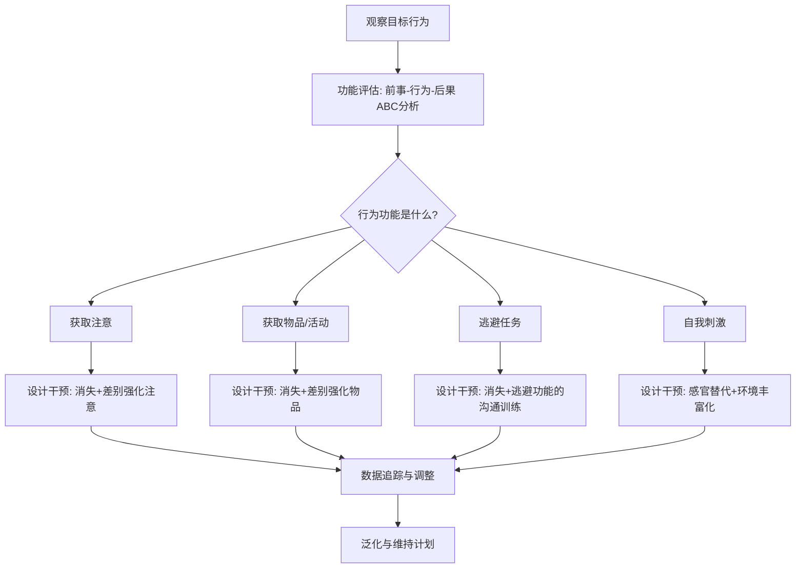

## 《行为矫正：原理与方法》读书笔记 
  
### 作者  
digoal  
  
### 日期  
2026-06-08 
  
### 标签  
读书笔记 , 行为矫正：原理与方法  
  
----  
  
## 背景 
  
  
---
书名: 《行为矫正：原理与方法》（第五版）  
作者: Raymond G. Miltenberger  
译者: 石林  
出版年份: 2015（中文版）/ 原版2012  
出版社: 中国轻工业出版社（万千心理）  
笔记日期: 2024-06-08  
豆瓣链接: https://book.douban.com/subject/26334676/  
豆瓣评分: 9.6（超高评分，专业教材中极为罕见）  
标签: [心理学, 行为分析, ABA, 教育, 特殊教育, 自闭症, 习惯养成]  
---
  
  
  

> **一句话**：这是一本教你用科学方法"重新编程"行为的教科书——无论是消除坏习惯、建立好行为，还是帮助有障碍的孩子，都有明确的操作步骤。  
>  
> **适合谁读**：心理咨询师、特殊教育工作者、家长、想养成好习惯的人，以及任何对"人为什么会这样行动"感兴趣的人  
>  
> **阅读难度**：⭐⭐⭐☆☆（专业教材，但语言刻意通俗，无需心理学基础）  
>  
> **推荐指数**：⭐⭐⭐⭐⭐（豆瓣9.6，ABA领域最佳本科入门教材之一）  
  
---

## 一、时代坐标：这本书从哪里来？

如果你在1960年代去找一位心理学家，希望他帮你戒掉咬手指甲的习惯，他很可能让你躺上沙发，问你小时候和母亲的关系如何。精神分析统治着心理治疗的世界，行为问题被视为内心深处冲突的"症状"，而"症状"本身并不值得直接干预。

这种局面在20世纪中叶开始动摇。斯金纳（B.F. Skinner）的操作性条件反射理论，以及巴甫洛夫的经典条件反射研究，提供了一种完全不同的人类行为观：**行为是学来的，也可以被重新学**。理解控制行为的环境事件，就能系统地改变行为本身，根本不需要深挖潜意识。

1962年，洛瓦斯（Ivar Lovaas）教授在UCLA率先将这套理论用于自闭症儿童干预，结果震动学界：通过密集的行为训练，相当比例的孩子能够进入普通教育体系。行为矫正（Behavior Modification）和应用行为分析（ABA，Applied Behavior Analysis）从此成为一门严肃的应用学科。

Raymond G. Miltenberger 是这个传统的重要传承者。他拿到的是西密歇根大学（Western Michigan University）的临床心理学博士——这所学校堪称全美ABA领域的重镇。此后他任教于南佛罗里达大学（USF），创立并领导应用行为分析项目，长期从事行为干预的研究与实践，尤其专注于运动健身、行为障碍的功能评估，以及儿童自我保护技能训练等方向。

本书第一版出版于1997年，此后持续修订至今已有七版（中文版引进的是第五版）。它的使命始终如一：**为本科生和一年级研究生，以及临床实践者，提供一本能真正读懂、真正用上的行为矫正教科书**。

```
时间轴：行为矫正的思想谱系

1890s     1920s     1950s        1960s         1997
巴甫洛夫  华生行为  斯金纳操作   洛瓦斯ABA    Miltenberger
经典条件  主义宣言  强化箱实验   用于自闭症   首版教材
反射实验  "给我孩子"            儿童干预     问世
         我能塑造           ↓
         任何人"        行为矫正正式
                        进入主流教育
```

---

## 二、核心命题：作者在说什么？

### 命题一：行为由环境事件控制，而非由内在"性格"决定

这是全书最颠覆直觉的一个前提。我们通常认为，一个人"懒"是因为他天生就懒，孩子"爱发脾气"是因为他的性格如此。但行为矫正给出的解释完全不同：

**行为 = 它的后果的函数**

如果某个行为在某个情境下发生后，紧接着出现了正性结果（强化），这个行为就会增加；如果出现了负性结果（惩罚），就会减少；如果什么都没发生（消失/消退），行为就会逐渐消亡。

这意味着，当你看到一个孩子在超市里哭闹不停，你的第一个问题不应该是"这孩子怎么这样"，而是"这个哭闹行为上次发生时，得到了什么结果"。如果每次哭闹都让父母给他买了糖，那不是孩子的问题——是强化程序在起作用。

这种视角有一个激进的伦理含义：**行为问题往往不是当事人的"错"，而是环境设计的问题**。改变环境，行为自然改变。

### 命题二：行为改变必须可测量——"你没有数据就什么都没有"

这是让行为矫正区别于许多软性"心理辅导"的关键特质。Miltenberger 书的前三章就在讲一件事：**如何精确定义和记录目标行为**。

在行为矫正的世界里，"孩子最近变好了"不算数据；"目标行为（打人）在过去一周从每天平均8次降至2次"才算数据。只有精确的测量，才能判断干预是否有效，才能及时调整方案。

这种"数据驱动"的态度，让行为矫正成为心理学领域科学性最强的分支之一，也让它在教育和医疗领域中更容易被评估和推广。

### 命题三：复杂的行为改变，可以被分解为可操作的程序

全书25个章节的精髓，可以归纳为一张操作地图：

- **要增加一个行为？** 用强化（正性/负性）、塑造（Shaping）、行为链（Chaining）、提示与消退（Prompting & Fading）
- **要减少一个行为？** 用消失（Extinction）、差别强化（DRO/DRI/DRA）、惩罚（罚时出局、反应代价）——但惩罚始终是最后手段
- **要维持和泛化？** 用变比程序强化，以及在多种情境下练习
- **要建立复杂技能？** 用行为链、塑造，结合功能评估找到行为的"功能"

这种分解式的思维方式，是行为矫正最强大的地方。它让干预变成了一个可以被学习、被检验、被复制的技艺，而不是某些人才有的直觉天赋。

---

## 三、论证地图：作者怎么说服你的？

Miltenberger 的说服策略非常清晰：**先给案例，再给原理，再给程序**。每一章几乎都遵循这个节奏。读者在接触抽象概念之前，已经先被生动的现实情境"锚定"了。



**核心证据类型**：

书中大量引用了单一被试实验设计（Single-Subject Design）的研究成果。这种研究方法是行为矫正的标配——用同一个人在不同条件下的数据，来证明干预有效，而不依赖大样本统计。这在处理特殊群体时尤其重要，因为每个人的行为功能都可能不同，"平均效果"意义有限。

洛瓦斯1987年的研究是本书援引的最震撼的数据之一：对3岁以下的自闭症儿童，每周40小时的密集ABA干预，坚持三年，其中接近一半的孩子能融入普通教育，在智力和情绪功能方面与同龄人无异。这个数字颠覆了当时学界对自闭症的悲观预期。

---

## 四、前提假设与边界：什么情况下这不成立？

### 假设一：行为主要由外部环境塑造，内部因素（认知、情绪、基因）是次要的

这是行为主义的哲学根基，也是最大的争议焦点。

自我决定理论（Self-Determination Theory，Deci & Ryan）的研究表明，**内在动机**在行为维持中发挥着关键作用。如果一个人只是为了获得外部强化而做某件事，一旦撤除奖励，行为很可能消失。Miltenberger 书中虽然也提到了内在强化和自我管理，但对内在动机的处理确实偏简化。

这并不是说行为矫正"错了"，而是说它是一个强力的工具，但不是万能工具。**对于外显行为问题，尤其是儿童和发育障碍群体，它的效果无可匹敌；对于复杂的成人内心冲突，它需要与认知疗法等整合使用。**

### 假设二：强化物是可以被识别和控制的

这在实验室或高度结构化的治疗环境里成立，在日常生活中却相当复杂。比如，当一个孩子打人，他同时得到了老师的关注（对他来说可能是强化）、同学的惊叫（可能也是强化）和短暂逃离课堂的机会（也是强化）——到底是哪个在维持行为？功能评估可以帮助澄清，但在嘈杂的真实环境里，控制所有变量几乎不可能。

### 假设三：训练效果会自然泛化

书中有专门的"泛化"章节，但现实中，在某个情境下建立的行为，迁移到新情境并不是自动发生的，需要刻意规划。这是ABA实践者经常遭遇的挑战之一，仅靠理论无法解决，需要大量临床经验。

---

## 五、思想谱系：这本书在哪个传统里？

Miltenberger 的思想直接根植于斯金纳的操作条件反射，以及巴甫洛夫和华生奠定的行为主义传统。但他并不是一个原教旨行为主义者——书中包含了认知行为矫正和自我管理的内容，承认认知事件（想法、图像）也是一种"行为"，同样可以被分析和改变。

```
思想谱系图

巴甫洛夫          华生
(经典条件反射)    (行为主义)
      ↘               ↙
         斯金纳
    (操作条件反射/强化理论)
              ↓
      行为矫正/应用行为分析
    ┌─────────┼─────────┐
 洛瓦斯      Baer/Wolf    Miltenberger
(自闭症干预) (ABA七维度)  (教材化普及)
              ↓
    整合认知行为(CBT)
    Miltenberger第5版起
    明确纳入认知矫正
```

这本书在ABA领域的地位，相当于物理学的入门教材——它不是领域里最深的那本，但它是最好的入口。学术评论（JABA，1998）明确指出，这是本科ABA教学中最佳教材之一，其清晰度和可读性超过了同类竞争者。

---

## 六、我学到了什么？

读完这本书，有三件事真正改变了我对"行为"的理解方式。

**第一，我开始"读行为"了。**

以前我看到一个孩子发脾气，会直接贴标签："这孩子脾气差"。现在我会习惯性地想：这个行为的前事（Antecedent）是什么？行为本身（Behavior）怎么描述？后果（Consequence）是什么？这个ABC分析框架，是一副看穿行为表象的眼镜。它让我意识到，大多数"问题行为"背后都有一个清晰的环境逻辑，只是我们通常没有耐心去发现它。

**第二，惩罚的使用让我重新思考。**

这本书对惩罚的处理非常克制和负责任。Miltenberger 明确指出，惩罚只能压制行为，不能教会新行为；它会引发攻击性，破坏关系；只有在其他方法都无效、行为本身有危险时，才考虑使用。这让我意识到很多家庭和学校"天天惩罚"的局面有多么低效——批评和责备往往既不能消除坏行为，又没有建立好行为。

**第三，改变是可以被设计的。**

最打动我的，是这本书背后的乐观主义：**人的行为是可塑的，改变是可以被精确设计的**。这不是鸡汤式的乐观，而是有严格实验数据支撑的乐观。那些被认为"无法改变"的孩子，通过结构化的行为干预，改变了。这份乐观，是这本教科书的底色。

---

## 七、举一反三：这个框架还能用在哪？

行为矫正的核心框架——ABC分析 + 强化/消失 + 数据追踪——远不止用于临床。

**习惯养成（个人应用）**：想建立跑步习惯？用行为矫正的逻辑：设置明确的前事（换好运动服、把跑鞋放门口），在行为完成后立即给予强化（好喝的蛋白饮料、记录在APP上），前期用固定比率程序，稳定后改为变比率（更难戒除）。詹姆斯·克利尔的《原子习惯》本质上就是行为矫正的科普版。

**职场管理（组织应用）**：为什么员工不主动汇报问题？因为汇报问题的后果往往是被批评（惩罚）。如果主动汇报的后果是被感谢和共同解决（正性强化），行为频率自然上升。行为矫正的眼光让你看穿组织文化中隐藏的强化结构。

**亲子教育（家庭应用）**：与其在孩子发脾气时大喊大叫（结果：孩子得到了关注），不如在行为发生前察觉前事信号，在良好行为出现时立即强化。全书最实用的两章，是关于差别强化（DRO/DRI）的操作——当你做到"对好行为比对坏行为给更多注意"时，环境就开始悄悄工作了。

---

## 八、批判与反思

### "人是机器"的幽灵

行为矫正被批评最多的，是它隐含的一种"人是可控机器"的世界观。当我们说一个人的行为完全由强化历史决定时，主体性（Agency）和自由意志去哪儿了？

这是一个真实的哲学张力，Miltenberger 在书中没有正面回应。斯金纳倒是从来不回避这个问题——他在《超越自由与尊严》里直接说，自由意志本来就是幻觉。但大多数读者，包括我，很难完全接受这个结论。

实践中，我倾向于把行为矫正理解为**一套强力的环境设计工具**，而不是关于人性的完整理论。就像建筑设计可以影响人流动向而不需要"控制"任何人一样，好的行为矫正也是在设计情境，让好的行为更容易发生，而不是在操控具体的人。

### 文化适配的问题

书中案例大量来自北美临床环境，强化物和惩罚物的选择有明显的文化预设。在中国家庭或学校情境中实施时，需要对"什么对这个孩子/这个群体有强化效果"重新评估——这不是理论问题，但很多人在直接套用时会遇到困难。

### 伦理的灰色地带

书中对惩罚方法（尤其是厌恶刺激）的使用讨论，反映了领域内长期存在的伦理争议。在严重自伤行为的干预中，某些激进的惩罚手段是否被允许？不同国家的法规、不同研究者的立场都不一致。这是一个书中处理得较保守但现实中很尖锐的问题。

---

## 九、金句与记忆点

1. **"行为矫正的目标不是改变一个人，而是改变一个人的行为。"**
   ——这句话看似绕口，实则深刻：它把人从行为问题中"解放"出来，不让行为定义人的价值。

2. **"强化一个行为，就是增加它未来发生的概率。"**
   ——强化的定义不依赖主观感受，只看行为频率是否真的上升。你以为的"奖励"，如果没让行为增加，就不是强化。

3. **"功能评估问的不是'他为什么这样做'，而是'什么维持了这个行为'。"**
   ——两种问法指向完全不同的思维方式：前者找原因，后者找机制。

4. **"消失爆发（Extinction Burst）：在消失初期，行为往往先变得更强烈。"**
   ——这是实践中最容易放弃的时刻。孩子哭得更凶了，父母于是妥协——结果强化了更强烈的哭闹行为。知道"消失爆发"会让你撑过去。

5. **"塑造（Shaping）是强化连续近似行为。"**
   ——所有伟大的技能都是一步一步塑造出来的。没有人一开始就能完美执行，但每一个朝向目标的小步骤都值得强化。

6. **"差别强化（Differential Reinforcement）：强化你想要的，忽略你不想要的。"**
   ——这是"正面管教"背后的行为分析逻辑。把关注的焦点从"坏行为"转移到"好行为"，是改变的杠杆点。

7. **"泛化不会自动发生，需要被计划。"**
   ——治疗室里学会的技能，在家里、在学校里不一定会出现。有效的干预必须在多种自然情境中练习。

---

## 十、延伸阅读

1. **《应用行为分析》（Applied Behavior Analysis）— Cooper, Heron & Heward**
   如果《行为矫正》是本科教材，这本就是研究生级别的圣经。厚达700页，几乎涵盖ABA领域的一切。读完Miltenberger想深入的人，下一站是这里。

2. **《原子习惯》— James Clear**
   行为矫正的科普版，用习惯的"4步骤循环"（提示-渴望-反应-奖励）重新包装了强化理论，语言更轻松，适合不愿啃教材的普通读者。

3. **《儿童行为的塑造与矫正》— 梅切鲍姆（中文版）**
   专注于儿童应用，案例贴近中国家庭教育场景，可以作为Miltenberger的实践补充读本。

4. **《超越自由与尊严》（Beyond Freedom and Dignity）— B.F. Skinner**
   想了解行为主义的哲学基础和激进论点，必须读斯金纳的这本书。它会让你不舒服，但它会迫使你认真思考"自由"到底是什么。

5. **《认知行为疗法基础与应用》— Judith S. Beck**
   当行为矫正需要整合认知干预时，这本书是最好的桥梁。它解释了思维如何影响行为，以及如何用认知重构配合行为技术。

---

*笔记写于 2024-06-08 | 基于公开学术评论、出版商资料与深度分析整理*

*核心参考：Vollmer (2001) JABA书评 | Carr & Austin (1998) JABA书评 | Miltenberger序言原文*
  
#### [PostgreSQL 解决方案集合](../201706/20170601_02.md "40cff096e9ed7122c512b35d8561d9c8")
  
  
#### [德哥 / digoal's Github - 公益是一辈子的事.](https://github.com/digoal/blog/blob/master/README.md "22709685feb7cab07d30f30387f0a9ae")
  
  
#### [About 德哥](https://github.com/digoal/blog/blob/master/me/readme.md "a37735981e7704886ffd590565582dd0")
  
  

  
