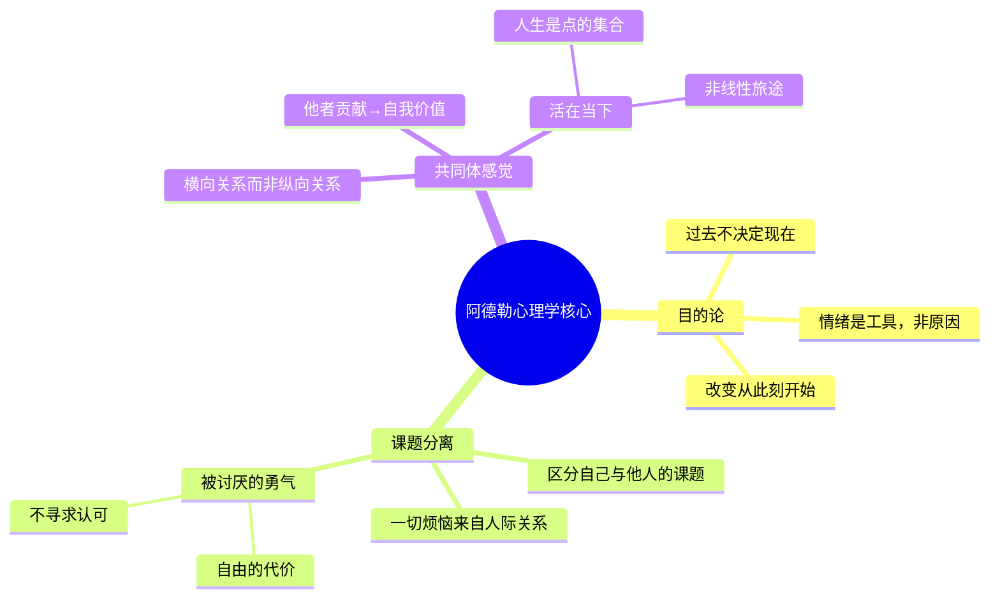

## 《被讨厌的勇气》读书笔记 
  
### 作者  
digoal  
  
### 日期  
2026-06-08 
  
### 标签  
读书笔记 , 被讨厌的勇气  
  
----  
  
## 背景 
  
---
书名: 《被讨厌的勇气》  
原书名: 嫌われる勇気：自己啓発の源流「アドラー」の教え  
作者: [日] 岸见一郎 / [日] 古贺史健  
出版社: 机械工业出版社  
出版年份: 2015（日文原版2013）  
笔记日期: 2026-06-08  
豆瓣评分: 8.6  
标签: [心理学, 阿德勒, 自我成长, 人际关系, 哲学]  
---
  
  

> **一句话**：过去不能决定你，此刻的选择才是你全部的人生。  
> **适合谁读**：习惯活在别人眼光里的人；总觉得不幸是命运安排的人；想在人际关系中找到自由的人。  
> **阅读难度**：⭐⭐☆☆☆（对话体，轻松）  
> **推荐指数**：⭐⭐⭐⭐☆  
  
---

## 一、时代坐标：这本书从哪里来？

2013年，这本书在日本出版，随即引爆了一场心理学的大众启蒙运动。它在日本亚马逊连续300天霸占销售榜首，成为2014年度销售冠军。中文版在亚洲华语圈同样引起强烈共鸣，豆瓣评分8.6，评论者超过20万人。

这本书为什么在那个时刻爆发？

2013年前后，日本早已从泡沫经济的崩溃中度过了漫长的"失落的二十年"。年轻一代面对严峻的就业压力、高度竞争的职场文化、强烈的社会评价体系——日语中有个词叫做「空気を読む」（读空气），指时刻感知他人期待、压抑自我的生存哲学。正是在这样的文化土壤里，阿德勒那句"你的不幸，是你自己选择的"具有了震撼人心的力量。

中国读者的共鸣同样深刻。内卷、焦虑、讨好型人格……这些词语精准描绘了许多人的内心处境。书中那位永远在抱怨、渴望被认可、却始终无法行动的"青年"，几乎就是读者自己的镜像。

更有趣的是这本书的作者组合与写作形式。岸见一郎是京都大学哲学系出身的学者，自1989年开始研究阿德勒长达三十余年，将阿德勒的主要著作从德文翻译成日文，是日本最权威的阿德勒研究者。古贺史健则是一位畅销书作家，本质上是专业的"科普翻译者"。两人的合作模式是：古贺史健多次前往岸见一郎在京都的家中，反复追问，记录，再整理成用苏格拉底式对话写成的这本书。

这本书背后有三层嵌套的对话：**阿德勒与世界的对话**（100年前）→**岸见一郎与阿德勒的对话**（30年研究）→**古贺史健与岸见一郎的对话**（数年访谈）。而读者和书的对话，是第四层。

```
时间轴：阿德勒思想的旅程

1870 ──── 阿德勒出生，维也纳
1902 ──── 加入弗洛伊德心理学沙龙
1911 ──── 与弗洛伊德决裂，创立"个体心理学"
1937 ──── 阿德勒于苏格兰讲学途中去世
   ↓         （思想沉寂数十年，被弗洛伊德和荣格光环压盖）
1989 ──── 岸见一郎在京都大学邂逅阿德勒著作，开始研究
2013 ──── 《被讨厌的勇气》日文版出版
2015 ──── 中文版引进出版
   ↓         （成为华语世界最畅销的心理学书籍之一）
2026 ──── 你正在读这篇笔记
```

---

## 二、核心命题：作者在说什么？

这本书的结构是五夜对话。一位自认不幸的愤世青年，听说有位哲人认为"世界单纯，人人可以幸福"，于是登门辩驳，五夜下来，他（还有读者）被一一说服，或者说，被挑战。

书的核心是三个环环相扣的命题。

### 命题一：目的论 vs. 原因论——过去不能决定你

弗洛伊德的理论建立在"原因论"之上：你今天的痛苦，是过去创伤的必然结果。阿德勒完全反转了这个逻辑。他说：我们不是"被过去决定"，而是"为了现在的目的，主动使用了过去"。

举一个书中的例子：一个人声称因为小时候被父亲打骂，所以长大后无法信任他人、闭门不出。弗洛伊德会说：童年创伤导致了今天的症状。阿德勒会说：这个人其实是**先有了"不想外出"的目的**，然后才挖掘出父亲打骂的记忆，用它作为"不出门的理由"。

这个颠覆性的论断听起来很残忍——难道创伤是假的？不，阿德勒不是说创伤不存在，而是说：**创伤是素材，但素材本身不能决定你；赋予它意义的，是你此刻的选择。**

一个关闭百叶窗的房间，无论外面阳光多好，里面都是黑暗的。但阿德勒告诉你：百叶窗不是锁死的，那个锁的人，是你自己。

### 命题二：课题分离——一切烦恼来自人际关系

阿德勒有个大胆的宣判：**人所有的烦恼，归根结底都是人际关系的烦恼。**

为什么？因为如果一个人独处宇宙，他就没有任何困扰——没有嫉妒、自卑、竞争、渴望被认可。烦恼只在两人以上的关系中产生。

解药是什么？**课题分离**——弄清楚每一件事"最终由谁承担后果"，谁承担，就是谁的课题。你的孩子不想学习，学习的后果由孩子承担，那就是孩子的课题，不是你的。你对别人好，对方是否喜欢你，那是对方的课题，不是你能控制的。

"不被别人讨厌"——这个念头之所以是烦恼，恰恰是因为我们把"别人对我的评价"当成了自己的课题，于是为了管控那个本就不属于自己的事情而精疲力竭。

课题分离不是冷漠，也不是放弃。它更像是在人际关系里划出一条健康的边界：**我对你好，那是我的课题；你怎么回应我，那是你的课题。**

### 命题三：共同体感觉——自由与归属不是对立的

这是阿德勒体系里最容易被忽略、也最容易被误解的部分。

前两个命题讲的是"我不需要别人的认可"，读者可能以为阿德勒在鼓励孤立主义、极端个人主义。但阿德勒笔锋一转：**真正的幸福不是孤独地存在，而是在共同体中感觉到"我对这里有贡献"，"这里有我的位置"。**

阿德勒把"共同体感觉"（Gemeinschaftsgefühl）看作心理健康的核心标志。一个人最深的不幸，不是遭遇痛苦，而是不喜欢自己。而喜欢自己的方式，不是孤芳自赏，而是通过"他者贡献"——感受到自己对他人、对世界有价值——来建立真实的自我价值感。

所以书中那个看起来激进的标题"被讨厌的勇气"，实际上是在说：我愿意为了成为真实的自己、为了对共同体真正有贡献，而承担被部分人讨厌的风险。这不是挑衅，是选择。

---

## 三、论证地图：书是怎么说服你的？



这本书的论证方式非常聪明——它没有直接讲理论，而是用"青年"的顽固不服气来推进。每次青年提出一个日常困境，哲人用阿德勒框架拆解，青年反驳，哲人再解释。这种设计让读者很容易代入：青年的反驳往往正是读者自己的疑问。

书中有两个特别有力的论证瞬间：

**论证一：愤怒是工具，不是原因。** 书中举了一个例子：一位母亲正在愤怒地训斥孩子，电话铃响了，她接起来，立刻换成温柔平和的声音，挂了电话，又继续愤怒地训斥。如果愤怒是情不自禁，她怎么能如此自如地切换？阿德勒说，愤怒是她为了让孩子顺从而"制造"出来的工具。这个细节极具穿透力，一击命中。

**论证二：你的生活方式是今天早上选择的。** 阿德勒不说"你可以改变"，他说：你的"生活方式"（Lebensstil）——你对世界的看法和行动模式——是你在今天早上主动选择要延续的，不是被动承受的。区别在哪里？一个是受害者，一个是主体。

---

## 四、前提假设与边界：什么情况下这不成立？

诚实地说，阿德勒的体系建立在几个并非人人都能接受的假设上。

**假设一：人具有充分的主体性。** 目的论成立的前提是：个体有足够的认知能力和自由意志来"选择"自己的反应。但对于经历了严重创伤（战争、重度虐待、神经发育差异）的人来说，"你是选择了痛苦"这句话可能造成二次伤害。阿德勒的理论更像是一种**赋权哲学**，适合已经具备一定心理韧性的人，而非危机中的人。书中的豆瓣评论也有人提到这一点：当这个理论被善意地用于对受害者说"你是选择了受伤"时，会变成一种道德指责。

**假设二：他者贡献可以带来真正的满足感。** 阿德勒认为"为共同体做贡献"是幸福的来源，但这在一个不公平的系统里（歧视、剥削、结构性不平等）可能异化为要求弱势群体"感恩贡献"。在集体主义文化中，"课题分离"固然是解放，但"共同体感觉"也可能被拿来绑架个体。

**假设三：改变只需要勇气。** 书中反复强调，改变不难，只要有勇气。这在逻辑上是鼓励人，但在实践上可能忽略了改变所需的具体支撑——经济条件、社会资源、人际网络。"就是不肯改变"这个判断本身，有时候是对结构性困境的过度简化。

这本书的适用边界大致是：**内心已经具备基本稳定感、在关系中感到束缚和窒息、渴望突破认可依赖的人**。而对于真正处于心理危机中的人，这本书最好配合专业支持一起使用。

---

## 五、思想谱系：这本书在哪个传统里？

阿德勒（1870-1937）是那个"被弗洛伊德遮住了光"的心理学家。他最初是弗洛伊德沙龙的成员，但两人1911年决裂，核心分歧在于：弗洛伊德认为人的行为根源是性本能等生物驱力（原因论），阿德勒认为人的行为指向的是目标，社会关系才是人格的土壤（目的论+社会嵌入）。

阿德勒的影响比多数人想象的要深远。他启发了：
- **维克多·弗兰克尔**（意义治疗）：同样强调人面对苦难时的选择自由
- **亚伯拉罕·马斯洛**（需求层次理论）：自我实现的概念与阿德勒的"超越自卑、追求卓越"呼应
- **阿尔伯特·艾利斯**（理性情绪行为疗法REBT）：认知重构的核心逻辑
- **存在主义哲学**（萨特、海德格尔）：强调此刻选择、拒绝决定论

```
思想影响脉络

弗洛伊德 ──分裂──→ 阿德勒（1911）
                        ↓
              弗兰克尔（意义治疗）
              马斯洛（人本主义）
              艾利斯（认知行为）
                        ↓
              岸见一郎（日本，1989-）
                        ↓
              《被讨厌的勇气》（2013）
                        ↓
              亚洲大众读者——2010年代的焦虑时代
```

值得一提的是，这本书的写法本身也是一个思想谱系的汇合：用苏格拉底式辩证对话（古希腊）来呈现阿德勒心理学（奥地利），由日本学者和作家完成，再被中国读者接纳。这种跨文化的流动本身，也印证了阿德勒所说的"共同体感觉"——人类对自由与归属的渴望，是普遍的。

---

## 六、我学到了什么？

读完这本书，我最深的感触不是任何一个具体理论，而是一种**视角的位移**。

第一个改变：**我开始区分"我的感受"和"我能控制什么"。** 当我觉得某人不喜欢我，过去我会陷入焦虑，反复推测对方的想法，试图调整自己。课题分离告诉我：对方的感受是对方的课题，我能掌管的只有我的行为和态度。这不是冷漠，是对双方边界的尊重。

第二个改变：**我开始质疑自己的"原因论叙事"。** 我们所有人都有一套关于自己的故事，解释"为什么我是现在这个样子"。阿德勒提醒我：这个故事里，有多少是真实的限制，有多少是"我为了维持现状而编织的理由"？不是所有的苦都值得珍视；有些苦是我们无意识选择留下来的。

第三个改变：**关于"活在当下"的理解变深了。** 阿德勒说，人生不是一条有起点和终点的线，而是由无数个"此刻"构成的点的集合。登山的意义不在于到达山顶，而在于每一步本身。这不是放弃目标，而是不让"没到终点"成为否定当下的借口。这让我不再等待"到了那个阶段再开始真正生活"。

---

## 七、举一反三：这个框架还能用在哪？

阿德勒的核心方法论可以迁移到很多场景。

**职场中的课题分离：** 你拼命努力想得到上司的肯定——这其实是把"上司如何评价我"当成了自己的课题。转换视角：我能掌控的是我做出好的工作；上司是否认可，那是上司的课题。不是不在乎结果，而是不把"别人的评价"作为行动的唯一燃料。

**亲子关系中的非纵向关系：** 书中提到，表扬和批评都是纵向关系（上下级关系）的产物，会损害平等。替代品是"鼓励"——不评判结果，而是认可对方付出的过程和存在本身。这对任何需要长期陪伴的关系（不只是亲子）都有参考意义。

**面对批评时的目的论思维：** 当有人批评你，你可以问：这个人说这话，是为了什么目的？是为了帮助我，还是为了在这段关系中夺得控制权？目的论不只用来分析自己，也可以帮助理解他人的行为动机。

---

## 八、批判与反思

这本书有几个值得警惕的地方，我认为不说出来是不诚实的。

**第一，"否定心理创伤"的表述过于激进。** 阿德勒说"心理创伤并不存在"，其实他的本意是：创伤不能"决定"你，但这个表述在大众传播中极易造成误解，甚至被误用来质疑受害者的痛苦。现代心理学（包括神经科学）的研究证明，严重创伤会在生理层面改变大脑结构，并不只是"目的的选择"。阿德勒的目的论是一种赋权工具，但不应成为否认创伤的武器。

**第二，对结构性困境的忽视。** 书中的"改变只需要勇气"在个体层面非常有感召力，但放在系统层面就显得过于简化。一个处于贫困、歧视或系统性压迫中的人，不只需要"勇气"，他们还需要外部条件的改变。阿德勒的心理学太专注于个体内部，对社会结构几乎没有分析。

**第三，"共同体感觉"在东亚文化背景下可能被扭曲。** 在本就强调集体主义的文化土壤里，"对共同体做贡献是幸福来源"这个说法很可能被进一步强化"牺牲个体、服务集体"的规范，而不是像阿德勒本意那样解放个体。这是东亚读者需要特别留意的语境差异。

即便如此，这本书仍然值得一读。它不是一本工具书，更像是一次思维手术——帮你把某些长期盘踞的"理所当然"切开，让你重新看一眼它的根。

---

## 九、金句与记忆点

1. **"不是世界复杂，是你把世界弄复杂了。"**
   ——世界本身是中性的，我们赋予它意义，也可以重新赋予。

2. **"问题不在于能力，而在于勇气。"**
   ——行动力的障碍往往不是技能不足，而是对失败、对被讨厌的恐惧。

3. **"自由就是被别人讨厌。"**
   ——真正的自由，必然要付出让某些人不满意的代价。接受这个代价，才是真自由。

4. **"人生谎言"**
   ——那些我们用来给自己的不改变找的理由。"因为……所以我没办法……"这句话的结构本身就是一个线索，值得仔细检查。

5. **"他者贡献不是自我牺牲，而是为了确认自己的价值。"**
   ——帮助别人的最终受益者，其实是自己的自我价值感。这是阿德勒对"善"最务实的解释。

6. **"过去的经历不决定什么，重要的是你赋予它什么意义。"**
   ——同一段童年，可以成为人生的负担，也可以成为理解他人的财富。

7. **"人生是一连串的刹那，此时此刻闪耀就足够了。"**
   ——不要等到"到达山顶"才允许自己幸福。

8. **"在意你长相的，只有你自己。"**
   ——大多数时候，旁人并没有你想象中那么在意你的样子。这句话是一剂解毒剂，对抗社交焦虑。

---

## 十、延伸阅读

1. **《被讨厌的勇气 二部曲》（岸见一郎 / 古贺史健）** — 续集，青年重返哲人处，聚焦于"幸福"本身。如果读完第一本意犹未尽，续集值得一读。

2. **《活出生命的意义》（维克多·弗兰克尔）** — 阿德勒的精神后继者，从纳粹集中营的极端情境中提炼出"意义治疗"。两书合读，对"人在苦难中的选择自由"会有更立体的理解。

3. **《自卑与超越》（阿尔弗雷德·阿德勒）** — 阿德勒本人的著作，读过《被讨厌的勇气》后，回头看原著会发现很多被通俗化省略的细节。

4. **《为何家会伤人》（武志红）** — 从中国原生家庭的视角，结合心理学分析人际模式的形成。与阿德勒的"目的论"形成有趣的对话：同样讨论原生家庭，但武志红更重视创伤的真实性。

5. **《正义之心》（乔纳森·海特）** — 阿德勒关注的是个体心理，海特研究的是群体道德本能。两者合读，可以理解：为什么即使我们学会了课题分离，人际冲突依然如此顽固？

---

*笔记写于 2026年06月08日 | 基于公开书评、学术资料与深度思考整理*
*阿德勒本人说：理解个体心理学，需要你已活过岁月的一半。所以这篇笔记，只是一个开始。*
  
#### [PostgreSQL 解决方案集合](../201706/20170601_02.md "40cff096e9ed7122c512b35d8561d9c8")
  
  
#### [德哥 / digoal's Github - 公益是一辈子的事.](https://github.com/digoal/blog/blob/master/README.md "22709685feb7cab07d30f30387f0a9ae")
  
  
#### [About 德哥](https://github.com/digoal/blog/blob/master/me/readme.md "a37735981e7704886ffd590565582dd0")
  
  

  
