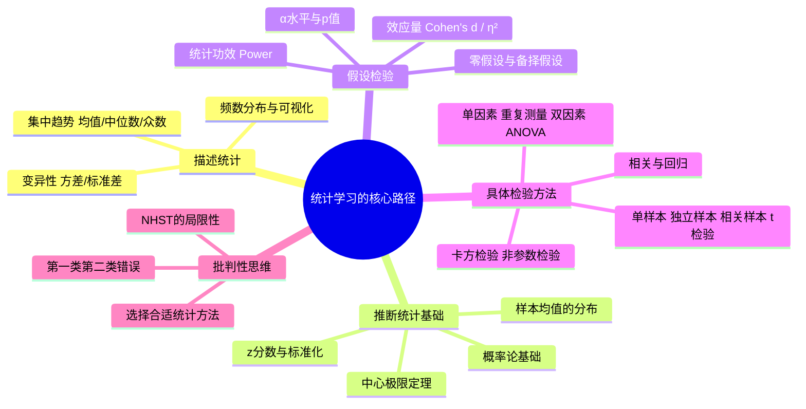

## 《行为科学统计》读书笔记 
  
### 作者  
digoal  
  
### 日期  
2026-06-08 
  
### 标签  
读书笔记 , 行为科学统计  
  
----  
  
## 背景 
  
---
书名: 《行为科学统计（原书第9版）》  
作者: [美] Frederick J. Gravetter / [美] Larry B. Wallnau  
原作名: Statistics for the Behavioral Sciences  
译者: 方平 / 姜媛  
出版社: 机械工业出版社  
出版年: 2023-1  
笔记日期: 2025-06-08  
豆瓣评分: 9.5（历史版次）  
ISBN: 9787111716334  
标签: [统计学, 心理学, 行为科学, 研究方法, 入门教材]  
---

  
  
> **一句话**：一本把统计学从"恐惧"变成"工具"的教材——它教的不只是公式，而是一种用数据思考世界的方式。  
> **适合谁读**：心理学、社会学、教育学等社会科学专业学生；对数据分析感兴趣但数学基础一般的研究者；任何想搞懂"显著性"到底是什么意思的人。  
> **阅读难度**：⭐⭐☆☆☆（高中代数足够）  
> **推荐指数**：⭐⭐⭐⭐⭐  
  
---

## 一、时代坐标：这本书从哪里来？

这本书诞生于一个特殊的历史节点。

1985年，格雷维特和瓦尔诺两位心理学教授在纽约州立大学布洛克波特学院任教时，写下了这本书的第一版。那个年代，行为科学的量化研究正处于爆发式增长阶段——心理学、社会学、教育学等领域争相引入统计方法，试图用数字来验证那些关于人类行为的理论。

然而，一个令人尴尬的矛盾随之出现：**学生们知道统计"重要"，却几乎无一例外地害怕它**。

传统统计教材往往从数学推导出发，厚重的公式像一道高墙，把文科背景的学生拒于门外。格雷维特本科就读于麻省理工学院数学专业，博士却是在杜克大学攻读心理学——这个双重身份让他深刻理解了两种思维方式的鸿沟。他和瓦尔诺决定做一件事：**把统计学翻译成行为科学学生能听懂的语言**。

四十年后，这本书已出版至第10版，被全球心理学、社会学、经济学领域广泛采用，是真正意义上的经典入门教材。豆瓣历史版次的近千名读者打出了9.5的高分，留下了"相见恨晚，泪流满面，原来统计学没有那么难"这样的读后感——读者的泪水，也许就是对这本书最诚实的评价。

2023年，机械工业出版社引进第9版中文版，由首都师范大学统计学教授方平领衔翻译。这个时间点颇为微妙——彼时心理学界正经历一场"可重复性危机"的冲击，统计方法的反思前所未有地深入，而这本书恰好在这个节点重新出现在中国读者面前。

```
时间轴：

[1985] → 第1版出版，专为行为科学学生设计
   ↓
[1996-2012] → 历次修订，逐步纳入效应量、统计功效
   ↓
[2012] → 第9版出版（英文原版）
   ↓
[2013-2015] → 心理学"可重复性危机"爆发
   ↓
[2023] → 中文第9版出版，重要性更加凸显
```

---

## 二、核心命题：作者在说什么？

这本书的核心命题不是"如何计算统计量"，而是**"如何用统计量思考"**。全书贯穿三个根本性的主张：

### 命题一：统计是科学思维的骨架，不是数学的附庸

书一开篇就明确提出：统计方法的存在，是为了帮助研究者在不确定性中做出有依据的判断。作者区分了两类统计——**描述统计**（告诉你手上的数据长什么样）和**推断统计**（告诉你能否从样本推论到总体）。

这个区分看似简单，却是很多人混淆的根源。描述统计像一张快照，推断统计像一个侦探的推理过程。两者的规则完全不同，不能混用。

书中用一个贯穿全书的例子展示了这种思维：一位研究者想知道"看暴力电视是否会增加儿童的攻击行为"。他不可能研究所有儿童，只能抽取50人。推断统计就是在这50人的数据上，做出对全体儿童的合理猜测——同时诚实地承认这种猜测的不确定性。

### 命题二：假设检验是工具，而非真理的仲裁者

书中花了大量篇幅介绍假设检验（第8-14章），这是整本书的重心所在。但作者的态度从来不是"p<0.05就是发现了真理"。

他们反复强调：**零假设显著性检验（NHST）回答的是一个很窄的问题**——"假设这个效应根本不存在，得到当前数据或更极端数据的概率是多少？"。这不等于"这个效应存在的概率"，也不等于"这个效应重要"。

正是基于这种清醒认识，书中专门设置了效应量（Effect Size）的章节。科恩的d、η²等指标被详细介绍——因为即使p值极小，效应可能微乎其微；而即使p值不显著，效应可能也不小（只是样本量不够大）。**统计显著≠实践意义**，这个区分在中国统计教学中长期被忽视。

### 命题三：渐进式学习是理解统计的唯一路径

全书的编排结构体现了一种刻意设计的逻辑：

```
描述统计（你有什么数据）
    ↓
z分数与正态分布（数据如何标准化）
    ↓
概率（随机性的基础）
    ↓
样本均值的分布（中心极限定理）
    ↓
假设检验逻辑（从概率到决策）
    ↓
具体检验方法（t检验、ANOVA、相关等）
```

每一步都是下一步的地基。作者绝不跳过中间环节，这也是很多学生说"第一次真正搞懂了统计"的原因——他们之前用的教材跳过了太多"显而易见"的步骤，但对初学者来说那些步骤一点都不显而易见。

---

## 三、论证地图：作者怎么说服你的？



这本书的说服方式高度具体。每个概念的引入都遵循以下模式：

**①先讲"为什么需要这个"** → ②给一个具体例子 → ③一步步展示计算过程 → ④解释结果的含义 → ⑤指出常见错误

比如讲"为什么需要标准差"，作者不是直接给公式，而是先呈现两组数据：均值相同，但一组分布集中，另一组分布分散。然后问：仅用均值，能区分这两组吗？不能。所以我们需要一个描述"数据散布程度"的指标，这就引出了标准差的必要性。

这种从"问题"到"工具"的路径，是本书最大的教学设计成就。

**关键数据与案例质量评价：**
书中大量使用心理学、教育学领域的真实研究场景——认知负荷对学习的影响、药物对行为的作用、教学方法的比较等。这些例子贴近读者的专业背景，比"工厂产品合格率"之类的通用例子更有代入感。

---

## 四、前提假设与边界：什么情况下这不成立？

### 假设一：正态分布是常态

书中绝大多数参数检验方法（t检验、ANOVA）依赖正态分布假设。作者对此有所说明，但在现实研究中，社会科学数据常常存在偏态分布、异常值，或属于非连续计数数据。

**今天还成立吗？** 部分成立。大样本时中心极限定理保障了稳健性，但小样本时这个假设可能带来严重问题。Bootstrap方法、贝叶斯方法等非参数思路在当代研究中越来越受重视，这是本书覆盖不足的领域。

### 假设二：p<0.05是合理的决策阈值

这是整本书沿用的标准，也是学界几十年的惯例。然而，2016年美国统计学会（ASA）发表历史性声明，指出p值不应是唯一决策标准；2019年，《自然》杂志征集800余位科学家联署，呼吁废除"统计显著性"这一二元判断。

**今天还成立吗？** 这一假设正在被重新审视。实际上本书已经迈出了半步——引入效应量就是对单纯依赖p值的一种修正。但整个框架仍以NHST为核心，这与当代统计改革的方向存在一定张力。

### 假设三：频率派统计是学习统计的起点

本书完全站在频率派（Frequentist）框架内，贝叶斯统计几乎没有涉及。然而贝叶斯方法在心理学、认知科学、机器学习领域正在迅速普及，且在概念上与"我们对某个假设的信念应该如何更新"这一直觉更为吻合。

**边界在哪里？** 这本书非常适合作为频率派推断统计的起点，但不应是终点。读完此书后，接触贝叶斯推断是有必要的补充。

---

## 五、思想谱系：这本书在哪个传统里？

这本书站在一条清晰的学术传统上：**尼曼-皮尔逊假设检验框架**，以及费舍尔的方差分析（ANOVA）体系。

```
费舍尔（Fisher）
"p值"概念的奠基者
农业实验中的方差分析
         ↓
尼曼-皮尔逊（Neyman & Pearson）
零假设/备择假设框架
α水平、统计功效的系统化
         ↓
科恩（Jacob Cohen）
效应量概念的推广者
《统计功效分析》1969
         ↓
格雷维特 & 瓦尔诺
将上述体系整合进行为科学入门教学
首版1985，延续至今
```

科恩对这本书的影响尤为深远。科恩在1960-70年代反复呼吁行为科学界关注统计功效和效应量，而不仅仅是显著性检验。格雷维特将科恩的思想系统纳入教材，使得这本书在同类教材中显得格外有远见——它比多数教材更早意识到"显著性"的局限。

对后来者的影响：这本书塑造了过去三四十年间大量心理学研究者的统计思维框架。它的局限也因此被传播——过分依赖p值、对贝叶斯方法陌生、对多重比较问题重视不足，这些都在后来的可重复性危机中暴露出来。

---

## 六、我学到了什么？

读这本书最大的冲击，不是某个具体的统计方法，而是一种思维方式的转变：**科学结论本质上是概率性的，不是确定性的**。

以前我理解的"实验结果显著"大概等于"这件事是真的"。读完这本书之后，我明白了假设检验实际上在说的是：假如零假设（两组没有差异）是真的，那么得到我现在这个数据的概率只有2%。因为这个概率很低，我选择拒绝零假设。但这不等于"差异一定存在"，更不等于"这个差异很重要"。

这个认知转变让我对日常生活中的很多"研究证明"报道产生了健康的怀疑。新闻说"研究发现某食物能降低患癌风险"——这个结论背后经历了什么统计逻辑？样本量多大？效应量有多少？在多大程度上可以推广？这些问题以前从来不会问。

另外两个重要收获：

**其一，效应量比p值更诚实。** 一个研究纳入10万人，哪怕极微小的差异也能达到统计显著。效应量（比如Cohen's d）告诉你的才是那个差异在"现实意义"上有多大。这个区分改变了我读论文的方式。

**其二，统计决策始终涉及两类错误的权衡。** 第一类错误（虚报，False Positive）和第二类错误（漏报，False Negative）永远处于拉锯状态——降低虚报率，漏报率就升高，反之亦然。这个逻辑同样适用于医学检测、司法判断、机器学习分类……理解了这个权衡，看很多决策问题的眼光都不同了。

---

## 七、举一反三：这个框架还能用在哪？

### 场景一：读媒体科学报道

每次看到"某研究发现X与Y显著相关"，可以立刻问：
- 效应量是多少？相关系数r=0.08虽然显著，但解释的方差不到1%。
- 样本是什么人？结论能推广到我身上吗？
- 这是观察性研究还是实验研究？相关≠因果。

### 场景二：设计自己的研究或项目

在决定样本量之前，先做统计功效分析（Power Analysis）。你希望检测到的最小效应量是多少？你能接受多大的漏报概率？这两个问题决定了你需要多少数据——不是越多越好，也不是越少越省事，而是"刚好足够"。

### 场景三：理解A/B测试

互联网产品的A/B测试，本质上就是两样本t检验的商业应用。点击率有差异吗？这个差异是真实的还是随机波动？需要运行多久才能得出可靠结论？这些问题的答案都在这本书里。

---

## 八、批判与反思

### 可重复性危机的幽灵

这本书出版的2012年，距离心理学可重复性危机的全面爆发只有三年。2015年，《科学》杂志发表大规模重复研究，100项心理学实验中只有约39%能被成功复制。这场危机的根源之一，恰恰是NHST框架被滥用——p值被操纵（p-hacking），发表偏倚（只发表显著结果），样本量普遍偏小。

这本书教授了诚实的统计推断，但它终究无法阻止统计工具被滥用。如果说这本书有什么没能完成的使命，那就是：**没有足够充分地讨论统计方法在研究文化中可能被如何误用**。这需要读者在书本之外再去补课。

### 贝叶斯时代的来临

频率派统计有一个根本性的概念困境：p值描述的是"假如H₀为真，数据出现的概率"，而研究者真正想问的是"给定这些数据，H₀为真的概率"。这两个问题看起来相似，其实方向完全相反。

贝叶斯统计直接回答后一个问题，并且能优雅地整合先验知识。这本书对贝叶斯几乎只字未提，是一个时代局限，也是读者在深入统计学习时必须补齐的空白。

### 第9版相对于更新领域的滞后

本书对效应量、统计功效的处理已属领先，但对开放科学（预注册、数据共享）、元分析、贝叶斯因子等21世纪统计实践的核心议题涉及极少。这不是缺点，而是定位的选择——它是入门书，不是当代统计实践的全景图。

---

## 九、金句与记忆点

1. **"统计学的目标不只是教授方法，更是传递科学所需的客观性与逻辑思维原则。"**
   → 记住：统计是科学思维的工具，不是证明自己对的武器。

2. **"描述统计是快照，推断统计是推理。"**（我自己的归纳）
   → 永远区分这两件事，绝不用描述性语言解读推断结论。

3. **"统计显著不等于实践重要，效应量才是差异大小的诚实度量。"**
   → p<0.05只是门槛，不是终点。

4. **"中心极限定理：无论总体分布如何，样本均值的分布随样本量增大趋向正态。"**
   → 这是整个推断统计的地基，没有它，就没有t检验和ANOVA。

5. **"第一类错误：拒绝了真实的零假设（虚报）；第二类错误：接受了错误的零假设（漏报）。"**
   → 这两类错误如影随形，科学和工程中的大量决策本质上都是在这两类错误之间找平衡。

6. **"相关不等于因果。"**（贯穿全书的警示）
   → 统计方法可以量化关系，但因果推断需要实验设计来保证。

7. **"选择统计方法之前，先问：我有几个变量？它们是什么测量尺度？我想回答什么问题？"**
   → 书末第19章"选择恰当的统计方法"是全书最实用的总结。

---

## 十、延伸阅读

1. **《行为科学统计精要》（Gravetter & Wallnau）**
   同一套体系的简明版，适合时间有限、只需掌握核心方法的读者，也适合复习用。

2. **《深入浅出统计学》（Dawn Griffiths）**
   用漫画+叙事风格的统计入门书，视觉化程度更高，适合作为本书的前置轻松读物。

3. **《The Art of Statistics》（David Spiegelhalter）**
   英国统计学家Spiegelhalter写的现代统计思维入门，更贴近当代统计实践，有大量数据时代的真实案例，适合读完本书后进阶。

4. **《统计学习方法》（李航）**
   从应用统计到机器学习的桥梁，适合有意进入数据科学领域的读者。本书掌握后，再看李航会少很多障碍。

5. **《思考，快与慢》（丹尼尔·卡尼曼）**
   不是统计书，但是统计思维的绝佳应用场景——展示了人类直觉与概率逻辑的冲突，读完本书后再读卡尼曼会有更深的共鸣。

---

*笔记写于 2025-06-08 | 基于公开资料与深度思考整理*
*参考来源：AbeBooks、微信读书、百度百科、豆瓣读书（历史版次读者评价）、科学网可重复性危机系列文章*
  
#### [PostgreSQL 解决方案集合](../201706/20170601_02.md "40cff096e9ed7122c512b35d8561d9c8")
  
  
#### [德哥 / digoal's Github - 公益是一辈子的事.](https://github.com/digoal/blog/blob/master/README.md "22709685feb7cab07d30f30387f0a9ae")
  
  
#### [About 德哥](https://github.com/digoal/blog/blob/master/me/readme.md "a37735981e7704886ffd590565582dd0")
  
  

  
