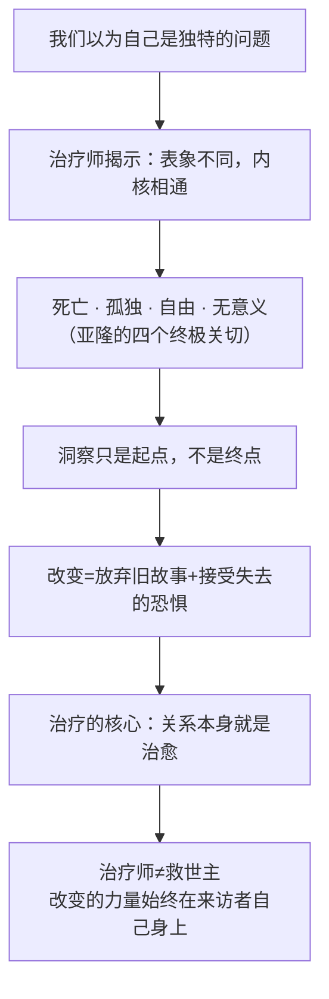

## 《也许你该找个人聊聊》读书笔记 
  
### 作者  
digoal  
  
### 日期  
2026-06-08 
  
### 标签  
读书笔记 , 也许你该找个人聊聊  
  
----  
  
## 背景 
  

---
书名: 《也许你该找个人聊聊》  
作者: [美] 洛莉·戈特利布（Lori Gottlieb）  
译者: 张含笑  
出版年份: 2021（中文版）/ 2019（英文原版）  
出版社: 上海文化出版社 / 果麦文化  
笔记日期: 2025-06-08  
豆瓣链接: https://book.douban.com/subject/35481512/  
原作名: Maybe You Should Talk to Someone: A Therapist, Her Therapist, and Our Lives Revealed  
标签: [心理治疗, 回忆录, 自我成长, 心理咨询, 人性]  
---
  
  

> **一句话**：一个治疗师走进了另一个治疗师的诊室——然后我们所有人都在她的故事里看见了自己。  
> **适合谁读**：对心理咨询好奇的人、正在经历人生困境的人、想理解"人为什么这么难改变"的人  
> **阅读难度**：⭐⭐☆☆☆（叙事流畅，读起来像小说）  
> **推荐指数**：⭐⭐⭐⭐⭐  
  
---

## 一、时代坐标：这本书从哪里来？

2019年，这本书出版于一个奇特的历史节点——心理健康话题正以前所未有的速度进入大众视野，焦虑、抑郁这些词从医学术语变成了朋友圈的日常；与此同时，人们却比以往任何时候都更难找到人"真正地聊一聊"。社交媒体让我们永远在线，但孤独感不减反增。

洛莉·戈特利布的人生轨迹本身就很戏剧性。她在斯坦福念完本科，进了好莱坞做编剧，参与制作过《老友记》《急诊室的故事》等知名剧集，然后在人到中年时转行，去佩珀代因大学读了临床心理学硕士，成了一名执业心理治疗师。这个跨界经历给了这本书独特的质地：她写故事的方式是编剧的，但她看人性的方式是治疗师的。

写这本书的直接导火索，是一次突如其来的失恋。四十多岁，单身妈妈，以为找到了对的人——然后男友忽然以"无法接受她有孩子"为由提出分手，尽管他早就知道这件事。她崩溃了。一个职业是帮助别人整理情绪的人，此刻也不得不给自己找一个治疗师。

书的副标题就已经说明了一切：**A Therapist, Her Therapist, and Our Lives Revealed**——一个治疗师，她的治疗师，以及我们被揭示的生活。"我们"，才是这本书真正的主角。

---

## 二、核心命题：作者在说什么？

书中交织着五条叙事线：治疗师洛莉自己的故事，以及她接诊的四位来访者：

```
约翰   ——  好莱坞制片人，傲慢自大，认为世界都是蠢货
朱莉   ——  三十多岁，刚新婚就确诊绝症，时日不多
丽塔   ——  六十九岁，三度离婚，扬言七十岁生日当天自杀
夏洛特 ——  二十多岁，原生家庭创伤，酗酒，爱情总找错人
洛莉   ——  治疗师本人，中年失恋，几近崩溃
```

表面上看，这五个人差异极大。但戈特利布要说的恰恰相反——

### 观点一：我们以为各自不同，其实面对的都是同一些事

她借用了存在主义心理学泰斗欧文·亚隆（Irvin Yalom）的框架：人类共同面对四个终极关切——**死亡、孤独、自由、无意义**。约翰的傲慢，是对孤独的防御；丽塔的求死，是对无意义的抗议；朱莉面对死亡，反而活得最清醒。夏洛特在爱情里一再复制创伤，是因为没有自由——被童年的故事困住了。

这不是心灵鸡汤式的"我们都一样"，而是一个临床观察：外壳越是不同，内核越是相通。

### 观点二：洞察只是"治疗的安慰奖"，真正困难的是改变

书里有一个令人印象深刻的说法：洞察（insight）是治疗的"安慰奖"（booby prize）。很多人在治疗中有了深刻的自我认识——"啊，我的问题原来是原生家庭造成的"——但就此停下来，把认识当成终点。

戈特利布说的是，知道"为什么"不等于能够"不同了"。**改变需要行动，而行动的最大阻力是失去的恐惧**——即便你要放弃的是一个让你痛苦的东西，失去它依然令人害怕，因为那个痛苦的模式也是你熟悉的自我的一部分。

她引用了心理学家詹姆斯·普罗查斯卡的"变化阶段模型"：前思考→思考→准备→行动→维持。大多数人卡在前两个阶段的循环里，以为"想清楚了"就完事，却一次次在第三步前退缩。

### 观点三：治疗师也是普通人，而这正是治疗得以发生的原因

书里最颠覆我预期的，是治疗师本人有多普通、有多脆弱。洛莉第一次走进温德尔的诊室，满脑子想的是如何让他把前男友诊断为"反社会人格"，证明错的不是自己。她用职业本能分析温德尔说的每句话，想找出他的治疗意图……结果发现，她其实和所有来访者一样，只是想要一个人告诉她：你没问题，他才是混蛋。

这个自我揭露的诚实，让整本书有了真正的重量。心理治疗能够发生，不是因为治疗师是全知全能的神明，而是因为他们也是人——他们也受过伤，也有盲点，也会犯错。正是这种共同的脆弱性，让诊室里的信任得以建立。

---

## 三、论证地图：作者怎么说服你的？



戈特利布用的是**叙事说服**，而非数据驱动。书里几乎没有引用大量实验数据或论文，而是让五条故事线相互映照，让读者自己在阅读中产生"天啊，这说的就是我"的体验。

最具说服力的一个技巧：她刻意选择了五个在表面上毫无共同之处的人。一个傲慢的中年男人，一个即将死去的年轻女性，一个想死的老太太，一个酗酒的女孩，一个正在崩溃的治疗师——然后让读者看见，他们最终面对的都是同一层恐惧。这个结构本身就是她最有力的论点。

有一个细节颇具代表性：约翰一开始来看诊，嘴上说的是失眠，实际上他失去了儿子（因为自己的疏忽，在一次车祸中）。他用傲慢和攻击性把所有人推开，因为如果让别人靠近，他就要面对自己无法承受的愧疚。这个人物的弧线，是全书最令人动容的一条线。

---

## 四、前提假设与边界：什么情况下这不成立？

### 假设一：语言能够触达内心

整本书建立在"通过谈话来治愈"这个前提上。但对于某些人——尤其是神经生物学因素主导的心理问题（严重的双相障碍、精神分裂等）——单纯的谈话治疗效力有限，甚至需要以药物为基础。书里对此几乎没有涉及。

### 假设二：每个人都有改变的内在资源

书里的五位人物，最终都实现了某种程度的改变或和解。但现实中有些人的困境，不是靠自我认知能解决的——贫穷、歧视、系统性的社会不公，不是"认识到自己的故事"就能解除的枷锁。戈特利布是洛杉矶的私人执业治疗师，她的来访者大多能够负担得起一周一次的治疗费用，这本身就是一种筛选。

### 假设三：治疗关系本身是安全的

书里展现的是一段理想的治疗关系——温德尔是一个真正有能力、有边界感的治疗师。但现实中，治疗师水平参差不齐，不当的治疗关系本身也可能带来伤害。这一面，书里几乎未曾触及。

---

## 五、思想谱系：这本书在哪个传统里？

戈特利布明确把自己放在**存在主义心理治疗**的传统下，最重要的影响来源是**欧文·亚隆**（Irvin Yalom）——斯坦福大学精神病学终身荣誉教授，亚隆本人也为这本书写了热情的推荐语，称这是他读过的心理治疗书里最大胆、最诚实、故事最好的之一。

```
弗洛伊德 ──────→ 潜意识与压抑，洞察的重要性
    ↓
存在主义哲学（萨特、海德格尔）──→ 死亡、自由、孤独、无意义
    ↓
欧文·亚隆 ──────→ 存在主义心理治疗：终极关切 + 治疗关系本身是治愈
    ↓
洛莉·戈特利布 ─→ 用回忆录形式打破"治疗师"神话，让普通读者可以进入
```

从写作传统看，这本书的近亲是亚隆的《爱情刽子手》（Love's Executioner）和《治疗的礼物》（The Gift of Therapy）——都是用患者案例讲述治疗原理，但亚隆更理论，戈特利布更亲切。书里她也提到菲利帕·佩里（Philippa Perry）的《沙发上的秘密》作为对照。

---

## 六、我学到了什么？

读完这本书，改变我最深的不是某个具体的理论，而是对几件事的重新理解：

**其一，关于"帮助别人"这件事的边界。** 书里反复出现一个提醒：治疗师不是来访者生活的决策者。他不能替你做选择，不能帮你逃避痛苦，他能做的是陪你待在那个痛苦里，直到你有力气动身。我们普通人对朋友、家人的"帮助"，很多时候其实是剥夺了对方的主体性——我替你做决定，因为我急着让你好起来，那样我自己才好受。这不是帮助，是投射。

**其二，关于"嫉妒"的诚实价值。** 书里说了一句很有意思的话：追随你的嫉妒，它会告诉你你真正想要什么。嫉妒不是一种低级情绪，而是一根指南针——你嫉妒谁的生活，就说明你渴望什么。承认这一点，需要相当程度的诚实。

**其三，关于"故事"的双刃性。** 我们每个人都在给自己的生活讲一个故事。这个故事帮助我们理解自己，但有时候也会把我们困住。约翰把自己塑造成"一个被所有人误解的天才"，丽塔把自己塑造成"一个被生活辜负的受害者"——这些故事有它们的功能，但它们也成为了改变的阻力。治疗的一个核心任务，就是帮人"解构故事"，重新看见那些被删掉的细节。

---

## 七、举一反三：这个框架还能用在哪？

**"变化阶段"的框架**，用在任何你试图改变自己或影响别人的场景都适用。当你的朋友反复抱怨同一个问题却不采取行动——大概率他还在"思考阶段"，还没准备好。这时候催促他做决定，只会引发阻抗。陪伴和见证，比建议有效。

**"洞察≠改变"这个判断**，放到职场也成立。很多人在复盘会议上得出深刻结论，但两个月后故态复萌，不是因为没有认知，而是因为没有把认知转化成新的行为习惯——而新习惯的建立，需要经历一段"旧模式失效但新模式尚未稳固"的焦虑期。

**"我们以为我们是独特的"这个陷阱**，是很多社交孤立的来源。我们以为自己的痛苦特别羞耻、特别难以启齿、别人不会懂，所以把自己关起来。而书里反复证明的是：把那个"特别羞耻的事"说出来，你往往会发现另一个人也有类似的挣扎。连接，从说出开始。

---

## 八、批判与反思

我喜欢这本书，但也保留一些距离：

**第一，美国中产的视角盲区。** 书里的治疗，每周一次、每次五十分钟，费用不菲。这是一种特定阶层才能获得的资源。书里没有认真探讨：当心理痛苦的根源是贫困、歧视或结构性不公时，"找个人聊聊"的逻辑是否依然成立？

**第二，叙事太过顺滑。** 五条故事线都走向了某种形式的和解或成长——约翰重建了家庭，朱莉坦然面对死亡，丽塔找到了意义，夏洛特开始正视原生家庭。现实的治疗当然有中途放弃、没有结果、甚至恶化的情况。过于整齐的叙事，让人有一点"这是经过筛选的成功案例"的感觉。

**第三，"故事"理论的过度使用。** 把人类的问题都归结为"你给自己讲了一个错误的故事"，是一种有吸引力但也有简化倾向的框架。并非所有的心理困境都能用叙事重构来化解。

不过，以上批评都不妨碍我认为这是一本值得读的书。它在大众和专业之间找到了一个稀有的平衡点，让普通人可以走进心理治疗这个房间，而不感到被评判、被分析或被俯视。

---

## 九、金句与记忆点

> 生活的本质是变化，而人类的本性是抗拒变化。

人类的矛盾性在这一句里说尽了。我们渴望更好，但更好意味着失去旧的自己——哪怕那个旧的自己让我们痛苦，它至少是熟悉的。

---

> 你以为自己被困住了，但其实你是有可能做出改变的。

这句话看起来简单，但说给一个真的困在某个地方的人听，分量很重。不是"你可以走出来"的励志，而是"你以为没路，但路是有的"——重点在于让人看见那个可能性。

---

> 洞察只是治疗的安慰奖。

知道"为什么"是第一步，但离"不同了"还差很远。这句话治好了我对"我已经想清楚了所以应该不一样了"这个幻觉。

---

> 我发现只要人们一感到孤单就会拿起一个设备来逃避这种感受。人们长期处于受干扰的状态下，似乎丧失了和别人相处的能力，也丧失了和自己相处的能力。

这段写于2019年，到今天依然有点刺痛。

---

> 治疗师的作用是引导来访者走向改变，而非替他们做决定。控制权始终在来访者自己手里。

"帮助"和"控制"的边界，大多数人一辈子都在混淆。

---

## 十、延伸阅读

**1. 《爱情刽子手》—— 欧文·亚隆**
直接影响戈特利布的作品。同样是治疗案例叙事，但更哲学，把存在主义理论和临床实践融合得天衣无缝。想了解戈特利布思想来源，必读。

**2. 《沙发上的秘密》—— 菲利帕·佩里**
英国心理治疗师的同类型作品，图文并茂（漫画形式），对治疗过程的呈现更直观，适合对心理咨询完全陌生的读者。

**3. 《活出意义来》—— 维克多·弗兰克尔**
存在主义心理学的基石之一。弗兰克尔在集中营的经历让他发展出"意义疗法"，与亚隆的理论并行。书薄，分量极重。

**4. 《蛤蟆先生去看心理医生》—— 罗伯特·戴伯德**
如果觉得《也许你该找个人聊聊》太长，可以先读这本——用《柳林风声》的童话人物讲完了几乎所有核心概念，而且好读得多。

**5. 《被聆听的渴望》—— 迈克尔·尼科尔斯**
专门讲"倾听"这件事。戈特利布说的"找人聊聊"，前提是有人真的在听。这本书告诉你什么是真正的倾听，以及我们大多数人有多不擅长这件事。

---

*笔记写于 2025-06-08 | 基于公开资料与深度思考整理*
*本文适合分享给：对心理咨询好奇但不知道从哪里开始的朋友*
  
#### [PostgreSQL 解决方案集合](../201706/20170601_02.md "40cff096e9ed7122c512b35d8561d9c8")
  
  
#### [德哥 / digoal's Github - 公益是一辈子的事.](https://github.com/digoal/blog/blob/master/README.md "22709685feb7cab07d30f30387f0a9ae")
  
  
#### [About 德哥](https://github.com/digoal/blog/blob/master/me/readme.md "a37735981e7704886ffd590565582dd0")
  
  

  
