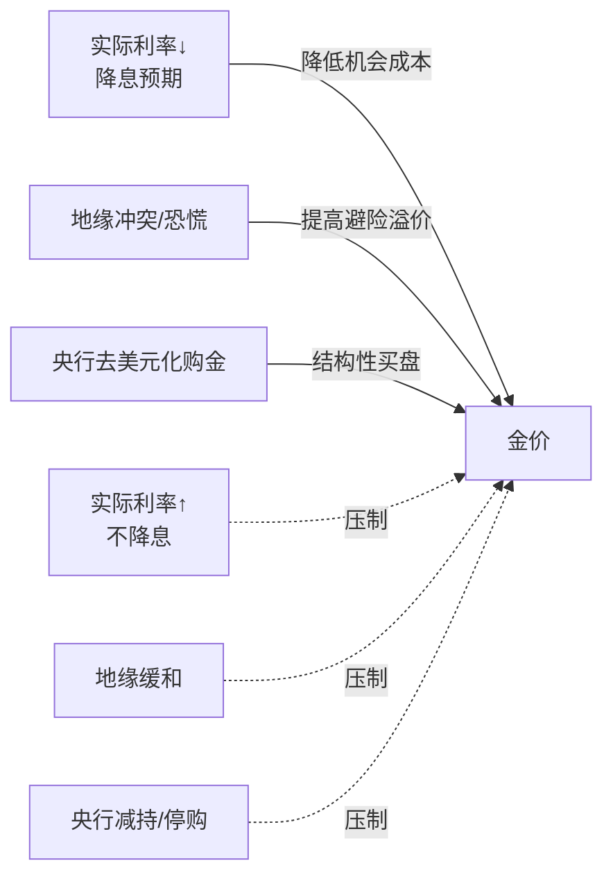

## 一文读懂黄金涨跌的逻辑
   
### 作者  
digoal  
  
### 日期  
2026-06-08 
  
### 标签  
黄金 , 央行购金 , 金占外储 , 美联储 , 实际利率 , 通胀刺激 , 避险 , 地缘 , 定投  
  
----  
  
## 背景 
  

今天是 2026 年 6 月 8 日。我看了一眼盘面：

- 伦敦现货黄金 4327 美元/盎司
- 国内上海金交所原料金 970 元/克
- 周大福足金首饰 1323 元/克，中国黄金 1289 元/克
- 国际金价较年内高位（约 4800-4900 美元）回落约 10-12%

上周五（6 月 5 日）一晚之间，COMEX 黄金期货跌了 **3.35%** ，白银跌了 **8% 以上**，铂金跌 **6.48%** ，南方两倍做多黄金 ETF 跌超 **6%** [来源: [金价查询网](http://www.huangjinjiage.cn/?d=123)、[财联社](https://so.html5.qq.com/page/real/search_news?docid=70000021_2146a26281a65852)]。

所以当朋友问"黄金为什么一直跌"，**它的真实含义**通常是这个：从年初高位算起跌了一成多，上周还出现单日 3% 以上的暴跌，金店还在卖 1300 块一克，到底是想买的人该不该等，已经买在山顶的人该不该割？

这才是普通人关心的问题。我把它拆成两个完全不一样的解释，逐一验证给你看。

## 黄金为什么涨，又为什么跌：先讲清楚定价机理

黄金这个东西很奇怪——它不付息、不分红、不生小狗、不创造现金流。一根金条放在保险柜里十年，还是那根金条。

那它的价格凭什么涨？凭三件事：

**第一件，机会成本。** 你拿钱买金条，等于放弃了同等金额的美元国债能给你的利息。当美元国债的"真实利息"（扣除通胀后的利息，叫 **实际利率**）很高时，你拿黄金就吃亏；当真实利息很低甚至为负时，黄金反而显得划算。这就是为什么"美联储降息预期"会推动黄金上涨——降息意味着真实利息要下来。

**第二件，避险溢价。** 当世界乱了——战争、金融危机、货币崩塌——人们就愿意为黄金这种"全世界都认"的硬资产多付一点钱。这部分溢价像保险费。

**第三件，央行储备。** 这是过去三年最特殊的一条。 **2022 年俄乌冲突后，美国冻结了俄罗斯央行的外汇储备**——这件事在全世界央行心里炸了个雷。从那时起，中国、印度、土耳其、波兰、新加坡这些央行都在做同一件事：少买美债，多买黄金。这是一种"政治性对冲"，跟利率高低无关。

把这三件事画成一张图大致是这样：

理解了这三股力量，再看 2024 到 2025 年金价从 2000 涨到 4900 这件事就不神秘了——**三股力量同时朝有利方向走**：市场预期美联储会大幅降息，俄乌和中东危机持续，全球央行在历史性大举购金。 **130% 的涨幅是这三个变量叠加的结果**。

## 这一次下跌，本质上是哪种下跌

我刻意把它分成两种完全互斥的解释——一种说"趋势变了"，一种说"只是颠簸"。然后用数据去验。

### 解释 A：趋势变了，下跌还远没到位

站在**货币经济学**的角度看，过去两年金价大涨的核心赌注是"美联储很快会降息"。

- 2025 年 6 月摩根士丹利曾预测：2026 年降息 7 次
- 2026 年 6 月 8 日高盛最新预测： **2026 年全年不降息，首次降息推迟到 2027 年 6 月**[来源: [搜狐财经](https://www.sohu.com/a/1033642419_130887)]
- 2026 年 6 月 5 日 CME FedWatch 利率期货：6 月维持利率概率 **96.4%** ，7 月**加息概率 8.2%已经高于降息概率 3.2%** [来源: [财联社](https://so.html5.qq.com/page/real/search_news?docid=70000021_6196a21f92328952)]

赌错了一年半的押注现在被迫平仓。这就是上周五金价跌 3% 的根本原因——5 月非农就业新增 17.2 万人，远超预期的 8.8 万人，3-4 月数据还合计上修了 9.3 万人[来源: [财联社](https://so.html5.qq.com/page/real/search_news?docid=70000021_2146a26281a65852)]。 **美国经济太结实，美联储就没有任何理由降息** 。

站在**估值视角**看，2025 年金价涨 63%，是单年涨幅的极端水平。历史上单年涨幅超 60% 的金价（1979、2007、2010），下一年从未实现软着陆——要么大幅回调 30% 以上，要么横盘消化 2-3 年。这条经验链虽然样本只有 3 次，但已经足够引起警惕。

更关键的是估值锚：按"美元实际利率 → 金价"的长期模型，当前实际利率 1.8-2.0%（处于 2008 年以来高位），对应的金价合理区间在 2500-3200 美元。 **4327 美元仍然包含 30% 以上的"超买溢价"** 。

按这套逻辑，**金价应该跌到 3800-4000 美元才算"温和回归"，跌到 3200 才算"完全均值回归"** 。当前位置只是开始，未来 6-12 个月还会继续阴跌。

### 解释 B：只是颠簸，结构性买家根本没退

站在**国际金融体系**的角度看，过去两年的金价上涨主力买家根本不是华尔街，是**非美央行**。它们的逻辑跟"利率"几乎无关：

- 截至 2026 年 5 月末，中国黄金储备 **7496 万盎司（约 2331 吨）** ，较 4 月末 **增加 32 万盎司（约 9.9 吨）** ，为**连续第 19 个月增持**[来源: [腾讯财经](https://new.qq.com/rain/a/20260607A03MP600)]
- 这是 2026 年迄今**单月最大购金**，是此前月均（约 3 万盎司）的 10 倍

请注意时间——**5 月这次大规模加仓发生在金价 4800 美元的历史高位附近**。央行用真金白银告诉市场："这个价格我们觉得不贵"。这是最强烈的结构性买盘信号。

而且这种买盘的供给空间是按"十年"计的。中国央行的黄金占外储比例只有 5-6%（美国 75%、德国 72%）。要把这个比例调到 10%，按当前金价至少要再买 2000 吨——以现在的节奏要 17-20 年。 **这种"长跑式"的买盘根本不会被三两个月的回调吓退**。

站在**市场微观结构**的角度看，6 月 5 日那晚的下跌长得很有特点——**杠杆 ETF 跌幅大于现货、白银比黄金跌得更狠、贵金属板块全部联动**。这种模式叫 **"VaR shock"** ，是量化基金风险模型超阈值导致的强制减仓，跟基本面恶化没多大关系。

历史上 2024 年 4 月、2025 年 9 月也出现过非农或 CPI 数据冲击的单日 2-3% 下跌，3-12 周内都被消化掉了。 **这次最大概率也是同样的剧本**。

按这套逻辑，**金价在 4000-4200 区间应该有强支撑，3-6 个月内反弹到 4500 以上，2027 年看 5500-6000**。

### 两种解释的核心分歧在哪里

它们都用数据说话，都自洽。但它们对**同一件事**的判定完全相反。我把分歧点做成对比，你就能看清楚：

| 观察的事实 | 解释 A 说 | 解释 B 说 |
|------------|----------|----------|
| 5 月非农 17.2 万远超预期 | 基本面真利空，降息没戏 | 单次数据 surprise，不代表趋势 |
| 6/5 单日跌 3.35% | 估值破位，下跌的开始 | VaR shock 头寸去化，跌的尾声 |
| 高盛预测 2026 不降息 | 主流共识形成中 | 极端预测，会被后续数据修正 |
| 中国央行 5 月加速购金 | 流量太小，对冲不了 ETF 卖盘 | 性质改变了，长期买盘成立 |
| 美元指数站稳 100 | 美元强势压金价 | 已经定价，未来影响有限 |
| 美伊接近停战谅解 | 地缘溢价要消失 | 中美、台海风险还在 |

**最尖锐的分歧浓缩成一个问题**：央行购金（结构性长期买盘）的"边际定价能力"，能不能压过 ETF 卖盘 + 杠杆头寸去化（金融市场短期卖盘）？

- 解释 A 认为：央行年购金 1000 吨，只占年总需求 22%。 **2010-2015 年央行也持续购金，金价仍从 1900 跌到 1050（跌 45%）** 。所以央行买盘从来没能阻止过中期熊市。
- 解释 B 反驳：2010-2015 年的央行购金是常规储备配置，没有地缘对抗属性。 **2022 年后的购金是"政治性对冲"，价格敏感度更低、持续时间更长，性质完全不同**。

## 我的判断：条件性结论

我承认我没有办法给你一个"金价一定怎么走"的答案。任何说有的人，都在卖东西。

但我可以给你一个**条件性结论**——把它当作一份"如果...那么..."的预案：

### 在以下条件下，金价大概率继续下跌至 3800-4000：

1. 美国 6、7、8 月非农连续保持月均 12 万人以上
2. 美联储 7 月、9 月议息维持当前利率，市场降息预期持续后移
3. 美元指数维持 100-105
4. 中东、东亚地缘风险无新事件
5. 中国央行 6 月购金回落到月均 3-5 吨水平（即 5 月加速是一次性的）

**满足其中至少 3 条，年底前看 4000 美元是大概率事件。**

### 在以下条件下，当前位置（4327）就是底部，反弹到 4500+ 概率很高：

1. 6 月、7 月非农回落到 8-10 万人区间
2. 7 月美联储议息出现意外鸽派转向
3. 中国央行 6 月、7 月继续大幅购金（>8 吨/月）
4. 地缘风险新增爆发点（伊以、台海、朝鲜半岛）
5. ETF 资金流向数据出现持续净流入

**满足其中至少 3 条，金价在 4 周内反弹 5% 的概率超过 70%。**

我个人的判断（带 60% 信心）： **短期 1-2 个月内大概率反弹至 4400-4500（VaR shock 修复），但中期 6-12 个月有较大概率回落到 4000-4100 区间（实际利率压力）** 。这不是"中庸"，而是**两种解释在不同时间窗口都部分正确**的合理产物。

## 接下来盯着这些就行了

不用看股评家、不用看大行预测。普通人按月观察这几个指标，足够判断风向：

**每月 7 日左右**：看中国央行公布的黄金储备数据。如果 6 月、7 月继续每月增持 5 吨以上，结构性买盘的故事继续成立，金价大概率有底；若回到每月 1-3 吨甚至零增持，长期支撑就要打折扣。

**每月初**：看美国非农就业数据。连续两次超 15 万 + 失业率不升，利率维持高位、金价继续承压；出现单次低于 5 万或失业率破 5%，降息预期回归，金价有望反弹。

**每次美联储议息**（6/19、7/30、9/17、11/5、12/17）：看会议声明措辞和点阵图。鹰派维持 → 利空黄金；意外鸽派 → 利多黄金。

**美元指数（DXY）** ：100 是关键关口。站稳 100-105 → 利空黄金；跌破 98 → 利好黄金。

**国内品牌金店克价**：1300 元/克是普通人最直观的"温度计"。若长期跌破 1200 → 趋势真的变了；若快速回到 1350+ → 回调结束。

**最简单的一招**：每周末花 5 分钟看一眼伦敦现货金价。如果 4 周内：
- 跌破 4200 → 朝继续下行的方向走
- 站上 4500 → 朝回调结束的方向走
- 在 4200-4500 之间震荡 → 还在博弈期，再等

## 给普通人的实操态度

最后说点不绕弯子的话：

**第一，别因为跌 3% 就恐慌**。这种波动在贵金属里是常态，不构成趋势判断。

**第二，别因为央行在买就觉得稳赚**。央行成本均价在 1800-2200 美元，跟你在 4300 买入的位置完全不同。央行能扛 20 年，你不一定能。

**第三，别用全仓赌方向**。无论看涨看跌，都给自己留 50% 的子弹应对自己判断错。我上面的判断也有 40% 的概率是错的，你的判断同样如此。

**第四，把"是不是底部"换成"我的持有期是几年"** 。如果你的钱 3-5 年不动，4327 大概率不是糟糕的买入价；如果你的钱 3-6 月内要用，那不是金价的问题，是你不该买金。

**第五，国内首饰金的高溢价（1289-1325 元/克对应金交所 970 元/克）有 30% 是品牌费**。要囤金，看金交所、银行金条、ETF；要戴的，溢价再高也只能认。

---

数据截止 2026/06/08，主要参考来源：金价查询网、金投网、腾讯财经、财联社、搜狐财经、新浪财经、汇通网、华泰证券研报转述。所有具体数字均可追溯至上述来源，写作过程没有依赖训练记忆里的旧价格。
  
  
#### [PostgreSQL 解决方案集合](../201706/20170601_02.md "40cff096e9ed7122c512b35d8561d9c8")
  
  
#### [德哥 / digoal's Github - 公益是一辈子的事.](https://github.com/digoal/blog/blob/master/README.md "22709685feb7cab07d30f30387f0a9ae")
  
  
#### [About 德哥](https://github.com/digoal/blog/blob/master/me/readme.md "a37735981e7704886ffd590565582dd0")
  
  

  
