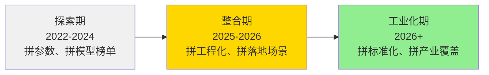

## 阿里成立 Token Foundry, 意欲何为?
   
### 作者  
digoal  
  
### 日期  
2026-06-09 
  
### 标签  
阿里 , Token Foundry , 铸造 , 传输 , 应用 , 探索 , 整合 , 工业化
  
----  
  
## 背景 


> 当一家年收入万亿的公司把"铸造厂"这个词放进组织架构，它在向整个产业宣告一件事：我们不再是模型提供商，我们要成为 AI 时代的工业基础设施。

*分析领域：企业战略 · 产业经济学 · 组织行为学 · 竞争博弈论*
*阅读时长：约 10 分钟*

---

## 事情的来龙去脉

2026年6月8日，阿里巴巴悄悄完成了一次重大手术——把通义大模型事业部和未来生活实验室合并，成立了一个听起来有点陌生的新部门： **Token Foundry 事业部**。

这不是第一次了。仅在2026年，阿里对 AI 组织架构已经动了三刀：3月，成立 Alibaba Token Hub（ATH）事业群；4月，成立集团技术委员会，通义实验室升级为大模型事业部；6月，这是第三刀，也是迄今动作最大的一刀。

CEO 吴泳铭亲自挂帅新事业部。原通义团队的灵魂人物周靖人，则从业务负责人升格为阿里历史上首任**集团首席科学家**，去做更前沿的事——组建 AI 未来研究院。

理解这次调整，不能只看组织图，要看数字：阿里最新财报显示，**AI 相关产品收入单季已达 89.71 亿元，年化突破 358 亿元，连续 11 个季度三位数同比增长**，在云业务外部收入中的占比首次超过 30%。云业务外部收入增速达到 40%，跑赢了亚马逊 AWS，追平了微软 Azure。

这家公司正在高速行驶。问题是：它要驶向哪里？

---

## 一、"铸造厂"这两个字，藏着阿里的野心

我在工业经济学框架里看这个名字，立刻明白了它的隐喻。

历史上，真正改变世界的力量往往不是那些生产炫目终端产品的人，而是那些**制造生产工具的人**。19世纪的工业革命，英国之所以能主导全球，靠的不是某件特定的纺织品，而是**织布机本身的制造能力**。钢铁、蒸汽机、精密机床——这些"铸造"能力，才是真正的护城河。

现在，阿里在 AI 时代的语境里，用了同一个词："Foundry"，铸造厂。

在大模型领域，**Token 是一切的基本单位**。模型理解语言靠 Token，生成文字靠 Token，Agent 调用工具靠 Token，最终 AI 服务的计费也以 Token 计量。谁掌握了"Token 的铸造能力"，谁就掌握了 AI 产业链的核心控制点。

这不是我的推断，吴泳铭已经公开说过：ATH（Alibaba Token Hub）的使命是" **创造 Token、输送 Token、应用 Token** "——一条从模型生产到服务交付的完整工业链。

Token Foundry 在这个链条里扮演的，正是最核心的"制造车间"角色。它把 Qwen 系列基础模型（文本理解）和 Happy Horse（视频生成）、Happy Oyster（3D 世界模型）这些多模态能力，整合进同一个"铸造"单元，统一生产、统一质量管控、统一交付。

```
┌─────────────────────────────────────────────────────────────┐
│                    阿里 ATH 事业群全景                        │
├─────────────────┬───────────────┬────────────────────────── ┤
│  Token Foundry  │   MaaS 业务线  │  千问（C端）  悟空（B端）  │
│  [铸造层]        │   [输送层]     │  [应用层]                  │
│  · Qwen 系列    │   · 百炼平台   │  · 个人 AI 助手            │
│  · Happy Horse  │   · API 接口   │  · 企业 AI 工作平台         │
│  · Happy Oyster │   · 模型市场   │                            │
├─────────────────┴───────────────┴───────────────────────────┤
│                    AI 未来研究院（前沿探索）                   │
│              芯片层：平头哥 / 云基础设施：阿里云               │
└─────────────────────────────────────────────────────────────┘
```

这个架构的逻辑非常清晰： **研究院负责烧脑，Token Foundry 负责量产，MaaS 负责卖货，千问/悟空负责占领用户心智**。四层分工，上下贯通。

---

## 二、为什么是"现在"？看AI产业的关键拐点

光看内部架构还不够，还要理解外部时机。

从产业经济学的视角看，一个技术驱动的产业，通常会经历三个阶段： **探索期、整合期、工业化期**。



2022年到2024年，是野蛮生长的探索期。每家公司都在跑参数、刷榜单，大家比的是"我的模型更聪明"。这段时间，中国一度出现几百家大模型公司，充满泡沫。

2025年开始，市场进入整合期。光有聪明的模型不够，客户要的是**能稳定运行、能接入业务流程、能产生可计量价值的服务**。落地能力、工程化能力、MaaS 化能力，开始成为新的竞争维度。这一阶段，大量没有工程化能力的模型公司开始被淘汰。

2026年，我们正站在第三阶段的入口 —— **工业化期**。当 AI 产品收入开始占云收入的 30%，当年化收入突破 350 亿，当越来越多的企业把 AI 调用变成日常标配，这个产业的规律开始从"谁更智能"变成"谁的产能更稳定、谁的交付更可靠、谁的成本更低"。

Token Foundry 的成立，恰恰是阿里对这个时机的回应——**我要主动定义工业化时代的生产标准**，而不是等别人来定义。

---

## 三、吴泳铭亲自挂帅，权力信号比组织图更重要

如果说 Token Foundry 的成立是"做什么"，那么吴泳铭亲自挂帅，则是"怎么做"和"优先级"的强烈信号。

从组织行为学来看，一件事"谁负责"，往往比"如何负责"更能说明问题。一家公司的 CEO 时间，是最稀缺的资源。当 CEO 决定把某个业务装进自己的直接汇报线，它传递的信号是：这件事失败了，我是第一责任人；这件事的资源，拥有最高优先级。

对比来看，全球主要科技公司在 AI 组织升级上有惊人的相似性：谷歌将 Brain 和 DeepMind 合并后直接向 Pichai 汇报，微软新设 Copilot 副总裁直接向纳德拉汇报，Meta 四次重构 AI 组织都在打通实验室和产品的边界，亚马逊则把 AGI、芯片和量子计算统一归建。这些动作背后的共同逻辑，是 **把 AI 从"旁路"拉进"主路"** —— 不再是某个副总裁主导的独立项目，而是嵌入公司最核心的决策回路。

阿里今天的动作，符合这一全球共性。吴泳铭挂帅 Token Foundry，意味着大模型能力和产品商业化之间不再有协调成本，决策链路缩短到最短。

值得关注的还有另一个人事安排：周靖人升任首席科学家，成立 AI 未来研究院。这个职位在阿里历史上是头一次设立。他要探索的方向包括 Test-Time Compute（推理时计算）、万亿级 MoE 稀疏化、递归自我改进（RSI）——这些都是 2026-2028 年 AI 能力跃升的核心赌注。

这是一个典型的 **"双轨制"** 布局：Token Foundry 负责把今天的模型能力变成商业化收入；AI 未来研究院负责确保明天仍有新的弹药。两件事同时推进，互不干扰。

```
  现在                                       未来
  ───┬─────────────────────────────────────────────────→ 时间
     │
     ├── [Token Foundry] 量产・商业化・规模化交付
     │         ↑
     │      吴泳铭直管，优先级最高
     │
     └── [AI未来研究院] 前沿探索・新范式研究・下一代模型
               ↑
            周靖人主导，五年视野
```

---

## 四、这次调整真正想打败的对手是谁？

表面上看，阿里的竞争对手是百度、华为、字节。但如果放大视野，用竞争博弈的框架来看，我认为 Token Foundry 真正在意的对手，是两个层面的威胁：

**第一个威胁：平台化的大洋彼岸对手**

OpenAI 正在加速从模型公司转变为平台公司，其 API、微调能力、Agent 框架正在让越来越多的企业直接建立在 OpenAI 的基础设施上。如果中国企业的 AI 基础设施话语权被境外平台占据，那无论国内的模型跑分多高，都可能变成一个生态孤岛。Token Foundry 的战略意义之一，是**给中国企业提供一套本土化的、可信赖的、完整的 AI 工业底座**。

**第二个威胁：碎片化的内卷**

中国 AI 市场今天存在一个隐患：过多的玩家在过多的细分方向上各自为战，产业生态碎片化严重。谁能率先形成"事实上的标准"，谁就能吸引生态向自己聚拢。阿里的 MaaS 平台（百炼）上，公共模型服务 Token 消耗规模在一个季度内提升了 6 倍，这说明聚拢效应已经开始显现。Token Foundry 的成立，是在给这个聚拢加速——**把最好的模型能力装进最标准的服务容器里，让生态接入变得极其简单**。

吴泳铭在财报电话会上立下了一个宏大的目标：未来五年，云和 AI 商业化年收入突破 **1000 亿美元**。今天的起点是约 1000 亿人民币。五年内增长近 7 倍，复合年化增速约 47%。这不是财务指引，而是一张战争地图。

---

## 五、这个判断什么时候会失效？

我需要在这里说一些不那么乐观的话。任何战略都有它可能失效的边界条件。

Token Foundry 的逻辑建立在几个前提上： **Qwen 系列模型保持全球竞争力、MaaS 商业化模式被市场接受、多模态模型（视频+世界模型）真正产生商业价值**。

如果这些前提出现问题，比如：开源生态（比如 Meta 的 LLaMA）持续降低模型能力门槛，让"模型本身"成为可替代商品，那么 Token Foundry 的核心竞争力会被大幅削弱。又或者，Happy Horse、Happy Oyster 这些多模态产品，在真实商业落地中遭遇"技术很炫、实用有限"的困境，整合的加法就可能变成减法。

还有一个组织层面的风险：高度集中的 CEO 直管模式，在高速发展时能产生强大执行力，但一旦市场节奏放缓、内部出现意见分歧，集中化结构的容错空间会比分布式结构小很多。

**如何判断这个战略是否成功？** 三个观测指标：
- ① MaaS 收入是否在 2027 年超过 IaaS 成为阿里云最大收入产品（阿里自己预测会发生）；
- ② Happy Horse/Happy Oyster 是否在淘系电商和文娱外，找到第三个、第四个规模化落地场景；
- ③ AI 未来研究院是否在 2027 年产出有全球影响力的技术突破。
  
---

## 结语：工业时代的 AI 铸造厂

回到那个隐喻。19世纪的铸造厂，生产铁轨和蒸汽机零件，奠定了工业文明的物理基础。

2026年，阿里选择用"Foundry"这个词，是一种清醒的自我定位：我们不只是在竞争谁的 AI 更聪明，我们在竞争谁有能力成为下一个时代的**工业基础设施**。

Token 正在成为 AI 时代的"电"——无处不在，按需计量，不可或缺。谁铸造了最好的"电厂"，谁就掌握了这个时代最重要的开关。

这场竞争，还远远没到终局。

---

*本文数据来源：阿里巴巴2026财年Q4财报、虎嗅、时代周报、第一财经、财联社等公开报道*
*发布时间：2026年6月9日*
  
  
#### [PostgreSQL 解决方案集合](../201706/20170601_02.md "40cff096e9ed7122c512b35d8561d9c8")
  
  
#### [德哥 / digoal's Github - 公益是一辈子的事.](https://github.com/digoal/blog/blob/master/README.md "22709685feb7cab07d30f30387f0a9ae")
  
  
#### [About 德哥](https://github.com/digoal/blog/blob/master/me/readme.md "a37735981e7704886ffd590565582dd0")
  
  

  
