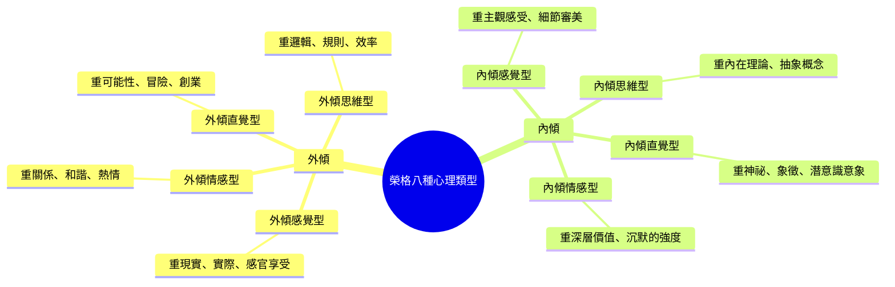
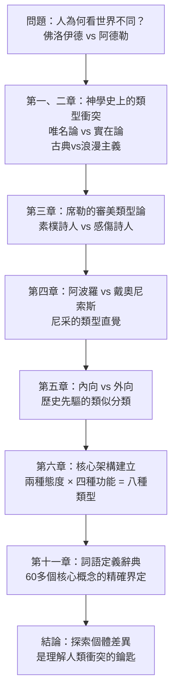
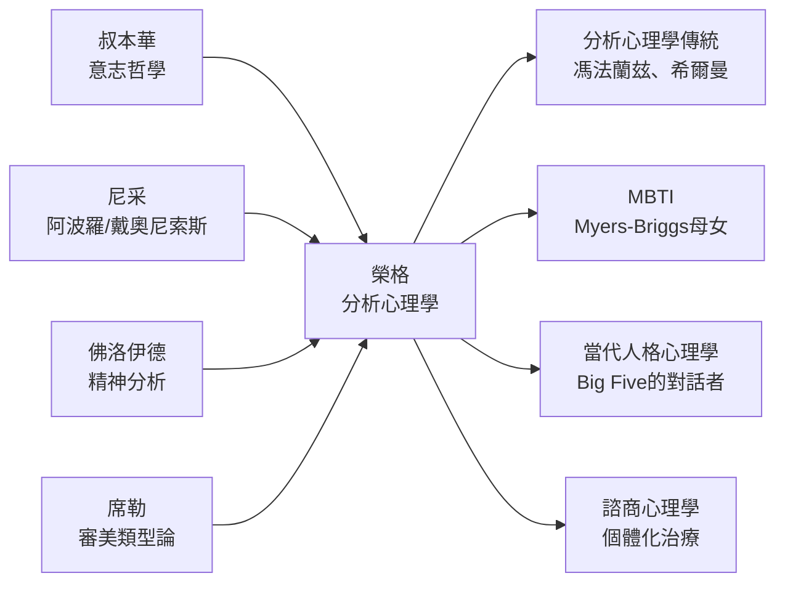

## 《榮格論心理類型》读书笔记 
  
### 作者  
digoal  
  
### 日期  
2026-06-09  
  
### 标签  
读书笔记 , 榮格論心理類型  
  
----  
  
## 背景 
  
---
書名: 《榮格論心理類型》  
作者: 卡爾．榮格（Carl Gustav Jung）  
譯者: 莊仲黎  
出版社: 商周出版  
出版年份: 2017（原著1921/1950）  
原作名: Psychologische Typen  
笔记日期: 2026-06-09  
豆瓣連結: https://book.douban.com/subject/27624597/  
ISBN: 9789864773503  
標籤: [分析心理學, 榮格, 人格類型, 深層心理學, 心理學經典, MBTI源頭]  
---

  

> **一句話**：這不是性格測驗手冊，而是一部追問「人為什麼看世界不同」的哲學心理學巨著——MBTI的祖先，卻比MBTI深刻一百倍。  
> **適合誰讀**：對心理學、哲學、宗教史有興趣的人；MBTI愛好者想知道「根源在哪裡」；任何對「自我認識」有渴望卻覺得流行心理測驗太淺的人  
> **閱讀難度**：⭐⭐⭐⭐☆（榮格的德文思維密度極高，640頁原典，非輕鬆讀物）  
> **推薦指數**：⭐⭐⭐⭐⭐（重量級經典，值得一生中至少翻閱一次）  
  
---

## 一、時代坐標：這本書從哪裡來？

1921年，卡爾·榮格出版了《心理類型》（Psychologische Typen）。此時距離他與佛洛伊德決裂已過去整整八年。那場決裂不只是學術分歧，更是一場靈魂的地震——榮格失去了精神上的父親，也在隨後幾年陷入了嚴重的心理危機，反覆出現世界末日般的幻象，「看見北歐被血海淹沒」。

然而，正是這段黑暗時期，成為了《心理類型》的燃料。

榮格在危機中問了自己一個根本性問題：**為什麼佛洛伊德和阿德勒這兩位天才，會對人類心靈有如此截然不同的理解？**

佛洛伊德的體系以「力比多」（性驅力）為核心，強調人被過去的創傷所決定；阿德勒則以「權力意志」為核心，強調人受劣等感驅使去補償自我。兩套理論都能解釋某些人，卻無法解釋另一些人——而且兩位創立者本人，性格上就是鮮明的對比。

榮格的洞見是：**這不是誰對誰錯的問題，而是兩個不同類型的人，用自己的心理類型去解讀世界。** 爭論本身就是類型的衝突。

他花了二十年臨床工作、閱讀跨越人類學、史學、文學、哲學、美學與宗教學的龐大資料，試圖回答：人類的心靈差異，是否有某種根本結構可以描述？

```
     1913年                1921年              1950年
    ┌──────┐              ┌──────┐             ┌──────┐
    │與佛洛  │  →  8年     │《心理  │  →  29年   │ 最終  │
    │伊德決裂│  深度沉澱   │ 類型》 │  8次修訂   │ 版本  │
    └──────┘              └──────┘             └──────┘
      靈魂地震              理論誕生              集大成
```

這本書是他對這場內心震盪最深刻的回應，也是他整個「分析心理學」體系的奠基石。

---

## 二、核心命題：作者在說什麼？

### 命題一：人的心理能量有兩種根本方向——內傾與外傾

榮格提出，每個人都有一種根深柢固的心理取向：能量（他稱之為「力比多」，但不限於性的含義）究竟傾向流向內部（主體/自我），還是外部（客體/他人/世界）。

**外傾者**（Extraversion）：客體對他們有磁力，他們從外在世界獲得能量，在人群中充電，對外在刺激高度敏感和回應。

**內傾者**（Introversion）：主體對他們是首要的，他們向內撤退，在獨處中充電，對外在壓力往往感到消耗。

重要的是，榮格自己也承認這種區分是「虛構」（Fiktionen）——現實中沒有純粹的外傾者或內傾者，每個人都同時具備兩種取向，只是偏好其中之一。「在現實中，不存在純粹的內傾者或外傾者，有的只是內傾或外傾的功能類型。」

### 命題二：意識有四種功能，形成八種心理類型

榮格提出，意識可以通過四種功能來處理世界：

**理性功能（judging）**：
- **思維**（Thinking）：依據邏輯和因果做判斷，問「這是真的嗎？」
- **情感**（Feeling）：依據價值觀和重要性做判斷，問「這對我有意義嗎？」

**非理性功能（perceiving）**：
- **感覺**（Sensation）：通過感官接收現實，告訴你「它是什麼」
- **直覺**（Intuition）：感知到可能性和隱藏的脈絡，告訴你「它可以是什麼」

每種功能再乘以兩種態度（內傾/外傾），得到**八種心理類型**：外傾思維型、內傾思維型、外傾情感型、內傾情感型、外傾感覺型、內傾感覺型、外傾直覺型、內傾直覺型。



### 命題三：劣勢功能是通往無意識的門

榮格最深刻的洞見不在分類本身，而在於：**每個人都有一個主導功能和一個對立的劣勢功能（inferior function）。**

若一個人的主導功能是「思維」，那麼「情感」就是他最不發達的功能——而且，這個劣勢功能並非消失，而是沉入無意識，以自主的、往往不受控的方式影響他。

這是與後來的MBTI最根本的差異：榮格不認為類型只是描述我們「是什麼樣的人」，而是描述**意識的偏好如何決定了無意識的陰影**。個體化（Individuation）的過程，就是學會整合自己的劣勢功能——那個被壓制的自我。

---

## 三、論證地圖：榮格怎麼建構這套理論？

這本書不是從一開始就提出類型論，而是用一種壯麗的歷史探索來「考古」——他要先證明，這些類型對立的問題，在人類歷史上以各種偽裝反覆出現。



他從古典神學的「唯名論與實在論」之爭出發，轉向席勒（Schiller）對「素樸詩人與感傷詩人」的區分，再到尼采對「阿波羅精神與戴奧尼索斯精神」的洞察——榮格的論證策略是：這些對立並非偶然，它們是人類心靈最深層結構的反映。

最值得注意的是書末那章「定義」（Definitionen）——超過60個心理學術語的精確界定，幾乎可以作為一部小型榮格概念辭典閱讀。這顯示了榮格對概念嚴謹性的高度要求，也是這本書難讀的原因之一。

---

## 四、前提假設與邊界：什麼時候這不成立？

### 假設一：心理類型具有先天性基礎

榮格相信，人的類型偏好在某種程度上是先天的，或至少在幼年早期就形成了。這個假設在今天仍具爭議——發展心理學和神經科學的研究給出了更複雜的圖像：遺傳、早期依附關係、文化背景都有顯著影響。

### 假設二：類型是二元對立的

榮格雖然反對把類型看作截然分明的盒子，但整個框架仍建立在二元對立上（內傾/外傾、理性/非理性）。現代人格心理學批評這種二元論——事實上，大多數人的特質呈常態分布，許多人處於中間地帶，被強制歸類反而失真。

### 假設三：劣勢功能進入無意識

這一假設最難被實證驗證，也是學術心理學最難接受的部分。榮格的無意識理論本質上是現象學的，難以用量化研究直接檢驗。

### 邊界：這不是一本「測驗手冊」

榮格本人對MBTI的誕生態度冷淡甚至不以為然。Myers-Briggs母女把他的活的、動態的類型論轉化為靜態的16格分類，**榮格認為真正重要的不是你屬於哪一格，而是你的主導功能如何與劣勢功能的陰影形成動態張力，以及你如何在個體化過程中整合它們。**

---

## 五、思想譜系：這本書在哪個傳統裡？



榮格站在德國浪漫主義哲學的傳統上——叔本華的意志哲學、尼采對人性類型的直覺——同時又是佛洛伊德的繼承者與反叛者。他的最大貢獻在於：把「人為何不同」從道德判斷（誰對誰錯）轉化為心理學描述（各有其型，各有其陰影）。

在影響上，這本書催生了MBTI（全球使用最廣泛的性格測驗，年產值超過兩千萬美元），也深刻影響了後來的分析心理學傳統，以及現代諮商中對個體差異的重視。

---

## 六、我學到了什麼？

讀榮格的《心理類型》，最衝擊我的不是那個8種類型的框架，而是他問問題的方式。

**第一個收穫：「誰對誰錯」的爭論往往是「誰是哪種類型」的衝突。**

這改變了我看待許多日常衝突的方式。一個外傾感覺型的人與一個內傾直覺型的人爭論「實際行動重要還是長遠規劃重要」，他們不是在談論同一個世界——他們的意識接收到的現實本來就是不同的切面。榮格給了我一種寬容的基礎，不是基於「每個人都對」的相對主義，而是基於「每種類型都有其真實性，也有其盲點」。

**第二個收穫：劣勢功能是最誠實的鏡子。**

一個極度理性的人往往在情感上最脆弱；一個高度直覺型的人往往最討厭被要求面對具體細節。榮格說，你最不擅長、最容易被它激怒的地方，恰恰是你內心最需要整合的部分。這比任何測驗的結果都更有力量。

**第三個收穫：心理類型不是身份標籤，而是個體化的起點。**

榮格沒有告訴你「你是INTJ所以這樣那樣」，他說的是：認識你的主導功能，是為了讓你能去發展那個被壓制的劣勢功能——成為一個更完整的人。類型論的目的是超越類型，而不是被類型定義。

---

## 七、舉一反三：這個框架還能用在哪？

**職場衝突的新視角**：當一個極重效率邏輯的主管（外傾思維型）與一個重視人際和諧的下屬（外傾情感型）發生衝突時，雙方都感到對方「難以理解」——榮格的框架提醒我們，這是結構性差異，不是道德問題，需要翻譯而不是說服。

**親密關係中的吸引力邏輯**：為什麼我們往往被「不同類型」的人吸引？榮格認為，這是因為對方的主導功能恰好是我們的劣勢功能——我們在他們身上看到自己最缺乏的東西，最初感到著迷，最後卻可能因同一原因發生衝突。

**創作者的自我認識**：一個內傾直覺型的作家在被要求「更接地氣、更實用」時的痛苦；一個外傾感覺型的創業者在被建議「要有更深的哲學」時的困惑——類型論幫助創作者和工作者認識自己的自然優勢，並有意識地去補強盲點。

---

## 八、批判與反思

我欣賞榮格的宏觀野心，但也有幾個地方讓我保持距離。

**榮格的歐洲中心視角**：這本書引用了大量西方哲學、神學、文學來佐證類型論的普世性，卻幾乎沒有觸及非西方文化的人格觀。他的「普世性」實際上是建立在相當狹窄的文化基礎上的。

**科學性問題不可迴避**：榮格的類型論本質上是現象學觀察，不是實驗科學的產物。「劣勢功能進入無意識」這類說法很難被操作化和測量。這不是說他的觀察是錯的，而是說它的知識論地位更接近哲學或臨床藝術，而不是嚴格科學。

**類型的流動性被低估了**：現代研究顯示，人的性格特質隨年齡、環境、壓力狀況有顯著變化。MBTI研究甚至發現，同一個人在五週前後重測，約有一半的人結果不同。這提示「類型」可能沒有榮格想像的那麼穩定。

**但最深刻的批評或許來自榮格自己**：他說，這些類型對立是「虛構」，是理解的工具而非存在的事實。如果連榮格都如此謙遜，我們或許更應該把這套框架當作一個對話起點，而非最終答案。

---

## 九、金句與記憶點

**① 「心理類型不僅是心理學的課題，也是所有取決於人類心理的學術與生活領域的首要問題。」**
→ 榮格的宣言：人的心理類型不只決定性格，更決定了他如何看待哲學、宗教、美學，乃至整個世界觀。

**② 「在現實中，不存在純粹的內傾者或外傾者，有的只是內傾或外傾的功能類型。」**
→ 對MBTI風潮最好的解毒劑：類型是傾向，不是鐵籠。

**③ 「每個人所選擇的態度和功能之組合，是一種天生立場，形成了個體面對經驗的方式，同時也讓個體較少用其他組合來經驗世界。」**
→ 精妙地說明了類型既是天賦，也是局限。

**④ 劣勢功能（Inferior Function）**
→ 榮格最獨特的概念：你最不擅長的功能，在無意識中以最原始的方式工作著，往往在壓力或疲憊時突然冒出，讓你自己都認不出。

**⑤ 「人格面具（Persona）是我們向他人展示自我的方式，它是一種面具，用來塑造我們想傳達的印象，並隱藏自我的其他面向。」**
→ 心理類型理論與人格面具理論的連結：我們的社會角色往往固化了我們的主導功能，壓制了劣勢功能。

**⑥ 個體化（Individuation）：整合陰影，成為完整的自己**
→ 類型論的終極目的不是讓你更安心地做「自己那個類型」，而是去面對並整合那個被壓制的自我——那才是成長的真正方向。

---

## 十、延伸閱讀

**1. 《榮格自傳：回憶、夢、省思》（Memories, Dreams, Reflections）**
→ 讀完《心理類型》後，最好的補充。看榮格如何以親身敘述，說明他自己的類型形成與個體化歷程。

**2. 《榮格心理學辭典》（A Critical Dictionary of Jungian Analysis）**
→ 本書末章「定義」的進階版，系統性地解釋榮格所有核心概念。

**3. 馮法蘭玆（Marie-Louise von Franz）& 希爾曼（James Hillman）著《榮格類型論講座》（Lectures on Jung's Typology）**
→ 榮格最重要的弟子們對這套類型論的深化和應用，比原典更易讀。

**4. 《人及其象徵》（Man and His Symbols）**
→ 榮格為一般讀者寫的最後一本書，是進入榮格世界的最佳敲門磚，比《心理類型》友善許多。

**5. 羅伯特·強森（Robert A. Johnson）著《擁有自己：榮格的內在工作》**
→ 如果被類型論啟發、想要認識自己的劣勢功能，這本書提供了非常實用的「積極想像」方法指引。

---

*筆記寫於 2026-06-09 | 基於公開資料與深度思考整理*
*本書為莊仲黎自德文原典直譯，2017年商周出版，640頁，ISBN: 9789864773503*
  
  
#### [PostgreSQL 解决方案集合](../201706/20170601_02.md "40cff096e9ed7122c512b35d8561d9c8")
  
  
#### [德哥 / digoal's Github - 公益是一辈子的事.](https://github.com/digoal/blog/blob/master/README.md "22709685feb7cab07d30f30387f0a9ae")
  
  
#### [About 德哥](https://github.com/digoal/blog/blob/master/me/readme.md "a37735981e7704886ffd590565582dd0")
  
  

  
