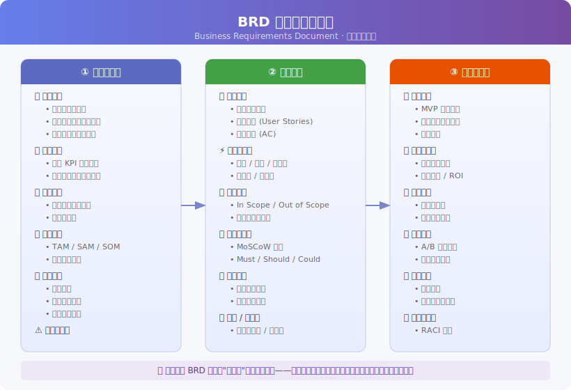
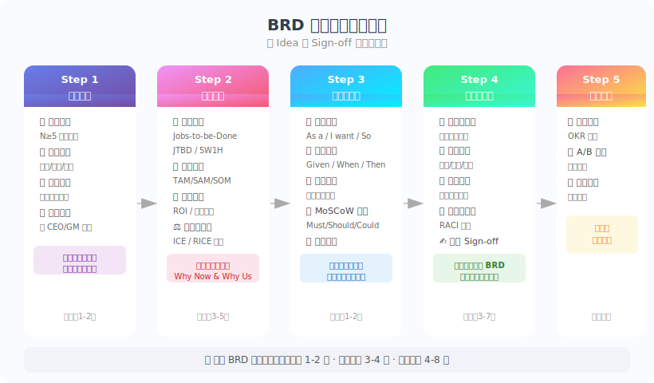
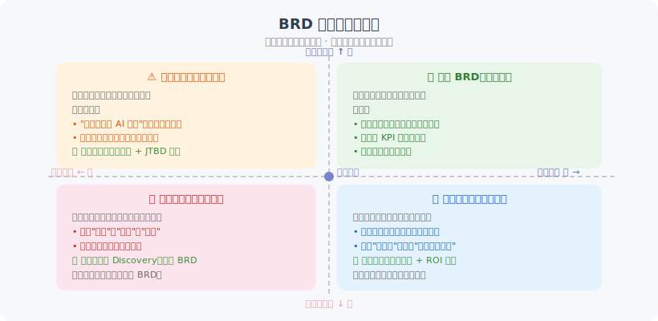

# 产品经理写 BRD，到底在写什么？

> 一份 BRD 不是"功能清单"，而是一份**商业论文**——它要说服所有人：这个问题值得解决、这个方案是最优解、这个团队能交付。

*分析领域：产品战略 · 用户研究 · 工程系统 · 组织沟通*  
*阅读时长：约 12 分钟*

---

## 一、大多数 BRD 为什么写完没人看？

我在接触了数百份产品文档之后，发现一个规律：真正被团队认真对待、在决策中反复引用的 BRD，不超过 20%。剩下的 80%，写完就进了归档夹，下次打开已经是半年后的复盘会。

问题出在哪？不是格式不对，也不是内容不全——是**写作目的搞错了**。

大多数人把 BRD 理解成"需求规格说明书"，一份给工程师看的技术文档。这种理解会导致一个致命的误区：先把功能想清楚，再把功能写进 BRD。结果产出的文档逻辑是这样的：我们要做 A 功能、B 功能、C 功能，每个功能有这些字段、那些交互逻辑……

工程师看完能照着做，但业务负责人看完只有一个问题：**"这些功能为什么要做？"**

从组织沟通的视角来看，一份文档能不能被"执行"，取决于它能不能让所有读者形成共识——而共识的前提是"相信"，相信这个问题真实存在，相信这个方案值得投入，相信这个团队能交付。

BRD，本质上是一份**商业论文**，而不是需求说明书。

---

## 二、BRD 的骨架：三层结构

理解了这一点，BRD 的结构就变得清晰了。它应该回答三个层次的问题：



**第一层：为什么要做（背景与目标）**  
这是整个文档最核心的部分。很多 PM 在这里一笔带过，写几句"随着市场发展，用户需求日益增长……"这样的套话。这是大忌。

真正有说服力的问题定义，来自用户研究领域的一个核心方法——Jobs-to-be-Done（JTBD）框架。用户使用一个产品，并不是为了"使用这个产品"本身，而是为了完成某项"人生任务"。比如，用户买电钻不是为了"拥有一个电钻"，而是为了"在墙上打一个洞"，再往深一层，是为了"把那幅画挂上去，让家里显得有品味"。

所以，一份好的问题陈述应该是这样的形式：**"当用户处于[情境]时，他们需要[完成某项任务]，但现在他们面临[具体障碍]，导致[业务影响]。"**

这一段写好了，后续所有的功能设计都有了"锚点"——读者在每个功能面前都会自动问"这个功能解决了哪个障碍"，而不是"这个功能有没有必要"。

**第二层：做什么（需求规格）**  
这里才是功能定义的地方。但写法要变——不是"系统支持用户做 X"，而是"作为一个[用户角色]，我希望[做某件事]，以便[达到某个目的]"。这就是经典的用户故事（User Story）格式。

这个写法看似小差别，实则影响巨大：工程师在拆解技术方案时，会不断回来对照"用户目的是什么"，而不是陷入纯粹的技术实现讨论。

**第三层：如何验证（执行与验证）**  
最容易被遗忘的部分。一份没有指标的 BRD，相当于一份没有评分标准的作业——交上去了，但谁也不知道算不算及格。

从系统设计的视角看，每一个核心功能都应该有对应的"可观测指标"。上线后，通过 A/B 测试或者灰度发布，用数据验证功能是否达到了预期目标。这不是"nice to have"，而是产品闭环的必要组成。

---

## 三、从 Idea 到 Sign-off：BRD 写作的五步工作流

知道写什么，还要知道怎么写。一份 BRD 从立项到获批，通常经历五个阶段：



### 第一步：问题发现（1-2 周）

这一步的核心是"摆脱主观"。PM 天生有"解决方案偏见"——看到一个问题，大脑会立刻跳到解决方案。但这时候应该强迫自己停下来，先把问题摸透。

最有效的方法是**深度用户访谈**（不少于 5 人），用"5 Why"追问法挖掘根因。配合数据分析，找到漏斗断点、高投诉节点、低留存场景。

一个判断问题是否真实的方法是：能不能用一句话写出"问题陈述"？如果写不出来，说明问题还没想清楚，不应该进入下一步。

### 第二步：机会论证（3-5 天）

有了清晰的问题，要回答的下一个问题是：**这个问题值不值得用公司资源去解决？**

这里有两个常用工具。一是 **RICE 评分模型**：

```
RICE = (Reach × Impact × Confidence) / Effort
```

- Reach：这个问题影响多少用户/业务？
- Impact：解决之后对核心指标的提升程度？
- Confidence：我们对上述估计的把握有多大？
- Effort：需要多少人力/时间？

二是**市场机会规模（TAM/SAM/SOM）**：TAM 是理论上所有潜在用户的价值，SAM 是可服务的市场，SOM 是现实可获取的份额。把这三个数字量化出来，领导层对"为什么值得做"就有了具体认知。

### 第三步：需求规格化（1-2 周）

这是技术含量最高的一步，也是 BRD 中字数最多的部分。核心方法是**MoSCoW 优先级框架**：

```
Must Have   → 没有这个，产品就不能上线
Should Have → 重要但非核心，第一版可以简化
Could Have  → 如果有时间/资源，锦上添花
Won't Have  → 明确声明本次不做
```

很多 PM 在这里犯的错误是把 Could Have 当成 Must Have，导致范围持续膨胀，项目延期，团队精力分散。**明确说"不做什么"和说"做什么"同等重要。**

每个 Must Have 功能，还需要配上验收标准（Acceptance Criteria），格式通常是：
- Given：用户在什么场景下
- When：用户做了什么动作
- Then：系统应该产生什么响应

这样的标准，既是开发的实现依据，也是 QA 的测试依据，还是上线后的评估依据。

### 第四步：对齐与评审（3-7 天）

一份 BRD 写完，只有 PM 自己看懂是不够的。它需要经历多轮评审：

```
评审矩阵（RACI）
┌────────────────┬─────────┬─────────┬─────────┬─────────┐
│   干系人        │  技术团队 │  设计团队 │  业务团队 │  高层   │
├────────────────┼─────────┼─────────┼─────────┼─────────┤
│ 技术可行性评估  │    R    │         │         │    I    │
│ UX/UI 评审     │    C    │    R    │    I    │         │
│ 法务/合规确认   │    I    │         │    R    │    A    │
│ 最终 Sign-off  │    C    │    C    │    C    │    R    │
└────────────────┴─────────┴─────────┴─────────┴─────────┘
R=Responsible C=Consulted I=Informed A=Accountable
```

**技术评审**最容易暴露的问题是"技术债"——PM 以为轻松实现的功能，实际需要重构底层架构。所以在这一步，让工程师早期介入是关键，比后期返工便宜 10 倍。

**业务评审**最容易暴露的问题是"合规风险"——某些数据处理方式可能违反 GDPR，某些营销功能可能触碰监管红线。这些问题发现得越早，成本越低。

### 第五步：验证追踪（持续进行）

BRD 批准上线后，工作不是结束，而是开始了"验证"阶段。从行为经济学的角度来看，人类有强烈的"执行意图偏差"——认为做完了就算成功。但在产品领域，**执行完成不等于目标达成**。

上线后要追踪的核心指标，应该和 BRD 中定义的成功标准一一对应。如果数据表明功能没有达到预期效果，就需要快速迭代。这种"假设-验证-迭代"的闭环，才是现代产品开发的核心范式。

---

## 四、BRD 的质量自检：四象限模型

写完之后，怎么判断一份 BRD 是不是足够好？我用一个四象限模型来评估：



横轴衡量"用户视角完整性"——文档是否基于真实的用户研究，而不是主观假设？纵轴衡量"商业可行性清晰度"——文档是否清楚地说明了为什么这个问题值得投入资源？

- **黄金 BRD（右上象限）**：用户需求有数据支撑，商业目标有量化指标，技术可行性已预验证。这是目标。
- **战略驱动型（左上象限）**：高层说要做，所以做。商业逻辑有了，但没有真正去验证用户需求。这类 BRD 容易做出"供给找不到需求"的功能。
- **用户洞察型（右下象限）**：有大量用研报告，但没有说清楚商业价值。需要补充机会画布和 ROI 分析。
- **概念文档（左下象限）**：这种情况下不应该写 BRD，应该先做 Discovery。

---

## 五、最容易犯的五个错误

**错误一：把解决方案当问题描述**  
"我们需要做一个 AI 聊天功能"——这是解决方案。真正的问题是"用户在获取售后支持时，平均等待 20 分钟，导致满意度评分下降了 15%"。

**错误二：没有范围边界（In/Out Scope）**  
不写 Out of Scope，等于给所有人留了"我以为这个也包括"的口子。所有返工中，有 30% 以上来自于范围认知不一致。

**错误三：用模糊词汇定义指标**  
"提升用户体验"不是指标。"用户完成核心任务的成功率从 60% 提升到 80%，时长缩短 30%"才是指标。

**错误四：单向输出，缺少评审循环**  
BRD 不应该是 PM 一个人写完发给所有人的文档，而应该是一个**持续迭代的协作产物**。在草稿阶段邀请工程师和设计师参与，能节省大量后期成本。

**错误五：上线即终结**  
BRD 批准了，项目就开始了，但 BRD 还没结束。它应该在上线后变成"验证追踪文档"，记录假设是否成立、指标是否达成。

---

## 六、适用边界

以上这套方法论，在以下场景最为适用：
- B 端或 C 端产品的**中大型功能**（开发周期 2 周以上）
- 需要**跨团队协作**（设计、工程、运营、法务）的项目
- 涉及**预算审批**或**高层决策**的战略项目

以下场景可以简化或跳过：
- 快速原型验证（2-3 天的 spike，可以只写 1 页 PRD）
- 技术驱动的工程优化（性能提升、架构重构，不需要完整商业论证）
- 已有充分先例的功能迭代（在成熟产品上做小功能，BRD 可以大幅简化）

---

## 七、如何验证这套方法论是否有效？

**验证方式**：用这套框架写完一份 BRD 后，找从未参与讨论的同事（或利益相关者）读完，问他们三个问题：
1. 这个问题为什么值得解决？
2. 这个方案为什么是最优选择？
3. 如果三个月后你来复盘，你会看哪些数据？

如果这三个问题他们能流畅回答，BRD 就合格了。

**证伪条件**：如果团队在开发过程中频繁回来问 PM "这个功能的目的是什么"，或者上线后没有对应的指标可以追踪，说明 BRD 的结构没有传递清楚，需要回头修订。

---

## 结语

写 BRD 的终极目的，不是"写完"，而是"对齐"。

一份真正有价值的 BRD，写完之后，团队里每个人——不管是工程师、设计师，还是运营、市场——都应该能用自己的话说清楚：我们为什么要做这件事，做完之后算不算成功。

这种清晰，比任何华丽的格式模板都重要。

---

*本文由 multi-expert-analyzer 框架生成，融合产品战略、用户研究、工程系统、组织沟通四个专业视角*
