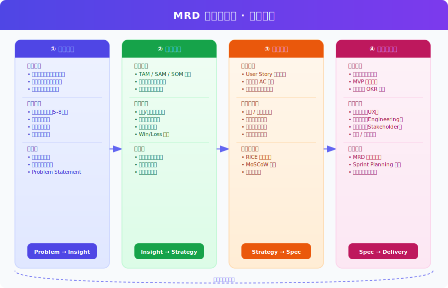
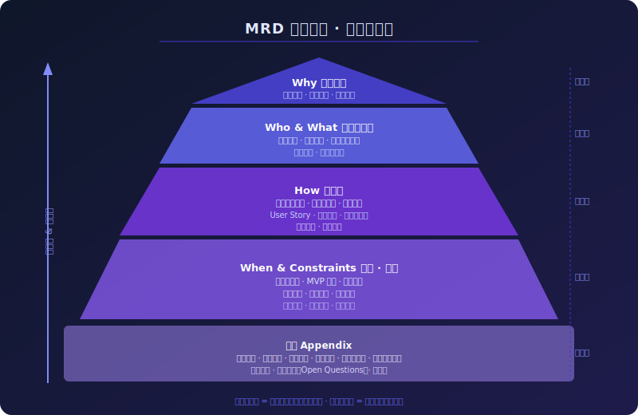
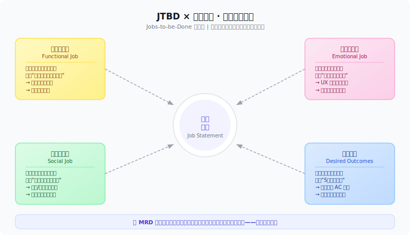

# 产品经理如何写出真正有用的 MRD？

> 一份 MRD（市场需求文档）的质量，决定了整个产品团队接下来三个月会走向何方。很多 PM 写了十几页的 MRD，工程师看了却说"不知道做什么"，设计师说"不知道为谁设计"，老板说"不知道为什么做"——这不是写作问题，是方法论问题。

*分析领域：产品管理 · 用户研究 · 商业分析 · 工程可行性*  
*阅读时长：约 15 分钟*

---

## 一、MRD 究竟是什么，不是什么

我见过太多 PM 把 MRD 写成功能清单，把"用户需要一个搜索框"当成需求，把 UI 草图当成规格说明。这种 MRD 的本质是：**把解决方案伪装成问题描述**。

MRD 的英文全称是 Market Requirements Document——注意，是"市场需求"，不是"功能需求"，更不是"产品规格"。它回答的核心问题是：**市场上存在一个什么样的机会，为什么我们现在要抓住它，我们打算服务谁，他们需要什么结果**。

真正的 MRD 应该做到：即使把"解决方案"部分全部删掉，剩下的内容依然完整且有价值。如果删掉功能描述之后文档什么都没了，那你写的根本不是 MRD，是 PRD 的草稿。

MRD 与 PRD（产品需求文档）的关系是这样的：

```
市场信号 + 用户痛点
      ↓
   MRD（Why & Who & What）
      ↓
   PRD（How & When & Spec）
      ↓
   研发排期与交付
```

MRD 在前，PRD 在后。MRD 是 PRD 的"操作手册"——PRD 里每一个功能决策，都应该能在 MRD 里找到对应的市场依据。

---

## 二、全流程：从问题发现到交付就绪

一份高质量的 MRD，背后是一套严格的四阶段方法论。



### 阶段一：问题发现——不要急着写文档

大多数 PM 在开始写 MRD 之前，花在"发现真实问题"上的时间严重不足。我的建议是：写 MRD 的时间，70% 应该花在问题发现阶段，30% 才是写文档本身。

**用户深度访谈是核心武器，但大多数 PM 用错了。**

常见的错误做法是问用户："你想要什么功能？"用户给出的答案往往是他们脑海中已有的解决方案，而非真实需求。福特曾说过一句（可能是杜撰的）名言："如果我问顾客想要什么，他们会说想要一匹更快的马。" 真正有价值的访谈问的是：**"上次你遇到这个问题时，具体发生了什么？"**

一个标准的问题发现阶段应该包含：
- **5-8 次深度用户访谈**（不是问卷，是 1:1 对话，每次至少 45 分钟）
- **竞品拆解**（不仅看功能，更要看竞品在哪个场景下失败）
- **数据漏斗分析**（用户在哪个环节流失，流失率是多少）
- **客服工单挖掘**（用户的真实抱怨往往比 NPS 调研更诚实）

这个阶段的最终产出不是一个功能列表，而是一份**Problem Statement（问题陈述）**，格式如下：

> 当 [具体用户] 在 [具体场景] 下，想要 [完成某个任务]，却面临 [当前障碍]，导致 [负面结果]。现有方案（[竞品/替代方案]）无法解决这个问题，因为 [根本原因]。

### 阶段二：市场验证——用数字说服老板和自己

感觉到用户有痛点，不代表这是一个值得投入的市场机会。市场验证阶段要回答三个问题：**有多少人有这个问题（市场规模）、有谁已经在解决（竞争格局）、我们凭什么能赢（差异化）**。

**TAM/SAM/SOM 分析是基本功。**

- **TAM（Total Addressable Market）**：这个问题的理论最大市场。比如"所有需要写邮件的人"。
- **SAM（Serviceable Addressable Market）**：我们实际能服务到的目标市场。比如"中国中型企业的职场人士"。
- **SOM（Serviceable Obtainable Market）**：未来 12-18 个月内，我们实际能拿到的市场份额。

很多 PM 只做 TAM，数字看起来很大，但对执行团队毫无指导价值。SOM 才是真正影响资源投入决策的数字。

**竞品分析要看"失败的边界"，而不只是功能对比。**

大多数竞品分析是画一张对比表格，然后证明"我们在每个维度都更好"。这是最没价值的竞品分析。真正有价值的竞品分析是：**竞品在什么场景下让用户感到失望，这个失望背后是他们的战略选择还是能力短板？**

战略选择导致的失败（比如竞品定位高端企业，所以不做免费版）意味着存在市场空白；能力短板导致的失败意味着可能是技术壁垒，需要评估我们能否跨越。

---

## 三、MRD 的文档结构：金字塔原理

MRD 的结构不是随意的，它遵循一个严格的金字塔逻辑：越靠近顶部的内容越稳定、越不应频繁修改；越靠近底部的内容越细化、越容易随迭代变化。



这个金字塔告诉我们一个重要原则：**如果底层的"功能需求"改变了，不一定需要修改顶层的"战略方向"；但如果顶层的"战略方向"改变了，底层的所有内容都需要重新检视。**

一份完整的 MRD 应该包含以下核心章节：

```
MRD 文档结构
├── 1. 执行摘要（Executive Summary）
│   ├── 核心问题 1 句话
│   ├── 目标用户 1 句话  
│   └── 成功标准 3 个指标
├── 2. 背景与战略对齐
│   ├── 公司战略背景
│   ├── 为什么现在做（时机判断）
│   └── 不做的代价
├── 3. 用户与市场分析
│   ├── 目标用户画像（含 JTBD）
│   ├── 市场规模（TAM/SAM/SOM）
│   └── 竞品分析与差异化定位
├── 4. 核心需求
│   ├── 需求场景（User Stories）
│   ├── 功能需求优先级（MoSCoW）
│   └── 非功能需求（性能/安全/合规）
├── 5. 约束与里程碑
│   ├── 技术约束
│   ├── 资源约束
│   └── 发布里程碑
└── 6. 附录
    ├── 用研报告摘要
    ├── 数据分析支撑
    └── 待决事项（Open Questions）
```

---

## 四、JTBD 方法论：理解用户真实任务

理解用户需求最大的陷阱，是把"用户说想要的"当成"用户真正需要的"。Jobs-to-be-Done（JTBD）方法论告诉我们，用户购买或使用一个产品，是为了"雇用"它完成某项任务（Job）。



**每个用户任务都由三层构成：**

第一层是**功能性任务**——用户要完成的实际行动。比如"发送一封项目进度汇报邮件"。这一层最容易被识别，也是大多数 PM 唯一关注的层次，但仅关注这一层的产品往往缺乏用户粘性。

第二层是**情感性任务**——用户希望在完成任务的过程中感受到什么。比如"我希望写这封邮件时感到从容，而不是焦虑"。这一层决定了用户对产品的好感度和留存率。Notion 之所以比 Word 更受年轻知识工作者喜欢，很大程度上是因为 Notion 让用户"感到聪明和有掌控感"。

第三层是**社会性任务**——用户希望在他人眼中呈现什么形象。比如"我希望收件人觉得我是一个细心、专业的人"。这一层是协作功能和分享功能的设计来源。

**在 MRD 中，每个核心需求场景都应该明确标注它对应的是哪一层任务，** 以及用户判断"任务完成"的标准是什么（Desired Outcomes）。这些 Desired Outcomes 最终会变成 PRD 里的验收标准（Acceptance Criteria）和成功指标（Success Metrics）。

---

## 五、需求优先级：RICE 与 MoSCoW 的组合使用

一份 MRD 里不可能所有需求都是 P0。缺乏优先级的 MRD 是最危险的文档——它让工程团队不知道从何入手，让产品在有限的 Sprint 里迷失方向。

**RICE 模型**是量化优先级的利器：

```
RICE 评分 = (Reach × Impact × Confidence) / Effort

┌─────────────┬────────────────────────────────────┐
│ Reach       │ 每月影响多少用户（绝对数字）         │
│ Impact      │ 对目标指标的影响（0.25/0.5/1/2/3）   │
│ Confidence  │ 估算的置信度（低=50%/中=80%/高=100%）│
│ Effort      │ 工程师人月（越小越好）               │
└─────────────┴────────────────────────────────────┘
```

但 RICE 是定量工具，处理不了战略维度的判断。因此我建议将 RICE 与 **MoSCoW** 结合使用：

```
MoSCoW 四象限
┌──────────────────┬──────────────────────┐
│  Must Have       │  Should Have         │
│  核心路径必须有  │  RICE 分高但非阻断   │
│  没有就不发版    │  第二批迭代目标       │
├──────────────────┼──────────────────────┤
│  Could Have      │  Won't Have (Now)    │
│  锦上添花        │  明确排除在本版本外  │
│  资源允许再做    │  避免范围蔓延         │
└──────────────────┴──────────────────────┘
```

MoSCoW 的关键不在于"Must/Should/Could"的划分，而在于**"Won't Have (Now)"这个象限**。明确说出"这次不做什么"，是一份 MRD 最有价值的内容之一，也是 PM 最难开口说出的内容之一。

---

## 六、假设清单：MRD 最容易被忽视的章节

每一份 MRD 背后都藏着一堆假设。如果这些假设是错的，整个文档就是错的。但大多数 PM 从来不把假设写出来——因为写出来意味着承认不确定性，而大多数组织文化厌恶不确定性。

我认为，**把假设写出来反而是 PM 最专业的表现**。一份好的 MRD 应该包含一个"核心假设"章节，格式如下：

```
核心假设列表示例
───────────────────────────────────────────────────────
假设 #1  目标用户每周使用场景 ≥ 3 次
验证方式 用研访谈中 80% 的受访者确认
风险等级 高（若错误，整个产品使用频率预估崩塌）
验证截止 MVP 上线后 30 天

假设 #2  竞品 X 不会在未来 6 个月推出类似功能
验证方式 定期监控竞品动态 + BD 情报
风险等级 中
验证截止 持续监控

假设 #3  技术实现可在 3 人月内完成
验证方式 工程技术预研 Spike（1 周）
风险等级 中
验证截止 MRD 评审后 1 周
───────────────────────────────────────────────────────
```

**假设越显性，团队的决策就越清醒。** 当某个假设被证伪时，整个团队能快速判断哪些功能需要重新评估，哪些已经投入的资源需要重新分配，而不是继续沿着一条错误的轨道加速前进。

---

## 七、评审流程：MRD 不是 PM 一个人的文档

MRD 写完之后，不是扔进 Confluence 就算交差。一份 MRD 需要经过至少三轮评审：

**第一轮：用户研究评审**（由 UX Research 或 Design 主导）
确认用户画像是否准确，场景描述是否反映了真实用户行为，不是 PM 的主观臆测。

**第二轮：技术可行性评审**（由 Tech Lead 主导）
确认技术约束是否准确，性能指标是否现实，依赖的第三方服务是否可用，非功能需求是否有遗漏。

**第三轮：业务评审**（由 GM/CEO/PMO 主导）
确认市场机会判断是否准确，竞争分析是否有盲点，资源投入与预期回报是否合理，是否与公司战略方向对齐。

---

## 八、边界与例外：什么时候 MRD 方法论会失效

这套方法论在以下场景中效果会大打折扣：

在**极早期探索阶段**（连 Problem Statement 都还没清晰），强行写完整 MRD 是浪费时间。应该先用 1-2 周做快速用户研究，产出一页纸的"机会简报"（Opportunity Brief），验证方向后再展开完整 MRD。

在**监管驱动型需求**（比如合规要求必须添加某个功能）时，市场分析和竞品部分意义有限，应该把重心转移到"最小合规实现方案"和"如何在合规约束内提升用户体验"上。

在**B2B 企业级产品**中，"用户"和"买家"往往是不同的人。MRD 需要同时分析两类人的任务（JTBD），而不能只关注最终用户。

---

## 九、如何验证一份 MRD 写得好不好

从站在工程师的角度：**读完 MRD 之后，工程师能不能在不找 PM 的情况下，独立做出 80% 的技术决策？** 如果不能，MRD 里的上下文不够充分。

从站在设计师的角度：**读完 MRD 之后，设计师能不能准确说出"这个功能是给谁用的、在什么场景下用、他们最在乎什么感受"？** 如果不能，用户部分写得不够深。

从站在老板的角度：**读完执行摘要（一页纸）之后，老板能不能在 5 分钟内决定"批准"还是"需要更多信息"？** 如果不能，逻辑结构需要重构。

如果一份 MRD 能通过这三个验证，那它就是一份好的 MRD。

---

## 结语

写 MRD 是一件反直觉的事情：花时间越多在问题发现上，写文档的时间反而越少；越能清晰地说出"不做什么"，团队执行力反而越强；把假设写出来承认不确定性，决策反而越精准。

一份真正有用的 MRD，不是 PM 的汇报材料，而是整个产品团队共同的"北极星文档"——它回答的不是"做什么功能"，而是"我们在为谁解决什么问题，以及我们怎么知道自己做对了"。

---

*文档版本：v1.0 | 方法论来源：JTBD · RICE · MoSCoW · Jobs-to-be-Done Framework*
