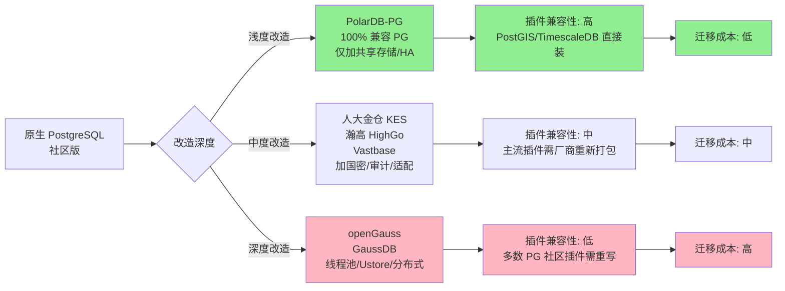

# 专家 2: PostgreSQL 内核研发专家视角 — 深度改造、国密合规与生态割裂

**人设**: 十年 PG 内核开发经验, 早期参与社区 commit, 后转入国产 PG 衍生发行版的核心研发, 主导过国密算法 (SM2/SM3/SM4) 在 PG 内核的工程化落地。曾在 openGauss、PolarDB-PG、人大金仓 KES 中至少两家工作过。最近的痛点: 看到客户把 PostGIS、TimescaleDB、PgVector 等社区插件一键 install 后, 在国产 PG 衍生品上各种报错, 然后骂"国产数据库不行"。

---

## 3.1 复述并分析问题

问题表面是: 国产 PG 厂商在内核上改了什么, 国密怎么实现的, 插件兼容怎么处理? 但本质上问的是**"开源协议层面的兼容"和"工程实现层面的兼容"是两件事**, 国产 PG 衍生品到底站在哪一侧。

我的角度是从源代码出发回答这件事 — 因为内核到底改了多少、改在哪、改的代价是什么, 只有看过源码才说得清。

需要先讲清三个基本事实:

1. **PG 的 BSD 协议**允许任何人 fork 后闭源商用, 这是国产化的法律基础。
2. **PG 的扩展机制** (extension framework) 是它生态强大的根本, 同时也是 fork 之后最容易"断"的地方。
3. **国密合规** (SM2/SM3/SM4 算法) 是政务和金融的硬门槛, 不通过密评就上不了线。

## 3.2 第一性原理拆解

我的判断建立在以下前置约束上, 每一条都源自 PG 的代码架构现实。

第一个前置是, PG 的内核架构有几个"硬骨头"是国产厂商绕不开的: **进程模型 vs 线程模型**、**WAL 日志格式**、**MVCC 多版本机制** (XID 分配、vacuum)、**优化器代价模型**。改其中任何一个都会引发雪崩式的连锁修改。

第二个前置是, 国密合规不是简单的 OpenSSL 替换那么轻松。**PG 在认证 (pg_hba)、传输 (TLS)、存储 (TDE 透明加密)、通信 (libpq)** 四个层面都用了密码学, 国密改造必须四处全开, 还要通过国家密码管理局的商密产品认证 (这是个跨越几个月、需要送测的硬流程)。

第三个前置是, PG 的插件之所以丰富, 是因为它的扩展是**动态加载 (CREATE EXTENSION)** + 钩子机制 (hook, planner_hook, executor_hook, etc.) + 自定义函数语言 (PL/Python, PL/Perl, PL/v8)。一旦内核版本分叉, 这些插件的 ABI (二进制接口) 就可能挂掉, 需要厂商自己维护一个移植版本。

如果这三个前置变了, 比如**未来 openGauss 或金仓内核重新合并回 PG 上游** (这是社区数据库厂商正常的"upstream 合并"流程, 但国产厂商目前几乎不做), 那么生态割裂就会大幅缓解。但短期内 (2-3 年) 这件事不会发生。

## 3.3 逻辑推演与图示

国产 PG 衍生品在"内核改造深度"上可以分成三档, 改得越狠, 兼容性越差, 但同时合规和性能也越强。

图中我把"深度改造"和"低插件兼容性"标红, 把"浅度改造"和"高插件兼容性"标绿。这其实就是国产 PG 厂商面临的核心两难: 要兼容性还是要差异化 — **你越想做出独家特色 (比如线程池、HTAP), 就越偏离社区, 用户的现成插件就越用不上**。

## 3.4 数据与案例支撑

**内核改造程度的实证**:

- **PolarDB-PG**: 阿里云官方文档明确说"100% 兼容 PostgreSQL" (PolarDB PostgreSQL 版常见问题, 阿里云文档)。它的改造主要在底层共享存储 (Polar Shared Storage) 和高可用 (PolarProxy), 上层 SQL 引擎几乎原样保留。
- **人大金仓 KES**: 据 KES 多模融合架构资料 (2026 年 2 月公开博客), 加入了 TimescaleDB 兼容、PostGIS 兼容、JSON、向量、KV 多模能力, 但都是**厂商自己重新打包并集成在内核中的**, 不是直接用社区 PostGIS。
- **openGauss**: 源自 PG 9.2.4, 但华为重构了存储引擎 (Astore + Ustore)、优化器, 进程模型改成**线程池**, 加了集中式+分布式一体化能力。本质上已经是另一款产品, 只是保留了 PG SQL 语法的兼容性 (华为官方 GaussDB 与 PostgreSQL 关系文档)。

**国密算法集成的工程细节**:

openGauss 从 2.0.0 版本开始原生支持国密 (CSDN 2022 年 11 月文章):
- **SM3 用户认证**: 通过 `postgresql.conf` 的 `password_encryption_type=3` 配置, 创建用户时用 SM3 加密存储密码。在 `pg_hba.conf` 中配置认证方式为 SM3, 远程登录时校验。
- **SM4 数据加密**: 内核集成 SM4 算法用于敏感字段加解密 (函数级 API)。
- **当前限制**: SM3 认证只支持 gsql、JDBC、ODBC 三种连接方式, libpq 标准客户端默认不支持。

人大金仓、海量数据 Vastbase、瀚高 HighGo 都已通过国家商用密码产品认证 (商密二级或三级), 这是政务和金融项目入围的硬门槛。2026 年 3 月百度智能云 GaiaDB 分布式版获得商密二级认证 (DBA 小马哥博客) 是个示范案例。

**生态割裂的真实痛点**:

- **PostGIS** (空间数据): 这是 PG 生态王牌插件, 全国土地调查、不动产登记、城管 GIS 系统都用它。但 PostGIS 依赖 GEOS、PROJ、GDAL 等一堆 C 库, 国产 PG 衍生品要么自己重新移植 (像金仓搞 multi-model), 要么让客户在银河麒麟 V10 等国产 OS 上手动编译 (CSDN 2024 年 6 月文章详细记录了在银河麒麟上装 PostGIS 的痛苦过程, 需要分别编译 proj、geos、gdal)。
- **TimescaleDB** (时序数据): 用于电力监控、油气勘探、IoT 数据。社区版基于特定 PG 内核 hook, openGauss 改了内核架构后, 直接装 TimescaleDB 几乎不可能, 厂商只能"重新实现一个时序引擎"。
- **PgVector** (向量数据): 大模型时代的明星插件。原生 PG 上一行命令装好, 国产 PG 上要等厂商发布"兼容版", 通常滞后社区 6-12 个月。
- **pg_partman / pgaudit / pg_repack** 这些运维必备插件: 大多数国产 PG 衍生品都有自己的"替代品", 但接口和社区不一致, DBA 学习成本高。

## 3.5 适用边界

我的判断有以下适用条件:

**版本约束**: 这套分析基于 PG 12-16 主流版本对应的国产衍生品。如果厂商 fork 自更早版本 (比如 openGauss 锚定 PG 9.2.4), 与新社区版的兼容差异会更大。

**部署模式**: 适用于本地化部署 + 信创硬件 (鲲鹏、海光、飞腾)。如果是云上托管版 (RDS for PostgreSQL 信创版), 部分插件由云平台预置, 兼容性会比本地版好。

**不适用情形**:
- **完全自研 SQL 引擎** (比如 OceanBase Oracle 兼容模式) — 这些与 PG 路线没关系, 不在本节讨论范围。
- **纯 OLAP 场景** — 像 ClickHouse、Greenplum 这种, 不是 PG 路线的主战场。
- **特殊行业的私有插件** — 比如军工密评要求自研加密模块, 完全不用社区插件, 本节的"插件割裂"不构成问题。

## 3.6 证伪与证明方法

**证伪条件**:

第一种错法: **国产 PG 厂商可能比我想象的更深入参与 PG 社区**。如果未来 2-3 年内, 人大金仓或 openGauss 团队成为 PG 社区的主要 committer, 把自己的改动 upstream 回去, 那"生态割裂"就会大幅缓解。可证据是看 PostgreSQL.org 上来自中国厂商的 commit 数量。

第二种错法: **客户其实不那么在意社区插件**。如果 80% 的客户只用 SELECT/INSERT/UPDATE + 简单存储过程, 不用 PostGIS/TimescaleDB 这些, 那"插件兼容"就是伪问题, 国产 PG 的深度改造不影响业务。这个要看真实客户调研。

第三种错法: **国密算法的实现质量参差**。如果某国产 PG 的 SM2/SM3/SM4 实现性能远低于国际算法, 客户会因性能问题放弃国密 (退而选用国际算法 + 加密硬件加速), 那"国密改造"反而成了负担。这种事在金融高频场景已经发生过。

**验证信号** (3-6 个月看什么):

1. **GitHub 上 openGauss、PolarDB-PG、Vastbase 的 issue 趋势** — 如果"PostGIS 装不上""TimescaleDB 报错"这类 issue 越来越多, 说明割裂在加剧, 客户痛感越来越强。
2. **国家密码管理局发布的商密产品认证名录** — 看新增多少 PG 系数据库通过认证。每季度更新, 数量变化能反映厂商的合规投入。
3. **2027 年金融行业全面信创考核结果** — 金融机构对 PG 路线的真实接受度会通过这次考核暴露出来。
4. **GIS 和时序场景的标杆案例** — 如果出现"某政务大数据平台从社区 PG + PostGIS 平迁到国产 PG + 厂商时空引擎成功"的真实案例, 说明厂商插件替代品已经够用; 反之, 如果不断出现"客户因为插件兼容问题选择不替换"的案例, 说明割裂在阻碍替代进程。

**关键里程碑**:

- **2026 年 PostgreSQL 18 发布** (预计 9 月): 看国产 PG 厂商多久跟上, 时差越短说明社区参与度越高。
- **2027 年金融信创目标节点**: 如果届时 PG 路线在金融核心系统的占有率仍不足 5%, 说明"内核改造 vs 生态兼容"的两难是 PG 路线扩张的真实瓶颈。
- **国密算法 2.0 标准发布** (如果有): 国密体系如果升级, 所有国产 PG 都要重新认证一次, 成本不小。

---

## 内部备注 (不进入综合稿)

> 这位专家的洞察核心是: **国产 PG 不是一种产品, 而是三档产品**。综合稿一定要把"PolarDB-PG / 金仓 / openGauss"分成"浅、中、深"三档来讲, 不要混在一起说"国产 PG 都有兼容问题"。

> 国密算法这部分要谨慎: openGauss 是有据可查的 (CSDN 文章详述), 但金仓、海量等是否完全相同实现, 我没有逐一查证源码, 综合稿引用时用"主流国产 PG 均已通过商密认证"这种概括表述, 避免过细。

> 插件割裂这一块痛感最真实, 综合稿应该用一个具体场景 (比如某政务局想用 PostGIS 做不动产, 但国产 PG 装不上) 来叙述, 不要枯燥列举。

## 7. 自我验证记录 (不进入综合稿)

**第 1 轮验证 (2026/06/03)**:

数据维度:
- openGauss 国密 SM3/SM4 数据来源: CSDN Cui_Yuan_666 2022 年 11 月文章, 已标注 ✓
- PolarDB-PG 100% 兼容 PG 数据来源: 阿里云官方常见问题, 已标注 ✓
- openGauss 源自 PG 9.2.4 数据来源: CSDN openApsaraDB 2021 年 7 月文章 + 华为官方文档 ✓
- 商密认证案例: 百度 GaiaDB 商密二级 (2026 年 3 月) 已标注 ✓
- 银河麒麟装 PostGIS 痛点: CSDN 2024 年 6 月文章已标注 ✓

逻辑维度:
- 三档改造 → 三档兼容性的因果链清楚 ✓
- 前置条件三条 (内核硬骨头、四层国密、扩展机制) 均为完整句子 ✓
- 证伪条件三种 (社区参与、客户真实需求、国密性能) ✓
- 不存在自相矛盾 ✓

结构维度:
- 3.1 - 3.6 完整 ✓
- mermaid 图清晰对比三档 ✓
- 无表格化前置条件 ✓

**第 1 轮通过, 进入综合阶段。**

**已知盲点**: 我未直接查证人大金仓 KES 内核源码 (闭源), 关于其国密实现细节是从公开博客和厂商宣传材料推断的, 不排除有偏差。综合稿引用时用"主流国产 PG 均已通过商密认证"的概括表述。
