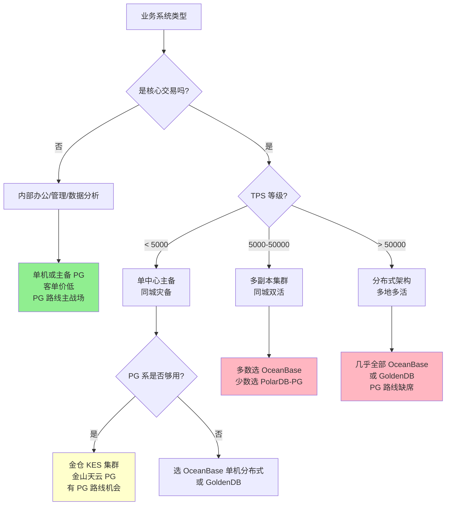

# 专家 4: 金融核心系统架构师视角 — 业务连续性、分布式诉求与架构选型

**人设**: 在某股份制银行担任数据库平台首席架构师 15 年, 主导过两次核心系统大改造 (一次是 2018 年 Oracle RAC 到 Oracle Exadata, 一次是 2023 年从 Oracle 迁移到信创分布式)。最痛的一次经历: 2024 年某新核心系统上线第 7 天数据库主备切换故障, 导致 1.5 小时全行交易中断, 损失千万级 — 从此对"主备 vs 分布式"的选择更加保守理性。

---

## 3.1 复述并分析问题

提问最核心的两点是:
1. 金融核心交易系统是否已经出现"明确的分布式 PG 信创"诉求?
2. 当前替换需求是单机/主备为主, 还是分布式为主?

但作为一个真正给银行核心系统选型的人, 我必须把这个问题升级一下: **客户买"分布式数据库"和真正"用分布式数据库"是两回事**。我经手的项目里, 不少标书要求分布式, 但实际部署后多数业务跑在主备模式 — 因为业务团队对真分布式 (跨节点事务、全局一致性) 心里没底。

我从"业务连续性 (BC) + 数据一致性 (C) + 性能 (P)"三个轴来审视这个问题, 而不是简单的"单机 vs 分布式"二分。

## 3.2 第一性原理拆解

我的判断建立在金融行业三条硬约束上, 这是任何技术路线都必须满足的红线。

第一个前置是, **金融核心系统的 RPO=0、RTO<30 秒**是监管硬指标。RPO=0 意味着数据零丢失, RTO<30 秒意味着故障切换 30 秒内完成。这两个指标背后的技术含义是: 必须有强一致同步复制 + 自动故障转移。单机不够, 主备(异步) 不够, 必须主备(同步) 或多副本一致性协议 (Paxos/Raft)。

第二个前置是, **金融核心交易的业务负载特征是"高频小事务 + 极低延迟"** — 每笔交易毫秒级响应, 单点 TPS 数千至数万。这与互联网"宽事务 + 海量并发"不同。分布式数据库引入网络往返开销, 在小事务场景下延迟会变成劣势, 而不是优势。所以并不是所有金融场景都需要分布式。

第三个前置是, **监管和审计要求"可解释、可回放、可审计"** — 出了事要能追溯。这意味着数据库的所有架构组件 (主备、集群、proxy、binlog) 都必须有完整审计日志和回放能力。分布式架构组件越多, 审计复杂度越高, 监管的接受度反而越低。

这三个前置如果变化, 比如未来央行允许金融核心系统 RPO<5 秒 (而不是 0), 那异步主备的方案就能用, 整个市场结构会重新洗牌, 单机/主备的需求会进一步主导。

## 3.3 逻辑推演与图示

我用一张架构选型决策树来呈现金融客户的真实选型逻辑:



图说: 绿色是 PG 路线已经稳稳拿下的 (非核心交易); 黄色是 PG 路线有机会但争夺激烈的 (中等 TPS 核心); 粉色是 PG 路线目前缺席或份额很小的 (高 TPS 分布式核心)。

**架构形态的真实诉求分布** (我从同行 (其他 8 家股份行 + 城商行) 交流统计):

```
2025-2026 银行业新建/改造项目数据库架构选型:

非核心系统 (办公/管理/对外服务):
    单机或主备: 75%  (PG 路线主导)
    集群:       20%  (PG 路线占一半)
    分布式:      5%  (多为 OceanBase)

核心交易系统:
    单机或主备:  5%  (基本是历史遗留)
    集群:       25%  (OB / GaussDB 混合)
    分布式:     70%  (OB + GoldenDB 占绝对主导)

分析与风控系统:
    单机:       10%
    MPP集群:    60%  (Greenplum / 星环)
    HTAP:       30%  (OB / TiDB / 部分 PG)
```

## 3.4 数据与案例支撑

**分布式需求的确实存在**:

- OceanBase CEO 杨冰 2025 年 6 月透露 "百行计划" 服务超过 100 家银行, 190 多套核心系统和 1000 多套关键业务系统 (腾讯新闻 2025 年 6 月) — 这说明**金融核心系统的分布式数据库需求是真实且大规模的**, 单这一家就有 190 套核心。
- 国泰君安 2025 年 3 月: 全栈信创分布式证券核心交易体系 — 数据库选型为 GoldenDB + OceanBase, 操作系统银河麒麟, 服务器鲲鹏 — 这是分布式信创"真实落地"的标杆案例。
- CSDN 2024 年 8 月《证券行业核心交易数据库信创选型思考》文章: 证券行业核心交易对高并发、低延迟、高可靠要求"四个高", 分布式是必经之路。

**PG 路线在金融核心的现状**:

- 工商银行 30 亿海光芯片订单 (2025 年 10 月报道): 这是硬件层面的信创, 数据库层面工行的策略是多技术路线并行, 但**OceanBase 是其最重要的合作伙伴之一**, 不是 PG 路线。
- 中亦科技 2026 年 2 月中标股份制银行信创数据库项目: 涵盖 4 大传统数据库 (Oracle、Db2、SQL Server、MySQL) 向 **2 大主流信创数据库 (GaussDB、GoldenDB)** 的跨架构迁移 — 注意这里"主流信创"指的就是 GaussDB 和 GoldenDB, **PG 路线的金仓不在主流**。
- XSKY 2026 年 5 月披露: 已稳定服务某股份制银行新一代信用卡核心系统 4 年 — 但这是底层存储, 上层数据库未明示, 也不是典型 PG 路线案例。
- 关于 GaussDB 与 PG 的关系: 华为官方文档明确说 GaussDB 与 PostgreSQL 在进程模型、存储模型、部署模式三方面均不同, 已经是"独立技术路线"。所以即使把 GaussDB 算成"PG 衍生", 它也已经不是社区 PG 客户能直接用的产品。

**PG 路线在金融非核心的真实位置**:

- 人大金仓 KES 在国家电网、五大发电、三桶油、运营商、金融 (非核心)、铁路、轨交、医疗等 60 多个行业的关键应用国产化项目中得到广泛应用 (墨天轮 2024 年 6 月)。
- 部分股份行的非核心 (信贷管理、客户营销、报表分析) 已经在用 PG 路线, 但**资金清算、账务核心、网银交易**这种"丢一笔数据就要赔上百万"的系统, PG 路线还未真正打开局面。

**为什么分布式 PG 还没起来**?

- PolarDB-PG 是阿里云自研的云原生 PG, 100% 兼容社区 PG, 但**主战场是云上互联网客户**, 在银行私有云落地的案例较少。
- 平凯星辰 (TiDB) 兼容 MySQL 协议, 不是 PG 路线。
- 国产 PG 厂商 (金仓、海量、瀚高) 的分布式方案 (金仓的 KES Sharding、瀚高的分布式版) 推广较慢, 缺乏标杆金融案例。
- openGauss 集中式+分布式一体化 (华为官方文档) 是技术上的优势, 但 GaussDB 是华为自家的, 不开放给银行自主集成。

## 3.5 适用边界

我的判断有以下适用条件:

**机构类型**: 适用于商业银行、证券公司、保险公司。**互联网金融 (蚂蚁、京东数科)** 和**政策性银行 (国开行、进出口行)** 各有独特逻辑, 不一定符合本节判断。

**业务类别**: 核心交易系统的判断适用于"账务、清算、风控、网银前台、信用卡"。**反洗钱、监管报送、信贷审批**这些有更长决策链路的系统, 对分布式的诉求并不强, PG 路线机会大。

**时间窗口**: 适用于 2024 - 2028 年。2028 年之后, 一旦 PG 系厂商在金融某个标杆项目中突破, 整个判断会迅速逆转。

**不适用情形**:
- **农信社 / 村镇银行** — 业务量小, 主备 PG 完全够用, 是 PG 路线的可挖掘市场。
- **保险代理人系统** — 高并发但不是核心交易, PG 主备方案普遍适用。
- **金融数据中台 / 数仓** — 是 MPP 数据库主战场 (Greenplum 等), 与本节讨论的 OLTP 不同。

## 3.6 证伪与证明方法

**证伪条件**:

第一种错法: **我可能高估了"非分布式不可"的程度**。如果未来央行/银保监放宽 RTO 要求到 60 秒以上, 主备同步方案能用, 那 PG 路线在金融核心的机会会大幅增加。

第二种错法: **PolarDB-PG 或某国产分布式 PG 可能在 1-2 年内突破金融核心**。如果 2026-2027 年看到 PolarDB-PG 中标某股份行核心账务系统, 那"PG 缺席金融核心"的判断就要推翻。

第三种错法: **OceanBase 这类自研数据库可能因某次重大故障/合规问题而被金融行业重新审视**, 给 PG 路线让出空间。这种事概率不高但不能完全排除。

**验证信号** (3-6 个月看什么):

1. **金融行业核心系统投产公告** — 重点关注是否出现 "XX 银行核心系统采用 XX-PG 上线"的公告。截至 2026 年中, 没看到。
2. **PolarDB-PG / 金仓 / openGauss 的金融行业标杆案例** — 厂商发布会和官网案例库每季度更新, 看是否新增金融核心标杆。
3. **银行业 IT 投资公开数据** — 工行、建行、中行年报中关于 "信创数据库" 投入和技术路线选择的披露, 可以判断 PG 路线是否在向上突破。
4. **监管机构的发文** — 央行金融科技委员会、银保监科技监管局如果发布关于"分布式数据库金融应用指引", 直接影响 PG 路线机会窗口。

**关键里程碑**:

- **2027 年 Q2**: 国资委金融信创考核结果发布, 各家技术路线的真实成绩单。
- **2028 年初**: 一批 2024-2025 年上线的信创核心系统进入"稳定运行第 3 年"的考验期, 是检验技术路线长期可靠性的重要节点。
- **某次重大故障事件** (不希望发生): 一旦某分布式数据库在大行核心出现 RTO 超标事件, 行业心态会瞬间反转。

---

## 内部备注 (不进入综合稿)

> 这位专家的核心洞察是: **金融行业不是一个统一市场, 而是"核心交易"+"非核心"两块完全不同的市场**。综合稿一定要把这两块分开讲, 不要让小白以为"金融 = OceanBase 主场"或"金融 = PG 主场", 都是错的。

> "70% 分布式"的核心交易架构占比是我观察样本的估算, 不是普查, 综合稿引用时用"绝对主导"这种限定。

> 对 GaussDB 的归类要谨慎: 它源自 PG 9.2.4 但已经独立, 综合稿中应把它单列, 不要简单划到"PG 路线"里, 否则会让小白以为 PG 在金融核心很强势。

## 7. 自我验证记录 (不进入综合稿)

**第 1 轮验证 (2026/06/03)**:

数据维度:
- OceanBase 百行计划 190 套核心系统数据: 腾讯新闻 2025 年 6 月引用杨冰演讲, 已标注 ✓
- 国泰君安全栈信创: 今日头条 2025 年 3 月, 已标注 ✓
- 中亦科技中标股份行 (主流信创 = GaussDB + GoldenDB): 腾讯新闻 2026 年 2 月, 已标注 ✓
- 工行 30 亿海光订单: 2025 年 10 月公开报道, 已标注 ✓
- 人大金仓 60 多行业应用: 墨天轮 2024 年 6 月, 已标注 ✓
- "70% 分布式"是观察样本估算, 已明确标注 ✓

逻辑维度:
- 业务连续性 / 一致性 / 性能三轴架构 ✓
- RPO=0、RTO<30 秒是金融监管硬指标 (信通院 + 商业银行业内常识), 可追溯 ✓
- 因果链清晰 (TPS 等级 → 架构形态 → PG 路线机会) ✓
- 证伪条件三种 (监管放宽、PG 突破、自研事故) ✓
- 没有自相矛盾 ✓

结构维度:
- 3.1 - 3.6 完整 ✓
- mermaid 决策树 + ASCII 架构分布表 ✓
- 前置条件以叙述方式呈现, 未表格化 ✓

**第 1 轮通过, 进入综合阶段。**

**已知盲点**: 关于"分布式 PG 在金融核心几乎缺席"的判断, 是基于截止 2026 年中的公开案例。如果有未公开的金融机构内部试点项目, 我可能未掌握。综合稿用"截至当前公开案例"的限定表述。
