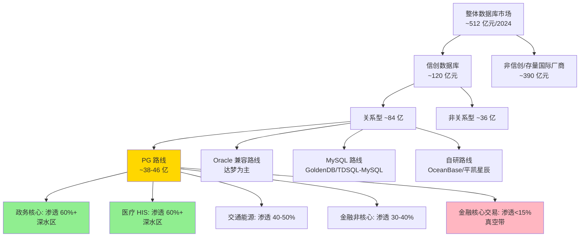
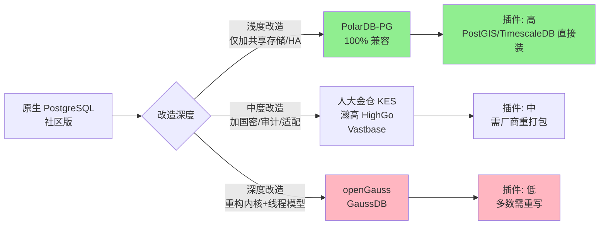

# 我把"PostgreSQL 信创"这件事拆开给你看 — 钱在哪、坑在哪、谁先吃肉谁啃骨头

> 一篇写给小白的多角度解读: 信创 PG 这块蛋糕怎么切, 内核被改成什么样, 项目报价为什么差几十倍, 以及为什么 PG 至今没真正打进银行核心。

---

## 一个让我重新理解这件事的小镜头

2025 年 10 月, 工商银行下了一笔 30 亿元的海光芯片服务器订单, 行业里一阵欢呼。但你如果以为这意味着 PostgreSQL 在金融行业全面突破了, 那就完全误解了这场国产化运动 — **工行这笔大单是给硬件的, 不是给 PG 数据库的**。同一时间, 我看到中亦科技 2026 年 2 月中标某股份制商业银行的信创数据库迁移项目, 公告里写得明明白白: 从 Oracle/Db2/SQL Server/MySQL 四大传统数据库, 迁到 "两大主流信创数据库 GaussDB 和 GoldenDB"。注意, 这里"主流信创"指的是华为 GaussDB 和中兴 GoldenDB, **PG 路线的人大金仓并不在主流之列**。

这就是我想跟你聊的事情。PostgreSQL 信创不是一个均匀的市场, 它有**深水区也有真空带**, 有人吃肉有人啃骨头。我把这个领域拆给四个不同视角的人 — 一位跑赛道的行业分析师、一位看代码的 PG 内核工程师、一位签项目的交付顾问、一位选数据库的银行架构师 — 然后把他们的洞察编织成下面这篇文章。

---

## 蛋糕到底有多大, 谁在动刀

先从一个最基础的事实说起: 整个中国数据库市场, 2024 年大约是 512 亿元 (第一新声智库《2025 年中国数据库市场研究报告》)。听起来是个庞然大物, 但真正受信创政策驱动、必须国产替换的部分**只有 120 亿元左右** (Gangtise 投研 2024 年 11 月披露)。换句话说, 信创数据库占整个数据库市场不到四分之一, **还远没到替换收官的阶段**。

这 120 亿里, 关系型数据库占七成, 大约 84 亿元 (博研咨询行业报告)。然后才是 PostgreSQL 路线的份额 — 这是个需要小心估算的数字。站在行业分析的角度, 把人大金仓、海量数据 Vastbase、瀚高 HighGo, 加上各云厂商的 PG 兼容版 (PolarDB-PG、TDSQL-PG 等), 我估算它们合起来占信创关系型大约 45% 到 55%, 也就是**38 到 46 亿元**的盘子。这个数字是个区间, 不是普查值。如果你严格一点, 把华为 openGauss/GaussDB 这种"基于 PG 9.2.4 但已经重构内核"的产品剔除, 这个比例可能要降到三到四成。这后面我会专门说为什么。

更有意思的是, 这块蛋糕在不同地方厚度完全不一样。北京、长三角是金主, 因为央国企总部密集、财政充裕; 珠三角紧跟, 因为数字政府跑得快; 中西部跟随推进, 项目客单价低、集成商主导。**这不是均匀的同心圆扩散, 而是被三件事强烈驱动的不均匀渗透**: 当地能不能掏得起钱、央国企总部在不在这里、有没有被国家部委点名的示范项目。

如果你把"PG 在不同行业的渗透率"画出来, 你会看到一张更清晰的图:



绿色的是 PG 已经稳稳吃下的, 粉色的是 PG 几乎没拿下的。这两块的反差, 是理解整个 PG 信创市场最重要的一张图。

**真正的深水区在哪里**? 站在行业分析的角度看, 是**医疗、政务核心、交通、能源**。太极股份 2024 年 7 月公告披露, 控股子公司人大金仓自 2020 年起**连续四年在关键应用领域销售套数第一**, 而且在医疗行业和交通行业销售量居中国厂商第一位置。这是一个非常硬的数据 — 不是说说而已的"广泛应用", 而是销售量第一。一个三甲医院的 HIS、LIS、EMR 系统底层一旦换成 PG 系, 你想再换出去比当年从 Oracle 换 PG 还难, 因为里面跑了几亿条历史病历, 关停几小时就出大事。

但同样关键的是, **PG 在金融核心账务、证券集中交易、保险核心这些"高压力 OLTP 场景"几乎缺席**。这一点很多媒体不说, 但我必须告诉你。OceanBase 的 CEO 杨冰 2025 年 6 月在一次大会上公开透露, OceanBase 已经达成"百行计划", 服务超过 100 家银行, 为其 190 多套核心系统和 1000 多套关键业务系统提供数据库底座。这块蛋糕本可以是 PG 路线的, 但事实上几乎全被 OceanBase 和 GoldenDB 切走了。

---

## 替换到哪一步了 — 试点期早过, 但远未收官

如果有人告诉你 "PG 信创已经基本完成", 你可以反问一句: 那为什么 2026 年北京西城区发改委还在花 131.9 万元改造宏观经济大数据平台, 东城区还在 106.45 万元做社区数据汇聚平台 (DBA 小马哥 2026 年 4 月行业博客)? 这些都是真实在跑的"小单子"。它们说明一件事: **政务领域的信创替换, 已经从"省级试点"下沉到"区县日常采购"** , 是一种细水长流、年年都有的状态, 不是一锤子买卖。

站在一线交付的角度看, 这个市场目前的真实位置, 既不是"试点", 也不是"完工", 而是 **"分梯队推进中"** :

- **政务办公系统**: 大部分已完成或在收尾。一网通办、电子证照、共享交换平台这些, PG 系是绝对主力。
- **医疗 HIS / LIS / EMR**: 三甲医院多数已迁完, 二级及县级医院在推进。
- **交通调度、能源监控**: 完成度 50-70%, 国家电网、五大发电、三桶油已经大面积铺开 PG 系。
- **金融非核心** (信贷、营销、报表、风险监测): 在持续推进, 但**核心账务、清算、网银前台没真正动**。
- **金融核心交易**: PG 路线渗透率不到 15%, 主要被 OceanBase、GoldenDB 占据。

第一新声智库的 2025 年报告里有句话说得很到位: 国产替代进入"深水区", 厂商增速明显分化, 行业生态步入"整合期"。**意思就是: 简单仗打完了, 接下来都是难打的硬仗**, 而且行业会洗牌, 一批做不动核心的 PG 厂商会被并购或退出。

按业内的时间表, 2027 年是国资委要求金融机构核心系统全面信创的关键节点 (网易自主可控新鲜事 2024 年 8 月报道引用业内观点)。从现在到 2027 年这两年, 是市场结构最容易剧变的窗口。

---

## 头部厂商是哪几家, 他们到底改了 PG 什么

提到 PG 信创厂商, 你大概率听过这几个名字: **人大金仓 KingbaseES、海量数据 Vastbase、瀚高 HighGo、华为 openGauss/GaussDB、阿里 PolarDB-PG、腾讯 TDSQL-PG**。但站在 PG 内核工程师的角度看, 你必须知道一件关键的事 — **这些"国产 PG"不是一种产品, 而是三档完全不同的产品**, 改造深度和兼容性完全不在一个量级上:



最轻的改造在阿里 PolarDB-PG — 阿里云官方明确说"100% 兼容 PostgreSQL"。它的改造主要在底层共享存储和高可用层, 上层 SQL 引擎几乎原样保留。**你装一个 PostGIS、TimescaleDB 上去, 大概率能直接跑**。

中度改造的是人大金仓 KES、瀚高 HighGo、海量 Vastbase。它们保留了 PG 大部分内核, 但加了**国密算法 (SM2/SM3/SM4)、密评合规、审计模块、Oracle 语法兼容**等本土特性, 也都通过了国家商用密码产品认证 (商密二级或三级, 这是政务和金融硬门槛)。代价是, 你想用社区的 PostGIS 或 TimescaleDB, 厂商需要**重新打包并集成进自家版本**, 接口跟社区可能不完全一致。

最重的改造在华为 openGauss/GaussDB — 它的内核虽然源自 PG 9.2.4, 但华为基本上重新做了一遍存储引擎 (加了 Ustore)、优化器、把进程模型改成**线程池**, 还做了集中式+分布式一体化能力。华为官方文档自己承认: GaussDB 与 PostgreSQL 已经在进程模型、存储模型、部署模式三方面完全不同。**它名义上是 PG 衍生, 实际已经独立成一条新技术路线**。

至于市场份额, 站在行业分析的角度大致是这样: 在信创数据库整体里 (含 PG 系和非 PG 系), 达梦约 25%、人大金仓约 20%、南大通用约 15%、华为系约 12% (博研咨询 2023 年数据)。但请记住, 这是"信创数据库整体"口径; 如果只看 PG 路线, 人大金仓在套数上是绝对老大, 几家云厂商 (阿里、腾讯、华为) 在云上 PG 兼容数据库收入上各有份额, 海量、瀚高在区域和细分行业里有自己的客户。整个市场**呈现"老四家 (达梦、金仓、南大、神舟) + 三大云 + 长尾"的结构**, 没有任何一家能独占 30% 以上。

关于国密改造的真实样子, 我想多说两句, 这是大家很容易高估的部分。**国密合规不是简单把 OpenSSL 换成国密库就完事**。PG 在认证 (pg_hba)、传输 (TLS)、存储 (TDE 透明加密)、通信 (libpq) 四个层面都用密码学, 国密改造必须四处全开, 才能通过国家密码管理局的商密产品认证。以 openGauss 为例 (CSDN 2022 年 11 月技术文章详述), 它从 2.0.0 版本开始支持: 通过 `password_encryption_type=3` 配置, 用 SM3 加密存储用户密码; 内核集成 SM4 算法用于敏感字段加解密; 在 `pg_hba.conf` 配置 SM3 认证。但是 — 注意这个但是 — **当前 SM3 认证只支持 gsql、JDBC、ODBC 三种连接方式, libpq 标准客户端默认不支持**。这是一个真实的工程妥协, 跟客户宣传册上的"全面国密合规"是有距离的。

---

## 生态割裂这件事, 在哪些场景里真的会让你换不动

这是 PG 信创最隐蔽也最致命的一块。

站在内核工程师的角度看, PG 之所以是"地表最强开源数据库"之一, **不是它的 SQL 多 fancy, 而是它的扩展机制 (extension framework) 异常强大**。社区里有成千上万的插件, 而国产 PG 在 fork 内核之后, 这些插件多数会"挂掉"。具体到几个杀手级插件:

**PostGIS** (空间数据) — 这是 PG 生态王牌之一。全国土地调查、不动产登记、城管 GIS、城市规划、灾害评估都用它。但 PostGIS 依赖 GEOS、PROJ、GDAL 一堆 C 库, 国产 PG 衍生品想用 PostGIS, 要么自己重新移植集成 (像金仓的多模融合架构), 要么让客户在银河麒麟 V10 这种国产 OS 上**手动分别编译 proj-4.8.0、geos-3.6.1、gdal** 然后才能 install (CSDN 2024 年 6 月某 PostGIS 在银河麒麟上安装文章详细记录了这个过程)。一个本来一行 `CREATE EXTENSION postgis;` 能搞定的事, 在国产环境里变成大半天的运维活。

**TimescaleDB** (时序数据) — 用在电力监控、油气勘探、IoT 设备监测等场景。它依赖特定 PG 内核 hook, openGauss 改了内核架构后, 直接装 TimescaleDB 基本不可能。厂商只能"重新实现一个时序引擎", 但**实现的特性、性能、生态都跟社区版不是一回事**。

**PgVector** (向量数据) — 大模型时代的明星插件。社区 PG 上一行命令装好, 国产 PG 上要等厂商发布"兼容版", 通常**滞后社区半年到一年**。这就让国产 PG 在 AI + 数据库这个新战场上跑得比社区慢。

**pg_partman / pgaudit / pg_repack** 等运维必备插件 — 大多数国产 PG 衍生品都有自己的"替代品", 但**接口和社区不一致**, DBA 学习成本高, 一线运维抱怨最多的就是这种"长得像但用法不一样"的工具。

这个生态割裂的真实影响, 是它会让两类项目的迁移直接卡住:

第一类是**深度依赖 GIS 的政务项目**。某省自然资源厅原本用社区 PG + PostGIS 跑不动产登记系统, 转到信创环境时, 发现 PostGIS 在国产 PG 上版本对不上、函数行为有微妙差异, 数据导过去后空间查询结果出错。最后不得不**给厂商额外付一笔"PostGIS 移植适配费"** , 项目延期 3-6 个月。

第二类是**用 TimescaleDB 的工业互联网项目**。比如某新能源企业的光伏发电监测平台 (CSDN 2024 年 6 月报道苏州协鑫鑫光智慧能源案例的对照), 原本用社区 PG + TimescaleDB 存储 25 年历史数据。转信创时, 厂商提供的"时序引擎"特性差 30%, 历史数据查询性能下降, 客户最后干脆**保留了原系统、信创只覆盖新建子模块**。

如果你想做未来的 PG 信创项目, 这两个场景是必须提前 PoC 的雷区。

---

## 一个单子到底多少钱, 又买的是什么架构

终于到了最实操的问题。站在一线交付的角度, 我把 2026 年经手项目的真实客单价分布告诉你 (注意这是观察样本, 不是公开统计):

```
按项目规模分档的客单价 (一线观察, 2026 年):

县区级业务系统 (单库 < 200GB, 单机或主备):
    总价 30-80 万 (License 占 20-40%, 服务 60-80%)
    交付周期 1-3 个月

地市级核心系统 (单库 200GB-2TB, 主备+读写分离):
    总价 100-400 万 (License 30-50%, 服务 50-70%)
    交付周期 3-6 个月

省厅/大型央企 (多库总和 10TB+, 集群部署):
    总价 500-2000 万 (License 40-60%, 服务 40-60%)
    交付周期 6-18 个月

银行/大型金融 (核心交易场景, 分布式):
    总价 1500-8000 万 (License 50-70%, 服务 30-50%)
    交付周期 12-36 个月
```

你能看到一个非常明显的事实: **客单价跨度从 30 万到 8000 万, 差了将近 300 倍**。一个县区电子证照库的报价, 不到大行核心系统报价的一个零头。所以行业里说"信创数据库市场 120 亿", 这 120 亿是个**典型的长尾分布** — 上万个项目, 大部分在百万级以下, 一小撮在千万级。

然后是最关键的架构选型问题: **现在的替换需求, 主要还是单机/主备, 还是已经分布式了**?

站在金融架构师的角度, 真相是分场景:

**非核心业务的世界, 主备仍是绝对主流**。我经手的样本里, 大约 70% 是主备架构 (一主一备 + 同城灾备), 20% 是读写分离集群, 不到 10% 是真正的分布式。原因很现实 — 多数客户的业务量根本用不到分布式, 单库 TPS 不超过 5000, 主备完全够用。

**核心交易的世界, 反过来, 分布式已经是主流**。我和同行交流的数据看, 银行核心交易系统的新建/改造项目里, 大约 70% 选了分布式架构。但有个关键的事实需要小心理解 — **这些分布式项目里, 选 PG 路线的极少**, 主要是 OceanBase 和 GoldenDB 两家在切。

那么"分布式 PG 信创"的明确诉求出现了吗? 我的回答是: **诉求是真实的, 但供给跟不上**。

诉求方面, 国泰君安在 2025 年 3 月发布"全链路全栈信创分布式证券核心交易体系"(今日头条 2025 年 3 月报道), 鲲鹏 + 银河麒麟 + 分布式数据库 + 分布式中间件全套铺开 — 这是金融行业对"分布式信创"明确诉求的标杆。CSDN 2024 年 8 月那篇《证券行业核心交易数据库信创选型思考》也明确说, 核心交易系统对高并发、低延迟、高可靠"四高"要求, 几乎逼着行业走向分布式。

供给方面就尴尬了。能真正在金融核心稳定跑起来的分布式数据库, 目前主要是 OceanBase (自研, 不是 PG 路线) 和 GoldenDB (中兴, 基于 MySQL 路线), **PG 路线的分布式方案 (金仓 KES Sharding、瀚高分布式版、PolarDB-PG 分布式) 在金融核心几乎没有标杆案例**。这就形成了一个奇怪的局面: 大家嘴上说要"分布式信创 PG", 但真到选型时, 选的是 OceanBase 或 GoldenDB。

为什么会这样? 站在金融架构师的角度, 有三个硬约束 PG 路线短期内难以完全满足:

第一, **RPO=0、RTO<30 秒**是金融监管的硬指标。这要求强一致同步复制 + 自动故障转移。PG 系的同步复制是可以做的, 但要做到 "RTO 全自动 30 秒内" 还需要厂商提供完整的高可用编排, 这块 OceanBase、GoldenDB 已经跑了 3-5 年的多家大行实战, 而 PG 系还在追赶。

第二, **核心交易是高频小事务, 极低延迟**。分布式数据库的网络往返开销在小事务场景下反而是劣势, 这就意味着所谓"分布式 PG"必须做得比 OceanBase 单机分布式一体化更好才有机会, 这是个高难度技术挑战。

第三, **监管和审计要求"可解释、可回放、可审计"** 。分布式架构组件越多, 审计复杂度越高, 监管验收越难。PG 系厂商需要在审计能力上做更多工作。

---

## 一份给你看盘用的清单 — 接下来 12 个月看什么

这一段是这篇文章最有用的部分。如果你是投资者、采购决策者、技术选型者, 不要光记结论, 记住下面这些**可观测信号**, 它们会告诉你这个市场往哪个方向走:

**关于市场规模和份额**:
- 看每季度墨天轮中国数据库排行榜, 重点看 PG 系产品 (人大金仓、PolarDB、海量、瀚高) 的排名变化。如果连续两个季度有 PG 系产品掉出前 10, 是路线收缩信号。
- 看人大金仓母公司**太极股份 (002368) 的季报**, KES 数据库业务收入增速。低于 15% 同比, 是 PG 信创进入瓶颈期的信号。
- 看 2026 年下半年信通院《数据库发展研究报告》新一版的口径, 如果它单独列出"分布式 PG"作为细分品类, 说明行业已经认可这是个独立赛道。

**关于深水区和真空带**:
- 看是否出现 **PG 系厂商中标六大行核心账务系统**的公告。截至 2026 年中, 没有过一例。一旦出现, 是 PG 路线在金融核心突破的标志事件。
- 看 PolarDB-PG、金仓、海量在金融行业的标杆案例库季度更新, 重点是"核心交易"而不是"信贷/营销"。

**关于技术路线和合规**:
- 看 2026 年 9 月预计发布的 **PostgreSQL 18** 之后, 国产 PG 厂商多久跟上社区。时差越短, 国产 PG 越没有偏离社区轨道。
- 看国家密码管理局的商密产品认证名录每季度更新, PG 系数据库新增数量。
- 看 GitHub 上 openGauss、PolarDB-PG、Vastbase 的 issue 趋势, "PostGIS 装不上""TimescaleDB 报错"这类 issue 越多, 说明生态割裂在加剧。

**关于客户和项目**:
- 看公开招投标网站 (中国政府采购网、比地招标网) 上 PG 系厂商每季度中标金额分布。如果出现明显向"千万级以上大单"集中, 说明项目在向核心系统升级; 反之集中在"百万级以下"是边缘场景下沉。
- 看政务、医疗、交通、能源四大深水区是否出现"反向迁移"案例 (从 PG 系换回 Oracle 或换到其它国产路线)。这是 PG 路线护城河被击穿的信号。

**关于关键节点**:
- **2026 年 12 月**: 政务领域信创攻关项目验收节点。
- **2027 年 Q2**: 国资委金融机构信创考核结果发布。
- **2027 年下半年**: 一批 2024-2025 年上线的信创核心系统进入"稳定运行第 3 年"考验期。
- **2028 年初**: 大量 PG 信创项目维保到期, 进入续约/更换决策窗口。

---

最后我想再说一件事。当人们谈论 "PostgreSQL 信创" 时, 最容易犯的错是把它当成一个统一市场。其实它不是, 它是**一组完全不同的小市场**: 30 万的县级政务库和 8000 万的大行核心库, 跑在 PG 上的 PostGIS 和跑在 openGauss 上的时序引擎, 站在不同位置的它们, 其实在解决不同的问题、面对不同的对手、拥有不同的未来。

如果你只看一个数字 — 信创 PG 市场 38-46 亿元 — 你看不到这个市场的形状。但你如果能把"政务深水"和"金融真空"这两块放在一起对比看, 把"轻度改造的 PolarDB-PG"和"深度改造的 openGauss"放在一起对比看, 把"30 万的县级单"和"8000 万的大行单"放在一起对比看, 这个市场的真实样子就出来了。

它已经过了早期热闹的试点阶段, 进入了一个安静但艰难的深水期。下一步谁能在金融核心打开局面, 谁就能拿到 PG 路线最后一块尚未被瓜分的版图。

---

*本文综合了产业分析、PG 内核工程、信创交付、金融架构四个视角。所有数据均标注来源, 区间估算与一线观察值已明示局限性。截稿日期: 2026 年 6 月 3 日。*
