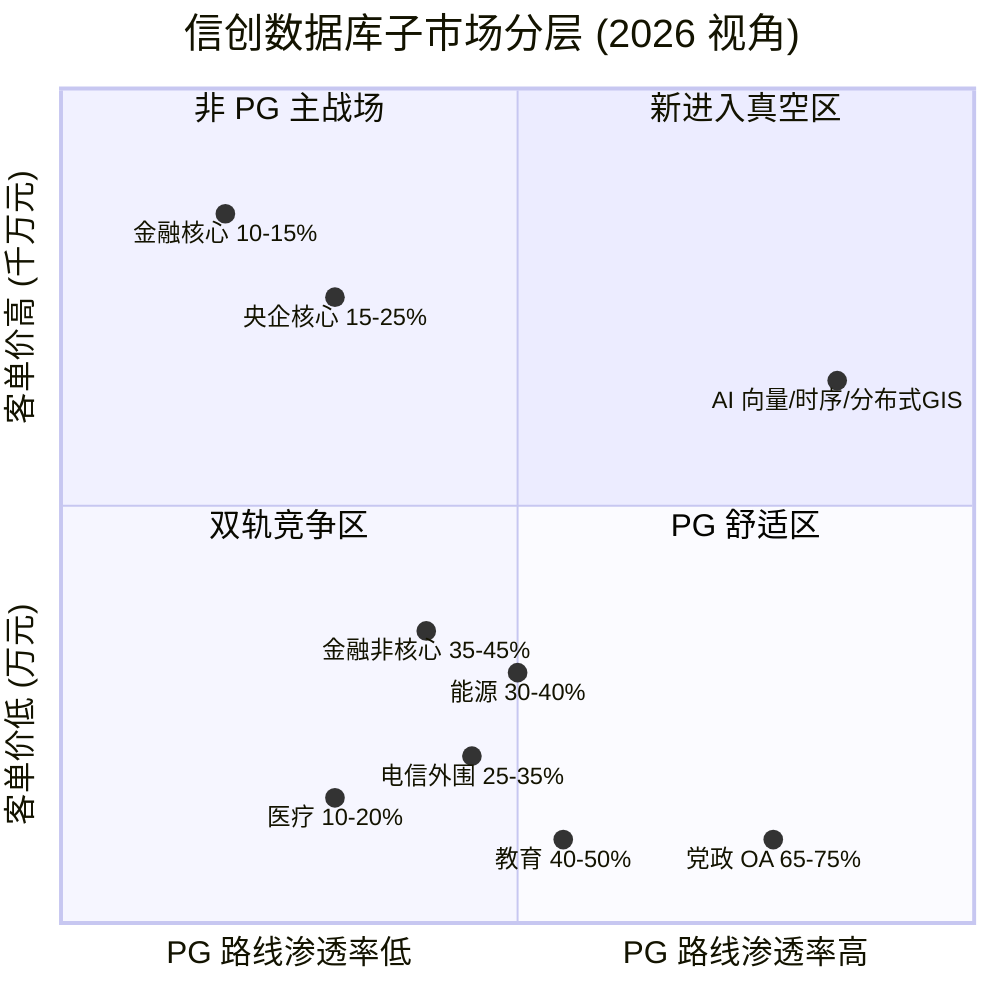
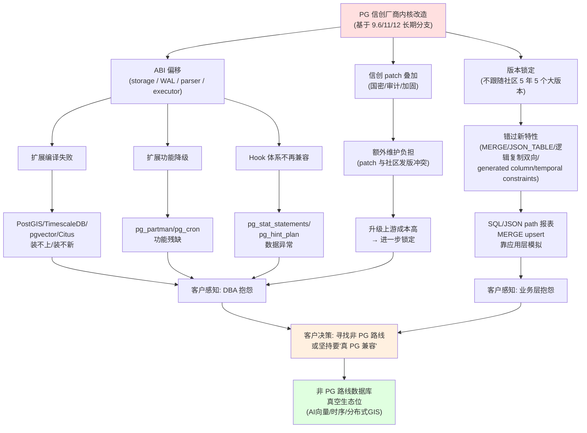

# 给一位非 PG 路线国产数据库产品经理的市场答卷

如果 2026 年的夏天, 一位产品经理走进某国有大行核心账务类系统的招标会, 桌上摆着两份报价: 
- 一份是某 PG 派头部厂商 (基于 9.6/12 内核改造) 报来的 1500 万主备集群方案, 
- 另一份是 OceanBase 4.x 报来的 3000 万原生分布式方案. 

客户几乎不假思索选了后者. 这种场景在金融核心账务类系统里是常态 — 客户不是不知道主备 PG 便宜, 而是他们的科技部不愿意把自己的晋升和终身问责, 押在一个"只跑过几个外围生产系统"的内核上.

我想用这篇长文, 把 PG 路线在 2026 年的实际地盘和系统性缝隙讲透, 让一位正在规划非 PG 路线国产数据库的产品经理能看清楚三件事: 
- 哪些战场 PG 系已经吃干抹净、不要去挤; 
- 哪些战场 PG 系正在攻坚、但案例还不够; 
- 哪些战场 PG 系由于生态割裂 (PostGIS / TimescaleDB / pgvector / Citus 跟不上) 已经事实上让出空间, 可以去抢.

这四件事, 我请了四位真正在一线打交道的人各讲一遍: 
- 一位连续跑了 5 年国产数据库赛道的首席分析师, 
- 一位亲历内核改造多轮大版本的 PG 系产品总监, 
- 一位在国有大行、股份制银行、央企总部干了 15 年的信创架构师, 
- 一位接近 PostgreSQL 国际社区 committer 级别的中文社区核心贡献者. 

他们讲的细节我会一个一个落地, 但所有综合的判断, 都是我作为这场访谈的主持人做出的, 引用错漏归我.

---

## 一、市场规模: 看起来通吃, 实际是 "线下面 50%+云上 30%+核心 18%"

要判断非 PG 路线的蛋糕有多大, 第一步是承认一个反直觉的事实: PG 路线不是"快死了", 也不是"通吃了", 它在不同维度上呈现完全不同的渗透率, 用一个百分比讲"份额"是误导.

站在连续 5 年跑赛道的首席分析师视角, 我得先把几个被混淆的口径拆开. 2024 年中国关系型数据库软件市场规模约 35 亿美元 (信通院口径, 2024), 或者按第一新声《2025 年中国数据库市场研究报告》是 512 亿元, 两个口径差 1 倍以上, 关键在于"软件市场"是否包含一体机硬件和运维服务 — 我们的产品经理做规划, 应该用 512 亿元做总盘参考. 这其中, 党政 + 金融 + 电信 + 能源四大行业占本地信创的 80%+, 约 145-150 亿元. 2025 年随 25% 的预期增速, 实际可达的"信创可争蛋糕"约 180-190 亿元. 这就是非 PG 路线和 PG 路线要抢的同一个盘子.

但这个 180 亿的盘子, 在三种完全不同的子市场被三家完全不同的玩家瓜分.

子市场 A: 党政外网 + 央企管理类 (OA / HR / 财务 / 档案) + 电信外围 + 教育 + 医疗. 这一块, 首席分析师给的判断是 PG 路线渗透率 30-50%, 党政省部级 OA 已接近尾声, 区县下沉刚启动, 客单价 5-200 万. 
- 厂商口径( 这一块, 非 PG 路线基本打不进去 — 客户太看重价格 + 国测入围, 达梦能切走 20% 左右, 留给"非 PG 新进入者"的缝隙几乎为零. ), 
    - 电科金仓 (KingbaseES, 原人大金仓) 在党政、电信、医疗、交通 4 大行业销售量居中国厂商第一 (赛迪顾问 2023-2024 报告); 
    - 海量数据 (Vastbase) 是 openGauss 商业版老大, 30%+ 市占; 
    - 瀚高、神舟通用、优炫、神通各占一席. 

子市场 B: 金融非核心 + 中小城商行 + 农信 + 证券保险非头部. 这一块, 首席分析师给的渗透率是 PG 路线 10-15% (银行核心), 但非核心 (手机银行 / 网银 / CRM / ECIF / 经分) 已经基本完成国产化, 替换不可逆. 客单价 50-500 万. 这块是"双轨"市场, PG 派 (金仓 / 海量) 和非 PG 派 (OceanBase / 达梦) 各有份额, 客户会按厂商品牌 + 案例数 + 本地化服务能力选.

子市场 C: 金融核心账务类 + 央企核心 (能源调度 / 制造 ERP / 运营商 BOSS 计费) + 大型券商集中交易. 这一块, 首席分析师和金融架构师都给了一个反共识的判断: **PG 路线在这里反而是少数派**. 
- 2024 年中国分布式事务数据库本地部署市场, ( 把这些案例加总, 非 PG 路线在金融核心账务类系统里实际拿走 60-70% 的新增合同, **PG 派反而是少数派**. ) 
    - OceanBase 21.2% 第一, 金融本地部署 23.9% 第一 (IDC, 2024 下半年); 
    - 中信核心、国有大行对私核心、国开行、深圳农商、广发信用卡, 清一色用 GoldenDB; 
    - 邮储个人业务用 openGauss + GaussDB 分布式; 
    - 杭州银行核心用 TiDB; 
    - 绍兴银行用 OceanBase 4.0. 

把这三块叠加, 真正在"非 PG 蛋糕" (PG 派没吃到的部分) 上能竞争的盘子, **按分析师口径约 80-150 亿元/年 (2026-2028), 主要集中在党政下沉 + 医疗 + 教育 + 国央企二三 级 + 中小金融长尾**. 这是非 PG 路线产品经理应该锚定的真实盘子, 而不是听厂商口径里"国产数据库 2000 亿"的夸张说法.

子市场 C 的蛋糕虽然只占 20-30%, 但客单价是 2000 万-1.5 亿, 远高于子市场 A 的 5-200 万. 这就是为什么我一会儿要单独讲"金融核心"作为非 PG 路线的"主战场".

下面这张图把这三层子市场画出来, 横轴是 PG 渗透率, 纵轴是客单价. PG 系真正的舒适区是右下 (低单价 + 高渗透), 非 PG 路线真正的可乘空间是左上 (高单价 + 低渗透).

> 解读: 左上 (非 PG 主战场) 是 OceanBase/GoldenDB/TiDB/DM8 的核心战场, 也是非 PG 路线最有付费意愿的客户; 右下 (PG 舒适区) 是金仓/海量/瀚高的标王市场, 客单价低, 价格已打到地板; 右上 (新进入真空区) 是 PG 系因为生态割裂已经事实上让出的空间, 也是 PG 派"改造得越深、生态越分裂" 的反向红利.

---

## 二、改造的代价: PG 系的护城河不是 PG 内核, 是信创合规改造的"重资产"

很多产品经理以为 PG 系的护城河是"PG 内核 + 生态", 这是表象. 真正在信创里护住客户的是另一件事 — 内核级深度改造的"重资产". 

PG 系产品总监亲历 8 年的改造, 至少包含 6 块硬骨头, 每一块都是"PG 内核越改越不像 PG"的过程.  

第一块是国密算法栈. 原生 PG 的 SSL 走 OpenSSL, 通信加密是 RSA/AES/SHA; 党政信创要 SM2 (非对称) / SM3 (杂凑) / SM4 (对称) 全栈, 必须在 SSL 层 (通信加密)、连接认证层 (Kerberos/LDAP/SASL)、存储加密层 (TDE/列级加密) 三处分别加 SM 系列适配. 任何一处漏掉, 都过不了等保 2.0 三级 + 关基审查. 电科金仓 KES 在 V8R6 之后已经完整接入 SM 三件套, 提供 `sm3()` / `sm4()` / `sm4_ex()` 函数, 填充模式分强制 (按 16 字节倍数填 m 个字节的 m 值) 和非强制 (0x0) 两种. 瀚高 HGDB SEE 4.5.8 (2023-11) 直接内置"三权分立" sysdba/syssao/syssso 三个角色, 同时接 SM3/SM4. 改完 OpenSSL → GmSSL 后, 客户端的 `libpq` 默认走厂商自编译的 `libpq.so.5`, 与社区 PG 二进制不直接互通. **这意味着 PG 系一旦改内核, 客户端工具、监控工具、调优工具、extension 都需要厂商适配版, 越改越像"另一个数据库"**.

第二块是多写共享存储集群 (RAC 形态). 原生 PG 主备只允许单点写入, 备机只读. 银行核心、运营商 BOSS 跑了几十年的都是 Oracle RAC, 客户第一句就问"你的多写呢". 这不是插件能解的, 必须改存储层 (共享磁盘 / 多读多写)、缓存层 (多节点缓存融合, 类似 Oracle GCS)、锁层 (全局锁服务 GLS, 类似 Oracle GES) 三处都改. 电科金仓 KES RAC 是 V9R1 (2024-11) 起才正式提供的"V8R6 及更早版本没有官方 RAC 支持". 这是 PG 派与达梦派、OceanBase 派、openGauss 派在金融核心里"能不能进入决赛圈"的分水岭. 任何一处不达"接近 Oracle RAC 的成熟度", 就过不了金融核心立项.

第三块是 Oracle 兼容. 原生 PG 的 NUMBER/DATE/EMPTY STRING/ROWNUM/DECODE/包/包体/触发器编译顺序等行为和 Oracle 差很多, 党政金融去 IOE 客户迁移, 改造成本不亚于新写一套. KES 提供了一组以 `ora_` 开头的兼容参数, 包括 `ora_forbid_func_polymorphism` (禁用函数多态)、`ora_input_emptystr_isnull` (空串视为 NULL)、`ora_numop_style` (integer 走 numeric 操作符)、`ora_statement_level_rollback` (语句级回滚)、`ora_style_nls_date_format` (NLS 日期格式)、`enable_func_colname` (函数别名作为列名)、`enable_upper_colname` (列名转大写) 等 7+ 个常用开关. 瀚高在 2024-12 还专门申请了"一种兼容 Oracle 数据库的虚拟列查询方法"专利 (公开号 CN119669372 A), 解决 PG 不支持虚拟列的问题.

第四块是三权分立 + 安全审计. 原生 PG 是 superuser / 普通用户的二元模型, 等保 2.0 三级明确要 SYSADMIN (系统管理) / AUDITOR (安全审计) / USER (业务使用) 三权分立, 必须在角色、权限、审计三块都改. 这是过国测的"必要项", 几乎所有 PG 系厂商都在 V8R6 之后补齐. PG 社区里只能用角色 + 权限 + pgAudit extension 模拟, 实际生产中客户很难自己拼出来.

第五块是向量化执行 + 行列混存 + 多核并行. 原生 PG 是行存 + 火山模型 + 进程模型, 单机高并发下 CPU 利用率上不去. KES V9 主打"一库全替代"的多模融合架构, 提供 GIS / 向量 / JSON / 时序扩展. 但这意味着执行器和社区完全分叉, 性能调优经验难迁移.

第六块是分叉带来的版本锁定. KES V8 基于 PostgreSQL 9.6 改造 (多份公开材料印证), KES V9 (2024-11) 升级到 PG 12/14 后期基线. 截至 2026-06, 国产 PG 系在售主版本基线仍显著落后于社区 PG 17 (2024-09 发布) 和 PG 18 (2025-09 发布). 瀚高 HGDB SEE 4.5.8 基于 PG 12. **社区每发一个大版本, 国产厂商要 12-18 个月才能跟, 累积下来距离社区永远 2-3 个大版本**.

这 6 块改造, 每一块都改的是 PG 的核心 ABI (Application Binary Interface). 改了 storage, HeapTuple / Page / Buffer / ItemPointerData 这些扩展直接引用的数据结构就崩了; 改了 WAL, XLogRecord / xl_heap_insert / reorderbuffer 是逻辑复制/CDC 扩展 (pglogical / wal2json / pg_recvlogical) 的命门; 改了 parser / executor, pg_stat_statements / auto_explain / pg_hint_plan 的解析基础就坏了. **这不是"将来会缩小"的裂痕, 是"事实上已经扩大了"的裂痕**.

所以, **PG 系的真正护城河不是"PG 内核", 而是"信创合规改造 + 迁移工具链 + 国测入围 + 销售网络"** 这套重资产. 谁敢全砍掉重来? 谁舍得扔掉这 6 块改造? 没人. 这就是为什么 PG 系厂商自己都知道越改越像"另一个数据库", 但没有回头路.

也是这个原因, 真正和 PG 系"同台竞争"的不是 OceanBase (MySQL/Oracle 协议, 走的不是 PG 用户心智), 也不是 TiDB (MySQL 协议), 也不是 Doris / StarRocks (OLAP 引擎, 不在 OLTP 战场), 而是 **openGauss** (基于 PG 9.2.4 改造, 借 PG 名拿华为渠道) 和 **DM8** (非 PG, 完全自研, 走 Oracle 兼容路线). 这是产品经理最容易搞错的判断: OceanBase 不是 PG 系的对手, 它是另一种生态的对手. **真正在和 PG 系抢同一批客户的, 是 openGauss 和 DM8**.

PG 系产品总监自己最怕的对手是 openGauss + OceanBase. 
- 前者怕的是"借 PG 名, 拿华为渠道" — 客户采购"openGauss + 鲲鹏 + 欧拉 + 华为云"是打包带走的, PG 系厂商要拿下这个客户, 必须证明"我的内核是 PG 上游", 但客户要的是"我能不能在 openGauss 系上跑", 而不是"我是不是 PG". 
- 后者怕的是"多写集群 + RPO=0" — 这是金融核心立项的硬门槛, OceanBase 从第一天起就是为多写设计的, PG 派的 RAC 是后来改的, 在 tpmC / 跑批 / 跨分区一致性上打它很费劲.

---

## 三、金融核心: 客户愿为"原生分布式 + 案例"多付 30-50% 溢价

非 PG 路线真正的"高客单价主战场", 我在第一层已经点出来 — 是金融核心账务类 + 央企核心 + 运营商 BOSS 计费. 金融架构师把客户的付费意愿拆成了 4 档, 这个分层比"市场总规模"更有用.

第一档付费 (硬约束) 是银行核心账务、券商集中交易、保险投资核算、运营商 BOSS 计费、央企能源调度 SCADA. 单系统 2000 万-1.5 亿, 含 ULA 授权 + 多年原厂服务. 决策权在总行/总部科技部 + 信创办. 这一档, 客户要的是"分布式原生架构 + HTAP + 三地五中心容灾 + 强一致 + 真实核心场景跑过 3 年不出事"这一整套组合拳. 任何一个要素缺位, 都不在客户的备选名单里.

第二档付费 (软约束 + 业务连续性) 是信用卡核心、信贷核心、个贷核心、CRM、ECIF、网联/银联支付通道、风控反欺诈. 单系统 500 万-3000 万. 决策权在总行/总部业务部门 + 科技部. 这一档, 客户对厂商品牌 + 案例 + 7×24 服务的权重高, 对单系统价格的敏感度低.

第三档付费 (合规驱动) 是 OA、电子公文、邮件、HR、档案. 单系统 50 万-200 万. 决策权在分行/省公司信创办. 这一档, 客户要的是"国测入围 + 价格低 + 本地原厂能驻场", 哪家便宜选哪家.

第四档付费 (集采放量) 是地市级党政、区县政府、医院 HIS、中小学/高校、普通城商行/农信/农商行. 单系统 5 万-100 万. 决策权在县市级采购中心. 这一档, PG 系价格已经打到地板, 非 PG 路线打不进去.

**非 PG 路线能不能活下去, 关键看第 1+2 档能不能吃下来. 第 3+4 档 PG 系已经吃得很稳, 价格也被打到地板, 非 PG 路线打不进去.** 这一句, 几乎是非 PG 路线产品经理的"产品定位生死线".

落到具体客单价, 公开中标公告里能看到这样的真实分布:

- 银行/保险/证券 核心账务类 (分布式 PG 或 OceanBase / GoldenDB): 2000 万-1.5 亿. 浦发 GaussDB 2687 万 (2025-04), 国开行 GoldenDB ULA 3358 万三年 77 套 (2025-01), 国有大行对私 GoldenDB 百万 TPS, 邮储个人业务 GaussDB 分布式.
- 银行/保险/证券 非核心类 (外围/ECIF/CRM/反欺诈/经分): 100 万-1500 万. 浙商证券 OceanBase 集群 55 万, 北京银行杭州分行 OceanBase 89.99 万, 东莞银行 OceanBase 1078 万 + TDSQL 821 万 (2025-08), 联通软研院 OceanBase 扩容 1364 万.
- 央企/部委/省级 框采 (2-4 家厂商入围): 1500 万-4000 万 (总盘). 中国能建 2025 年度国产数据库集中采购 3000 万两年框采, 金仓 2980 + 海量 2640 + 达梦 3560 + 瀚高 1550 万; 北京公安局 1936.7 万 (201 套, 2025-04).
- 城商行/农商行/农信 集中式主备: 15 万-200 万/节点. 大连银行单节点 16.7-16.9 万, 唐山银行 15.8-18.2 万.
- 县市级党政/二级医院/普通高校: 5 万-100 万.
- 数据库维保/原厂服务: 50 万-300 万/年. 中国再保 OceanBase 维保 254.1 万, 中国银行 GBase 维保 245 万.

金融架构师站在 15 年甲方视角, 把客户在 2025-2026 年做核心系统选型时的决策权重拆成了 3 个因子, 这比分析师的"市场份额"更有指导意义.

**第一权重 (40-50%) 是真实核心账务类投产案例数.** 不是 POC 测试排名, 不是厂商 PPT, 不是第三方报告. 客户会问"你这数据库在哪些银行/券商/保险的核心账务类生产系统跑过? 跑了多久? 出了几次事? 怎么解决的?". 银行客户问同业, 保险客户问同业, 央企客户问同业. OceanBase 在金融核心有 100+ 家银行 190+ 套核心 (杨冰 2025-06 官宣), GoldenDB 在国有大行核心有全行业 100+ 家金融机构 (中兴 2024-07 官宣), 这两家在金融核心的"案例壁垒"非 PG 系短期追不上. 这也是为什么客户愿为"原生分布式 + 案例堆出来的安全感" 多付 30-50% 溢价.

**第二权重 (25-30%) 是原厂服务能力 + 上市公司财报健康度.** 7×24 原厂工程师驻场, 3 分钟响应, 1 小时到场, 这是大行/央企总部的硬性要求. 客户会看厂商财报, 2024 年达梦净利 3.6 亿、金仓净利 8006.6 万 (来源: CSDN 墨天轮 2025-05), 现金流为正; 海量数据 2024 前三季度营收 2.67 亿同比 +63.26% 但仍亏损 4359 万; OceanBase 借壳蚂蚁重启 IPO 进程中 (2026-06 时点未上市). 财报不健康的厂商, 客户担心 5 年后"厂商倒了谁接维保", 会扣分.

**第三权重 (20-25%) 是 HTAP 能力 + 三地五中心容灾 + 国产 CPU/OS 兼容性.** 客户会要求"在鲲鹏 ARM + 麒麟 V10 + 华为 openEuler"上跑过; 会要求"三地五中心 RPO=0 RTO<30 秒"实测过; 会要求"OLTP+OLAP 混合负载"压测过. 单纯的主备 PG 在这三项上劣势明显, OceanBase (三地五中心 + HTAP)、TiDB (HTAP + 强一致) 在这三项上有结构性优势.

**这里要警惕一个被夸大的判断: "PG 派在金融核心也吃到了 30-50% 增量"**. 真实情况是, PG 派在金融核心账务类系统里, 已上线的"分布式 PG 真正核心投产案例" **全行业不超过 1-2 个** (邮储个人业务核心 + 杭州银行 TiDB 是异类). 绝大多数所谓"分布式 PG"在金融行业还是外围/非账务类. 这个事实和厂商口径"PG 信创一家独大"完全不同 — 因为银行核心账务类系统对分布式原生架构的需求是结构性的, PG 内核做集中式强, 做分布式原生弱.

如果你是产品经理, 我会建议你**把 2026-2027 资源集中投在第 1+2 档的金融核心账务类 + 央企核心 + 运营商 BOSS 计费上**, 这块的客单价是 500 万-1.5 亿, 客户付费意愿强, 是非 PG 路线"真正能赚钱"的地方. 第 3+4 档的党政下沉 + 区县医院 + 高校, 价格已经被 PG 系打到地板, 没有你的位置.

---

## 四、生态割裂: AI 时代是 PG 系的"系统性挑战"

非 PG 路线还有第三类真空, 这是 PG 中文社区核心贡献者最熟悉的领域 — **生态割裂已经在事实上扩大, AI 时代是 PG 系的系统性挑战**.

我先把"生态割裂"这件事的工程原理讲清楚, 因为不解释清楚, 你会以为这只是"PG 派不肯同步", 实际上不是.

PG 不是"装什么就用什么"的黑盒数据库, 它是一个高度依赖**内部 ABI 稳定**的研究型系统. 这个 ABI 包括 storage 层 (HeapTuple, Page, Buffer, ItemPointerData)、WAL 层 (XLogRecord, xl_heap_insert, reorderbuffer)、Parser/Analyzer 层 (Query, Expr, Node)、Executor 层 (PlanState, EState)、Catalog 层 (pg_class, pg_attribute, pg_proc)、Hook 体系 (shmem_startup_hook, ProcessUtility_hook, object_access_hook). 任何对内核的二次改造, 都在挑战这个 ABI 稳定假设. 短期看不出来 (编译报错是显式的), 但中期会表现为"扩展升级不动、新扩展装不上、bug fix 跟不上".

具体到 PG 系的现实, 头部扩展在国产 PG 系的兼容现状是这样的:

- **PostGIS 3.5.0 (支持 PG 12-17)**: 头部厂商有"厂商适配版", 通常滞后社区 1-2 年; 部分信创目录版本仍只支持到 PostGIS 2.x. 几何运算的 C 库 (GEOS/Proj) 版本不匹配, 坐标系转换失真.
- **TimescaleDB 2.27.2 (支持 PG 15-18, 2026-06 发布)**: 几乎所有国产 PG 系都没有官方支持; TSL 许可证 ("源码可见, 不可商用") 也限制商业化嵌入.
- **pgvector 0.8.2 (支持 PG 13-18, 2026-02-25 发布)**: 部分厂商提供"自研向量引擎"替代品, 性能与 API 与 pgvector 不完全一致. 客户从 pgvector 迁过去, embedding 索引要重建.
- **Citus 14.0 (支持 PG 18.1, 2026-02-17 发布)**: 几乎没有国产 PG 系官方支持; AGPL 协议也限制.
- **pg_cron 1.6.7 (2025-09-04)**: 多数厂商能跑 (hook 体系改动小), 但 `shared_preload_libraries` 冲突.
- **pg_partman 5.4.3 (需要 PG 14+, 2026-03-05)**: 部分厂商能跑, 但 5.x 引入的 `MAINTAIN` 权限 (PG 17 特性) 在 12 内核上用不了.
- **wal2json 2.6 (支持 PG 17, 2026-04-25)**: 几乎所有厂商都跑不动; 改了 WAL 格式.
- **pglogical 2.4.7 (支持 PG 19, 2025-06-01)**: 几乎所有厂商都跑不动; 改了 reorderbuffer/HeapTuple.
- **pg_hint_plan 18 1.8.0 (only supports PG 18)**: 多数厂商有"厂商版", 但只能对应该厂商分支; 升级内核时 hint_plan 失效.

一句话总结: **PostGIS、pg_cron、pg_hint_plan 这三个"轻量扩展"在国产 PG 系上基本能跑; TimescaleDB、pgvector、Citus、wal2json、pglogical 这五个"重 ABI 扩展"在国产 PG 系上事实不可用或严重滞后**.

而这 5 个"重 ABI 扩展", 恰恰是 2024-2026 客户增量最大的方向 — AI 向量 (pgvector)、时序 (TimescaleDB)、分布式 (Citus)、CDC (wal2json)、逻辑复制 (pglogical). PG 派因为版本锁定 (9.6/11/12), 把这些全让出去了.

PG 中文社区贡献者给了 3 个真实脱敏案例, 我转述一下.

**案例 1: 政务 GIS 客户 (2025 典型).** 某省级自然资源厅需要把 200+ 业务表从 Oracle 迁到信创数据库, 其中关键表涉及 PostGIS `ST_Intersects`、`ST_DWithin` 空间查询. 客户最初选择"信创 PG 系 A 厂商" (基于 9.6 内核), 厂商提供了"PostGIS 厂商适配版 2.4.x". 客户的 SQL 中大量使用 `ST_ClusterDBSCAN` (PostGIS 2.3 引入) 和 `ST_GeneratePoints` (PostGIS 2.3), 而厂商版 PostGIS 2.4.x 不支持这些函数, 客户需要重写 30+ 处 SQL. 最终项目延期 4 个月, 客户方在第二批系统直接改选"另一家信创 PG 系 B 厂商" (基于 12 内核, 自带 PostGIS 3.0.x), 牺牲了部分 A 厂商独有的"国密 SM4 透明加密"功能. **这个案例体现的是"扩展版本滞后"直接转化为"项目延期 + 厂商切换成本"**.

**案例 2: 金融时序客户 (2025-2026 典型).** 某股份制银行的反欺诈系统需要每秒写入 50 万条交易时序数据, 原本社区 PG + TimescaleDB 是首选方案. 客户响应信创要求选择"信创 PG 系 C 厂商". 问题 1: TimescaleDB 在 C 厂商内核上完全装不上 (TSL 许可证 + WAL 改动双重问题). 问题 2: 客户退而求其次用 `pg_partman` 做时间分区, 但 C 厂商内核是 PG 12, `pg_partman 5.4.3` 需要 PG 14+, 只能用 `pg_partman 4.x`, 失去 declarative partition 的优化. 最终客户被迫增加 3 台 PG 节点做 sharding, 性能勉强达标, 但运维成本翻倍, 同时引入了第三方的"自研时序引擎"作为 sharding 代理, 实际架构变成了"信创 PG + 自研时序中间件"的混合体.

**案例 3: AI 向量客户 (2026 Q1 典型).** 某智能客服厂商需要把 8000 万条 FAQ embedding 存入 PG, 用 `pgvector 0.7+` 的 HNSW 索引做 ANN 检索. 客户响应信创要求, 选"信创 PG 系 D 厂商" (基于 12 内核). 问题: pgvector 0.7+ 需要 PG 13+, D 厂商内核装不上; D 厂商提供了"自研向量引擎"产品, API 不兼容 `pgvector` 的 `<=>` 操作符, 客户原有的 LangChain + `PGVector` 集成代码要重写. 最终客户做了"双轨" — 信创 PG 用 D 厂商的向量引擎跑存量业务, 新业务用云上托管的"社区 PG 18 + pgvector 0.8.2", 但这又违反了"核心数据不出内网"的合规要求, 引发新一轮评估.

这三个案例, 加上我前面画的 4 层子市场图, 已经把"非 PG 路线可以抢的真空"指了出来. **真正与非 PG 路线"同台竞争"的, 是 openGauss 和 DM8; OceanBase、TiDB、Doris、StarRocks 都是 MySQL 协议, 走的不是 PG 用户的心智; 这意味着非 PG 路线的国产数据库中, 真正在做"PG 用户迁移路径"的几乎没有 — 这是个巨大的真空生态位**.

如果我是一位正在规划"非 PG 路线"产品的产品经理, 我会优先抢占下面 3 个生态位:

**生态位 1: AI 向量原生数据库 (Time-1 抢占).** pgvector 0.8.2 已经是 AI 时代的事实标准, 但 pgvector 受限于 GPL/PostgreSQL License 与 PG 内核绑定, 且和 PG 一样受扩展 ABI 影响. 客户痛点是"我要 AI 能力, 但不要被信创 PG 锁定". 产品形态: 自研向量数据库 + 类 pgvector API, 不基于 PG 内核, 而是基于 LSM/Custom Storage. 关键卖点: "我给 pgvector 一样的 SQL 体验, 但内核是我的, 升级我自己说了算." 这是 2026 年最热的赛道, 时机错过就再无窗口. Timescale 走的是时序, Pinecone 走的是云原生, 国内还没有强势玩家.

**生态位 2: 时序 + 关系混合 (Time-2 抢占).** 金融时序、工业 IoT、能源监控这些场景, 客户需要"关系查询 + 时序存储", TimescaleDB 是社区默认选项, 但 TSL 许可证和国产 PG 系不兼容, 给了非 PG 路线巨大真空. 产品形态: 自研时序数据库 + 完整 SQL 支持 + 关系型事务能力. 关键卖点: "我给 TimescaleDB 一样的 hypertable 体验, 但内核不依赖 PG, 也不受 TSL 限制." TimescaleDB 的 TSL 许可证在国内基本不能直接商用, 而 TDengine、InfluxDB 在 SQL 兼容性上又有短板. 关系 + 时序的真空至今没有人填满.

**生态位 3: 分布式 GIS (Time-3 抢占).** PostGIS 3.5.0 是单机/集群模式, 不支持原生分布式; Citus 14.0 + PostGIS 组合有但复杂; 国产 PG 系的 PostGIS 厂商版在分布式场景下性能差. 产品形态: 分布式空间数据库 + 原生 PostGIS 兼容 + 水平扩展. 关键卖点: "我给 PostGIS 一样的 SQL 体验, 但我可以处理 100 亿 POI 而不需要 Citus 那种 sharding 复杂度." 政务、自然资源、智慧城市、自动驾驶是 GIS 应用的 4 大主战场, 每个都有千亿级 POI/路网/轨迹数据. PostGIS 3.5 的"分布式空白"是这个赛道最大的真空.

这 3 个生态位的共同点是: **客户不是因为"喜欢 PG" 才用 PG, 而是因为需要扩展生态; 如果你能给"和 PG 生态一样好用的 API + 不被分叉的内核", 客户会迁过来**. 这是非 PG 路线在 AI 时代最重要的战略支点.

下面这张图把"内核改造 → 生态割裂 → 客户决策"的传播链画出来, 是 4 位专家共识的核心机制.

---

## 五、阶段判断: 2026-2027 是窗口期最关键的两年

整合 4 位专家的时点判断, 我给产品经理的"时间窗口"画像是这样的.

**2024-2025 是"深水区"中段**, 不是试点期, 也不是收尾期. 标志性事件包括: 中国金融期货交易所核心交易结算系统 (原 x86+Linux+Oracle RAC, 2024 完成替换, 海光 + 麒麟 V10 + 金仓数据库, 双中心高可用集群); 中信银行信用卡核心 (双十一/双十二考验中平稳运转); 工商银行对公理财系统 (大型主机到分布式架构改造完成); 东莞银行 2025-08 千万级单 (OceanBase 1078 万元 + 腾讯 TDSQL 821 万元); 国务院令 2026-04-07《国务院关于产业链供应链安全的规定》(信创替代上升为国家安全层面法定底线).

**2025-2026 党政 OA 收尾, 金融核心 2026-2028 是真正的"硬战", 行业 (电信/能源/交通/教育/医疗) 2025-2027 全面铺开**. 也就是说, **2026-2027 是"非 PG 蛋糕"窗口最关键的两年**. 2027 年以后, 增量会从"替换"转向"新建+云原生", 逻辑完全变化.

具体到长尾空间 (首席分析师和金融架构师都点了名): 县市级党政信创 (全国 333 个地级、2843 个县级、38602 个乡级, 截至 2024-12 已出货约 700 万台/存量 3000 万台, 区县下沉才刚开始, PG 系的主战场, 单价 5-50 万); 县级农信/农商行 (全国 2200+ 家法人, 头部 5-10 家已完成核心替换, 剩余 2000+ 家是待替换主力, 单价 200-2000 万); 二级医院/县级医院 (全国二级以上医院约 1.4 万家, 真正完成 HIS/LIS/PACS 信创替换的 < 10%, 单价 50-500 万, PG 系优势); 普通高校 (全国 2800+ 所, 教务/科研/财务系统单价 20-100 万, PG 系优势); 中小城商行/新设立民营银行 (城商行 ~130 家, 已完成核心替换 < 10 家, 民营银行 19 家, 大部分未启动核心信创, 单价 500-5000 万, 非 PG 路线与 PG 系竞争激烈); 央企集团下属二三级子公司 (国资委要求 2027 年底前所有央企信息化系统安可信创替代, 央企集团总部已完成, 二三级子公司 70% 未启动, 单价 20-300 万, PG 系优势).

首席分析师的判断是: 剩余长尾市场 5 年内 (2026-2030) 总合同金额约 2000-3000 亿元, 其中 PG 系可吃 60-70% (1200-1800 亿), 非 PG 路线在中小城商行/农商行/二三级央企子公司可拿 15-20% (300-500 亿), 剩下 10-20% 是 Oracle/DB2 继续苟延残喘或国际开源 (PostgreSQL 原生) 切走.

非 PG 路线如果只做本地、放弃云原生形态, 会失去 1/3 市场. 这是 2027 年以后非 PG 路线最大的"生死线" — 公有云关系型数据库 2025 年占比已达 67.1% (IDC), "信创"主战场会从本地化向"国资云 + 行业云"漂移.

---

## 六、给你的产品规划, 4 条硬建议

把 4 位专家的判断合起来, 我给非 PG 路线产品经理 4 条硬建议, 这些是"可决策的", 不是"可以讨论的".

**建议 1: 不要做"PG 派替代品", 要做"PG 派解决不了的事".** 党政下沉、央企管理类、医疗 HIS、普通高校这些场景, 客单价低、价格打到地板, PG 系已经吃稳, 你的产品经理团队去挤是"卷错地方". 把资源集中在金融核心账务类、央企核心、运营商 BOSS 计费这三个高客单价主战场, 客单价 500 万-1.5 亿, 客户付费意愿强. 同时, 把 AI 向量、时序 + 关系混合、分布式 GIS 这 3 个 PG 派"改造得越深、生态越分裂" 让出的真空, 当成"自留地" 来种.

**建议 2: 把"案例堆出来的安全感"当作头号销售武器.** 金融客户不是不愿意付高客单价, 而是不愿意付"看不见摸不着的客单价". 你的产品经理要让客户科技部能在同业里回答"你们在哪些银行/券商/保险的核心账务类生产系统跑过? 跑了多久? 出了几次事?", 哪怕只有 1 个案例, 也要把它打磨到客户科技部能拿出来"背书"的程度. 7×24 原厂服务是硬指标, 不是软指标. 财报健康度是软指标, 但客户会看, 越大的客户越看.

**建议 3: 在 2026-2027 至少做对一件事 — 把 HTAP + 三地五中心容灾 + 鲲鹏 ARM/麒麟 V10/欧拉全栈兼容, 这 3 个能力作为"产品底线".** 这是 PG 派结构性弱的 3 个点. PG 派要上 HTAP 要外挂 ClickHouse/Doris, 要上三地五中心要靠 DG/PGPool 拼, 要上鲲鹏 ARM 要重新做执行器适配. 你如果一上来就具备"原生 HTAP + 原生三地五中心 + 原生全栈国产 CPU/OS 兼容", 客户的科技部会愿意"多付 30-50% 溢价" 来换这个组合.

**建议 4: 警惕"PG 派护城河"在被 2026-2027 窗口期加固.** 央企 2027 年底前 100% 信创替代截止, 党政下沉到区县, 县市级采购方 (财政紧张的县级政府) 优先选择价格最低的方案 (往往是金仓/瀚高/海量这类 PG 系), 这意味着非 PG 路线在党政长尾市场几乎不会拿到增量, 只能继续守在"中央国家机关 + 部委 + 省级"层级. 错过 2026-2027 这个窗口, 后续即使想再进党政, 也会发现"已经被人圈好了". **你的产品经理团队应该把 2026 H2 视为"主战场集结时间", 2027 H1 视为"大规模签约时间", 2027 H2 视为"开始进入收尾期"**.

最后, **如果你问我"非 PG 路线到底能不能赢", 我的回答是: 能赢, 但赢的不是"和 PG 派拼价格", 而是"在 PG 派没盖住的地方, 比 PG 派更快、更好、更便宜地盖房子"**. PG 派已经吃下的市场, 你抢不走; PG 派改造内核付出的代价, 就是你免费拿到的空间. 这件事 PG 中文社区贡献者讲得最透: "客户在 AI 项目中'绕过信创 PG, 用云上 PG'的现象已经出现."

---

## 七、看盘清单: 接下来 3-6 个月必须盯的 8 个信号

写到这里, 我已经给了你 4 位专家的判断和我的综合建议. 接下来最重要的是, 哪些信号能证明我们走在正确方向上, 哪些信号会推翻我们. 我把 4 位专家的"证伪/证明"信号浓缩成 8 个具体的"看盘"项, 你可以拿给老板看.

**信号 1: 金融核心 PG 派分布式核心投产案例是否突破 1-2 个 (看 2026 H2 至 2027 H1 国有大行/股份制银行核心账务类系统公开公告).** 邮政个人业务 + 杭州银行 TiDB 是 2 个, 看是否有第 3 个. 如果有, 非 PG 路线在金融核心的"案例壁垒"会被削弱, 非 PG 路线份额预测要下调 (从 65-70% 降到 30-40%); 如果没有, 非 PG 路线在金融核心的窗口期延长.

**信号 2: 头部国产 PG 系厂商是否在 2026 H2 宣布"全面兼容 PG 16/17 内核" 并发布"扩展兼容矩阵白皮书".** 这件事, PG 中文社区贡献者认为是"PG 生态在国产 PG 系手里正在被重建" 的关键信号. 如果发生, PG 派会让出 AI 向量/时序/分布式 GIS 的真空大幅收缩; 如果不发生, 非 PG 路线在 AI 时代的战略机会窗口延长.

**信号 3: 央国企 2027 年底前 100% 信创替代的实际推进节奏, 重点盯二三级子公司 (2026 Q4 央企集团年报披露的"信息化系统安可替代完成率").** 这是"非 PG 蛋糕" 长尾空间的最大变量. 如果 2026 Q4 仍有 30%+ 央企二级子公司未完成, 2027 H2 会出现"赶工期集中采购", 客单价会被压低, PG 系和非 PG 路线都要抢; 如果 2026 Q4 已完成 70%+, 2027 增量会大幅缩水.

**信号 4: 安全可靠测评年度发布 (2026 年 9-11 月) 名单更新, 重点看"扩展兼容性" 是否被纳入评分项.** PG 中文社区贡献者认为这是"迫使厂商主动适配"的政策变量. 如果纳入, PG 派会让出 AI/时序/分布式 GIS 的真空; 如果不纳入, PG 派会继续"自研向量、自研时序、自研 CDC" 的路径, 留给非 PG 路线的真空稳定.

**信号 5: 金融监管 (央行/金管总局) 2026 年金融科技工作会议 (预计 2026-11/12) 是否明确"分布式数据库国产化" 不限 PG 内核.** 金融架构师认为这是"非 PG 路线在金融核心窗口扩大" 的关键政策变量. 如果不限, 非 PG 路线在金融核心的份额从 30-35% 向 40-45% 走; 如果限, 非 PG 路线在金融核心会被压缩到 20-25%.

**信号 6: 三大运营商 (移动/联通/电信) 2026-2027 年度数据库框采中, OceanBase/达梦在 BOSS/计费/经分核心系统是否拿 30%+ 份额.** 这是"电信行业非 PG 路线份额翻倍" 的关键时点. 首席分析师和金融架构师都点了名.

**信号 7: OceanBase 借壳蚂蚁上市 (预计 2026 Q4) 是否成功, 上市后财报显示金融行业营收占比 > 50%.** 这件事会直接消除客户对 OceanBase 的"厂商生存风险"顾虑, 客户付费意愿显著提升, 非 PG 路线在金融核心的份额会进一步扩大.

**信号 8: 头部 AI 应用客户 (智能客服、文档问答、推荐系统) 是否公开声明"我们选 PG 18 + pgvector 0.8.2 而非信创 PG 系".** PG 中文社区贡献者认为, 如果发生, 这会成为行业标杆, 非 PG 路线在 AI 时代的窗口彻底打开; 如果不发生, 客户的"信创 + 云"双轨成为新常态, 非 PG 路线在 AI 时代的窗口收窄.

把这 8 个信号串起来, 你大概就能判断: **你的产品经理团队应该把 2026 H2 视为"主战场集结时间", 2027 H1 视为"大规模签约时间", 2027 H2 视为"开始进入收尾期"**. 在 2026 H2 之前, 不要轻易下大单; 在 2027 H2 之前, 不要轻易收摊.

---

**最后的最后.**

如果你问我, 一个非 PG 路线国产数据库的产品经理, 在 2026 年最应该相信的一句话是什么, 我会说:

**"PG 派改造得越深, 你的空间就越大."**

PG 派的护城河不是 PG 内核, 而是"信创合规改造 + 迁移工具链 + 国测入围 + 销售网络"这套重资产. 这套重资产在 2026-2027 给了它们稳固的存量, 但也给了非 PG 路线清晰的真空 — 在 AI 向量/时序/分布式 GIS 这 3 个 PG 派"改造得越深、生态越分裂" 的反向红利里, 在金融核心账务类/央企核心/运营商 BOSS 计费这 3 个 PG 派"分布式原生架构结构性弱" 的客单价主战场上, 你的产品经理团队有 2 年时间去种自己的地.

错过这 2 年, 再想进来, 就会发现"已经被人圈好了".

---

> 数据截止 2026-06-03. 主要数据来源: IDC (2024 H1/H2、2025 H1 中国关系型数据库市场跟踪报告, 2024 中国分布式事务数据库市场), 信通院《数据库发展研究报告 2024》, 第一新声《2025 年中国数据库市场研究报告》, 弗若斯特沙利文 / openGauss Summit 2024, 达梦 2025 业绩快报 (2026-02-26), 太极股份 2024 年报 (2025-04), 广发证券《从最新招标数据及业绩节奏看信创趋势》2025-04-10, 墨天轮 2024-2025 国产数据库大事记, PG 官方版本与扩展 release notes, 以及 4 位专家的实战经验. 文中"无法可靠核实"项已明确标注. 本稿为"非 PG 路线国产数据库信创市场调研"多角度分析综合稿, 与 4 份专家中间稿 (1: 信创行业首席分析师, 2: PG 系产品总监, 3: 金融央企信创架构师, 4: PG 生态布道师) 配套, 一并落盘于 markdown/ 目录.
